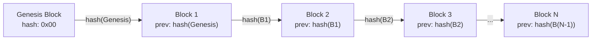
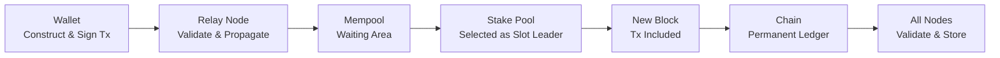

# Lesson #01: What is a Blockchain?

A blockchain is a distributed, append-only data structure that allows multiple participants to agree on shared state without a central authority. It chains together cryptographically linked blocks of transactions, producing an immutable ledger that no single party controls. In this lesson, we dismantle the hype and build a precise mental model of what a blockchain actually is, why it was invented, and how Cardano implements these ideas with design choices that matter to you as a developer.

By the end of this lesson, you will understand why blockchains exist, what problems they solve that traditional databases cannot, and the foundational architecture that every subsequent lesson builds upon.

## What Problem Do Blockchains Solve?

Blockchains solve the trust problem: they let participants who do not trust each other agree on a shared ledger of truth without any single party having control. Traditional systems centralize trust in one entity (a bank, a platform, a server operator), and that centralization introduces vulnerabilities.

In traditional web development, trust is centralized. When a user sends money through a banking app, both the sender and receiver trust the bank to update balances honestly. When you store data in a PostgreSQL database, your application trusts that the database server has not been tampered with. When two services communicate via REST APIs, they trust the authentication layer (OAuth, JWT) to verify identities.

This works remarkably well until it does not. Centralized trust introduces several vulnerabilities:

- **Single point of failure**: If the bank's server goes down, no transactions happen. If the database is corrupted, data is lost.
- **Single point of control**: The entity managing the system can unilaterally change the rules. A bank can freeze your account. A platform can delete your data.
- **Single point of trust**: Users must believe that the central authority is honest, competent, and will remain so indefinitely.

The fundamental question blockchain answers is: **Can a group of participants who do not trust each other agree on a shared ledger of truth, without any single party having control?**

This is not a new problem. Distributed systems researchers have studied it for decades under names like the "Byzantine Generals Problem." What Bitcoin (and later Cardano) achieved was the first practical, large-scale solution.

## What Is a Ledger?

A ledger is an ordered list of records that tracks events or transactions in sequence, ensuring all parties see the same consistent and durable information. Your bank statement is a ledger. A spreadsheet tracking inventory is a ledger.

The key properties of a useful ledger are:

1. **Ordered**: Events are recorded in sequence. Transaction A happened before Transaction B.
2. **Consistent**: All parties looking at the ledger see the same information.
3. **Durable**: Once recorded, entries are not lost.

In web2 systems, a ledger is typically a database table with timestamps and auto-incrementing IDs. A single server (or a primary-replica cluster) maintains it. The organization running that server is the source of truth.

A **distributed ledger** is a ledger maintained by multiple independent participants, none of whom has unilateral control. Every participant holds a complete copy, and they follow a protocol to agree on what gets added.

## How Do Blocks Batch Transactions?

Blocks batch transactions into discrete, cryptographically sealed units so the network can process them efficiently without requiring constant communication between all participants. Each block contains a header (with metadata and a hash linking it to the previous block) and a body (containing the transactions).

A block is a data structure containing:

```
Block {
  header: {
    block_number: 9821453
    timestamp: 2026-02-25T14:32:00Z
    previous_block_hash: "a4f2c8..."
    merkle_root: "7b3d1e..."      // fingerprint of all transactions
    block_producer: "pool1abc..."  // the stake pool that created this block
  }
  body: {
    transactions: [tx1, tx2, tx3, ... tx_n]
  }
}
```

Each block references the **hash of the previous block** in its header. This is the "chain" in "blockchain." If someone alters a transaction in block 100, the hash of block 100 changes, which means the reference in block 101 no longer matches, which invalidates block 101, and so on. Tampering with any historical block breaks the entire chain from that point forward.

This is the source of **immutability**. It is not that altering data is physically impossible; it is that altering data is immediately detectable and would require re-creating every subsequent block, which (as we will see in the consensus lesson) is computationally or economically infeasible.

## How Does the Chain Link Blocks Together?

The chain links blocks together through cryptographic hash references: each block header contains the hash of the previous block, forming an unbroken sequence from the genesis block to the most recent block. This structure makes the ledger append-only and tamper-evident.



The **genesis block** is the very first block. It has no predecessor. On Cardano, the genesis block was created on September 23, 2017 (the Byron era). Every block since then links back to it through an unbroken chain of hash references.

Key properties of this structure:

- **Append-only**: New blocks are added to the end. You never insert a block in the middle or delete one.
- **Tamper-evident**: Any modification to any block is immediately detectable by recalculating hashes.
- **Ordered**: The chain provides a total ordering of all transactions across all time. Transaction A in block 1000 definitively happened before transaction B in block 1001.

On Cardano's mainnet, a new block is produced approximately every 20 seconds. Each block can contain hundreds of transactions. As of early 2026, the chain contains millions of blocks.

## Who Runs a Blockchain Network?

A decentralized network of independent node operators runs a blockchain. On Cardano, anyone can run a node by installing the `cardano-node` software; there is no registration, no permission required, and no central authority deciding who participates.

Nodes serve two roles:

1. **Relay nodes**: Propagate blocks and transactions across the network. They ensure that when a new block is created, every participant receives it.
2. **Block-producing nodes (stake pools)**: Create new blocks according to the consensus protocol (Ouroboros, which we cover in Lesson 3).

As of 2026, Cardano has approximately 3,000 active stake pools operated by independent entities worldwide. No single entity (not even Input Output Global (IOG), the company that built Cardano) controls the network.

**Decentralization is a spectrum, not a binary.** A network with 3 validators is more decentralized than one with 1, but less than one with 3,000. Cardano's design specifically incentivizes decentralization through its reward-sharing scheme: if any single pool gets too large, delegators earn fewer rewards, naturally encouraging them to spread stake across more pools.

### Why Does Decentralization Matter for Developers?

As a web2 developer, you might wonder: "If decentralization makes everything slower and more complex, why bother?"

The answer lies in what you gain:

- **Censorship resistance**: No single entity can prevent a valid transaction from being processed.
- **Permissionless deployment**: You can deploy a smart contract without approval from any platform.
- **Guaranteed execution**: Once deployed, a smart contract executes exactly as written. No one can alter it.
- **Transparent state**: Every participant can verify the entire history. There is no hidden database.

These properties enable applications that are simply impossible on centralized infrastructure: decentralized finance (DeFi), verifiable credentials, transparent governance, and more.

## What Makes Blockchain Data Immutable?

Three mechanisms working together enforce immutability: cryptographic hashing (each block contains a hash of the previous block), distributed replication (every node holds a complete copy), and the consensus protocol (which makes rewriting history economically irrational).

Immutability has profound implications:

- **Mistakes are permanent**: If you send ADA to the wrong address, there is no "undo" button. No administrator can reverse the transaction.
- **History is auditable**: Every transaction ever made on Cardano is publicly verifiable. You can trace the movement of any token from its creation.
- **Data storage is forever**: Anything written to the chain persists as long as the network exists.

For developers, this means a fundamental shift in thinking. In web2, you routinely UPDATE and DELETE records. In blockchain development, you only INSERT. Corrections are made by adding new transactions that supersede old ones, not by modifying history.

## What Is Byzantine Fault Tolerance?

Byzantine Fault Tolerance (BFT) is the ability of a distributed system to function correctly even when some participants are actively malicious, not just offline but deliberately lying. The concept originates from the Byzantine Generals Problem, formulated by Leslie Lamport, Robert Shostak, and Marshall Pease in 1982.

In blockchain terms:

- **Generals** = nodes in the network
- **Battle plan** = the next block to add to the chain
- **Traitors** = malicious nodes that might try to create fraudulent blocks or disrupt consensus

Cardano's Ouroboros protocol provides BFT as long as the majority of stake (measured in ADA) is controlled by honest participants. Specifically, the protocol is secure as long as at least 51% of the staked ADA is held by honest actors. Given that ADA is valuable and stake pool operators have economic incentives to be honest, this assumption has held since the network's inception.

This is a stronger guarantee than most web2 systems provide. Traditional distributed databases (using Raft or Paxos) tolerate crash failures but not Byzantine failures; they assume all nodes are honest but might go offline. Blockchain assumes some nodes are actively adversarial.

## What Makes Cardano's Architecture Unique?

Cardano separates its functionality into distinct layers and uses a unique accounting model, native token support, and on-chain governance. These design choices differentiate Cardano from other blockchains and directly affect how you build applications.

### Layered Architecture

Cardano separates its functionality into two layers:

- **Cardano Settlement Layer (CSL)**: Handles ADA transactions and accounting. This is where value transfer happens.
- **Cardano Computation Layer (CCL)**: Handles smart contract execution (Plutus scripts). This is where programmable logic lives.

This separation allows each layer to evolve independently and provides cleaner security properties.

### Extended UTXO Model

Unlike Ethereum's account-based model, Cardano uses an **Extended UTXO (eUTXO)** model for tracking value. We dedicate all of Lesson 4 to this, but the key point is: Cardano tracks individual "coins" (unspent transaction outputs) rather than account balances. This has significant implications for how you design applications.

### Native Tokens

On Cardano, custom tokens (fungible and non-fungible) are **native**; they live on the settlement layer alongside ADA, not inside smart contracts. This means tokens inherit all the security properties of ADA itself, without requiring smart contract execution for basic transfers.

### Governance

Cardano is moving toward on-chain governance where ADA holders vote on protocol changes. This is part of the Voltaire era and represents a level of decentralized decision-making that has no parallel in web2 systems.

## How Does Data Flow Through the Cardano Network?

When you submit a transaction on Cardano, it travels from your wallet through relay nodes, enters a mempool, gets selected by a stake pool for inclusion in a block, and then propagates to all nodes for validation and permanent storage. The entire process typically takes 20 to 60 seconds.



Here is the step-by-step process:

```
1. You construct a transaction (send 100 ADA to addr_test1...)
2. You sign it with your private key
3. Your wallet submits it to a relay node
4. The relay node validates the transaction:
   - Is the signature valid?
   - Do the inputs (UTXOs) exist and are they unspent?
   - Are the fees sufficient?
5. If valid, the relay propagates it to other relay nodes
6. The transaction sits in a "mempool" (waiting area)
7. A stake pool is selected to produce the next block
8. The stake pool includes your transaction in the new block
9. The block is propagated to all nodes
10. Each node validates the block and adds it to their chain
11. Your transaction is now part of the permanent ledger
```

From submission to inclusion in a block typically takes 20 to 60 seconds on Cardano. After a few more blocks are added on top, the transaction is considered final with extremely high confidence.

## What Are Common Blockchain Misconceptions?

Many newcomers carry misconceptions about blockchains that can lead to poor design decisions. Here are the most common ones, clarified directly.

**"Blockchain is just a database."**
A blockchain is a very specific type of data structure with properties (decentralization, immutability, permissionless access) that traditional databases deliberately avoid because they add overhead. Use a database when you trust the operator. Use a blockchain when you need trustless coordination.

**"Everything should be on the blockchain."**
Blockchain storage is expensive and slow compared to traditional storage. Store only what needs to be verifiable and immutable on-chain. Use off-chain storage (IPFS, traditional databases) for everything else, with on-chain hashes as anchors.

**"Blockchains are anonymous."**
Cardano (like Bitcoin) is **pseudonymous**, not anonymous. Transactions are public. Addresses are visible. While addresses are not directly linked to real identities, patterns of usage can often be analyzed. Never assume blockchain transactions are private.

## Web2 Analogy

Let us map every major blockchain concept to something you already know from web2 development:

| Blockchain Concept | Web2 Equivalent | Key Difference |
|---|---|---|
| **Distributed ledger** | Replicated database (PostgreSQL with read replicas) | No single primary node; all nodes are equal peers |
| **Block** | Database transaction batch / write-ahead log segment | Blocks are cryptographically linked and immutable |
| **Chain of hashes** | Git commit history | Git allows rebasing and force-pushing; blockchain does not |
| **Node** | Application server | Nodes are permissionless; anyone can run one |
| **Mempool** | Message queue (RabbitMQ, SQS) | Mempool is local to each node; not guaranteed to process in order |
| **Consensus** | Leader election (Raft/Paxos) | Blockchain consensus tolerates malicious actors, not just crashes |
| **Immutability** | Append-only event log (Kafka, event sourcing) | Blockchain immutability is cryptographically enforced across all participants |
| **Smart contract** | Serverless function (AWS Lambda) | Once deployed, no one can modify or delete it |
| **Genesis block** | Database migration #001 | There is exactly one, and it defines initial state |

**The Git analogy is especially powerful.** Think of a blockchain as a Git repository where:
- Every commit references its parent (like blocks reference previous blocks)
- The history is append-only (no force push, no rebase, no squash)
- Every developer has a full clone (distributed replication)
- Merging (consensus) happens automatically by protocol, not by human decision
- The repository is public and anyone can clone it

## Key Takeaways

- **A blockchain is a distributed, append-only ledger** maintained by a network of independent nodes that follow a shared protocol to agree on state.
- **The "chain" comes from cryptographic hash linking**: each block contains the hash of the previous block, making tampering detectable and infeasible.
- **Decentralization removes single points of failure and control**, enabling applications where no single party can censor, alter, or shut down the system.
- **Immutability is a feature, not a limitation**: it provides auditability, predictability, and trust without requiring a trusted intermediary.
- **Cardano specifically** uses a layered architecture, the Extended UTXO model, and native tokens; design choices that differentiate it from other blockchains and affect how you build applications.

## What's Next

Now that you understand what a blockchain is and why it exists, the next lesson explores the cryptographic building blocks that make it all work. Hash functions, Merkle trees, and digital signatures are the mathematical foundations that turn the theoretical properties we discussed (immutability, tamper-evidence, identity verification) into concrete, enforceable guarantees.
