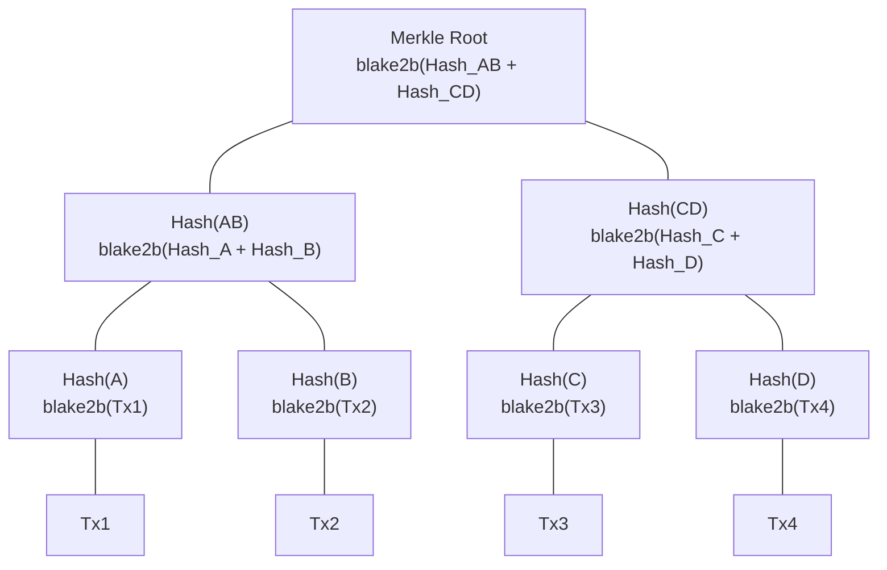

# Lesson #02: Cryptographic Primitives

Cryptographic primitives are mathematical functions with special properties that make it computationally infeasible to cheat, and they form the security foundation of every blockchain transaction. In the previous lesson, we described blockchain properties like immutability and tamper-evidence. This lesson reveals the concrete tools that enforce those properties: hash functions, Merkle trees, and digital signatures.

You will understand not just what these primitives do, but why Cardano chose specific algorithms (Blake2b, Ed25519) and how these choices affect performance, security, and the developer experience.

## What Is a Cryptographic Hash Function?

A cryptographic hash function takes an input of any size and produces a fixed-size output (the "hash" or "digest") such that the same input always produces the same output, but even a tiny change in input produces a completely different hash. Hash functions are the most fundamental building block in blockchain security.


### What Properties Must a Cryptographic Hash Function Have?

Not all hash functions are cryptographic. A cryptographic hash function must satisfy these properties:

**1. Deterministic**: The same input always produces the same output.
```
hash("Hello, Cardano") = "8a3b2c..." (always, every time, on every computer)
```

**2. Fixed output size**: Regardless of input size, the output length is constant.
```
hash("a")                    = "4a3b2c..." (32 bytes)
hash("entire works of Shakespeare") = "7f2d1e..." (32 bytes)
```

**3. Pre-image resistance**: Given a hash output, it is computationally infeasible to find the original input. You cannot "reverse" a hash.
```
Given: "8a3b2c..."
Find:  ??? such that hash(???) = "8a3b2c..."
This should require approximately 2^256 guesses (more than atoms in the universe).
```

**4. Second pre-image resistance**: Given an input and its hash, it is infeasible to find a different input that produces the same hash.
```
Given: "Hello, Cardano" -> "8a3b2c..."
Find:  some_other_input such that hash(some_other_input) = "8a3b2c..."
This should be computationally infeasible.
```

**5. Collision resistance**: It is infeasible to find any two different inputs that produce the same hash.
```
Find: input_A and input_B where input_A != input_B
      but hash(input_A) = hash(input_B)
This should require approximately 2^128 operations (birthday bound).
```

**6. Avalanche effect**: A small change in input produces a drastically different output.
```
hash("Hello, Cardano")  = "8a3b2c4d..."
hash("Hello, cardano")  = "f17e9a2b..."  (completely different!)
```

### Why Does Cardano Use Blake2b Instead of SHA-256?

**SHA-256** (Secure Hash Algorithm, 256-bit) is the hash function Bitcoin uses. The NSA designed it and NIST standardized it. It produces a 256-bit (32-byte) digest and is extremely well-studied.

**Blake2b** is a newer hash function that Cardano uses extensively. Jean-Philippe Aumasson and colleagues designed it, based on the BLAKE hash function (a SHA-3 competition finalist). Cardano specifically uses Blake2b-256 (256-bit output) for most hashing needs and Blake2b-224 (224-bit output) for address generation.

| Property | SHA-256 | Blake2b-256 |
|---|---|---|
| **Speed** | Slower in software | 2-3x faster in software |
| **Security margin** | Well-established | Comparable security, based on ChaCha stream cipher |
| **Parallelism** | Sequential internal structure | Designed for parallelism |
| **Flexibility** | Fixed configuration | Configurable output length, keyed hashing, personalization |
| **Hardware optimization** | Efficient in dedicated ASICs | Efficient in general-purpose CPUs |

Blake2b's speed advantage matters because hashing occurs constantly in blockchain operations (validating blocks, verifying transactions, computing addresses). Faster hashing means faster validation, which means higher throughput.

### Where Does Cardano Use Hashing?

Hash functions appear everywhere in Cardano's architecture:

1. **Block header hashing**: Each block header is hashed, and the resulting digest is included in the next block's header. This creates the chain.

2. **Transaction IDs**: Every transaction on Cardano is identified by the hash of its serialized content. The transaction ID (TxId) is a Blake2b-256 hash.

3. **Address generation**: Cardano addresses are derived by hashing public keys with Blake2b-224, then encoding the result.

4. **Script hashing**: Smart contract scripts (Plutus validators) are identified by the hash of their compiled code. This hash becomes the script address.

5. **Datum hashing**: Data attached to UTXOs can be stored as hashes (datum hashes) to save on-chain space.

6. **Policy IDs**: Minting policies for native tokens are identified by the hash of the policy script.

```
Transaction                    Block Header
+-----------+                  +--------------------+
| inputs    |                  | block_number       |
| outputs   |  hash(tx) ->     | previous_hash      |
| fee       |  TxId            | merkle_root        |
| metadata  |                  | slot_leader        |
+-----------+                  +--------------------+
                                        |
                               hash(header) -> included in next block
```

## How Do Merkle Trees Enable Efficient Verification?

A Merkle tree organizes transaction hashes into a binary tree structure where each leaf contains a transaction hash, each internal node contains the hash of its two children, and the root (stored in the block header) represents all transactions in a single 32-byte fingerprint. This structure enables logarithmic-time membership proofs.



### How Are Merkle Trees Constructed?

Suppose a block contains four transactions: Tx1, Tx2, Tx3, Tx4.

Construction process:

```
Step 1: Hash each transaction individually
  Hash(A) = blake2b(Tx1)
  Hash(B) = blake2b(Tx2)
  Hash(C) = blake2b(Tx3)
  Hash(D) = blake2b(Tx4)

Step 2: Hash pairs of hashes together
  Hash(AB) = blake2b(Hash(A) + Hash(B))
  Hash(CD) = blake2b(Hash(C) + Hash(D))

Step 3: Hash the pair of pairs
  Merkle Root = blake2b(Hash(AB) + Hash(CD))
```

The **Merkle root** is a single hash that represents all transactions in the block. It is stored in the block header.

### Why Do Merkle Trees Matter?

**Efficient verification**: To prove that Tx3 is included in a block, you do not need to download all transactions. You only need:

```
Proof that Tx3 is in the block:
  - Hash(D)   (sibling of Tx3's hash)
  - Hash(AB)  (sibling of Hash(CD))

Verification:
  1. Compute Hash(C) = blake2b(Tx3)
  2. Compute Hash(CD) = blake2b(Hash(C) + Hash(D))
  3. Compute Root = blake2b(Hash(AB) + Hash(CD))
  4. Compare computed Root with the Merkle Root in the block header
```

This is called a **Merkle proof** (or Merkle inclusion proof). For a block with N transactions, you only need log2(N) hashes to verify membership. In a block with 1,000 transactions, you need only about 10 hashes instead of all 1,000.

**Tamper detection**: If any single transaction is modified, its hash changes, which changes its parent hash, which propagates up to the Merkle root. The root in the block header would no longer match, immediately revealing the tampering.

**Light client support**: Merkle proofs enable lightweight wallets that do not store the full blockchain. A light wallet can verify that a specific transaction exists without downloading every transaction in every block. It only needs the block headers and the Merkle proof path.

### How Does Cardano Use Merkle Trees?

Cardano uses Merkle trees in several contexts:

- **Transaction verification**: The transaction Merkle root in each block header allows efficient verification of transaction inclusion.
- **Stake distribution snapshots**: Merkle trees efficiently represent the distribution of stake across all addresses at epoch boundaries.
- **Script data**: Merkle trees can commit to large datasets while storing only the root on-chain, with off-chain proofs for individual elements.

## How Do Digital Signatures Prove Identity?

A digital signature scheme lets someone sign a message with a private key so that anyone can verify that signature using the corresponding public key. Digital signatures provide three guarantees: authentication (the signature proves the message creator held the private key), integrity (any modification invalidates the signature), and non-repudiation (the signer cannot deny having signed).


### How Do Digital Signatures Work Conceptually?

A digital signature scheme has three operations:

```
Key Generation:
  (private_key, public_key) = generate_keypair()
  // private_key: kept secret, used to sign
  // public_key: shared publicly, used to verify

Signing:
  signature = sign(message, private_key)
  // Only someone with the private_key can produce this

Verification:
  is_valid = verify(message, signature, public_key)
  // Anyone with the public_key can verify
  // Returns true if the signature is authentic
```

The mathematical relationship between the keys ensures that:
- Only someone with the private key can produce a valid signature
- The public key can verify the signature without revealing the private key
- The signature is bound to the specific message; it cannot be transferred to a different message

### Why Does Cardano Use Ed25519?

Cardano uses **Ed25519**, an implementation of the Edwards-curve Digital Signature Algorithm (EdDSA) using Curve25519. Daniel J. Bernstein and colleagues designed Ed25519 with explicit performance and security goals.

| Property | Ed25519 | ECDSA (used by Bitcoin/Ethereum) |
|---|---|---|
| **Key size** | 32 bytes (private), 32 bytes (public) | 32 bytes (private), 33 bytes (public, compressed) |
| **Signature size** | 64 bytes | ~72 bytes (DER encoded) |
| **Speed** | Very fast signing and verification | Slower |
| **Deterministic** | Yes (same message + key = same signature) | Requires a random nonce (source of many bugs) |
| **Side-channel resistance** | Designed to resist timing attacks | Vulnerable if implemented carelessly |
| **Batch verification** | Efficient batch verification possible | Not natively supported |

Ed25519's deterministic signing is a significant security advantage. With ECDSA (used by Bitcoin and Ethereum), signing requires a random number (nonce). If the random number generator is flawed, the private key can be extracted from signatures. This has caused real-world key compromises. Ed25519 eliminates this entire class of vulnerabilities by deriving the nonce deterministically from the message and private key.

### How Do Signatures Work in Cardano Transactions?

Every Cardano transaction must be signed by the private keys controlling the inputs being spent. Here is the conceptual flow:

```
1. Construct the transaction body:
   TransactionBody {
     inputs:  [utxo_1, utxo_2]
     outputs: [output_to_recipient, change_output]
     fee:     200000 lovelace
   }

2. Serialize and hash the transaction body:
   tx_body_hash = blake2b_256(serialize(transaction_body))

3. Sign the hash with each required private key:
   signature_1 = ed25519_sign(tx_body_hash, private_key_1)
   signature_2 = ed25519_sign(tx_body_hash, private_key_2)

4. Assemble the complete transaction:
   Transaction {
     body:       transaction_body
     witnesses:  [
       (public_key_1, signature_1),
       (public_key_2, signature_2)
     ]
   }

5. Submit to the network. Each node verifies:
   - ed25519_verify(tx_body_hash, signature_1, public_key_1) == true
   - ed25519_verify(tx_body_hash, signature_2, public_key_2) == true
   - public_key_1 corresponds to the address controlling utxo_1
   - public_key_2 corresponds to the address controlling utxo_2
```

Notice that what is signed is the **hash of the transaction body**, not the raw transaction. This is more efficient (signing a 32-byte hash is faster than signing a potentially large transaction body) and ensures that the signature covers all transaction data through the hash's collision resistance.

### How Do Multi-Signature Transactions Work?

Cardano natively supports transactions that require multiple signatures. This is essential for:

- **Shared wallets**: Funds that require approval from multiple parties
- **Multi-asset transactions**: When a transaction spends UTXOs controlled by different addresses
- **Script validation**: When both a key signature and script execution are required

Unlike some blockchains where multi-signature requires a smart contract, Cardano handles this at the protocol level. The transaction simply includes multiple witness entries, and the node verifies all of them.

## How Do These Primitives Combine for Security?

The real power emerges when hash functions, Merkle trees, and digital signatures work together. Each primitive provides a specific guarantee, and their combination creates layered, reinforcing security that makes practical attacks infeasible.

```
Step 1: A user creates a transaction spending 50 ADA
  - The transaction body specifies inputs, outputs, and fees
  - The body is hashed: tx_hash = blake2b_256(tx_body)
  - The hash is signed: sig = ed25519_sign(tx_hash, private_key)
  -> Guarantees: authenticity, integrity of the transaction

Step 2: The transaction enters a block
  - The block producer collects valid transactions
  - Transaction hashes form the leaves of a Merkle tree
  - The Merkle root goes into the block header
  -> Guarantees: efficient verification, tamper detection of any transaction

Step 3: The block is added to the chain
  - The block header is hashed: block_hash = blake2b_256(header)
  - The next block references this hash in its header
  -> Guarantees: immutability, tamper evidence across the entire chain

Step 4: The chain grows
  - Each new block strengthens the guarantee of all previous blocks
  - To alter a historical transaction, an attacker would need to:
    a) Re-sign the transaction (requires the private key)
    b) Recompute the Merkle root for that block
    c) Recompute the block hash
    d) Recompute every subsequent block hash
    e) Do all of this faster than the rest of the network adds new blocks
  -> The combined effect: practical immutability
```

This layered defense is why blockchains are considered secure. No single primitive does the job alone. Hash functions provide integrity and binding. Merkle trees provide efficiency and structure. Digital signatures provide authentication and authorization. Together, they create a system where the cost of cheating exceeds any possible benefit.

## What Are Verifiable Random Functions (VRFs)?

A Verifiable Random Function (VRF) combines a digital signature with a random number generator: given a private key and an input, it produces a random output that is unpredictable without the private key, plus a proof that anyone with the public key can verify. Cardano's Ouroboros protocol uses VRFs to determine which stake pool produces each block.

A VRF produces:
1. A **random output** that is unpredictable without the private key
2. A **proof** that the output was correctly generated

In Ouroboros, VRFs determine which stake pool gets to produce each block. The slot number is the input, the pool's VRF key is the private key, and the output determines if that pool "wins" the right to produce the block. This makes block producer selection both random (unpredictable) and verifiable (provable), preventing anyone from manipulating who gets to add the next block.

We will explore this in greater depth in Lesson 3 when we cover consensus mechanisms.

## How Does Hashing Secure Off-Chain Data?

A common pattern in Cardano development stores the hash of large data on-chain while keeping the full data off-chain. This provides verifiability without bloating the blockchain: anyone can download the off-chain data and confirm it matches the on-chain hash.

```
Off-chain:                        On-chain:
+-------------------+            +---------------------------+
| Large document    |            | Transaction metadata:     |
| (PDF, JSON, etc.) |  hash ->   |   document_hash: "7f2d..."  |
| Stored on IPFS    |            |   ipfs_cid: "Qm..."      |
+-------------------+            +---------------------------+

Anyone can verify:
  blake2b_256(downloaded_document) == on_chain_hash
  If they match, the document is authentic and unmodified.
```

This pattern is used for:
- **NFT metadata**: The actual image or media file is stored off-chain (often on IPFS), but its hash is committed on-chain.
- **Governance proposals**: Full proposal text lives off-chain; a hash anchors it to the chain.
- **Audit trails**: Hash sequences can prove the order and integrity of off-chain events.
- **CIP-25 / CIP-68 token standards**: Define how metadata hashes relate to token assets.

## Web2 Analogy

Every cryptographic primitive in this lesson has a web2 counterpart. The difference is in scope and guarantees.

| Blockchain Primitive | Web2 Equivalent | Key Difference |
|---|---|---|
| **Blake2b hashing** | bcrypt/argon2 for password storage | Blockchain hashing is for integrity, not secrecy. Passwords need slow hashes; blockchain needs fast hashes |
| **Transaction ID (hash)** | Content-addressable storage (Git commit SHA) | Same concept: content determines identity |
| **Merkle tree** | Hash tree in BitTorrent / Git tree objects | Blockchain Merkle trees are consensus-critical and publicly verifiable |
| **Merkle proof** | Certificate transparency logs (CT logs) | Both prove inclusion without revealing entire dataset |
| **Ed25519 signature** | JWT RS256/ES256 signing | JWT signs claims for a server to verify; blockchain signs transactions for the entire network to verify |
| **VRF** | Server-side random number generation | VRF is verifiable by anyone; `Math.random()` is not |
| **Hash of off-chain data** | ETag / Content-MD5 HTTP headers | Same integrity concept, but blockchain hashes are permanent and globally verifiable |

**The JWT analogy is particularly instructive.** When you create a JWT:
1. You take a payload (claims about a user)
2. You sign it with a private key (RS256, ES256, or similar)
3. Anyone with the public key can verify the signature
4. Modifying the payload invalidates the signature

A Cardano transaction follows the exact same pattern:
1. You take a payload (the transaction body)
2. You sign it with your private key (Ed25519)
3. Anyone with your public key (any node) can verify the signature
4. Modifying the transaction body invalidates the signature

The difference is that JWT verification happens on a single server you control, while Cardano signature verification happens on thousands of independent nodes worldwide.

**Content checksums** are another familiar concept. When you download a file and verify its SHA-256 checksum, you are doing exactly what a Cardano node does when it verifies a transaction hash. The principle is identical; the scale and trust model are different.

## Key Takeaways

- **Hash functions** (Blake2b on Cardano) produce unique fixed-size fingerprints of data. They are the foundation of integrity verification, transaction IDs, addresses, and the chain structure itself.
- **Merkle trees** organize hashes into a hierarchical structure that enables efficient, logarithmic-time verification of individual transactions within a block, and are essential for light clients.
- **Digital signatures** (Ed25519 on Cardano) prove that a transaction was authorized by the holder of the corresponding private key, providing authentication, integrity, and non-repudiation.
- **These primitives combine** to create layered security: signatures authorize transactions, Merkle trees organize them into blocks, and hash chains link blocks into an immutable history.
- **Cardano chose Blake2b and Ed25519** for performance, security, and determinism; choices that affect transaction throughput and developer experience.

## What's Next

With hash functions, Merkle trees, and digital signatures in your toolkit, you now understand the mathematical security guarantees of individual blocks and transactions. But who decides which block gets added next? How do thousands of independent nodes agree on the same chain? Lesson 3 tackles consensus mechanisms: the protocol-level rules that coordinate the entire network, with a deep dive into Cardano's Ouroboros protocol.
