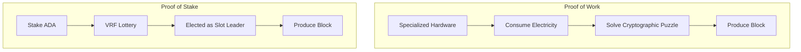
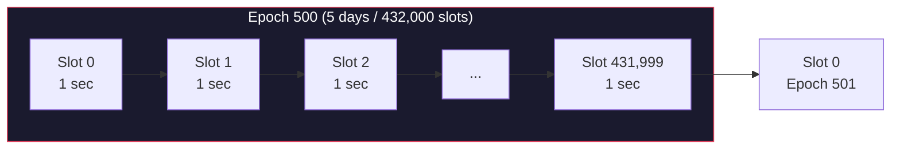
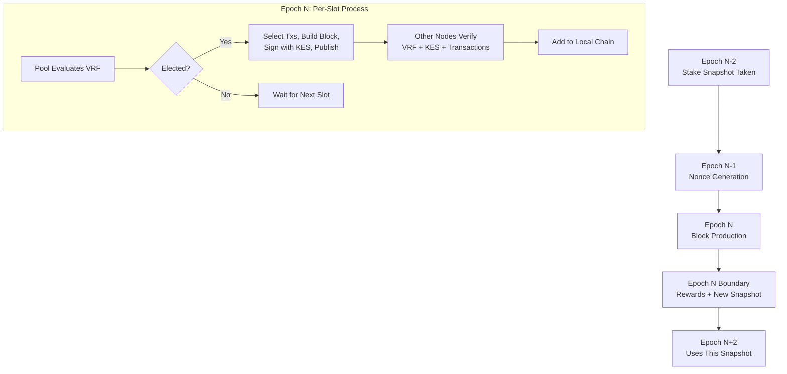

# Lesson #03: Consensus Mechanisms

A consensus mechanism is the protocol-level rule set that allows thousands of independent nodes to agree on a single canonical chain without any central coordinator. We have established that a blockchain is a distributed ledger and that cryptographic primitives secure individual transactions and blocks. This lesson answers the critical remaining question: when multiple nodes each propose a different block at the same time, how does the network decide which one becomes part of the chain?

We examine how consensus works, compare the two dominant approaches (Proof of Work and Proof of Stake), and take a detailed look at Cardano's Ouroboros protocol, the first provably secure Proof of Stake system.

## Why Is Consensus Hard in Distributed Systems?

Consensus is hard because distributed nodes have different views of pending transactions, face network latency, may go offline, and some may act maliciously, yet they must all agree on a single truth without a central coordinator. In a centralized system, one server decides and everyone accepts. Without that authority, the problem becomes fundamental.

Consider this scenario:

```
Time: Slot 7,241,000

Node A (in Tokyo) receives transactions [T1, T2, T3]
Node B (in New York) receives transactions [T2, T4, T5]
Node C (in Berlin) receives transactions [T1, T4, T6]

Each node has a different view of pending transactions.
Which transactions go in the next block?
Who decides?
What if Node B is malicious and fabricates T5?
```

The network must agree on:
1. **Who** gets to produce the next block
2. **What** transactions go in that block
3. **When** the block is considered final (cannot be reversed)

And it must do this despite:
- Network latency (messages take time to propagate globally)
- Node failures (some nodes may be offline)
- Malicious actors (some nodes may deliberately try to disrupt the network)
- No central coordinator

## How Does Proof of Work (PoW) Achieve Consensus?

Proof of Work achieves consensus by requiring block producers to solve a computationally expensive cryptographic puzzle before they can add a block. The first miner to find a valid solution "wins" the right to produce the next block, and the computational cost makes attacks economically irrational.

### How PoW Works

In PoW, creating a block requires finding a value (called a **nonce**) such that the hash of the block header falls below a target threshold.

```
Find nonce such that:
  hash(block_header + nonce) < target

Example (simplified):
  target = 0000000000FFFFFFFFFFFFFFFFFFFF...

  Try nonce = 0: hash = "7a4f2c..." -- too high
  Try nonce = 1: hash = "b31e8a..." -- too high
  Try nonce = 2: hash = "1d7f3b..." -- too high
  ...
  Try nonce = 8,294,712: hash = "0000000000a3f..." -- below target!
```

This process is called **mining**. It requires enormous computational effort (trillions of hash attempts) but verification is instant (compute one hash, check if it is below the target). The difficulty adjusts so that the network as a whole finds a solution approximately every 10 minutes (for Bitcoin).

### What Are PoW's Strengths and Weaknesses?

**Security model**: To attack PoW, you need more computational power than the rest of the network combined (a "51% attack"). The cost of assembling that much hardware and electricity makes attacks economically irrational for established chains.

**Energy consumption**: PoW is intentionally wasteful. The security budget IS the electricity consumed. Bitcoin's annual energy consumption rivals that of medium-sized countries. This is not a bug; it is the cost of trustless security. But it is a significant drawback.

**Hardware centralization**: PoW rewards specialized hardware (ASICs). This leads to mining concentration in regions with cheap electricity and near manufacturers of mining hardware, undermining the decentralization goal.

**Finality**: PoW provides **probabilistic finality**. A transaction is never mathematically "final"; it just becomes exponentially unlikely to be reversed as more blocks are added on top. Bitcoin convention considers 6 confirmations (about 60 minutes) as "safe enough."

## How Does Proof of Stake (PoS) Differ from Proof of Work?

Proof of Stake replaces computational work with economic commitment: instead of proving you spent electricity, you prove you hold (and have staked) the network's native currency. The right to produce a block is proportional to how much cryptocurrency you stake, making the security model "attacking costs money" rather than "attacking costs electricity."



If you hold 1% of all staked tokens, you produce approximately 1% of blocks.

The security model shifts from "attacking costs electricity" to "attacking costs money." To control the network, an attacker would need to acquire the majority of staked tokens. Buying that many tokens drives the price up enormously, and if you attack the network, the value of the tokens you hold collapses. Attacking a PoS system is economically self-destructive.

### PoW vs PoS Comparison

| Property | Proof of Work (Bitcoin) | Proof of Stake (Cardano) |
|---|---|---|
| **Resource consumed** | Electricity + hardware | Staked cryptocurrency |
| **Block producer selection** | First to solve the puzzle | Protocol selects based on stake |
| **Energy efficiency** | Very low (intentionally) | Very high (99.9%+ reduction) |
| **Hardware requirements** | Specialized ASICs | Standard server hardware |
| **Barrier to entry** | High (expensive hardware) | Lower (stake ADA, delegate) |
| **Attack cost** | 51% of hash power | 51% of staked ADA |
| **Finality** | Probabilistic (~60 min) | Probabilistic (~5-10 min on Cardano) |
| **Decentralization pressure** | Centralizes toward cheap electricity | Cardano's design incentivizes distribution |

## What Is Cardano's Ouroboros Protocol?

Ouroboros is Cardano's consensus protocol and the first Proof of Stake protocol with a rigorous, peer-reviewed security proof. Originally published by Aggelos Kiayias, Alexander Russell, Bernardo David, and Roman Oliynykov at CRYPTO 2017, it divides time into epochs and slots, uses VRFs for private slot leader election, and provides provable security guarantees under the assumption that honest participants control the majority of staked ADA.

The name "Ouroboros" comes from the ancient symbol of a serpent eating its own tail, representing the cyclical nature of the protocol.

### How Has Ouroboros Evolved?

Ouroboros is not a single protocol but a family:

| Version | Era | Key Innovation |
|---|---|---|
| **Ouroboros Classic** | Research | First provably secure PoS; assumed synchronized clocks |
| **Ouroboros BFT** | Byron restart | Simplified BFT variant for the Byron-to-Shelley transition |
| **Ouroboros Praos** | Shelley (current) | Added VRF for private leader selection; semi-synchronous network model |
| **Ouroboros Genesis** | In development | Enables secure bootstrapping from genesis; no trusted checkpoints needed |
| **Ouroboros Leios** | Research | Input endorsers for dramatically increased throughput |

The current Cardano mainnet runs **Ouroboros Praos**. The rest of this lesson focuses on Praos.

### How Do Epochs and Slots Structure Time in Ouroboros?

Ouroboros divides time into a hierarchical structure: **slots** (1 second each) are grouped into **epochs** (432,000 slots, lasting exactly 5 days). Epochs serve as the administrative boundary for stake snapshots, reward distribution, protocol parameter changes, and pool registrations.



**Slot**: The smallest unit of time. On Cardano, each slot is **1 second**. A slot may or may not contain a block. Not every slot produces a block; the target is approximately one block every 20 seconds.

**Epoch**: A collection of 432,000 slots, lasting exactly **5 days**. Epochs are the administrative boundary for many protocol operations:
- Stake snapshots are taken at epoch boundaries
- Rewards are calculated and distributed per epoch
- Protocol parameter changes take effect at epoch boundaries
- Stake pool registrations and retirements take effect at epoch boundaries

### How Does Slot Leader Election Work?

For each slot, the protocol determines whether a **slot leader** exists and who it is using Verifiable Random Functions (VRFs from Lesson 2). Each stake pool evaluates its VRF locally; the result is private until the pool publishes a block with the VRF proof.

Each stake pool operator has a VRF key. For each slot, the pool runs the VRF function:

```
For slot S in epoch E:
  (vrf_output, vrf_proof) = VRF_eval(pool_vrf_key, epoch_nonce + slot_number)

  threshold = calculate_threshold(pool_stake / total_stake)

  if vrf_output < threshold:
    This pool IS the slot leader for slot S
    // The pool can (and should) produce a block
  else:
    This pool is NOT the slot leader for slot S
    // Nothing to do for this slot
```

Critical properties of this election:

**Private**: A pool knows it won the slot, but no one else does until the pool publishes the block with the VRF proof. This prevents targeted attacks against upcoming leaders.

**Proportional**: The threshold is adjusted based on the pool's relative stake. A pool with 1% of stake will be elected for approximately 1% of slots.

**Verifiable**: When the block is published, the VRF proof allows anyone to verify that the pool was legitimately elected for that slot.

**Multiple leaders possible**: In some slots, zero pools are elected (no block produced). In others, multiple pools are elected simultaneously. The protocol handles both cases gracefully through chain selection rules.

### How Does the Stake Snapshot Mechanism Work?

The stake used for leader election is not the current stake; it is a **snapshot** from two epochs ago. This two-epoch delay prevents an attacker from rapidly acquiring stake and immediately using it to influence block production.

```
Epoch 500 (current):
  Block production uses stake snapshot from Epoch 498

Why the delay?
  - Epoch 498 snapshot: determined at boundary of 497/498
  - Epoch 499: nonce is computed using this snapshot
  - Epoch 500: blocks produced using 498's stake and 499's nonce
```

The attacker would need to hold stake for at least two full epochs (10 days) before it becomes "active" for consensus purposes.

For delegators, this means: when you delegate your ADA to a stake pool, your delegation takes effect two epochs after the snapshot. From the time of delegation, this is typically a 15-20 day wait before your stake contributes to block production and you begin earning rewards.

### How Does Chain Selection Work When Forks Occur?

When multiple valid chains exist (because multiple pools were elected for the same slot, or due to network delays), nodes follow the **longest chain rule**: they adopt the chain with the most blocks. More precisely, Ouroboros Praos uses chain density in the most recent slots as a tiebreaker.

```
Chain A: [B100] -- [B101] -- [B102] -- [B103]
Chain B: [B100] -- [B101'] -- [B102']

Node sees both chains. Chain A has 4 blocks, Chain B has 3.
Node adopts Chain A.
```

The chain that has produced more blocks in the recent window is preferred, as it indicates stronger backing by honest stake.

Blocks on abandoned forks are discarded, and their transactions return to the mempool. This is why Cardano transactions need a few block confirmations before they are considered settled; there is a small window where a block could be part of a fork that gets abandoned.

### How Does Block Diffusion and Propagation Work?

When a slot leader produces a block, it must reach all other nodes quickly. Cardano uses a **structured peer-to-peer (P2P)** network for this:

```
Block Producer       Relay Layer          Other Nodes
     |                   |                     |
     | --- new block --> |                     |
     |                   | --- forward ------> |
     |                   | --- forward ------> |
     |                   | --- forward ------> |
     |                   |                     |
```

Block diffusion time is critical. If a block does not reach other nodes within a few seconds, it risks being orphaned (another leader in a nearby slot produces a competing block that propagates faster). Cardano targets block diffusion within **5 seconds** across the global network.

### What Is the Security Parameter k?

The protocol parameter **k** (currently set to 2160 on mainnet) defines the security threshold: a block is considered **settled** (extremely unlikely to be rolled back) once k blocks have been produced after it. With Cardano producing approximately one block every 20 seconds, k = 2160 translates to roughly 12 hours.

In practice, most applications consider a transaction "safe" after far fewer confirmations. A few minutes (10-20 blocks) provides very high confidence for typical transactions. The k parameter defines the absolute mathematical bound.

### How Do Rewards and Incentives Drive Decentralization?

Ouroboros incentivizes honest behavior through a reward system designed with specific game-theoretic properties. Each epoch, the protocol distributes rewards from transaction fees and monetary expansion (new ADA created from the reserve) to stake pool operators and delegators.

Rewards are distributed to:
- **Stake pool operators**: Receive a fixed cost plus a margin percentage
- **Delegators**: Receive the remainder, proportional to their stake

The reward formula creates a natural equilibrium:

```
Desirable pool size = 1 / k0  (where k0 is the target number of pools, currently 500)

If a pool grows beyond the desirable size:
  - Rewards for that pool are CAPPED
  - Excess stake earns ZERO additional rewards
  - Delegators are incentivized to move to smaller pools

Result: Natural equilibrium toward ~500 evenly-sized pools
```

This creates a Nash equilibrium where rational delegators spread their stake across many pools, naturally maintaining decentralization. It is one of Cardano's most elegant design features; decentralization is not enforced by rules but emerges from economic incentives.

### How Does the Pledge Mechanism Resist Sybil Attacks?

Pool operators can **pledge** their own ADA to their pool, and higher pledge results in slightly higher rewards. This serves as a Sybil resistance mechanism because creating many small pools (a Sybil attack) is less profitable than running one well-pledged pool.

- Pledge demonstrates long-term commitment; the operator has real value at stake
- It increases the cost of attacking the system through pool proliferation

## How Does Finality Work in Cardano?

Cardano provides **probabilistic finality**, meaning the probability of a transaction being reversed decreases exponentially with each new block added after it. Practical finality (extremely high confidence) is reached within 5 to 10 minutes; the mathematical security bound is reached at k = 2160 blocks (roughly 12 hours).

```
Confirmations  |  Reversal Probability (approximate)
      1        |  Non-trivial (possible in slot battles)
      5        |  Very unlikely
     20        |  Negligibly small for most purposes
    100        |  Virtually impossible
   2160 (k)    |  Mathematically bounded by security proof
```

For context, comparing finality across networks:

| Network | Typical Finality | Mechanism |
|---|---|---|
| Bitcoin (PoW) | ~60 minutes (6 blocks) | Probabilistic, based on hash power |
| Ethereum (PoS) | ~15 minutes (2 epochs) | Deterministic after finalization |
| Cardano (Ouroboros Praos) | ~5-10 minutes practical, ~12 hours mathematical bound | Probabilistic, based on stake |
| Solana | ~13 seconds | Optimistic with rollback possibility |

Cardano is exploring **faster finality** through research into Ouroboros protocols that include explicit finalization gadgets, which would provide deterministic finality in addition to the existing probabilistic guarantees.

## What Happens During a Complete Epoch?

An epoch follows a structured lifecycle: stake snapshots from two epochs ago determine block production, VRF-based leader election occurs each slot, blocks are produced and propagated, and at the epoch boundary the protocol calculates rewards, takes a new snapshot, and processes queued changes.



Here is the detailed walkthrough:

```
Epoch N-2: Stake snapshot taken
  - Record how much ADA is in every stake address
  - Record all pool delegations
  - This snapshot is stored and becomes the "active stake" for Epoch N

Epoch N-1: Nonce generation
  - VRF outputs from block producers contribute to the epoch nonce
  - This nonce will be used for leader election in Epoch N

Epoch N: Block production
  - For each of the 432,000 slots:
    a) Each pool evaluates its VRF to check if it is the slot leader
    b) If elected, the pool:
       - Selects transactions from its mempool
       - Constructs a block (respecting size limits)
       - Signs the block with its KES key
       - Publishes the block with VRF proof
    c) Other nodes:
       - Receive the block
       - Verify the VRF proof (was this pool legitimately elected?)
       - Verify the KES signature
       - Verify all transactions in the block
       - Add the block to their local chain

Epoch N boundary:
  - Calculate rewards for all pools and delegators
  - Distribute rewards (they appear in reward accounts)
  - Take new stake snapshot (for use in Epoch N+2)
  - Apply any queued protocol parameter changes
  - Process pool registrations and retirements
```

### What Are KES Keys and Why Do They Matter?

**Key-Evolving Signature (KES)** keys are a forward-security mechanism unique to Ouroboros. A KES key evolves at regular intervals (every 36 hours on Cardano), and after evolving, the old key material is deleted.

This means:

- If an attacker compromises a pool's KES key, they can only forge blocks from that point forward, not retroactively
- The pool operator can generate a new KES key from their cold keys, revoking the compromised one
- Historical blocks remain valid because they were signed with the key version that existed at that time

This is analogous to short-lived TLS certificates that auto-rotate, but applied to block production.

## What Are the Common Attacks on Consensus and How Are They Defended?

Understanding consensus means understanding how it can be attacked:

**51% Attack**: Acquire majority stake to control block production.
- Defense: The cost is enormous (buying majority of ADA), and success destroys the value of the attacker's holdings.

**Nothing-at-Stake**: In naive PoS, it costs nothing to produce blocks on multiple forks simultaneously, potentially preventing consensus.
- Defense: Ouroboros's VRF-based election makes this strategy unprofitable. The protocol's formal security proof addresses this directly.

**Long-Range Attack**: Create an alternative chain starting far in the past.
- Defense: The stake snapshot mechanism (2-epoch delay) limits how far back an attacker can go. Ouroboros Genesis (upcoming) solves this completely.

**Grinding Attack**: Manipulate the randomness used for leader election.
- Defense: The epoch nonce is derived from VRF outputs of multiple blocks, making it infeasible for any single actor to control.

## Web2 Analogy

Consensus mechanisms have direct parallels in distributed systems you may already know:

| Blockchain Consensus | Web2 Equivalent | Key Difference |
|---|---|---|
| **Slot leader election** | Raft leader election | Raft nodes are trusted; slot leaders are untrusted and verified |
| **Epoch structure** | Cron job intervals / maintenance windows | Epochs are protocol-enforced, not administratively scheduled |
| **Stake-weighted voting** | Weighted round-robin load balancing | Stake represents economic commitment, not just capacity |
| **Chain selection (longest chain)** | DNS propagation (eventually consistent) | Chain selection is deterministic; DNS can have split-brain |
| **Block propagation** | CDN cache invalidation | Both must reach all nodes quickly; blockchain adds cryptographic verification |
| **Finality (~20 blocks)** | Database replication lag | Blockchain finality is about security guarantees, not just data freshness |
| **Rewards/incentives** | Revenue sharing / affiliate programs | Protocol-enforced, not contractual |

**The Raft/Paxos analogy deserves expansion.** In distributed databases (CockroachDB, etcd, Consul), the Raft consensus protocol elects a leader who sequences all writes. If the leader fails, a new election happens. This is strikingly similar to Ouroboros:

- **Raft leader election** maps to **slot leader selection**
- **Raft log entries** map to **blocks**
- **Raft term** maps to **epoch**
- **Raft heartbeats** map to **block propagation**

The critical difference: Raft assumes all nodes are honest (crash fault tolerance). Ouroboros assumes some nodes are malicious (Byzantine fault tolerance). This is why Ouroboros needs VRFs, stake-weighted elections, and formal security proofs; it solves a strictly harder problem.

**Database replication** is another useful analogy. In a PostgreSQL streaming replication setup, the primary writes WAL (Write-Ahead Log) entries, and replicas apply them. There is replication lag; replicas are slightly behind the primary. This is analogous to blocks propagating through the network. The difference is that blockchain has no "primary"; the leader changes every slot.

## Key Takeaways

- **Consensus is how distributed nodes agree on a single chain** without any central authority. It must be resilient to network delays, node failures, and malicious actors.
- **Proof of Work** (Bitcoin) secures the network through computational cost. It works but is energy-intensive and tends toward hardware centralization.
- **Proof of Stake** (Cardano) secures the network through economic stake. Ouroboros Praos is the first PoS protocol with a formal security proof, selecting slot leaders via VRFs proportional to their stake.
- **Cardano's time is divided into epochs (5 days) and slots (1 second)**, with stake snapshots, nonce generation, and reward distribution happening at epoch boundaries.
- **Cardano's incentive design** naturally pushes toward decentralization through reward capping, pledge mechanisms, and stake distribution; making decentralization an emergent economic equilibrium rather than an enforced rule.

## What's Next

Now that you understand how blocks are produced and the network reaches agreement, the next lesson explores what is actually inside those blocks. Cardano uses a unique accounting model called the Extended UTXO (eUTXO) model that fundamentally differs from both traditional databases and Ethereum's account model. Understanding eUTXO is essential for building applications on Cardano.
