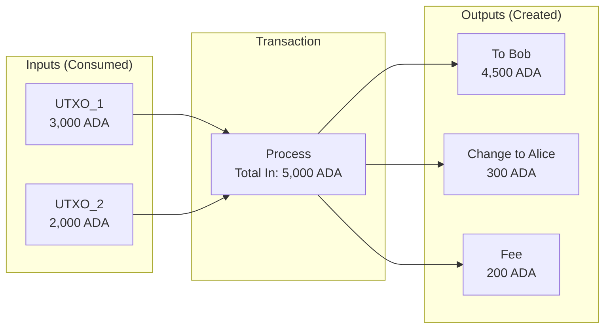
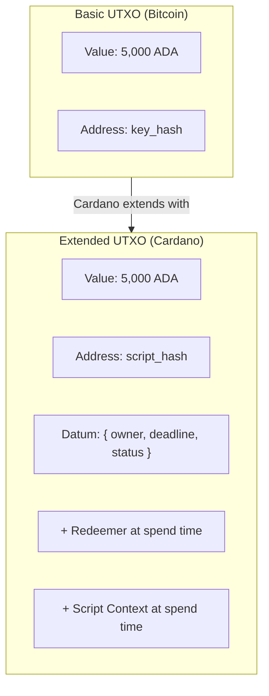

# Lesson #04: The UTXO Model

The UTXO (Unspent Transaction Output) model is a method of tracking ownership on a blockchain by recording discrete, immutable "coins" rather than mutable account balances. Cardano extends this model with datums, redeemers, and script context to enable smart contracts while preserving determinism and parallelism. This lesson explains how UTXOs work, why Cardano chose this model, and how to think in eUTXO as a developer.

Every blockchain needs a way to track who owns what. There are two fundamentally different approaches: the **account model** (used by Ethereum) and the **UTXO model** (used by Bitcoin and, in an extended form, by Cardano). This is not a minor implementation detail; it shapes how you think about transactions, how you design smart contracts, and what guarantees the protocol can give you.

## How Does the Account Model Work?

The account model works like a bank account: each address has a mutable balance, and transactions update balances in place by debiting the sender and crediting the receiver. If you have worked with databases or Ethereum, you already understand this model intuitively.

```
Account State (like a database row):

| Address            | Balance    |
|--------------------|------------|
| addr_alice         | 5,000 ADA  |
| addr_bob           | 3,000 ADA  |
| addr_charlie       | 1,500 ADA  |

Transaction: Alice sends 1,000 ADA to Bob

UPDATE accounts SET balance = balance - 1000 WHERE address = 'addr_alice';
UPDATE accounts SET balance = balance + 1000 WHERE address = 'addr_bob';

Result:
| Address            | Balance    |
|--------------------|------------|
| addr_alice         | 4,000 ADA  |
| addr_bob           | 4,000 ADA  |
| addr_charlie       | 1,500 ADA  |
```

This is familiar. It is essentially a mutable ledger where balances are updated in place. But this simplicity comes with challenges in a decentralized context:

- **State contention**: Two transactions modifying the same account must be serialized. They cannot execute in parallel safely.
- **Non-determinism**: The outcome of a transaction may depend on other transactions that execute before it. You cannot know the result until execution time.
- **Global state dependency**: Smart contracts often read and write shared global state, creating complex dependencies.

## How Does the UTXO Model Track Ownership?

The UTXO model tracks ownership through discrete, immutable "coins" (unspent transaction outputs from previous transactions) rather than mutable balances. When you spend, you consume entire UTXOs as inputs and create new UTXOs as outputs, receiving "change" back to yourself, much like paying with physical cash.

### The Physical Cash Analogy

The best analogy is physical cash. When you have 50 dollars, you do not have an abstract "balance of 50"; you have specific bills (maybe a 20, a 20, and a 10). When you buy something for 25 dollars, you hand over the 20 and the 10 (giving 30), and you receive 5 dollars in change.

UTXOs work the same way:



```
Alice's UTXOs (her "wallet"):
  UTXO_1: 3,000 ADA  (received from earlier transaction tx_abc, output #0)
  UTXO_2: 2,000 ADA  (received from earlier transaction tx_def, output #1)

Total: 5,000 ADA (but stored as two separate UTXOs)

Alice wants to send 4,500 ADA to Bob:

Transaction:
  INPUTS:                      OUTPUTS:
  +-----------+               +-----------+
  | UTXO_1    | 3,000 ADA    | To Bob    | 4,500 ADA   (new UTXO for Bob)
  | UTXO_2    | 2,000 ADA    | To Alice  |   300 ADA   (change back to Alice)
  +-----------+               +-----------+
  Total in: 5,000 ADA        | Fee       |   200 ADA   (transaction fee)
                              Total out: 5,000 ADA

After the transaction:
  UTXO_1: SPENT (destroyed, no longer exists)
  UTXO_2: SPENT (destroyed, no longer exists)
  UTXO_3: 4,500 ADA belonging to Bob (newly created)
  UTXO_4:   300 ADA belonging to Alice (newly created, this is "change")
```

Key observations:

1. **UTXOs are consumed entirely**. You cannot partially spend a UTXO. If you have a 3,000 ADA UTXO and want to send 1,000 ADA, you consume the entire 3,000 ADA UTXO and create two new outputs: 1,000 ADA to the recipient and 2,000 ADA back to yourself as change.

2. **Inputs always equal outputs plus fees**. Every transaction must balance. The sum of all input UTXOs must equal the sum of all output UTXOs plus the transaction fee. The protocol enforces this.

3. **UTXOs are immutable**. Once created, a UTXO never changes. It either exists (unspent) or does not (spent). There is no UPDATE operation; only CREATE (as a transaction output) and CONSUME (as a transaction input).

4. **Each UTXO can only be spent once**. This is how double-spending is prevented. Once a UTXO appears as an input to a confirmed transaction, it is marked as spent and can never be used again.

### What Is the UTXO Set?

The **UTXO set** is the complete collection of all unspent transaction outputs at any point in time. It represents the current state of the blockchain.

```
UTXO Set (simplified):

| TxId:Index | Address     | Value     |
|------------|-------------|-----------|
| tx_01:#0   | addr_alice  | 300 ADA   |
| tx_02:#0   | addr_bob    | 4,500 ADA |
| tx_03:#0   | addr_charlie| 1,500 ADA |
| tx_03:#1   | addr_dave   | 750 ADA   |
| ...        | ...         | ...       |
```

Each UTXO is uniquely identified by the **transaction ID** that created it and its **output index** within that transaction. This pair (TxId, Index) is called a **transaction output reference** (TxOutRef).

On Cardano mainnet, the UTXO set contains millions of entries. A full node maintains this set in memory for fast validation.

## What Is the Extended UTXO (eUTXO) Model?

The Extended UTXO model adds three components to Bitcoin's original UTXO concept: **datums** (arbitrary data attached to UTXOs), **redeemers** (arguments provided when spending), and **script context** (a comprehensive view of the entire transaction). These extensions enable smart contracts while preserving UTXO determinism and parallelism.



### 1. Datum: Attaching Data to UTXOs

In eUTXO, each output can carry a piece of arbitrary data called a **datum**. Think of it as state attached to a specific UTXO.

```
Extended UTXO:
+---------------------------+
| Value:  5,000 ADA         |
| Address: script_addr_xyz  |  <- locked by a script, not a key
| Datum: {                  |  <- arbitrary data attached to this UTXO
|   owner: "alice",         |
|   deadline: 1740000000,   |
|   status: "active"        |
| }                         |
+---------------------------+
```

The datum is Cardano's answer to "where do smart contracts store their state?" In the account model (Ethereum), state is stored in contract storage (a mutable key-value store). In eUTXO, state lives inside UTXOs themselves. To update state, you consume a UTXO and create a new one with updated data.

Cardano supports two modes of datum storage:
- **Datum hash**: Only the hash of the datum is stored on-chain. The actual datum is provided when the UTXO is spent. This saves on-chain space.
- **Inline datum**: The full datum is stored directly on-chain in the UTXO. This makes it easier for other transactions to read the datum without off-chain coordination.

### 2. Redeemer: Providing Input to Scripts

When you spend a UTXO locked by a script, you provide a **redeemer**: an argument that the script uses to determine whether the spending is allowed.

```
Spending a script-locked UTXO:

Input:
  UTXO to spend: tx_01:#0 (locked by script_addr_xyz)
  Redeemer: { action: "claim", proof: "abc123" }

The validator script receives:
  - Datum:    { owner: "alice", deadline: 1740000000, status: "active" }
  - Redeemer: { action: "claim", proof: "abc123" }
  - Context:  (information about the entire transaction)

Script evaluates and returns:
  True  -> transaction is valid, UTXO can be spent
  False -> transaction is INVALID, rejected by the network
```

### 3. Script Context: Transaction Awareness

The validator script also receives the **script context**: a comprehensive view of the entire transaction, including all inputs, all outputs, the fee, the validity range, signatories, and more.

This is remarkably powerful. A script can enforce complex conditions like:

- "This UTXO can only be spent if the transaction also sends 100 ADA to address X"
- "This UTXO can only be spent after slot 50,000,000"
- "This UTXO can only be spent if the transaction creates a new output at this same script address with an updated datum"

The last pattern is the foundation of **stateful smart contracts** in eUTXO. The script enforces that its own state is correctly propagated.

## How Does a Complete eUTXO Transaction Work?

A complete eUTXO smart contract interaction consumes script-locked UTXOs with a redeemer, the on-chain validator checks conditions (datum, redeemer, and script context), and if validation passes, the transaction produces new UTXOs with updated state. Here is a concrete example.

```
Scenario: Alice locked 1,000 ADA in a vesting contract.
          The contract releases funds after a certain slot.

BEFORE:
  Script UTXO (at vesting_script_addr):
    Value: 1,000 ADA
    Datum: { beneficiary: addr_alice, release_slot: 50000000 }

  Alice's UTXO (at addr_alice):
    Value: 10 ADA  (for fees)

TRANSACTION:
  Inputs:
    [1] Script UTXO (vesting_script_addr, tx_old:#0)
        Redeemer: { action: "withdraw" }
    [2] Alice's fee UTXO (addr_alice, tx_fee:#0)

  Outputs:
    [1] To addr_alice: 1,000 ADA  (the vested funds)
    [2] To addr_alice: 8 ADA      (change from fee UTXO)

  Fee: 2 ADA
  Validity interval: [50000000, infinity)  <- valid only after release slot

SCRIPT VALIDATION:
  The vesting script checks:
    1. Is the current slot >= datum.release_slot? YES (enforced by validity interval)
    2. Does the transaction pay to datum.beneficiary? YES (output #1 goes to addr_alice)
    3. Is the transaction signed by datum.beneficiary? YES (Alice signed it)
  Result: TRUE -> transaction is valid

AFTER:
  Script UTXO: SPENT (destroyed)
  New UTXO at addr_alice: 1,000 ADA (vested funds)
  New UTXO at addr_alice: 8 ADA (change)
```

## Why Is Deterministic Transaction Validation Important?

Deterministic validation means you can predict exactly what a transaction will do before submitting it, because eUTXO transactions reference specific UTXOs by ID rather than reading mutable global state. Either the exact expected result occurs, or the transaction fails without any effects.

In the account model, transaction outcomes depend on global state that may change between construction and execution:

```
Account Model (Ethereum):
  1. Alice constructs a transaction calling a DEX contract
  2. At construction time, the price is 100 TOKEN per ETH
  3. Between construction and execution, Bob's transaction changes the price to 200
  4. Alice's transaction executes at the worse price (or fails)

  -> The outcome was unpredictable at construction time
```

In eUTXO, transactions specify their exact inputs (specific UTXOs by reference):

```
eUTXO Model (Cardano):
  1. Alice constructs a transaction consuming UTXO_A and UTXO_B
  2. If UTXO_A or UTXO_B have already been spent when the transaction
     reaches a validator, the transaction simply fails
  3. If they haven't been spent, the transaction executes with exactly
     the state Alice saw when she constructed it

  -> The outcome is entirely predictable. Either the exact expected
     result occurs, or the transaction fails without any effects.
```

This determinism means:

- **No surprise fees**: You know the exact fee before submitting.
- **No front-running**: Other transactions cannot manipulate the state your transaction sees (they can only cause your transaction to fail, not to execute with different results).
- **Off-chain validation**: You can run the exact same validation logic locally that the blockchain will run, confirming success before paying fees.
- **Fee refunds on failure**: If a transaction fails Phase 1 validation (structural checks), no fee is charged. Only Phase 2 failures (script execution failures) consume the fee.

## How Does Concurrency Work in the eUTXO Model?

Concurrency in eUTXO requires explicit design because two transactions cannot consume the same UTXO simultaneously; only one succeeds and the other fails. The Cardano community has developed several patterns (UTXO fan-out, batching, reference inputs) to handle this trade-off effectively.

```
Problematic scenario:
  Script UTXO at DEX: { price: 100, liquidity: 10000 }

  Alice's tx: consume DEX UTXO, buy 100 tokens
  Bob's tx:   consume DEX UTXO, buy 50 tokens

  Only ONE of these can succeed. The other references a spent UTXO.
```

This is unlike the account model, where both transactions would be serialized and both could succeed (though with potential state changes between them).

### What Concurrency Solutions Exist?

**1. Multiple UTXOs (UTXO fan-out)**

Instead of one UTXO holding all liquidity, distribute state across many UTXOs:

```
Instead of:
  [Single UTXO: 10,000 ADA liquidity]

Use:
  [UTXO_1: 1,000 ADA]  [UTXO_2: 1,000 ADA]  [UTXO_3: 1,000 ADA]
  [UTXO_4: 1,000 ADA]  [UTXO_5: 1,000 ADA]  ... (10 UTXOs)

Now 10 users can transact simultaneously, each consuming a different UTXO.
```

**2. Batching (order book pattern)**

Users submit orders as individual UTXOs. A batcher collects multiple orders and executes them in a single transaction:

```
Step 1: Users submit orders as UTXOs
  [Order: Alice buys 100 TOKEN]  [Order: Bob buys 50 TOKEN]  [Order: Carol sells 200 TOKEN]

Step 2: Batcher constructs one transaction that:
  - Consumes all order UTXOs
  - Consumes the DEX liquidity UTXO
  - Produces settled outputs for each user
  - Produces a new DEX UTXO with updated state

No contention: each user only creates their own UTXO.
```

This is the pattern used by most Cardano DEXes (SundaeSwap, Minswap, WingRiders).

**3. Reference inputs (CIP-31)**

Cardano allows transactions to **reference** UTXOs without consuming them. If a transaction only needs to read data from a UTXO (not modify it), it can use a reference input. Multiple transactions can reference the same UTXO simultaneously.

```
Oracle UTXO: { price_feed: 1.50, timestamp: 1740000000 }

Alice's tx: REFERENCE Oracle UTXO (reads price, does not consume)
Bob's tx:   REFERENCE Oracle UTXO (reads price, does not consume)
Carol's tx: REFERENCE Oracle UTXO (reads price, does not consume)

All three transactions can process in the same block.
The Oracle UTXO remains unspent.
```

**4. Reference scripts (CIP-33)**

Script code itself can be stored in a UTXO and referenced by transactions, rather than including the full script in every transaction. This reduces transaction size and cost while allowing script sharing.

## How Do Native Tokens Work in the eUTXO Model?

On Cardano, custom tokens (fungible and non-fungible) are **native**: they live inside UTXOs alongside ADA at the protocol level, not inside smart contracts. This means tokens inherit all the security properties of ADA itself, without requiring smart contract execution for basic transfers.

```
A Cardano UTXO can carry multiple assets:

UTXO:
+----------------------------------------------+
| Address: addr_alice                           |
| Value:                                        |
|   ADA: 5,000,000 lovelace (5 ADA)           |
|   PolicyID_abc.TokenA: 1,000 units           |
|   PolicyID_abc.TokenB: 500 units             |
|   PolicyID_def.MyNFT: 1 unit                |
+----------------------------------------------+
```

This is called a **multi-asset value** or **value bundle**. A single UTXO can hold ADA plus any number of different native tokens.

Important: every UTXO on Cardano must contain a minimum amount of ADA (the **min-UTXO** requirement, currently roughly 1-2 ADA depending on the UTXO size). This prevents spam by making it costly to create many tiny UTXOs and ensures that the UTXO set does not grow uncontrollably.

### What Are ADA and Lovelace?

ADA is Cardano's native currency. The smallest unit is a **lovelace**, named after Ada Lovelace:

```
1 ADA = 1,000,000 lovelace

All on-chain values are denominated in lovelace.
When a transaction specifies a fee of 200,000 lovelace, that is 0.2 ADA.
```

This is analogous to how Ethereum uses wei (1 ETH = 10^18 wei) or how traditional finance uses cents (1 USD = 100 cents), though with more decimal places.

## How Do the UTXO and Account Models Compare?

The two models make fundamentally different trade-offs. The account model is simpler to reason about for stateful applications. The eUTXO model provides stronger guarantees about transaction outcomes and enables more parallelism. Neither is objectively "better."

| Aspect | Account Model (Ethereum) | eUTXO Model (Cardano) |
|---|---|---|
| **State representation** | Mutable account balances | Immutable UTXOs, consumed and created |
| **Smart contract state** | Mutable storage slots | Datum attached to UTXOs |
| **Parallelism** | Limited by shared state | Natural parallelism (different UTXOs) |
| **Determinism** | Non-deterministic (state may change) | Deterministic (inputs are specific UTXOs) |
| **Transaction validation** | Execute to find the result | Validate off-chain with certainty |
| **Concurrency** | Implicit (serialized by EVM) | Explicit (UTXO selection) |
| **Wallet complexity** | Simple (read balance) | More complex (manage UTXO set) |
| **Fee predictability** | Approximate (gas estimation) | Exact (deterministic execution) |
| **Native tokens** | ERC-20 contracts (code) | Protocol-level (no contract needed) |

## How Should Developers Think in eUTXO?

For web2 developers transitioning to Cardano, here is a framework for "thinking in eUTXO":

1. **State lives in UTXOs, not in variables**. Instead of a mutable `balance` variable, you have a set of discrete value containers.

2. **State transitions consume and create UTXOs**. Instead of `balance -= 100`, you consume a UTXO and create new ones. Every state change is a creation-destruction cycle.

3. **Transactions are atomic functions**. A transaction takes a set of UTXOs as input and produces a set of UTXOs as output. It is a pure function with no side effects. If any part fails, none of it executes.

4. **Concurrency is about UTXO selection, not locking**. Instead of locking a row in a database, you select specific UTXOs. If someone else has already spent that UTXO, you retry with different inputs.

5. **Scripts are validators, not executors**. Plutus scripts do not "do things"; they validate that a transaction meets conditions. The transaction builder constructs the state transition; the script merely checks that it is legal.

## Web2 Analogy

| eUTXO Concept | Web2 Equivalent | Key Difference |
|---|---|---|
| **UTXO** | Gift card / prepaid voucher | You spend the whole thing and get change, rather than decrementing a balance |
| **UTXO set** | Immutable event log (event sourcing) | Current state is derived from the set of unspent outputs, not from a mutable store |
| **Transaction (consume + create)** | Immutable INSERT in event sourcing | Never UPDATE; create new events that supersede old ones |
| **Datum** | State snapshot attached to an event | State is explicit and co-located with the value it describes |
| **Redeemer** | Function argument / API request body | Tells the validator what action the user intends |
| **Script validation** | Middleware / authorization check | Validates that the request meets policy; does not execute business logic itself |
| **Change output** | Refund / overpayment return | When you pay $30 with a $50 bill, you get $20 back |
| **Transaction determinism** | Pure function (no side effects) | Given the same inputs, always the same outputs (like a pure function in functional programming) |
| **UTXO contention** | Optimistic concurrency control | Like database optimistic locking: try, and retry if someone else modified the row |
| **Reference inputs** | Database read replicas / cache | Read state without locking or modifying it |
| **Min-UTXO (ADA deposit)** | Minimum account balance / storage deposit | Prevents spam by requiring real value behind every state entry |

**The event sourcing analogy is particularly powerful.** In event sourcing:
- State is derived from an immutable log of events
- You never modify past events
- Current state is a projection of all events
- New state is created by appending new events

In eUTXO:
- State is the set of all unspent outputs
- You never modify existing UTXOs
- Current state is the UTXO set (all unspent outputs)
- New state is created by consuming UTXOs and producing new ones

If you have used event sourcing or CQRS patterns, eUTXO will feel natural.

**The functional programming analogy** is also helpful. Transactions are like pure functions: they take explicit inputs, produce explicit outputs, and have no hidden side effects. The eUTXO model is essentially a functional approach to ledger accounting, which is not coincidental; Cardano's smart contract languages (Plutus, Aiken) are rooted in functional programming.

## Key Takeaways

- **The UTXO model tracks discrete "coins"** (unspent transaction outputs) rather than account balances. UTXOs are consumed entirely and new ones are created, similar to spending physical cash and receiving change.
- **Cardano's eUTXO extends basic UTXO** with datums (state), redeemers (action arguments), and script context (transaction awareness), enabling smart contracts while preserving UTXO benefits.
- **Determinism is eUTXO's superpower**: transaction outcomes are entirely predictable before submission, eliminating front-running and enabling exact fee calculation.
- **Concurrency requires explicit design** in eUTXO. Patterns like UTXO fan-out, batching, and reference inputs solve contention, and most mature Cardano protocols use these patterns effectively.
- **Native tokens live alongside ADA in UTXOs**, inheriting all protocol-level security properties without requiring smart contracts for basic operations.

## What's Next

You now understand how Cardano tracks value and state. But we have been casually referring to "addresses" and "private keys" without fully explaining them. Lesson 5 completes the picture by exploring wallets, keys, and addresses: the identity and access layer that connects users to the blockchain. You will learn how mnemonic phrases generate key hierarchies, how Cardano addresses are structured, and how this all ties back to the cryptographic primitives and UTXO model from previous lessons.
