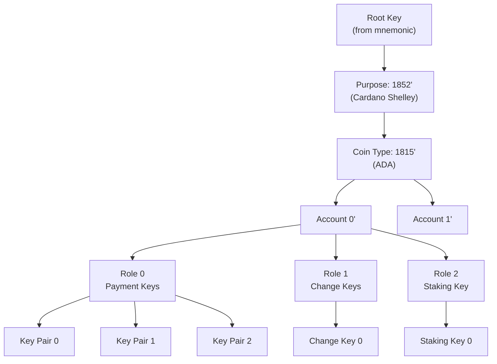
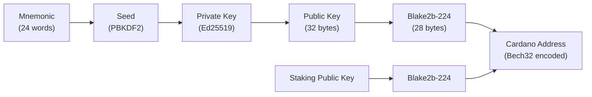

# Lesson #05: Wallets, Keys, and Addresses

Wallets, keys, and addresses form the identity and access layer of Cardano: a mnemonic seed phrase generates a hierarchical tree of key pairs, public keys are hashed into addresses that lock UTXOs, and wallet software manages this complexity so users can send, receive, and stake ADA. This lesson connects the cryptographic primitives from Lesson 2 with the UTXO model from Lesson 4 into a complete picture.

Understanding this layer is essential for Cardano developers. Whether you are building a dApp, integrating wallet connectivity, or designing transaction flows, you need to know how keys, addresses, and wallets work together and why Cardano's approach differs from other blockchains.

## What Is a Key Pair and Why Is It the Foundation of Identity?

A key pair consists of a private key (32 bytes of random entropy) and its corresponding public key (derived via Ed25519), and it forms the foundation of identity on Cardano because whoever holds the private key can sign transactions and spend the funds at the corresponding address. There is no "forgot password" flow, no customer support, and no recovery mechanism beyond the key itself.

```
Key Generation:
  private_key = random_256_bits()          // 32 bytes of entropy
  public_key  = ed25519_derive(private_key) // 32 bytes, mathematically linked

Properties:
  - private_key -> public_key:  EASY (one computation)
  - public_key -> private_key:  INFEASIBLE (would break Ed25519)
  - sign(message, private_key): produces a 64-byte signature
  - verify(message, signature, public_key): true/false
```

**The private key is your identity.** Whoever holds the private key can spend the funds at the corresponding address.

**The public key is your verifiable identity.** It can be shared freely. Others use it to verify your signatures and to send you funds (via the address derived from it).

## Why Are Raw Key Pairs Impractical for Real Use?

Raw key pairs create serious practical problems: one key per address makes all transactions trivially linkable, managing hundreds of unrelated private keys is error-prone, backing up hundreds of keys is impractical, and compromised keys offer no rotation mechanism. The solution to all of these problems is **Hierarchical Deterministic (HD) wallets**.

1. **One key per address**: If you use your public key directly as your address, all your transactions are trivially linkable. Anyone can see your entire financial history.

2. **Key management nightmare**: A power user might have hundreds of addresses for different purposes. Managing hundreds of unrelated private keys is error-prone and dangerous.

3. **Backup complexity**: Losing a single private key means losing all funds at that address. Backing up hundreds of keys is impractical.

4. **No key rotation**: If a key is compromised, you cannot update the address. You must create a new one and transfer all funds.

## How Do Mnemonic Seed Phrases Work?

A mnemonic seed phrase (defined by BIP-39) is a human-readable representation of 256 bits of random entropy, encoded as 24 words from a standardized 2048-word list. This single phrase deterministically generates an entire tree of key pairs, making it the sole backup needed for your complete Cardano identity.

```
Example 24-word mnemonic (DO NOT USE; this is illustrative only):

  1. abandon   7. carbon   13. glance   19. pottery
  2. ability   8. detect   14. harvest  20. rabbit
  3. abstract  9. emerge   15. isolate  21. serial
  4. across   10. filter   16. jungle   22. timber
  5. blanket  11. flight   17. kitchen  23. urban
  6. burst    12. gauge    18. obvious  24. vendor
```

How it works:

```
Step 1: Generate entropy (random bits)
  entropy = 256 random bits (for a 24-word phrase)

Step 2: Calculate checksum
  checksum = first 8 bits of SHA-256(entropy)

Step 3: Combine
  combined = entropy + checksum = 264 bits

Step 4: Split into 11-bit groups
  264 bits / 11 bits = 24 groups

Step 5: Map each group to a word from BIP-39 wordlist
  Group 1 (00000000000) -> "abandon" (word #0)
  Group 2 (00000000001) -> "ability" (word #1)
  ... and so on for all 24 groups

The wordlist contains exactly 2048 words (2^11 = 2048).
```

**Why 24 words?** 24 words encode 256 bits of entropy. The number of possible 24-word phrases is 2^256, which is approximately 1.16 x 10^77. For perspective, there are roughly 10^80 atoms in the observable universe. Guessing someone's seed phrase by brute force is not merely impractical; it is physically impossible with any conceivable technology.

**Cardano wallets typically use either 15-word or 24-word mnemonics.** Shelley-era wallets (Daedalus, Eternl, Lace) use 24 words (256-bit entropy). Some lighter wallets use 15 words (160-bit entropy), which is still astronomically secure.

### How Does the Mnemonic Become a Root Key?

The mnemonic phrase is converted to a cryptographic seed using PBKDF2 (Password-Based Key Derivation Function 2):

```
seed = PBKDF2(
  password: mnemonic_words_as_string,
  salt: "mnemonic" + optional_passphrase,
  iterations: 2048,
  key_length: 512 bits,
  hash: HMAC-SHA512
)
```

This 512-bit seed becomes the **root key** from which all other keys are derived. The optional passphrase adds an additional layer of security; the same 24 words with a different passphrase produce a completely different wallet. Some users use this as a "25th word" for plausible deniability or additional security.

## How Do HD Wallets Derive Infinite Keys from One Seed?

Hierarchical Deterministic (HD) wallets (BIP-32) use a tree structure to derive an unlimited number of key pairs from a single root key. Each key is derived deterministically from its parent using a one-way derivation function, so the mnemonic alone is sufficient to recreate every key pair the wallet has ever generated.



```
Root Key (from mnemonic)
+-- Purpose (1852' for Cardano Shelley wallets)
|   +-- Coin Type (1815' for ADA)
|       +-- Account 0'
|       |   +-- Role 0 (External/Payment)
|       |   |   +-- Address Index 0 -> Key Pair 0
|       |   |   +-- Address Index 1 -> Key Pair 1
|       |   |   +-- Address Index 2 -> Key Pair 2
|       |   |   +-- ...
|       |   +-- Role 1 (Internal/Change)
|       |   |   +-- Address Index 0 -> Key Pair 0
|       |   |   +-- ...
|       |   +-- Role 2 (Staking)
|       |       +-- Address Index 0 -> Staking Key Pair
|       +-- Account 1'
|           +-- Role 0 (External/Payment)
|           |   +-- ...
|           +-- ...
```

### How Is the Derivation Path Structured?

The derivation path is written as:

```
m / purpose' / coin_type' / account' / role / address_index

For Cardano:
m / 1852' / 1815' / 0' / 0 / 0

Where:
  m          = root key
  1852'      = purpose (Shelley-era Cardano, CIP-1852)
  1815'      = coin type for ADA (registered in SLIP-44)
  0'         = account index (first account)
  0          = role: 0=external, 1=internal(change), 2=staking
  0          = address index (first address in this role)

The apostrophe (') denotes "hardened" derivation; the child key
cannot be used to compute the parent key, even with the public key.
```

Why 1815? Ada Lovelace was born in 1815. Why 1852? Ada Lovelace died in 1852, and CIP-1852 defines the derivation standard.

### What Are the Key Properties of HD Derivation?

**Deterministic**: Given the same root key and path, you always get the same child key. This means the mnemonic alone is sufficient to recreate every key pair the wallet has ever generated.

**Hierarchical**: Keys form a tree. Account-level keys are independent; compromising one account does not affect others (due to hardened derivation at the account level).

**Incremental**: New addresses can be generated on demand without going back to the seed. A wallet simply increments the address index.

**Public key derivation**: For non-hardened levels, child public keys can be derived from the parent public key without the private key. This enables "watch-only" wallets that can generate addresses and track balances without the ability to sign transactions.

## What Address Types Does Cardano Support?

Cardano supports multiple address types (base, enterprise, reward, pointer, and script), each serving different use cases. A Cardano address is not simply a hashed public key; it is a structured data type containing a header byte, a payment credential, and an optional delegation credential.



### How Is a Cardano Address Structured?

```
Cardano Address (Shelley era):

+--------+-------------------+-------------------+
| Header | Payment Part      | Delegation Part   |
| 1 byte | 28 bytes          | 28 bytes          |
+--------+-------------------+-------------------+

Header byte encodes:
  - Network (mainnet vs testnet)
  - Address type (determines what follows)

Payment Part:
  - Hash of a payment verification key (key hash), OR
  - Hash of a Plutus script (script hash)

Delegation Part (depends on address type):
  - Hash of a staking verification key, OR
  - Hash of a staking script, OR
  - Pointer to a stake registration certificate, OR
  - Absent (enterprise addresses)
```

### What Is a Base Address?

The most common address type. It contains both a payment credential and a staking credential.

```
Base Address:
  Payment: key_hash(payment_vk) or script_hash(payment_script)
  Staking: key_hash(staking_vk) or script_hash(staking_script)

Example (Bech32 encoded):
  addr1qx2fxv2umyhttkxyxp8x0dlpdt3k6cwng5pxj3jhsydzer3jcu5d8ps7zex2k2xt3uqxgjqnnj83ws8lhrn648jjxtwq2ytjc7

Properties:
  - Can receive ADA and native tokens
  - Can participate in staking (delegation to a stake pool)
  - Earns staking rewards
  - Most commonly used address type for end users
```

The prefix `addr1` indicates a mainnet base address. Testnet addresses use `addr_test1`.

### What Is an Enterprise Address?

An enterprise address contains only a payment credential with no staking component.

```
Enterprise Address:
  Payment: key_hash or script_hash
  Staking: NONE

Example:
  addr1vx2fxv2umyhttkxyxp8x0dlpdt3k6cwng5pxj3jhsydzer3jcu5d8ps7zex2k2xt3uqxgjqnnj83ws8lhrn648jjxtwqr8jhvs

Properties:
  - Can receive ADA and native tokens
  - CANNOT participate in staking
  - Does NOT earn rewards
  - Useful for: exchanges, smart contracts, temporary holding
```

Enterprise addresses are shorter (no delegation part) and useful when staking is not needed. Smart contract addresses are often enterprise addresses.

### What Is a Reward Address?

A reward address (also called a stake address) is used exclusively for receiving staking rewards and cannot receive regular ADA transfers.

```
Reward Address:
  Staking: key_hash or script_hash

Example:
  stake1uyehkck0lajq8gr28t9uxnuvgcqrc6070x3k9r8048z8y5gh6ffgw

Properties:
  - Receives staking rewards
  - Cannot receive regular ADA transfers
  - One per staking key (typically one per account)
  - Rewards are withdrawn via a special transaction type
```

### What Is a Pointer Address?

A pointer address references a stake registration certificate by its location in the chain (slot, transaction index, certificate index) instead of containing the full stake key hash.

```
Pointer Address:
  Payment: key_hash or script_hash
  Staking: pointer(slot, tx_index, cert_index)

Properties:
  - More space-efficient than base addresses
  - Functionally equivalent to base addresses
  - Rarely used in practice due to complexity
```

### How Do Script Addresses Work?

When the payment credential is a script hash (rather than a key hash), the address is a **script address**. UTXOs at script addresses can only be spent by providing a valid redeemer that satisfies the script (the Plutus validator).

```
Script Address (for a Plutus validator):
  Payment: script_hash(compiled_plutus_script)
  Staking: optional

The script hash is computed:
  script_hash = blake2b_224(serialized_script)
```

This is how smart contracts are "deployed" on Cardano. You do not upload code to a specific location. Instead, the script's hash determines its address. Anyone who compiles the same script gets the same address. The script itself can be included in the transaction that spends from the address (or referenced via CIP-33 reference scripts).

### What Is Bech32 Encoding?

All Cardano addresses use **Bech32** encoding, which provides:

- **Human-readable prefix**: `addr` for mainnet payment addresses, `addr_test` for testnet, `stake` for reward addresses
- **Error detection**: Built-in checksum detects typos
- **Case insensitivity**: `addr1QX...` and `addr1qx...` are the same address
- **No ambiguous characters**: Avoids confusing characters like 0/O and 1/l/I

```
Bech32 format: prefix + "1" + data + checksum

addr1qx2fxv2umyhttkxyxp8x0dlpdt3k6cwng5pxj3jhsydzer3jcu5d8ps7zex...
|    | |                                                                |
prefix separator  data (address bytes encoded in base32)          checksum
```

## How Do Keys, Addresses, and UTXOs Connect?

The complete flow from mnemonic to spendable UTXO traces through key derivation, address generation, UTXO creation, and transaction signing. Each step uses the cryptographic primitives from Lesson 2, and the final result is a signed transaction that the network can verify.

```
1. MNEMONIC GENERATION
   24 random words -> master seed

2. KEY DERIVATION (HD wallet, BIP-32/CIP-1852)
   master seed -> root key
   root key -> m/1852'/1815'/0'/0/0 -> payment_key_pair_0
   root key -> m/1852'/1815'/0'/2/0 -> staking_key_pair_0

3. ADDRESS GENERATION
   payment_vk_hash = blake2b_224(payment_public_key_0)
   staking_vk_hash = blake2b_224(staking_public_key_0)
   address = base_address(network=mainnet, payment_vk_hash, staking_vk_hash)
   encoded = bech32_encode("addr", address)
   Result: addr1qx2fxv2umyhttkx...

4. RECEIVING FUNDS
   Someone sends 100 ADA to addr1qx2fxv2umyhttkx...
   A new UTXO is created:
     UTXO { tx_id: "abc123", index: 0, address: addr1qx..., value: 100 ADA }

5. SPENDING FUNDS
   To spend this UTXO, you must prove ownership of the payment key:
   a. Construct transaction body (consuming the UTXO, creating new outputs)
   b. Hash the transaction body: tx_hash = blake2b_256(tx_body)
   c. Sign: signature = ed25519_sign(tx_hash, payment_private_key_0)
   d. Include witness: (payment_public_key_0, signature)
   e. Network verifies: ed25519_verify(tx_hash, signature, payment_public_key_0)
      AND blake2b_224(payment_public_key_0) == payment credential in UTXO's address

6. STAKING
   To delegate to a stake pool:
   a. Register the staking key on-chain (one-time, costs a deposit of 2 ADA)
   b. Submit a delegation certificate signed with staking_private_key_0
   c. All UTXOs at addresses sharing this staking credential now contribute
      to the delegated pool's stake
```

## What Is a "Wallet" Really?

A wallet is software that stores your private keys, scans the blockchain for UTXOs at your addresses, calculates your total balance, constructs and signs transactions, and generates new addresses as needed. Your funds exist on the blockchain as UTXOs; they are not "inside" any application.

```
What a wallet "sees":

Blockchain UTXO Set:
  [UTXO_1: addr1_mine, 50 ADA]    <- mine
  [UTXO_2: addr2_other, 100 ADA]  <- not mine
  [UTXO_3: addr3_mine, 30 ADA]    <- mine
  [UTXO_4: addr4_other, 75 ADA]   <- not mine
  [UTXO_5: addr5_mine, 20 ADA]    <- mine

Wallet display:
  Balance: 100 ADA (50 + 30 + 20)
  Addresses used: 3
  UTXOs: 3
```

### What Types of Cardano Wallets Exist?

**Full-node wallets (Daedalus)**: Run a complete `cardano-node`, download and verify the entire blockchain. Maximum security and trustlessness. Requires significant disk space and sync time.

**Light wallets (Eternl, Lace, Yoroi, Typhon, Flint)**: Connect to backend services that index the blockchain. Do not download the full chain. Faster to set up, less resource-intensive, but rely on the backend service for blockchain data (though transaction signing still happens locally with your keys).

**Hardware wallets (Ledger, Trezor)**: Store private keys on a dedicated secure device. Keys never leave the device. Transaction signing happens on the hardware wallet. These provide the strongest protection against key theft.

**Browser extension wallets**: Implement CIP-30 (Cardano dApp Connector), providing a standardized API for web applications to interact with the user's wallet. This is the primary way dApps connect to users on Cardano.

```
CIP-30 Wallet API (conceptual):

// dApp requests wallet connection
wallet = await cardano.eternl.enable()

// dApp queries UTXOs
utxos = await wallet.getUtxos()

// dApp constructs a transaction and asks wallet to sign
signed_tx = await wallet.signTx(unsigned_tx)

// dApp submits the signed transaction
tx_hash = await wallet.submitTx(signed_tx)
```

The wallet never exposes private keys to the dApp. It only signs what the user explicitly approves.

## How Do Payment Keys and Staking Keys Differ?

Cardano deliberately separates payment keys (which control spending of funds) from staking keys (which control delegation and reward withdrawal). This separation means you can delegate your stake to a pool without giving the pool any ability to spend your funds.

```
Payment Key (m/1852'/1815'/account'/0/index):
  - Controls spending of funds
  - Different for each address (many payment keys per account)
  - Compromising one payment key only affects UTXOs at that address

Staking Key (m/1852'/1815'/account'/2/0):
  - Controls delegation and reward withdrawal
  - ONE per account (shared across all addresses)
  - Does NOT control spending of funds
  - Compromising the staking key cannot steal funds (only redirect delegation)
```

This separation also means that all UTXOs across different payment addresses in the same account contribute to a single stake delegation. You do not need to delegate each address separately.

## How Do Multi-Signature and Script-Based Ownership Work?

Cardano supports complex ownership through native scripts and Plutus scripts, allowing addresses to require multiple signatures, time-based conditions, or arbitrary validation logic without deploying a smart contract for basic multi-sig patterns.

**Native scripts** (simple, evaluated without Plutus):

```
Require All Of:
  - Signature from key_hash_A
  - Signature from key_hash_B
  - Signature from key_hash_C

Require Any Of:
  - Signature from key_hash_A
  - Signature from key_hash_B

Require M of N:
  - At least 2 signatures from: [key_A, key_B, key_C]

Time-locked:
  - Valid after slot 50,000,000
  - Valid before slot 60,000,000
```

These can be combined arbitrarily:

```
Require All Of:
  - Require 2 of 3: [Alice, Bob, Carol]
  - Valid after slot 50,000,000

// This creates a 2-of-3 multisig that activates after a specific time.
// Useful for: escrow, corporate treasuries, DAOs
```

**Plutus scripts** provide arbitrary logic for UTXO spending conditions, as covered in Lesson 4.

## What Are the Security Best Practices for Key Management?

Understanding the key architecture helps you understand security threats. Security fundamentally reduces to key management: protect the seed phrase, isolate private keys in hardware, practice good address hygiene, and always verify transactions on a trusted device.

**Seed phrase security**:
- Never store digitally (no photos, no cloud storage, no text files)
- Write on durable material (metal plates resist fire and water)
- Store in multiple secure physical locations
- Consider using the optional passphrase ("25th word") as an additional factor

**Key isolation**:
- Hardware wallets keep private keys in a secure element that never exposes them
- Browser extension wallets encrypt keys with a spending password
- Full node wallets encrypt the key store file

**Address hygiene**:
- HD wallets generate new addresses automatically, improving privacy
- Reusing addresses makes transaction history linkable
- Cardano wallets typically generate a new change address for each transaction

**Transaction verification**:
- Always verify transaction details on a hardware wallet screen
- The wallet software could be compromised, but the hardware wallet displays what will actually be signed
- CIP-30 wallets show a transaction summary before requesting signature approval

## Web2 Analogy

| Cardano Concept | Web2 Equivalent | Key Difference |
|---|---|---|
| **Private key** | SSH private key or JWT signing key | Blockchain private keys directly control money, not just server access |
| **Public key** | SSH public key in `authorized_keys` | Blockchain public keys are used by the entire network, not a single server |
| **Mnemonic seed phrase** | Master password in a password manager | The seed phrase generates all keys deterministically; a master password just decrypts a vault |
| **HD derivation path** | Password manager generating unique passwords per site | Both derive many credentials from one secret; HD wallets use a mathematical tree |
| **Address** | Email address | Both are public identifiers for receiving (funds / messages); but email addresses are tied to a service provider while Cardano addresses are self-sovereign |
| **Wallet software** | Web browser (stores cookies, manages sessions) | The wallet manages keys and constructs transactions, like a browser manages sessions and constructs HTTP requests |
| **CIP-30 dApp connector** | OAuth 2.0 / OpenID Connect | Both allow an application to request permissions from a user's identity provider (wallet / OAuth server) without seeing the raw credentials |
| **Hardware wallet** | Hardware security module (HSM) / YubiKey | Both store cryptographic keys in tamper-resistant hardware; signing happens on-device |
| **Multi-sig native script** | Requiring multiple approvals (e.g., 2 managers must approve a deployment) | Protocol-enforced rather than policy-enforced; the blockchain itself rejects invalid signatures |
| **Base address (payment + staking)** | Email address with separate profile settings | One identifier for receiving; a separate mechanism for account-level settings (delegation) |
| **Bech32 encoding** | Base64 URL-safe encoding | Both encode binary data for human-friendly representation with error detection |

**The SSH key analogy is especially apt.** As a developer, you already manage SSH key pairs:

- You generate a key pair: `ssh-keygen -t ed25519` (same algorithm as Cardano)
- The private key stays on your machine (`~/.ssh/id_ed25519`)
- The public key goes to servers (`~/.ssh/authorized_keys`)
- To authenticate, you prove you hold the private key (digital signature)
- If someone steals your private key, they can access your servers
- You can have multiple key pairs for different purposes

Cardano key pairs work identically, but instead of authenticating to a server, you authenticate to the entire network. And instead of gaining server access, you gain the ability to move value.

**The OAuth/CIP-30 analogy** is also useful for dApp developers. When a website uses "Sign in with Google":
1. The website redirects you to Google (identity provider)
2. You approve the requested permissions
3. Google sends back a token (credential)
4. The website uses the token; it never sees your Google password

When a dApp uses CIP-30:
1. The dApp calls `cardano.walletName.enable()`
2. The wallet popup asks you to approve the connection
3. The wallet provides an API handle
4. The dApp can request signatures; it never sees your private keys

## Key Takeaways

- **A mnemonic seed phrase is the root of your entire Cardano identity.** From 24 words, an unlimited number of key pairs and addresses are deterministically derived via HD wallet standards (BIP-32, BIP-39, CIP-1852).
- **Cardano separates payment keys from staking keys**, allowing you to delegate stake without exposing your spending credentials. This is a fundamental security feature unique to Cardano's design.
- **Cardano has multiple address types** (base, enterprise, reward, pointer), each serving different use cases. Base addresses with both payment and staking credentials are the most common for end users.
- **A wallet is software, not a container.** Your funds exist as UTXOs on the blockchain. The wallet stores keys, scans for your UTXOs, computes balances, and signs transactions.
- **Security reduces to key management.** Seed phrase backup, hardware wallets, and proper address hygiene are the practical measures that protect real value on the network.

## What's Next

Congratulations: you now have a solid theoretical foundation for understanding Cardano's blockchain architecture. You understand how blocks are structured and linked (Lesson 1), the cryptographic primitives that secure them (Lesson 2), how the network reaches consensus on which blocks to add (Lesson 3), how value and state are tracked in the eUTXO model (Lesson 4), and how identity and access work through keys, addresses, and wallets (this lesson). These five lessons form the conceptual bedrock for everything that follows in your Cardano development journey, from writing Plutus and Aiken smart contracts to building full-stack dApps that interact with the chain.
