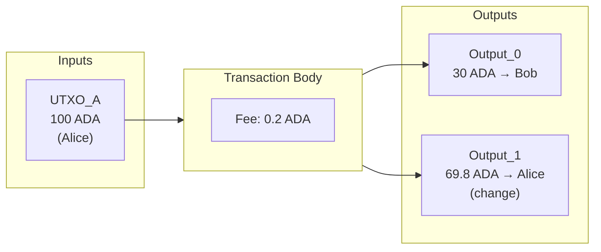
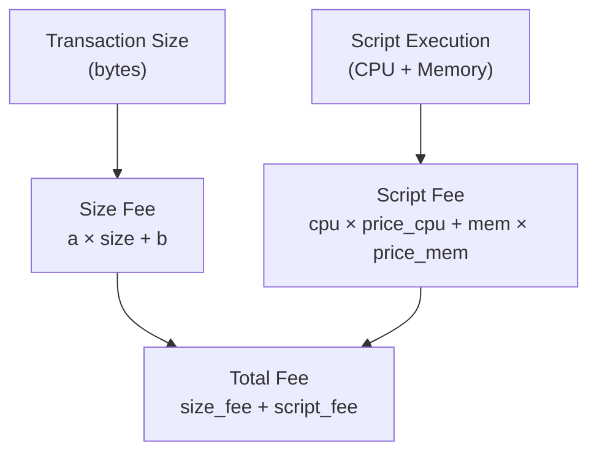
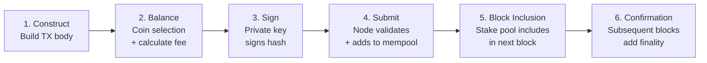

# Lesson #06: Transactions

A Cardano transaction is a signed data structure that consumes existing UTXOs as inputs and produces new UTXOs as outputs, transferring value according to protocol rules. Every transfer of value, every smart contract execution, and every token mint begins and ends with a transaction. On Cardano, the UTXO-based transaction model offers a uniquely powerful and predictable way to express state changes across the ledger.

In this lesson, we dissect the anatomy of a Cardano transaction from the inside out. You will learn how inputs and outputs work together, why fees exist and how Cardano calculates them, what metadata can do, how validity intervals protect you, and how all of this gets serialized into a compact binary format for the network.

## What Is the Anatomy of a Cardano Transaction?

A Cardano transaction is a self-contained data structure that describes a proposed change to the ledger. Every transaction consists of inputs (references to existing UTXOs to consume), outputs (new UTXOs to create), a fee paid to the network, and witnesses (cryptographic signatures proving authorization).

Beyond these essentials, transactions can optionally include metadata, validity intervals, minting instructions, certificates, withdrawals, and more. Let us start with the fundamentals.



### Transaction Inputs

An input is not a value itself; it is a *pointer* to an existing UTXO sitting on the ledger. Each input is identified by two pieces of information:

- **Transaction hash**: The hash of the transaction that created the UTXO.
- **Output index**: The position of the specific output within that transaction.

Together, these form a unique identifier often written as `tx_hash#index`. For example, `a1b2c3...#0` refers to the first output of the transaction with hash `a1b2c3...`.

When a transaction includes an input, it declares: "I want to consume this specific UTXO." The protocol verifies that the UTXO exists, has not already been spent, and that the transaction provides the proper authorization (a valid signature from the owner's private key, or a passing script evaluation).

Think of inputs like checks being cashed. The check (UTXO) was written at some point in the past, and now you present it at the bank (the network) to convert it into something new.

### Transaction Outputs

Each output in a transaction creates a new UTXO on the ledger. An output specifies:

- **Address**: Where the value is going (a payment address, a script address, etc.).
- **Value**: How much ADA (in lovelace) and/or other native tokens the output holds.
- **Optional datum**: Data attached to the output, primarily used with smart contracts.

A single transaction can create multiple outputs. This is how you "make change." If you have a UTXO worth 100 ADA and want to send 30 ADA to someone, your transaction will have two outputs: one sending 30 ADA to the recipient, and another sending roughly 70 ADA back to yourself (minus the fee).

The fundamental rule is: **the sum of all input values must equal the sum of all output values plus the fee.** This is the conservation of value; ADA cannot be created or destroyed in a normal transaction (minting is a separate mechanism with its own rules).

### The Balancing Equation

```
Sum(Inputs) = Sum(Outputs) + Fee
```

This equation must hold precisely. Not approximately; *exactly*. If there is any discrepancy, the transaction is invalid and the network rejects it. This is a critical difference from account-based systems where you simply specify "send X from A to B" and the protocol handles the arithmetic internally.

## How Are Transaction Fees Calculated on Cardano?

Cardano calculates transaction fees using a deterministic, linear formula based on the transaction's serialized byte size, with an additional execution-based component for smart contract scripts. This means you can predict the exact fee before submitting a transaction; there is no auction, no gas price volatility, and no surprise costs.

Fees serve multiple purposes:

1. **Prevent spam**: Without fees, an attacker could flood the network with millions of meaningless transactions.
2. **Compensate stake pool operators**: Fees are part of the reward mechanism that incentivizes nodes to validate and produce blocks.
3. **Ensure economic sustainability**: The fee mechanism keeps the network operational long-term.

### How Does the Fee Formula Work?

Cardano uses a simple, deterministic fee formula:

```
fee = a * tx_size_in_bytes + b
```

Where:
- `a` is a per-byte cost (a protocol parameter, currently around 44 lovelace per byte).
- `b` is a fixed base cost (currently around 155,381 lovelace, roughly 0.155381 ADA).
- `tx_size_in_bytes` is the size of the serialized transaction in bytes.

A typical simple transaction costs approximately 0.17 to 0.20 ADA. More complex transactions with scripts, metadata, or many inputs/outputs cost more because they are larger in byte size.



### How Are Script Execution Fees Handled?

When a transaction involves Plutus scripts (smart contracts), there is an additional cost based on **execution units (ExUnits)**, which measure CPU time and memory consumption. We explore ExUnits in detail in Lesson 8, but for now, know that script-bearing transactions have two fee components: the size-based fee and the execution-based fee.

```
total_fee = size_fee + script_execution_fee
```

This dual fee model ensures that both network bandwidth (transaction size) and computational resources (script execution) are fairly priced.

## What Can Transaction Metadata Do on Cardano?

Transaction metadata is arbitrary structured data stored on-chain that does not affect a transaction's validity or the ledger state directly. Cardano organizes metadata as a map of integer keys to values, where values can be strings, integers, byte arrays, lists, or nested maps.

```
Metadata example:
{
  674: {
    "msg": ["Invoice #1234", "Payment for consulting services"]
  }
}
```

### What Is Metadata Used For?

- **Transaction messages**: Attaching human-readable notes (CIP-20 standard uses key 674).
- **NFT minting information**: CIP-25 defines how NFT metadata (name, image, attributes) is attached during minting.
- **Decentralized identity**: Linking on-chain transactions to off-chain identity claims.
- **Audit trails**: Recording business logic context alongside financial transactions.
- **Oracle data**: Posting external data on-chain for smart contracts to reference.

### What Are the Limitations of Metadata?

Metadata is **not** accessible to Plutus smart contracts during script execution. A validator script cannot read the metadata of the transaction that triggered it. If you need data available to a script, you must use datums (which we cover in Lesson 9). Metadata is purely for off-chain consumption; wallets, explorers, indexers, and applications read it, but the protocol's validation logic ignores it.

Metadata does increase the transaction size, which increases the fee. Large metadata payloads can push a transaction toward the maximum size limit (currently 16 KB for the transaction body).

## How Do Validity Intervals Protect Transactions?

Validity intervals define a time window (expressed as a range of slot numbers) during which a transaction is considered valid. They give you precise control over when the network can include your transaction in a block, protecting against stale execution and enabling time-locked smart contract logic.

```
validity_interval = {
  invalid_before: slot_500,
  invalid_hereafter: slot_1000
}
```

This transaction would only be valid if included in a block with a slot number between 500 and 999 (inclusive of the start, exclusive of the end).

### Why Do Validity Intervals Matter?

In traditional web applications, requests are typically processed immediately or time out. But blockchain transactions might sit in a mempool for minutes before being included in a block. Validity intervals give you control over this:

- **Protection against stale transactions**: If a transaction is not included in time, it expires rather than executing in an unexpected future state.
- **Time-locked contracts**: Smart contracts can enforce that certain actions only happen before or after a specific time. For example, a crowdfunding contract might require that refund claims only be valid after a deadline.
- **Deterministic time reasoning**: Since Cardano's Ouroboros protocol maps slots to wall-clock time (each slot is one second on mainnet), smart contracts can reason about time without needing an external oracle.

### How Do Open Intervals Work?

Either bound can be omitted:
- No `invalid_before`: The transaction is valid from the beginning of time (slot 0).
- No `invalid_hereafter`: The transaction never expires (valid forever into the future).
- Neither specified: The transaction has no time constraints at all.

Most simple ADA transfer transactions omit the lower bound and set a generous upper bound (typically the current slot plus a few hours), ensuring the transaction does not linger indefinitely if something goes wrong.

## What Is the Minimum UTXO Value (Min ADA) Requirement?

Cardano enforces a minimum ADA value for every UTXO to prevent ledger bloat. You cannot create an output containing less than a certain amount of ADA because every UTXO consumes memory on every node in the network. Allowing dust UTXOs (outputs with tiny or zero ADA) would bloat the UTXO set and degrade network performance.

### How Is Min UTXO Calculated?

The minimum ADA depends on the size of the output. A simple output containing only ADA requires approximately 1 ADA. Outputs that carry native tokens or datum hashes require more ADA because they are larger:

```
Approximate min ADA values:
- Simple ADA-only output: ~1.0 ADA
- Output with one native token: ~1.2 ADA
- Output with datum hash: ~1.2 ADA
- Output with inline datum (small): ~1.5 ADA
- Output with many tokens: ~3-5 ADA (varies with count)
```

The exact formula uses the serialized size of the output and a protocol parameter called `coinsPerUTxOByte` (currently 4,310 lovelace per byte). The larger your output, the more ADA must accompany it.

### What Is the Practical Impact of Min ADA?

You cannot send someone "just a token"; you must always bundle enough ADA with it. If you are building an application that mints NFTs, you need to account for the fact that each NFT output must carry a minimum of roughly 1.5 to 2 ADA. This is a common source of confusion for developers coming from Ethereum, where ERC-20 tokens exist independently of ETH balances.

## What Is the Cardano Transaction Lifecycle?

The Cardano transaction lifecycle follows six stages: construction, balancing, signing, submission, block inclusion, and confirmation. Understanding this journey from creation to finality helps you build reliable applications.



### Step 1: Construction

The application (wallet, dApp, CLI tool) builds the transaction body: selecting inputs, defining outputs, setting fees, attaching metadata, and defining validity intervals. At this stage, the transaction is just data in memory.

### Step 2: Balancing

The transaction must be balanced; inputs must cover outputs plus fees. The application selects UTXOs from the user's wallet, calculates the fee based on the estimated transaction size, adds a change output, and iterates until the equation balances. This process is called **coin selection**.

### Step 3: Signing

The transaction body is hashed, and the user's private key signs that hash. If multiple inputs come from different addresses, multiple signatures may be required. The signatures become the transaction's witnesses.

### Step 4: Submission

The signed transaction is submitted to a Cardano node, typically through the node's local submit API or a remote service like Blockfrost or Koios. The node performs initial validation:

- Are all inputs unspent?
- Do the witnesses match the inputs?
- Does the fee meet the minimum?
- Is the validity interval satisfied?
- Do all outputs meet the min UTXO requirement?
- If scripts are involved, do they pass evaluation?

If validation passes, the transaction enters the node's **mempool** (a holding area for valid but unconfirmed transactions).

### Step 5: Block Inclusion

A stake pool operator, selected by the Ouroboros protocol to produce the next block, picks transactions from its mempool and includes them in a new block. The block is propagated across the network.

### Step 6: Confirmation

Once the transaction is in a block, it has one confirmation. With each subsequent block, confidence increases. After a certain depth (typically 2160 blocks on mainnet, corresponding to the security parameter k), the transaction is considered immutable for practical purposes.

### Where Can Transactions Fail?

Transactions can fail at multiple points:

- **At construction**: Invalid addresses, negative values, exceeding size limits.
- **At submission**: Inputs already spent (UTXO contention), insufficient fee, expired validity interval.
- **Never after mempool acceptance**: A transaction that passes submission validation and enters the mempool is *guaranteed* to eventually be included in a block (assuming the validity interval has not passed). There is no "reverted transaction" concept as in Ethereum; if it is valid when submitted, it is valid when included.

This determinism is a cornerstone of Cardano's design. You know the exact outcome of your transaction before you submit it.

## How Does Cardano Serialize Transactions with CBOR?

Cardano serializes all transactions using CBOR (Concise Binary Object Representation), a binary encoding format defined in RFC 8949. CBOR serves as Cardano's equivalent of JSON for web APIs, except it is binary (compact and efficient) rather than text-based (human-readable).

### Why Does Cardano Use CBOR?

- **Compactness**: Binary encoding is significantly smaller than JSON or XML, reducing transaction sizes and therefore fees.
- **Determinism**: CBOR has well-defined canonical encoding rules, ensuring that the same data always produces the same bytes. This is critical for hashing; if serialization were non-deterministic, the same logical transaction could produce different hashes.
- **Cross-language support**: CBOR libraries exist for virtually every programming language, making it easy for different implementations to interoperate.
- **Schema flexibility**: CBOR supports complex nested data structures, maps, arrays, and tagged values; everything needed to represent the rich structure of Cardano transactions.

### What Is CDDL and How Does It Define Transaction Structure?

Cardano defines the exact structure of transactions using **CDDL (Concise Data Definition Language)**, a schema language for CBOR. The CDDL specification defines every field, its type, whether it is optional, and how it maps to CBOR encoding. This is the authoritative reference for what a valid Cardano transaction looks like at the byte level.

```
; Simplified CDDL for a Cardano transaction
transaction = [
  transaction_body,
  transaction_witness_set,
  bool,               ; is_valid flag
  auxiliary_data / null
]

transaction_body = {
  0 : set<transaction_input>,    ; inputs
  1 : [* transaction_output],    ; outputs
  2 : coin,                      ; fee
  ? 3 : uint,                    ; time to live (invalid_hereafter)
  ...
}
```

You will rarely need to work with raw CBOR directly. Libraries like `cardano-serialization-lib`, `Lucid`, `MeshJS`, and `cardano-cli` handle serialization and deserialization for you. But understanding that CBOR is the underlying format helps you debug issues, interpret block explorer data, and understand transaction size calculations.

### How Is the Transaction Hash Computed?

The transaction hash (the unique identifier for every transaction) is the Blake2b-256 hash of the CBOR-serialized transaction body (not the full transaction with witnesses). This means:

- The hash is determined before signing (witnesses are not part of the body).
- You can calculate the transaction ID before submitting it.
- Different witness sets for the same body would not change the transaction ID.

## What Is Collateral and Why Do Script Transactions Require It?

Collateral inputs are UTXOs that Cardano consumes if a Plutus script fails during phase-2 validation. When a transaction involves Plutus scripts, it must include collateral because the network has already spent computational resources evaluating the script. If the script fails, the regular inputs and outputs are discarded, but the collateral is taken as compensation.

Key rules for collateral:
- Collateral inputs must be simple ADA-only UTXOs (no native tokens, no datums).
- The collateral must cover at least 150% of the transaction fee (this percentage is a protocol parameter).
- If the script succeeds, the collateral is untouched.
- Since the Vasil upgrade, a **collateral return output** can be specified, so only the exact collateral amount is forfeited rather than the entire UTXO.

This mechanism protects the network while ensuring honest users are not penalized.

## How Do Reference Inputs Work on Cardano?

Reference inputs (introduced in the Vasil hard fork via CIP-31) allow a transaction to read a UTXO without consuming it. This capability transforms many use cases by enabling shared, non-contending data access.

- **Shared data**: An oracle can post data in a UTXO, and many transactions can read it simultaneously without contention.
- **Reference scripts**: A script can be stored in a UTXO and referenced by transactions that need it, rather than including the full script in every transaction (saving fees).
- **Reduced contention**: In the standard model, two transactions trying to consume the same input will conflict. Reference inputs eliminate this for read-only access.

```
Transaction:
  Inputs (consumed):
    - UTXO_A (Alice's payment)

  Reference Inputs (read-only):
    - UTXO_Oracle (price feed data)
    - UTXO_Script (reference script)

  Outputs:
    - Output_0: result of computation using oracle data
```

## Web2 Analogy

If you come from web development, here is how Cardano transactions map to familiar concepts:

**Transactions as HTTP Requests**: A Cardano transaction is like an HTTP request to a REST API. You construct it (build the request), sign it (attach authentication headers), submit it (send the request), and receive confirmation (get a response). The key difference is that blockchain transactions are asynchronous; you do not get an immediate response, but rather wait for block inclusion.

**Inputs/Outputs as Database Transactions with ACID**: The UTXO model is analogous to a database transaction that atomically reads and writes rows. Inputs are like `SELECT ... FOR UPDATE` (locking rows for modification), and outputs are like `INSERT` statements creating new rows. The atomicity guarantee means the entire transaction succeeds or fails; there are no partial updates, just like a database transaction with proper ACID compliance.

**Fees as API Rate Limiting**: Transaction fees function like API rate limits or usage-based pricing in cloud services. Just as AWS charges per API Gateway request or Stripe charges per transaction, Cardano charges per transaction based on size and complexity. The fee prevents abuse (like rate limiting prevents DDoS) while compensating infrastructure operators (like usage fees compensate cloud providers).

**Validity Intervals as Request Timeouts**: The `invalid_hereafter` field is analogous to an HTTP request timeout or a JWT token's `exp` (expiration) claim. If the transaction is not processed within the window, it is discarded; just like an expired JWT is rejected by the server.

**CBOR as Protocol Buffers**: Just as web services might use Protocol Buffers or MessagePack instead of JSON for efficiency, Cardano uses CBOR instead of a text-based format. The motivation is the same: smaller payloads, faster parsing, and deterministic encoding.

**Metadata as HTTP Headers**: Transaction metadata is similar to custom HTTP headers; extra information that travels alongside the main payload but does not affect the core processing logic. An `X-Request-ID` header does not change what the API does, just as metadata does not change what the transaction does.

**Collateral as Security Deposits**: Collateral is like a security deposit on a cloud service account or a pre-authorized hold on a credit card. If your smart contract fails (analogous to your application crashing and consuming server resources), the collateral covers the cost. If everything works fine, you keep your deposit.

## Key Takeaways

- **Transactions are the atomic unit of change** on Cardano. Every modification to the ledger happens through a transaction that consumes existing UTXOs (inputs) and creates new ones (outputs).
- **Fees are deterministic and predictable**, calculated from the transaction's byte size and (for scripts) execution cost. There is no gas auction or fee market volatility.
- **Validity intervals give you time-based control** over when a transaction can be processed, enabling expiration protection and time-locked smart contract logic.
- **The min UTXO rule ensures ledger health** by preventing dust outputs that would bloat the UTXO set; every output must carry enough ADA to justify its storage cost.
- **CBOR serialization is the universal encoding** that makes Cardano transactions compact, deterministic, and interoperable across all tools and languages.

## What's Next

Now that you understand how transactions move value and data across the ledger, it is time to explore the programmable layer that sits on top of them. In Lesson 7, we introduce smart contracts conceptually: what validators are, how on-chain and off-chain code interact, and why Cardano's approach to programmability is fundamentally different from what you may have seen on other blockchains.
