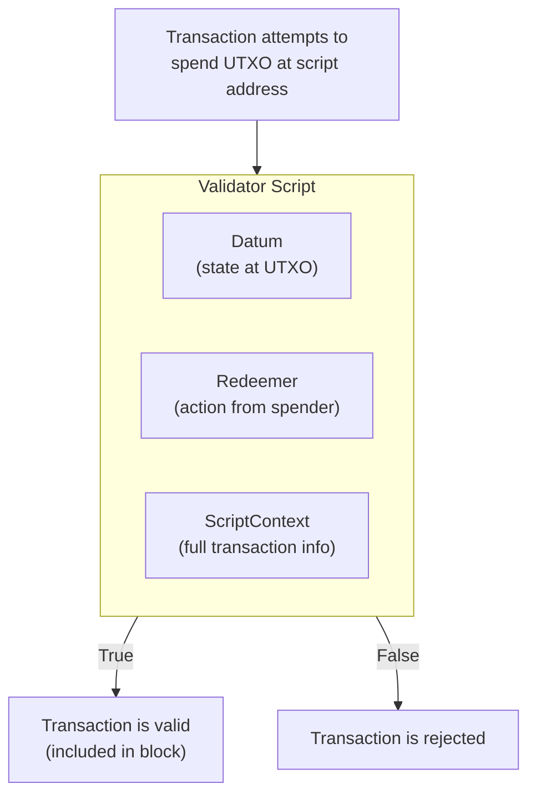
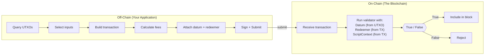
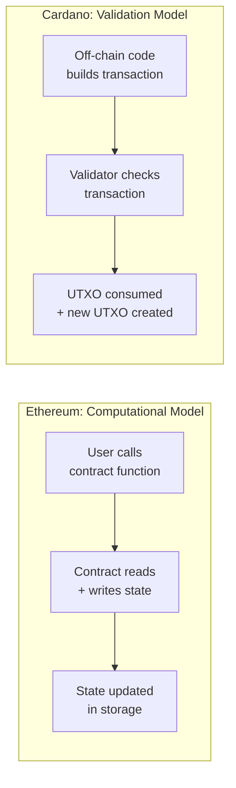

# Lesson #07: Smart Contracts Conceptually

A Cardano smart contract is a validator: a pure function that examines a proposed transaction and returns either "yes, this is allowed" or "no, this is not allowed." Validators do not maintain state, expose callable functions, or modify storage. They simply validate. This makes Cardano's approach fundamentally different from account-based chains like Ethereum.

In this lesson, we build a mental model of what smart contracts are on Cardano. You will learn what validators do, why Cardano separates on-chain and off-chain logic, what determinism means in practice, and how Cardano's model compares to Ethereum's. By the end, you should be able to reason about smart contract design without needing to understand any specific programming language.

## What Is a Smart Contract on Cardano?

A smart contract on Cardano is a validator script that receives information about a proposed transaction and returns a boolean decision: allow or deny. Unlike Ethereum contracts that store state and expose callable functions, Cardano validators are stateless, pure functions that only validate whether a transaction meets predefined rules.

At the most general level, a smart contract is **code that runs on a blockchain and enforces rules about how value can move**. But that definition is dangerously vague, because the *how* matters enormously.

On Ethereum, a smart contract is a persistent program that lives at an address, maintains its own state (storage variables), and exposes functions that anyone can call. When you interact with an Ethereum smart contract, you are essentially calling a function that reads and writes to global mutable state.

On Cardano, a smart contract is a **validator** that examines a proposed transaction and returns either `True` or `False`. It does not maintain state. It does not expose callable functions. It does not modify storage.

This distinction is fundamental, and everything else in this lesson flows from it.

## How Do Cardano Validators Work?

Cardano validators are scripts associated with blockchain addresses that execute when someone tries to spend a UTXO at that script address. The validator receives three arguments (datum, redeemer, and script context), examines the transaction, and returns `True` to approve or `False` to reject the entire transaction.



### What Can Validators See?

A validator has access to three pieces of information (which we explore deeply in Lesson 9):

1. **Datum**: Data attached to the UTXO being spent; think of it as the "state" stored at this script address.
2. **Redeemer**: Data provided by the person trying to spend the UTXO; think of it as the "action" or "argument" they are submitting.
3. **Script Context**: Information about the transaction itself: all inputs, all outputs, the fee, the validity interval, who signed it, what is being minted, and more.

The validator uses these three inputs to make its decision. It can check things like:

- "Is this transaction signed by the correct public key?"
- "Does the output send at least 10 ADA back to the script address?"
- "Is the current time after the deadline?"
- "Does the transaction mint exactly one token with the correct policy?"

### What Are the Limitations of Validators?

This is equally important. A Cardano validator **cannot**:

- Make network requests or access external data directly.
- Generate random numbers.
- Modify state (it has no writable storage).
- Call other contracts imperatively (it can only check that certain conditions about the transaction hold).
- Loop indefinitely (execution budgets enforce termination).

These limitations are features, not bugs. They make validators **deterministic**: the same inputs always produce the same outputs. This is the foundation of Cardano's predictability guarantees.

## How Does On-Chain Code Differ from Off-Chain Code?

On-chain code is the validator script that runs on every validating node and answers "is this transaction valid?" Off-chain code runs on the user's machine, constructs well-formed transactions, and answers "how do I build a transaction the validator will accept?" This separation enables efficiency, flexibility, and independent testability.



### On-Chain Code: The Validator

On-chain code is the validator script itself. It runs on every node that validates the transaction. Because it runs on hundreds or thousands of machines, it must be:

- **Small**: Every byte of script costs fees and consumes resources.
- **Efficient**: Execution is bounded by CPU and memory limits (ExUnits).
- **Pure**: No side effects, no I/O, no state mutation.
- **Deterministic**: The same inputs must always produce the same result.

On-chain code answers one question: "Is this transaction valid according to my rules?"

### Off-Chain Code: The Transaction Builder

Off-chain code runs on the user's machine (or a backend server). It is responsible for:

- Querying the blockchain for available UTXOs.
- Selecting which UTXOs to use as inputs.
- Constructing the transaction body with the right outputs, fees, and metadata.
- Providing the correct datum and redeemer values.
- Balancing the transaction (ensuring inputs = outputs + fees).
- Signing and submitting the transaction.

Off-chain code answers a different question: "How do I construct a transaction that the validator will accept?"

### How Do They Relate?

Think of it this way: the off-chain code is the **lawyer drafting a contract**, and the on-chain code is the **judge reviewing it**. The lawyer does the creative, complex work of figuring out what the agreement should look like. The judge simply checks whether it complies with the rules.

This separation has profound implications:

- **Efficiency**: The blockchain only runs validation logic, not construction logic. This makes on-chain execution dramatically cheaper.
- **Flexibility**: Off-chain code can be written in any language and use any library. Only the validator needs to compile to on-chain code.
- **Testability**: You can test your off-chain and on-chain logic independently.
- **Upgradeability**: You can update off-chain code (how transactions are built) without changing the on-chain validator.

## Why Does Determinism Matter for Cardano Smart Contracts?

Determinism means the outcome of a transaction is fully knowable before submission. When you build a Cardano transaction locally and it passes validation, you can be confident it will also pass validation on the blockchain. The result does not change between your local test and the actual execution, eliminating wasted fees, front-running, and MEV attacks.

### How Does Cardano Achieve Determinism?

Several design choices contribute to this property:

1. **UTXO model**: Transaction inputs are specific UTXOs, not account balances. The state a transaction reads is fixed at construction time, not at execution time.

2. **No global mutable state**: Validators do not read from or write to shared storage. They only see the transaction they are validating.

3. **Explicit time handling**: Time is expressed as slot ranges in the validity interval, not as "the current time when this happens to execute." The validator knows the transaction can only be included within a specific time window.

4. **Pure functions**: Validators are mathematical functions; same inputs, same outputs, every time. No randomness, no external data sources, no ambient state.

### Why Is Ethereum Not Deterministic?

On Ethereum, a transaction's outcome can change between when you submit it and when it executes because:

- Other transactions can modify the same state variables before yours runs.
- Gas prices can change, causing different execution paths.
- Block timestamps and other environmental values are not known at submission time.
- Transaction ordering within a block is controlled by miners/validators, leading to MEV (Maximal Extractable Value) attacks.

This non-determinism is why Ethereum transactions can "fail" after submission (reverting and consuming gas) and why MEV is such a significant problem. Cardano's deterministic design eliminates these issues by construction.

### What Are the Practical Benefits of Determinism?

Determinism means:
- **No wasted fees**: If your transaction will fail, you know before submitting. You never pay fees for a failed transaction (the one exception is phase-2 script failure, where collateral is consumed; but this is a bug in your off-chain code, not a fundamental uncertainty).
- **No front-running**: Since the outcome is fixed at construction time and does not depend on transaction ordering, MEV attacks are structurally impossible for most transaction types.
- **Predictable costs**: You know exactly how much a transaction will cost before submitting it.

## How Do Script Addresses Work on Cardano?

A script address is an on-chain address derived from the hash of a compiled validator script. Anyone can send ADA or tokens to this address, creating UTXOs "locked" by the validator. To spend those UTXOs, a transaction must satisfy the validator's conditions by providing a valid redeemer and passing evaluation.

### What Is the Script Address Derivation Process?

1. You write a validator (in Plutus, Aiken, or another language).
2. The validator compiles to UPLC (Untyped Plutus Lambda Calculus), the low-level on-chain bytecode.
3. The hash of the compiled script determines the script address.
4. UTXOs sent to this address can only be spent by transactions that pass the validator.

```
Validator Source Code (Aiken, Plutus, etc.)
        |
        v  [Compilation]
UPLC Bytecode
        |
        v  [Blake2b-224 Hash]
Script Hash
        |
        v  [Address Construction]
Script Address (addr1w8...)
        |
        v
UTXOs locked at this address
require the validator to approve spending
```

### How Does a Script Address Differ from a Payment Address?

A regular payment address (like Alice's wallet address) is derived from a public key. To spend from it, you need a signature from the corresponding private key. Simple.

A script address is derived from a script hash. To spend from it, you need to provide a redeemer and (depending on the era) the script itself, and the script must evaluate to `True`. There is no private key; the script IS the authorization mechanism.

This is incredibly powerful. It means authorization logic can be arbitrarily complex:

- Multi-signature requirements ("3 of 5 board members must sign").
- Time-based conditions ("funds can only be withdrawn after January 1, 2027").
- Value-based conditions ("at least 50% of the value must go to a specific address").
- Token-gated access ("the transaction must include a specific NFT as an input").

## How Does Cardano's Smart Contract Model Differ from Ethereum's?

Cardano uses a validation model where validators check whether a pre-constructed transaction is allowed, while Ethereum uses a computational model where contracts execute state changes imperatively. Cardano validators have no persistent state and no callable functions; Ethereum contracts store state and expose function endpoints.



### Ethereum: General-Purpose Computation

On Ethereum, smart contracts are persistent objects with:
- **State**: Storage variables that persist between calls.
- **Functions**: Callable entry points that modify state.
- **Message calls**: Contracts can call other contracts, creating complex call chains.
- **Gas model**: You pay for each computational step, and if you run out of gas mid-execution, the transaction reverts (but gas is still consumed).

An Ethereum contract might say: "When someone calls `transfer(to, amount)`, check their balance, deduct from their storage slot, add to the recipient's storage slot."

### Cardano: Validation, Not Computation

On Cardano, validators do not compute results; they validate transactions that were constructed off-chain:

- **No persistent state**: State is encoded in UTXOs (via datums), not in contract storage.
- **No callable functions**: There is no "call this contract." Instead, you "spend a UTXO at this script address."
- **No contract-to-contract calls**: A transaction can involve multiple validators (spending UTXOs from different script addresses), and each validator runs independently. They can observe the same transaction context, but they do not call each other.
- **No gas consumption on failure**: If a transaction fails local validation, it is never submitted and costs nothing.

### How Does a Concrete Example Compare?

Consider a simple escrow: Alice locks funds for Bob, and Bob can claim them by providing a secret.

**Ethereum approach:**
```
contract Escrow {
    address payable beneficiary;
    bytes32 secretHash;

    function claim(bytes secret) {
        require(hash(secret) == secretHash);   // check secret
        beneficiary.transfer(address(this).balance);  // move funds
    }
}
```
The contract stores state (beneficiary, secretHash), exposes a function (claim), and imperatively transfers funds.

**Cardano approach:**
The validator only checks: "Does the transaction provide a redeemer whose hash matches the datum? If yes, approve. If no, reject."
```
validator escrow(datum: SecretHash, redeemer: Secret, ctx: ScriptContext) -> Bool {
    hash(redeemer) == datum
}
```
The off-chain code is responsible for constructing a transaction that sends the funds to Bob. The validator just checks that the condition is met. The actual "transfer of funds" is encoded in the transaction's outputs, not executed by the script.

### What Is the Philosophical Difference?

Ethereum says: "Tell me what to do, and I will do it."
Cardano says: "Show me what you want to do, and I will tell you if it is allowed."

This is why Cardano's model is sometimes called the **"declarative" or "validation" model** versus Ethereum's **"imperative" or "computational" model**. Neither is inherently better, but they lead to very different architectures, patterns, and trade-offs.

## What Types of Scripts Does Cardano Support?

Cardano supports several categories of scripts: simple (native) scripts for basic signature and time-lock requirements, and Plutus scripts (V1, V2, V3) for Turing-complete validation logic. Additionally, specialized scripts serve as minting policies and staking validators.

### Simple Scripts (Native Scripts)

These are basic, non-Turing-complete scripts that were available before Plutus. They support:
- **Signature requirements**: "Must be signed by key X."
- **Time locks**: "Valid only after slot N" or "Valid only before slot M."
- **Multi-sig**: "Requires signatures from at least K of these N keys."
- **Logical combinations**: AND, OR, and threshold combinations of the above.

Simple scripts are lightweight and require no execution fees beyond the standard transaction fee. They are commonly used for multi-signature wallets and time-locked minting policies.

### Plutus Scripts (V1, V2, V3)

Plutus scripts are Turing-complete validators written in higher-level languages and compiled to UPLC. They can express arbitrary validation logic and have evolved across several versions:

- **Plutus V1** (Alonzo era): The original smart contract capability. Limited script context.
- **Plutus V2** (Vasil era): Added reference inputs, inline datums, reference scripts, and an enriched script context.
- **Plutus V3** (Chang hard fork, Conway era): Added governance-related features, new cryptographic primitives, and further optimizations.

Each version expands what validators can see and do, without breaking backward compatibility.

### Minting Policies

A minting policy is a special kind of script that controls whether native tokens can be minted or burned. When a transaction includes a mint field, the corresponding minting policy script is executed. We explore minting policies thoroughly in Lesson 10.

### Staking Validators

These scripts control stake delegation and reward withdrawal for script-based staking credentials. They are less common but important for protocol-level applications.

## How Does the EUTXO Model Enable Smart Contracts?

The Extended UTXO (EUTXO) model enhances the basic UTXO model by adding datums (arbitrary data attached to UTXOs), redeemers (action data from spenders), rich script context (full transaction visibility), and validator scripts (programmable addresses). These extensions transform simple value transfers into a full smart contract platform while preserving determinism and parallelism.

```
Basic UTXO:                    Extended UTXO (EUTXO):
+------------------+           +---------------------------+
| Address          |           | Script Address            |
| Value (ADA)      |           | Value (ADA + tokens)      |
+------------------+           | Datum (arbitrary data)    |
                               | Reference Script (optional)|
                               +---------------------------+

Spent by:                      Spent by:
  Signature from               Transaction that passes
  private key                  the validator with a
                               redeemer and valid context
```

These extensions transform the UTXO model from a simple value-transfer mechanism into a full smart contract platform, while preserving the UTXO model's benefits of determinism, parallelism, and local validation.

## Web2 Analogy

Let us map these concepts to patterns you already know from web development.

**Validators as Middleware Validation**: In Express.js or any web framework, you write middleware that checks incoming requests before they reach the route handler. A Cardano validator is middleware for the blockchain; it inspects the "request" (transaction) and either allows it through or rejects it. The critical difference is that blockchain middleware is immutable once deployed and runs on every node, not just your server.

**Validators as Database Constraints**: Think of `CHECK` constraints, `FOREIGN KEY` constraints, or trigger functions in PostgreSQL. These do not perform the insert or update themselves; they validate that a proposed change meets certain rules. A Cardano validator is exactly this: a constraint on what changes are allowed to UTXOs at its address.

**Off-Chain Code as API Client Logic**: In a typical web architecture, the frontend (React, Vue) constructs API requests: selecting parameters, formatting payloads, handling authentication tokens. The server (validator) then validates and processes those requests. Cardano's off-chain code plays the same role as the frontend: constructing well-formed "requests" (transactions) that the on-chain "server" (validator) will accept.

**Serverless Functions with Input/Output**: AWS Lambda functions take an input event, process it, and return a result. They do not maintain persistent connections or long-lived state. Cardano validators are similar; they are invoked with specific inputs (datum, redeemer, context), run a pure computation, and return a boolean result. Each invocation is independent.

**Script Addresses as Protected API Endpoints**: A script address is like an API endpoint that requires specific authentication and authorization to access. Anyone can send data to it (create UTXOs), but only authorized, properly-formatted requests (transactions with correct redeemers) can retrieve data from it (spend UTXOs).

**Determinism as Idempotent APIs**: In REST, idempotent operations (GET, PUT, DELETE) return the same result regardless of how many times you call them with the same input. Cardano transactions are even stronger; they are not just idempotent but fully deterministic. The outcome is known before execution, like calling a pure function with known arguments.

## Key Takeaways

- **Cardano smart contracts are validators**, not general-purpose programs. They check whether a transaction is allowed; they do not perform the transaction's logic themselves.
- **On-chain and off-chain code serve different roles**: On-chain code validates; off-chain code constructs. This separation enables efficiency, flexibility, and determinism.
- **Determinism is Cardano's superpower**: You know the exact outcome of a transaction before submitting it, eliminating wasted fees, front-running, and MEV attacks.
- **Script addresses lock UTXOs under programmable rules**, replacing private-key authorization with arbitrary validation logic.
- **The EUTXO model extends the UTXO model** with datums, redeemers, and script context, enabling full smart contract functionality while preserving the UTXO model's benefits.

## What's Next

You now have a conceptual understanding of what validators are and why Cardano's approach is different. In Lesson 8, we explore the languages and tools used to write these validators: Plutus, Aiken, and the compilation pipeline from high-level code down to UPLC bytecode, along with how execution costs are measured and managed.
