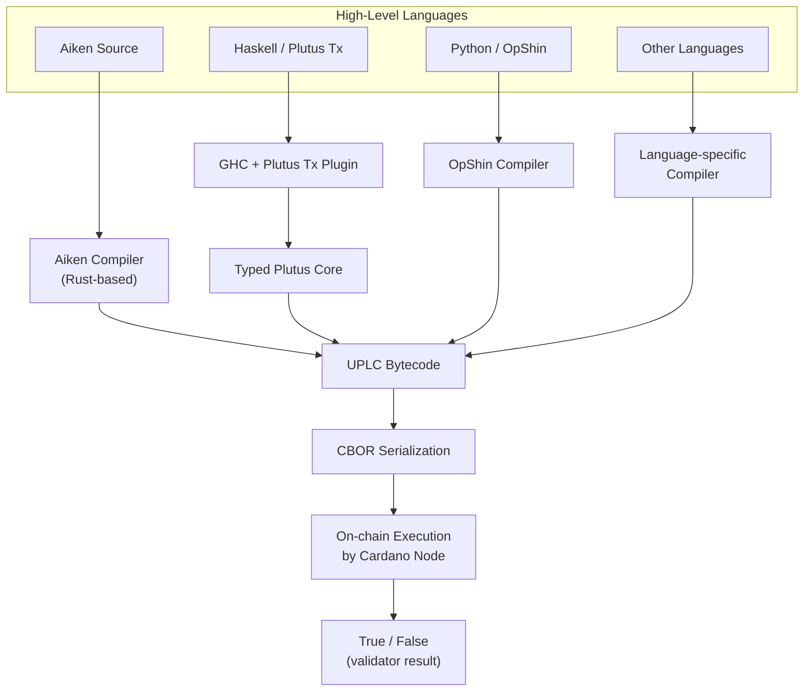
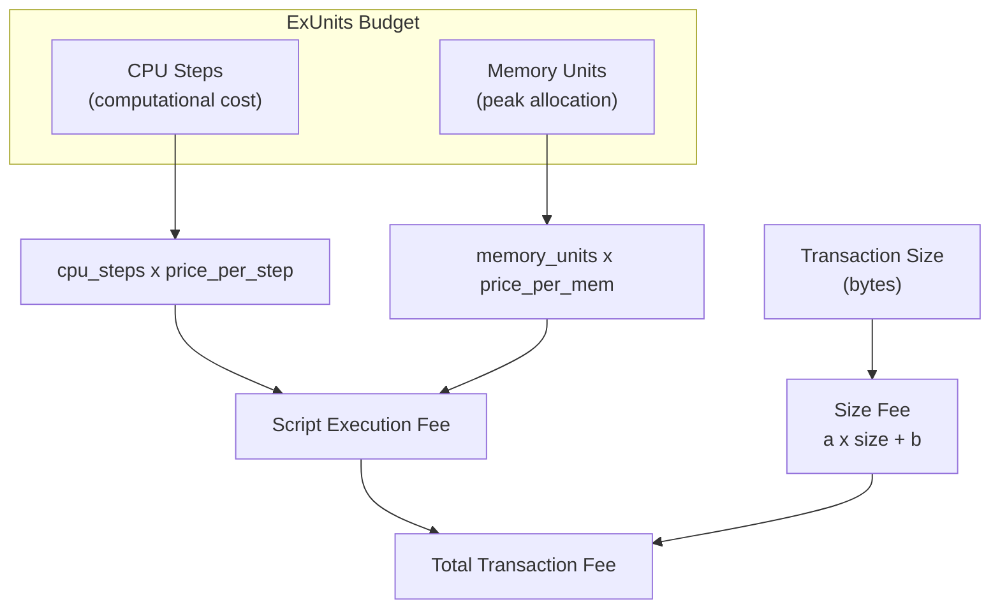

# Lesson #08: Plutus, Aiken, and Languages

Every Cardano smart contract, regardless of source language, compiles to UPLC (Untyped Plutus Lambda Calculus), a minimalist bytecode that Cardano nodes interpret and execute. This universal compilation target enables a rich ecosystem of languages (Aiken, Plutus Tx, OpShin, Helios, plu-ts) that each offer different trade-offs in ergonomics, performance, and maturity.

In this lesson, we trace the path from high-level source code to on-chain execution. You will learn what UPLC is and why it exists, how Plutus Tx and Aiken approach the compilation problem differently, how execution costs are measured and budgeted, what CIP-57 blueprints provide, and why formal verification matters in a world where deployed code is immutable.

## What Is UPLC and Why Is It Cardano's On-Chain Bytecode?

UPLC (Untyped Plutus Lambda Calculus) is the low-level, lambda calculus-based bytecode that every Cardano node interprets and executes when validating smart contract transactions. It provides a minimal, deterministic, and mathematically rigorous execution layer that any higher-level language can target as a compilation output.

### How Does UPLC Work?

UPLC is a minimalist functional programming language based on the lambda calculus. It is "untyped" in the sense that the type system is erased at this level. It is "Plutus" because it was designed as part of the Plutus smart contract platform. And it is "Lambda Calculus" because it is built on the mathematical foundation that underpins all functional programming.

UPLC supports a small set of operations:

- **Variables**: References to bound values.
- **Lambda abstractions**: Anonymous functions (function definitions).
- **Applications**: Applying a function to an argument (function calls).
- **Constants**: Literal values (integers, byte strings, booleans, etc.).
- **Built-in functions**: A fixed set of primitive operations (arithmetic, comparison, cryptographic hashing, data manipulation, etc.).
- **Force and Delay**: Mechanisms for controlling evaluation (related to polymorphism erasure).
- **Error**: A term that immediately halts execution with failure.

That is it. There are no loops, no mutable variables, no objects, no classes. Everything is expressed through function application and recursion. This extreme simplicity is intentional; it makes the language easy to analyze, reason about, and implement correctly on every node.

### Why Did Cardano Choose Lambda Calculus?

The choice of lambda calculus as the foundation was deliberate and strategic:

1. **Mathematical rigor**: Lambda calculus has been studied since the 1930s. Its properties are thoroughly understood, making it possible to reason formally about program behavior.

2. **Determinism**: Pure lambda calculus is inherently deterministic; no side effects, no state mutation, no I/O. This aligns perfectly with Cardano's determinism requirements.

3. **Simplicity of implementation**: The UPLC evaluator on each Cardano node is a small, auditable piece of code. A simpler runtime means fewer bugs and security vulnerabilities.

4. **Universal compilation target**: Any higher-level language can compile to lambda calculus. It serves as a "lingua franca" for smart contract languages, just as WebAssembly serves as a universal target for web languages.

## How Does the Cardano Smart Contract Compilation Pipeline Work?

The compilation pipeline transforms high-level source code (Aiken, Plutus Tx, OpShin, etc.) through language-specific compilers into UPLC bytecode, which is then CBOR-serialized for on-chain storage and execution by Cardano nodes. The exact intermediate steps vary by language, but the endpoint is always UPLC serialized as CBOR.



## How Does Plutus Tx Work for Haskell-Based Smart Contracts?

Plutus Tx is the original Cardano smart contract framework that uses a GHC (Glasgow Haskell Compiler) plugin and Template Haskell metaprogramming to capture Haskell expressions at compile time and translate them into Plutus Core, which is then lowered to UPLC. You write what looks like normal Haskell code, annotate it with a special splice, and the compiler plugin transforms it into on-chain bytecode.

```
-- Conceptual Plutus Tx validator structure
mkValidator :: Datum -> Redeemer -> ScriptContext -> Bool
mkValidator datum redeemer ctx =
    -- Validation logic here
    traceIfFalse "wrong redeemer" (redeemer == expectedValue)
```

### What Are the Strengths of Plutus Tx?

- **Haskell ecosystem**: Access to Haskell's powerful type system, including algebraic data types, type classes, and parametric polymorphism.
- **Shared code**: On-chain and off-chain code can share type definitions, reducing the chance of mismatches.
- **Formal verification potential**: Haskell's type system and purity make it amenable to formal methods.
- **Mature tooling**: Haskell has decades of tooling for testing, profiling, and analysis.

### What Are the Challenges of Plutus Tx?

- **Steep learning curve**: Haskell is notoriously difficult for developers coming from imperative languages. The combination of Haskell + blockchain + Template Haskell creates a formidable learning wall.
- **Compilation complexity**: The GHC plugin approach means build times can be long, error messages can be cryptic, and not all Haskell features are available (some standard library functions cannot compile to Plutus Core).
- **Script size**: Plutus Tx validators can be relatively large in byte terms, which translates to higher fees.
- **Limited subset**: You cannot use arbitrary Haskell; only the subset that the Plutus Tx compiler plugin can translate. This means no lazy I/O, no unsafePerformIO, no FFI, and restricted standard library usage.

## What Is Aiken and Why Has It Become the Most Popular Cardano Smart Contract Language?

Aiken is a purpose-built programming language designed from the ground up for writing Cardano smart contracts. It prioritizes developer experience, fast compilation (sub-second), and efficient UPLC output, borrowing syntax and concepts from modern languages like Rust, Elm, and Gleam to create something familiar yet purpose-built for on-chain validation.

```
// Conceptual Aiken validator structure
validator my_validator {
  spend(datum: MyDatum, redeemer: MyRedeemer, ctx: ScriptContext) {
    // Validation logic returns Bool
    redeemer.secret == datum.expected_hash
  }
}
```

### What Are the Key Features of Aiken?

- **Fast compilation**: Aiken compiles in seconds, not minutes. The compiler is written in Rust and is extremely fast.
- **Clear error messages**: Following the Elm/Rust tradition, Aiken provides helpful, human-readable error messages that point directly to the problem.
- **Built-in testing**: Aiken includes a test runner, so you can write and run unit tests for your validators without external tooling.
- **Efficient output**: Aiken's compiler produces small, optimized UPLC, often resulting in lower execution costs compared to equivalent Plutus Tx validators.
- **Purpose-built standard library**: The standard library contains exactly what you need for smart contract development; no more, no less.
- **Strong static typing**: Full algebraic data types, pattern matching, generics, and type inference; all the safety of a modern typed language.
- **No runtime**: Aiken has no garbage collector or runtime system. Everything compiles directly to UPLC.

### Why Has Aiken Gained Such Strong Adoption?

Aiken has become the most popular choice for new Cardano smart contract development for several reasons:

1. **Lower barrier to entry**: Developers familiar with Rust, TypeScript, or any ML-family language can be productive in Aiken quickly.
2. **Faster iteration**: Sub-second compile times mean rapid feedback loops during development.
3. **Smaller scripts**: Optimized UPLC output means lower transaction fees for end users.
4. **Active community**: Aiken has a growing ecosystem of libraries, tools, and educational resources.
5. **Clean separation**: Aiken is only for on-chain code. Off-chain code is written in whatever language your application uses (TypeScript, Python, Rust, etc.), which encourages the clean on-chain/off-chain separation that Cardano's architecture demands.

## What Other Smart Contract Languages Does Cardano Support?

Cardano supports several additional languages beyond Aiken and Plutus Tx, each targeting different developer communities. OpShin compiles a Python subset to UPLC, Helios offers a purely functional DSL, plu-ts lets you write validators in TypeScript, and Scalus brings Scala/JVM support.

### OpShin

OpShin allows you to write Cardano smart contracts in Python. It compiles a subset of Python to UPLC. For teams with Python expertise who find Haskell and even Aiken too unfamiliar, OpShin provides an accessible entry point.

### Helios

Helios is a purely functional domain-specific language for Cardano smart contracts. It compiles directly to UPLC and can run entirely in the browser, making it interesting for dApp development where the full pipeline (writing, compiling, and submitting) happens client-side.

### plu-ts

plu-ts lets you write Cardano smart contracts in TypeScript. The validator logic is expressed using TypeScript functions that compile to UPLC at runtime (in JavaScript). This is particularly appealing for full-stack TypeScript developers.

### Scalus

Scalus brings Cardano smart contract development to the Scala/JVM ecosystem, compiling Scala expressions to UPLC.

### Why Is Language Diversity a Strength?

The diversity of languages is a strength of Cardano's architecture. Because UPLC is a clean, well-specified compilation target, any language can target it. This is similar to how multiple languages (Rust, Go, C++) can compile to WebAssembly, or how multiple JVM languages (Java, Kotlin, Scala, Clojure) target the same bytecode.

## How Are Smart Contract Execution Costs Calculated on Cardano?

Cardano measures smart contract execution costs using ExUnits (Execution Units) across two dimensions: CPU steps (number of computational steps performed) and memory units (peak memory consumed during evaluation). Each script must declare its resource budget upfront, and fees are calculated by multiplying the consumed resources by their per-unit protocol prices.



### How Do CPU Steps and Memory Work?

**CPU (Steps)**: CPU measures the number of computational steps the script performs. Each UPLC built-in function has a defined CPU cost based on its arguments. Addition of small integers is cheap; cryptographic hashing is expensive. The costs are defined by a **cost model** that maps each primitive operation to its CPU cost.

**Memory**: Memory measures the maximum amount of memory the script uses during execution. Each value created during evaluation consumes memory, and the total peak memory usage determines the memory cost. Unlike CPU, memory is about peak usage, not cumulative allocation.

### What Are the ExUnits Budget Limits?

Every Plutus script execution must declare its resource budget upfront (as part of the transaction). The budget specifies exactly how many CPU steps and how many memory units the script is allowed to consume. If the script exceeds either limit, it fails.

There are also per-transaction and per-block limits:

```
Resource Hierarchy:
  Per-Block Budget (shared by all transactions in the block)
    |
    +-- Per-Transaction Budget (shared by all scripts in the transaction)
          |
          +-- Per-Script Budget (declared in the transaction)
```

Current approximate limits (these are protocol parameters that can change through governance):

- **Per-transaction**: ~10 billion CPU steps, ~14 million memory units.
- **Per-block**: ~20 billion CPU steps, ~62 million memory units.

### Why Do ExUnits Matter for Development?

Understanding ExUnits is essential because they directly impact:

- **Feasibility**: If your validator exceeds the per-transaction limits, it simply cannot be used. You must optimize or restructure.
- **Cost**: Higher ExUnits mean higher fees for your users.
- **Block space**: Transactions that consume more ExUnits take up more of the per-block budget, meaning fewer other transactions fit in the same block.

This is why Aiken's efficient UPLC output matters; smaller, faster scripts translate directly to lower costs and better user experience.

## What Are CIP-57 Plutus Blueprints and Why Do They Matter?

CIP-57 Plutus Blueprints are standardized, machine-readable JSON documents that describe a compiled smart contract's interface, including validator names, datum/redeemer schemas, data type definitions, and compiled UPLC bytecode. They function as Cardano's equivalent of an ABI (Application Binary Interface), enabling automatic code generation and tooling interoperability.

### What Does a Blueprint Contain?

A Plutus Blueprint includes:

- **Validator information**: Name, purpose (spending, minting, etc.), and the compiled script hash.
- **Parameter schemas**: The types and structure of datum, redeemer, and any parameterization.
- **Data definitions**: Full type definitions for all custom data types used in the contract.
- **Compiled code**: The actual UPLC bytecode (or a reference to it).

```
// Simplified blueprint structure (conceptual)
{
  "preamble": {
    "title": "My Escrow Contract",
    "version": "1.0.0"
  },
  "validators": [
    {
      "title": "escrow.spend",
      "datum": {
        "schema": { "$ref": "#/definitions/EscrowDatum" }
      },
      "redeemer": {
        "schema": { "$ref": "#/definitions/EscrowAction" }
      },
      "compiledCode": "5901a2010000...",
      "hash": "a1b2c3d4e5..."
    }
  ],
  "definitions": {
    "EscrowDatum": {
      "dataType": "constructor",
      "fields": [
        { "title": "beneficiary", "dataType": "bytes" },
        { "title": "deadline", "dataType": "integer" }
      ]
    }
  }
}
```

### How Do Blueprints Improve Development?

Before CIP-57, integrating with a Cardano smart contract required either:
- Reading the source code to understand the expected datum and redeemer formats.
- Relying on documentation that might be outdated or incomplete.
- Reverse-engineering the compiled UPLC (extremely difficult).

Blueprints solve this by providing a single, standardized, machine-readable artifact that contains everything an off-chain application needs to interact with the contract. This enables:

- **Code generation**: Tools can automatically generate TypeScript, Python, or Rust types from a blueprint, ensuring type-safe interaction with the contract.
- **Validation**: Off-chain code can validate datum and redeemer values against the blueprint schema before constructing a transaction.
- **Discoverability**: Developers can understand a contract's interface by inspecting its blueprint, without needing the source code.
- **Tooling interoperability**: Different off-chain frameworks (Lucid, MeshJS, PyCardano, etc.) can all consume the same blueprint format.

Aiken generates blueprints automatically as part of its build process. For Plutus Tx, blueprints can be generated with additional tooling.

## Why Does Formal Verification Matter for Smart Contracts?

Formal verification uses mathematical techniques to prove that a program satisfies its specification for all possible inputs, not just tested examples. For smart contracts, where bugs can cause irreversible loss of funds and deployed code is immutable, formal verification provides the strongest guarantee that validation logic behaves correctly under every scenario.

### Why Are the Stakes Uniquely High?

Smart contracts on Cardano are immutable once deployed (at a given script hash). You cannot patch a live contract. If a validator has a bug that allows unauthorized spending, the funds at that address are at risk, and there is no way to fix it except deploying a new contract and migrating (which may not be possible if the original contract does not include migration logic).

The stakes are uniquely high:
- **Immutability**: No hotfixes, no rollbacks.
- **Financial exposure**: Contracts often hold significant value.
- **Adversarial environment**: Unlike a private API, anyone in the world can attempt to exploit a smart contract.

### What Verification Approaches Does Cardano Support?

1. **Property-based testing**: Tools like QuickCheck (in Haskell) or Aiken's built-in testing generate thousands of random test cases and check that properties hold. This is not formal verification, but it catches many bugs that example-based testing misses.

2. **Type-driven correctness**: Strong type systems (as in Haskell and Aiken) prevent entire categories of bugs at compile time. If a value must be a positive integer, the type system can enforce this statically.

3. **Formal methods on UPLC**: Because UPLC is based on lambda calculus with well-understood semantics, it is theoretically possible to apply formal verification techniques directly to the compiled bytecode.

4. **Auditing**: Professional auditing firms review smart contract source code for vulnerabilities. While not a mathematical proof, expert review catches bugs that automated tools miss.

5. **Agda and formal proofs**: Cardano's own core libraries have been formally verified using Agda, a dependently typed language that can express and check mathematical proofs. Some research efforts extend this to smart contract verification.

### What Is the Practical Path to Contract Safety?

For most developers, the realistic path to contract safety is:

- Write in a strongly typed language (Aiken or Plutus Tx).
- Use property-based testing extensively.
- Write thorough unit and integration tests.
- Get a professional audit for any contract handling significant value.
- Keep validators small and focused; the less code, the less surface area for bugs.
- Use established patterns (covered in the next lessons) rather than inventing new ones.

## How Does the Cost Model Price UPLC Primitives?

The cost model is a set of protocol parameters (adjustable through Cardano governance) that maps each UPLC built-in function to a deterministic cost formula based on its arguments. Simple operations are cheap, operations that scale with input size are priced accordingly, and cryptographic operations cost more due to their computational intensity.

```
Examples of cost model entries (conceptual):
  addInteger:       cpu = 205665 + 812 * max(arg1_size, arg2_size)
  sha2_256:         cpu = 1927926 + 82523 * arg_size
  equalsByteString: cpu = 245000 + 216773 * min(arg1_size, arg2_size)
  ifThenElse:       cpu = 80556 (constant)
```

The cost model ensures that:
- Simple operations are cheap.
- Operations that scale with input size are priced accordingly.
- Cryptographic operations, which are computationally expensive, cost more.
- The cost is deterministic; the same operation with the same arguments always costs the same.

Understanding the cost model helps you write efficient validators. For example, if you need to compare two byte strings, doing it once is much cheaper than hashing both and comparing the hashes (because hashing is expensive).

## Web2 Analogy

**UPLC as JavaScript (compilation target)**: Just as TypeScript, CoffeeScript, Elm, and PureScript all compile to JavaScript for execution in the browser, Aiken, Plutus Tx, OpShin, and other Cardano languages all compile to UPLC for execution on-chain. You choose the language that fits your team's expertise and preferences, but the runtime is the same.

**UPLC as WebAssembly**: An even closer analogy is WASM (WebAssembly). WASM is a low-level binary format that serves as a compilation target for Rust, C++, Go, and others. It runs in a sandboxed environment with controlled resource limits. UPLC serves the same role for Cardano: a low-level, sandboxed, resource-limited execution target.

**ExUnits as Cloud Function Billing**: AWS Lambda bills you based on the number of requests, execution time (in milliseconds), and memory allocated. Cardano's ExUnits work the same way; you pay for CPU steps (execution time) and memory (allocation). Just as you optimize Lambda functions to reduce costs, you optimize validators to reduce ExUnits.

**CIP-57 Blueprints as API Schemas (OpenAPI/Swagger)**: An OpenAPI specification describes a REST API's endpoints, request bodies, response schemas, and authentication requirements. A Plutus Blueprint describes a validator's datum schema, redeemer schema, and compiled code. Both serve the same purpose: enabling tools and developers to interact with a service correctly without reading its implementation.

**The Cost Model as Cloud Pricing Tiers**: Cloud providers publish detailed pricing pages showing the cost per API call, per GB of storage, per million requests, etc. Cardano's cost model is the same concept: a published, transparent pricing structure for every computational operation. The key difference is that Cardano's pricing is enforced by protocol consensus, not by a company's billing department.

**Formal Verification as Type-Safe APIs**: If you have used TypeScript with strict mode, you know the value of catching errors at compile time rather than runtime. Formal verification extends this idea; instead of catching type errors, you catch logical errors. It is like having TypeScript's type system, but for your business logic, with mathematical proof that the rules cannot be violated.

## Key Takeaways

- **UPLC is the universal execution layer**: every Cardano smart contract language compiles to this lambda calculus-based bytecode, regardless of source language.
- **Aiken is the most popular choice** for new Cardano smart contract development, offering fast compilation, clear error messages, efficient output, and a gentle learning curve.
- **Plutus Tx provides the full power of Haskell** but with a steeper learning curve and more complex build process; it remains important for projects deeply embedded in the Haskell ecosystem.
- **Execution costs (ExUnits) are two-dimensional**: CPU steps and memory; and directly determine transaction fees for script-bearing transactions.
- **CIP-57 Blueprints standardize the contract interface**, enabling code generation, tooling interoperability, and reliable off-chain integration.

## What's Next

Now that you know how validators are written and compiled, it is time to understand the three arguments every validator receives. In Lesson 9, we deep-dive into datum, redeemer, and ScriptContext: the data model that powers all Cardano smart contract logic, and explore the common patterns that emerge from this architecture.
