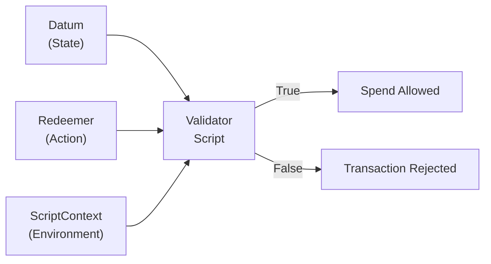
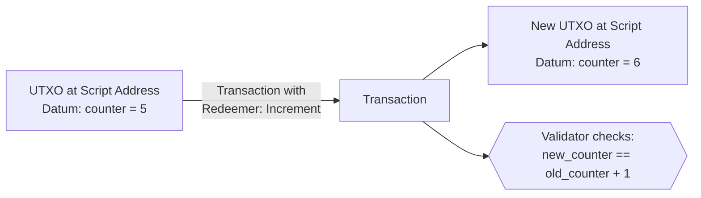

# Lesson #09: Datum, Redeemer, and ScriptContext

Every Cardano validator receives exactly three arguments: the datum (state locked at a script address), the redeemer (action submitted by the spender), and the ScriptContext (a comprehensive snapshot of the entire transaction). Together, these three arguments give validators everything they need to make authorization decisions about whether a UTXO can be spent.

In this lesson, we dissect each argument in depth, explore how they work together, examine the evolution of how datums are stored on-chain, understand reference scripts, and survey the common design patterns that emerge from this three-argument architecture.

## What Are the Three Arguments Every Cardano Validator Receives?

Every Cardano validator receives a datum (the state locked at the UTXO), a redeemer (the action the spender wants to perform), and a ScriptContext (a complete snapshot of the transaction including all inputs, outputs, signatures, and minting operations). The validator examines all three and returns `True` (allow) or `False` (reject).



When a transaction attempts to spend a UTXO sitting at a script address, the Cardano node invokes the validator script with these three arguments:

```
validator(datum, redeemer, scriptContext) -> Bool
```

1. **Datum**: Data associated with the UTXO being spent. It represents the "state" locked at the script address.
2. **Redeemer**: Data provided by the transaction that is trying to spend the UTXO. It represents the "action" the spender wants to take.
3. **ScriptContext**: A comprehensive snapshot of the entire transaction, including all inputs, outputs, signatures, minting, and more. It represents the "environment" in which the validation is happening.

Let us explore each one in detail.

## How Does the Datum Represent State on Cardano?

The datum is structured data attached to a UTXO when it is created, encoding whatever information the validator needs to make its decision about that specific UTXO. Because Cardano has no persistent contract storage, state is represented through datums attached to UTXOs; "updating" state means consuming the old UTXO and creating a new one with an updated datum.

### What Can a Datum Contain?

A datum can be any structured data that can be serialized to Cardano's on-chain data format (PlutusData). Common examples include:

- **Ownership information**: A public key hash identifying who is allowed to claim the UTXO.
- **Deadlines**: A POSIX timestamp or slot number after which certain actions are allowed or prohibited.
- **State values**: Counters, balances, configuration parameters, or any application-specific state.
- **Hashes or identifiers**: References to off-chain data, other UTXOs, or policy IDs.

```
-- Example: Escrow datum
EscrowDatum {
  beneficiary: PubKeyHash,       -- who can claim
  deadline: POSIXTime,           -- when the deadline expires
  refund_address: PubKeyHash     -- who gets a refund after deadline
}

-- Example: Auction datum
AuctionDatum {
  seller: PubKeyHash,
  highest_bid: Integer,
  highest_bidder: PubKeyHash,
  lot_asset: AssetClass,
  min_bid_increment: Integer,
  auction_end: POSIXTime
}
```

### How Does Datum-Based State Management Work?

In account-based systems like Ethereum, smart contract state lives in persistent storage variables. On Cardano, there is no persistent storage. Instead, **state is encoded in datums attached to UTXOs**.

When a validator wants to "update" its state, the transaction consumes the old UTXO (with the old datum) and creates a new UTXO at the same script address (with an updated datum). The validator checks that the state transition is valid.



This pattern (consuming a UTXO and recreating it with updated state) is the fundamental mechanism for state management on Cardano. It is sometimes called the **"continuing output" pattern** because the script address continues to hold a UTXO, just with new data.

### What Is the Difference Between Datum Hash and Inline Datum?

Historically, Cardano stored datums in two ways, and understanding the evolution matters:

**Datum Hash (pre-Vasil)**: The UTXO itself only contained a *hash* of the datum. The actual datum data had to be provided in the transaction that created the UTXO (stored in the transaction's auxiliary data) or in the transaction that spent it. This meant:
- To spend a UTXO, you needed to know the full datum (not just its hash).
- The datum had to be included in the spending transaction, increasing its size.
- If the datum was large, this increased fees significantly.
- If you lost track of the datum, the UTXO became effectively unspendable (the funds were locked forever).

**Inline Datum (post-Vasil, CIP-32)**: Since the Vasil hard fork, datums can be stored directly ("inline") in the UTXO itself. This means:
- Anyone can read the datum by inspecting the UTXO on-chain.
- The spending transaction does not need to include the full datum separately.
- There is no risk of losing track of the datum data.
- Other transactions can reference this datum via reference inputs (CIP-31).

```
Pre-Vasil UTXO:                    Post-Vasil UTXO:
+---------------------+            +---------------------+
| Address             |            | Address             |
| Value               |            | Value               |
| Datum Hash: 0xabc.. |            | Inline Datum:       |
+---------------------+            |   { counter: 5,     |
                                   |     owner: 0x123 }  |
Full datum must be                 +---------------------+
stored and provided
separately                         Datum is right there,
                                   readable by anyone
```

**Best Practice**: Use inline datums for virtually all new development. Datum hashes still work for backward compatibility, but inline datums are superior in almost every scenario.

## How Does the Redeemer Represent Actions in Cardano Smart Contracts?

The redeemer is data provided by the transaction attempting to spend a UTXO, telling the validator what action the spender wants to perform. Its structure is entirely defined by the validator (the protocol imposes no requirements), and it commonly takes the form of tagged action constructors that enable a single validator to support multiple distinct operations.

### What Can a Redeemer Contain?

The redeemer can be any PlutusData value. Common patterns include:

**Simple values**: A password, a secret, a number.
```
-- Simple: just provide the secret
Redeemer = ByteString   -- the secret that hashes to the datum
```

**Action tags**: An enumeration specifying which action the spender wants to perform.
```
-- Tagged actions for a multi-action contract
Redeemer =
  | Bid { amount: Integer }
  | Close
  | Cancel
  | Update { new_price: Integer }
```

**Proof data**: Evidence that the spender is authorized.
```
-- Merkle proof for airdrop claiming
Redeemer = MerkleProof {
  leaf_index: Integer,
  proof_hashes: List<ByteString>
}
```

### How Do Multi-Action Validators Use the Redeemer?

The redeemer tells the validator *what kind of operation* the spender is attempting. This enables a single validator to support multiple distinct operations. The validator pattern matches on the redeemer to determine which validation rules to apply:

```
validator multi_action(datum: State, redeemer: Action, ctx: ScriptContext) -> Bool {
  when redeemer is {
    Bid { amount } ->
      -- Check bid is higher than current, signed by bidder, etc.
      validate_bid(datum, amount, ctx)

    Close ->
      -- Check auction has ended, winner gets the lot, seller gets payment
      validate_close(datum, ctx)

    Cancel ->
      -- Check only the seller can cancel, and only before any bids
      validate_cancel(datum, ctx)
  }
}
```

This pattern is ubiquitous in Cardano smart contract development. Almost every non-trivial validator uses a redeemer with multiple constructors to represent different operations.

### How Does Redeemer Size Affect Transaction Costs?

The redeemer is included in the transaction body, so its size affects the transaction fee. Keep redeemers as small as practical. If your redeemer includes a large Merkle proof or other bulky data, this will increase costs.

## What Information Does the ScriptContext Provide to Validators?

The ScriptContext is the richest of the three arguments: a comprehensive data structure provided by the Cardano node that describes the entire transaction being validated. It contains TxInfo (all inputs, outputs, signatures, minting, fees, validity range, and more) plus a ScriptPurpose indicating why the validator is being invoked (spending, minting, certifying, or rewarding).

### What Does TxInfo Contain?

```
TxInfo {
  inputs:             List<TxInInfo>,       -- all inputs being consumed
  reference_inputs:   List<TxInInfo>,       -- all reference inputs (read-only)
  outputs:            List<TxOut>,          -- all outputs being created
  fee:                Value,                -- transaction fee
  mint:               Value,                -- tokens being minted/burned
  certificates:       List<DCert>,          -- stake certificates
  withdrawals:        Map<StakingCred, Int>,-- reward withdrawals
  valid_range:        POSIXTimeRange,       -- validity interval
  signatories:        List<PubKeyHash>,     -- who signed the transaction
  redeemers:          Map<ScriptPurpose, Redeemer>,
  datums:             Map<DatumHash, Datum>,
  id:                 TxId                  -- the transaction hash
}
```

### What Is the ScriptPurpose?

The ScriptPurpose tells the validator *why* it is being invoked:

```
ScriptPurpose =
  | Spending TxOutRef      -- spending a UTXO at a script address
  | Minting PolicyId       -- minting/burning tokens under this policy
  | Certifying DCert       -- issuing a stake certificate
  | Rewarding StakeCred    -- withdrawing staking rewards
  | Voting Voter           -- governance voting (Plutus V3)
  | Proposing              -- governance proposals (Plutus V3)
```

### What Do Validators Typically Check in the ScriptContext?

The ScriptContext is where most of the interesting validation logic happens. Here are the most common checks:

**Signature verification**: "Is the transaction signed by the expected key?"
```
-- Check that the datum's owner signed the transaction
list.has(ctx.transaction.signatories, datum.owner)
```

**Output inspection**: "Does the transaction create the correct outputs?"
```
-- Check that value is sent to the correct address
expect Some(output) = find_output_to(ctx.transaction.outputs, beneficiary_address)
output.value >= expected_amount
```

**Time range checking**: "Is the transaction within the allowed time window?"
```
-- Check that the deadline has passed
valid_range_start(ctx.transaction.valid_range) > datum.deadline
```

**Minting inspection**: "Are the correct tokens being minted?"
```
-- Check that exactly one token is minted under our policy
let minted = ctx.transaction.mint
quantity_of(minted, own_policy_id, token_name) == 1
```

**Input counting**: "Are the right UTXOs being consumed?"
```
-- Check that the oracle UTXO is included as a reference input
list.any(ctx.transaction.reference_inputs, fn(input) {
  input.output.address == oracle_address
})
```

### Why Is ScriptContext So Powerful?

ScriptContext is what makes Cardano validators so expressive despite being "just" boolean functions. A validator can enforce complex conditions about the *entire transaction*, not just the single UTXO it guards. This enables patterns that would be impossible if validators could only see their own input:

- **Multi-validator coordination**: Two validators running in the same transaction can each check for conditions that the other enforces, creating cooperative validation logic without direct communication.
- **Atomic swaps**: A validator can verify that a specific output exists in the transaction, enabling trustless exchanges in a single transaction.
- **Forwarder patterns**: A validator can delegate its decision to another validator by checking that another script input is present in the transaction.

## What Are the Common Smart Contract Design Patterns on Cardano?

Several design patterns have emerged from the datum-redeemer-context architecture, including state machines, multi-validator coordination, one-shot uniqueness guarantees, the withdraw-zero trick for efficiency, and beacon/pointer tokens for UTXO discoverability. Understanding these patterns is essential for smart contract design on Cardano.

### Pattern 1: State Machine

A state machine encodes a finite set of states in the datum and a set of transitions in the redeemer. The validator checks that each transition is valid given the current state.

```
Datum (State):          Redeemer (Transition):
  | Collecting          | Contribute { amount }
  | Funded              | Dispute
  | Disputed            | Resolve { ruling }
  | Completed           | Complete

Validator checks:
  Collecting + Contribute -> is amount sufficient? -> Collecting or Funded
  Funded + Dispute -> is disputer authorized? -> Disputed
  Disputed + Resolve -> is resolver the arbiter? -> Completed
  Funded + Complete -> has timeout passed? -> Completed
```

The transaction consumes the UTXO with the old state and creates a new UTXO with the new state. The validator verifies the transition is legal.

### Pattern 2: Multi-Validator (Validator Linking)

Complex applications often use multiple validators that cooperate within a single transaction. For example, a DEX (decentralized exchange) might have:

- A **liquidity pool validator** guarding the pool's reserves.
- A **minting policy** controlling LP tokens.
- An **order validator** holding pending swap orders.

All three validators run within a single transaction. The liquidity pool validator checks that the minting policy created the correct LP tokens. The minting policy checks that a pool UTXO is being consumed. They do not call each other; they independently verify conditions about the same transaction through ScriptContext.

```
Single Transaction:
  Inputs:
    - Pool UTXO (guarded by pool validator)
    - Order UTXO (guarded by order validator)

  Mint:
    - LP tokens (guarded by minting policy)

  Outputs:
    - Updated Pool UTXO (new reserves)
    - LP tokens to liquidity provider
    - Swapped tokens to trader

Each validator independently checks its rules against ScriptContext:
  Pool validator:  "Are reserves correctly updated? Are LP tokens minted?"
  Order validator: "Is the swap executed at the correct price?"
  Minting policy:  "Is the pool UTXO consumed? Is the amount correct?"
```

### Pattern 3: One-Shot Pattern

The one-shot pattern uses a specific UTXO as input to guarantee uniqueness. Since each UTXO can only be spent once, a validator or minting policy that requires a specific UTXO as input can only ever succeed once. This is commonly used for:

- **Unique token minting**: Mint an NFT by requiring a specific UTXO as input. Since that UTXO can never exist again, the minting can never be repeated.
- **Contract initialization**: Ensure a contract's initial state can only be created once.

### Pattern 4: Withdraw Zero Trick

A clever pattern where a spending validator delegates its logic to a staking validator by requiring a zero-ADA withdrawal from a staking script address. The staking validator runs once for the entire transaction (regardless of how many inputs trigger it), while a spending validator runs once per input. This is more efficient when a transaction spends many UTXOs from the same script address.

```
Spending validator (runs per input):
  "Check that the transaction includes a withdrawal from staking_script_address"

Staking validator (runs once for the whole transaction):
  "Perform the actual validation logic for all inputs"
```

### Pattern 5: Beacon/Pointer Token

A beacon token is a native token locked at a script address alongside a datum. It serves as a "pointer" that makes the UTXO easy to find. Without a beacon, finding a specific UTXO at a script address requires scanning all UTXOs at that address and inspecting their datums. With a beacon token (a unique token held at the script address), you can query the chain for the token's location and immediately find the right UTXO.

```
UTXO at script address:
  Value: 5 ADA + 1 BEACON_TOKEN
  Datum: { state data... }

Querying for BEACON_TOKEN immediately locates this specific UTXO
among potentially thousands at the same script address.
```

## How Do Reference Scripts (CIP-33) Reduce Transaction Costs?

Reference scripts allow a compiled validator to be stored once in a UTXO and referenced by all future transactions that need it, instead of including the full script bytes in every transaction. This reduces transaction sizes (lowering fees), removes practical limits on validator complexity, and enables one-time deployment costs shared across all users.

```
Step 1: Store the script in a UTXO
  Transaction creates:
    UTXO_Script at some_address
      Value: min ADA
      Reference Script: [compiled validator bytecode]

Step 2: Use the script via reference
  Transaction spends from script_address:
    Reference Input: UTXO_Script (not consumed, just referenced)
    Input: UTXO at script_address (being spent)
    Redeemer: { action data }

    The node reads the script from UTXO_Script
    and uses it to validate the spend.
```

### What Are the Benefits of Reference Scripts?

- **Lower fees**: Transactions do not include the script bytes, which can save thousands of bytes.
- **One-time deployment cost**: The script is stored once and reused by all transactions.
- **Larger validators**: Since the script is not in the transaction, the per-transaction size limit is less constraining.
- **Better user experience**: Wallets do not need to have the script locally; they just reference the on-chain copy.

### How Do You Deploy a Reference Script?

Deploying a reference script typically works like this:

1. Compile your validator to UPLC.
2. Create a transaction that outputs a UTXO containing the compiled script in its reference script field.
3. Send this UTXO to an address you control (so you can manage it, though it does not need to be spent; just exist).
4. Distribute the UTXO reference (transaction hash + index) to users and off-chain applications.
5. All subsequent transactions that interact with your validator reference this UTXO instead of including the script.

The reference script UTXO must remain unspent for as long as you want it to be available. If it is consumed, transactions referencing it will fail. This is why reference scripts are typically sent to addresses where they will not be accidentally spent.

## How Do Datum, Redeemer, and ScriptContext Work Together?

Let us trace a complete example to see how datum, redeemer, and ScriptContext work together. Consider a simple vesting contract: Alice locks 1000 ADA for Bob, who can claim it after a specific date.

**Step 1: Lock funds**

Alice creates a transaction with an output at the vesting script address:
```
Output:
  Address: vesting_script_address
  Value: 1000 ADA
  Inline Datum: {
    beneficiary: Bob's PubKeyHash,
    deadline: 1735689600  (January 1, 2025, as POSIX time)
  }
```

**Step 2: Bob claims (after deadline)**

Bob constructs a spending transaction:
```
Input: The UTXO Alice created (at vesting_script_address)
Redeemer: Claim   (a simple tag indicating the action)
Output: 999.8 ADA to Bob's wallet address
Fee: 0.2 ADA
Validity Interval: invalid_before = slot corresponding to Jan 2, 2025
Signatures: Bob's signature
```

**Step 3: Validator executes**

The node invokes the vesting validator with:

- **Datum**: `{ beneficiary: Bob's PubKeyHash, deadline: 1735689600 }`
- **Redeemer**: `Claim`
- **ScriptContext**: The full transaction info, including:
  - `signatories`: [Bob's PubKeyHash]
  - `valid_range`: starts after Jan 1, 2025
  - `outputs`: [999.8 ADA to Bob's address]

The validator checks:
1. Is the transaction signed by `datum.beneficiary` (Bob)? Check `ctx.transaction.signatories`.
2. Has the deadline passed? Check that `datum.deadline` is before the start of `ctx.transaction.valid_range`.

Both conditions are true, so the validator returns `True`, and the transaction is included in the next block.

**Step 3b: What if someone tries to claim early?**

If Eve tries to claim before the deadline with a validity interval starting before January 1, 2025, the validator checks the time condition and returns `False`. The transaction is rejected. Eve pays nothing because the transaction never made it on-chain.

## Web2 Analogy

**Datum as a Database Row**: The datum is like a row in a database table. It holds structured data (the "state") associated with a specific record (the UTXO). When you update the state, you essentially DELETE the old row and INSERT a new one (consume the old UTXO, create a new one). The validator acts like a database constraint or trigger that checks the update is valid.

**Redeemer as an API Request Body**: The redeemer is like the JSON body of a POST or PUT request to a REST API. It tells the server (validator) what action the client wants to perform and provides the necessary data to do it. An `{ "action": "bid", "amount": 500 }` request body is exactly analogous to a `Bid { amount: 500 }` redeemer.

**ScriptContext as Request Context / Middleware**: The ScriptContext is like the full HTTP request context available to middleware in Express or Django; it includes the request headers (signatures), the request body (redeemer, inputs), the response being constructed (outputs), authentication information (signatories), and timing information (validity interval). Just as middleware can inspect any aspect of the request to make authorization decisions, a validator can inspect any aspect of the transaction.

**Inline Datums as Embedded Documents (MongoDB)**: The shift from datum hashes to inline datums is analogous to the difference between storing a foreign key (a reference to data elsewhere) versus embedding the full document directly (as in MongoDB). Inline datums are the "embedded document" approach; the data is right there, self-contained and immediately accessible.

**Reference Scripts as Shared Libraries / CDN**: A reference script is like a JavaScript library hosted on a CDN. Instead of every page bundling jQuery locally, they all reference the same CDN-hosted copy. Similarly, instead of every transaction including the full validator script, they all reference the same on-chain copy. The benefits are the same: smaller payloads, faster loading, and single-source updates.

**State Machines as Workflow Engines**: The state machine pattern maps directly to workflow engines you may have used: tools like AWS Step Functions, Temporal, or even simple state machines in Redux. Each state (datum) has a set of valid transitions (redeemers), and the engine (validator) ensures transitions follow the defined rules.

**Multi-Validator as Microservices Transaction**: The multi-validator pattern is like a distributed transaction across microservices. In a saga pattern, multiple services each validate their part of an operation. On Cardano, multiple validators each check their part of the transaction. The key difference is that Cardano's approach is atomic; all validators must agree, or the entire transaction fails. There are no partial failures to handle.

## Key Takeaways

- **Datum is state**: it represents the data locked at a script address, encoding whatever information the validator needs. Use inline datums for all new development.
- **Redeemer is action**: it represents what the spender wants to do, typically using tagged constructors to support multiple operations in a single validator.
- **ScriptContext is environment**: it provides a complete view of the transaction, enabling validators to enforce rules about inputs, outputs, signatures, time, minting, and more.
- **State is managed through UTXO consumption and creation**: the "continuing output" pattern replaces mutable storage with atomic state transitions.
- **Reference scripts and inline datums dramatically improve efficiency**: they reduce transaction sizes, lower fees, and simplify off-chain development.

## What's Next

With a solid understanding of how validators work and what data they receive, we are ready to explore one of Cardano's most distinctive features: native tokens. In Lesson 10, we learn how minting policies use the same datum-redeemer-context architecture to control token creation and how Cardano's multi-asset ledger differs fundamentally from token models on other chains.
