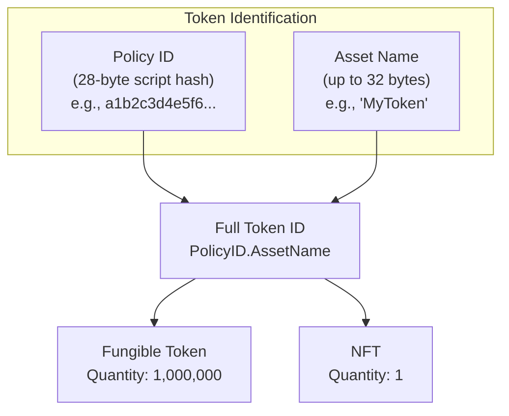
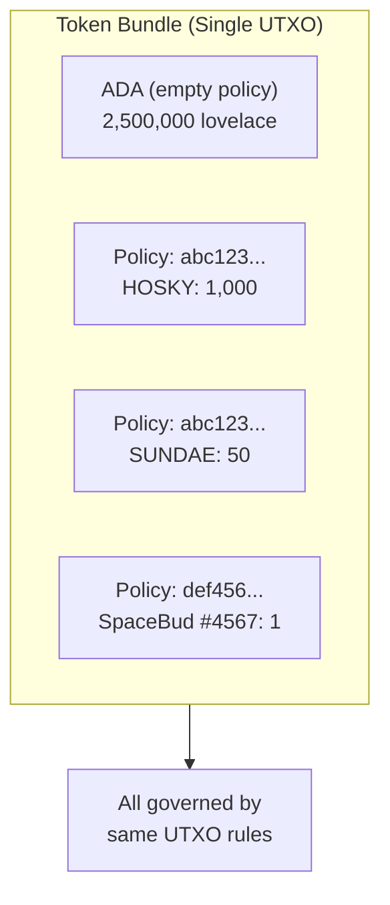
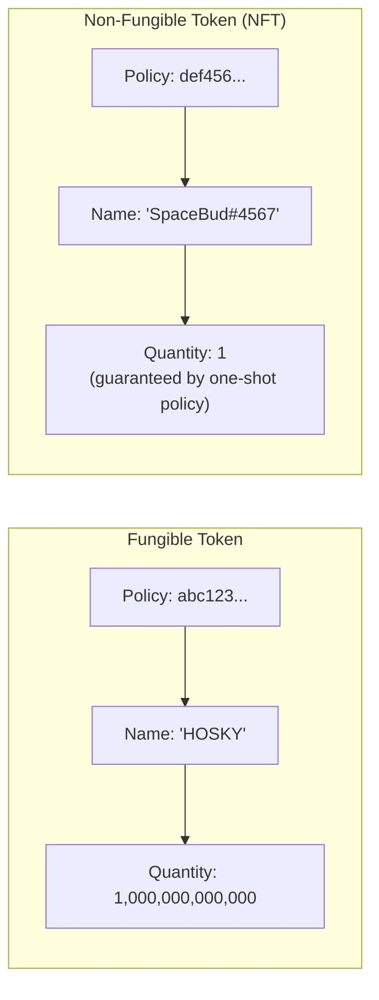
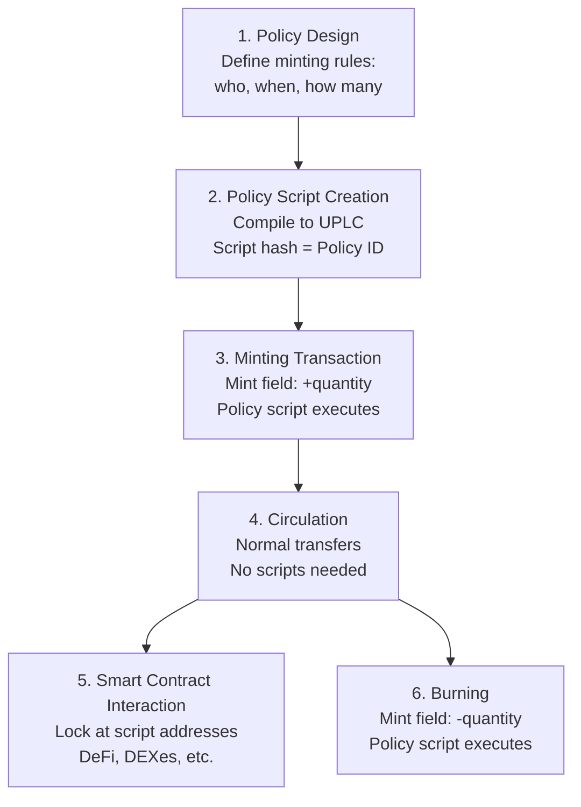

# Lesson #10: Native Tokens and Minting Policies

A Cardano native token is a custom asset tracked directly by the protocol's ledger infrastructure, alongside ADA, without requiring a smart contract for basic transfers. Unlike Ethereum's ERC-20 and ERC-721 tokens (which are smart contracts maintaining their own ledger), Cardano tokens live natively in the same UTXO system as ADA, making transfers cheaper, safer, and atomically composable.

In this lesson, we explore how native tokens work on Cardano, from the fundamentals of policy IDs and asset names to the minting policies that control token creation. You will learn the differences between fungible tokens and NFTs, understand the min ADA requirement for token-bearing UTXOs, and see how minting policies connect to everything you learned in previous lessons about validators, datums, and redeemers.

## What Makes Cardano Tokens "Native" Compared to Other Blockchains?

Cardano tokens are "native" because the protocol's ledger tracks them using the same UTXO machinery that tracks ADA, requiring no smart contract execution for basic transfers. This means lower fees, no contract-execution risk for transfers, atomic multi-asset transactions in a single output, and protocol-level conservation rules that prevent tokens from being created or spent illegitimately.

On Ethereum, creating a token means deploying a smart contract that implements an interface (ERC-20 for fungible tokens, ERC-721 for NFTs). The token's ledger (who owns how many) is stored in the contract's state. Transferring tokens means calling the contract's `transfer` function, which updates storage variables.

On Cardano, tokens are **native**; they are tracked by the same ledger machinery that tracks ADA. When you send native tokens in a transaction, the protocol handles it the same way it handles ADA: through inputs and outputs. No smart contract execution is required for basic transfers.

## How Are Tokens Identified on Cardano?

Every native token on Cardano is uniquely identified by two components: a Policy ID (the 28-byte hash of the minting policy script that authorized the token's creation) and an optional Asset Name (up to 32 bytes distinguishing individual tokens within the same policy). Together, these form a globally unique, immutable identifier.



### What Is a Policy ID?

The **policy ID** is the hash of the minting policy script that authorized the token's creation. It is a 28-byte (56 hex character) identifier that groups related tokens together. All tokens minted under the same policy share the same policy ID.

```
Policy ID: a1b2c3d4e5f6...  (56 hex characters)
```

The policy ID is immutable; it is derived from the script hash, so changing the minting policy would change the policy ID, creating an entirely different token. This means the rules for minting and burning a token are permanently encoded in its identity.

### What Is an Asset Name?

The **asset name** is an optional label (up to 32 bytes) that distinguishes individual tokens within the same policy. For a fungible token, there is typically one asset name. For an NFT collection, each NFT has a unique asset name under the same policy.

```
Policy ID: a1b2c3d4e5f6...
Asset Name: "MyToken"        (for a fungible token)

Policy ID: a1b2c3d4e5f6...
Asset Name: "Ape#0001"       (for NFT #1 in a collection)
Asset Name: "Ape#0002"       (for NFT #2 in the same collection)
```

The asset name can be empty (zero bytes), which is valid and sometimes used for single-token policies.

### Why Is ADA Special?

ADA is the only token on Cardano that does not have a policy ID. It is the **base currency** of the protocol: the unit in which fees are paid, rewards are distributed, and minimum UTXO values are calculated. In the multi-asset value structure, ADA is represented with an empty policy ID and empty asset name:

```
Value structure:
{
  "": {                          -- ADA (empty policy ID)
    "": 5000000                  -- 5 ADA in lovelace (empty asset name)
  },
  "a1b2c3...": {                 -- Custom token policy
    "MyToken": 100               -- 100 units of MyToken
  },
  "d4e5f6...": {                 -- NFT policy
    "UniqueArt": 1               -- 1 NFT
  }
}
```

This value structure (a nested map from policy ID to asset name to quantity) is called a **token bundle** or **multi-asset value**.

## How Do Token Bundles and Multi-Asset Values Work?

A token bundle is a nested map structure (`Map<PolicyID, Map<AssetName, Quantity>>`) that allows a single UTXO to carry ADA plus any number of different native tokens simultaneously. All assets in a bundle travel together, transfer in one transaction output, and are governed by the same UTXO rules, enabling atomic multi-asset transactions.



### How Does the Value Type Work?

On Cardano, the "value" field of every UTXO is not just a number (amount of ADA). It is a structured map:

```
Value = Map<PolicyID, Map<AssetName, Quantity>>
```

This means a single output can contain:

```
Output value:
  2.5 ADA
  + 1000 HOSKY tokens
  + 50 SUNDAE tokens
  + 1 SpaceBudz #4567 NFT
  + 3 WingRiders LP tokens
```

All of these travel together in one UTXO, transfer in one transaction output, and are governed by the same UTXO rules.

### What Are the Implications of Token Bundles?

**Efficiency**: Bundling multiple assets in a single UTXO is more storage-efficient than having separate UTXOs for each token type.

**Atomic transfers**: You can send multiple different token types to someone in a single output. This enables atomic swaps and complex multi-asset transactions.

**Complexity in coin selection**: When building a transaction, the coin selection algorithm must consider not just ADA balances but the complete multi-asset composition of each UTXO. This is significantly more complex than single-asset coin selection.

**Min ADA impact**: More tokens in a single output mean more bytes, which means a higher minimum ADA requirement (covered below).

## How Do Minting Policies Control Token Creation and Destruction?

A minting policy is a script that receives two arguments (a redeemer and ScriptContext) and returns a boolean decision on whether tokens can be minted (created with positive quantities) or burned (destroyed with negative quantities) under its policy ID. The policy executes whenever a transaction's `mint` field includes tokens under that policy, and the policy ID itself is the hash of the script.

Minting policies receive two arguments (not three like spending validators):

```
minting_policy(redeemer, scriptContext) -> Bool
```

There is no datum for minting policies; they are not associated with a specific UTXO being spent. Instead, they evaluate based on the redeemer provided by the transaction and the full ScriptContext.

The ScriptContext's `purpose` field will be `Minting(policy_id)`, telling the script it is being invoked as a minting policy. The script can then inspect the transaction to determine whether the minting or burning should be allowed.

### How Do Minting and Burning Differ?

- **Minting**: Creating new tokens. The `mint` field contains positive quantities.
- **Burning**: Destroying existing tokens. The `mint` field contains negative quantities.

The minting policy is invoked for both operations. It can choose to allow minting but not burning, or vice versa, or apply different rules to each.

```
Transaction with minting:
  Mint: { policy_abc: { "Token": +100 } }    -- mint 100 tokens

Transaction with burning:
  Mint: { policy_abc: { "Token": -50 } }     -- burn 50 tokens

Transaction with both:
  Mint: {
    policy_abc: { "Token": +100 },           -- mint 100 Token
    policy_xyz: { "OtherToken": -25 }         -- burn 25 OtherToken
  }
```

## What Types of Minting Policies Can You Create on Cardano?

Cardano supports several minting policy types: simple native script policies (signature and time-lock based, no Plutus required), one-shot policies (guaranteeing single-use minting via UTXO consumption), parameterized policies (with compile-time configuration), and multi-action Plutus policies (supporting multiple operations via redeemer pattern matching).

### Simple Script Policies (No Plutus Required)

The simplest minting policies use Cardano's native script language (not Plutus) and require only signatures and/or time constraints:

**Signature-based**: "Only the holder of key X can mint tokens under this policy."
```
Policy: RequireSignature(pub_key_hash_of_issuer)
```

**Time-locked**: "Tokens can only be minted before slot N."
```
Policy: RequireAllOf [
  RequireSignature(pub_key_hash_of_issuer),
  RequireTimeBefore(slot_1000000)
]
```

Time-locked policies are particularly important because once the time window closes, no one (not even the original issuer) can ever mint more tokens. This creates a **provably fixed supply**, which is a strong guarantee for token holders.

### One-Shot Minting Policy

The one-shot pattern (mentioned in Lesson 9) uses Plutus to guarantee that minting can only happen once, ever. The policy requires a specific UTXO as a transaction input:

```
one_shot_policy(redeemer, ctx: ScriptContext) -> Bool {
  // Check that a specific UTXO is consumed as input
  let must_consume = TxOutRef { tx_hash: specific_tx_hash, output_index: 0 }

  list.any(ctx.transaction.inputs, fn(input) {
    input.output_reference == must_consume
  })
}
```

Since UTXOs can only be spent once, and the policy ID is derived from the script (which includes the specific UTXO reference), this minting policy can only succeed once in the entire history of the blockchain. This is the standard way to create NFTs on Cardano.

### Parameterized Minting Policies

A parameterized minting policy takes parameters at compilation time that are baked into the script. This creates different policy IDs for different parameter values:

```
parameterized_policy(oracle_address: Address) -> MintingPolicy {
  fn(redeemer, ctx) -> Bool {
    // Check oracle UTXO for current price
    let oracle_input = find_reference_input(ctx, oracle_address)
    let price = extract_price(oracle_input)

    // Apply minting rules based on oracle price
    price > minimum_threshold
  }
}
```

Parameterization is powerful because it allows you to create families of related policies with different configurations, each with its own unique policy ID.

### Multi-Action Minting Policies

Just like spending validators, minting policies can use the redeemer to support multiple actions:

```
nft_collection_policy(redeemer: Action, ctx: ScriptContext) -> Bool {
  when redeemer is {
    MintNFT { token_name } ->
      // Check: minting exactly 1 token, metadata is valid, signed by artist
      validate_mint(token_name, ctx)

    BurnNFT { token_name } ->
      // Check: burning exactly 1 token, signed by current holder
      validate_burn(token_name, ctx)

    MintCollectionToken ->
      // Check: one-shot condition met, creating collection reference NFT
      validate_collection_init(ctx)
  }
}
```

## What Is the Difference Between Fungible Tokens and NFTs on Cardano?

The distinction between fungible tokens and NFTs on Cardano is simply a matter of quantity: a fungible token has a quantity greater than one (all units are identical and interchangeable), while an NFT has a quantity of exactly one (guaranteed by a one-shot minting policy). Both use the same PolicyID/AssetName identification structure.



### Fungible Tokens

A fungible token has a quantity greater than 1 (usually much greater). All units are identical and interchangeable; 100 HOSKY tokens are the same regardless of which specific units you hold.

Fungible tokens on Cardano can have any supply. The minting policy determines:
- How many can be minted (fixed supply, inflationary, capped, etc.).
- Who can mint them (anyone, specific keys, governance votes, etc.).
- When they can be minted (before a deadline, continuously, in epochs, etc.).

### Non-Fungible Tokens (NFTs)

An NFT is simply a token with a quantity of exactly 1. The minting policy guarantees that only one unit can ever exist. The one-shot pattern described above is the standard approach.

**NFT metadata** (name, image, description, attributes) is typically attached to the minting transaction using CIP-25 or CIP-68 metadata standards:

- **CIP-25**: Metadata is stored in the transaction's metadata field (key 721) during minting. It is not on the UTXO itself but is permanently recorded in the transaction on-chain.
- **CIP-68**: A more advanced standard that stores metadata in a reference NFT's datum (an inline datum on a UTXO). This allows metadata to be updated by consuming and recreating the reference UTXO.

```
CIP-68 pattern:
  Reference NFT (quantity: 1, asset name prefix: 000643b0):
    Locked at script address
    Inline datum: { name, image, attributes, ... }
    Can be updated by authorized transactions

  User NFT (quantity: 1, asset name prefix: 000de140):
    Held in user's wallet
    Proves ownership
    Metadata is read from the reference NFT
```

### Semi-Fungible Tokens

Some tokens fall between fungible and non-fungible. A quantity of, say, 100 of a specific token name might represent 100 tickets to an event; each is identical (fungible within the set) but represents a distinct category from other tokens.

## How Does Min ADA Affect Token-Bearing UTXOs?

Every token-bearing UTXO on Cardano must contain a minimum amount of ADA that scales with the output's byte size. Each additional token adds policy ID bytes (28), asset name bytes (up to 32), and quantity bytes to the serialized output, increasing the minimum ADA requirement from roughly 1.0 ADA for a simple output to 3-5+ ADA for outputs carrying many different tokens.

### Why Do Tokens Increase the Min ADA?

Each token in a UTXO adds data to the output:
- The policy ID (28 bytes).
- The asset name (up to 32 bytes).
- The quantity (variable size integer).

More tokens mean a larger serialized output, which means more bytes, which means a higher minimum ADA requirement.

### What Are the Practical Min ADA Estimates?

```
ADA-only output:                          ~1.0 ADA
1 token (1 policy, 1 name):              ~1.2 ADA
1 NFT with CIP-68 inline datum:          ~1.5-2.0 ADA
5 different tokens (5 policies):          ~2.0 ADA
20 different tokens (various policies):   ~3.5-5.0 ADA
Output with many tokens near size limit:  ~7-10+ ADA
```

### What Are the Design Implications?

**Token distribution cost**: If you want to airdrop a token to 10,000 wallets, each output needs at least ~1.2 ADA. That is 12,000 ADA just in min UTXO requirements (the recipients' wallets will hold this ADA alongside the tokens).

**Token consolidation**: If a user receives many small token amounts in separate UTXOs, each carries its own min ADA. Consolidating them (combining multiple UTXOs into one) frees up the excess ADA.

**NFT minting cost**: Each NFT you mint must be sent in a UTXO with min ADA. For a collection of 10,000 NFTs, this represents a significant ADA requirement during the minting process.

**Token bundle optimization**: Sending multiple token types in a single output is more ADA-efficient than sending each in a separate output, because the min ADA overhead is shared.

## What Is the Complete Lifecycle of a Native Token on Cardano?

A native token's lifecycle spans six stages: policy design (deciding minting rules), policy script creation (compiling to get a policy ID), the minting transaction (creating tokens on-chain), circulation (transferring via standard transactions without scripts), interaction with smart contracts (locking at script addresses for DeFi), and burning (permanently removing tokens from circulation).



### 1. Policy Design

The creator decides on the minting rules:
- Who can mint? (Specific keys, anyone meeting conditions, a DAO vote?)
- When can they mint? (Open-ended, time-limited, one-time?)
- How many? (Fixed supply, capped, unlimited?)
- Can tokens be burned? (Always, by holder only, never?)

### 2. Policy Script Creation

The minting policy is written as a native script or a Plutus/Aiken validator, then compiled. The script hash becomes the policy ID.

```
Source code (Aiken/Plutus)
  -> Compiled UPLC
  -> Script hash
  -> Policy ID: abc123def456...
```

### 3. Minting Transaction

A transaction is created that includes:
- The `mint` field: `{ policy_id: { "TokenName": +quantity } }`
- The minting policy script (or reference to it).
- A redeemer for the minting policy.
- Outputs that receive the newly minted tokens (with min ADA).

The minting policy script executes and must return `True` for the transaction to be valid.

```
Minting Transaction:
  Inputs:
    - UTXO_funding (ADA to cover fees and min UTXO)

  Mint:
    - abc123...: { "MYTOKEN": +1000000 }

  Outputs:
    - 1000000 MYTOKEN + 1.5 ADA -> Creator's address
    - Change ADA -> Creator's address

  Fee: ~0.2 ADA

  Witnesses:
    - Minting policy script (or reference)
    - Redeemer: MintAction
    - Creator's signature
```

### 4. Circulation

Once minted, the tokens circulate through normal transactions; no scripts needed. Users can send, receive, split, and combine token UTXOs using standard transactions with standard fees.

```
Transfer Transaction (no scripts):
  Inputs:
    - UTXO with 500 MYTOKEN + 2 ADA

  Outputs:
    - 200 MYTOKEN + 1.2 ADA -> Recipient
    - 300 MYTOKEN + 0.6 ADA -> Sender (change)

  Fee: ~0.18 ADA
```

### 5. Interaction with Smart Contracts

Tokens can be locked at script addresses, used in DeFi protocols, traded on DEXes, or involved in any smart contract logic. The validator at the script address can inspect token values in the ScriptContext just like it inspects ADA values.

### 6. Burning

If the minting policy allows it, tokens can be burned by including negative quantities in the `mint` field. The minting policy script executes again to authorize the burn. Burned tokens are permanently removed from circulation.

```
Burn Transaction:
  Inputs:
    - UTXO with 100 MYTOKEN + 1.5 ADA

  Mint:
    - abc123...: { "MYTOKEN": -100 }  (burning all 100)

  Outputs:
    - 1.3 ADA -> Sender (recovered min ADA minus fee)

  Fee: ~0.2 ADA
```

## What Are the Cardano Token Standards?

The Cardano community has developed several CIP (Cardano Improvement Proposal) standards for tokens: CIP-25 defines NFT metadata attached during minting (under transaction metadata key 721), CIP-68 stores updatable metadata in inline datums on reference NFTs, and CIP-26 provides an off-chain registry for human-readable token information like name, ticker, decimals, and logo.

### CIP-25: Media Token Metadata Standard

CIP-25 defines how to attach metadata to NFTs during minting. Metadata is placed in the transaction's metadata field under key 721.

```
Metadata key 721:
{
  "policy_id_hex": {
    "asset_name": {
      "name": "My NFT",
      "image": "ipfs://Qm...",
      "mediaType": "image/png",
      "description": "A unique digital artwork",
      "attributes": {
        "background": "blue",
        "rarity": "legendary"
      }
    }
  }
}
```

### CIP-68: Datum Metadata Standard

A more advanced standard that stores metadata in an inline datum on a reference NFT. This allows:
- **Updatable metadata**: The reference UTXO can be consumed and recreated with new metadata.
- **On-chain queryability**: Metadata in inline datums can be read by smart contracts via reference inputs.
- **Separation of ownership and metadata**: The user token (in the holder's wallet) and the reference token (at a script address with metadata) are distinct.

### CIP-26: Cardano Off-Chain Metadata

An off-chain registry where token projects can register human-readable information (name, ticker, decimals, logo) for their tokens. This is what wallets and explorers use to display token information in a user-friendly way.

### How Do Fungible Token Decimals Work?

A critical note: Cardano native tokens do not have a built-in decimal concept. All quantities are integers. If you want a token with 6 decimal places (like USDC), you mint tokens in micro-units and use off-chain conventions (registered via CIP-26) to display them with decimals.

```
On-chain: 1000000 (integer quantity)
Display:  1.000000 (with 6 decimals, per CIP-26 registration)
```

This is similar to how ADA and lovelace work; 1 ADA = 1,000,000 lovelace, and the protocol only knows about lovelace.

## How Does Cardano's Multi-Asset Ledger Compare to Ethereum's Smart Contract Tokens?

Cardano's native tokens live as ledger entries in the UTXO set and transfer through normal transaction outputs with standard fees, while Ethereum's tokens are smart contracts with their own storage that require function calls (and gas) for every transfer. Cardano's approach is simpler and safer for basic transfers but cannot enforce custom transfer logic (like blacklists) at the protocol level.

```
Ethereum (ERC-20):                    Cardano (Native Tokens):
============================          ============================
Token = Smart contract                Token = Ledger entry
State in contract storage             State in UTXOs
Transfer = Contract function call     Transfer = Normal TX output
Approval pattern (approve + spend)    No approval needed
Each token has its own "ledger"       All tokens share one ledger
Transfer requires gas for execution   Transfer has standard TX fee
Transfer can fail (contract logic)    Transfer cannot fail (ledger rule)
Composability via contract calls      Composability via TX structure
```

### What Are the Advantages of Native Tokens?

- **Simpler and safer**: No smart contract bugs in basic token transfers.
- **Cheaper**: No execution fees for standard transfers.
- **Atomic multi-asset**: One output, many tokens.
- **Uniform treatment**: The protocol treats all tokens equally (except ADA's special role in fees).

### What Are the Trade-offs?

- **No built-in transfer logic**: You cannot implement custom transfer rules (like blacklists or transfer fees) at the protocol level. On Ethereum, the ERC-20 contract can reject transfers. On Cardano, transfers are unrestricted once tokens exist; custom rules require locking tokens at script addresses.
- **Min ADA overhead**: Every token-bearing UTXO must carry ADA, which is an extra cost not present in Ethereum's model.
- **No built-in decimals**: As noted, decimal display is an off-chain convention, not a protocol feature.

## Web2 Analogy

**Policy ID and Asset Name as Composite Database Keys**: In a relational database, you might identify a product variant with a composite key of `(product_id, variant_sku)`. The policy ID is like the `product_id` (grouping related items), and the asset name is like the `variant_sku` (distinguishing specific items within the group). Together, they form a globally unique identifier.

**Minting Policies as API Permissions / OAuth Scopes**: A minting policy defines who can create tokens and under what conditions; this is exactly what API permissions and OAuth scopes do. An `admin:write` scope allows creating resources; a minting policy with a signature requirement allows creating tokens. A time-locked policy is like an API key with an expiration date. A one-shot policy is like a single-use invitation link.

**Native Tokens as CMS Assets**: In a content management system (CMS), you create assets (images, documents, videos) that live in the system's native storage. You can tag them, organize them into collections, and manage permissions. Cardano's native tokens work similarly; they are assets managed natively by the ledger's "content management system," with policies acting as permission rules and asset names acting as identifiers.

**Token Bundles as Shopping Cart Items**: A token bundle (a UTXO containing multiple token types) is like a shopping cart containing items from multiple vendors. Everything travels together, and the checkout (transaction) handles all items atomically. You do not need separate transactions for each vendor's items.

**CIP-25/CIP-68 Metadata as Product Catalog Entries**: Token metadata standards are like standardized product data formats (like Google Shopping feeds or Amazon product listings). They define a schema for how to describe a token (name, image, attributes), ensuring that wallets and marketplaces can display tokens consistently, just as e-commerce platforms display products consistently using standardized product data.

**Min ADA as Storage Quota**: The min ADA requirement is analogous to storage quotas in cloud services. Storing data (tokens in a UTXO) requires a minimum resource allocation (ADA). More data (more tokens) requires more resources. When you delete the data (burn the tokens or consolidate UTXOs), you reclaim the resources (get the ADA back).

## Key Takeaways

- **Cardano tokens are native**: they live in the same ledger as ADA, requiring no smart contract for basic transfers. This makes them simpler, cheaper, and safer than smart contract-based tokens.
- **Every token is identified by a Policy ID (script hash) and Asset Name**: together forming a globally unique, immutable identifier whose minting rules are cryptographically bound to the token's identity.
- **Minting policies control token creation and destruction**: ranging from simple signature/time-lock scripts to complex Plutus validators implementing one-shot, parameterized, or multi-action logic.
- **The multi-asset value model** allows a single UTXO to carry ADA plus any number of different tokens, enabling atomic multi-asset transactions and efficient token bundling.
- **Min ADA requirements ensure ledger sustainability**: every token-bearing UTXO must carry enough ADA to justify its storage cost, with the amount scaling based on the output's byte size.

## What's Next

Congratulations: you now have a comprehensive theoretical foundation in Cardano blockchain technology. From the UTXO model and consensus to transactions, smart contracts, and native tokens, you understand the conceptual architecture that powers one of the most principled blockchain platforms in existence. The next step is to move from theory to practice, applying these concepts with real tools, real code, and real transactions on Cardano's testnet.
