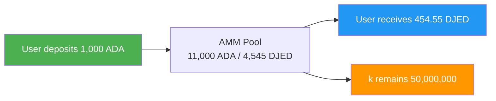
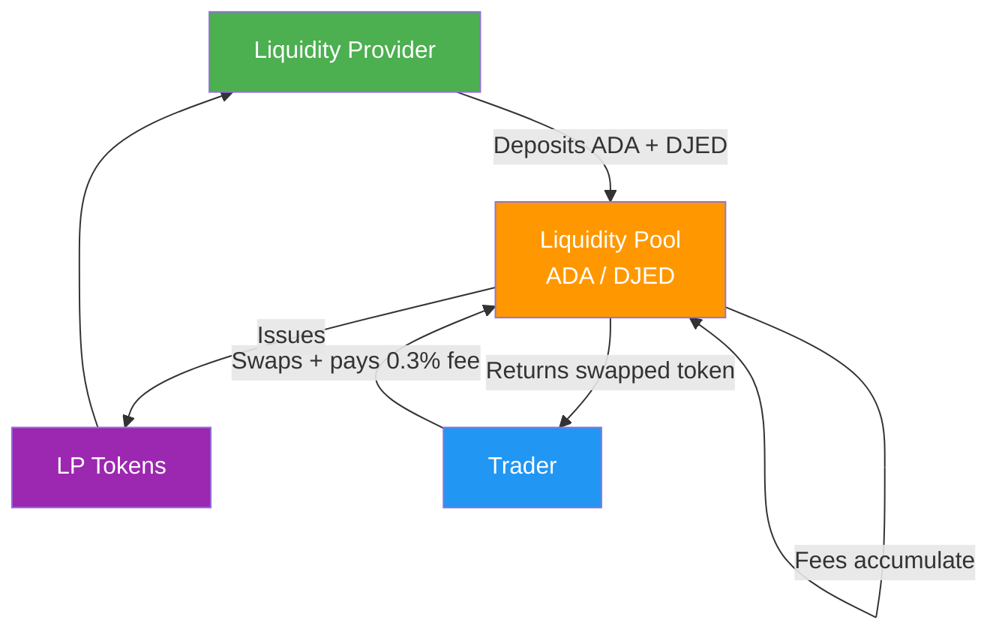
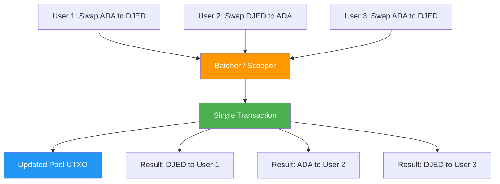

# Lesson #11: DeFi Concepts for Developers

Decentralized finance (DeFi) replaces traditional financial intermediaries with smart contract protocols, enabling permissionless trading, lending, and yield generation directly on the blockchain. For web2 developers, DeFi introduces a paradigm where financial logic lives on-chain, composable like microservices but trustless and permissionless. This lesson explores core DeFi primitives, how they work under the hood, and the specific design challenges and solutions that arise when building DeFi protocols on Cardano's eUTXO model.

## What Is the DeFi Landscape?

The DeFi landscape encompasses all financial protocols that replace traditional intermediaries (banks, brokerages, clearinghouses) with deterministic smart contracts executing on a blockchain. Each intermediary that DeFi removes eliminates a fee, reduces latency, and removes a trust requirement.

The DeFi ecosystem spans several categories of protocols:

- **Decentralized Exchanges (DEXes)**: Trade tokens without a centralized order book
- **Lending and Borrowing**: Supply assets to earn yield; borrow against collateral
- **Stablecoins**: Tokens pegged to fiat currencies through algorithmic or collateral-backed mechanisms
- **Yield Aggregators**: Automatically optimize returns across multiple protocols
- **Synthetic Assets**: On-chain representations of real-world assets
- **Insurance**: Decentralized coverage against smart contract failures

On Cardano, the DeFi ecosystem includes protocols like Minswap, SundaeSwap, and WingRiders (DEXes), Liqwid Finance and Lenfi (lending), Djed and iUSD (stablecoins), and Optim Finance (yield optimization). Each of these protocols works within the constraints and advantages of Cardano's eUTXO model, which leads to distinctive architectural patterns.

## What Are Decentralized Exchanges (DEXes)?

A decentralized exchange (DEX) allows users to swap one token for another through smart contracts, without a centralized intermediary holding custody of funds. Unlike Coinbase or Binance, where the exchange controls your assets during a trade, a DEX executes swaps where you never lose custody.

### How Do Order Books Compare to AMMs?

Traditional stock exchanges and centralized crypto exchanges use **order books**: a data structure that matches buy orders with sell orders at specific prices. Market makers place limit orders on both sides of the book, and trades execute when a buyer's price meets a seller's price.

```
Traditional Order Book:
+------------------------------------------+
|  SELL ORDERS (Asks)                      |
|  Sell 100 ADA @ $0.52                    |
|  Sell 250 ADA @ $0.51                    |
|  Sell 500 ADA @ $0.505                   |
|-------------- SPREAD -------------------|
|  Buy 300 ADA @ $0.50                     |
|  Buy 150 ADA @ $0.49                     |
|  Buy 400 ADA @ $0.485                    |
|  BUY ORDERS (Bids)                       |
+------------------------------------------+
```

On-chain order books are expensive because every order placement, cancellation, and modification requires a transaction. On blockchains with limited throughput, this model becomes impractical. Some Cardano DEXes like Genius Yield do implement on-chain order book models, using the eUTXO model's ability to represent each order as a distinct UTXO. But the dominant model in DeFi is the **Automated Market Maker (AMM)**.

### How Do Automated Market Makers (AMMs) Work?

An AMM replaces the order book with a mathematical formula that determines asset prices based on the ratio of reserves in a **liquidity pool**. Instead of matching individual buyers and sellers, anyone trades against the pool, and the formula automatically adjusts the price based on supply and demand.

The most common formula is the **constant product formula**, popularized by Uniswap on Ethereum and adopted by many Cardano DEXes:

```
x * y = k

Where:
  x = quantity of Token A in the pool
  y = quantity of Token B in the pool
  k = a constant (the product must remain the same after every trade)
```

Here is a concrete example. Suppose a liquidity pool contains:

- 10,000 ADA (Token A)
- 5,000 DJED (Token B)
- k = 10,000 * 5,000 = 50,000,000

A trader wants to buy DJED with 1,000 ADA. After the trade:

```
New ADA in pool:   10,000 + 1,000 = 11,000
New DJED in pool:  k / new_x = 50,000,000 / 11,000 = 4,545.45
DJED received:     5,000 - 4,545.45 = 454.55 DJED
Effective price:   1,000 ADA / 454.55 DJED = 2.20 ADA per DJED
```

Notice the trader received approximately 454.55 DJED instead of the expected 500 DJED (at the initial rate of 2 ADA per DJED). This difference is called **slippage**, and it increases with larger trades relative to pool size. The constant product formula creates a curve where the price moves more dramatically as you drain one side of the pool.



### What Other AMM Formulas Exist?

The constant product formula is not the only option. Different formulas optimize for different use cases:

- **Constant Sum (x + y = k)**: Offers zero slippage but can be fully drained of one asset. Rarely used in practice.
- **StableSwap (Curve)**: A hybrid formula optimized for assets that should trade near 1:1 (like stablecoin pairs). It behaves like constant sum near the center and constant product at the extremes, offering low slippage for balanced trades.
- **Concentrated Liquidity**: Allows liquidity providers to specify price ranges, concentrating capital where it is most useful. This increases capital efficiency dramatically but adds complexity.

On Cardano, Minswap uses a constant product AMM with a stableswap variant for stable pairs. SundaeSwap also implements a constant product model. The choice of formula affects the user experience, capital efficiency, and implementation complexity.

## How Do Liquidity Pools and Providers Work?

Liquidity pools hold paired token reserves that traders swap against. **Liquidity Providers (LPs)** deposit equal values of both tokens into the pool and receive **LP tokens** in return, representing their share of the pool. Trading fees accumulate in the pool, increasing the value of each LP token over time.



When an LP wants to withdraw, they burn their LP tokens and receive their proportional share of the pool, which now includes accumulated fees. This is how LPs earn yield: the trading fees paid by swappers accrue to the pool, increasing the value of each LP token over time.

### What Is Impermanent Loss?

Impermanent loss (IL) is the difference in value between holding tokens in an AMM pool versus simply holding them in a wallet. When the price ratio of pooled assets diverges from the deposit ratio, the AMM's constant rebalancing causes LPs to hold less of the appreciating asset than they would have by holding outright.

Consider an LP who deposits 1,000 ADA and 500 DJED (at a price of 2 ADA per DJED). If the price of ADA doubles relative to DJED:

```
Initial deposit:  1,000 ADA + 500 DJED
If held (no LP):  1,000 ADA (now worth 2x) + 500 DJED = $3,000 equivalent
As LP after price change: ~707 ADA + ~707 DJED = ~$2,828 equivalent

Impermanent loss: ~5.7%
```

The loss is called "impermanent" because if the price returns to the original ratio, the loss disappears. It only becomes permanent when the LP withdraws at a different price ratio. Trading fees can offset impermanent loss, but during periods of high volatility, IL can exceed fee income.

For web2 developers, think of impermanent loss as a "rebalancing cost." The AMM constantly sells the appreciating asset and buys the depreciating one. The LP essentially pays for price discovery.

## How Do Oracles Bring Off-Chain Data On-Chain?

Oracles feed external data into the blockchain, bridging the gap between on-chain smart contracts and off-chain information sources like price feeds, weather data, or sports results. Smart contracts cannot natively query APIs, so oracles post verified data as on-chain datums that contracts can reference.

On Cardano, oracles typically post data as **datums** attached to UTXOs at a known script address. Smart contracts then reference these UTXOs as inputs to read the latest data. Key oracle providers in the Cardano ecosystem include:

- **Charli3**: A native Cardano oracle providing price feeds and other data
- **Orcfax**: A decentralized oracle solution emphasizing data authenticity and provenance
- **Iagon**: A decentralized storage and compute oracle provider in the Cardano ecosystem

The **oracle problem** is fundamental: how do you trust that the data posted on-chain is accurate? Solutions include using multiple independent data sources, economic incentives (staking collateral that can be slashed for bad data), and cryptographic proofs. Oracles remain one of the most critical and vulnerable components of DeFi infrastructure. A compromised oracle can cause lending protocols to liquidate positions incorrectly, DEXes to offer mispriced trades, or stablecoins to lose their peg.

## What Are the eUTXO Design Challenges for DeFi?

Cardano's eUTXO model requires DeFi protocols to solve concurrency differently than Ethereum's account model, because a single UTXO can only be consumed by one transaction per block. Developers have created order batching and pool sharding patterns to handle this constraint while preserving the model's determinism and front-running resistance.

### What Is the Concurrency Problem?

In an account-based model (Ethereum), a smart contract holds a single mutable state. Multiple users can interact with it in the same block, and the blockchain resolves the ordering. In Cardano's eUTXO model, a UTXO can only be spent once. If a liquidity pool is represented as a single UTXO, only one user can interact with it per block.

```
The Concurrency Challenge:

Block N:
  User A wants to swap ADA to DJED  --+
  User B wants to swap ADA to DJED  --+--> Only ONE can spend the pool UTXO
  User C wants to swap DJED to ADA  --+

  Result: Two transactions fail with "UTXO already spent"
```

This is not a bug in eUTXO; it is a fundamental difference in the model. Cardano developers have created several patterns to address this challenge.

### How Does Order Batching Solve Concurrency?

The most common pattern on Cardano DEXes is **order batching**. Instead of users directly interacting with the liquidity pool, they submit **order UTXOs** that express their intent (for example, "swap 100 ADA for DJED with maximum 2% slippage"). A **batcher** (sometimes called a scooper) collects multiple orders and executes them against the pool in a single transaction.



This pattern has several advantages. Multiple orders process atomically in a single transaction, reducing contention. The batcher can optimize the order of execution. Users do not need to compete for the pool UTXO directly.

However, batching introduces latency (users must wait for the batcher to include their order) and requires trust in the batcher (though the smart contract enforces correctness). Most Cardano DEXes decentralize the batcher role by allowing anyone to run a batcher and earn fees.

### How Does Pool Sharding Work?

Another approach splits the liquidity pool across multiple UTXOs. Instead of one UTXO holding all the liquidity, the pool can be represented as several smaller UTXOs, each holding a portion. This allows multiple transactions to execute concurrently against different UTXOs.

```
Multiple Pool UTXOs:

Instead of one pool UTXO with 100,000 ADA / 50,000 DJED:

+----------------+  +----------------+  +----------------+
| Pool Shard 1   |  | Pool Shard 2   |  | Pool Shard 3   |
| 33,333 ADA     |  | 33,333 ADA     |  | 33,334 ADA     |
| 16,667 DJED    |  | 16,667 DJED    |  | 16,666 DJED    |
+----------------+  +----------------+  +----------------+

Three users can now swap concurrently against different shards.
```

The trade-off is increased complexity in maintaining consistent pricing across shards and potential for higher slippage on individual shards (since each contains less liquidity).

### How Does Determinism Give eUTXO a DeFi Advantage?

While concurrency is a challenge, the eUTXO model offers a powerful advantage for DeFi: **determinism**. On Ethereum, a transaction might succeed in your local simulation but fail on-chain because another transaction changed the contract's state between your submission and execution (known as MEV, or Miner/Maximal Extractable Value). On Cardano, transaction outcomes are fully deterministic. If a transaction validates locally, it will produce the exact same result on-chain, assuming its input UTXOs have not been spent.

This determinism also means that Cardano is inherently resistant to **front-running**, a practice where miners or validators reorder transactions to profit at the expense of users. Because Cardano transactions specify their exact inputs and outputs, validators cannot insert their own transactions ahead of yours to manipulate the price.

## What Makes Composability DeFi's Superpower?

Composability allows developers to combine multiple DeFi protocols in a single atomic transaction, creating complex financial operations from simple building blocks. In web2 terms, imagine if every API in the world shared the same authentication system, the same data format, and could be called in a single atomic request that either fully succeeds or fully rolls back.

On Cardano, composability manifests through the ability to reference multiple script inputs and outputs in a single transaction. A single transaction could:

1. Withdraw collateral from a lending protocol
2. Swap that collateral on a DEX
3. Provide liquidity to a different pool
4. Mint an NFT receipt

All atomically. If any step fails, the entire transaction is invalid and no state changes occur.

This composability is what makes DeFi protocols behave like "money Legos": stackable, interchangeable building blocks that create increasingly complex financial instruments from simple primitives.

## Why Are Flash Loans Absent on Cardano?

Flash loans on Ethereum allow users to borrow unlimited tokens with no collateral, provided they repay the loan within the same transaction. Cardano's eUTXO model prevents this because each transaction must balance its inputs and outputs at construction time; you cannot "borrow" assets mid-transaction.

On Ethereum, flash loans work because the EVM processes transactions sequentially within a block and can check at the end of a transaction whether the loan was repaid. On Cardano, the transaction must be fully defined before submission.

Some protocols have explored alternatives, such as "flash-loan-like" patterns using multiple chained transactions, but the eUTXO model fundamentally prevents the single-transaction unbacked borrowing that characterizes Ethereum flash loans.

This is actually a security advantage. Flash loans on Ethereum have been used to execute complex attacks against DeFi protocols, manipulating prices and draining funds in a single transaction. Cardano's model makes these attack vectors significantly harder to exploit.

## How Do Yield Farming and Liquidity Mining Work?

Yield farming is the practice of strategically deploying capital across DeFi protocols to maximize returns, while liquidity mining specifically distributes governance tokens to liquidity providers as additional incentives beyond trading fees.

On Cardano, yield farming opportunities include:

- Providing liquidity on DEXes and earning trading fees plus protocol tokens (for example, MIN tokens from Minswap)
- Lending assets on platforms like Liqwid and earning interest plus protocol tokens
- Staking LP tokens in "farms" for additional rewards
- Participating in liquidity bootstrapping events for new tokens

The yields in DeFi are not magical. They come from trading fees (real economic activity), token emissions (inflationary rewards that may or may not retain value), and protocol revenue sharing. Understanding the source of yield is critical for evaluating risk.

## Web2 Analogy

If you are coming from web2, many DeFi concepts have familiar analogues:

**DEXes are like stock exchange matching engines**, except the matching logic is public, anyone can be a market maker, and there is no broker between you and the market. Where a stock exchange has proprietary matching algorithms, an AMM publishes its formula for anyone to verify and interact with.

**AMM liquidity pools are like connection pools in web servers.** A connection pool maintains a set of pre-established database connections that multiple requests can use. Similarly, a liquidity pool maintains a reserve of assets that multiple traders can swap against. The pool must be sized appropriately for demand; too small and you get congestion (high slippage), too large and resources are underutilized (low returns for LPs).

**Oracles are like API aggregators or webhook providers.** In web2, you might use a service like Plaid to aggregate banking data or a price feed API like Alpha Vantage. Oracles serve the same purpose but must solve for trustlessness. Imagine building a system where you cannot trust any single API provider, so you query five providers, discard outliers, and take the median. That is essentially how decentralized oracles work.

**Order batching is like batch processing in message queues.** Instead of processing each message (order) individually, a consumer (batcher) collects messages from a queue, processes them in bulk, and writes results back. Think of it as Amazon SQS where a Lambda function polls for messages and processes them in batches for efficiency.

**Impermanent loss is like the cost of maintaining a cache under write-heavy workloads.** You pre-allocate resources (liquidity) to serve requests (trades) more efficiently, but if the underlying data (prices) changes rapidly, your cache (pool ratio) becomes stale and the cost of rebalancing exceeds the benefit of caching.

**Composability is like Unix pipes** where the output of one program becomes the input of another, except every command in the pipeline either fully succeeds or fully rolls back. It is `grep | sort | uniq` but with atomicity guarantees that web2 developers can only dream of.

## Key Takeaways

- **AMMs replace order books** with mathematical formulas (like the constant product formula) that automatically price assets based on pool reserves, enabling permissionless trading without centralized intermediaries.
- **Liquidity providers earn fees but face impermanent loss**: a hidden cost that arises when the price ratio of pooled assets diverges from the ratio at deposit time.
- **Oracles bridge the on-chain/off-chain gap** by posting external data as datums, but they introduce trust assumptions that must be carefully managed.
- **Cardano's eUTXO model requires DeFi-specific patterns** like order batching and pool sharding to handle concurrency, but it provides determinism and front-running resistance as powerful compensating advantages.
- **Composability makes DeFi protocols interoperable building blocks**, enabling complex financial operations in single atomic transactions.

## What's Next

Now that you understand the financial primitives that power DeFi, the next lesson explores the infrastructure that makes Cardano's network tick: stake pools, delegation, and the consensus mechanism that secures every transaction discussed so far.
