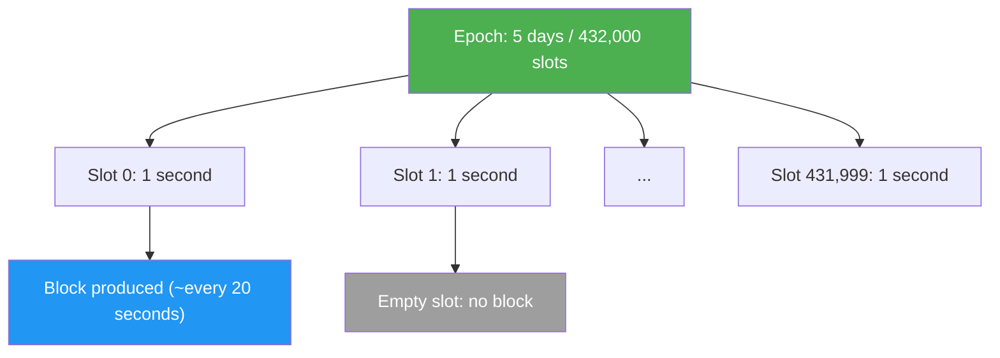
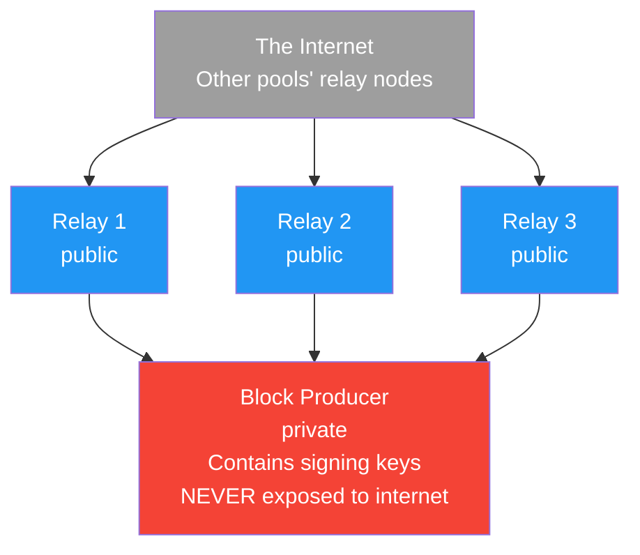
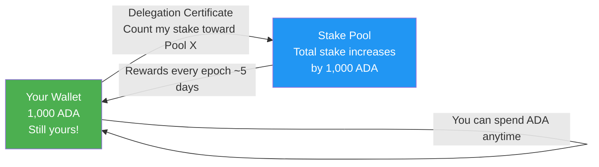
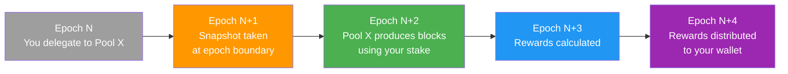

# Lesson #12: Stake Pools, Delegation, and Network

Cardano's proof-of-stake consensus secures the network through ADA holders collectively delegating their stake to stake pools, which produce blocks and earn rewards proportional to their total delegated stake. For web2 developers, understanding how stake pools, delegation, and network topology work is essential because these mechanisms directly affect transaction finality, network throughput, and the economic incentives that keep the system honest. This lesson dives deep into the machinery that powers Cardano's consensus layer.

## What Is Proof of Stake and Why Does It Matter?

Proof of stake replaces energy-intensive mining with economic stake, asking "who has the most to lose?" instead of "who has the most computing power?" Validators commit their own assets as collateral: honest behavior earns rewards, while misbehavior risks losing stake. The security assumption is that rational actors with significant economic exposure will act in the network's best interest.

In proof-of-work systems like Bitcoin, miners compete to solve computationally expensive puzzles. The winner proposes the next block and earns a reward. Security comes from the fact that attacking the network requires controlling a majority of the world's mining power, an astronomically expensive proposition.

Cardano's proof-of-stake protocol is called **Ouroboros**, and it is the first proof-of-stake protocol with a rigorous mathematical security proof published in peer-reviewed academic venues. Ouroboros has evolved through several iterations:

- **Ouroboros Classic** (2017): The foundational protocol proving PoS can achieve the same security guarantees as PoW
- **Ouroboros Praos** (2018): Added semi-synchronous network assumptions and private leader selection to prevent targeted attacks on upcoming block producers
- **Ouroboros Genesis** (paper 2018, implementation in progress): Enables new nodes to bootstrap from the genesis block without needing a trusted checkpoint
- **Ouroboros Leios** (in development): Aims to dramatically increase throughput through input endorsers and pipeline-style block production

## How Does Ouroboros Select Block Producers?

Ouroboros divides time into epochs (5 days each) and slots (1 second each), then pseudo-randomly selects a stake pool as the slot leader for each slot, with selection probability proportional to the pool's total delegated stake. Only the selected pool knows it has been chosen, preventing denial-of-service attacks against upcoming block producers.



At the beginning of each epoch, the protocol runs a **leader selection** process. For each slot in the upcoming epoch, it pseudo-randomly selects a stake pool to be the **slot leader** (the entity authorized to produce a block for that slot). The probability of selection is proportional to the pool's total stake (its own pledge plus all delegated ADA).

```
Leader Selection Probability:

Pool A:  50 million ADA staked  -->  ~0.14% chance per slot
Pool B: 200 million ADA staked  -->  ~0.56% chance per slot
Pool C:   5 million ADA staked  -->  ~0.014% chance per slot

Circulating ADA supply: ~37.6 billion (as of 2025)
```

The selection is **private**, meaning only the selected pool knows it has been chosen for a given slot. This prevents adversaries from targeting upcoming block producers with denial-of-service attacks. The pool proves it was selected by revealing a verifiable random function (VRF) output when it produces the block.

## What Does a Stake Pool's Architecture Look Like?

A Cardano stake pool consists of a private block producer node (holding cryptographic signing keys) shielded behind multiple public relay nodes that connect to the broader network. This separation ensures that even if an attacker compromises a relay, the signing keys remain isolated and secure.

### What Node Types Make Up a Stake Pool?



**Block Producer Node**: This is the core of the stake pool. It holds the pool's cryptographic keys (cold key, KES key, VRF key) and is responsible for minting blocks when the pool is elected as slot leader. The block producer should never be directly accessible from the internet. It communicates only with the pool's own relay nodes.

**Relay Nodes**: These are publicly accessible nodes that connect to the broader Cardano network. They receive transactions and blocks from other nodes, forward them to the block producer, and propagate the pool's newly minted blocks to the network. Running multiple relays in different geographic regions improves redundancy and network connectivity.

### What Keys and Certificates Does a Stake Pool Use?

Operating a stake pool involves several cryptographic keys, each serving a different purpose:

- **Cold Key**: The pool's identity key. Used to sign pool registration certificates. Stored offline for maximum security. Think of it as the root CA certificate for your pool.
- **KES Key (Key Evolving Signature)**: Used to sign blocks. It evolves forward periodically (every 129,600 slots, approximately 36 hours) and old keys are deleted, providing **forward security**. Even if an attacker obtains a current KES key, they cannot forge blocks for past periods.
- **VRF Key (Verifiable Random Function)**: Used to prove the pool's eligibility to produce a block in a given slot. The VRF output is included in the block header as proof.
- **Operational Certificate**: Links the cold key to the KES key, allowing the block producer to sign blocks on behalf of the pool without exposing the cold key.

```
Key Hierarchy:

Cold Key (offline, pool identity)
    |
    +--> Signs: Pool Registration Certificate
    |              (registers/updates pool on-chain)
    |
    +--> Signs: Operational Certificate
                    |
                    +--> Authorizes: KES Key (online, signs blocks)
                                         |
                                         +--> Proves: VRF Key output
                                                      (slot leadership)
```

## How Does Non-Custodial Delegation Work?

Delegation on Cardano is non-custodial: your ADA never leaves your wallet. Instead, you issue an on-chain certificate that assigns your staking rights to a chosen pool, while retaining full spending control with no lock-up period, no minimum amount, and no slashing risk.



This is fundamentally different from staking on many other blockchains where you must lock your tokens, send them to a validator, or wait through an "unbonding period" to get them back. On Cardano:

- **No lock-up**: Your ADA is always liquid. You can spend it at any time.
- **No minimum**: You can delegate any amount of ADA.
- **No slashing**: Your delegated ADA is never at risk. If the pool operator misbehaves, you simply miss out on rewards for that epoch; you never lose principal.
- **Automatic re-delegation**: If you add more ADA to your wallet, it is automatically included in your delegation from the next snapshot.

The no-slashing property is particularly notable. On Ethereum, validators can lose a portion of their staked ETH through slashing if they sign contradictory blocks or go offline for extended periods. Cardano chose a different approach: instead of punishing bad behavior with financial penalties, the protocol simply does not reward it. A pool that misses its assigned blocks earns no rewards for those slots, which naturally drives delegators to more reliable pools.

### What Is the Delegation Cycle?

Delegation follows a specific timing cycle tied to epochs:



This delay exists because of how Ouroboros calculates slot leadership. The stake snapshot from Epoch N determines slot leaders for Epoch N+2, and rewards for Epoch N+2 are calculated and distributed in Epochs N+3 and N+4. After the initial delay (~15 to 20 days), rewards arrive every epoch (every 5 days) as long as the pool produces blocks.

## How Are Staking Rewards Distributed?

Staking rewards come from two sources: monetary expansion (new ADA minted from the reserve) and transaction fees paid by users. The protocol splits the total reward pot between the treasury (20%) and stake pool rewards (80%), with pool rewards further divided based on performance, pledge, and operator margin.

### What Factors Determine Pool Rewards?

The reward formula accounts for several factors:

```
Pool Reward Factors:

1. Performance: Ratio of blocks actually produced to blocks expected
   (A pool assigned 100 slots that produces 98 blocks has performance = 0.98)

2. Pledge (s): The pool operator's own ADA committed to the pool
   (Higher pledge leads to slightly higher rewards via the a0 parameter)

3. Total Stake (z): Pool's share of total staked ADA
   (More stake leads to more slots, more blocks, more rewards)

4. Saturation (k): Maximum effective pool size
   (Currently k = 500, meaning optimal pool size is roughly 71 million ADA)
   (Pools above saturation earn LESS per ADA staked)

5. Fixed Cost (min 170 ADA per epoch): Covers operational expenses
   (Deducted before rewards are shared with delegators)

6. Margin (0-100%): Pool operator's cut of remaining rewards
   (Typical margins range from 1% to 5%)
```

## How Does Saturation Drive Decentralization?

The saturation mechanism prevents stake concentration by reducing per-ADA rewards for pools that exceed the saturation point (total ADA supply divided by the k parameter, currently about 71 million ADA). This creates a natural incentive for delegators to move their stake to smaller, unsaturated pools.

The **saturation point** is calculated as:

```
Saturation Point = Total Active Stake / k
                 ≈ 37.6 billion / 500
                 ≈ 75 million ADA
```

When a pool's total stake exceeds the saturation point, rewards per ADA staked begin to diminish. This creates a natural incentive for delegators to move their stake to smaller, unsaturated pools.

If the Cardano community decides it wants more decentralization, the k parameter can be increased (for example, to 1,000), which would lower the saturation point and incentivize stake to spread across more pools. This is a governance decision made through the on-chain governance process.

## What Role Does Pledge Play in Stake Pool Economics?

Pledge is the amount of ADA that the pool operator personally commits to their own pool, serving as Sybil resistance, incentive alignment, and a trust signal to delegators. The a0 parameter in the reward formula gives a bonus to pools with higher pledge, making it more profitable to run one well-pledged pool than many zero-pledge pools.

1. **Sybil resistance**: Without pledge incentives, an attacker could create thousands of pools with no personal investment.

2. **Alignment of incentives**: A pool operator with significant pledge has strong motivation to keep the pool running reliably, because they personally earn rewards proportional to their stake.

3. **Trust signal**: Higher pledge demonstrates the operator's confidence in their own pool and provides delegators with assurance that the operator has skin in the game.

```
Pledge Impact Example:

Pool A: 100,000 ADA pledge, 50M total stake
Pool B: 1,000,000 ADA pledge, 50M total stake

Both pools produce the same number of blocks, but Pool B
earns slightly higher total rewards due to the a0 parameter,
which rewards higher pledge.

The difference is currently modest (a0 = 0.3), but it provides
a meaningful signal and incentive at scale.
```

## How Is the Cardano Network Structured?

Cardano's network is a peer-to-peer system where nodes dynamically discover and connect to peers through a gossip protocol, classifying connections as hot (active), warm (idle), or cold (known but disconnected) to optimize performance and resilience.

### How Did Cardano Transition from Static to Dynamic Topology?

Initially, Cardano used a **static topology** where relay nodes were manually configured with lists of peers. With the rollout of **Peer-to-Peer (P2P) networking** (enabled in the Ouroboros network stack), nodes can now dynamically discover and connect to peers without centralized coordination:

The P2P system includes several components:

- **Peer Discovery**: Nodes share their known peers with other nodes through a gossip protocol
- **Peer Selection**: Nodes classify peers as "hot" (actively exchanging data), "warm" (connected but idle), or "cold" (known but not connected), and dynamically adjust connections based on performance
- **Connection Manager**: Handles connection limits, prioritization, and graceful handoffs between peers

### How Does Block Propagation Work?

When a stake pool produces a block, it must propagate through the network quickly enough that all other nodes receive it before the next block is due. The target is for blocks to reach 95% of the network within 5 seconds.

Block size, network latency, and the number of hops between nodes all affect propagation time. This is why geographic distribution of relay nodes matters: a pool with relays in North America, Europe, and Asia will propagate blocks faster than one with all relays in a single data center.

## What Are the Operational Requirements for Running a Stake Pool?

While this is a theory course, understanding the operational requirements helps developers appreciate what SPOs do:

- **Hardware**: Minimum 16 GB RAM, 4 CPU cores, 200 GB SSD storage (growing over time as the blockchain grows), and reliable internet connectivity
- **Uptime**: Pools must be online when assigned slot leadership. Missing blocks means missing rewards and losing delegator trust
- **Key Management**: Cold keys must be stored securely offline. KES keys must be rotated every 62 KES periods (~90 days). Operational certificates must be reissued with each KES rotation
- **Monitoring**: SPOs monitor block production, network connectivity, resource usage, and peer connections. Missing a single block can be detected and diagnosed through tools like CNCLI, Prometheus, and Grafana
- **Updates**: SPOs must upgrade their node software when new versions are released, especially for hard fork events where protocol rules change

## Web2 Analogy

The Cardano staking ecosystem maps surprisingly well to web2 infrastructure patterns:

**Stake pools are like CDN edge nodes.** A Content Delivery Network (like Cloudflare or AWS CloudFront) distributes copies of your content across many servers worldwide. Each edge node serves a portion of requests. Similarly, stake pools distribute the work of block production across many operators. Just as CDN providers compete on performance, uptime, and pricing, stake pools compete on reliability, fees, and community engagement.

**Relay nodes are like load balancers.** In a typical web2 deployment, a load balancer (such as Nginx, HAProxy, or AWS ALB) sits in front of your application servers, distributing incoming traffic and providing a stable entry point. Relay nodes serve the same purpose: they accept connections from the broader network and route traffic to the block producer, which (like an application server) is never directly exposed.

**Delegation is like DNS-based traffic routing.** When you configure your DNS to point to a specific CDN or hosting provider, you are "delegating" your traffic to their infrastructure. You still own your domain (your ADA), you can change providers at any time (re-delegate), and there is no lock-in period. The provider handles the operational burden of serving your traffic (producing blocks).

**The saturation mechanism is like auto-scaling policies.** In cloud environments, you set maximum instance counts and scaling policies to prevent any single server from becoming overloaded. Saturation serves the same purpose at a network level: it prevents any single pool from becoming too large and incentivizes load distribution across many operators. It is the blockchain equivalent of a "max connections per server" setting.

**KES key rotation is like TLS certificate renewal.** Just as you must periodically renew your SSL/TLS certificates (and services like Let's Encrypt automate 90-day rotations), SPOs must rotate their KES keys every ~129 days. The forward-security property of KES keys is analogous to TLS forward secrecy: compromising a current key does not compromise past sessions or blocks.

**Epoch-based reward distribution is like monthly cloud billing.** You do not get charged in real-time for each API call; instead, usage is aggregated and billed at the end of a billing period. Similarly, staking rewards are calculated per epoch and distributed in a batch, not paid out block by block.

## Key Takeaways

- **Ouroboros is Cardano's proof-of-stake protocol**, dividing time into epochs and slots, with stake pools randomly selected to produce blocks proportional to their total delegated stake.
- **Delegation is non-custodial**: your ADA never leaves your wallet, there is no lock-up period, and there is no slashing risk, making Cardano staking uniquely user-friendly.
- **Saturation (k parameter) drives decentralization** by reducing per-ADA rewards for oversized pools, naturally incentivizing stake distribution across many operators.
- **Stake pool infrastructure separates block producers from relays** for security, with a sophisticated key hierarchy (cold, KES, VRF) providing forward security and operational flexibility.
- **P2P networking** has replaced the centralized topology updater, enabling truly decentralized peer discovery and connection management across the Cardano network.

## What's Next

With a solid understanding of how the network operates at the consensus layer, the next lesson explores the developer tools and infrastructure you will use to actually build on Cardano: from running your own node to using managed APIs and chain indexers.
