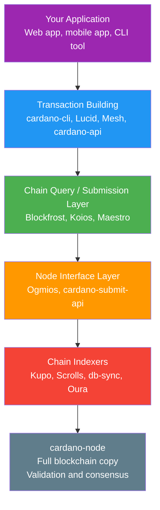
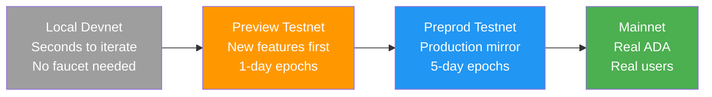
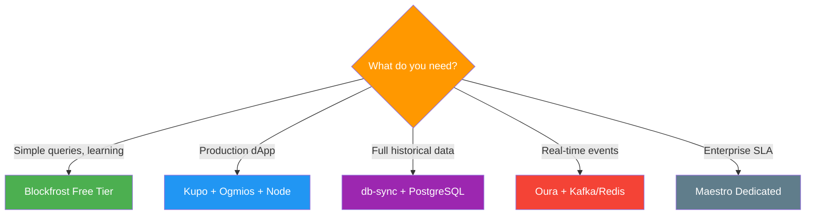

# Lesson #13: Developer Infrastructure

Cardano developer infrastructure provides a layered stack of tools (from full nodes to managed APIs to chain indexers) that transforms raw blockchain data into queryable, application-ready formats for building dApps. Every web2 developer knows that building an application requires more than writing business logic: you need databases, APIs, hosting, monitoring, staging environments, and deployment pipelines. This lesson maps the Cardano developer infrastructure landscape, from running your own full node to using managed API services, and from chain indexers to testnets where you can experiment without risking real ADA.

## What Does the Cardano Developer Infrastructure Stack Look Like?

The Cardano developer stack has five layers: your application at the top, transaction building libraries in the middle, chain query and submission services below that, chain indexers for data transformation, and the cardano-node at the foundation. Each layer serves a distinct purpose, and developers choose their stack based on their needs for decentralization, performance, cost, and convenience.



## What Is cardano-node and When Should You Run One?

The cardano-node is Cardano's official full node implementation (written in Haskell) that independently validates every block and transaction, maintains the current UTXO set, and provides the most trustless way to interact with the blockchain. Running your own node means you verify the entire chain yourself without relying on any third party.

The node:

- Connects to peers and downloads every block since genesis
- Validates every transaction and block according to the ledger rules
- Maintains the current UTXO set (the "state" of the blockchain)
- Forwards valid transactions to the network mempool
- Can submit transactions directly to the network

### When Should You Run Your Own Node?

Running your own cardano-node is the most trustless option. You are not relying on any third party to tell you the state of the blockchain; you have verified it yourself. This matters for:

- **Stake pool operators**: Required by definition to produce blocks
- **High-security applications**: When you cannot afford to trust a third-party API
- **Chain indexer operators**: Most indexers connect directly to a local node
- **Protocol developers**: When building and testing consensus-layer changes

However, running a node comes with significant operational overhead:

```
cardano-node Resource Requirements (Mainnet, 2025):

Storage:    ~180 GB (and growing ~15 GB/year)
RAM:        16+ GB (24 GB recommended)
CPU:        4+ cores
Sync time:  12-48 hours for initial sync from genesis
Bandwidth:  Continuous data exchange with peers
Uptime:     Must be running to serve queries
```

For many application developers, running a full node is overkill. This is where managed services come in.

## What Managed API Services Are Available for Cardano?

Managed API services (Blockfrost, Koios, and Maestro) provide RESTful and WebSocket access to Cardano blockchain data without requiring you to run your own node, handling the operational complexity of nodes, indexers, and databases behind clean API endpoints.

### What Is Blockfrost?

**Blockfrost** is the most widely used Cardano API service. It provides a comprehensive REST API covering blocks, transactions, addresses, assets, scripts, epochs, and more.

```
Blockfrost API Example (Conceptual):

GET /addresses/{address}/utxos
Response:
[
  {
    "tx_hash": "abc123...",
    "output_index": 0,
    "amount": [
      { "unit": "lovelace", "quantity": "5000000" },
      { "unit": "policy_id.asset_name", "quantity": "1" }
    ],
    "data_hash": "datum_hash_if_present"
  }
]
```

Blockfrost offers free and paid tiers, with rate limiting on the free tier. It supports mainnet, testnet (Preview and Preprod), and IPFS pinning for off-chain metadata storage.

**Strengths**: Comprehensive coverage, excellent documentation, wide language support through SDKs, IPFS integration, reliable uptime.

**Trade-offs**: Centralized service (you trust Blockfrost to return accurate data), rate limits on free tier, not suitable for real-time streaming of chain events.

### What Is Koios?

**Koios** is a community-driven, decentralized API layer for Cardano. Unlike Blockfrost (operated by a single company), Koios runs across multiple independent operators, reducing single points of failure. It provides a PostgREST-based API with powerful query capabilities, including filtering, pagination, and complex queries that would require multiple calls on other services. It is free to use (funded by Catalyst proposals and community support).

**Strengths**: Decentralized operation, powerful query syntax (leveraging PostgREST), no API keys required for basic usage, community-governed.

**Trade-offs**: Query syntax can be complex for newcomers, response times may vary between instances, fewer SDK wrappers than Blockfrost.

### What Is Maestro?

**Maestro** is a blockchain indexing and API platform that positions itself as the infrastructure layer for building production-grade Cardano applications. It offers several products:

- **Blockchain API**: REST API for querying chain data (similar to Blockfrost)
- **Transaction Manager**: Handles transaction submission, monitoring, and automatic resubmission
- **DEX Market API**: Aggregated DEX data for building trading applications
- **Managed infrastructure**: Dedicated node and indexer clusters for enterprise customers

**Strengths**: Transaction management features (automatic retry, monitoring), DEX data aggregation, enterprise support, Plutus script debugging tools.

**Trade-offs**: Primarily commercial (paid tiers), smaller free tier than Blockfrost.

## What Is the Node Interface Layer?

The node interface layer (Ogmios and cardano-submit-api) sits between the raw cardano-node and high-level APIs, translating the node's custom binary protocols into developer-friendly WebSocket/JSON and HTTP interfaces accessible from any programming language.

### What Is Ogmios?

**Ogmios** is a lightweight bridge that exposes cardano-node's internal protocols through a WebSocket JSON interface. The Cardano node uses a custom binary protocol called the **Node-to-Client** mini-protocol for local communication. Ogmios translates this into JSON over WebSocket, making it accessible from any programming language.

Ogmios exposes several powerful capabilities:

- **Chain Sync**: Stream the blockchain from any point, receiving each block as a JSON object. Essential for building custom indexers.
- **Transaction Submission**: Submit serialized transactions directly to the node's mempool.
- **State Query**: Query the current ledger state (protocol parameters, stake distribution, UTXO set).
- **Mempool Monitoring**: Observe transactions in the local mempool before they are included in blocks.

Ogmios is particularly valuable for developers building custom chain-following applications or those who need real-time access to chain events without the overhead of a full indexer database.

### What Is cardano-submit-api?

The **cardano-submit-api** is a simple HTTP service that accepts serialized transactions and submits them to a local cardano-node. It is the most minimal way to submit transactions without using the cardano-cli directly.

```
Transaction Submission Options:

Option 1: cardano-cli (local, CLI-based)
  $ cardano-cli transaction submit --tx-file signed.tx

Option 2: cardano-submit-api (local, HTTP-based)
  POST /api/submit/tx
  Content-Type: application/cbor
  Body: <raw transaction bytes>

Option 3: Ogmios (local, WebSocket-based)
  { "jsonrpc": "2.0", "method": "submitTransaction",
    "params": { "transaction": { "cbor": "84a4..." } } }

Option 4: Blockfrost/Koios/Maestro (remote, HTTP-based)
  POST /api/v0/tx/submit
  Content-Type: application/cbor
  Body: <raw transaction bytes>
```

## What Are Chain Indexers and Why Do You Need Them?

Chain indexers follow the blockchain in real-time, reading blocks as they are produced and storing the data in formats optimized for application queries (SQL databases, key-value stores, or event streams) that the raw cardano-node does not natively support.

### What Is db-sync?

**cardano-db-sync** is the official chain indexer maintained by IOG (Input Output Global). It follows a cardano-node and populates a PostgreSQL database with a comprehensive relational schema covering every aspect of the blockchain (over 40 tables for blocks, transactions, assets, stakes, rewards, and more).

db-sync is comprehensive but resource-intensive:

- Requires a separate PostgreSQL instance with ~150+ GB storage
- Initial sync takes 2-3 days
- High RAM usage during sync (32+ GB recommended)
- The "everything" database means you are indexing data you may never query

**When to use db-sync**: When you need complex SQL queries across the full blockchain history, or when building analytics platforms, block explorers, or comprehensive data services.

### What Is Kupo?

**Kupo** is a lightweight chain indexer focused specifically on tracking **matches**: UTXOs that match configurable patterns (by address, payment credential, policy ID, etc.). Instead of indexing everything like db-sync, Kupo lets you index only what your application needs.

Kupo is fast, lightweight (can run on minimal hardware), and syncs in hours rather than days. It is ideal for dApp backends that need to track UTXOs at specific script addresses.

**Strengths**: Fast sync, low resource usage, configurable patterns, includes datum resolution.

**Trade-offs**: Does not index everything (by design), no historical transaction graph queries, limited to UTXO-oriented data.

### What Are Scrolls and Oura?

**Scrolls** processes blockchain data through configurable **reducers** (transformations that extract specific data and store it in a backend of your choice: Redis, Elasticsearch, a file, or a custom sink). It is part of the **TxPipe** ecosystem and is designed for building event-driven architectures.

**Oura** (also from TxPipe) reads blockchain events from a cardano-node and forwards them to various sinks: Kafka, Elasticsearch, webhooks, files, or custom destinations. Think of it as a Cardano-specific data pipeline tool that is excellent for building reactive systems that respond to on-chain events in near-real-time.

## How Do Testnets Serve as Staging Environments?

Cardano provides multiple test networks (Preview, Preprod, and local devnets) that mirror the staging environment progression web2 developers already use, letting you iterate from fast local development through production-like validation before deploying to mainnet with real ADA.



### What Is the Preview Testnet?

**Preview** is Cardano's "bleeding edge" testnet. It is the first network to receive protocol upgrades and new features, typically weeks before they reach mainnet. Preview uses a faster epoch length (1 day instead of 5 days) to accelerate the development cycle. Best for developers testing new protocol features and rapid smart contract iteration.

### What Is the Preprod Testnet?

**Preprod** (Pre-Production) mirrors mainnet as closely as possible. It uses the same epoch length (5 days), the same protocol parameters, and follows the same hard fork schedule as mainnet (just slightly ahead). Preprod is the final testing stage before mainnet deployment. Best for final integration testing, timing-sensitive testing, and realistic deployment rehearsals.

### How Do You Get Test ADA?

Both testnets use "test ADA" (tADA) that has no monetary value. You can obtain tADA from the **Cardano Faucet** (faucet.cardano.org), which dispenses test tokens to any valid testnet address. Some community faucets and Discord bots also distribute test ADA.

### What Are Devnets and Local Testing Options?

For even faster iteration, developers can run local development networks:

- **Cardano-testnet**: Spin up a private Cardano network on your local machine for rapid prototyping
- **Yaci DevKit**: A developer toolkit that provides a managed local Cardano devnet with built-in APIs and tools, dramatically simplifying the local development experience
- **Demeter.run**: A cloud-based development platform that provides pre-configured Cardano development environments, including nodes, indexers, and APIs, accessible through a web browser

## How Do You Choose the Right Infrastructure Stack?

The right infrastructure stack depends on your use case. Here are common patterns:

### Hobby / Learning Project
```
Stack: Blockfrost (free tier) + Preview testnet
Why:   Zero infrastructure to manage, generous free limits,
       fast iteration with Preview's 1-day epochs
```

### Production dApp Backend
```
Stack: Kupo + Ogmios + cardano-node (self-hosted)
       OR Maestro (managed) + Preprod for staging
Why:   Kupo for fast UTXO queries at your script addresses,
       Ogmios for transaction submission and chain following,
       full control over your infrastructure
```

### Block Explorer / Analytics Platform
```
Stack: db-sync + PostgreSQL + cardano-node
Why:   Need comprehensive historical data with complex
       SQL queries across the full blockchain
```

### Event-Driven Application
```
Stack: Oura + Kafka/Redis + Blockfrost (for queries)
Why:   React to on-chain events in near-real-time,
       feed data into your existing event pipeline
```

### Enterprise / High-Throughput
```
Stack: Maestro (dedicated) + multiple node instances
       + Scrolls for custom indexing
Why:   SLA guarantees, dedicated infrastructure,
       custom data transformations
```



## Web2 Analogy

The Cardano developer infrastructure maps cleanly to patterns web2 developers already know:

**cardano-node is like running your own database server.** Just as you can run PostgreSQL on your own hardware for full control and zero third-party dependency, running cardano-node gives you sovereign access to the blockchain. But just like managing your own database server (backups, updates, monitoring, scaling), it requires operational commitment.

**Blockfrost, Koios, and Maestro are like managed database services.** They are the Cardano equivalents of AWS RDS, PlanetScale, or Supabase. You trade some control and trust for operational simplicity. Just as you would not run your own PostgreSQL cluster for a side project when PlanetScale has a free tier, you probably should not run your own node for a hackathon project when Blockfrost exists.

**Ogmios is like a database driver or ORM.** It translates between the node's internal protocol and a developer-friendly interface, much like how `pg` (Node.js driver for PostgreSQL) translates between your application code and the PostgreSQL wire protocol, or how Prisma provides a high-level API over raw SQL.

**Chain indexers are like materialized views or read replicas.** In a web2 database, you might create materialized views that pre-compute complex queries, or use read replicas optimized for specific query patterns. db-sync is a comprehensive materialized view of the entire blockchain. Kupo is a targeted materialized view of just the UTXOs you care about. Scrolls lets you build custom materialized views for your specific data needs.

**Testnets are like staging environments.** Preview is your dev/staging server where you deploy first and break things. Preprod is your pre-production environment that mirrors prod as closely as possible. Mainnet is production. Just as you would never deploy a critical feature directly to production without testing in staging, you would never deploy a smart contract to mainnet without testing on Preprod.

**Oura is like a change data capture (CDC) tool.** In web2, tools like Debezium capture database changes and stream them to Kafka topics. Oura does the same for blockchain data: it captures on-chain events and streams them to your messaging infrastructure.

**The Cardano Faucet is like Stripe's test mode.** When building with Stripe, you use test API keys and test card numbers. You get fake money to test your payment flows. The Cardano Faucet provides fake ADA for the same purpose: testing your application's interaction with the blockchain using valueless tokens.

## Key Takeaways

- **cardano-node is the sovereign foundation**: running your own node gives you trustless access to the blockchain but comes with significant operational overhead that is unnecessary for most application developers.
- **Managed APIs (Blockfrost, Koios, Maestro) provide convenience**: they handle infrastructure complexity and expose clean REST APIs, just like managed database services in web2.
- **Chain indexers transform raw blockchain data into queryable formats**: db-sync for comprehensive SQL access, Kupo for lightweight UTXO tracking, Scrolls and Oura for custom data pipelines and event-driven architectures.
- **Testnets (Preview and Preprod) are your staging environments**: use Preview for rapid iteration with new features, Preprod for production-like validation, and local devnets for the fastest possible feedback loop.
- **Choose your stack based on your needs**: hobbyists can start with Blockfrost's free tier, while production applications may need self-hosted infrastructure for reliability and trust minimization.

## What's Next

With the developer infrastructure landscape mapped out, the next lesson tackles one of the most critical topics for any blockchain developer: security. We will explore the threats that blockchain systems face, the vulnerabilities unique to smart contracts, and the specific security advantages that Cardano's eUTXO model provides.
