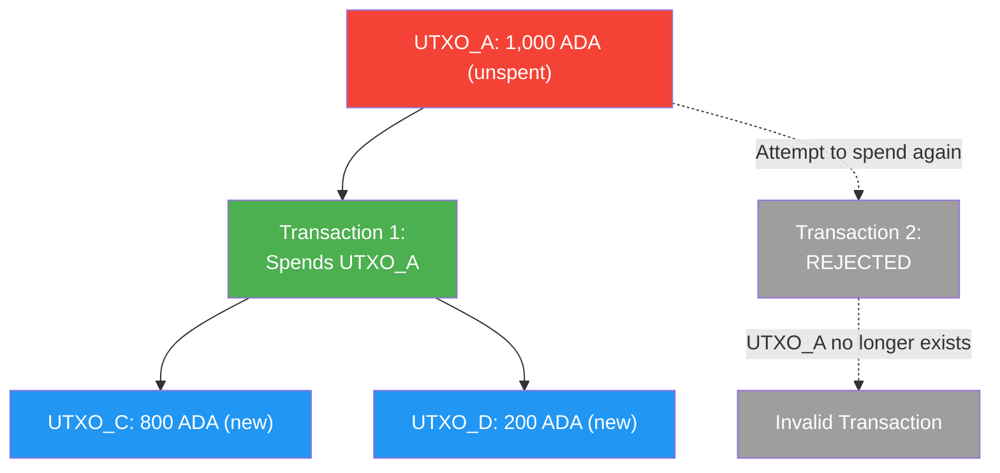
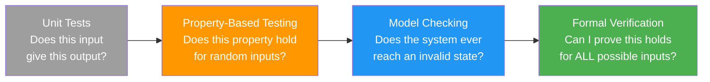
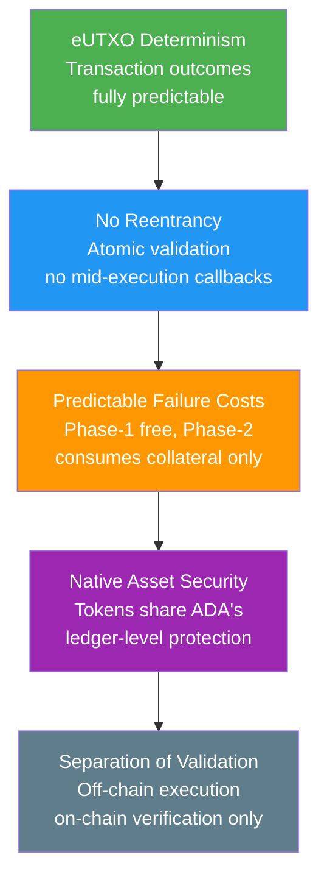

# Lesson #14: Blockchain Security

Blockchain security encompasses the full spectrum of defenses (from network-level consensus protections to smart contract vulnerability prevention) that ensure censorship resistance, immutability, and trustless execution of on-chain transactions. For web2 developers entering the blockchain space, the security model is fundamentally different: bugs in smart contracts are not just embarrassing; they are irreversible financial losses. This lesson covers the full security landscape, from network-level attacks to smart contract vulnerabilities, and explains why Cardano's design provides meaningful protection against many of the most devastating attack vectors.

## What Are the Major Network-Level Security Threats?

Network-level threats target the consensus mechanism itself, with the 51% attack (requiring majority stake control), long-range attacks (exploiting historical stake positions), and eclipse attacks (isolating nodes from the honest network) representing the primary categories that Cardano's Ouroboros protocol defends against.

### What Is a 51% Attack?

The **51% attack** (or majority attack) allows an attacker controlling more than half of the consensus power to double spend, censor transactions, and reorganize the chain. In a proof-of-work system, this means controlling the majority of mining power; in Cardano's proof-of-stake model, it would require controlling more than 50% of all staked ADA.

```
51% Attack (Double Spend):

Honest Chain:    [Block 1] -> [Block 2] -> [Block 3: Pay Alice 100 ADA]
                                            Alice sees payment,
                                            ships goods to attacker

Attacker's Chain: [Block 1] -> [Block 2] -> [Block 3': No payment to Alice]
(created secretly                           -> [Block 4': Attacker spends
 with >50% stake)                               coins elsewhere]

When attacker publishes longer chain, network adopts it.
Alice's payment disappears. Attacker has both the goods AND the coins.
```

With roughly 22-24 billion ADA staked across thousands of stake pools, a 51% attack would require purchasing and staking billions of dollars worth of ADA, which would itself drive the price up dramatically, making the attack increasingly expensive. The non-custodial delegation model also means an attacker cannot simply "rent" stake; they would need to actually acquire and stake the tokens.

Furthermore, Ouroboros provides **provable security** under certain assumptions. The security proofs guarantee that as long as the honest stake exceeds 50%, the probability of a successful attack decreases exponentially with the number of confirmations.

### What Is a Long-Range Attack?

A long-range attack is a concern specific to proof-of-stake systems where an attacker who once held significant stake (but has since sold it) attempts to create an alternative chain starting from a point when they had enough stake to dominate. Cardano's Ouroboros Genesis protocol addresses this by enabling new nodes to distinguish between the honest chain and a long-range attack chain by analyzing chain density and block production patterns.

### What Are Eclipse and Sybil Attacks?

An **eclipse attack** isolates a node from the honest network by surrounding it with attacker-controlled peers. The victim node only sees the attacker's view of the blockchain, which may include double-spent transactions or censored blocks.

A **Sybil attack** creates many fake identities (nodes, stake pools) to gain disproportionate influence over the network. In Cardano's context, the saturation mechanism and pledge requirements (discussed in Lesson 12) serve as Sybil resistance: creating many pools requires proportional capital, and pools without pledge earn reduced rewards.

Cardano's P2P networking layer includes defenses against eclipse attacks through diverse peer selection, which ensures nodes maintain connections to peers across different network segments and geographic regions.

## How Does eUTXO Prevent Double Spending?

The eUTXO model prevents double spending at the protocol level by tracking every unspent transaction output and removing it from the UTXO set the moment it is consumed, making any subsequent attempt to spend the same output structurally invalid.



This is simpler and more robust than the account model, where double spending must be prevented through nonce tracking and careful state management. The UTXO model makes double-spend prevention structural rather than procedural.

## What Smart Contract Vulnerabilities Should Developers Know?

Smart contract bugs are uniquely dangerous because deployed contracts are immutable (or very difficult to modify), and they often control significant financial value. A single vulnerability can lead to irreversible loss of funds. The major vulnerability categories include reentrancy (impossible on Cardano), datum hijacking, double satisfaction, and token forgery.

### Why Is Cardano Immune to Reentrancy Attacks?

The **reentrancy attack** is the most famous smart contract vulnerability, responsible for the 2016 DAO hack that lost $60 million in ETH. In Ethereum's account model, a contract can call another contract, which can call back into the original contract before the first call finishes. If the original contract has not yet updated its state, the reentrant call exploits the stale data.

**Cardano is inherently immune to reentrancy attacks.** In the eUTXO model, a transaction is a complete, atomic unit. A validator script runs once per input, evaluating whether the UTXO can be spent under the given conditions. There is no concept of a contract "calling" another contract mid-execution. The entire transaction (with all its inputs, outputs, and script executions) is validated as a single unit. Either everything succeeds or everything fails. There is no mid-execution state where a reentrant call could exploit stale data.

### What Is Datum Hijacking?

**Datum hijacking** occurs when a script output does not properly validate the datum attached to it, allowing an attacker to substitute a malicious datum that changes ownership or other critical fields in the continuing UTXO.

```
Datum Hijacking:

Normal Flow:
  Input UTXO:  [Script Address, Datum: {owner: "Alice", amount: 100}]
  Output UTXO: [Script Address, Datum: {owner: "Alice", amount: 80}]
  (Alice withdrew 20 ADA)

Attack:
  Input UTXO:  [Script Address, Datum: {owner: "Alice", amount: 100}]
  Output UTXO: [Script Address, Datum: {owner: "Attacker", amount: 100}]
  (Attacker changes the owner in the continuing datum!)
```

**Prevention**: Validators must explicitly check that the output datum meets all expected constraints. This includes verifying that immutable fields (like ownership) have not changed, that mutable fields (like balances) have changed according to the allowed rules, and that the datum structure matches the expected schema.

### What Is the Double Satisfaction Vulnerability?

**Double satisfaction** occurs when a single UTXO satisfies the conditions of multiple validators in the same transaction, allowing an attacker to fulfill two scripts' requirements with one output instead of two.

```
Double Satisfaction Attack:

Script A (DEX Pool): "This swap is valid if output contains 100 DJED"
Script B (Lending):  "This withdrawal is valid if output contains 100 DJED"

Attacker's Transaction:
  Inputs:
    - DEX Pool UTXO (Script A)
    - Lending Pool UTXO (Script B)
  Outputs:
    - ONE output with 100 DJED

  Both Script A and Script B see the 100 DJED output and consider
  their conditions satisfied, but only ONE output exists.
  The attacker effectively got 100 DJED for the price of 0.
```

**Prevention**: Scripts should include unique identifiers in their outputs (such as a specific NFT token, often called a "state token" or "beacon token") and validate that their specific output exists, rather than just checking that "some output" meets their conditions.

### How Do Resource Exhaustion Attacks Work?

Cardano validators have execution budgets (CPU and memory limits per transaction). A more subtle attack involves crafting transactions that consume the maximum allowed resources, effectively creating denial-of-service conditions for a protocol.

**Prevention**: Script authors should be conscious of worst-case execution costs. Using parameterized scripts, limiting loop iterations, and pre-computing expensive operations off-chain all help keep on-chain validation lightweight.

### What Are Token Forgery and Policy Vulnerabilities?

If a minting policy is not carefully written, an attacker might mint unauthorized tokens. Common vulnerabilities include:

- **Missing authorization checks**: A policy that does not verify the presence of a specific UTXO input or signature
- **Reusable minting policies**: A one-time minting policy (for NFTs) that can actually be invoked multiple times
- **Policy parameter manipulation**: Policies that accept parameters but do not validate them properly

```
One-Time Minting (Correct Pattern):

Policy: "Minting is allowed ONLY if this specific UTXO is consumed as input"

  Transaction 1 (Minting):
    Inputs: [UTXO_Unique_123]    <-- This UTXO is consumed (destroyed)
    Mints:  [1 MyNFT]

  Transaction 2 (Attempted Re-Mint):
    Inputs: [???]                <-- UTXO_Unique_123 no longer exists!
    Mints:  [1 MyNFT]           <-- FAILS: Cannot satisfy minting policy
```

## How Does Formal Verification Improve Smart Contract Security?

Formal verification uses mathematical proofs to demonstrate that a program behaves correctly for all possible inputs (not just the inputs you happened to test), making it the gold standard of software verification used in safety-critical systems like aerospace, medical devices, and cryptographic protocols.

Cardano's smart contract language Plutus is built on Haskell, a functional programming language that lends itself naturally to formal reasoning. The pure functional paradigm (no side effects, no mutable state) makes it much easier to prove properties about code behavior.



**Agda** is a dependently typed programming language and proof assistant used in Cardano's formal specification. The Cardano ledger specification itself has been formalized in Agda, meaning the rules that govern the blockchain have been mathematically verified. While most application developers will not write Agda, the fact that the underlying protocol has been formally verified provides a strong foundation.

### How Does Property-Based Testing Strengthen Smart Contracts?

**Property-based testing** (PBT) is a middle ground between unit testing and formal verification. Instead of specifying individual test cases, you define properties that should always hold, and the testing framework generates thousands of random inputs to try to find violations.

For a Cardano validator, properties might include:

- "No transaction can extract more value than is deposited plus allowed rewards"
- "Only the designated owner can authorize a withdrawal"
- "The total value locked in the script can never decrease except through authorized operations"
- "Any transaction that passes validation produces outputs whose total value equals the inputs minus fees"

Property-based testing is particularly effective for smart contracts because the input space (possible transactions, datums, redeemers) is complex and difficult to cover with manual test cases. Tools like QuickCheck (Haskell) and Hedgehog can systematically explore edge cases that developers would never think to test manually.

### Why Are Audits and Peer Reviews Essential?

Beyond automated testing, smart contract audits by specialized security firms are standard practice in the blockchain industry. An audit typically involves:

1. **Code review**: Line-by-line examination of the smart contract code
2. **Architecture review**: Analysis of the overall protocol design and trust assumptions
3. **Attack surface analysis**: Identification of all possible attack vectors
4. **Formal analysis**: Mathematical verification of critical properties (if applicable)
5. **Penetration testing**: Attempting to exploit the contract on a testnet

On Cardano, several firms specialize in Plutus smart contract audits, including Tweag, MLabs, Anastasia Labs, and others. Protocols like Minswap, Liqwid, and SundaeSwap have undergone multiple rounds of auditing before mainnet deployment.

## What Security Advantages Does Cardano's Architecture Provide?

Cardano's architecture provides four structural security advantages: deterministic transaction evaluation (eliminating MEV), inherent reentrancy immunity, predictable failure costs (Phase-1 validation failures cost nothing; Phase-2 script failures consume only collateral), and native asset security that shares ADA's ledger-level protections.



### How Does Deterministic Evaluation Eliminate MEV?

On Ethereum, a transaction's outcome depends on the global state at the time of execution, which may differ from the state when the transaction was constructed. This creates a class of attacks collectively known as **MEV (Maximal Extractable Value)**, where miners or validators profit by reordering, inserting, or censoring transactions.

On Cardano, transaction outcomes are **fully deterministic**. A transaction specifies its exact inputs (UTXOs to consume) and exact outputs (UTXOs to create). If the specified inputs still exist when the transaction reaches the chain, it executes exactly as constructed. If any input has been spent, the transaction simply fails without any partial execution or unexpected side effects.

This determinism eliminates entire categories of attacks and makes it much easier to reason about the security of smart contracts.

### How Do Native Assets Strengthen Security?

On Ethereum, tokens are implemented as smart contracts (ERC-20), and each token contract is its own attack surface. Vulnerabilities in token contracts have led to significant losses. On Cardano, native assets (tokens) are handled by the ledger itself, sharing the same security guarantees as ADA. There is no token contract to exploit. The minting policy controls creation, but once tokens exist, the same ledger rules that govern ADA transfer, hold, and account for them.

### How Does Separation of Validation and Execution Help?

In Cardano, the "execution" of a smart contract happens entirely off-chain (building the transaction with the correct inputs and outputs). The on-chain validator only verifies that the transaction is correct. This separation means:

- Less code runs on-chain, reducing the attack surface
- Off-chain code can be updated without modifying the on-chain validator
- Complex business logic can be thoroughly tested off-chain before the transaction is submitted

## What Are the Common Security Patterns on Cardano?

Experienced Cardano developers follow established patterns to write secure validators:

### State Token Pattern
Use a unique NFT (minted with a one-time policy) as a "state token" that must be present in every UTXO at a script address. This prevents unauthorized UTXOs from being created at the address and solves the double-satisfaction problem.

### Value Preservation Check
Always verify that the total value in script outputs equals the expected value (input value minus any authorized withdrawals, plus any authorized deposits). Do not rely on implicit value preservation.

### Datum Continuity Validation
When a script UTXO must "continue" (be consumed and recreated with updated state), explicitly validate every field of the output datum against the expected transition rules. Never assume the datum is correct just because it is present.

### Deadline Enforcement
Use transaction validity ranges (valid-from and valid-to slots) to enforce time-based conditions. Cardano's transaction validity interval is checked at the protocol level, providing reliable time bounds for script logic.

### Minimal On-Chain Logic
Keep validators as simple as possible. Every line of on-chain code is a potential vulnerability. Move complex logic off-chain and use the validator only to check critical invariants.

## Web2 Analogy

Blockchain security has many parallels to web2 security, and your existing knowledge transfers well:

**Reentrancy is like a CSRF (Cross-Site Request Forgery) attack.** In CSRF, a malicious website triggers an action in your authenticated session on another site because the server does not verify the origin of the request. In reentrancy, a malicious contract triggers a callback into your contract at an unexpected point in execution. Both exploit a lack of proper state management during an operation. Cardano eliminates this structurally, just as SameSite cookies and CSRF tokens address it in web2.

**Datum hijacking is like SQL injection.** In SQL injection, an attacker manipulates input data to change the meaning of a query. In datum hijacking, an attacker manipulates the datum to change the meaning of a script's state. Both are prevented by validating all input data; never trust that data at a boundary is well-formed or authorized.

**Double satisfaction is like parameter tampering or insecure direct object references (IDOR).** An attacker references someone else's resource (output) to satisfy their own authorization check. Prevention in both domains requires ensuring that the resource being validated actually belongs to the entity it is supposed to.

**Smart contract audits are like penetration testing and code audits.** Just as you would hire a security firm to pen-test your web application before launch (following OWASP guidelines), you hire auditors to review your smart contracts before mainnet deployment. The stakes are similar (data breach vs. fund loss), but the irreversibility of smart contract exploits makes auditing even more critical.

**Formal verification is like type systems on steroids.** TypeScript catches many bugs at compile time by verifying that your code handles types correctly. Formal verification extends this concept to arbitrary properties: not just "is this a number?" but "can the balance ever go negative?" and "is it impossible for an unauthorized user to withdraw funds?"

**The 51% attack is like a hostile takeover of infrastructure.** Imagine if an attacker gained control of the majority of CDN edge nodes. They could serve malicious content to users who believe they are getting legitimate data. A 51% attack is the blockchain equivalent: controlling the majority of consensus power to serve a false history.

## Key Takeaways

- **Network-level attacks (51%, long-range, eclipse) are mitigated by Cardano's Ouroboros protocol**, which provides provable security under honest-majority assumptions and practical defenses through stake distribution and P2P networking.
- **Smart contract vulnerabilities on Cardano differ from Ethereum**: reentrancy is impossible by design, but developers must guard against datum hijacking, double satisfaction, and token forgery through careful validator design.
- **Formal verification and property-based testing** provide much stronger guarantees than unit testing alone, and Cardano's Haskell-based ecosystem is well-suited to these rigorous verification techniques.
- **Cardano's deterministic transaction model eliminates MEV and front-running**, giving users confidence that their transactions will execute exactly as constructed or not at all.
- **Security is a design principle, not a feature**: the eUTXO model, native assets, and separation of validation from execution all contribute to a structurally more secure platform for building financial applications.

## What's Next

Security protects the system, but who decides how the system evolves? The final lesson in this course covers Cardano's governance model: how protocol changes are proposed, debated, voted on, and enacted through the most ambitious on-chain governance system in blockchain.
