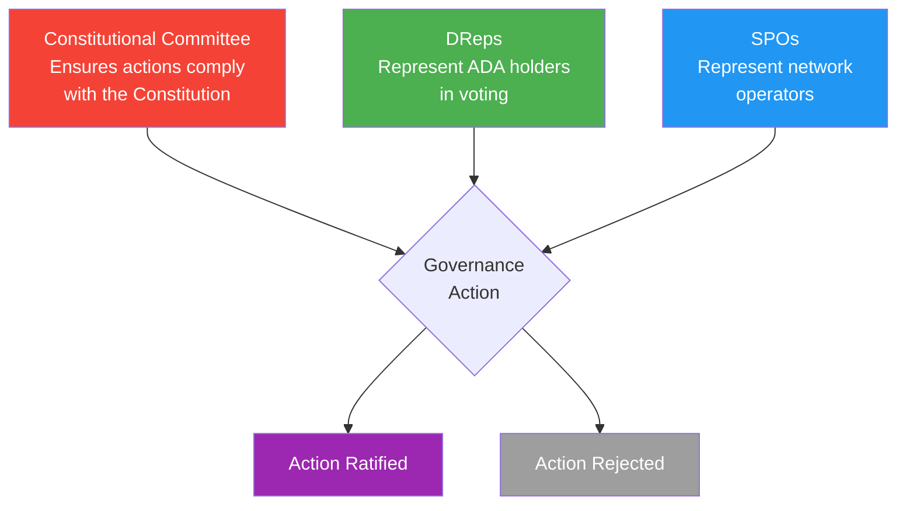
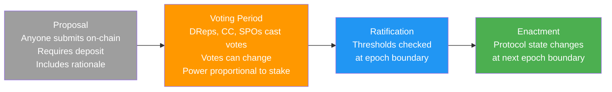
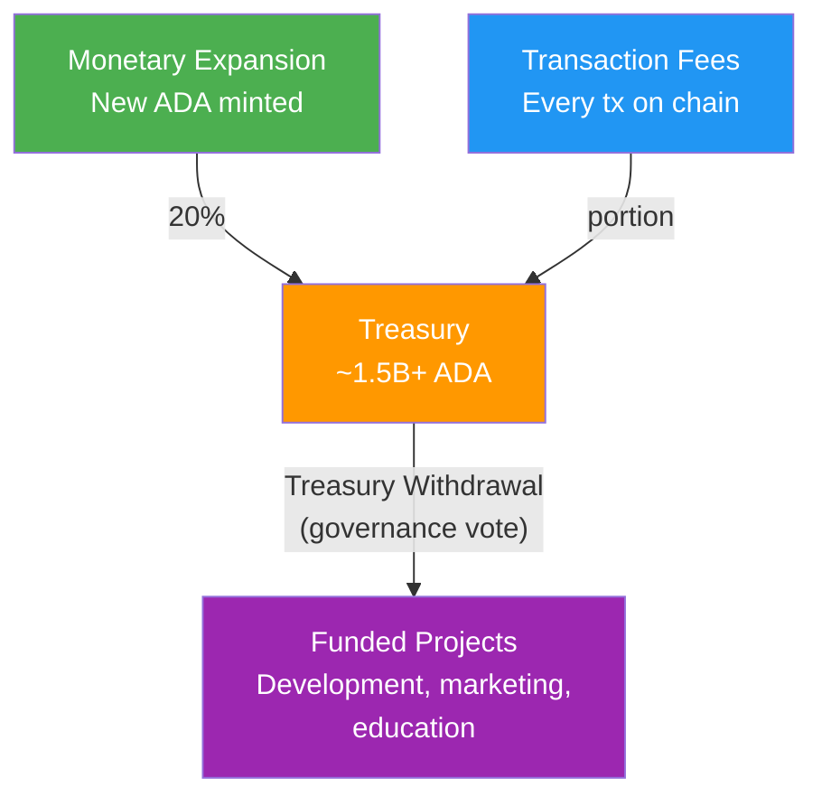

# Lesson #15: Cardano Governance

Cardano's on-chain governance system (defined by CIP-1694) enables ADA holders to propose, vote on, and enact protocol changes through three bodies: the Constitutional Committee, Delegated Representatives (DReps), and Stake Pool Operators (SPOs). This lesson explores how the Voltaire era works, why it matters, and what it means for developers building on the platform.

## Why Does Governance Matter for Developers?

Governance directly shapes the parameters, language versions, and funding mechanisms that Cardano developers depend on, making governance literacy essential for anyone building or maintaining smart contracts on the platform.

- **Protocol parameters affect your code**: Transaction size limits, execution unit budgets, minimum UTXO values, and fee calculations are all governance-controlled parameters. A governance vote could change these parameters, directly affecting your smart contracts.
- **Hard forks require coordination**: When the protocol upgrades (like the Alonzo hard fork that introduced smart contracts, or the Chang hard fork that activated on-chain governance), every stake pool and node operator must upgrade. Understanding the governance process helps you anticipate and prepare for these changes.
- **Treasury funding**: Cardano's treasury holds hundreds of millions of ADA, and governance determines how it is spent. As a developer, you can propose projects for treasury funding.
- **Your users participate**: ADA holders are governance participants. If you build wallets, DeFi protocols, or any Cardano application, your users may interact with governance features through your interface.

## How Did Cardano Reach the Voltaire Era?

Cardano's development followed a phased roadmap (Byron, Shelley, Goguen, Basho, Voltaire), with each phase adding foundational capabilities that culminated in the Voltaire era's full on-chain governance, transitioning control from founding entities to the community of ADA holders.

```
Cardano Development Phases:

Byron (2017)       : Foundation; basic transactions, ADA transfers
Shelley (2020)     : Decentralization; staking, delegation, stake pools
Goguen (2021)      : Smart Contracts; Plutus, native assets, DeFi
Basho (ongoing)    : Scaling; Hydra, sidechains, performance optimization
Voltaire (2024+)   : Governance; on-chain voting, treasury, self-sustainability
```

The Voltaire era represents Cardano's transition from a system governed by its founding entities (Input Output Global, the Cardano Foundation, and EMURGO) to one governed by its community of ADA holders. This is not a cosmetic change. It means that no single company or organization has unilateral control over the protocol's future.

The **Chang hard fork** (September 2024) activated the first phase of on-chain governance, and the **Plomin hard fork** (January 29, 2025, originally called Chang #2) activated the remaining governance features, fully implementing CIP-1694.

## What Are the Three Governance Bodies in CIP-1694?

CIP-1694 establishes three governance bodies (the Constitutional Committee, Delegated Representatives, and Stake Pool Operators) that form a checks-and-balances system where each body represents a different constituency and votes on different governance action types.



**Constitutional Committee (CC)**: A group of elected members who serve as constitutional guardians. Their role is to verify that proposed governance actions comply with the Cardano Constitution, a foundational document that defines the values, principles, and rules governing the blockchain. The CC does not decide whether an action is a good idea; they decide whether it is constitutionally permissible. Think of them as a constitutional court.

The CC has a limited term (members serve for a defined period and must be re-elected), a size threshold (a minimum number of members must vote), and can be replaced through a "no confidence" vote if the community believes they are not fulfilling their role.

**Delegated Representatives (DReps)**: DReps are the primary voice of ADA holders in governance. Any ADA holder can register as a DRep or delegate their voting power to a DRep they trust. This is analogous to representative democracy: you may not have time to evaluate every governance proposal, so you delegate your vote to someone who will represent your interests.

**Stake Pool Operators (SPOs)**: SPOs participate in governance voting on specific action types, particularly hard fork initiation and certain protocol parameter changes. Their vote reflects the perspective of network infrastructure operators who must implement protocol changes.

### How Does Governance Delegation Work?

Just as ADA holders delegate their stake to a stake pool for block production (Lesson 12), they delegate their voting power to a DRep for governance. Importantly, stake delegation and governance delegation are independent. You can delegate your stake to Pool A for rewards while delegating your vote to DRep B for governance.

```
Delegation: Stake vs. Governance

+------------------+
|   ADA Holder     |
|   (10,000 ADA)   |
+--------+---------+
         |
    +----+----+
    |         |
    v         v
+--------+ +--------+
| Stake  | | Vote   |
| Deleg. | | Deleg. |
|        | |        |
| Pool A | | DRep B |
|(rewards| |(govrnce|
| & block| | voting)|
| prod.) | |        |
+--------+ +--------+

These are SEPARATE delegations.
You can change one without affecting the other.
```

There are also two special delegation options for ADA holders who do not want to choose a specific DRep:

- **Abstain**: Your voting power is not counted in any vote. You explicitly choose not to participate.
- **No Confidence**: Your voting power automatically votes against any governance action, expressing distrust in the current governance system. This is a form of protest delegation.

Every ADA holder must choose a governance delegation (specific DRep, Abstain, or No Confidence) to be eligible for staking rewards. This ensures broad participation in governance.

## What Are the Seven Types of Governance Actions?

CIP-1694 defines seven governance action types (no confidence, new committee, constitution update, hard fork initiation, parameter changes, treasury withdrawal, and info action), each requiring approval from a specific combination of governance bodies at specific voting thresholds.

```
Governance Action Types:

+-------------------------+----------+-------+------+
| Action Type             |    CC    | DReps | SPOs |
+-------------------------+----------+-------+------+
| 1. No Confidence        |    --    |  Yes  | Yes  |
| 2. New Committee/       |    --    |  Yes  | Yes  |
|    Threshold            |          |       |      |
| 3. Constitution Update  |   Yes    |  Yes  |  --  |
| 4. Hard Fork Initiation |   Yes    |  Yes  | Yes  |
| 5. Protocol Parameter   |   Yes    |  Yes  |  *   |
|    Changes              |          |       |      |
| 6. Treasury Withdrawal  |   Yes    |  Yes  |  --  |
| 7. Info Action          |    --    |  Yes  | Yes  |
+-------------------------+----------+-------+------+

CC  = Constitutional Committee must approve
Yes = This body votes on this action
--  = This body does not vote on this action
*   = SPOs vote on specific parameter groups only
```

**1. No Confidence Motion**: A vote to dissolve the current Constitutional Committee. If passed, the CC is disbanded, and a new committee must be elected before most other governance actions can proceed. This is the community's emergency mechanism for removing a CC that has lost its legitimacy.

**2. New Constitutional Committee / Threshold Change**: Propose new CC members, remove existing members, or change the CC's size/threshold requirements. This is how the community elects or replaces its constitutional guardians.

**3. Constitution Update**: Modify the Cardano Constitution itself. This is the highest-level governance change, altering the foundational document that all other actions must comply with. It requires both CC and DRep approval but not SPO votes.

**4. Hard Fork Initiation**: Trigger a protocol upgrade that changes the consensus rules. This requires all three governance bodies because a hard fork affects everyone: the constitution (it must be permitted), the community (they must accept the changes), and the operators (they must update their software).

**5. Protocol Parameter Changes**: Modify any of the dozens of configurable protocol parameters, grouped into network (throughput), economic (fees and incentives), technical (script limits), and governance categories.

**6. Treasury Withdrawal**: Withdraw ADA from the on-chain treasury to fund projects, development, or ecosystem initiatives. This is the mechanism through which the community allocates resources.

**7. Info Action**: A non-binding "sense of the community" vote. Info actions do not change the protocol but serve as a formal mechanism for the community to express opinions, set direction, or endorse positions.

## What Is the Governance Action Lifecycle?

A governance action moves through four stages: proposal (anyone submits on-chain with a deposit), voting period (DReps, CC, and SPOs cast votes), ratification (protocol checks thresholds at epoch boundaries), and enactment (protocol state changes at the next epoch boundary).



### What Are the Voting Thresholds?

Each governance action type has specific threshold requirements for each governance body. These thresholds are themselves governance-controlled parameters, meaning the community can adjust them through the governance process.

For example, a hard fork initiation might require:

- CC: Majority of active members must approve
- DReps: 67% of active voting power must vote Yes
- SPOs: 51% of active stake must vote Yes

An info action might require:

- DReps: 51% of active voting power
- SPOs: 51% of active stake

The exact thresholds are set as protocol parameters and can be viewed on-chain.

## What Is the Cardano Constitution?

The Cardano Constitution is a foundational document (ratified through an on-chain governance vote) that establishes the principles, values, rights, and guardrails governing the blockchain, serving as the "supreme law" against which the Constitutional Committee evaluates every governance action.

The Constitution covers:

- **Purpose and Principles**: Why Cardano exists and what values guide its governance
- **Rights of ADA Holders**: Protections for participants in the ecosystem
- **Governance Framework**: The structure and rules defined by CIP-1694
- **Protocol Parameters**: Guardrails that constrain how far parameters can be changed in a single action (preventing extreme or dangerous changes)
- **Amendment Process**: How the Constitution itself can be modified

The Constitutional Committee evaluates every governance action against this document. If an action would violate the Constitution (for example, proposing parameter changes outside the guardrail ranges), the CC should vote against it, preventing its ratification regardless of DRep or SPO support.

```
Constitutional Guardrails Example:

Parameter: Maximum Block Size
Current value: 90,112 bytes
Guardrail: Cannot be changed by more than 2x in a single action

Proposed Action: Set max block size to 200,000 bytes
CC Assessment: 200,000 > 90,112 * 2 = 180,224
              This exceeds the guardrail. CC votes NO.

Proposed Action: Set max block size to 131,072 bytes
CC Assessment: 131,072 < 180,224
              Within guardrails. CC evaluates on merit.
```

## How Does the Cardano Treasury Work?

The Cardano treasury accumulates ADA from monetary expansion (20% of each epoch's rewards) and transaction fees, currently holding over 1.5 billion ADA that can only be spent through on-chain governance votes, making it one of the largest decentralized treasuries in blockchain.



Before CIP-1694, treasury withdrawals were managed through **Project Catalyst**, a partially on-chain, partially off-chain funding mechanism. With the Voltaire era, treasury withdrawals are now a formal governance action type, giving ADA holders direct control over how shared resources are allocated.

## What Role Does Intersect Play in Governance?

**Intersect** is a member-based organization that serves as the administrative backbone of Cardano's governance, coordinating codebase maintenance, governance tooling, and community programs without exercising governing authority itself.

Intersect's roles include:

- **Maintaining the Cardano codebase**: Coordinating development of the core software (cardano-node, Plutus, etc.)
- **Facilitating governance processes**: Providing tools, documentation, and infrastructure for governance participation
- **Managing the governance ecosystem**: Supporting DReps, coordinating Constitutional Committee elections, and maintaining governance tooling
- **Community coordination**: Organizing workshops, town halls, and educational programs around governance

Intersect membership is open to organizations and individuals. Members can participate in working groups, contribute to technical decisions, and help shape the governance process. It is structured to prevent any single entity from dominating, with a diverse board and transparent operations.

## What Governance Tools Are Available?

For governance to work, participants need tools to discover, evaluate, and vote on proposals. The Cardano ecosystem includes several governance tools:

- **GovTool**: A web-based interface for browsing governance actions, delegating to DReps, and casting votes. It connects to your Cardano wallet (like Eternl, Lace, or Yoroi) for transaction signing.
- **SanchoNet**: A dedicated governance testnet where governance features were tested before mainnet deployment. Named after Sancho Panza, Don Quixote's practical companion (Voltaire being the era's namesake).
- **DRep Explorer**: Tools for discovering DReps, viewing their voting history, and evaluating their positions.
- **Cardanoscan / CExplorer**: Block explorers that display governance actions, votes, and committee information alongside transaction data.

For wallet developers, governance integration means supporting:
- DRep registration transactions
- Vote delegation transactions (separate from stake delegation)
- Displaying governance proposals and voting status
- Enabling direct voting for registered DReps

## How Does Governance Affect Smart Contract Development?

Governance decisions directly affect smart contract developers in concrete ways, from execution budget changes to Plutus language upgrades to treasury-funded development opportunities.

**Parameter changes affect script execution budgets.** If governance reduces the maximum execution units per transaction, existing scripts that use close to the current limit might stop working. Smart contract developers should design with margin and monitor governance proposals that affect technical parameters.

**Hard forks can change the Plutus language.** Protocol upgrades may introduce new Plutus versions (Plutus V1, V2, V3) with new capabilities. While backward compatibility is maintained (V1 scripts continue to work), new features may require V3 scripts. The Chang hard fork, for instance, introduced Plutus V3 with new built-in functions for governance interaction.

**Treasury withdrawals fund ecosystem development.** As a developer, you can submit treasury withdrawal proposals to fund your project. This is a direct, on-chain alternative to venture capital or grants from centralized entities.

**Governance actions are on-chain transactions.** DRep registration, vote delegation, and governance votes are all standard Cardano transactions. They use the same infrastructure (wallets, APIs, nodes) that you already interact with as a developer. You can build governance tooling, analytics dashboards, or DRep platforms using the same skills and tools from Lesson 13.

## What Happened During the Bootstrapping Phase?

When the Chang hard fork first activated governance, Cardano entered a **bootstrapping phase** with a temporary Constitutional Committee, limited governance actions, and the interim Constitution in effect while the community familiarized itself with the new system and the full ratification process proceeded in parallel.

- A temporary ("interim") Constitutional Committee was established
- Governance actions were limited to prevent premature changes while the community familiarized itself with the new system
- DRep registration and delegation were active, allowing the governance ecosystem to develop organically
- The interim Constitution was in effect, with the full ratification process for the final Constitution proceeding in parallel

The bootstrapping phase ended with the Plomin hard fork (January 29, 2025), which activated the full governance capabilities and transitioned to the ratified Constitution and elected Constitutional Committee.

## What Challenges Does On-Chain Governance Face?

On-chain governance is an experiment, and Cardano's implementation faces several challenges that are common to all democratic systems: voter participation, information asymmetry, plutocratic dynamics, and adversarial resilience.

**Voter participation**: Like all democratic systems, governance requires active participation. If most ADA holders delegate to "Abstain" or simply do not engage, a small minority could control governance decisions. The requirement to choose a delegation option to earn staking rewards is one mechanism to encourage participation.

**Information asymmetry**: Evaluating complex technical proposals (like protocol parameter changes) requires expertise that most ADA holders may not have. DReps address this by specializing in governance evaluation, but the DRep ecosystem is still maturing.

**Plutocratic concerns**: Voting power is proportional to stake. A whale holding 100 million ADA has 10,000 times the voting power of someone holding 10,000 ADA. This is inherent to stake-based governance and is a deliberate design choice (those with more at stake have more to lose from bad decisions), but it raises questions about fairness and accessibility.

**Governance attack vectors**: A well-funded adversary could potentially acquire enough ADA to influence governance votes. The checks-and-balances system (three governance bodies, constitutional guardrails, tiered thresholds) makes this difficult, but no system is immune to attack.

These challenges are not unique to Cardano. Every governance system (from national governments to open-source projects) grapples with participation, expertise, power distribution, and resilience. Cardano's on-chain governance makes these dynamics transparent and programmable, which is itself an advantage.

## Web2 Analogy

Cardano's governance maps to several familiar patterns in the web2 and open-source worlds:

**DReps are like elected representatives in open-source foundations.** The Linux Foundation has a board of directors elected by its members. The Apache Software Foundation has a board elected by its members. DReps serve a similar role: elected (through delegation) by ADA holders to represent their interests in governance decisions. The key difference is that DRep delegation is fluid (you can change your DRep at any time) and proportional (your voting weight equals your ADA holdings).

**The Constitutional Committee is like a standards body.** The IETF (Internet Engineering Task Force) reviews RFCs to ensure they meet technical standards. The CC reviews governance actions to ensure they meet constitutional standards. Neither body decides what should be built; they verify that proposals comply with established rules and principles.

**The governance action process is like an RFC (Request for Comments).** In the IETF, anyone can submit an RFC proposing a new standard. The RFC goes through review, discussion, and eventually is either accepted, rejected, or withdrawn. Cardano governance actions follow a similar lifecycle: proposal, community evaluation, voting, and either enactment or expiration.

**The treasury is like a corporate venture fund or open-source grants program.** Google's OSPO (Open Source Programs Office), the Sovereign Tech Fund, or the Apache Software Foundation's grants all allocate shared resources to projects that benefit the community. Cardano's treasury serves the same purpose but with fully transparent, on-chain decision-making.

**Intersect is like the Linux Foundation or Apache Foundation.** It provides administrative coordination, maintains shared infrastructure, and facilitates community governance without controlling it. Just as the Linux Foundation does not dictate what code goes into the Linux kernel (that is Linus Torvalds and the maintainers), Intersect does not dictate Cardano governance decisions (that is the DReps, CC, and SPOs).

**Guardrails are like rate limiters and circuit breakers.** In web2 systems, you set rate limits to prevent any single user from overwhelming your API, and circuit breakers to prevent cascading failures. Constitutional guardrails serve the same purpose: they prevent any single governance action from making extreme changes that could destabilize the network.

## Key Takeaways

- **CIP-1694 establishes three governance bodies** (Constitutional Committee, DReps, and SPOs) with checks and balances, ensuring no single group can unilaterally control Cardano's direction.
- **Seven governance action types** cover every aspect of protocol management, from hard forks and parameter changes to treasury withdrawals and constitutional amendments, each with appropriate voting thresholds.
- **Governance delegation is separate from stake delegation**: ADA holders can choose a DRep for governance voting independently of their stake pool selection, with every holder required to participate (or explicitly abstain) to earn staking rewards.
- **The Cardano treasury**, holding over 1.5 billion ADA, is entirely controlled through on-chain governance, providing a sustainable funding mechanism for ecosystem development without reliance on any centralized entity.
- **On-chain governance directly affects developers**: protocol parameters, Plutus language versions, and funding opportunities are all governance-controlled, making governance literacy essential for anyone building on Cardano.

## What's Next

Congratulations! You have completed the Blockchain Theory course. Over these fifteen lessons, you have journeyed from the fundamentals of cryptographic hashing and distributed consensus through smart contracts, native assets, DeFi, and governance. You now have a solid theoretical foundation for understanding how Cardano works and why it was designed the way it was.

The natural next step is to put this knowledge into practice. Head over to the [Hello Cardano](/en/course-cardano) coding course, where you will start building on Cardano: setting up a development environment, constructing transactions, interacting with smart contracts, and deploying your first on-chain applications. The theory you have learned here will serve as your compass as you navigate the practical challenges of blockchain development.
