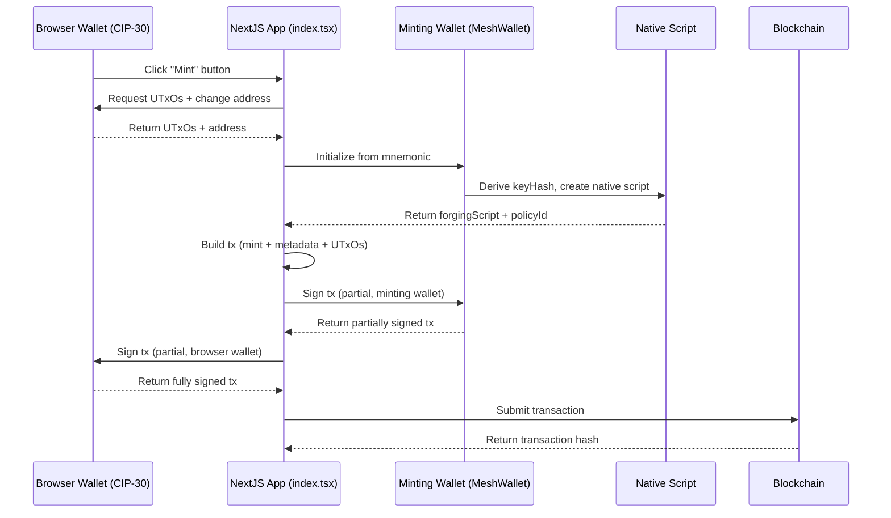

# Lesson #02: Multi-signature Transactions

A multi-signature (multi-sig) transaction requires multiple parties to sign before it can be submitted to the blockchain. Multi-sig works like a joint account where all required parties must approve spending. Transactions can require two or more signers, which can be wallets or scripts.


In this lesson, you will:
- Build multi-signature transactions to mint a token
- Set up a NextJS app with a web interface to interact with the Cardano blockchain

> Source code: [GitHub](https://github.com/cardanobuilders/cardanobuilders.github.io/tree/main/codes/course-cardano/02-multisig)

## System setup

### Download CIP30 Wallet Extension

You need a browser wallet extension that supports the CIP30 standard. Choose and install one from the [Cardano developer showcase](https://developers.cardano.org/showcase/?tags=wallet).

After installing, restore the wallet using the seed phrase you created in the previous lesson.

### Set Up NextJS and Mesh

Create a new NextJS application:

```bash
npx create-next-app@latest --typescript mesh-multisig
```

Follow the prompts:

```bash
Need to install the following packages:
Ok to proceed? (y)

✔ Would you like to use ESLint? … Yes
✔ Would you like to use Tailwind CSS? … Yes
✔ Would you like your code inside a `src/` directory? … Yes
✔ Would you like to use App Router? … No
✔ Would you like to use Turbopack for next dev? … No
✔ Would you like to customize the import alias (@/* by default)? … No
```

Navigate to the newly created folder:

```bash
cd mesh-multisig
```

Install the latest version of Mesh:

```bash
npm install @meshsdk/core @meshsdk/react
```

### Add MeshProvider

Wrap your application with `MeshProvider` to enable Mesh React components. Open `src/app/layout.tsx` and add:

```ts
import "@/styles/globals.css";
import type { AppProps } from "next/app";
import "@meshsdk/react/styles.css";
import { MeshProvider } from "@meshsdk/react";

export default function App({ Component, pageProps }: AppProps) {
  return (
    <MeshProvider>
      <Component {...pageProps} />
    </MeshProvider>
  );
}
```

### Add CardanoWallet Component

Add a wallet component for blockchain interaction. Replace the contents of `src/pages/index.tsx` with:

```ts
import { CardanoWallet, useWallet } from "@meshsdk/react";

export default function Home() {
  const { wallet, connected } = useWallet();
  return (
    <div>
      <CardanoWallet isDark={true} />
    </div>
  );
}
```

Start the development server:

```bash
npm run dev
```

Visit [http://localhost:3000](http://localhost:3000/) to view your application. Press **CTRL+C** to stop the server.

You should see a "Connect Wallet" component. Try connecting to your wallet.

## Minting Script

This section walks through creating a minting script for a multi-signature token mint.

### Define the Minting Script

Set up constants for the minting script:

```ts
const provider = new BlockfrostProvider("YOUR_KEY_HERE");

const demoAssetMetadata = {
  name: "Mesh Token",
  image: "ipfs://QmRzicpReutwCkM6aotuKjErFCUD213DpwPq6ByuzMJaua",
  mediaType: "image/jpg",
  description: "This NFT was minted by Mesh (https://meshjs.dev/).",
};

const mintingWallet = ["your", "mnemonic", "...", "here"];
```

- Replace `YOUR_KEY_HERE` with your Blockfrost API key.
- Define asset metadata in `demoAssetMetadata`.
- Use a mnemonic for the minting wallet.

### Create Minting Application Wallet

Create a function to build the minting transaction:

```ts
async function buildMintTx(inputs: UTxO[], changeAddress: string) {
  const wallet = new MeshWallet({
    networkId: 0,
    key: {
      type: "mnemonic",
      words: mintingWallet,
    },
  });

  const { pubKeyHash: keyHash } = deserializeAddress(
    await wallet.getChangeAddress()
  );
}
```

- `inputs`: UTxOs from your wallet to pay minting fees.
- Initialize the wallet with the mnemonic.
- Derive the `pubKeyHash` for the minting script.

### Create Native Script


Define the native script:

```ts
const nativeScript: NativeScript = {
  type: "all",
  scripts: [
    {
      type: "before",
      slot: "99999999",
    },
    {
      type: "sig",
      keyHash: keyHash,
    },
  ],
};
const forgingScript = ForgeScript.fromNativeScript(nativeScript);
```

- `nativeScript`: Parameters for the script.
- `ForgeScript.fromNativeScript`: Create the forging script.

### Define Asset Metadata

Set up asset metadata:

```ts
const policyId = resolveScriptHash(forgingScript);
const tokenName = "MeshToken";
const tokenNameHex = stringToHex(tokenName);
const metadata = { [policyId]: { [tokenName]: { ...demoAssetMetadata } } };
```

- `policyId`: Derived from the forging script.
- `tokenName`: Name of the token.
- `metadata`: Asset metadata.

### Create Transaction

Build the minting transaction:

```ts
const txBuilder = new MeshTxBuilder({
  fetcher: provider,
  verbose: true,
});

const unsignedTx = await txBuilder
  .mint("1", policyId, tokenNameHex)
  .mintingScript(forgingScript)
  .metadataValue(721, metadata)
  .changeAddress(changeAddress)
  .invalidHereafter(99999999)
  .requiredSignerHash(keyHash)
  .selectUtxosFrom(inputs)
  .complete();
```

- `mint`: Add token details.
- `mintingScript`: Attach the minting script.
- `metadataValue`: Add asset metadata.
- `changeAddress`: Specify the change address.
- `invalidHereafter`: Set transaction expiry.
- `selectUtxosFrom`: Use UTxOs for fees.
- `requiredSignerHash` to declare that the minter wallet pub key hash is required.
- `complete`: Finalize the transaction.

### Sign the Transaction

Sign the transaction with the minting wallet:

```ts
const signedTx = await wallet.signTx(unsignedTx, true);
```

### Source code

Here is the complete code for building the minting transaction:

```ts
async function buildMintTx(inputs: UTxO[], changeAddress: string) {
  // minting wallet
  const wallet = new MeshWallet({
    networkId: 0,
    key: {
      type: "mnemonic",
      words: mintingWallet,
    },
  });

  const { pubKeyHash: keyHash } = deserializeAddress(
    await wallet.getChangeAddress()
  );

  // create minting script
  const nativeScript: NativeScript = {
    type: "all",
    scripts: [
      {
        type: "before",
        slot: "99999999",
      },
      {
        type: "sig",
        keyHash: keyHash,
      },
    ],
  };
  const forgingScript = ForgeScript.fromNativeScript(nativeScript);

  // create metadata
  const policyId = resolveScriptHash(forgingScript);
  const tokenName = "MeshToken";
  const tokenNameHex = stringToHex(tokenName);
  const metadata = { [policyId]: { [tokenName]: { ...demoAssetMetadata } } };

  // create transaction
  const txBuilder = new MeshTxBuilder({
    fetcher: provider,
    verbose: true,
  });

  const unsignedTx = await txBuilder
    .mint("1", policyId, tokenNameHex)
    .mintingScript(forgingScript)
    .metadataValue(721, metadata)
    .changeAddress(changeAddress)
    .invalidHereafter(99999999)
    .requiredSignerHash(keyHash)
    .selectUtxosFrom(inputs)
    .complete();

  const signedTx = await wallet.signTx(unsignedTx, true);
  return signedTx;
}
```

## Execute the transaction

With the minting transaction built, execute it from the frontend:

```ts
async function mint() {
  if (connected) {
    const inputs = await wallet.getUtxos();
    const changeAddress = await wallet.getChangeAddress();

    const tx = await buildMintTx(inputs, changeAddress);
    const signedTx = await wallet.signTx(tx, true);

    const txHash = await wallet.submitTx(signedTx);
    console.log("Transaction hash:", txHash);
  }
}
```

- Check wallet connection.
- Get UTxOs and change address.
- Build, sign, and submit the transaction.

## Source Code Walkthrough

This section explains the overall architecture of the multi-sig minting app, how the files connect, and how these blockchain concepts map to web development patterns you already know.

### Project Structure

```
02-multisig/
├── package.json              # NextJS app with @meshsdk/core and @meshsdk/react
├── src/
│   └── pages/
│       ├── _app.tsx          # MeshProvider wrapper (enables wallet context)
│       └── index.tsx         # Main page: wallet UI, buildMintTx, and mint logic
└── ...                       # Standard NextJS files (config, styles, etc.)
```

This is a NextJS Pages Router application with two key files you wrote:

- **_app.tsx** wraps the entire application in `MeshProvider`, which is a React context provider. This is the same pattern as wrapping your app in an auth provider or a theme provider -- it makes wallet state (connection status, wallet methods) available to every component via the `useWallet` hook.
- **index.tsx** contains all the business logic in a single page. It renders the `CardanoWallet` connect button, defines `buildMintTx` (which constructs and partially signs the minting transaction server-side), and defines `mint` (which orchestrates the full flow from the browser).

The separation matters: `_app.tsx` is pure infrastructure (you set it once and forget it), while `index.tsx` is where the domain logic lives.

### Multi-Sig Minting Flow



The key insight is the **two-step signing**. Unlike Lesson 1 where a single wallet signed everything, multi-sig requires both wallets to sign the same transaction before it is valid:

1. **Build** -- The app constructs the transaction using UTxOs from the browser wallet (which pays the fees) and a native script derived from the minting wallet's key hash.
2. **First signature** -- The minting wallet (server-side, from mnemonic) partially signs the transaction. The `true` parameter in `wallet.signTx(unsignedTx, true)` means "partial sign" -- the transaction is not yet complete.
3. **Second signature** -- The browser wallet (CIP-30, user-facing) also partially signs. Now both required signatures are present.
4. **Submit** -- The fully signed transaction goes to the blockchain.

The native script enforces that **both** signatures must be present. If either is missing, the blockchain rejects the transaction.

### Web2 Equivalents

| Cardano Concept | Web2 Equivalent | Explanation |
|---|---|---|
| Multi-sig transaction | Multi-factor approval (e.g., two-person wire transfer) | Requires multiple independent parties to authorize an action before it executes. Like requiring both a manager and finance to approve a large purchase order. |
| Native script | Business rules / policy engine | Declarative rules that define what conditions must be met. The `"all"` type means every condition must pass -- like an AND clause in a policy engine. |
| `type: "sig"` condition | Required approver | Specifies a particular key that must sign. Like adding a required reviewer on a pull request. |
| `type: "before"` condition | Expiration / TTL | The transaction is only valid before a certain slot (time). Like setting an expiration on an invite link or a JWT token. |
| CIP-30 browser wallet | OAuth / SSO login | A standardized interface for web apps to interact with user wallets, similar to how OAuth standardizes login flows across identity providers. |
| MeshProvider | Auth context provider (React) | A React context that makes wallet state available throughout the component tree. Identical in pattern to `<AuthProvider>` or `<SessionProvider>`. |
| NFT metadata (CIP-25) | Database record / API resource | Structured data attached to the token on-chain. The metadata schema (label 721) is a Cardano standard, similar to how a REST API defines its response schema. |
| Policy ID | Namespace / tenant ID | A unique identifier derived from the minting script. All tokens minted under the same script share a policy ID, like how resources in a multi-tenant app share a tenant ID. |
| Partial signing (`signTx(tx, true)`) | Incremental approval workflow | Each party adds their signature without finalizing. Like a document that collects signatures from multiple stakeholders before submission. |

## Source code

The source code for this lesson is available on [GitHub](https://github.com/cardanobuilders/cardanobuilders.github.io/tree/main/codes/course-cardano/02-multisig).

## Challenge

Create a multi-signature wallet requiring 2 out of 3 signers to approve a transaction. Build and sign a transaction with two signers, submit it, and verify success.
