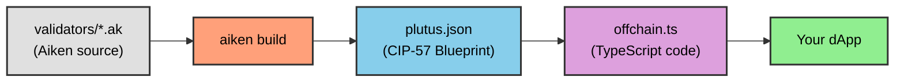

# Lesson #06: Interpreting Blueprint

The Plutus blueprint is the bridge between on-chain and off-chain code. This lesson covers how to interpret the blueprint generated by Aiken and translate it into offchain TypeScript code for interacting with your smart contracts.

> Source code: [GitHub](https://github.com/cardanobuilders/cardanobuilders.github.io/tree/main/codes/course-cardano/06-interpreting-blueprint)

## What is a Blueprint?


A blueprint is a standardized JSON file defined by [CIP-57](https://cips.cardano.org/cip/CIP-57). It is the primary output of Cardano smart contract compilation and contains everything needed to interact with the contract. Every blueprint includes:

- **`preamble`**: Meta-information about the contract.
- **`validators`**: Named validators with type definitions and compiled code.
- **`definitions`**: A registry of reusable definitions across the specification.

### Generating a Blueprint

Generate a blueprint with Aiken:

1. Build your contracts:

```sh
aiken build
```

2. Locate the blueprint in the `plutus.json` file at the root of your project.

## Understanding the Blueprint

### `preamble`

The `preamble` contains contract metadata: name, description, version, and Plutus version. The Plutus version is critical for offchain code preparation.

Example:

```json
{
  "preamble": {
    "title": "meshsdk/aiken-template",
    "description": "Aiken contracts for project 'meshsdk/aiken-template'",
    "version": "0.0.0",
    "plutusVersion": "v3", // Key information for offchain code
    "compiler": {
      "name": "Aiken",
      "version": "v1.1.16+23061c0"
    },
    "license": "Apache-2.0"
  }
}
```

### `validators`

The `validators` section contains type information for `datum`, `redeemer`, and `parameters`, along with compiled validator code. Types may reference reusable definitions from the `definitions` section.

Example:

```json
{
  "title": "spend.spending_logics_delegated.spend",
  "datum": {
    "title": "_datum_opt",
    "schema": {
      "$ref": "#/definitions/Data"
    }
  },
  "redeemer": {
    "title": "_redeemer",
    "schema": {
      "$ref": "#/definitions/Data"
    }
  },
  "parameters": [
    {
      "title": "delegated_withdrawal_script_hash",
      "schema": {
        "$ref": "#/definitions/aiken~1crypto~1ScriptHash"
      }
    }
  ],
  "compiledCode": "58ac010100229800aba2aba1aba0aab9faab9eaab9dab9a9bae0024888888896600264646644b30013370e900118039baa001899914c004c03400a601a601c0052259800800c528456600266ebc00cc02cc03c00629462660040046020002805100d2444660020026eacc040c044c044c044c044c044c044c034dd518080048c020dd500099ba548008cc028dd4802a5eb822c8030c024004c024c028004c024004c010dd5004c52689b2b200401",
  "hash": "9c9666ddc12fc42f0151cd029c150c7d410ede9fe3885c248c8c26a0"
}
```

Note that `spend.spending_logics_delegated.else` compiles to the same hash as `spend.spending_logics_delegated.spend`. Both purposes share the same compiled script. Multi-purpose validators compile to a single hash, which certain architectures can leverage.

```json
{
  "title": "spend.spending_logics_delegated.else",
  "redeemer": {
    "schema": {}
  },
  "parameters": [
    {
      "title": "delegated_withdrawal_script_hash",
      "schema": {
        "$ref": "#/definitions/aiken~1crypto~1ScriptHash"
      }
    }
  ],
  "compiledCode": "58ac010100229800aba2aba1aba0aab9faab9eaab9dab9a9bae0024888888896600264646644b30013370e900118039baa001899914c004c03400a601a601c0052259800800c528456600266ebc00cc02cc03c00629462660040046020002805100d2444660020026eacc040c044c044c044c044c044c044c034dd518080048c020dd500099ba548008cc028dd4802a5eb822c8030c024004c024c028004c024004c010dd5004c52689b2b200401",
  "hash": "9c9666ddc12fc42f0151cd029c150c7d410ede9fe3885c248c8c26a0"
}
```

### `definitions`

The `definitions` section contains reusable type schemas referenced by the `validators` section.

Example:

```json
{
  "definitions": {
    "Data": {
      "title": "Data",
      "description": "Any Plutus data."
    },
    "aiken/crypto/ScriptHash": {
      "title": "ScriptHash",
      "dataType": "bytes"
    },
    "cardano/assets/PolicyId": {
      "title": "PolicyId",
      "dataType": "bytes"
    },
    "withdraw/MyRedeemer": {
      "title": "MyRedeemer",
      "anyOf": [
        {
          "title": "ContinueCounting",
          "dataType": "constructor",
          "index": 0,
          "fields": []
        },
        {
          "title": "StopCounting",
          "dataType": "constructor",
          "index": 1,
          "fields": []
        }
      ]
    }
  }
}
```

## Automating Offchain Code Generation

Manually translating blueprints into offchain code is time-consuming. The [`Cardano Bar VSCode Extension`](https://marketplace.visualstudio.com/items/?itemName=sidan-lab.cardano-bar-vscode) automates this process. Generate offchain code from your blueprint in three steps:

1. Create a new TypeScript file, e.g., `offchain.ts`.
2. Open the command palette in VSCode (Ctrl+Shift+P or Cmd+Shift+P).
3. Type `Parse blueprint to Typescript - Mesh` and select it.


4. Select the `plutus.json` file that contains the blueprint.


The generated `offchain.ts` file includes all functions needed to interact with the on-chain code: spending, minting, and querying the contract. See the [Mesh SDK documentation](https://meshjs.dev/apis/utilities/blueprints) for details.

## Conclusion

Interpreting the Plutus blueprint is essential for connecting on-chain validators to off-chain applications. Tools like the Mesh `Blueprint` class and the Cardano Bar extension automate most of the translation work, letting you focus on building applications.

## Source Code Walkthrough

This section walks through the project files with a focus on how the Plutus blueprint (`plutus.json`) bridges the gap between on-chain Aiken code and off-chain TypeScript applications.

### Project Structure

```
06-interpreting-blueprint/
├── validators/
│   ├── withdraw.ak    # Withdrawal validator (OracleDatum, MyRedeemer types)
│   ├── spend.ak       # Spending validator delegating to withdrawal
│   └── mint.ak        # Minting validator delegating to withdrawal
├── aiken.toml         # Project manifest (like package.json)
├── aiken.lock         # Dependency lockfile (like bun.lockb)
└── plutus.json        # CIP-57 blueprint -- THE KEY FILE for this lesson
```

The three `.ak` validators follow the same delegation pattern from Lesson 5. What is new here is understanding `plutus.json` -- the compiled artifact that makes off-chain integration possible.

### The Compilation Pipeline



This is the full path from smart contract source code to a running application. The blueprint sits at the center -- it is the artifact that both the blockchain and your TypeScript code understand.

### Web2 Mental Model

If you have worked with REST APIs, the blueprint maps cleanly to concepts you already know:

| Blueprint Section | Web2 Equivalent | What It Does |
|---|---|---|
| `preamble` | `package.json` metadata | Project name, version, compiler info, Plutus version |
| `validators` | API endpoint definitions | Each validator's purpose, parameters, and compiled bytecode |
| `validators[].compiledCode` | Compiled binary or WASM module | The actual executable deployed on-chain |
| `validators[].parameters` | Function arguments / route params | Values that must be supplied before the validator can run |
| `definitions` | JSON Schema / TypeScript type definitions | Reusable type schemas referenced by validators |
| Full `plutus.json` | OpenAPI (Swagger) specification | The single source of truth describing your contract's interface |

Just as an OpenAPI spec lets you auto-generate API clients, the Plutus blueprint lets tools like the Mesh SDK auto-generate TypeScript code for interacting with your contracts.

### `plutus.json` -- The Blueprint in Detail

This is the most important file in the project for off-chain development. When you run `aiken build`, the compiler reads all `.ak` files and produces this single JSON file containing:

**Preamble** -- Metadata about your project. The `plutusVersion` field (e.g., `"v3"`) is critical because it tells off-chain libraries which Plutus language version to target when constructing transactions.

**Validators** -- Each validator entry includes a `title` that encodes the file name, module name, and purpose (e.g., `"spend.spending_logics_delegated.spend"`). It also includes the `compiledCode` (hex-encoded CBOR of the Plutus script) and `hash` (the script's on-chain address identifier). Notice that multi-purpose validators like `spend.spending_logics_delegated.spend` and `spend.spending_logics_delegated.else` share the same compiled code and hash.

**Definitions** -- A registry of reusable types. When a validator's datum or redeemer references `"$ref": "#/definitions/withdraw/MyRedeemer"`, the actual type schema lives here. This is identical to how JSON Schema uses `$ref` to avoid duplicating type definitions.

### The Validator Files

The three `.ak` files define the on-chain logic that compiles into the blueprint:

**`withdraw.ak`** defines the core types (`OracleDatum`, `MyRedeemer` with `ContinueCounting` and `StopCounting` variants) and the shared validation logic. These types appear in the `definitions` section of the blueprint.

**`spend.ak`** and **`mint.ak`** delegate to the withdrawal script, as covered in Lesson 5. Their compiled code appears as separate validator entries in the blueprint, each with its own hash for on-chain addressing.

### From Blueprint to TypeScript

The Cardano Bar VSCode extension (described in the section above) reads `plutus.json` and generates TypeScript functions matching each validator. The generated code uses the Mesh SDK's `Blueprint` class to deserialize the compiled code, apply parameters, and construct transactions. This is the same workflow as generating an API client from an OpenAPI spec -- the blueprint is the contract, and the generated code is the client.

## Source code

The source code for this lesson is available on [GitHub](https://github.com/cardanobuilders/cardanobuilders.github.io/tree/main/codes/course-cardano/06-interpreting-blueprint).
