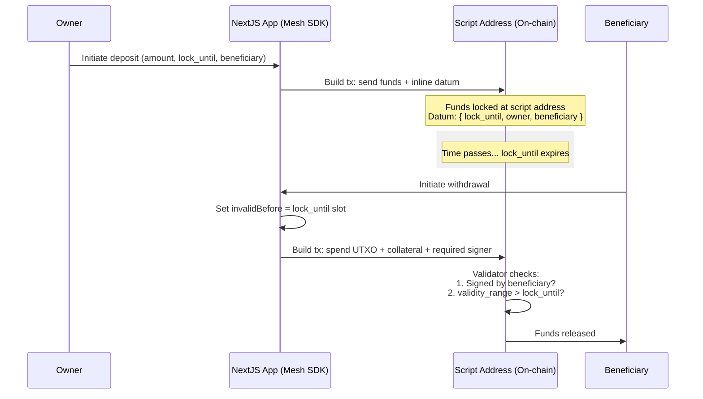

# Lesson #07: Vesting Contract

A vesting contract locks funds for a specified period and allows only the designated beneficiary to withdraw them after the lockup expires. This lesson covers implementing and interacting with a vesting contract on Cardano using Aiken and the Mesh SDK.

> Source code: [GitHub](https://github.com/cardanobuilders/cardanobuilders.github.io/tree/main/codes/course-cardano/07-vesting)

## Overview

### What Is a Vesting Contract?
A vesting contract locks funds and releases them to a beneficiary only after a specified time period. It provides security and control over fund distribution.


### Key Features:
- **Lockup Period**: Funds are locked until a specific timestamp.
- **Owner and Beneficiary**: The owner deposits funds, and the beneficiary withdraws them after the lockup period.

## Smart Contract Details

### Datum Definition
The datum configures the vesting contract with three parameters:

- **`lock_until`**: POSIX timestamp until which funds are locked
- **`owner`**: Credentials of the fund owner
- **`beneficiary`**: Credentials of the beneficiary

```
pub type VestingDatum {
  /// POSIX time in milliseconds, e.g. 1672843961000
  lock_until: Int,
  /// Owner's credentials
  owner: ByteArray,
  /// Beneficiary's credentials
  beneficiary: ByteArray,
}
```

This datum can be found in `aiken-vesting/aiken-workspace/lib/vesting/types.ak`.

Next, we define the spend validator.

```
validator vesting {
  spend(
    datum_opt: Option<VestingDatum>,
    _redeemer: Data,
    _input: OutputReference,
    tx: Transaction,
  ) {
    // In principle, scripts can be used for different purpose (e.g. minting
    // assets). Here we make sure it's only used when 'spending' from a eUTxO
    expect Some(datum) = datum_opt
    or {
      key_signed(tx.extra_signatories, datum.owner),
      and {
        key_signed(tx.extra_signatories, datum.beneficiary),
        valid_after(tx.validity_range, datum.lock_until),
      },
    }
  }

  else(_) {
    fail
  }
}
```

The `vesting` validator allows withdrawal under two conditions:

1. The transaction is signed by the **owner** (can withdraw anytime), OR
2. The transaction is signed by the **beneficiary** AND the current time is past the lockup period


### How it works

The owner deposits funds into the vesting contract, locking them until the lockup period expires.

Cardano transactions include validity intervals that specify when a transaction is valid. The ledger verifies these bounds before executing any script. This gives scripts a sense of time while maintaining determinism: if a transaction has a lower bound `A`, the current time is at least `A`.

Since the upper bound is not controlled, a transaction could execute well after the vesting delay. From the script's perspective, this is acceptable; the contract only enforces a minimum wait time.

### Testing

A comprehensive test script is provided. Run tests with `aiken check`.

The test script includes the following test cases:

- success unlocking
- success unlocking with only owner signature
- success unlocking with beneficiary signature and time passed
- fail unlocking with only beneficiary signature
- fail unlocking with only time passed

See the full test source in [`vesting.ak`](https://github.com/cardanobuilders/cardanobuilders.github.io/blob/main/codes/course-cardano/07-vesting/src/aiken-workspace/validators/vesting.ak).

### Compile and build script

To compile the script, run the following command:

```sh
aiken build
```

This command will generate a CIP-0057 Plutus blueprint, which you can find in [`plutus.json`](https://github.com/cardanobuilders/cardanobuilders.github.io/blob/main/codes/course-cardano/07-vesting/src/aiken-workspace/plutus.json).

## Deposit funds

The owner deposits funds into the vesting contract and specifies the lockup period.

```ts
const assets: Asset[] = [
  {
    unit: "lovelace",
    quantity: "10000000",
  },
];

const lockUntilTimeStamp = new Date();
lockUntilTimeStamp.setMinutes(lockUntilTimeStamp.getMinutes() + 1);
```

This deposits 10 ADA into the vesting contract with a 1-minute lockup period.

```ts
// app wallet
const wallet = new MeshWallet({
  networkId: 0,
  key: {
    type: "mnemonic",
    words: appWallet,
  },
  fetcher: provider,
  submitter: provider,
});

const utxos = await wallet.getUtxos();
const changeAddress = await wallet.getChangeAddress();

const { pubKeyHash: ownerPubKeyHash } = deserializeAddress(changeAddress);
const { pubKeyHash: beneficiaryPubKeyHash } =
  deserializeAddress(beneficiaryAddress);
```

This tutorial uses a separate app wallet to fund the deposit. Both the owner's and beneficiary's public key hashes are extracted using `deserializeAddress`.

```ts
const txBuilder = new MeshTxBuilder({
  fetcher: provider,
  verbose: true,
});

const unsignedTx = await txBuilder
  .txOut(script.address, amount)
  .txOutInlineDatumValue(
    mConStr0([lockUntilTimeStampMs, ownerPubKeyHash, beneficiaryPubKeyHash])
  )
  .changeAddress(changeAddress)
  .selectUtxosFrom(utxos)
  .complete();
```

The transaction sends funds to the vesting contract's script address with an inline datum containing the lockup period, owner, and beneficiary.

Sign and submit:

```ts
const signedTx = await wallet.signTx(unsignedTx);
const txHash = await wallet.submitTx(signedTx);
```

Save the returned transaction hash; you will need it to withdraw the funds.

Example of a [successful deposit transaction](https://preprod.cardanoscan.io/transaction/556f2bfcd447e146509996343178c046b1b9ad4ac091a7a32f85ae206345e925).

## Withdraw funds

After the lockup period expires, the beneficiary (or owner) can withdraw the funds.

First, fetch the UTXOs containing the locked funds:

```ts
const txHashFromDesposit =
  "556f2bfcd447e146509996343178c046b1b9ad4ac091a7a32f85ae206345e925";
const utxos = await provider.fetchUTxOs(txHash);
const vestingUtxo = utxos[0];
```

This fetches UTXOs from the deposit transaction. Next, prepare the datum and calculate the slot number for the transaction validity interval:

```ts
const datum = deserializeDatum<VestingDatum>(vestingUtxo.output.plutusData!);

const invalidBefore =
  unixTimeToEnclosingSlot(
    Math.min(datum.fields[0].int as number, Date.now() - 15000),
    SLOT_CONFIG_NETWORK.preprod
  ) + 1;
```

The lockup period from the datum determines the `invalidBefore` slot, ensuring the transaction is only valid after the lockup expires.

Construct the withdrawal transaction:

```ts
const txBuilder = new MeshTxBuilder({
  fetcher: provider,
  verbose: true,
});

const unsignedTx = await txBuilder
  .spendingPlutusScript("V3")
  .txIn(
    vestingUtxo.input.txHash,
    vestingUtxo.input.outputIndex,
    vestingUtxo.output.amount,
    script.address
  )
  .spendingReferenceTxInInlineDatumPresent()
  .spendingReferenceTxInRedeemerValue("")
  .txInScript(script.cbor)
  .txOut(walletAddress, [])
  .txInCollateral(
    collateralInput.txHash,
    collateralInput.outputIndex,
    collateralOutput.amount,
    collateralOutput.address
  )
  .invalidBefore(invalidBefore)
  .requiredSignerHash(pubKeyHash)
  .changeAddress(walletAddress)
  .selectUtxosFrom(inputUtxos)
  .complete();
```

The transaction spends the locked UTXO from the vesting contract, specifying the script, datum, redeemer, collateral, validity interval, and required signer.

Sign and submit:

Example of a [successful withdraw transaction](https://preprod.cardanoscan.io/transaction/13d6b2258680bbdf08f50a3bbc03e7ed674f5614844ce773fc191c9582282b04).

## Source Code Walkthrough

This section breaks down the project structure and maps blockchain concepts to familiar web2 patterns to help you understand how the vesting contract works end-to-end.

### Project Structure

```
07-vesting/
├── src/                    # NextJS application
│   ├── app/                # App router pages and API routes
│   ├── components/         # React components for deposit/withdraw UI
│   └── lib/                # Shared utilities and contract helpers
├── aiken-workspace/        # On-chain smart contract code
│   ├── lib/
│   │   └── vesting/
│   │       └── types.ak    # VestingDatum type definition
│   ├── validators/
│   │   └── vesting.ak      # Spend validator + tests
│   └── plutus.json         # Compiled Plutus blueprint (CIP-0057)
├── eslint.config.mjs
├── next.config.ts
├── package.json            # Dependencies: NextJS + @meshsdk/core
├── postcss.config.mjs
└── tsconfig.json
```

The project has two distinct halves. The `aiken-workspace/` directory contains the on-chain validator written in Aiken -- this is the smart contract that the Cardano ledger executes when someone tries to spend locked funds. The `src/` directory is a standard NextJS app that builds and submits the deposit and withdraw transactions using the Mesh SDK. Think of the Aiken code as your backend business logic that runs on the blockchain, and the NextJS app as your frontend client that calls it.

### Vesting Lifecycle



### Web2 Equivalents

If you have built escrow or scheduled-release features in web applications, you already understand the core idea. Here is how each Cardano concept maps:

| Cardano Concept | Web2 Equivalent | What It Does |
|---|---|---|
| **Vesting contract** | Escrow service (e.g., Stripe Connect delayed payouts) | Holds funds and releases them when conditions are met |
| **Datum** (`VestingDatum`) | Escrow terms stored in a database row | Records the lock time, owner, and beneficiary on-chain |
| **`lock_until`** | Scheduled release date / cron job trigger time | The POSIX timestamp when funds become withdrawable |
| **`validity_range`** | Request timestamp validation (e.g., JWT `nbf` claim) | The ledger enforces that the transaction is only valid within this time window, giving the script a reliable sense of "now" |
| **Collateral** | Security deposit for failed API calls (like a held charge) | A small UTXO pledged to cover costs if the script execution fails -- you get it back on success |
| **Script address** | Escrow account / custodial holding account | A blockchain address controlled by code rather than a private key |

The key difference from web2: there is no server deciding whether to release funds. The validator logic runs deterministically on every Cardano node, and the `validity_range` mechanism lets the ledger itself enforce time constraints without relying on a clock inside the script.

## Source code

The source code for this lesson is available on [GitHub](https://github.com/cardanobuilders/cardanobuilders.github.io/tree/main/codes/course-cardano/07-vesting).

## Challenge

Modify the vesting contract to implement a gradual vesting schedule where funds release over time instead of all at once. Alternatively, add a cliff period where the beneficiary must wait before any tokens become available.
