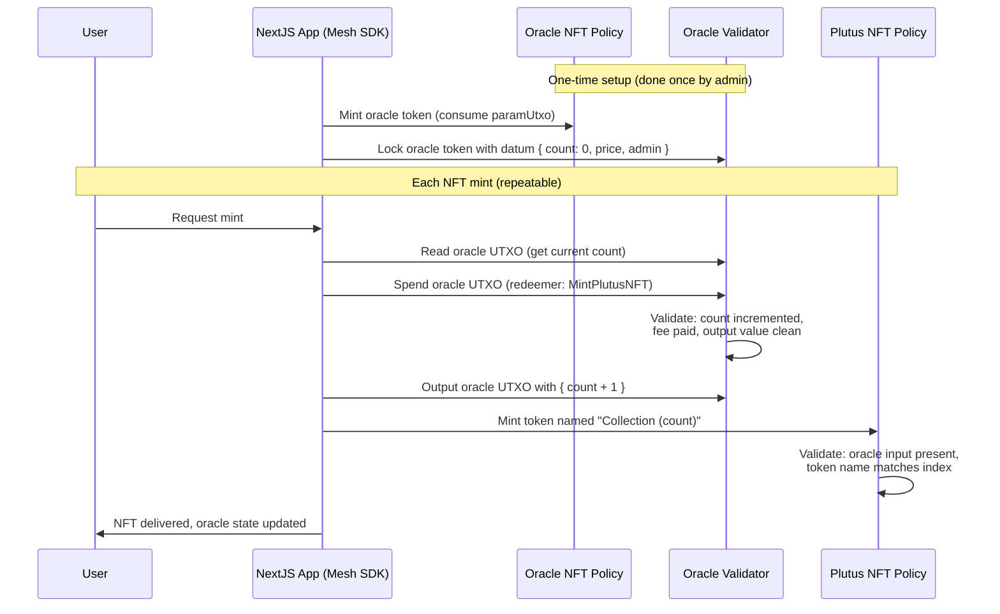

# Lesson #08: Plutus NFT Contract

This lesson builds on the vesting contract with a more complex multi-validator architecture. You will create a Plutus NFT contract where multiple validators interact to enforce non-fungibility, uniqueness, and auto-incrementing token indices.

## Overview

The contract mints NFTs with auto-incrementing indices, ensuring non-fungibility and uniqueness under a single policy. The architecture uses three components:

1. Set up a one-time minting policy to create an oracle token.
2. Use the oracle token to maintain the state and index of NFTs.
3. Increment the token index with each new NFT minted.


## Step 1: Oracle NFT

The oracle NFT acts as the single source of truth, using a state thread token to ensure consistency. A one-time minting policy guarantees only one oracle NFT exists.

### Code Explanation

The following code defines the minting policy for the oracle NFT:

```rs
pub type MintPolarity {
  RMint
  RBurn
}

validator oracle_nft(utxo_ref: OutputReference) {
  mint(redeemer: MintPolarity, policy_id: PolicyId, tx: Transaction) {
    when redeemer is {
      RMint -> {
        let Transaction { inputs, .. } = tx
        let hash_equal =
          fn(input: Input) {
            let hash = input.output_reference
            utxo_ref == hash
          }
        let target_input_exist = list.find(inputs, hash_equal)
        when target_input_exist is {
          Some(_) -> True
          None -> False
        }
      }
      RBurn -> check_policy_only_burn(tx.mint, policy_id)
    }
  }

  else(_) {
    fail
  }
}
```

**Key Points:**
- `RMint` ensures the token is minted only once.
- `RBurn` allows the token to be burned but prevents reminting.

## Step 2: Oracle Validator

The oracle validator maintains the current NFT index as on-chain state. It defines datum and redeemer types for state transitions.

### Datum Definition

```rs
pub type OracleDatum {
  count: Int,
  lovelace_price: Int,
  fee_address: Address,
}
```

### Redeemer Types

```rs
pub type OracleRedeemer {
  MintPlutusNFT
  StopOracle
}
```

### Validator Logic

The validator enforces valid state transitions:

```rs
validator oracle {
  spend(
    datum_opt: Option<OracleDatum>,
    redeemer: OracleRedeemer,
    input: OutputReference,
    tx: Transaction,
  ) {
    let Transaction { mint, inputs, outputs, extra_signatories, .. } = tx
    expect Some(OracleDatum { count, lovelace_price, fee_address }) = datum_opt
    expect Some(own_input) = find_input(inputs, input)
    expect [(oracle_nft_policy, _, _)] =
      list.filter(flatten(own_input.output.value), fn(x) { x.1st != "" })

    todo
  }

  else(_) {
    fail
  }
}
```

The `find_input` function locates the validator's own input by output reference. The oracle NFT policy must be present in the input's value.

For state changes, there is exactly one input from and one output to the oracle address. Pattern match on this structure:

```rs
    let own_address = own_input.output.address
    when
      (
        redeemer,
        inputs_at_with_policy(inputs, own_address, oracle_nft_policy),
        outputs_at_with_policy(outputs, own_address, oracle_nft_policy),
      )
    is {
      (MintPlutusNFT, [_], [only_output]) -> {
        todo
      }
      _ -> False
    }

```

Add in core checks for `MintPlutusNFT`:

```rs
        let is_output_value_clean = list.length(flatten(only_output.value)) == 2
        let is_count_updated =
          only_output.datum == InlineDatum(
            OracleDatum { count: count + 1, lovelace_price, fee_address },
          )
        let is_fee_paid =
          get_all_value_to(outputs, fee_address)
            |> value_geq(from_lovelace(lovelace_price))
        is_output_value_clean? && is_count_updated? && is_fee_paid?
```

The `is_output_value_clean` check ensures the state UTXO contains only the state thread token and ADA. This prevents the `Unbounded Value` vulnerability, where an attacker attaches many assets to the output, making it unspendable by overflowing the transaction size.

Complete with `StopOracle` logics:

```rs
      (StopOracle, [_], _) -> {
        let is_oracle_nft_burnt =
          only_minted_token(mint, oracle_nft_policy, "", -1)
        let owner_key = address_payment_key(fee_address)
        let is_owner_signed = key_signed(extra_signatories, owner_key)
        is_oracle_nft_burnt? && is_owner_signed?
      }
```

A complete oracle validator looks like this:

```rs
validator oracle {
  spend(
    datum_opt: Option<OracleDatum>,
    redeemer: OracleRedeemer,
    input: OutputReference,
    tx: Transaction,
  ) {
    let Transaction { mint, inputs, outputs, extra_signatories, .. } = tx
    expect Some(OracleDatum { count, lovelace_price, fee_address }) = datum_opt
    expect Some(own_input) = find_input(inputs, input)
    expect [(oracle_nft_policy, _, _)] =
      list.filter(flatten(own_input.output.value), fn(x) { x.1st != "" })
    let own_address = own_input.output.address
    when
      (
        redeemer,
        inputs_at_with_policy(inputs, own_address, oracle_nft_policy),
        outputs_at_with_policy(outputs, own_address, oracle_nft_policy),
      )
    is {
      (MintPlutusNFT, [_], [only_output]) -> {
        let is_output_value_clean = list.length(flatten(only_output.value)) == 2
        let is_count_updated =
          only_output.datum == InlineDatum(
            OracleDatum { count: count + 1, lovelace_price, fee_address },
          )
        let is_fee_paid =
          get_all_value_to(outputs, fee_address)
            |> value_geq(from_lovelace(lovelace_price))
        is_output_value_clean? && is_count_updated? && is_fee_paid?
      }
      (StopOracle, [_], _) -> {
        let is_oracle_nft_burnt =
          only_minted_token(mint, oracle_nft_policy, "", -1)
        let owner_key = address_payment_key(fee_address)
        let is_owner_signed = key_signed(extra_signatories, owner_key)
        is_oracle_nft_burnt? && is_owner_signed?
      }
      _ -> False
    }
  }

  else(_) {
    fail
  }
}
```

**Key Points:**
- `MintPlutusNFT` increments the NFT index and ensures fees are paid.
- `StopOracle` burns the oracle NFT and requires owner authorization.

## Step 3: Plutus NFT Minting Validator

The Plutus NFT minting validator enforces uniqueness and non-fungibility by reading the oracle's current index.

### Code Explanation

```rs
pub type MintPolarity {
  RMint
  RBurn
}

validator plutus_nft(collection_name: ByteArray, oracle_nft: PolicyId) {
  mint(redeemer: MintPolarity, policy_id: PolicyId, tx: Transaction) {
    when redeemer is {
      RMint -> {
        let Transaction { inputs, mint, .. } = tx
        expect [auth_input] = inputs_with_policy(inputs, oracle_nft)
        expect InlineDatum(input_datum) = auth_input.output.datum
        expect OracleDatum { count, .. }: OracleDatum = input_datum
        let asset_name =
          collection_name
            |> concat(" (")
            |> concat(convert_int_to_bytes(count))
            |> concat(")")
        only_minted_token(mint, policy_id, asset_name, 1)
      }

      RBurn -> check_policy_only_burn(tx.mint, policy_id)
    }
  }

  else(_) {
    fail
  }
}
```

**Key Points:**
- Ensures the NFT name includes the incremented index.
- Validates the minting and burning process.

The full source code and tests are available in the [Mesh repository](https://github.com/MeshJS/mesh/tree/main/packages/mesh-contract/src/plutus-nft/aiken-workspace).

### Compile and build script

1. Compile the script using:

```sh
aiken build
```

This command will generate a CIP-0057 Plutus blueprint, which you can find in [`plutus.json`](https://github.com/cardanobuilders/cardanobuilders.github.io/blob/main/codes/course-cardano/07-vesting/src/aiken-workspace/plutus.json).

## Setup Oracle

Setting up the oracle requires minting the oracle NFT and locking it in the oracle validator. This is a one-time operation.

Prepare the wallet, transaction builder, and static information:


```ts
const compiledCode = <the compile code from blueprint>;

const utxos = await wallet?.getUtxos();
const collateral = (await wallet.getCollateral())[0]!;
const walletAddress = await wallet.getChangeAddress()

const paramUtxo = utxos[0]!;
const param: Data = mOutputReference(
  paramUtxo.input.txHash,
  paramUtxo.input.outputIndex,
);
const paramScript = applyParamsToScript(compiledCode, [param]);
const policyId = resolveScriptHash(paramScript, "V3");
const tokenName = "";
const { pubKeyHash, stakeCredentialHash } =
  deserializeAddress(walletAddress);
```

Perform the setup transaction:


```ts
const txHex = await txBuilder
  .txIn(
    paramUtxo.input.txHash,
    paramUtxo.input.outputIndex,
    paramUtxo.output.amount,
    paramUtxo.output.address,
  )
  .mintPlutusScriptV3()
  .mint("1", policyId, tokenName)
  .mintingScript(paramScript)
  .mintRedeemerValue(mConStr0([]))
  .txOut(oracleAddress, [{ unit: policyId, quantity: "1" }])
  .txOutInlineDatumValue(
    mConStr0([
      0,
      lovelacePrice,
      mPubKeyAddress(pubKeyHash, stakeCredentialHash),
    ]),
  )
  .txInCollateral(
    collateral.input.txHash,
    collateral.input.outputIndex,
    collateral.output.amount,
    collateral.output.address,
  )
  .changeAddress(walletAddress)
  .selectUtxosFrom(utxos)
  .complete();
```

Save the `paramUtxo` information for later use.

## Mint Plutus NFT

Define the static information needed for minting:

```ts
type OracleDatum = ConStr0<[Integer, Integer, PubKeyAddress]>;

const oracleCompileCode = <the compile code from oracle blueprint>;
const oracleNftCbor = applyParamsToScript(blueprint.validators[2]!.compiledCode, [
  mOutputReference(paramUtxo.txHash, paramUtxo.outputIndex),
])
const oracleNftPolicyId = resolveScriptHash(oracleNftCbor, "V3");

const oracleCbor = applyCborEncoding(<the oracle compile code>)
const oracleAddress = serializePlutusScript(
      {
        code: oracleCbor,
        version: "V3",
      },
      "", // the stake credential, we can supply if we have one
      "preprod",
    ).address

const getAddressUtxosWithToken = async (
    walletAddress: string,
    assetHex: string,
  ) => {
    let utxos = await fetcher.fetchAddressUTxOs(walletAddress);
    return utxos.filter((u) => {
      const assetAmount = u.output.amount.find(
        (a: any) => a.unit === assetHex,
      )?.quantity;
      return Number(assetAmount) >= 1;
    });
  };
```

Add a helper to fetch the current oracle state:

```ts
const getOracleData = async () => {
  const oracleUtxo = (
    await getAddressUtxosWithToken(oracleAddress, oracleNftPolicyId)
  )[0]!;
  const oracleDatum: OracleDatum = parseDatumCbor(
    oracleUtxo!.output.plutusData!,
  );

  const nftIndex = oracleDatum.fields[0].int;
  const lovelacePrice = oracleDatum.fields[1].int;
  const feeCollectorAddressObj = oracleDatum.fields[2];
  const feeCollectorAddress = serializeAddressObj(
    feeCollectorAddressObj,
    "preprod",
  );

  const policyId = resolveScriptHash(oracleNftCbor, "V3");

  return {
    nftIndex,
    policyId,
    lovelacePrice,
    oracleUtxo,
    oracleNftPolicyId,
    feeCollectorAddress,
    feeCollectorAddressObj,
  };
};
```

Build the core minting transaction:

```ts
const utxos = await wallet?.getUtxos();
const collateral = (await wallet.getCollateral())[0]!;
const walletAddress = await wallet.getChangeAddress()

const collectionName = "MyNFTCollection";
const nftCbor = applyParamsToScript(<the plutus NFT compiled code>, [
  stringToHex(collectionName),
  oracleNftPolicyId,
]);


const {
  nftIndex,
  policyId,
  lovelacePrice,
  oracleUtxo,
  oracleNftPolicyId,
  feeCollectorAddress,
  feeCollectorAddressObj,
} = await getOracleData();

const tokenName = `${collectionName} (${nftIndex})`;
const tokenNameHex = stringToHex(tokenName);

const updatedOracleDatum: OracleDatum = conStr0([
  integer((nftIndex as number) + 1),
  integer(lovelacePrice),
  feeCollectorAddressObj,
]);

const tx = txBuilder
  .spendingPlutusScriptV3()
  .txIn(
    oracleUtxo.input.txHash,
    oracleUtxo.input.outputIndex,
    oracleUtxo.output.amount,
    oracleUtxo.output.address,
    0
  )
  .txInRedeemerValue(mConStr0([]))
  .txInScript(oracleCbor)
  .txInInlineDatumPresent()
  .txOut(oracleAddress, [{ unit: oracleNftPolicyId, quantity: "1" }])
  .txOutInlineDatumValue(updatedOracleDatum, "JSON")
  .mintPlutusScriptV3()
  .mint("1", policyId, tokenNameHex)
  .mintingScript(nftCbor);

const assetMetadata = {
  name: `MyNFTCollection (${nftIndex})`,
  image: "ipfs://QmRzicpReutwCkM6aotuKjErFCUD213DpwPq6ByuzMJaua",
  mediaType: "image/jpg",
  description: "This NFT was minted by Mesh (https://meshjs.dev/).",
};

const metadata = { [policyId]: { [tokenName]: { ...assetMetadata } } };
tx.metadataValue(721, metadata);

tx.mintRedeemerValue(mConStr0([]))
  .txOut(feeCollectorAddress, [
    { unit: "lovelace", quantity: lovelacePrice.toString() },
  ])
  .txInCollateral(
    collateral.input.txHash,
    collateral.input.outputIndex,
    collateral.output.amount,
    collateral.output.address,
  )
  .changeAddress(walletAddress)
  .selectUtxosFrom(utxos);

const txHex = await tx.complete();
```

## Source Code Walkthrough

This section maps the multi-validator architecture to web2 patterns and explains how the three validators coordinate to mint unique, auto-incrementing NFTs.

### Project Structure

```
08-plutus-nft/
├── src/                    # NextJS application
│   ├── app/                # App router pages and API routes
│   ├── components/         # React components for oracle setup + minting UI
│   └── lib/                # Contract helpers, blueprint loading, Mesh utilities
├── aiken-workspace/        # On-chain smart contract code
│   ├── lib/
│   │   └── plutus-nft/
│   │       └── types.ak    # OracleDatum, MintPolarity, OracleRedeemer
│   ├── validators/
│   │   ├── oracle_nft.ak   # One-time minting policy
│   │   ├── oracle.ak       # State management validator
│   │   └── plutus_nft.ak   # NFT minting validator
│   └── plutus.json         # Compiled Plutus blueprint (CIP-0057)
├── eslint.config.mjs
├── next.config.ts
├── package.json            # Dependencies: NextJS + @meshsdk/core
├── postcss.config.mjs
└── tsconfig.json
```

The project follows the same two-part structure as the vesting lesson: `aiken-workspace/` holds the on-chain validators and `src/` is the NextJS frontend. The critical difference is that this project has three validators that work together rather than one standalone validator. The NextJS app orchestrates multi-validator transactions that touch all three in a single atomic operation.

### The Three-Validator Architecture

The system solves a fundamental problem: how do you guarantee unique, sequentially-numbered NFTs when anyone can submit a minting transaction at any time? The answer is a coordinated trio of validators.

**1. Oracle NFT Validator (`oracle_nft.ak`)** -- The one-time minting policy. It ensures exactly one oracle token ever exists by requiring a specific UTXO to be consumed during minting. Once that UTXO is spent, the token can never be re-minted. This is the bootstrap step.

**2. Oracle Validator (`oracle.ak`)** -- The state manager. It holds the oracle NFT at a script address alongside a datum containing the current NFT index (`count`), the minting price (`lovelace_price`), and the admin address (`fee_address`). Every time an NFT is minted, the oracle validator enforces that the count increments by exactly 1 and the fee is paid.

**3. Plutus NFT Validator (`plutus_nft.ak`)** -- The minting policy for actual NFTs. It reads the oracle's current datum to determine the next index, constructs the token name as `CollectionName (index)`, and enforces that exactly one token with that name is minted.

### Multi-Validator Interaction Flow



All of this happens in a single atomic transaction. Either every validator passes and the entire transaction succeeds, or nothing changes. There is no intermediate state where the oracle is updated but the NFT is not minted.

### Web2 Equivalents

If you have built systems with auto-incrementing IDs, unique constraints, and row-level locking, you already understand the patterns at play here.

| Cardano Concept | Web2 Equivalent | What It Does |
|---|---|---|
| **Oracle validator** | Database table with an auto-increment primary key | Maintains a single source of truth for the next available index |
| **One-time minting (oracle NFT)** | `UNIQUE` constraint / singleton row in a config table | Guarantees exactly one oracle exists -- no duplicates possible |
| **State thread token** | Row-level lock (`SELECT ... FOR UPDATE`) | The oracle NFT must be present in both the input and output, ensuring only one transaction can modify the state at a time |
| **`OracleDatum`** | Database record: `{ id SERIAL, price INT, admin_address TEXT }` | On-chain state storing the counter, price, and admin -- equivalent to a row in your state table |
| **`count` field** | Auto-increment column (`SERIAL` / `AUTO_INCREMENT`) | Tracks the next NFT index, incremented atomically with each mint |
| **`is_output_value_clean` check** | Input sanitization / SQL injection prevention | Prevents attackers from stuffing extra tokens into the oracle UTXO, which would bloat the transaction and potentially make the oracle unspendable -- the blockchain equivalent of a denial-of-service via malformed input |
| **`StopOracle` redeemer** | Admin `DELETE` endpoint with auth check | Allows the admin to burn the oracle NFT and shut down the minting system, requiring a signature (like an authenticated API call) |
| **Single atomic transaction** | Database transaction with `BEGIN` / `COMMIT` | All three validators execute in one transaction -- if any check fails, everything rolls back |

The biggest conceptual shift from web2: there is no central database server serializing requests. Instead, the UTXO model provides natural concurrency control. Since the oracle UTXO can only be consumed once, two simultaneous mint requests will compete -- one succeeds and the other must retry with the updated state. This is analogous to optimistic concurrency control with a version column in a relational database.

## Packaged functions

The Plutus NFT contract is available as a packaged implementation in `@meshsdk/contract`. See the [Mesh documentation](https://meshjs.dev/smart-contracts/plutus-nft) for usage details and the [Mesh repository](https://github.com/MeshJS/mesh/tree/main/packages/mesh-contract/src/plutus-nft) for the full source code.