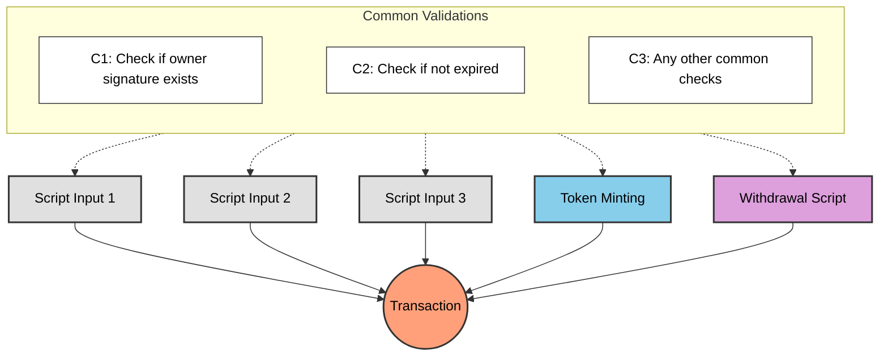
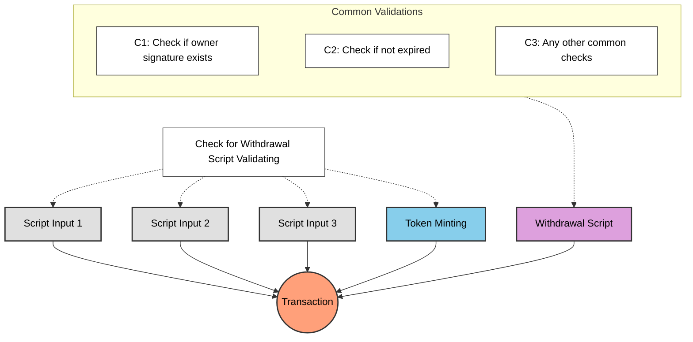

# Lesson #05: Avoid Redundant Validation

A common question from the previous lessons: why use a withdrawal script for minting and state updates instead of validating directly in the spending validator? Every UTXO spent from a spending validator triggers validation, so why not put the logic there?

> Source code: [GitHub](https://github.com/cardanobuilders/cardanobuilders.github.io/tree/main/codes/course-hello-cardano/05-avoid-redundant-validation)

## A Transaction with Multiple Script Validation

Consider a complex transaction involving multiple script validations: minting tokens, spending multiple script UTXOs, and withdrawing funds. Each action may require its own set of checks.



Enforcing common checks in every script causes redundant validation: the same logic executes multiple times, increasing transaction costs and script size.

## How Can We Do Better?

Centralize common checks in a single script that executes once. All other scripts delegate to it, eliminating duplicate logic while preserving all necessary validations.



The `WithdrawalCheck` script performs common validations once, checking conditions for all other scripts in the transaction.

## Example: Continue from Lesson 4

Assume Lesson 4's withdrawal script contains all common validation logic. Instead of duplicating those checks in spending and minting validators, delegate to the withdrawal script:

### Spending

```rs
use aiken/crypto.{ScriptHash}
use cardano/transaction.{OutputReference, Transaction}
use cocktail.{withdrawal_script_validated}

validator spending_logics_delegated(
  delegated_withdrawal_script_hash: ScriptHash,
) {
  spend(
    _datum_opt: Option<Data>,
    _redeemer: Data,
    _input: OutputReference,
    tx: Transaction,
  ) {
    withdrawal_script_validated(
      tx.withdrawals,
      delegated_withdrawal_script_hash,
    )
  }

  else(_) {
    fail @"unsupported purpose"
  }
}
```

### Minting

```rs
use aiken/crypto.{ScriptHash}
use cardano/assets.{PolicyId}
use cardano/transaction.{Transaction}
use cocktail.{withdrawal_script_validated}

validator minting_logics_delegated(
  delegated_withdrawal_script_hash: ScriptHash,
) {
  mint(_redeemer: Data, _policy_id: PolicyId, tx: Transaction) {
    withdrawal_script_validated(
      tx.withdrawals,
      delegated_withdrawal_script_hash,
    )
  }

  else(_) {
    fail @"unsupported purpose"
  }
}
```

## Why delegate to withdrawal script?

Delegating validation to a withdrawal script is a common Cardano smart contract pattern. While you could delegate to a spending or minting validator instead, withdrawal scripts have a distinct advantage.

### Clean trigger

Spending validation triggers when a UTXO is spent, and minting validation triggers when a token is minted. Both require an actual on-chain action. A withdrawal script, by contrast, can be triggered by withdrawing 0 lovelace (the [`withdraw 0 trick`](https://aiken-lang.org/fundamentals/common-design-patterns#forwarding-validation--other-withdrawal-tricks)). This triggers validation cleanly without affecting the transaction's logic or state.

## Simplified Explanation

### Why Avoid Redundant Validation?
When multiple scripts participate in a transaction, repeating the same checks in each one wastes execution budget and increases fees. Centralizing common checks in one script runs them once.

### How Delegation Works
A withdrawal script acts as the central validator:

- **Spending Validator**: Checks that the withdrawal script is present in the transaction
- **Minting Validator**: Also checks for the withdrawal script
- **Withdrawal Script**: Runs all shared validation logic once

### The Withdraw-Zero Trick
The withdrawal script triggers via the `withdraw 0 trick`: withdrawing 0 lovelace activates validation without affecting transaction state. This approach is widely adopted for its simplicity.

### Key Benefits
- **Efficiency**: Common checks execute once instead of per-script
- **Lower Fees**: Reduced execution budget means lower transaction costs
- **Maintainability**: Validation logic lives in one place

## Source code

The source code for this lesson is available on [GitHub](https://github.com/cardanobuilders/cardanobuilders.github.io/tree/main/codes/course-hello-cardano/05-avoid-redundant-validation).