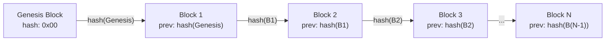
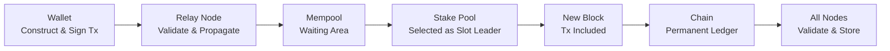

# Pelajaran #01: Apa Itu Blockchain?

Blockchain adalah struktur data terdistribusi yang hanya dapat ditambahkan (append-only) yang memungkinkan banyak peserta untuk menyepakati keadaan bersama tanpa otoritas pusat. Blockchain merangkai blok-blok transaksi yang terhubung secara kriptografis, menghasilkan buku besar yang tidak dapat diubah dan tidak dikontrol oleh satu pihak mana pun. Dalam pelajaran ini, kita akan membongkar sensasi berlebihan dan membangun model mental yang tepat tentang apa sebenarnya blockchain, mengapa ia diciptakan, dan bagaimana Cardano mengimplementasikan ide-ide ini dengan pilihan desain yang penting bagi Anda sebagai pengembang.

Di akhir pelajaran ini, Anda akan memahami mengapa blockchain ada, masalah apa yang dipecahkannya yang tidak bisa diselesaikan oleh basis data tradisional, dan arsitektur dasar yang menjadi fondasi setiap pelajaran berikutnya.

## Masalah Apa yang Dipecahkan Blockchain?

Blockchain memecahkan masalah kepercayaan: memungkinkan peserta yang tidak saling mempercayai untuk menyepakati buku besar kebenaran bersama tanpa satu pihak pun yang memiliki kendali. Sistem tradisional memusatkan kepercayaan pada satu entitas (bank, platform, operator server), dan sentralisasi tersebut menimbulkan kerentanan.

Dalam pengembangan web tradisional, kepercayaan bersifat terpusat. Ketika pengguna mengirim uang melalui aplikasi perbankan, pengirim dan penerima mempercayai bank untuk memperbarui saldo secara jujur. Ketika Anda menyimpan data di basis data PostgreSQL, aplikasi Anda mempercayai bahwa server basis data tidak telah dimanipulasi. Ketika dua layanan berkomunikasi melalui REST API, mereka mempercayai lapisan autentikasi (OAuth, JWT) untuk memverifikasi identitas.

Ini bekerja dengan sangat baik sampai tidak lagi. Kepercayaan terpusat menimbulkan beberapa kerentanan:

- **Titik kegagalan tunggal**: Jika server bank mati, tidak ada transaksi yang terjadi. Jika basis data rusak, data hilang.
- **Titik kendali tunggal**: Entitas yang mengelola sistem dapat secara sepihak mengubah aturan. Bank dapat membekukan akun Anda. Platform dapat menghapus data Anda.
- **Titik kepercayaan tunggal**: Pengguna harus percaya bahwa otoritas pusat jujur, kompeten, dan akan tetap demikian tanpa batas.

Pertanyaan fundamental yang dijawab oleh blockchain adalah: **Bisakah sekelompok peserta yang tidak saling mempercayai menyepakati buku besar kebenaran bersama, tanpa satu pihak pun yang memiliki kendali?**

Ini bukan masalah baru. Peneliti sistem terdistribusi telah mempelajarinya selama beberapa dekade dengan nama seperti "Masalah Jenderal Bizantium." Yang dicapai oleh Bitcoin (dan kemudian Cardano) adalah solusi praktis skala besar yang pertama.

## Apa Itu Buku Besar (Ledger)?

Buku besar adalah daftar catatan yang terurut yang melacak peristiwa atau transaksi secara berurutan, memastikan semua pihak melihat informasi yang sama, konsisten, dan tahan lama. Rekening koran bank Anda adalah buku besar. Spreadsheet yang melacak inventaris adalah buku besar.

Properti utama dari buku besar yang berguna adalah:

1. **Terurut**: Peristiwa dicatat secara berurutan. Transaksi A terjadi sebelum Transaksi B.
2. **Konsisten**: Semua pihak yang melihat buku besar melihat informasi yang sama.
3. **Tahan lama**: Setelah dicatat, entri tidak hilang.

Dalam sistem web2, buku besar biasanya berupa tabel basis data dengan timestamp dan ID yang bertambah otomatis. Satu server (atau kluster primer-replika) memeliharanya. Organisasi yang menjalankan server tersebut adalah sumber kebenaran.

**Buku besar terdistribusi** adalah buku besar yang dipelihara oleh banyak peserta independen, tidak ada yang memiliki kendali sepihak. Setiap peserta memegang salinan lengkap, dan mereka mengikuti protokol untuk menyepakati apa yang ditambahkan.

## Bagaimana Blok Mengelompokkan Transaksi?

Blok mengelompokkan transaksi ke dalam unit-unit diskrit yang tersegel secara kriptografis sehingga jaringan dapat memprosesnya secara efisien tanpa memerlukan komunikasi konstan antara semua peserta. Setiap blok berisi header (dengan metadata dan hash yang menghubungkannya ke blok sebelumnya) dan body (berisi transaksi-transaksi).

Blok adalah struktur data yang berisi:

```
Block {
  header: {
    block_number: 9821453
    timestamp: 2026-02-25T14:32:00Z
    previous_block_hash: "a4f2c8..."
    merkle_root: "7b3d1e..."      // sidik jari semua transaksi
    block_producer: "pool1abc..."  // stake pool yang membuat blok ini
  }
  body: {
    transactions: [tx1, tx2, tx3, ... tx_n]
  }
}
```

Setiap blok mereferensikan **hash blok sebelumnya** di header-nya. Inilah "rantai" dalam "blockchain." Jika seseorang mengubah transaksi di blok 100, hash blok 100 berubah, yang berarti referensi di blok 101 tidak lagi cocok, yang membatalkan blok 101, dan seterusnya. Memanipulasi blok historis mana pun merusak seluruh rantai dari titik itu ke depan.

Inilah sumber **ketidakberubahan (immutability)**. Bukan berarti mengubah data secara fisik tidak mungkin; melainkan mengubah data langsung terdeteksi dan akan memerlukan pembuatan ulang setiap blok berikutnya, yang (seperti akan kita lihat di pelajaran konsensus) secara komputasi atau ekonomi tidak layak.

## Bagaimana Rantai Menghubungkan Blok-Blok?

Rantai menghubungkan blok-blok melalui referensi hash kriptografis: setiap header blok berisi hash blok sebelumnya, membentuk urutan tak terputus dari blok genesis hingga blok terbaru. Struktur ini membuat buku besar hanya dapat ditambahkan dan tahan terhadap manipulasi.



**Blok genesis** adalah blok pertama. Ia tidak memiliki pendahulu. Di Cardano, blok genesis dibuat pada 23 September 2017 (era Byron). Setiap blok sejak saat itu terhubung kembali ke sana melalui rantai referensi hash yang tak terputus.

Properti utama dari struktur ini:

- **Hanya dapat ditambahkan (append-only)**: Blok baru ditambahkan di akhir. Anda tidak pernah menyisipkan blok di tengah atau menghapusnya.
- **Tahan manipulasi (tamper-evident)**: Setiap modifikasi pada blok mana pun langsung terdeteksi dengan menghitung ulang hash.
- **Terurut**: Rantai menyediakan pengurutan total semua transaksi sepanjang waktu. Transaksi A di blok 1000 secara definitif terjadi sebelum transaksi B di blok 1001.

Di mainnet Cardano, blok baru diproduksi kira-kira setiap 20 detik. Setiap blok dapat berisi ratusan transaksi. Per awal 2026, rantai berisi jutaan blok.

## Siapa yang Menjalankan Jaringan Blockchain?

Jaringan terdesentralisasi dari operator node independen menjalankan blockchain. Di Cardano, siapa pun dapat menjalankan node dengan menginstal perangkat lunak `cardano-node`; tidak ada pendaftaran, tidak perlu izin, dan tidak ada otoritas pusat yang memutuskan siapa yang berpartisipasi.

Node melayani dua peran:

1. **Node relay**: Menyebarkan blok dan transaksi ke seluruh jaringan. Mereka memastikan bahwa ketika blok baru dibuat, setiap peserta menerimanya.
2. **Node penghasil blok (stake pool)**: Membuat blok baru sesuai dengan protokol konsensus (Ouroboros, yang akan kita bahas di Pelajaran 3).

Per 2026, Cardano memiliki sekitar 3.000 stake pool aktif yang dioperasikan oleh entitas independen di seluruh dunia. Tidak ada satu entitas pun (bahkan Input Output Global (IOG), perusahaan yang membangun Cardano) yang mengendalikan jaringan.

**Desentralisasi adalah spektrum, bukan biner.** Jaringan dengan 3 validator lebih terdesentralisasi daripada yang memiliki 1, tetapi kurang dari yang memiliki 3.000. Desain Cardano secara khusus mendorong desentralisasi melalui skema pembagian hadiah: jika satu pool terlalu besar, delegator mendapat hadiah lebih sedikit, secara alami mendorong mereka untuk menyebarkan stake ke lebih banyak pool.

### Mengapa Desentralisasi Penting bagi Pengembang?

Sebagai pengembang web2, Anda mungkin bertanya: "Jika desentralisasi membuat segalanya lebih lambat dan lebih kompleks, mengapa repot-repot?"

Jawabannya terletak pada apa yang Anda dapatkan:

- **Ketahanan terhadap sensor**: Tidak ada satu entitas pun yang dapat mencegah transaksi valid diproses.
- **Deployment tanpa izin**: Anda dapat men-deploy smart contract tanpa persetujuan dari platform mana pun.
- **Eksekusi terjamin**: Setelah di-deploy, smart contract berjalan persis seperti yang ditulis. Tidak ada yang bisa mengubahnya.
- **State transparan**: Setiap peserta dapat memverifikasi seluruh riwayat. Tidak ada basis data tersembunyi.

Properti-properti ini memungkinkan aplikasi yang mustahil di infrastruktur terpusat: keuangan terdesentralisasi (DeFi), kredensial terverifikasi, tata kelola transparan, dan lainnya.

## Apa yang Membuat Data Blockchain Tidak Dapat Diubah?

Tiga mekanisme yang bekerja bersama menegakkan ketidakberubahan: hashing kriptografis (setiap blok berisi hash blok sebelumnya), replikasi terdistribusi (setiap node memegang salinan lengkap), dan protokol konsensus (yang membuat penulisan ulang riwayat secara ekonomi tidak rasional).

Ketidakberubahan memiliki implikasi mendalam:

- **Kesalahan bersifat permanen**: Jika Anda mengirim ADA ke alamat yang salah, tidak ada tombol "batalkan." Tidak ada administrator yang dapat membalikkan transaksi.
- **Riwayat dapat diaudit**: Setiap transaksi yang pernah dilakukan di Cardano dapat diverifikasi secara publik. Anda dapat melacak pergerakan token apa pun dari pembuatannya.
- **Penyimpanan data selamanya**: Apa pun yang ditulis ke rantai tetap ada selama jaringan ada.

Bagi pengembang, ini berarti perubahan fundamental dalam cara berpikir. Di web2, Anda secara rutin melakukan UPDATE dan DELETE pada catatan. Dalam pengembangan blockchain, Anda hanya INSERT. Koreksi dilakukan dengan menambahkan transaksi baru yang menggantikan yang lama, bukan dengan mengubah riwayat.

## Apa Itu Toleransi Kesalahan Bizantium?

Toleransi Kesalahan Bizantium (Byzantine Fault Tolerance/BFT) adalah kemampuan sistem terdistribusi untuk berfungsi dengan benar bahkan ketika beberapa peserta aktif bersifat jahat, bukan hanya offline tetapi sengaja berbohong. Konsep ini berasal dari Masalah Jenderal Bizantium, yang dirumuskan oleh Leslie Lamport, Robert Shostak, dan Marshall Pease pada tahun 1982.

Dalam istilah blockchain:

- **Jenderal** = node dalam jaringan
- **Rencana perang** = blok berikutnya yang akan ditambahkan ke rantai
- **Pengkhianat** = node jahat yang mungkin mencoba membuat blok palsu atau mengganggu konsensus

Protokol Ouroboros Cardano menyediakan BFT selama mayoritas stake (diukur dalam ADA) dikendalikan oleh peserta jujur. Secara spesifik, protokol aman selama setidaknya 51% ADA yang di-stake dipegang oleh aktor jujur. Mengingat ADA bernilai dan operator stake pool memiliki insentif ekonomi untuk jujur, asumsi ini telah bertahan sejak awal jaringan.

Ini adalah jaminan yang lebih kuat dari yang diberikan sebagian besar sistem web2. Basis data terdistribusi tradisional (menggunakan Raft atau Paxos) mentoleransi kegagalan crash tetapi bukan kegagalan Bizantium; mereka mengasumsikan semua node jujur tetapi mungkin offline. Blockchain mengasumsikan beberapa node secara aktif bermusuhan.

## Apa yang Membuat Arsitektur Cardano Unik?

Cardano memisahkan fungsionalitasnya ke dalam lapisan-lapisan yang berbeda dan menggunakan model akuntansi unik, dukungan token native, dan tata kelola on-chain. Pilihan desain ini membedakan Cardano dari blockchain lain dan secara langsung memengaruhi cara Anda membangun aplikasi.

### Arsitektur Berlapis

Cardano memisahkan fungsionalitasnya ke dalam dua lapisan:

- **Cardano Settlement Layer (CSL)**: Menangani transaksi ADA dan akuntansi. Di sinilah transfer nilai terjadi.
- **Cardano Computation Layer (CCL)**: Menangani eksekusi smart contract (skrip Plutus). Di sinilah logika yang dapat diprogram berada.

Pemisahan ini memungkinkan setiap lapisan berkembang secara independen dan memberikan properti keamanan yang lebih bersih.

### Model Extended UTXO

Berbeda dengan model berbasis akun Ethereum, Cardano menggunakan model **Extended UTXO (eUTXO)** untuk melacak nilai. Kita mendedikasikan seluruh Pelajaran 4 untuk ini, tetapi poin utamanya adalah: Cardano melacak "koin" individual (output transaksi yang belum dibelanjakan) daripada saldo akun. Ini memiliki implikasi signifikan untuk cara Anda mendesain aplikasi.

### Token Native

Di Cardano, token kustom (fungible dan non-fungible) bersifat **native**; mereka berada di lapisan settlement bersama ADA, bukan di dalam smart contract. Ini berarti token mewarisi semua properti keamanan ADA itu sendiri, tanpa memerlukan eksekusi smart contract untuk transfer dasar.

### Tata Kelola

Cardano bergerak menuju tata kelola on-chain di mana pemegang ADA memilih perubahan protokol. Ini adalah bagian dari era Voltaire dan merepresentasikan tingkat pengambilan keputusan terdesentralisasi yang tidak memiliki padanan di sistem web2.

## Bagaimana Data Mengalir Melalui Jaringan Cardano?

Ketika Anda mengirimkan transaksi di Cardano, transaksi tersebut berjalan dari dompet Anda melalui node relay, memasuki mempool, dipilih oleh stake pool untuk dimasukkan ke dalam blok, dan kemudian menyebar ke semua node untuk validasi dan penyimpanan permanen. Seluruh proses biasanya memakan waktu 20 hingga 60 detik.



Berikut proses langkah demi langkah:

```
1. Anda membuat transaksi (mengirim 100 ADA ke addr_test1...)
2. Anda menandatanganinya dengan kunci privat Anda
3. Dompet Anda mengirimkannya ke node relay
4. Node relay memvalidasi transaksi:
   - Apakah tanda tangannya valid?
   - Apakah input (UTXO) ada dan belum dibelanjakan?
   - Apakah biayanya cukup?
5. Jika valid, relay menyebarkannya ke node relay lain
6. Transaksi berada di "mempool" (area tunggu)
7. Stake pool dipilih untuk memproduksi blok berikutnya
8. Stake pool memasukkan transaksi Anda ke dalam blok baru
9. Blok disebarkan ke semua node
10. Setiap node memvalidasi blok dan menambahkannya ke rantai mereka
11. Transaksi Anda sekarang menjadi bagian dari buku besar permanen
```

Dari pengiriman hingga dimasukkan dalam blok biasanya memakan waktu 20 hingga 60 detik di Cardano. Setelah beberapa blok lagi ditambahkan di atasnya, transaksi dianggap final dengan tingkat kepercayaan yang sangat tinggi.

## Apa Saja Kesalahpahaman Umum tentang Blockchain?

Banyak pendatang baru membawa kesalahpahaman tentang blockchain yang dapat menyebabkan keputusan desain yang buruk. Berikut yang paling umum, diklarifikasi secara langsung.

**"Blockchain hanyalah basis data."**
Blockchain adalah jenis struktur data yang sangat spesifik dengan properti (desentralisasi, ketidakberubahan, akses tanpa izin) yang sengaja dihindari oleh basis data tradisional karena menambah overhead. Gunakan basis data ketika Anda mempercayai operator. Gunakan blockchain ketika Anda membutuhkan koordinasi tanpa kepercayaan.

**"Semuanya harus di blockchain."**
Penyimpanan blockchain mahal dan lambat dibandingkan penyimpanan tradisional. Simpan hanya apa yang perlu diverifikasi dan tidak dapat diubah di on-chain. Gunakan penyimpanan off-chain (IPFS, basis data tradisional) untuk yang lainnya, dengan hash on-chain sebagai jangkar.

**"Blockchain itu anonim."**
Cardano (seperti Bitcoin) bersifat **pseudonim**, bukan anonim. Transaksi bersifat publik. Alamat terlihat. Meskipun alamat tidak secara langsung terhubung ke identitas asli, pola penggunaan sering kali dapat dianalisis. Jangan pernah berasumsi transaksi blockchain bersifat privat.

## Analogi Web2

Mari kita petakan setiap konsep blockchain utama ke sesuatu yang sudah Anda ketahui dari pengembangan web2:

| Konsep Blockchain | Padanan Web2 | Perbedaan Utama |
|---|---|---|
| **Buku besar terdistribusi** | Basis data tereplikasi (PostgreSQL dengan read replica) | Tidak ada node primer tunggal; semua node adalah peer yang setara |
| **Blok** | Batch transaksi basis data / segmen write-ahead log | Blok terhubung secara kriptografis dan tidak dapat diubah |
| **Rantai hash** | Riwayat commit Git | Git memungkinkan rebase dan force-push; blockchain tidak |
| **Node** | Server aplikasi | Node tanpa izin; siapa pun dapat menjalankannya |
| **Mempool** | Antrian pesan (RabbitMQ, SQS) | Mempool lokal untuk setiap node; tidak dijamin diproses berurutan |
| **Konsensus** | Pemilihan pemimpin (Raft/Paxos) | Konsensus blockchain mentoleransi aktor jahat, bukan hanya crash |
| **Ketidakberubahan** | Log peristiwa append-only (Kafka, event sourcing) | Ketidakberubahan blockchain ditegakkan secara kriptografis di seluruh peserta |
| **Smart contract** | Fungsi serverless (AWS Lambda) | Setelah di-deploy, tidak ada yang bisa mengubah atau menghapusnya |
| **Blok genesis** | Migrasi basis data #001 | Hanya ada satu, dan mendefinisikan state awal |

**Analogi Git sangat kuat.** Bayangkan blockchain sebagai repositori Git di mana:
- Setiap commit mereferensikan induknya (seperti blok mereferensikan blok sebelumnya)
- Riwayat hanya dapat ditambahkan (tidak ada force push, tidak ada rebase, tidak ada squash)
- Setiap pengembang memiliki clone penuh (replikasi terdistribusi)
- Penggabungan (konsensus) terjadi secara otomatis oleh protokol, bukan oleh keputusan manusia
- Repositori bersifat publik dan siapa pun dapat meng-clone-nya

## Poin-Poin Penting

- **Blockchain adalah buku besar terdistribusi yang hanya dapat ditambahkan** yang dipelihara oleh jaringan node independen yang mengikuti protokol bersama untuk menyepakati state.
- **"Rantai" berasal dari penautan hash kriptografis**: setiap blok berisi hash blok sebelumnya, membuat manipulasi terdeteksi dan tidak layak.
- **Desentralisasi menghilangkan titik kegagalan dan kendali tunggal**, memungkinkan aplikasi di mana tidak ada satu pihak pun yang dapat menyensor, mengubah, atau mematikan sistem.
- **Ketidakberubahan adalah fitur, bukan batasan**: memberikan auditabilitas, prediktabilitas, dan kepercayaan tanpa memerlukan perantara tepercaya.
- **Cardano secara spesifik** menggunakan arsitektur berlapis, model Extended UTXO, dan token native; pilihan desain yang membedakannya dari blockchain lain dan memengaruhi cara Anda membangun aplikasi.

## Selanjutnya

Sekarang setelah Anda memahami apa itu blockchain dan mengapa ia ada, pelajaran berikutnya mengeksplorasi blok bangunan kriptografis yang membuat semuanya bekerja. Fungsi hash, Merkle tree, dan tanda tangan digital adalah fondasi matematika yang mengubah properti teoretis yang kita bahas (ketidakberubahan, bukti manipulasi, verifikasi identitas) menjadi jaminan konkret yang dapat ditegakkan.
