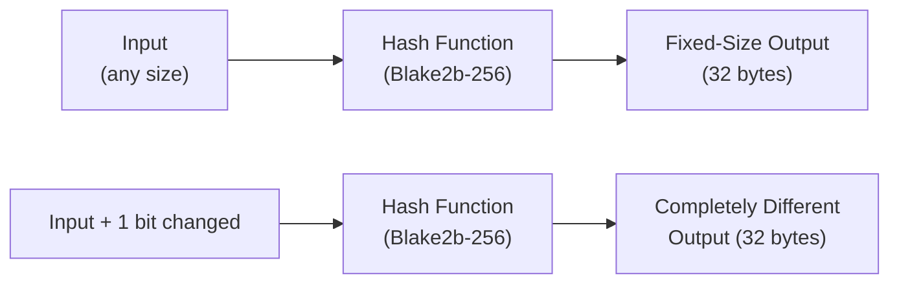
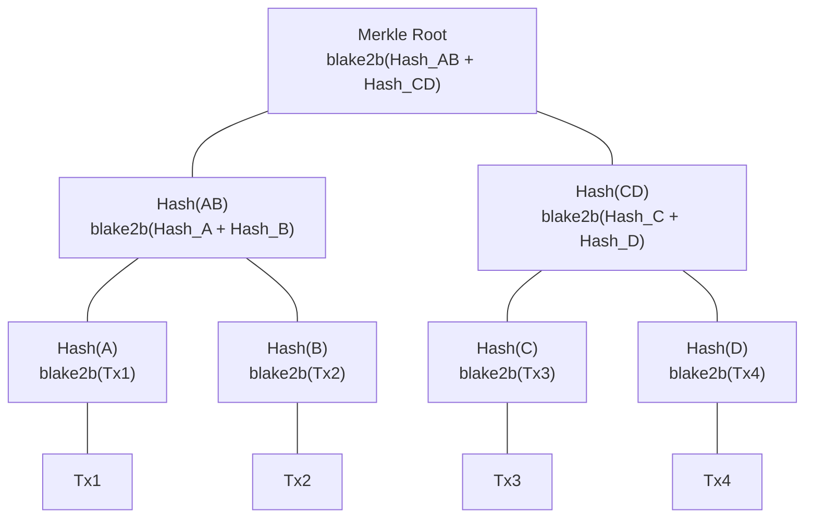
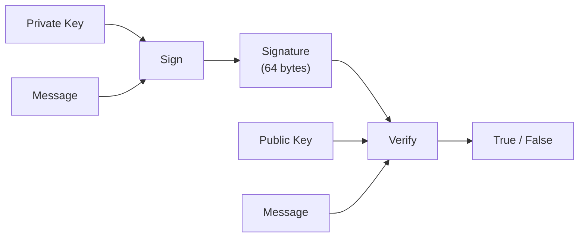

# Pelajaran #02: Primitif Kriptografi

Primitif kriptografi adalah fungsi matematika dengan properti khusus yang membuat kecurangan secara komputasi tidak layak, dan mereka membentuk fondasi keamanan setiap transaksi blockchain. Dalam pelajaran sebelumnya, kita menjelaskan properti blockchain seperti ketidakberubahan dan bukti manipulasi. Pelajaran ini mengungkap alat-alat konkret yang menegakkan properti tersebut: fungsi hash, Merkle tree, dan tanda tangan digital.

Anda akan memahami tidak hanya apa yang dilakukan primitif-primitif ini, tetapi mengapa Cardano memilih algoritma tertentu (Blake2b, Ed25519) dan bagaimana pilihan-pilihan ini memengaruhi kinerja, keamanan, dan pengalaman pengembang.

## Apa Itu Fungsi Hash Kriptografi?

Fungsi hash kriptografi mengambil input berukuran apa pun dan menghasilkan output berukuran tetap ("hash" atau "digest") sedemikian rupa sehingga input yang sama selalu menghasilkan output yang sama, tetapi bahkan perubahan kecil pada input menghasilkan hash yang sepenuhnya berbeda. Fungsi hash adalah blok bangunan paling fundamental dalam keamanan blockchain.



### Properti Apa yang Harus Dimiliki Fungsi Hash Kriptografi?

Tidak semua fungsi hash bersifat kriptografis. Fungsi hash kriptografi harus memenuhi properti-properti berikut:

**1. Deterministik**: Input yang sama selalu menghasilkan output yang sama.
```
hash("Hello, Cardano") = "8a3b2c..." (selalu, setiap saat, di setiap komputer)
```

**2. Ukuran output tetap**: Terlepas dari ukuran input, panjang output selalu konstan.
```
hash("a")                    = "4a3b2c..." (32 bytes)
hash("seluruh karya Shakespeare") = "7f2d1e..." (32 bytes)
```

**3. Ketahanan pre-image**: Diberikan output hash, secara komputasi tidak layak untuk menemukan input aslinya. Anda tidak dapat "membalikkan" hash.
```
Diberikan: "8a3b2c..."
Temukan:  ??? sedemikian rupa sehingga hash(???) = "8a3b2c..."
Ini memerlukan kira-kira 2^256 percobaan (lebih dari atom di alam semesta).
```

**4. Ketahanan second pre-image**: Diberikan input dan hash-nya, tidak layak menemukan input berbeda yang menghasilkan hash yang sama.
```
Diberikan: "Hello, Cardano" -> "8a3b2c..."
Temukan:  input_lain sedemikian rupa sehingga hash(input_lain) = "8a3b2c..."
Ini seharusnya secara komputasi tidak layak.
```

**5. Ketahanan tabrakan (collision resistance)**: Tidak layak menemukan dua input berbeda yang menghasilkan hash yang sama.
```
Temukan: input_A dan input_B di mana input_A != input_B
      tetapi hash(input_A) = hash(input_B)
Ini memerlukan kira-kira 2^128 operasi (batas birthday).
```

**6. Efek longsoran (avalanche effect)**: Perubahan kecil pada input menghasilkan output yang sangat berbeda.
```
hash("Hello, Cardano")  = "8a3b2c4d..."
hash("Hello, cardano")  = "f17e9a2b..."  (sepenuhnya berbeda!)
```

### Mengapa Cardano Menggunakan Blake2b Alih-alih SHA-256?

**SHA-256** (Secure Hash Algorithm, 256-bit) adalah fungsi hash yang digunakan Bitcoin. NSA mendesainnya dan NIST menstandarkannya. Menghasilkan digest 256-bit (32-byte) dan telah dipelajari secara ekstensif.

**Blake2b** adalah fungsi hash yang lebih baru yang digunakan Cardano secara luas. Jean-Philippe Aumasson dan rekan-rekannya mendesainnya, berdasarkan fungsi hash BLAKE (finalis kompetisi SHA-3). Cardano secara spesifik menggunakan Blake2b-256 (output 256-bit) untuk sebagian besar kebutuhan hashing dan Blake2b-224 (output 224-bit) untuk pembuatan alamat.

| Properti | SHA-256 | Blake2b-256 |
|---|---|---|
| **Kecepatan** | Lebih lambat di perangkat lunak | 2-3x lebih cepat di perangkat lunak |
| **Margin keamanan** | Sudah mapan | Keamanan setara, berdasarkan stream cipher ChaCha |
| **Paralelisme** | Struktur internal sekuensial | Dirancang untuk paralelisme |
| **Fleksibilitas** | Konfigurasi tetap | Panjang output dapat dikonfigurasi, hashing berkey, personalisasi |
| **Optimisasi hardware** | Efisien di ASIC khusus | Efisien di CPU tujuan umum |

Keunggulan kecepatan Blake2b penting karena hashing terjadi terus-menerus dalam operasi blockchain (memvalidasi blok, memverifikasi transaksi, menghitung alamat). Hashing yang lebih cepat berarti validasi lebih cepat, yang berarti throughput lebih tinggi.

### Di Mana Cardano Menggunakan Hashing?

Fungsi hash muncul di mana-mana dalam arsitektur Cardano:

1. **Hashing header blok**: Setiap header blok di-hash, dan digest yang dihasilkan dimasukkan ke header blok berikutnya. Ini menciptakan rantai.

2. **ID Transaksi**: Setiap transaksi di Cardano diidentifikasi oleh hash konten serial-nya. ID transaksi (TxId) adalah hash Blake2b-256.

3. **Pembuatan alamat**: Alamat Cardano diturunkan dengan melakukan hash kunci publik menggunakan Blake2b-224, kemudian mengkodekan hasilnya.

4. **Hashing skrip**: Skrip smart contract (validator Plutus) diidentifikasi oleh hash kode terkompilasi mereka. Hash ini menjadi alamat skrip.

5. **Hashing datum**: Data yang dilampirkan ke UTXO dapat disimpan sebagai hash (hash datum) untuk menghemat ruang on-chain.

6. **Policy ID**: Kebijakan pencetakan (minting) token native diidentifikasi oleh hash skrip kebijakan.

```
Transaction                    Block Header
+-----------+                  +--------------------+
| inputs    |                  | block_number       |
| outputs   |  hash(tx) ->     | previous_hash      |
| fee       |  TxId            | merkle_root        |
| metadata  |                  | slot_leader        |
+-----------+                  +--------------------+
                                        |
                               hash(header) -> dimasukkan ke blok berikutnya
```

## Bagaimana Merkle Tree Memungkinkan Verifikasi yang Efisien?

Merkle tree mengorganisasi hash transaksi ke dalam struktur pohon biner di mana setiap daun berisi hash transaksi, setiap node internal berisi hash dari dua anak-nya, dan akar (root, disimpan di header blok) merepresentasikan semua transaksi dalam satu sidik jari 32-byte. Struktur ini memungkinkan pembuktian keanggotaan dalam waktu logaritmik.



### Bagaimana Merkle Tree Dibangun?

Misalkan sebuah blok berisi empat transaksi: Tx1, Tx2, Tx3, Tx4.

Proses pembangunan:

```
Langkah 1: Hash setiap transaksi secara individual
  Hash(A) = blake2b(Tx1)
  Hash(B) = blake2b(Tx2)
  Hash(C) = blake2b(Tx3)
  Hash(D) = blake2b(Tx4)

Langkah 2: Hash pasangan hash bersama-sama
  Hash(AB) = blake2b(Hash(A) + Hash(B))
  Hash(CD) = blake2b(Hash(C) + Hash(D))

Langkah 3: Hash pasangan dari pasangan
  Merkle Root = blake2b(Hash(AB) + Hash(CD))
```

**Merkle root** adalah hash tunggal yang merepresentasikan semua transaksi dalam blok. Ia disimpan di header blok.

### Mengapa Merkle Tree Penting?

**Verifikasi efisien**: Untuk membuktikan bahwa Tx3 termasuk dalam blok, Anda tidak perlu mengunduh semua transaksi. Anda hanya memerlukan:

```
Bukti bahwa Tx3 ada di blok:
  - Hash(D)   (saudara dari hash Tx3)
  - Hash(AB)  (saudara dari Hash(CD))

Verifikasi:
  1. Hitung Hash(C) = blake2b(Tx3)
  2. Hitung Hash(CD) = blake2b(Hash(C) + Hash(D))
  3. Hitung Root = blake2b(Hash(AB) + Hash(CD))
  4. Bandingkan Root yang dihitung dengan Merkle Root di header blok
```

Ini disebut **Merkle proof** (atau bukti inklusi Merkle). Untuk blok dengan N transaksi, Anda hanya memerlukan log2(N) hash untuk memverifikasi keanggotaan. Dalam blok dengan 1.000 transaksi, Anda hanya memerlukan sekitar 10 hash, bukan semua 1.000.

**Deteksi manipulasi**: Jika satu transaksi dimodifikasi, hash-nya berubah, yang mengubah hash induknya, yang merambat ke atas hingga Merkle root. Root di header blok tidak akan cocok lagi, langsung mengungkapkan manipulasi.

**Dukungan klien ringan (light client)**: Merkle proof memungkinkan dompet ringan yang tidak menyimpan seluruh blockchain. Dompet ringan dapat memverifikasi bahwa transaksi tertentu ada tanpa mengunduh setiap transaksi di setiap blok. Ia hanya memerlukan header blok dan jalur Merkle proof.

### Bagaimana Cardano Menggunakan Merkle Tree?

Cardano menggunakan Merkle tree dalam beberapa konteks:

- **Verifikasi transaksi**: Merkle root transaksi di setiap header blok memungkinkan verifikasi efisien inklusi transaksi.
- **Snapshot distribusi stake**: Merkle tree secara efisien merepresentasikan distribusi stake di seluruh alamat pada batas epoch.
- **Data skrip**: Merkle tree dapat meng-commit dataset besar sambil hanya menyimpan root di on-chain, dengan bukti off-chain untuk elemen individual.

## Bagaimana Tanda Tangan Digital Membuktikan Identitas?

Skema tanda tangan digital memungkinkan seseorang menandatangani pesan dengan kunci privat sehingga siapa pun dapat memverifikasi tanda tangan tersebut menggunakan kunci publik yang sesuai. Tanda tangan digital memberikan tiga jaminan: autentikasi (tanda tangan membuktikan pembuat pesan memegang kunci privat), integritas (modifikasi apa pun membatalkan tanda tangan), dan non-repudiasi (penandatangan tidak dapat menyangkal telah menandatangani).



### Bagaimana Tanda Tangan Digital Bekerja Secara Konseptual?

Skema tanda tangan digital memiliki tiga operasi:

```
Pembangkitan Kunci:
  (private_key, public_key) = generate_keypair()
  // private_key: dirahasiakan, digunakan untuk menandatangani
  // public_key: dibagikan secara publik, digunakan untuk memverifikasi

Penandatanganan:
  signature = sign(message, private_key)
  // Hanya seseorang dengan private_key yang dapat menghasilkan ini

Verifikasi:
  is_valid = verify(message, signature, public_key)
  // Siapa pun dengan public_key dapat memverifikasi
  // Mengembalikan true jika tanda tangan autentik
```

Hubungan matematis antara kunci-kunci memastikan bahwa:
- Hanya seseorang dengan kunci privat yang dapat menghasilkan tanda tangan yang valid
- Kunci publik dapat memverifikasi tanda tangan tanpa mengungkapkan kunci privat
- Tanda tangan terikat pada pesan tertentu; tidak dapat dipindahkan ke pesan lain

### Mengapa Cardano Menggunakan Ed25519?

Cardano menggunakan **Ed25519**, implementasi dari Edwards-curve Digital Signature Algorithm (EdDSA) menggunakan Curve25519. Daniel J. Bernstein dan rekan-rekannya mendesain Ed25519 dengan tujuan kinerja dan keamanan yang eksplisit.

| Properti | Ed25519 | ECDSA (digunakan oleh Bitcoin/Ethereum) |
|---|---|---|
| **Ukuran kunci** | 32 byte (privat), 32 byte (publik) | 32 byte (privat), 33 byte (publik, terkompresi) |
| **Ukuran tanda tangan** | 64 byte | ~72 byte (DER encoded) |
| **Kecepatan** | Penandatanganan dan verifikasi sangat cepat | Lebih lambat |
| **Deterministik** | Ya (pesan + kunci yang sama = tanda tangan yang sama) | Memerlukan nonce acak (sumber banyak bug) |
| **Ketahanan side-channel** | Dirancang tahan terhadap serangan timing | Rentan jika diimplementasikan ceroboh |
| **Verifikasi batch** | Verifikasi batch yang efisien dimungkinkan | Tidak didukung secara native |

Penandatanganan deterministik Ed25519 adalah keunggulan keamanan yang signifikan. Dengan ECDSA (digunakan oleh Bitcoin dan Ethereum), penandatanganan memerlukan bilangan acak (nonce). Jika generator bilangan acak cacat, kunci privat dapat diekstrak dari tanda tangan. Ini telah menyebabkan kompromi kunci di dunia nyata. Ed25519 menghilangkan seluruh kelas kerentanan ini dengan menurunkan nonce secara deterministik dari pesan dan kunci privat.

### Bagaimana Tanda Tangan Bekerja dalam Transaksi Cardano?

Setiap transaksi Cardano harus ditandatangani oleh kunci privat yang mengendalikan input yang dibelanjakan. Berikut alur konseptualnya:

```
1. Bangun body transaksi:
   TransactionBody {
     inputs:  [utxo_1, utxo_2]
     outputs: [output_to_recipient, change_output]
     fee:     200000 lovelace
   }

2. Serialisasi dan hash body transaksi:
   tx_body_hash = blake2b_256(serialize(transaction_body))

3. Tandatangani hash dengan setiap kunci privat yang diperlukan:
   signature_1 = ed25519_sign(tx_body_hash, private_key_1)
   signature_2 = ed25519_sign(tx_body_hash, private_key_2)

4. Susun transaksi lengkap:
   Transaction {
     body:       transaction_body
     witnesses:  [
       (public_key_1, signature_1),
       (public_key_2, signature_2)
     ]
   }

5. Kirimkan ke jaringan. Setiap node memverifikasi:
   - ed25519_verify(tx_body_hash, signature_1, public_key_1) == true
   - ed25519_verify(tx_body_hash, signature_2, public_key_2) == true
   - public_key_1 sesuai dengan alamat yang mengendalikan utxo_1
   - public_key_2 sesuai dengan alamat yang mengendalikan utxo_2
```

Perhatikan bahwa yang ditandatangani adalah **hash body transaksi**, bukan transaksi mentah. Ini lebih efisien (menandatangani hash 32-byte lebih cepat daripada menandatangani body transaksi yang berpotensi besar) dan memastikan bahwa tanda tangan mencakup semua data transaksi melalui ketahanan tabrakan hash.

### Bagaimana Transaksi Multi-Tanda Tangan Bekerja?

Cardano secara native mendukung transaksi yang memerlukan beberapa tanda tangan. Ini penting untuk:

- **Dompet bersama**: Dana yang memerlukan persetujuan dari beberapa pihak
- **Transaksi multi-aset**: Ketika transaksi membelanjakan UTXO yang dikendalikan oleh alamat berbeda
- **Validasi skrip**: Ketika tanda tangan kunci dan eksekusi skrip keduanya diperlukan

Berbeda dengan beberapa blockchain di mana multi-tanda tangan memerlukan smart contract, Cardano menanganinya di tingkat protokol. Transaksi cukup menyertakan beberapa entri witness, dan node memverifikasi semuanya.

## Bagaimana Primitif-Primitif Ini Bergabung untuk Keamanan?

Kekuatan sebenarnya muncul ketika fungsi hash, Merkle tree, dan tanda tangan digital bekerja bersama. Setiap primitif memberikan jaminan tertentu, dan kombinasinya menciptakan keamanan berlapis yang saling memperkuat sehingga membuat serangan praktis tidak layak.

```
Langkah 1: Pengguna membuat transaksi membelanjakan 50 ADA
  - Body transaksi menentukan input, output, dan biaya
  - Body di-hash: tx_hash = blake2b_256(tx_body)
  - Hash ditandatangani: sig = ed25519_sign(tx_hash, private_key)
  -> Jaminan: autentisitas, integritas transaksi

Langkah 2: Transaksi memasuki blok
  - Produsen blok mengumpulkan transaksi valid
  - Hash transaksi membentuk daun-daun Merkle tree
  - Merkle root masuk ke header blok
  -> Jaminan: verifikasi efisien, deteksi manipulasi transaksi apa pun

Langkah 3: Blok ditambahkan ke rantai
  - Header blok di-hash: block_hash = blake2b_256(header)
  - Blok berikutnya mereferensikan hash ini di header-nya
  -> Jaminan: ketidakberubahan, bukti manipulasi di seluruh rantai

Langkah 4: Rantai bertumbuh
  - Setiap blok baru memperkuat jaminan semua blok sebelumnya
  - Untuk mengubah transaksi historis, penyerang perlu:
    a) Menandatangani ulang transaksi (memerlukan kunci privat)
    b) Menghitung ulang Merkle root untuk blok tersebut
    c) Menghitung ulang hash blok
    d) Menghitung ulang setiap hash blok berikutnya
    e) Melakukan semua ini lebih cepat dari sisa jaringan menambah blok baru
  -> Efek gabungan: ketidakberubahan praktis
```

Pertahanan berlapis inilah mengapa blockchain dianggap aman. Tidak ada satu primitif pun yang bisa bekerja sendiri. Fungsi hash menyediakan integritas dan pengikatan. Merkle tree menyediakan efisiensi dan struktur. Tanda tangan digital menyediakan autentikasi dan otorisasi. Bersama-sama, mereka menciptakan sistem di mana biaya kecurangan melebihi manfaat apa pun yang mungkin didapat.

## Apa Itu Fungsi Acak Terverifikasi (VRF)?

Fungsi Acak Terverifikasi (Verifiable Random Function/VRF) menggabungkan tanda tangan digital dengan generator bilangan acak: diberikan kunci privat dan input, ia menghasilkan output acak yang tidak dapat diprediksi tanpa kunci privat, ditambah bukti yang dapat diverifikasi oleh siapa pun dengan kunci publik. Protokol Ouroboros Cardano menggunakan VRF untuk menentukan stake pool mana yang memproduksi setiap blok.

VRF menghasilkan:
1. **Output acak** yang tidak dapat diprediksi tanpa kunci privat
2. **Bukti** bahwa output dihasilkan dengan benar

Dalam Ouroboros, VRF menentukan stake pool mana yang mendapat hak memproduksi setiap blok. Nomor slot adalah input, kunci VRF pool adalah kunci privat, dan output menentukan apakah pool tersebut "menang" hak untuk memproduksi blok. Ini membuat pemilihan produsen blok acak (tidak dapat diprediksi) dan terverifikasi (dapat dibuktikan), mencegah siapa pun memanipulasi siapa yang mendapat hak menambahkan blok berikutnya.

Kita akan mengeksplorasi ini lebih mendalam di Pelajaran 3 ketika kita membahas mekanisme konsensus.

## Bagaimana Hashing Mengamankan Data Off-Chain?

Pola umum dalam pengembangan Cardano menyimpan hash data besar di on-chain sementara menyimpan data lengkap di off-chain. Ini memberikan verifikabilitas tanpa membengkakkan blockchain: siapa pun dapat mengunduh data off-chain dan mengonfirmasi bahwa data tersebut cocok dengan hash on-chain.

```
Off-chain:                        On-chain:
+-------------------+            +---------------------------+
| Dokumen besar     |            | Metadata transaksi:       |
| (PDF, JSON, dll.) |  hash ->   |   document_hash: "7f2d..."  |
| Disimpan di IPFS  |            |   ipfs_cid: "Qm..."      |
+-------------------+            +---------------------------+

Siapa pun dapat memverifikasi:
  blake2b_256(dokumen_yang_diunduh) == on_chain_hash
  Jika cocok, dokumen autentik dan tidak dimodifikasi.
```

Pola ini digunakan untuk:
- **Metadata NFT**: File gambar atau media aktual disimpan off-chain (sering di IPFS), tetapi hash-nya di-commit on-chain.
- **Proposal tata kelola**: Teks proposal lengkap berada off-chain; hash menjangkarkannya ke rantai.
- **Jejak audit**: Urutan hash dapat membuktikan urutan dan integritas peristiwa off-chain.
- **Standar token CIP-25 / CIP-68**: Mendefinisikan bagaimana hash metadata berhubungan dengan aset token.

## Analogi Web2

Setiap primitif kriptografi dalam pelajaran ini memiliki padanan web2. Perbedaannya terletak pada cakupan dan jaminan.

| Primitif Blockchain | Padanan Web2 | Perbedaan Utama |
|---|---|---|
| **Hashing Blake2b** | bcrypt/argon2 untuk penyimpanan kata sandi | Hashing blockchain untuk integritas, bukan kerahasiaan. Kata sandi memerlukan hash lambat; blockchain memerlukan hash cepat |
| **ID Transaksi (hash)** | Penyimpanan content-addressable (SHA commit Git) | Konsep sama: konten menentukan identitas |
| **Merkle tree** | Hash tree di BitTorrent / objek tree Git | Merkle tree blockchain kritis untuk konsensus dan dapat diverifikasi secara publik |
| **Merkle proof** | Log transparansi sertifikat (CT logs) | Keduanya membuktikan inklusi tanpa mengungkapkan seluruh dataset |
| **Tanda tangan Ed25519** | Penandatanganan JWT RS256/ES256 | JWT menandatangani klaim untuk diverifikasi server; blockchain menandatangani transaksi untuk diverifikasi seluruh jaringan |
| **VRF** | Pembangkitan bilangan acak sisi server | VRF dapat diverifikasi siapa pun; `Math.random()` tidak |
| **Hash data off-chain** | Header HTTP ETag / Content-MD5 | Konsep integritas sama, tetapi hash blockchain permanen dan dapat diverifikasi secara global |

**Analogi JWT sangat instruktif.** Ketika Anda membuat JWT:
1. Anda mengambil payload (klaim tentang pengguna)
2. Anda menandatanganinya dengan kunci privat (RS256, ES256, atau serupa)
3. Siapa pun dengan kunci publik dapat memverifikasi tanda tangan
4. Mengubah payload membatalkan tanda tangan

Transaksi Cardano mengikuti pola yang persis sama:
1. Anda mengambil payload (body transaksi)
2. Anda menandatanganinya dengan kunci privat Anda (Ed25519)
3. Siapa pun dengan kunci publik Anda (node mana pun) dapat memverifikasi tanda tangan
4. Mengubah body transaksi membatalkan tanda tangan

Perbedaannya adalah verifikasi JWT terjadi di satu server yang Anda kendalikan, sementara verifikasi tanda tangan Cardano terjadi di ribuan node independen di seluruh dunia.

**Checksum konten** juga konsep yang familiar. Ketika Anda mengunduh file dan memverifikasi checksum SHA-256-nya, Anda melakukan persis apa yang dilakukan node Cardano ketika memverifikasi hash transaksi. Prinsipnya identik; skala dan model kepercayaannya berbeda.

## Poin-Poin Penting

- **Fungsi hash** (Blake2b di Cardano) menghasilkan sidik jari data berukuran tetap yang unik. Mereka adalah fondasi verifikasi integritas, ID transaksi, alamat, dan struktur rantai itu sendiri.
- **Merkle tree** mengorganisasi hash ke dalam struktur hierarkis yang memungkinkan verifikasi individual transaksi dalam blok secara efisien dalam waktu logaritmik, dan sangat penting untuk klien ringan.
- **Tanda tangan digital** (Ed25519 di Cardano) membuktikan bahwa transaksi diotorisasi oleh pemegang kunci privat yang sesuai, memberikan autentikasi, integritas, dan non-repudiasi.
- **Primitif-primitif ini bergabung** untuk menciptakan keamanan berlapis: tanda tangan mengotorisasi transaksi, Merkle tree mengorganisasinya ke dalam blok, dan rantai hash menghubungkan blok menjadi riwayat yang tidak dapat diubah.
- **Cardano memilih Blake2b dan Ed25519** untuk kinerja, keamanan, dan determinisme; pilihan yang memengaruhi throughput transaksi dan pengalaman pengembang.

## Selanjutnya

Dengan fungsi hash, Merkle tree, dan tanda tangan digital di toolkit Anda, kini Anda memahami jaminan keamanan matematis dari blok dan transaksi individual. Tetapi siapa yang memutuskan blok mana yang ditambahkan berikutnya? Bagaimana ribuan node independen menyepakati rantai yang sama? Pelajaran 3 membahas mekanisme konsensus: aturan tingkat protokol yang mengoordinasikan seluruh jaringan, dengan pembahasan mendalam tentang protokol Ouroboros Cardano.
