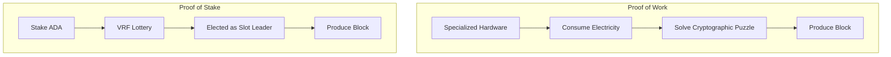
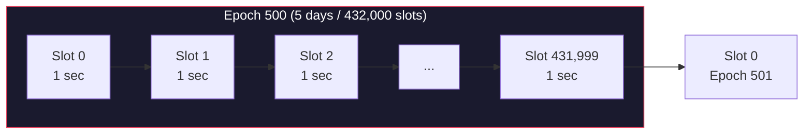
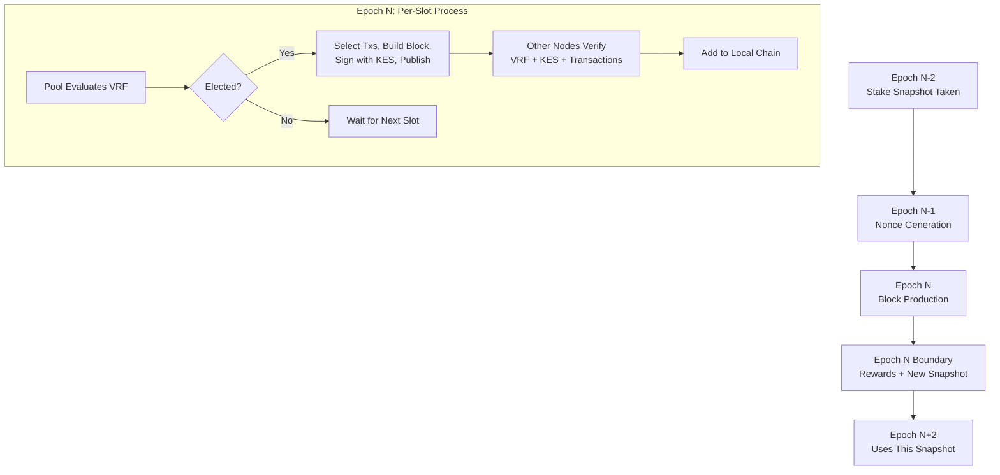

# Pelajaran #03: Mekanisme Konsensus

Mekanisme konsensus adalah seperangkat aturan tingkat protokol yang memungkinkan ribuan node independen menyepakati satu rantai kanonik tanpa koordinator pusat. Kita telah menetapkan bahwa blockchain adalah buku besar terdistribusi dan bahwa primitif kriptografi mengamankan transaksi dan blok individual. Pelajaran ini menjawab pertanyaan kritis yang tersisa: ketika beberapa node masing-masing mengusulkan blok berbeda pada waktu yang sama, bagaimana jaringan memutuskan mana yang menjadi bagian dari rantai?

Kita akan memeriksa bagaimana konsensus bekerja, membandingkan dua pendekatan dominan (Proof of Work dan Proof of Stake), dan melihat secara rinci protokol Ouroboros Cardano, sistem Proof of Stake pertama yang terbukti aman secara formal.

## Mengapa Konsensus Sulit dalam Sistem Terdistribusi?

Konsensus sulit karena node-node terdistribusi memiliki pandangan berbeda tentang transaksi tertunda, menghadapi latensi jaringan, mungkin offline, dan beberapa mungkin bertindak jahat, namun mereka semua harus menyepakati satu kebenaran tanpa koordinator pusat. Dalam sistem terpusat, satu server memutuskan dan semua menerima. Tanpa otoritas itu, masalahnya menjadi fundamental.

Pertimbangkan skenario ini:

```
Waktu: Slot 7.241.000

Node A (di Tokyo) menerima transaksi [T1, T2, T3]
Node B (di New York) menerima transaksi [T2, T4, T5]
Node C (di Berlin) menerima transaksi [T1, T4, T6]

Setiap node memiliki pandangan berbeda tentang transaksi tertunda.
Transaksi mana yang masuk ke blok berikutnya?
Siapa yang memutuskan?
Bagaimana jika Node B jahat dan memalsukan T5?
```

Jaringan harus menyepakati:
1. **Siapa** yang berhak memproduksi blok berikutnya
2. **Apa** transaksi yang masuk ke blok tersebut
3. **Kapan** blok dianggap final (tidak dapat dibalikkan)

Dan harus melakukannya meskipun:
- Latensi jaringan (pesan memerlukan waktu untuk menyebar secara global)
- Kegagalan node (beberapa node mungkin offline)
- Aktor jahat (beberapa node mungkin sengaja mencoba mengganggu jaringan)
- Tidak ada koordinator pusat

## Bagaimana Proof of Work (PoW) Mencapai Konsensus?

Proof of Work mencapai konsensus dengan mengharuskan produsen blok menyelesaikan teka-teki kriptografis yang mahal secara komputasi sebelum mereka dapat menambahkan blok. Penambang pertama yang menemukan solusi valid "menang" hak untuk memproduksi blok berikutnya, dan biaya komputasi membuat serangan secara ekonomi tidak rasional.

### Cara Kerja PoW

Dalam PoW, membuat blok mengharuskan menemukan nilai (disebut **nonce**) sedemikian rupa sehingga hash header blok jatuh di bawah ambang target.

```
Temukan nonce sedemikian rupa sehingga:
  hash(block_header + nonce) < target

Contoh (disederhanakan):
  target = 0000000000FFFFFFFFFFFFFFFFFFFF...

  Coba nonce = 0: hash = "7a4f2c..." -- terlalu tinggi
  Coba nonce = 1: hash = "b31e8a..." -- terlalu tinggi
  Coba nonce = 2: hash = "1d7f3b..." -- terlalu tinggi
  ...
  Coba nonce = 8.294.712: hash = "0000000000a3f..." -- di bawah target!
```

Proses ini disebut **penambangan (mining)**. Memerlukan upaya komputasi yang sangat besar (triliunan percobaan hash) tetapi verifikasi instan (hitung satu hash, periksa apakah di bawah target). Kesulitan disesuaikan sehingga jaringan secara keseluruhan menemukan solusi kira-kira setiap 10 menit (untuk Bitcoin).

### Apa Kekuatan dan Kelemahan PoW?

**Model keamanan**: Untuk menyerang PoW, Anda memerlukan daya komputasi lebih dari seluruh jaringan gabungan ("serangan 51%"). Biaya mengumpulkan hardware dan listrik sebanyak itu membuat serangan secara ekonomi tidak rasional untuk rantai yang sudah mapan.

**Konsumsi energi**: PoW sengaja boros. Anggaran keamanan ADALAH listrik yang dikonsumsi. Konsumsi energi tahunan Bitcoin menyaingi negara berukuran sedang. Ini bukan bug; ini adalah biaya keamanan tanpa kepercayaan. Tetapi ini adalah kelemahan yang signifikan.

**Sentralisasi hardware**: PoW memberi hadiah pada hardware khusus (ASIC). Ini menyebabkan konsentrasi penambangan di wilayah dengan listrik murah dan dekat produsen hardware penambangan, merusak tujuan desentralisasi.

**Finalitas**: PoW menyediakan **finalitas probabilistik**. Transaksi tidak pernah secara matematis "final"; ia hanya menjadi sangat tidak mungkin untuk dibalikkan seiring lebih banyak blok ditambahkan di atasnya. Konvensi Bitcoin menganggap 6 konfirmasi (sekitar 60 menit) sebagai "cukup aman."

## Bagaimana Proof of Stake (PoS) Berbeda dari Proof of Work?

Proof of Stake menggantikan kerja komputasi dengan komitmen ekonomi: alih-alih membuktikan Anda menghabiskan listrik, Anda membuktikan bahwa Anda memegang (dan telah mempertaruhkan) mata uang asli jaringan. Hak memproduksi blok proporsional dengan berapa banyak mata uang kripto yang Anda stake, membuat model keamanan "menyerang membutuhkan uang" alih-alih "menyerang membutuhkan listrik."



Jika Anda memegang 1% dari semua token yang di-stake, Anda memproduksi kira-kira 1% blok.

Model keamanan bergeser dari "menyerang membutuhkan listrik" menjadi "menyerang membutuhkan uang." Untuk mengendalikan jaringan, penyerang perlu memperoleh mayoritas token yang di-stake. Membeli sebanyak itu menaikkan harga secara besar-besaran, dan jika Anda menyerang jaringan, nilai token yang Anda pegang runtuh. Menyerang sistem PoS secara ekonomi bersifat menghancurkan diri sendiri.

### Perbandingan PoW vs PoS

| Properti | Proof of Work (Bitcoin) | Proof of Stake (Cardano) |
|---|---|---|
| **Sumber daya yang dikonsumsi** | Listrik + hardware | Mata uang kripto yang di-stake |
| **Pemilihan produsen blok** | Pertama yang menyelesaikan teka-teki | Protokol memilih berdasarkan stake |
| **Efisiensi energi** | Sangat rendah (sengaja) | Sangat tinggi (pengurangan 99,9%+) |
| **Kebutuhan hardware** | ASIC khusus | Hardware server standar |
| **Hambatan masuk** | Tinggi (hardware mahal) | Lebih rendah (stake ADA, delegasikan) |
| **Biaya serangan** | 51% daya hash | 51% ADA yang di-stake |
| **Finalitas** | Probabilistik (~60 menit) | Probabilistik (~5-10 menit di Cardano) |
| **Tekanan desentralisasi** | Sentralisasi menuju listrik murah | Desain Cardano mendorong distribusi |

## Apa Itu Protokol Ouroboros Cardano?

Ouroboros adalah protokol konsensus Cardano dan protokol Proof of Stake pertama dengan bukti keamanan yang ketat dan telah di-peer-review. Awalnya dipublikasikan oleh Aggelos Kiayias, Alexander Russell, Bernardo David, dan Roman Oliynykov di CRYPTO 2017, ia membagi waktu menjadi epoch dan slot, menggunakan VRF untuk pemilihan slot leader secara privat, dan memberikan jaminan keamanan yang dapat dibuktikan di bawah asumsi bahwa peserta jujur mengendalikan mayoritas ADA yang di-stake.

Nama "Ouroboros" berasal dari simbol kuno ular yang memakan ekornya sendiri, merepresentasikan sifat siklis dari protokol.

### Bagaimana Ouroboros Berevolusi?

Ouroboros bukan protokol tunggal tetapi sebuah keluarga:

| Versi | Era | Inovasi Utama |
|---|---|---|
| **Ouroboros Classic** | Riset | PoS pertama yang terbukti aman; mengasumsikan jam tersinkronisasi |
| **Ouroboros BFT** | Restart Byron | Varian BFT sederhana untuk transisi Byron-ke-Shelley |
| **Ouroboros Praos** | Shelley (saat ini) | Menambahkan VRF untuk pemilihan leader privat; model jaringan semi-sinkron |
| **Ouroboros Genesis** | Dalam pengembangan | Memungkinkan bootstrap aman dari genesis; tidak perlu checkpoint tepercaya |
| **Ouroboros Leios** | Riset | Input endorser untuk peningkatan throughput yang dramatis |

Mainnet Cardano saat ini menjalankan **Ouroboros Praos**. Sisa pelajaran ini berfokus pada Praos.

### Bagaimana Epoch dan Slot Menyusun Waktu dalam Ouroboros?

Ouroboros membagi waktu menjadi struktur hierarkis: **slot** (masing-masing 1 detik) dikelompokkan menjadi **epoch** (432.000 slot, berlangsung tepat 5 hari). Epoch berfungsi sebagai batas administratif untuk snapshot stake, distribusi hadiah, perubahan parameter protokol, dan pendaftaran pool.



**Slot**: Unit waktu terkecil. Di Cardano, setiap slot adalah **1 detik**. Slot mungkin atau mungkin tidak berisi blok. Tidak setiap slot menghasilkan blok; targetnya kira-kira satu blok setiap 20 detik.

**Epoch**: Kumpulan 432.000 slot, berlangsung tepat **5 hari**. Epoch adalah batas administratif untuk banyak operasi protokol:
- Snapshot stake diambil pada batas epoch
- Hadiah dihitung dan didistribusikan per epoch
- Perubahan parameter protokol berlaku pada batas epoch
- Pendaftaran dan pensiun stake pool berlaku pada batas epoch

### Bagaimana Pemilihan Slot Leader Bekerja?

Untuk setiap slot, protokol menentukan apakah **slot leader** ada dan siapa menggunakan Verifiable Random Function (VRF dari Pelajaran 2). Setiap stake pool mengevaluasi VRF-nya secara lokal; hasilnya bersifat privat hingga pool mempublikasikan blok dengan bukti VRF.

Setiap operator stake pool memiliki kunci VRF. Untuk setiap slot, pool menjalankan fungsi VRF:

```
Untuk slot S di epoch E:
  (vrf_output, vrf_proof) = VRF_eval(pool_vrf_key, epoch_nonce + slot_number)

  threshold = calculate_threshold(pool_stake / total_stake)

  if vrf_output < threshold:
    Pool ini ADALAH slot leader untuk slot S
    // Pool dapat (dan seharusnya) memproduksi blok
  else:
    Pool ini BUKAN slot leader untuk slot S
    // Tidak ada yang perlu dilakukan untuk slot ini
```

Properti kritis dari pemilihan ini:

**Privat**: Pool tahu ia memenangkan slot, tetapi tidak ada orang lain yang tahu sampai pool mempublikasikan blok dengan bukti VRF. Ini mencegah serangan tertarget terhadap leader yang akan datang.

**Proporsional**: Ambang disesuaikan berdasarkan stake relatif pool. Pool dengan 1% stake akan dipilih untuk kira-kira 1% slot.

**Terverifikasi**: Ketika blok dipublikasikan, bukti VRF memungkinkan siapa pun memverifikasi bahwa pool secara sah dipilih untuk slot tersebut.

**Beberapa leader dimungkinkan**: Di beberapa slot, nol pool dipilih (tidak ada blok diproduksi). Di slot lain, beberapa pool dipilih secara bersamaan. Protokol menangani kedua kasus dengan baik melalui aturan pemilihan rantai.

### Bagaimana Mekanisme Snapshot Stake Bekerja?

Stake yang digunakan untuk pemilihan leader bukan stake saat ini; melainkan **snapshot** dari dua epoch lalu. Penundaan dua epoch ini mencegah penyerang dengan cepat memperoleh stake dan langsung menggunakannya untuk memengaruhi produksi blok.

```
Epoch 500 (saat ini):
  Produksi blok menggunakan snapshot stake dari Epoch 498

Mengapa penundaan?
  - Snapshot Epoch 498: ditentukan pada batas 497/498
  - Epoch 499: nonce dihitung menggunakan snapshot ini
  - Epoch 500: blok diproduksi menggunakan stake 498 dan nonce 499
```

Penyerang perlu memegang stake selama setidaknya dua epoch penuh (10 hari) sebelum stake menjadi "aktif" untuk tujuan konsensus.

Untuk delegator, ini berarti: ketika Anda mendelegasikan ADA Anda ke stake pool, delegasi Anda berlaku dua epoch setelah snapshot. Dari waktu delegasi, biasanya ada waktu tunggu 15-20 hari sebelum stake Anda berkontribusi pada produksi blok dan Anda mulai mendapatkan hadiah.

### Bagaimana Pemilihan Rantai Bekerja Ketika Fork Terjadi?

Ketika beberapa rantai valid ada (karena beberapa pool dipilih untuk slot yang sama, atau karena penundaan jaringan), node mengikuti **aturan rantai terpanjang**: mereka mengadopsi rantai dengan blok terbanyak. Lebih tepatnya, Ouroboros Praos menggunakan kepadatan rantai pada slot terbaru sebagai pemecah seri.

```
Rantai A: [B100] -- [B101] -- [B102] -- [B103]
Rantai B: [B100] -- [B101'] -- [B102']

Node melihat kedua rantai. Rantai A memiliki 4 blok, Rantai B memiliki 3.
Node mengadopsi Rantai A.
```

Rantai yang telah memproduksi lebih banyak blok dalam jendela waktu terbaru lebih disukai, karena menunjukkan dukungan lebih kuat oleh stake jujur.

Blok pada fork yang ditinggalkan dibuang, dan transaksi mereka kembali ke mempool. Inilah mengapa transaksi Cardano memerlukan beberapa konfirmasi blok sebelum dianggap selesai; ada jendela kecil di mana blok bisa menjadi bagian dari fork yang ditinggalkan.

### Bagaimana Difusi dan Propagasi Blok Bekerja?

Ketika slot leader memproduksi blok, blok harus mencapai semua node lain dengan cepat. Cardano menggunakan jaringan **peer-to-peer (P2P) terstruktur** untuk ini:

```
Produsen Blok       Lapisan Relay        Node Lain
     |                   |                     |
     | --- blok baru --> |                     |
     |                   | --- teruskan -----> |
     |                   | --- teruskan -----> |
     |                   | --- teruskan -----> |
     |                   |                     |
```

Waktu difusi blok sangat kritis. Jika blok tidak mencapai node lain dalam beberapa detik, ia berisiko menjadi orphan (leader lain di slot terdekat memproduksi blok pesaing yang menyebar lebih cepat). Cardano menargetkan difusi blok dalam **5 detik** di seluruh jaringan global.

### Apa Itu Parameter Keamanan k?

Parameter protokol **k** (saat ini diset ke 2160 di mainnet) mendefinisikan ambang keamanan: blok dianggap **settled** (sangat tidak mungkin untuk di-rollback) setelah k blok diproduksi setelahnya. Dengan Cardano memproduksi kira-kira satu blok setiap 20 detik, k = 2160 setara dengan sekitar 12 jam.

Dalam praktik, sebagian besar aplikasi menganggap transaksi "aman" setelah jauh lebih sedikit konfirmasi. Beberapa menit (10-20 blok) memberikan kepercayaan yang sangat tinggi untuk transaksi biasa. Parameter k mendefinisikan batas matematis absolut.

### Bagaimana Hadiah dan Insentif Mendorong Desentralisasi?

Ouroboros mendorong perilaku jujur melalui sistem hadiah yang dirancang dengan properti teori permainan tertentu. Setiap epoch, protokol mendistribusikan hadiah dari biaya transaksi dan ekspansi moneter (ADA baru yang dibuat dari cadangan) kepada operator stake pool dan delegator.

Hadiah didistribusikan kepada:
- **Operator stake pool**: Menerima biaya tetap ditambah persentase margin
- **Delegator**: Menerima sisanya, proporsional dengan stake mereka

Rumus hadiah menciptakan keseimbangan alami:

```
Ukuran pool yang diinginkan = 1 / k0  (di mana k0 adalah jumlah target pool, saat ini 500)

Jika pool tumbuh melebihi ukuran yang diinginkan:
  - Hadiah untuk pool tersebut DIBATASI
  - Kelebihan stake mendapat NOL hadiah tambahan
  - Delegator terdorong untuk pindah ke pool yang lebih kecil

Hasil: Keseimbangan alami menuju ~500 pool berukuran merata
```

Ini menciptakan keseimbangan Nash di mana delegator rasional menyebarkan stake mereka ke banyak pool, secara alami memelihara desentralisasi. Ini adalah salah satu fitur desain Cardano yang paling elegan; desentralisasi tidak ditegakkan oleh aturan tetapi muncul dari insentif ekonomi.

### Bagaimana Mekanisme Pledge Melawan Serangan Sybil?

Operator pool dapat **pledge** (menjaminkan) ADA mereka sendiri ke pool mereka, dan pledge lebih tinggi menghasilkan hadiah sedikit lebih tinggi. Ini berfungsi sebagai mekanisme ketahanan Sybil karena membuat banyak pool kecil (serangan Sybil) kurang menguntungkan daripada menjalankan satu pool dengan pledge baik.

- Pledge menunjukkan komitmen jangka panjang; operator memiliki nilai nyata yang dipertaruhkan
- Ini meningkatkan biaya menyerang sistem melalui proliferasi pool

## Bagaimana Finalitas Bekerja di Cardano?

Cardano menyediakan **finalitas probabilistik**, artinya probabilitas transaksi dibalikkan menurun secara eksponensial dengan setiap blok baru yang ditambahkan setelahnya. Finalitas praktis (kepercayaan sangat tinggi) dicapai dalam 5 hingga 10 menit; batas keamanan matematis dicapai pada k = 2160 blok (sekitar 12 jam).

```
Konfirmasi  |  Probabilitas Pembalikan (perkiraan)
      1     |  Tidak sepele (mungkin dalam pertempuran slot)
      5     |  Sangat tidak mungkin
     20     |  Sangat kecil untuk sebagian besar kegunaan
    100     |  Praktis tidak mungkin
   2160 (k) |  Dibatasi secara matematis oleh bukti keamanan
```

Sebagai konteks, membandingkan finalitas antar jaringan:

| Jaringan | Finalitas Tipikal | Mekanisme |
|---|---|---|
| Bitcoin (PoW) | ~60 menit (6 blok) | Probabilistik, berdasarkan daya hash |
| Ethereum (PoS) | ~15 menit (2 epoch) | Deterministik setelah finalisasi |
| Cardano (Ouroboros Praos) | ~5-10 menit praktis, ~12 jam batas matematis | Probabilistik, berdasarkan stake |
| Solana | ~13 detik | Optimistik dengan kemungkinan rollback |

Cardano sedang mengeksplorasi **finalitas lebih cepat** melalui riset protokol Ouroboros yang menyertakan gadget finalisasi eksplisit, yang akan memberikan finalitas deterministik selain jaminan probabilistik yang sudah ada.

## Apa yang Terjadi Selama Satu Epoch Lengkap?

Epoch mengikuti siklus hidup terstruktur: snapshot stake dari dua epoch lalu menentukan produksi blok, pemilihan leader berbasis VRF terjadi setiap slot, blok diproduksi dan disebarkan, dan pada batas epoch protokol menghitung hadiah, mengambil snapshot baru, dan memproses perubahan yang antri.



Berikut panduan rinci:

```
Epoch N-2: Snapshot stake diambil
  - Catat berapa banyak ADA di setiap alamat stake
  - Catat semua delegasi pool
  - Snapshot ini disimpan dan menjadi "stake aktif" untuk Epoch N

Epoch N-1: Pembangkitan nonce
  - Output VRF dari produsen blok berkontribusi pada nonce epoch
  - Nonce ini akan digunakan untuk pemilihan leader di Epoch N

Epoch N: Produksi blok
  - Untuk setiap dari 432.000 slot:
    a) Setiap pool mengevaluasi VRF-nya untuk mengecek apakah ia slot leader
    b) Jika terpilih, pool:
       - Memilih transaksi dari mempool-nya
       - Membangun blok (dengan mematuhi batas ukuran)
       - Menandatangani blok dengan kunci KES-nya
       - Mempublikasikan blok dengan bukti VRF
    c) Node lain:
       - Menerima blok
       - Memverifikasi bukti VRF (apakah pool ini secara sah terpilih?)
       - Memverifikasi tanda tangan KES
       - Memverifikasi semua transaksi dalam blok
       - Menambahkan blok ke rantai lokal mereka

Batas Epoch N:
  - Menghitung hadiah untuk semua pool dan delegator
  - Mendistribusikan hadiah (muncul di akun hadiah)
  - Mengambil snapshot stake baru (untuk digunakan di Epoch N+2)
  - Menerapkan perubahan parameter protokol yang antri
  - Memproses pendaftaran dan pensiun pool
```

### Apa Itu Kunci KES dan Mengapa Mereka Penting?

Kunci **Key-Evolving Signature (KES)** adalah mekanisme keamanan maju yang unik untuk Ouroboros. Kunci KES berevolusi pada interval teratur (setiap 36 jam di Cardano), dan setelah berevolusi, materi kunci lama dihapus.

Ini berarti:

- Jika penyerang mengkompromikan kunci KES pool, mereka hanya dapat memalsukan blok dari titik itu ke depan, bukan secara retroaktif
- Operator pool dapat menghasilkan kunci KES baru dari kunci dingin (cold key) mereka, mencabut yang dikompromikan
- Blok historis tetap valid karena ditandatangani dengan versi kunci yang ada pada saat itu

Ini analog dengan sertifikat TLS berumur pendek yang otomatis dirotasi, tetapi diterapkan pada produksi blok.

## Apa Saja Serangan Umum pada Konsensus dan Bagaimana Pertahanannya?

Memahami konsensus berarti memahami bagaimana ia dapat diserang:

**Serangan 51%**: Memperoleh mayoritas stake untuk mengendalikan produksi blok.
- Pertahanan: Biayanya sangat besar (membeli mayoritas ADA), dan keberhasilan menghancurkan nilai kepemilikan penyerang.

**Nothing-at-Stake**: Dalam PoS naif, tidak ada biaya untuk memproduksi blok di beberapa fork secara bersamaan, berpotensi mencegah konsensus.
- Pertahanan: Pemilihan berbasis VRF Ouroboros membuat strategi ini tidak menguntungkan. Bukti keamanan formal protokol mengatasi ini secara langsung.

**Serangan Jangkauan Jauh (Long-Range Attack)**: Membuat rantai alternatif dimulai dari masa lalu yang jauh.
- Pertahanan: Mekanisme snapshot stake (penundaan 2 epoch) membatasi seberapa jauh ke belakang penyerang dapat pergi. Ouroboros Genesis (yang akan datang) menyelesaikan ini sepenuhnya.

**Serangan Grinding**: Memanipulasi keacakan yang digunakan untuk pemilihan leader.
- Pertahanan: Nonce epoch diturunkan dari output VRF beberapa blok, membuatnya tidak layak bagi aktor tunggal untuk mengendalikannya.

## Analogi Web2

Mekanisme konsensus memiliki padanan langsung dalam sistem terdistribusi yang mungkin sudah Anda ketahui:

| Konsensus Blockchain | Padanan Web2 | Perbedaan Utama |
|---|---|---|
| **Pemilihan slot leader** | Pemilihan leader Raft | Node Raft dipercaya; slot leader tidak dipercaya dan diverifikasi |
| **Struktur epoch** | Interval cron job / jendela pemeliharaan | Epoch ditegakkan protokol, bukan dijadwalkan administratif |
| **Pemungutan suara berbobot stake** | Load balancing round-robin berbobot | Stake merepresentasikan komitmen ekonomi, bukan hanya kapasitas |
| **Pemilihan rantai (rantai terpanjang)** | Propagasi DNS (eventually consistent) | Pemilihan rantai deterministik; DNS bisa mengalami split-brain |
| **Propagasi blok** | Invalidasi cache CDN | Keduanya harus mencapai semua node dengan cepat; blockchain menambahkan verifikasi kriptografis |
| **Finalitas (~20 blok)** | Lag replikasi basis data | Finalitas blockchain tentang jaminan keamanan, bukan hanya kesegaran data |
| **Hadiah/insentif** | Bagi hasil / program afiliasi | Ditegakkan protokol, bukan kontraktual |

**Analogi Raft/Paxos layak diperluas.** Dalam basis data terdistribusi (CockroachDB, etcd, Consul), protokol konsensus Raft memilih leader yang mengurutkan semua penulisan. Jika leader gagal, pemilihan baru terjadi. Ini sangat mirip dengan Ouroboros:

- **Pemilihan leader Raft** memetakan ke **pemilihan slot leader**
- **Entri log Raft** memetakan ke **blok**
- **Term Raft** memetakan ke **epoch**
- **Heartbeat Raft** memetakan ke **propagasi blok**

Perbedaan kritis: Raft mengasumsikan semua node jujur (toleransi kesalahan crash). Ouroboros mengasumsikan beberapa node jahat (toleransi kesalahan Bizantium). Inilah mengapa Ouroboros memerlukan VRF, pemilihan berbobot stake, dan bukti keamanan formal; ia memecahkan masalah yang secara ketat lebih sulit.

**Replikasi basis data** juga analogi yang berguna. Dalam pengaturan PostgreSQL streaming replication, primer menulis entri WAL (Write-Ahead Log), dan replika menerapkannya. Ada lag replikasi; replika sedikit di belakang primer. Ini analog dengan blok yang menyebar melalui jaringan. Perbedaannya adalah blockchain tidak memiliki "primer"; leader berubah setiap slot.

## Poin-Poin Penting

- **Konsensus adalah cara node terdistribusi menyepakati satu rantai** tanpa otoritas pusat. Harus tangguh terhadap penundaan jaringan, kegagalan node, dan aktor jahat.
- **Proof of Work** (Bitcoin) mengamankan jaringan melalui biaya komputasi. Berfungsi tetapi intensif energi dan cenderung menuju sentralisasi hardware.
- **Proof of Stake** (Cardano) mengamankan jaringan melalui stake ekonomi. Ouroboros Praos adalah protokol PoS pertama dengan bukti keamanan formal, memilih slot leader melalui VRF proporsional dengan stake mereka.
- **Waktu Cardano dibagi menjadi epoch (5 hari) dan slot (1 detik)**, dengan snapshot stake, pembangkitan nonce, dan distribusi hadiah terjadi pada batas epoch.
- **Desain insentif Cardano** secara alami mendorong desentralisasi melalui pembatasan hadiah, mekanisme pledge, dan distribusi stake; menjadikan desentralisasi sebagai keseimbangan ekonomi yang muncul secara alami daripada aturan yang dipaksakan.

## Selanjutnya

Sekarang setelah Anda memahami bagaimana blok diproduksi dan jaringan mencapai kesepakatan, pelajaran berikutnya mengeksplorasi apa yang sebenarnya ada di dalam blok-blok tersebut. Cardano menggunakan model akuntansi unik yang disebut model Extended UTXO (eUTXO) yang secara fundamental berbeda dari basis data tradisional dan model akun Ethereum. Memahami eUTXO sangat penting untuk membangun aplikasi di Cardano.
