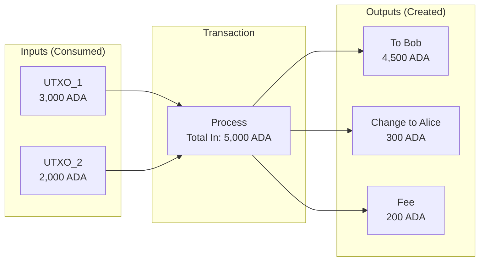
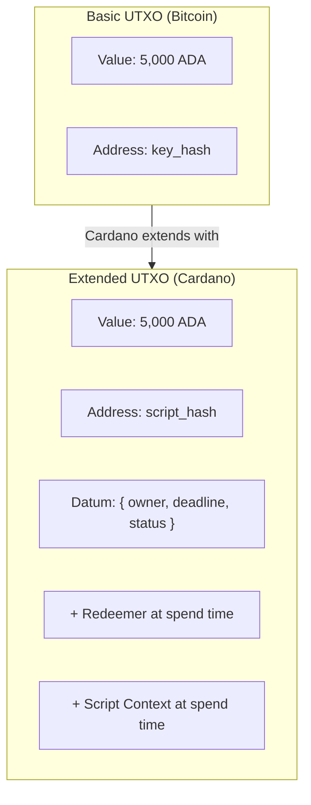

# Pelajaran #04: Model UTXO

Model UTXO (Unspent Transaction Output) adalah metode pelacakan kepemilikan di blockchain dengan mencatat "koin" diskrit yang tidak dapat diubah daripada saldo akun yang dapat diubah. Cardano memperluas model ini dengan datum, redeemer, dan konteks skrip untuk memungkinkan smart contract sambil mempertahankan determinisme dan paralelisme. Pelajaran ini menjelaskan bagaimana UTXO bekerja, mengapa Cardano memilih model ini, dan bagaimana berpikir dalam eUTXO sebagai pengembang.

Setiap blockchain membutuhkan cara untuk melacak siapa memiliki apa. Ada dua pendekatan yang secara fundamental berbeda: **model akun** (digunakan oleh Ethereum) dan **model UTXO** (digunakan oleh Bitcoin dan, dalam bentuk yang diperluas, oleh Cardano). Ini bukan detail implementasi minor; ia membentuk cara Anda berpikir tentang transaksi, cara Anda mendesain smart contract, dan jaminan apa yang dapat diberikan protokol kepada Anda.

## Bagaimana Model Akun Bekerja?

Model akun bekerja seperti rekening bank: setiap alamat memiliki saldo yang dapat diubah, dan transaksi memperbarui saldo secara langsung dengan mendebit pengirim dan mengkredit penerima. Jika Anda pernah bekerja dengan basis data atau Ethereum, Anda sudah memahami model ini secara intuitif.

```
State Akun (seperti baris basis data):

| Alamat             | Saldo      |
|--------------------|------------|
| addr_alice         | 5.000 ADA  |
| addr_bob           | 3.000 ADA  |
| addr_charlie       | 1.500 ADA  |

Transaksi: Alice mengirim 1.000 ADA ke Bob

UPDATE accounts SET balance = balance - 1000 WHERE address = 'addr_alice';
UPDATE accounts SET balance = balance + 1000 WHERE address = 'addr_bob';

Hasil:
| Alamat             | Saldo      |
|--------------------|------------|
| addr_alice         | 4.000 ADA  |
| addr_bob           | 4.000 ADA  |
| addr_charlie       | 1.500 ADA  |
```

Ini familiar. Pada dasarnya ini adalah buku besar yang dapat diubah di mana saldo diperbarui secara langsung. Tetapi kesederhanaan ini memiliki tantangan dalam konteks terdesentralisasi:

- **Kontensi state**: Dua transaksi yang memodifikasi akun yang sama harus diserialisasi. Mereka tidak dapat dieksekusi secara paralel dengan aman.
- **Non-determinisme**: Hasil transaksi mungkin bergantung pada transaksi lain yang dieksekusi sebelumnya. Anda tidak dapat mengetahui hasilnya sampai waktu eksekusi.
- **Ketergantungan state global**: Smart contract sering membaca dan menulis state global bersama, menciptakan dependensi yang kompleks.

## Bagaimana Model UTXO Melacak Kepemilikan?

Model UTXO melacak kepemilikan melalui "koin" diskrit yang tidak dapat diubah (output transaksi yang belum dibelanjakan dari transaksi sebelumnya) daripada saldo yang dapat diubah. Ketika Anda membelanjakan, Anda mengonsumsi seluruh UTXO sebagai input dan membuat UTXO baru sebagai output, menerima "kembalian" ke diri sendiri, mirip dengan membayar menggunakan uang tunai fisik.

### Analogi Uang Tunai Fisik

Analogi terbaik adalah uang tunai fisik. Ketika Anda memiliki 50 dolar, Anda tidak memiliki "saldo 50" yang abstrak; Anda memiliki lembaran uang tertentu (mungkin dua lembar 20 dan satu lembar 10). Ketika Anda membeli sesuatu seharga 25 dolar, Anda memberikan lembar 20 dan 10 (memberikan 30), dan Anda menerima kembalian 5 dolar.

UTXO bekerja dengan cara yang sama:



```
UTXO Alice (dompetnya):
  UTXO_1: 3.000 ADA  (diterima dari transaksi sebelumnya tx_abc, output #0)
  UTXO_2: 2.000 ADA  (diterima dari transaksi sebelumnya tx_def, output #1)

Total: 5.000 ADA (tetapi disimpan sebagai dua UTXO terpisah)

Alice ingin mengirim 4.500 ADA ke Bob:

Transaksi:
  INPUT:                         OUTPUT:
  +-----------+               +-----------+
  | UTXO_1    | 3.000 ADA    | Ke Bob    | 4.500 ADA   (UTXO baru untuk Bob)
  | UTXO_2    | 2.000 ADA    | Ke Alice  |   300 ADA   (kembalian ke Alice)
  +-----------+               +-----------+
  Total masuk: 5.000 ADA     | Biaya     |   200 ADA   (biaya transaksi)
                              Total keluar: 5.000 ADA

Setelah transaksi:
  UTXO_1: TERPAKAI (dihancurkan, tidak ada lagi)
  UTXO_2: TERPAKAI (dihancurkan, tidak ada lagi)
  UTXO_3: 4.500 ADA milik Bob (baru dibuat)
  UTXO_4:   300 ADA milik Alice (baru dibuat, ini adalah "kembalian")
```

Pengamatan utama:

1. **UTXO dikonsumsi seluruhnya**. Anda tidak dapat membelanjakan UTXO secara parsial. Jika Anda memiliki UTXO 3.000 ADA dan ingin mengirim 1.000 ADA, Anda mengonsumsi seluruh UTXO 3.000 ADA dan membuat dua output baru: 1.000 ADA ke penerima dan 2.000 ADA kembali ke diri sendiri sebagai kembalian.

2. **Input selalu sama dengan output ditambah biaya**. Setiap transaksi harus seimbang. Jumlah semua UTXO input harus sama dengan jumlah semua UTXO output ditambah biaya transaksi. Protokol menegakkan ini.

3. **UTXO tidak dapat diubah**. Setelah dibuat, UTXO tidak pernah berubah. Ia ada (belum dibelanjakan) atau tidak ada (sudah dibelanjakan). Tidak ada operasi UPDATE; hanya CREATE (sebagai output transaksi) dan CONSUME (sebagai input transaksi).

4. **Setiap UTXO hanya dapat dibelanjakan sekali**. Inilah cara pencegahan pengeluaran ganda (double-spending). Setelah UTXO muncul sebagai input transaksi yang dikonfirmasi, ia ditandai sebagai terpakai dan tidak dapat digunakan lagi.

### Apa Itu UTXO Set?

**UTXO set** adalah kumpulan lengkap semua output transaksi yang belum dibelanjakan pada titik waktu mana pun. Ia merepresentasikan state blockchain saat ini.

```
UTXO Set (disederhanakan):

| TxId:Index | Alamat      | Nilai     |
|------------|-------------|-----------|
| tx_01:#0   | addr_alice  | 300 ADA   |
| tx_02:#0   | addr_bob    | 4.500 ADA |
| tx_03:#0   | addr_charlie| 1.500 ADA |
| tx_03:#1   | addr_dave   | 750 ADA   |
| ...        | ...         | ...       |
```

Setiap UTXO diidentifikasi secara unik oleh **ID transaksi** yang membuatnya dan **indeks output**-nya dalam transaksi tersebut. Pasangan (TxId, Index) ini disebut **referensi output transaksi** (TxOutRef).

Di mainnet Cardano, UTXO set berisi jutaan entri. Full node memelihara set ini di memori untuk validasi cepat.

## Apa Itu Model Extended UTXO (eUTXO)?

Model Extended UTXO menambahkan tiga komponen ke konsep UTXO asli Bitcoin: **datum** (data arbitrer yang dilampirkan ke UTXO), **redeemer** (argumen yang diberikan saat membelanjakan), dan **konteks skrip** (pandangan komprehensif seluruh transaksi). Ekstensi-ekstensi ini memungkinkan smart contract sambil mempertahankan determinisme dan paralelisme UTXO.



### 1. Datum: Melampirkan Data ke UTXO

Dalam eUTXO, setiap output dapat membawa data arbitrer yang disebut **datum**. Bayangkan sebagai state yang dilampirkan ke UTXO tertentu.

```
Extended UTXO:
+---------------------------+
| Value:  5.000 ADA         |
| Address: script_addr_xyz  |  <- dikunci oleh skrip, bukan kunci
| Datum: {                  |  <- data arbitrer dilampirkan ke UTXO ini
|   owner: "alice",         |
|   deadline: 1740000000,   |
|   status: "active"        |
| }                         |
+---------------------------+
```

Datum adalah jawaban Cardano untuk "di mana smart contract menyimpan state-nya?" Dalam model akun (Ethereum), state disimpan di penyimpanan kontrak (penyimpanan key-value yang dapat diubah). Dalam eUTXO, state berada di dalam UTXO itu sendiri. Untuk memperbarui state, Anda mengonsumsi UTXO dan membuat yang baru dengan data yang diperbarui.

Cardano mendukung dua mode penyimpanan datum:
- **Hash datum**: Hanya hash datum yang disimpan di on-chain. Datum aktual diberikan ketika UTXO dibelanjakan. Ini menghemat ruang on-chain.
- **Inline datum**: Datum lengkap disimpan langsung di on-chain dalam UTXO. Ini memudahkan transaksi lain untuk membaca datum tanpa koordinasi off-chain.

### 2. Redeemer: Memberikan Input ke Skrip

Ketika Anda membelanjakan UTXO yang dikunci oleh skrip, Anda memberikan **redeemer**: argumen yang digunakan skrip untuk menentukan apakah pembelanjaan diizinkan.

```
Membelanjakan UTXO yang dikunci skrip:

Input:
  UTXO yang dibelanjakan: tx_01:#0 (dikunci oleh script_addr_xyz)
  Redeemer: { action: "claim", proof: "abc123" }

Skrip validator menerima:
  - Datum:    { owner: "alice", deadline: 1740000000, status: "active" }
  - Redeemer: { action: "claim", proof: "abc123" }
  - Context:  (informasi tentang seluruh transaksi)

Skrip mengevaluasi dan mengembalikan:
  True  -> transaksi valid, UTXO dapat dibelanjakan
  False -> transaksi TIDAK VALID, ditolak oleh jaringan
```

### 3. Konteks Skrip: Kesadaran Transaksi

Skrip validator juga menerima **konteks skrip**: pandangan komprehensif seluruh transaksi, termasuk semua input, semua output, biaya, rentang validitas, penandatangan, dan lainnya.

Ini sangat kuat. Skrip dapat menegakkan kondisi kompleks seperti:

- "UTXO ini hanya dapat dibelanjakan jika transaksi juga mengirim 100 ADA ke alamat X"
- "UTXO ini hanya dapat dibelanjakan setelah slot 50.000.000"
- "UTXO ini hanya dapat dibelanjakan jika transaksi membuat output baru di alamat skrip yang sama dengan datum yang diperbarui"

Pola terakhir adalah fondasi **smart contract stateful** dalam eUTXO. Skrip menegakkan bahwa state-nya sendiri dipropagasi dengan benar.

## Bagaimana Transaksi eUTXO Lengkap Bekerja?

Interaksi smart contract eUTXO lengkap mengonsumsi UTXO yang dikunci skrip dengan redeemer, validator on-chain memeriksa kondisi (datum, redeemer, dan konteks skrip), dan jika validasi berhasil, transaksi menghasilkan UTXO baru dengan state yang diperbarui. Berikut contoh konkret.

```
Skenario: Alice mengunci 1.000 ADA dalam kontrak vesting.
          Kontrak melepaskan dana setelah slot tertentu.

SEBELUM:
  Script UTXO (di vesting_script_addr):
    Value: 1.000 ADA
    Datum: { beneficiary: addr_alice, release_slot: 50000000 }

  UTXO Alice (di addr_alice):
    Value: 10 ADA  (untuk biaya)

TRANSAKSI:
  Input:
    [1] Script UTXO (vesting_script_addr, tx_old:#0)
        Redeemer: { action: "withdraw" }
    [2] UTXO biaya Alice (addr_alice, tx_fee:#0)

  Output:
    [1] Ke addr_alice: 1.000 ADA  (dana vesting)
    [2] Ke addr_alice: 8 ADA      (kembalian dari UTXO biaya)

  Biaya: 2 ADA
  Interval validitas: [50000000, infinity)  <- valid hanya setelah slot pelepasan

VALIDASI SKRIP:
  Skrip vesting memeriksa:
    1. Apakah slot saat ini >= datum.release_slot? YA (ditegakkan oleh interval validitas)
    2. Apakah transaksi membayar ke datum.beneficiary? YA (output #1 pergi ke addr_alice)
    3. Apakah transaksi ditandatangani oleh datum.beneficiary? YA (Alice menandatanganinya)
  Hasil: TRUE -> transaksi valid

SETELAH:
  Script UTXO: TERPAKAI (dihancurkan)
  UTXO baru di addr_alice: 1.000 ADA (dana vesting)
  UTXO baru di addr_alice: 8 ADA (kembalian)
```

## Mengapa Validasi Transaksi Deterministik Penting?

Validasi deterministik berarti Anda dapat memprediksi secara tepat apa yang akan dilakukan transaksi sebelum mengirimkannya, karena transaksi eUTXO mereferensikan UTXO tertentu berdasarkan ID daripada membaca state global yang dapat berubah. Entah hasil yang persis diharapkan terjadi, atau transaksi gagal tanpa efek apa pun.

Dalam model akun, hasil transaksi bergantung pada state global yang mungkin berubah antara pembuatan dan eksekusi:

```
Model Akun (Ethereum):
  1. Alice membuat transaksi memanggil kontrak DEX
  2. Pada waktu pembuatan, harga adalah 100 TOKEN per ETH
  3. Antara pembuatan dan eksekusi, transaksi Bob mengubah harga ke 200
  4. Transaksi Alice dieksekusi pada harga yang lebih buruk (atau gagal)

  -> Hasilnya tidak dapat diprediksi pada waktu pembuatan
```

Dalam eUTXO, transaksi menentukan input tepat mereka (UTXO tertentu berdasarkan referensi):

```
Model eUTXO (Cardano):
  1. Alice membuat transaksi mengonsumsi UTXO_A dan UTXO_B
  2. Jika UTXO_A atau UTXO_B sudah dibelanjakan ketika transaksi
     mencapai validator, transaksi gagal begitu saja
  3. Jika mereka belum dibelanjakan, transaksi dieksekusi dengan persis
     state yang Alice lihat ketika ia membuatnya

  -> Hasilnya sepenuhnya dapat diprediksi. Entah hasil yang persis
     diharapkan terjadi, atau transaksi gagal tanpa efek apa pun.
```

Determinisme ini berarti:

- **Tidak ada biaya kejutan**: Anda tahu biaya pasti sebelum mengirim.
- **Tidak ada front-running**: Transaksi lain tidak dapat memanipulasi state yang dilihat transaksi Anda (mereka hanya dapat menyebabkan transaksi Anda gagal, bukan dieksekusi dengan hasil berbeda).
- **Validasi off-chain**: Anda dapat menjalankan logika validasi yang persis sama secara lokal yang akan dijalankan blockchain, mengonfirmasi keberhasilan sebelum membayar biaya.
- **Pengembalian biaya saat gagal**: Jika transaksi gagal validasi Fase 1 (pemeriksaan struktural), tidak ada biaya yang dikenakan. Hanya kegagalan Fase 2 (kegagalan eksekusi skrip) yang mengonsumsi biaya.

## Bagaimana Konkurensi Bekerja dalam Model eUTXO?

Konkurensi dalam eUTXO memerlukan desain eksplisit karena dua transaksi tidak dapat mengonsumsi UTXO yang sama secara bersamaan; hanya satu yang berhasil dan yang lain gagal. Komunitas Cardano telah mengembangkan beberapa pola (fan-out UTXO, batching, input referensi) untuk menangani trade-off ini secara efektif.

```
Skenario bermasalah:
  Script UTXO di DEX: { price: 100, liquidity: 10000 }

  Tx Alice: konsumsi UTXO DEX, beli 100 token
  Tx Bob:   konsumsi UTXO DEX, beli 50 token

  Hanya SATU yang dapat berhasil. Yang lain mereferensikan UTXO yang sudah terpakai.
```

Ini berbeda dengan model akun, di mana kedua transaksi akan diserialisasi dan keduanya dapat berhasil (meskipun dengan potensi perubahan state di antaranya).

### Solusi Konkurensi Apa yang Ada?

**1. Beberapa UTXO (fan-out UTXO)**

Alih-alih satu UTXO memegang semua likuiditas, distribusikan state ke banyak UTXO:

```
Alih-alih:
  [UTXO tunggal: 10.000 ADA likuiditas]

Gunakan:
  [UTXO_1: 1.000 ADA]  [UTXO_2: 1.000 ADA]  [UTXO_3: 1.000 ADA]
  [UTXO_4: 1.000 ADA]  [UTXO_5: 1.000 ADA]  ... (10 UTXO)

Sekarang 10 pengguna dapat bertransaksi secara bersamaan, masing-masing mengonsumsi UTXO berbeda.
```

**2. Batching (pola buku order)**

Pengguna mengirimkan order sebagai UTXO individual. Batcher mengumpulkan beberapa order dan mengeksekusinya dalam satu transaksi:

```
Langkah 1: Pengguna mengirimkan order sebagai UTXO
  [Order: Alice beli 100 TOKEN]  [Order: Bob beli 50 TOKEN]  [Order: Carol jual 200 TOKEN]

Langkah 2: Batcher membangun satu transaksi yang:
  - Mengonsumsi semua UTXO order
  - Mengonsumsi UTXO likuiditas DEX
  - Menghasilkan output yang diselesaikan untuk setiap pengguna
  - Menghasilkan UTXO DEX baru dengan state yang diperbarui

Tidak ada kontensi: setiap pengguna hanya membuat UTXO mereka sendiri.
```

Ini adalah pola yang digunakan oleh sebagian besar DEX Cardano (SundaeSwap, Minswap, WingRiders).

**3. Input referensi (CIP-31)**

Cardano memungkinkan transaksi untuk **mereferensikan** UTXO tanpa mengonsumsinya. Jika transaksi hanya perlu membaca data dari UTXO (bukan memodifikasinya), ia dapat menggunakan input referensi. Beberapa transaksi dapat mereferensikan UTXO yang sama secara bersamaan.

```
UTXO Oracle: { price_feed: 1.50, timestamp: 1740000000 }

Tx Alice: REFERENSI UTXO Oracle (baca harga, tidak mengonsumsi)
Tx Bob:   REFERENSI UTXO Oracle (baca harga, tidak mengonsumsi)
Tx Carol: REFERENSI UTXO Oracle (baca harga, tidak mengonsumsi)

Ketiga transaksi dapat diproses dalam blok yang sama.
UTXO Oracle tetap belum terpakai.
```

**4. Skrip referensi (CIP-33)**

Kode skrip itu sendiri dapat disimpan dalam UTXO dan direferensikan oleh transaksi, daripada menyertakan skrip lengkap di setiap transaksi. Ini mengurangi ukuran dan biaya transaksi sambil memungkinkan berbagi skrip.

## Bagaimana Token Native Bekerja dalam Model eUTXO?

Di Cardano, token kustom (fungible dan non-fungible) bersifat **native**: mereka berada di dalam UTXO bersama ADA pada tingkat protokol, bukan di dalam smart contract. Ini berarti token mewarisi semua properti keamanan ADA itu sendiri, tanpa memerlukan eksekusi smart contract untuk transfer dasar.

```
UTXO Cardano dapat membawa beberapa aset:

UTXO:
+----------------------------------------------+
| Address: addr_alice                           |
| Value:                                        |
|   ADA: 5.000.000 lovelace (5 ADA)           |
|   PolicyID_abc.TokenA: 1.000 unit            |
|   PolicyID_abc.TokenB: 500 unit              |
|   PolicyID_def.MyNFT: 1 unit                |
+----------------------------------------------+
```

Ini disebut **nilai multi-aset** atau **bundel nilai**. Satu UTXO dapat menyimpan ADA ditambah jumlah token native berbeda yang tidak terbatas.

Penting: setiap UTXO di Cardano harus berisi jumlah minimum ADA (persyaratan **min-UTXO**, saat ini kira-kira 1-2 ADA tergantung ukuran UTXO). Ini mencegah spam dengan membuat pembuatan banyak UTXO kecil menjadi mahal dan memastikan bahwa UTXO set tidak tumbuh tak terkendali.

### Apa Itu ADA dan Lovelace?

ADA adalah mata uang native Cardano. Unit terkecil adalah **lovelace**, dinamai dari Ada Lovelace:

```
1 ADA = 1.000.000 lovelace

Semua nilai on-chain didenominasi dalam lovelace.
Ketika transaksi menentukan biaya 200.000 lovelace, itu adalah 0,2 ADA.
```

Ini analog dengan bagaimana Ethereum menggunakan wei (1 ETH = 10^18 wei) atau bagaimana keuangan tradisional menggunakan sen (1 USD = 100 sen), meskipun dengan lebih banyak tempat desimal.

## Bagaimana Model UTXO dan Akun Dibandingkan?

Kedua model membuat trade-off yang secara fundamental berbeda. Model akun lebih mudah dipikirkan untuk aplikasi stateful. Model eUTXO memberikan jaminan lebih kuat tentang hasil transaksi dan memungkinkan lebih banyak paralelisme. Tidak ada yang secara objektif "lebih baik."

| Aspek | Model Akun (Ethereum) | Model eUTXO (Cardano) |
|---|---|---|
| **Representasi state** | Saldo akun yang dapat diubah | UTXO yang tidak dapat diubah, dikonsumsi dan dibuat |
| **State smart contract** | Slot penyimpanan yang dapat diubah | Datum yang dilampirkan ke UTXO |
| **Paralelisme** | Dibatasi oleh state bersama | Paralelisme alami (UTXO berbeda) |
| **Determinisme** | Non-deterministik (state mungkin berubah) | Deterministik (input adalah UTXO tertentu) |
| **Validasi transaksi** | Eksekusi untuk menemukan hasilnya | Validasi off-chain dengan kepastian |
| **Konkurensi** | Implisit (diserialisasi oleh EVM) | Eksplisit (pemilihan UTXO) |
| **Kompleksitas dompet** | Sederhana (baca saldo) | Lebih kompleks (kelola UTXO set) |
| **Prediktabilitas biaya** | Perkiraan (estimasi gas) | Tepat (eksekusi deterministik) |
| **Token native** | Kontrak ERC-20 (kode) | Tingkat protokol (tidak perlu kontrak) |

## Bagaimana Pengembang Harus Berpikir dalam eUTXO?

Untuk pengembang web2 yang beralih ke Cardano, berikut kerangka kerja untuk "berpikir dalam eUTXO":

1. **State berada di UTXO, bukan di variabel**. Alih-alih variabel `balance` yang dapat diubah, Anda memiliki sekumpulan wadah nilai yang diskrit.

2. **Transisi state mengonsumsi dan membuat UTXO**. Alih-alih `balance -= 100`, Anda mengonsumsi UTXO dan membuat yang baru. Setiap perubahan state adalah siklus pembuatan-penghancuran.

3. **Transaksi adalah fungsi atomik**. Transaksi mengambil sekumpulan UTXO sebagai input dan menghasilkan sekumpulan UTXO sebagai output. Ia adalah fungsi murni tanpa efek samping. Jika ada bagian yang gagal, tidak ada yang dieksekusi.

4. **Konkurensi adalah tentang pemilihan UTXO, bukan penguncian**. Alih-alih mengunci baris di basis data, Anda memilih UTXO tertentu. Jika orang lain sudah membelanjakan UTXO tersebut, Anda mencoba lagi dengan input berbeda.

5. **Skrip adalah validator, bukan eksekutor**. Skrip Plutus tidak "melakukan sesuatu"; mereka memvalidasi bahwa transaksi memenuhi kondisi. Pembangun transaksi membangun transisi state; skrip hanya memeriksa bahwa ia legal.

## Analogi Web2

| Konsep eUTXO | Padanan Web2 | Perbedaan Utama |
|---|---|---|
| **UTXO** | Kartu hadiah / voucher prabayar | Anda membelanjakan seluruhnya dan mendapat kembalian, daripada mengurangi saldo |
| **UTXO set** | Log peristiwa yang tidak dapat diubah (event sourcing) | State saat ini diturunkan dari kumpulan output yang belum terpakai, bukan dari penyimpanan yang dapat diubah |
| **Transaksi (konsumsi + buat)** | INSERT yang tidak dapat diubah dalam event sourcing | Tidak pernah UPDATE; buat event baru yang menggantikan yang lama |
| **Datum** | Snapshot state yang dilampirkan ke event | State eksplisit dan berada bersama nilai yang digambarkannya |
| **Redeemer** | Argumen fungsi / body permintaan API | Memberitahu validator tindakan apa yang dimaksud pengguna |
| **Validasi skrip** | Middleware / pemeriksaan otorisasi | Memvalidasi bahwa permintaan memenuhi kebijakan; tidak mengeksekusi logika bisnis sendiri |
| **Output kembalian** | Pengembalian / kelebihan pembayaran | Ketika Anda membayar Rp30.000 dengan uang Rp50.000, Anda mendapat kembalian Rp20.000 |
| **Determinisme transaksi** | Fungsi murni (tanpa efek samping) | Diberikan input yang sama, selalu output yang sama (seperti fungsi murni dalam pemrograman fungsional) |
| **Kontensi UTXO** | Kontrol konkurensi optimistik | Seperti penguncian optimistik basis data: coba, dan coba lagi jika orang lain memodifikasi barisnya |
| **Input referensi** | Read replica basis data / cache | Membaca state tanpa mengunci atau memodifikasinya |
| **Min-UTXO (deposit ADA)** | Saldo minimum akun / deposit penyimpanan | Mencegah spam dengan mengharuskan nilai nyata di balik setiap entri state |

**Analogi event sourcing sangat kuat.** Dalam event sourcing:
- State diturunkan dari log peristiwa yang tidak dapat diubah
- Anda tidak pernah memodifikasi peristiwa masa lalu
- State saat ini adalah proyeksi semua peristiwa
- State baru dibuat dengan menambahkan peristiwa baru

Dalam eUTXO:
- State adalah kumpulan semua output yang belum terpakai
- Anda tidak pernah memodifikasi UTXO yang ada
- State saat ini adalah UTXO set (semua output yang belum terpakai)
- State baru dibuat dengan mengonsumsi UTXO dan menghasilkan yang baru

Jika Anda pernah menggunakan pola event sourcing atau CQRS, eUTXO akan terasa alami.

**Analogi pemrograman fungsional** juga membantu. Transaksi seperti fungsi murni: mereka mengambil input eksplisit, menghasilkan output eksplisit, dan tidak memiliki efek samping tersembunyi. Model eUTXO pada dasarnya adalah pendekatan fungsional untuk akuntansi buku besar, yang bukan kebetulan; bahasa smart contract Cardano (Plutus, Aiken) berakar pada pemrograman fungsional.

## Poin-Poin Penting

- **Model UTXO melacak "koin" diskrit** (output transaksi yang belum dibelanjakan) daripada saldo akun. UTXO dikonsumsi seluruhnya dan yang baru dibuat, mirip dengan membelanjakan uang tunai fisik dan menerima kembalian.
- **eUTXO Cardano memperluas UTXO dasar** dengan datum (state), redeemer (argumen tindakan), dan konteks skrip (kesadaran transaksi), memungkinkan smart contract sambil mempertahankan manfaat UTXO.
- **Determinisme adalah kekuatan super eUTXO**: hasil transaksi sepenuhnya dapat diprediksi sebelum pengiriman, menghilangkan front-running dan memungkinkan perhitungan biaya yang tepat.
- **Konkurensi memerlukan desain eksplisit** dalam eUTXO. Pola seperti fan-out UTXO, batching, dan input referensi menyelesaikan kontensi, dan sebagian besar protokol Cardano yang matang menggunakan pola-pola ini secara efektif.
- **Token native berada bersama ADA dalam UTXO**, mewarisi semua properti keamanan tingkat protokol tanpa memerlukan smart contract untuk operasi dasar.

## Selanjutnya

Anda sekarang memahami bagaimana Cardano melacak nilai dan state. Tetapi kita telah secara santai merujuk pada "alamat" dan "kunci privat" tanpa menjelaskannya sepenuhnya. Pelajaran 5 melengkapi gambaran dengan mengeksplorasi dompet, kunci, dan alamat: lapisan identitas dan akses yang menghubungkan pengguna ke blockchain. Anda akan mempelajari bagaimana frasa mnemonik menghasilkan hierarki kunci, bagaimana alamat Cardano disusun, dan bagaimana semuanya terhubung kembali ke primitif kriptografi dan model UTXO dari pelajaran sebelumnya.
