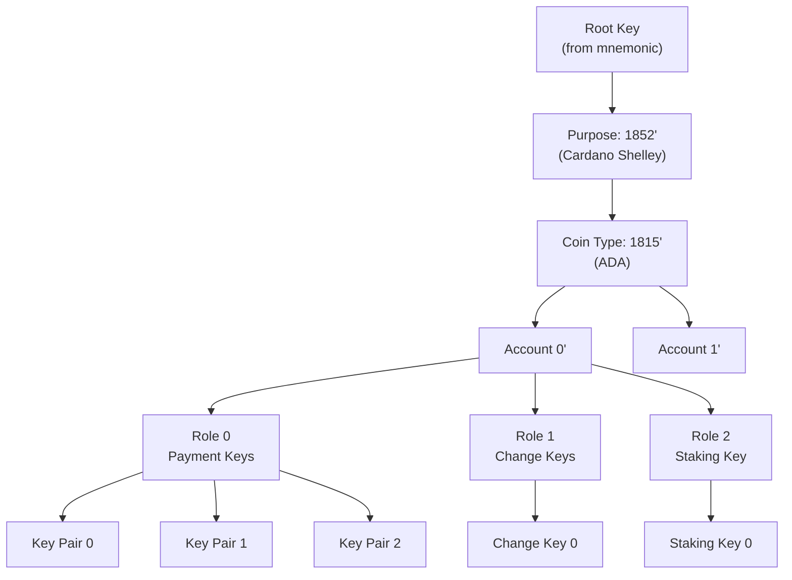
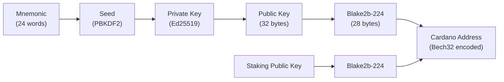

# Pelajaran #05: Dompet, Kunci, dan Alamat

Dompet, kunci, dan alamat membentuk lapisan identitas dan akses Cardano: frasa seed mnemonik menghasilkan pohon hierarkis pasangan kunci, kunci publik di-hash menjadi alamat yang mengunci UTXO, dan perangkat lunak dompet mengelola kompleksitas ini sehingga pengguna dapat mengirim, menerima, dan men-stake ADA. Pelajaran ini menghubungkan primitif kriptografi dari Pelajaran 2 dengan model UTXO dari Pelajaran 4 menjadi gambaran lengkap.

Memahami lapisan ini sangat penting bagi pengembang Cardano. Baik Anda membangun dApp, mengintegrasikan konektivitas dompet, atau mendesain alur transaksi, Anda perlu mengetahui bagaimana kunci, alamat, dan dompet bekerja bersama dan mengapa pendekatan Cardano berbeda dari blockchain lain.

## Apa Itu Pasangan Kunci dan Mengapa Ia Menjadi Fondasi Identitas?

Pasangan kunci terdiri dari kunci privat (32 byte entropi acak) dan kunci publik yang sesuai (diturunkan melalui Ed25519), dan membentuk fondasi identitas di Cardano karena siapa pun yang memegang kunci privat dapat menandatangani transaksi dan membelanjakan dana di alamat yang sesuai. Tidak ada alur "lupa kata sandi," tidak ada layanan pelanggan, dan tidak ada mekanisme pemulihan selain kunci itu sendiri.

```
Pembangkitan Kunci:
  private_key = random_256_bits()          // 32 byte entropi
  public_key  = ed25519_derive(private_key) // 32 byte, terhubung secara matematis

Properti:
  - private_key -> public_key:  MUDAH (satu komputasi)
  - public_key -> private_key:  TIDAK LAYAK (akan memecahkan Ed25519)
  - sign(message, private_key): menghasilkan tanda tangan 64-byte
  - verify(message, signature, public_key): true/false
```

**Kunci privat adalah identitas Anda.** Siapa pun yang memegang kunci privat dapat membelanjakan dana di alamat yang sesuai.

**Kunci publik adalah identitas terverifikasi Anda.** Ia dapat dibagikan secara bebas. Orang lain menggunakannya untuk memverifikasi tanda tangan Anda dan untuk mengirim dana kepada Anda (melalui alamat yang diturunkan darinya).

## Mengapa Pasangan Kunci Mentah Tidak Praktis untuk Penggunaan Nyata?

Pasangan kunci mentah menciptakan masalah praktis serius: satu kunci per alamat membuat semua transaksi dapat dihubungkan secara sepele, mengelola ratusan kunci privat yang tidak terkait rawan kesalahan, mencadangkan ratusan kunci tidak praktis, dan kunci yang dikompromikan tidak menawarkan mekanisme rotasi. Solusi untuk semua masalah ini adalah **dompet Hierarchical Deterministic (HD)**.

1. **Satu kunci per alamat**: Jika Anda menggunakan kunci publik langsung sebagai alamat, semua transaksi Anda dapat dihubungkan secara sepele. Siapa pun dapat melihat seluruh riwayat keuangan Anda.

2. **Mimpi buruk manajemen kunci**: Pengguna aktif mungkin memiliki ratusan alamat untuk tujuan berbeda. Mengelola ratusan kunci privat yang tidak terkait rawan kesalahan dan berbahaya.

3. **Kompleksitas pencadangan**: Kehilangan satu kunci privat berarti kehilangan semua dana di alamat tersebut. Mencadangkan ratusan kunci tidak praktis.

4. **Tidak ada rotasi kunci**: Jika kunci dikompromikan, Anda tidak dapat memperbarui alamat. Anda harus membuat yang baru dan mentransfer semua dana.

## Bagaimana Frasa Seed Mnemonik Bekerja?

Frasa seed mnemonik (didefinisikan oleh BIP-39) adalah representasi yang dapat dibaca manusia dari 256 bit entropi acak, dikodekan sebagai 24 kata dari daftar 2048 kata yang terstandarisasi. Satu frasa ini secara deterministik menghasilkan seluruh pohon pasangan kunci, menjadikannya satu-satunya cadangan yang diperlukan untuk identitas Cardano Anda yang lengkap.

```
Contoh mnemonik 24 kata (JANGAN DIGUNAKAN; ini hanya ilustrasi):

  1. abandon   7. carbon   13. glance   19. pottery
  2. ability   8. detect   14. harvest  20. rabbit
  3. abstract  9. emerge   15. isolate  21. serial
  4. across   10. filter   16. jungle   22. timber
  5. blanket  11. flight   17. kitchen  23. urban
  6. burst    12. gauge    18. obvious  24. vendor
```

Cara kerjanya:

```
Langkah 1: Bangkitkan entropi (bit acak)
  entropy = 256 bit acak (untuk frasa 24 kata)

Langkah 2: Hitung checksum
  checksum = 8 bit pertama dari SHA-256(entropy)

Langkah 3: Gabungkan
  combined = entropy + checksum = 264 bit

Langkah 4: Bagi menjadi kelompok 11-bit
  264 bit / 11 bit = 24 kelompok

Langkah 5: Petakan setiap kelompok ke kata dari daftar kata BIP-39
  Kelompok 1 (00000000000) -> "abandon" (kata #0)
  Kelompok 2 (00000000001) -> "ability" (kata #1)
  ... dan seterusnya untuk semua 24 kelompok

Daftar kata berisi tepat 2048 kata (2^11 = 2048).
```

**Mengapa 24 kata?** 24 kata mengkodekan 256 bit entropi. Jumlah frasa 24 kata yang mungkin adalah 2^256, yaitu kira-kira 1,16 x 10^77. Untuk perspektif, ada kira-kira 10^80 atom di alam semesta yang dapat diamati. Menebak frasa seed seseorang secara brute force bukan hanya tidak praktis; ia secara fisik tidak mungkin dengan teknologi apa pun yang bisa dibayangkan.

**Dompet Cardano biasanya menggunakan mnemonik 15 kata atau 24 kata.** Dompet era Shelley (Daedalus, Eternl, Lace) menggunakan 24 kata (entropi 256-bit). Beberapa dompet yang lebih ringan menggunakan 15 kata (entropi 160-bit), yang masih sangat aman secara astronomis.

### Bagaimana Mnemonik Menjadi Kunci Root?

Frasa mnemonik dikonversi menjadi seed kriptografis menggunakan PBKDF2 (Password-Based Key Derivation Function 2):

```
seed = PBKDF2(
  password: mnemonic_words_as_string,
  salt: "mnemonic" + optional_passphrase,
  iterations: 2048,
  key_length: 512 bits,
  hash: HMAC-SHA512
)
```

Seed 512-bit ini menjadi **kunci root** dari mana semua kunci lain diturunkan. Passphrase opsional menambahkan lapisan keamanan tambahan; 24 kata yang sama dengan passphrase berbeda menghasilkan dompet yang sepenuhnya berbeda. Beberapa pengguna menggunakannya sebagai "kata ke-25" untuk penyangkalan yang masuk akal atau keamanan tambahan.

## Bagaimana Dompet HD Menurunkan Kunci Tak Terbatas dari Satu Seed?

Dompet Hierarchical Deterministic (HD) (BIP-32) menggunakan struktur pohon untuk menurunkan jumlah pasangan kunci tak terbatas dari satu kunci root. Setiap kunci diturunkan secara deterministik dari induknya menggunakan fungsi derivasi satu arah, sehingga mnemonik saja cukup untuk membuat ulang setiap pasangan kunci yang pernah dihasilkan dompet.



```
Root Key (dari mnemonik)
+-- Purpose (1852' untuk dompet Cardano Shelley)
|   +-- Coin Type (1815' untuk ADA)
|       +-- Account 0'
|       |   +-- Role 0 (Eksternal/Pembayaran)
|       |   |   +-- Address Index 0 -> Key Pair 0
|       |   |   +-- Address Index 1 -> Key Pair 1
|       |   |   +-- Address Index 2 -> Key Pair 2
|       |   |   +-- ...
|       |   +-- Role 1 (Internal/Kembalian)
|       |   |   +-- Address Index 0 -> Key Pair 0
|       |   |   +-- ...
|       |   +-- Role 2 (Staking)
|       |       +-- Address Index 0 -> Staking Key Pair
|       +-- Account 1'
|           +-- Role 0 (Eksternal/Pembayaran)
|           |   +-- ...
|           +-- ...
```

### Bagaimana Jalur Derivasi Disusun?

Jalur derivasi ditulis sebagai:

```
m / purpose' / coin_type' / account' / role / address_index

Untuk Cardano:
m / 1852' / 1815' / 0' / 0 / 0

Di mana:
  m          = kunci root
  1852'      = purpose (Cardano era Shelley, CIP-1852)
  1815'      = tipe koin untuk ADA (terdaftar di SLIP-44)
  0'         = indeks akun (akun pertama)
  0          = role: 0=eksternal, 1=internal(kembalian), 2=staking
  0          = indeks alamat (alamat pertama di role ini)

Apostrof (') menunjukkan derivasi "hardened"; kunci anak
tidak dapat digunakan untuk menghitung kunci induk, bahkan dengan kunci publik.
```

Mengapa 1815? Ada Lovelace lahir pada tahun 1815. Mengapa 1852? Ada Lovelace meninggal pada tahun 1852, dan CIP-1852 mendefinisikan standar derivasi.

### Apa Saja Properti Utama Derivasi HD?

**Deterministik**: Diberikan kunci root dan jalur yang sama, Anda selalu mendapatkan kunci anak yang sama. Ini berarti mnemonik saja cukup untuk membuat ulang setiap pasangan kunci yang pernah dihasilkan dompet.

**Hierarkis**: Kunci membentuk pohon. Kunci tingkat akun independen; mengkompromikan satu akun tidak memengaruhi yang lain (karena derivasi hardened di tingkat akun).

**Inkremental**: Alamat baru dapat dibuat sesuai kebutuhan tanpa kembali ke seed. Dompet cukup menaikkan indeks alamat.

**Derivasi kunci publik**: Untuk level non-hardened, kunci publik anak dapat diturunkan dari kunci publik induk tanpa kunci privat. Ini memungkinkan dompet "hanya-baca" yang dapat membuat alamat dan melacak saldo tanpa kemampuan menandatangani transaksi.

## Jenis Alamat Apa yang Didukung Cardano?

Cardano mendukung beberapa jenis alamat (base, enterprise, reward, pointer, dan skrip), masing-masing melayani kasus penggunaan berbeda. Alamat Cardano bukan sekadar kunci publik yang di-hash; ia adalah tipe data terstruktur yang berisi byte header, kredensial pembayaran, dan kredensial delegasi opsional.



### Bagaimana Alamat Cardano Disusun?

```
Alamat Cardano (era Shelley):

+--------+-------------------+-------------------+
| Header | Bagian Pembayaran | Bagian Delegasi   |
| 1 byte | 28 byte           | 28 byte           |
+--------+-------------------+-------------------+

Byte header mengkodekan:
  - Jaringan (mainnet vs testnet)
  - Tipe alamat (menentukan apa yang mengikuti)

Bagian Pembayaran:
  - Hash kunci verifikasi pembayaran (key hash), ATAU
  - Hash skrip Plutus (script hash)

Bagian Delegasi (tergantung tipe alamat):
  - Hash kunci verifikasi staking, ATAU
  - Hash skrip staking, ATAU
  - Pointer ke sertifikat registrasi stake, ATAU
  - Tidak ada (alamat enterprise)
```

### Apa Itu Alamat Base?

Jenis alamat paling umum. Berisi kredensial pembayaran dan kredensial staking.

```
Alamat Base:
  Pembayaran: key_hash(payment_vk) atau script_hash(payment_script)
  Staking: key_hash(staking_vk) atau script_hash(staking_script)

Contoh (dikodekan Bech32):
  addr1qx2fxv2umyhttkxyxp8x0dlpdt3k6cwng5pxj3jhsydzer3jcu5d8ps7zex2k2xt3uqxgjqnnj83ws8lhrn648jjxtwq2ytjc7

Properti:
  - Dapat menerima ADA dan token native
  - Dapat berpartisipasi dalam staking (delegasi ke stake pool)
  - Mendapatkan hadiah staking
  - Jenis alamat yang paling umum digunakan untuk pengguna akhir
```

Prefiks `addr1` menunjukkan alamat base mainnet. Alamat testnet menggunakan `addr_test1`.

### Apa Itu Alamat Enterprise?

Alamat enterprise hanya berisi kredensial pembayaran tanpa komponen staking.

```
Alamat Enterprise:
  Pembayaran: key_hash atau script_hash
  Staking: TIDAK ADA

Contoh:
  addr1vx2fxv2umyhttkxyxp8x0dlpdt3k6cwng5pxj3jhsydzer3jcu5d8ps7zex2k2xt3uqxgjqnnj83ws8lhrn648jjxtwqr8jhvs

Properti:
  - Dapat menerima ADA dan token native
  - TIDAK DAPAT berpartisipasi dalam staking
  - TIDAK mendapatkan hadiah
  - Berguna untuk: exchange, smart contract, penyimpanan sementara
```

Alamat enterprise lebih pendek (tidak ada bagian delegasi) dan berguna ketika staking tidak diperlukan. Alamat smart contract sering berupa alamat enterprise.

### Apa Itu Alamat Reward?

Alamat reward (juga disebut alamat stake) digunakan secara eksklusif untuk menerima hadiah staking dan tidak dapat menerima transfer ADA reguler.

```
Alamat Reward:
  Staking: key_hash atau script_hash

Contoh:
  stake1uyehkck0lajq8gr28t9uxnuvgcqrc6070x3k9r8048z8y5gh6ffgw

Properti:
  - Menerima hadiah staking
  - Tidak dapat menerima transfer ADA reguler
  - Satu per kunci staking (biasanya satu per akun)
  - Hadiah ditarik melalui tipe transaksi khusus
```

### Apa Itu Alamat Pointer?

Alamat pointer mereferensikan sertifikat registrasi stake berdasarkan lokasinya di rantai (slot, indeks transaksi, indeks sertifikat) alih-alih berisi hash kunci stake lengkap.

```
Alamat Pointer:
  Pembayaran: key_hash atau script_hash
  Staking: pointer(slot, tx_index, cert_index)

Properti:
  - Lebih efisien ruang daripada alamat base
  - Secara fungsional setara dengan alamat base
  - Jarang digunakan dalam praktik karena kompleksitas
```

### Bagaimana Alamat Skrip Bekerja?

Ketika kredensial pembayaran adalah hash skrip (bukan hash kunci), alamat tersebut adalah **alamat skrip**. UTXO di alamat skrip hanya dapat dibelanjakan dengan memberikan redeemer valid yang memenuhi skrip (validator Plutus).

```
Alamat Skrip (untuk validator Plutus):
  Pembayaran: script_hash(compiled_plutus_script)
  Staking: opsional

Hash skrip dihitung:
  script_hash = blake2b_224(serialized_script)
```

Inilah cara smart contract "di-deploy" di Cardano. Anda tidak mengunggah kode ke lokasi tertentu. Sebaliknya, hash skrip menentukan alamatnya. Siapa pun yang mengompilasi skrip yang sama mendapat alamat yang sama. Skrip itu sendiri dapat disertakan dalam transaksi yang membelanjakan dari alamat tersebut (atau direferensikan melalui skrip referensi CIP-33).

### Apa Itu Encoding Bech32?

Semua alamat Cardano menggunakan encoding **Bech32**, yang menyediakan:

- **Prefiks yang dapat dibaca manusia**: `addr` untuk alamat pembayaran mainnet, `addr_test` untuk testnet, `stake` untuk alamat reward
- **Deteksi kesalahan**: Checksum bawaan mendeteksi kesalahan ketik
- **Tidak sensitif huruf besar-kecil**: `addr1QX...` dan `addr1qx...` adalah alamat yang sama
- **Tidak ada karakter ambigu**: Menghindari karakter yang membingungkan seperti 0/O dan 1/l/I

```
Format Bech32: prefix + "1" + data + checksum

addr1qx2fxv2umyhttkxyxp8x0dlpdt3k6cwng5pxj3jhsydzer3jcu5d8ps7zex...
|    | |                                                                |
prefix pemisah  data (byte alamat dikodekan dalam base32)          checksum
```

## Bagaimana Kunci, Alamat, dan UTXO Terhubung?

Alur lengkap dari mnemonik ke UTXO yang dapat dibelanjakan melacak melalui derivasi kunci, pembuatan alamat, pembuatan UTXO, dan penandatanganan transaksi. Setiap langkah menggunakan primitif kriptografi dari Pelajaran 2, dan hasil akhirnya adalah transaksi yang ditandatangani yang dapat diverifikasi jaringan.

```
1. PEMBUATAN MNEMONIK
   24 kata acak -> master seed

2. DERIVASI KUNCI (dompet HD, BIP-32/CIP-1852)
   master seed -> kunci root
   kunci root -> m/1852'/1815'/0'/0/0 -> payment_key_pair_0
   kunci root -> m/1852'/1815'/0'/2/0 -> staking_key_pair_0

3. PEMBUATAN ALAMAT
   payment_vk_hash = blake2b_224(payment_public_key_0)
   staking_vk_hash = blake2b_224(staking_public_key_0)
   address = base_address(network=mainnet, payment_vk_hash, staking_vk_hash)
   encoded = bech32_encode("addr", address)
   Hasil: addr1qx2fxv2umyhttkx...

4. MENERIMA DANA
   Seseorang mengirim 100 ADA ke addr1qx2fxv2umyhttkx...
   UTXO baru dibuat:
     UTXO { tx_id: "abc123", index: 0, address: addr1qx..., value: 100 ADA }

5. MEMBELANJAKAN DANA
   Untuk membelanjakan UTXO ini, Anda harus membuktikan kepemilikan kunci pembayaran:
   a. Bangun body transaksi (mengonsumsi UTXO, membuat output baru)
   b. Hash body transaksi: tx_hash = blake2b_256(tx_body)
   c. Tanda tangani: signature = ed25519_sign(tx_hash, payment_private_key_0)
   d. Sertakan witness: (payment_public_key_0, signature)
   e. Jaringan memverifikasi: ed25519_verify(tx_hash, signature, payment_public_key_0)
      DAN blake2b_224(payment_public_key_0) == kredensial pembayaran di alamat UTXO

6. STAKING
   Untuk mendelegasikan ke stake pool:
   a. Daftarkan kunci staking di on-chain (sekali, biaya deposit 2 ADA)
   b. Kirimkan sertifikat delegasi yang ditandatangani dengan staking_private_key_0
   c. Semua UTXO di alamat yang berbagi kredensial staking ini sekarang berkontribusi
      pada stake pool yang didelegasikan
```

## Apa Sebenarnya "Dompet" Itu?

Dompet adalah perangkat lunak yang menyimpan kunci privat Anda, memindai blockchain untuk UTXO di alamat Anda, menghitung saldo total, membangun dan menandatangani transaksi, serta menghasilkan alamat baru sesuai kebutuhan. Dana Anda ada di blockchain sebagai UTXO; mereka tidak "di dalam" aplikasi mana pun.

```
Yang "dilihat" dompet:

UTXO Set Blockchain:
  [UTXO_1: addr1_milik_saya, 50 ADA]    <- milik saya
  [UTXO_2: addr2_orang_lain, 100 ADA]  <- bukan milik saya
  [UTXO_3: addr3_milik_saya, 30 ADA]    <- milik saya
  [UTXO_4: addr4_orang_lain, 75 ADA]   <- bukan milik saya
  [UTXO_5: addr5_milik_saya, 20 ADA]    <- milik saya

Tampilan dompet:
  Saldo: 100 ADA (50 + 30 + 20)
  Alamat yang digunakan: 3
  UTXO: 3
```

### Jenis Dompet Cardano Apa yang Ada?

**Dompet full-node (Daedalus)**: Menjalankan `cardano-node` lengkap, mengunduh dan memverifikasi seluruh blockchain. Keamanan dan ketidakpercayaan maksimum. Memerlukan ruang disk signifikan dan waktu sinkronisasi.

**Dompet ringan (Eternl, Lace, Yoroi, Typhon, Flint)**: Terhubung ke layanan backend yang mengindeks blockchain. Tidak mengunduh seluruh rantai. Lebih cepat diatur, memerlukan lebih sedikit sumber daya, tetapi bergantung pada layanan backend untuk data blockchain (meskipun penandatanganan transaksi tetap terjadi secara lokal dengan kunci Anda).

**Dompet hardware (Ledger, Trezor)**: Menyimpan kunci privat di perangkat aman khusus. Kunci tidak pernah meninggalkan perangkat. Penandatanganan transaksi terjadi di dompet hardware. Ini memberikan perlindungan terkuat terhadap pencurian kunci.

**Dompet ekstensi browser**: Mengimplementasikan CIP-30 (Cardano dApp Connector), menyediakan API terstandarisasi untuk aplikasi web berinteraksi dengan dompet pengguna. Ini adalah cara utama dApp terhubung ke pengguna di Cardano.

```
API Dompet CIP-30 (konseptual):

// dApp meminta koneksi dompet
wallet = await cardano.eternl.enable()

// dApp meminta UTXO
utxos = await wallet.getUtxos()

// dApp membangun transaksi dan meminta dompet menandatangani
signed_tx = await wallet.signTx(unsigned_tx)

// dApp mengirimkan transaksi yang ditandatangani
tx_hash = await wallet.submitTx(signed_tx)
```

Dompet tidak pernah mengekspos kunci privat ke dApp. Ia hanya menandatangani apa yang disetujui pengguna secara eksplisit.

## Bagaimana Kunci Pembayaran dan Kunci Staking Berbeda?

Cardano secara sengaja memisahkan kunci pembayaran (yang mengendalikan pembelanjaan dana) dari kunci staking (yang mengendalikan delegasi dan penarikan hadiah). Pemisahan ini berarti Anda dapat mendelegasikan stake ke pool tanpa memberikan pool kemampuan untuk membelanjakan dana Anda.

```
Kunci Pembayaran (m/1852'/1815'/account'/0/index):
  - Mengendalikan pembelanjaan dana
  - Berbeda untuk setiap alamat (banyak kunci pembayaran per akun)
  - Mengkompromikan satu kunci pembayaran hanya memengaruhi UTXO di alamat tersebut

Kunci Staking (m/1852'/1815'/account'/2/0):
  - Mengendalikan delegasi dan penarikan hadiah
  - SATU per akun (dibagikan di semua alamat)
  - TIDAK mengendalikan pembelanjaan dana
  - Mengkompromikan kunci staking tidak dapat mencuri dana (hanya mengalihkan delegasi)
```

Pemisahan ini juga berarti bahwa semua UTXO di alamat pembayaran berbeda dalam akun yang sama berkontribusi pada satu delegasi stake. Anda tidak perlu mendelegasikan setiap alamat secara terpisah.

## Bagaimana Kepemilikan Multi-Tanda Tangan dan Berbasis Skrip Bekerja?

Cardano mendukung kepemilikan kompleks melalui skrip native dan skrip Plutus, memungkinkan alamat memerlukan beberapa tanda tangan, kondisi berbasis waktu, atau logika validasi arbitrer tanpa men-deploy smart contract untuk pola multi-tanda tangan dasar.

**Skrip native** (sederhana, dievaluasi tanpa Plutus):

```
Require All Of:
  - Tanda tangan dari key_hash_A
  - Tanda tangan dari key_hash_B
  - Tanda tangan dari key_hash_C

Require Any Of:
  - Tanda tangan dari key_hash_A
  - Tanda tangan dari key_hash_B

Require M of N:
  - Setidaknya 2 tanda tangan dari: [key_A, key_B, key_C]

Time-locked:
  - Valid setelah slot 50.000.000
  - Valid sebelum slot 60.000.000
```

Ini dapat dikombinasikan secara arbitrer:

```
Require All Of:
  - Require 2 of 3: [Alice, Bob, Carol]
  - Valid setelah slot 50.000.000

// Ini membuat multisig 2-dari-3 yang aktif setelah waktu tertentu.
// Berguna untuk: escrow, perbendaharaan perusahaan, DAO
```

**Skrip Plutus** menyediakan logika arbitrer untuk kondisi pembelanjaan UTXO, seperti dibahas di Pelajaran 4.

## Apa Saja Praktik Terbaik Keamanan untuk Manajemen Kunci?

Memahami arsitektur kunci membantu Anda memahami ancaman keamanan. Keamanan pada dasarnya bermuara pada manajemen kunci: lindungi frasa seed, isolasi kunci privat di hardware, praktikkan kebersihan alamat yang baik, dan selalu verifikasi transaksi di perangkat tepercaya.

**Keamanan frasa seed**:
- Jangan pernah simpan secara digital (tidak ada foto, tidak ada penyimpanan cloud, tidak ada file teks)
- Tulis di material tahan lama (pelat logam tahan api dan air)
- Simpan di beberapa lokasi fisik yang aman
- Pertimbangkan menggunakan passphrase opsional ("kata ke-25") sebagai faktor tambahan

**Isolasi kunci**:
- Dompet hardware menyimpan kunci privat di elemen aman yang tidak pernah mengeksposnya
- Dompet ekstensi browser mengenkripsi kunci dengan kata sandi pembelanjaan
- Dompet full node mengenkripsi file penyimpanan kunci

**Kebersihan alamat**:
- Dompet HD secara otomatis menghasilkan alamat baru, meningkatkan privasi
- Menggunakan ulang alamat membuat riwayat transaksi dapat dihubungkan
- Dompet Cardano biasanya menghasilkan alamat kembalian baru untuk setiap transaksi

**Verifikasi transaksi**:
- Selalu verifikasi detail transaksi di layar dompet hardware
- Perangkat lunak dompet bisa dikompromikan, tetapi dompet hardware menampilkan apa yang sebenarnya akan ditandatangani
- Dompet CIP-30 menampilkan ringkasan transaksi sebelum meminta persetujuan tanda tangan

## Analogi Web2

| Konsep Cardano | Padanan Web2 | Perbedaan Utama |
|---|---|---|
| **Kunci privat** | Kunci privat SSH atau kunci penandatanganan JWT | Kunci privat blockchain langsung mengendalikan uang, bukan hanya akses server |
| **Kunci publik** | Kunci publik SSH di `authorized_keys` | Kunci publik blockchain digunakan oleh seluruh jaringan, bukan satu server |
| **Frasa seed mnemonik** | Kata sandi utama di pengelola kata sandi | Frasa seed menghasilkan semua kunci secara deterministik; kata sandi utama hanya mendekripsi vault |
| **Jalur derivasi HD** | Pengelola kata sandi membuat kata sandi unik per situs | Keduanya menurunkan banyak kredensial dari satu rahasia; dompet HD menggunakan pohon matematis |
| **Alamat** | Alamat email | Keduanya adalah pengenal publik untuk menerima (dana / pesan); tetapi alamat email terikat pada penyedia layanan sementara alamat Cardano berdaulat sendiri |
| **Perangkat lunak dompet** | Browser web (menyimpan cookie, mengelola sesi) | Dompet mengelola kunci dan membangun transaksi, seperti browser mengelola sesi dan membangun permintaan HTTP |
| **Konektor dApp CIP-30** | OAuth 2.0 / OpenID Connect | Keduanya memungkinkan aplikasi meminta izin dari penyedia identitas pengguna (dompet / server OAuth) tanpa melihat kredensial mentah |
| **Dompet hardware** | Hardware security module (HSM) / YubiKey | Keduanya menyimpan kunci kriptografis di hardware tahan manipulasi; penandatanganan terjadi di perangkat |
| **Skrip native multi-tanda tangan** | Memerlukan beberapa persetujuan (mis. 2 manajer harus menyetujui deployment) | Ditegakkan protokol daripada ditegakkan kebijakan; blockchain sendiri menolak tanda tangan yang tidak valid |
| **Alamat base (pembayaran + staking)** | Alamat email dengan pengaturan profil terpisah | Satu pengenal untuk menerima; mekanisme terpisah untuk pengaturan tingkat akun (delegasi) |
| **Encoding Bech32** | Encoding Base64 URL-safe | Keduanya mengkodekan data biner untuk representasi ramah manusia dengan deteksi kesalahan |

**Analogi kunci SSH sangat tepat.** Sebagai pengembang, Anda sudah mengelola pasangan kunci SSH:

- Anda membuat pasangan kunci: `ssh-keygen -t ed25519` (algoritma yang sama dengan Cardano)
- Kunci privat tetap di mesin Anda (`~/.ssh/id_ed25519`)
- Kunci publik ditempatkan di server (`~/.ssh/authorized_keys`)
- Untuk autentikasi, Anda membuktikan Anda memegang kunci privat (tanda tangan digital)
- Jika seseorang mencuri kunci privat Anda, mereka dapat mengakses server Anda
- Anda dapat memiliki beberapa pasangan kunci untuk tujuan berbeda

Pasangan kunci Cardano bekerja secara identik, tetapi alih-alih autentikasi ke server, Anda autentikasi ke seluruh jaringan. Dan alih-alih mendapatkan akses server, Anda mendapatkan kemampuan untuk memindahkan nilai.

**Analogi OAuth/CIP-30** juga berguna untuk pengembang dApp. Ketika situs web menggunakan "Masuk dengan Google":
1. Situs web mengarahkan Anda ke Google (penyedia identitas)
2. Anda menyetujui izin yang diminta
3. Google mengirim kembali token (kredensial)
4. Situs web menggunakan token; ia tidak pernah melihat kata sandi Google Anda

Ketika dApp menggunakan CIP-30:
1. dApp memanggil `cardano.walletName.enable()`
2. Popup dompet meminta Anda menyetujui koneksi
3. Dompet menyediakan handle API
4. dApp dapat meminta tanda tangan; ia tidak pernah melihat kunci privat Anda

## Poin-Poin Penting

- **Frasa seed mnemonik adalah akar dari seluruh identitas Cardano Anda.** Dari 24 kata, jumlah pasangan kunci dan alamat tak terbatas diturunkan secara deterministik melalui standar dompet HD (BIP-32, BIP-39, CIP-1852).
- **Cardano memisahkan kunci pembayaran dari kunci staking**, memungkinkan Anda mendelegasikan stake tanpa mengekspos kredensial pembelanjaan. Ini adalah fitur keamanan fundamental yang unik untuk desain Cardano.
- **Cardano memiliki beberapa jenis alamat** (base, enterprise, reward, pointer), masing-masing melayani kasus penggunaan berbeda. Alamat base dengan kredensial pembayaran dan staking adalah yang paling umum untuk pengguna akhir.
- **Dompet adalah perangkat lunak, bukan wadah.** Dana Anda ada sebagai UTXO di blockchain. Dompet menyimpan kunci, memindai UTXO Anda, menghitung saldo, dan menandatangani transaksi.
- **Keamanan bermuara pada manajemen kunci.** Pencadangan frasa seed, dompet hardware, dan kebersihan alamat yang tepat adalah langkah-langkah praktis yang melindungi nilai nyata di jaringan.

## Selanjutnya

Selamat: Anda sekarang memiliki fondasi teoretis yang kokoh untuk memahami arsitektur blockchain Cardano. Anda memahami bagaimana blok disusun dan dihubungkan (Pelajaran 1), primitif kriptografi yang mengamankannya (Pelajaran 2), bagaimana jaringan mencapai konsensus tentang blok mana yang ditambahkan (Pelajaran 3), bagaimana nilai dan state dilacak dalam model eUTXO (Pelajaran 4), dan bagaimana identitas dan akses bekerja melalui kunci, alamat, dan dompet (pelajaran ini). Lima pelajaran ini membentuk fondasi konseptual untuk semua yang mengikuti dalam perjalanan pengembangan Cardano Anda, dari menulis smart contract Plutus dan Aiken hingga membangun dApp full-stack yang berinteraksi dengan rantai.
