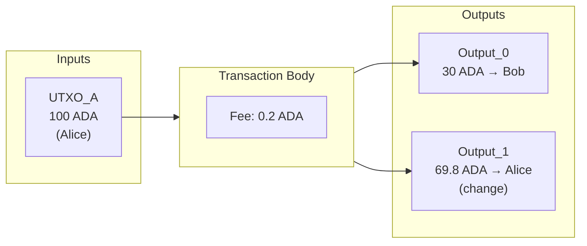
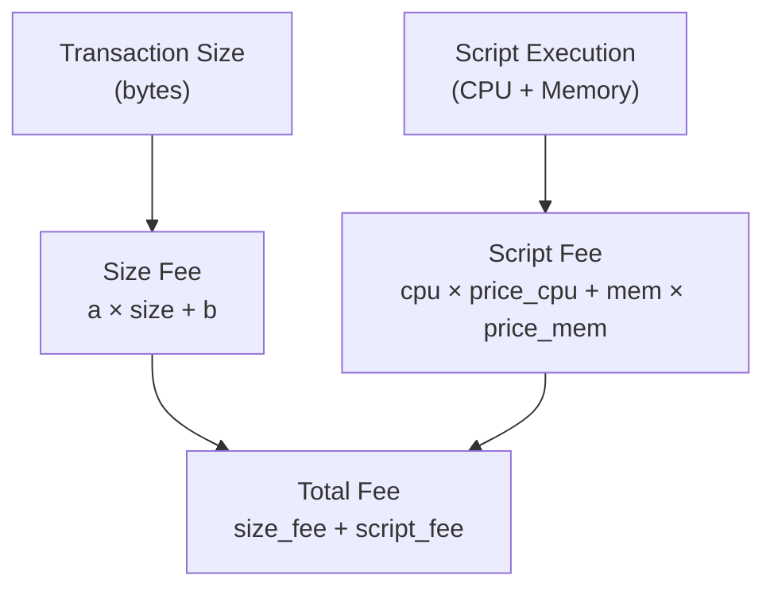
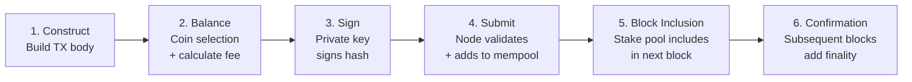

# Pelajaran #06: Transaksi

Transaksi Cardano adalah struktur data bertanda tangan yang mengonsumsi UTXO yang sudah ada sebagai input dan menghasilkan UTXO baru sebagai output, mentransfer nilai sesuai dengan aturan protokol. Setiap transfer nilai, setiap eksekusi smart contract, dan setiap pencetakan token dimulai dan diakhiri dengan sebuah transaksi. Di Cardano, model transaksi berbasis UTXO menawarkan cara yang sangat kuat dan dapat diprediksi untuk mengekspresikan perubahan state di seluruh ledger.

Dalam pelajaran ini, kita membedah anatomi transaksi Cardano dari dalam ke luar. Anda akan mempelajari bagaimana input dan output bekerja sama, mengapa biaya ada dan bagaimana Cardano menghitungnya, apa yang dapat dilakukan metadata, bagaimana interval validitas melindungi Anda, dan bagaimana semua ini diserialisasikan ke dalam format biner yang ringkas untuk jaringan.

## Apa Anatomi Transaksi Cardano?

Transaksi Cardano adalah struktur data mandiri yang mendeskripsikan perubahan yang diusulkan terhadap ledger. Setiap transaksi terdiri dari input (referensi ke UTXO yang ada untuk dikonsumsi), output (UTXO baru yang akan dibuat), biaya yang dibayarkan ke jaringan, dan witness (tanda tangan kriptografi yang membuktikan otorisasi).

Di luar hal-hal esensial ini, transaksi secara opsional dapat mencakup metadata, interval validitas, instruksi pencetakan, sertifikat, penarikan, dan lainnya. Mari kita mulai dengan dasar-dasarnya.



### Input Transaksi

Sebuah input bukanlah nilai itu sendiri; melainkan sebuah *pointer* ke UTXO yang sudah ada di ledger. Setiap input diidentifikasi oleh dua informasi:

- **Transaction hash**: Hash dari transaksi yang membuat UTXO tersebut.
- **Output index**: Posisi output spesifik dalam transaksi tersebut.

Bersama-sama, keduanya membentuk pengidentifikasi unik yang sering ditulis sebagai `tx_hash#index`. Misalnya, `a1b2c3...#0` merujuk pada output pertama dari transaksi dengan hash `a1b2c3...`.

Ketika sebuah transaksi menyertakan sebuah input, ia menyatakan: "Saya ingin mengonsumsi UTXO spesifik ini." Protokol memverifikasi bahwa UTXO tersebut ada, belum pernah dibelanjakan, dan bahwa transaksi tersebut menyediakan otorisasi yang tepat (tanda tangan yang valid dari private key pemilik, atau evaluasi script yang berhasil).

Bayangkan input seperti cek yang dicairkan. Cek (UTXO) ditulis pada suatu waktu di masa lalu, dan sekarang Anda menyerahkannya ke bank (jaringan) untuk mengubahnya menjadi sesuatu yang baru.

### Output Transaksi

Setiap output dalam transaksi membuat UTXO baru di ledger. Sebuah output menentukan:

- **Address**: Ke mana nilai dikirim (alamat pembayaran, alamat script, dll.).
- **Value**: Berapa banyak ADA (dalam lovelace) dan/atau native token lainnya yang dimiliki output tersebut.
- **Datum opsional**: Data yang dilampirkan pada output, terutama digunakan dengan smart contract.

Satu transaksi dapat membuat beberapa output. Inilah cara Anda "memberikan kembalian." Jika Anda memiliki UTXO senilai 100 ADA dan ingin mengirim 30 ADA ke seseorang, transaksi Anda akan memiliki dua output: satu mengirim 30 ADA ke penerima, dan satu lagi mengirim sekitar 70 ADA kembali ke Anda sendiri (dikurangi biaya).

Aturan fundamentalnya adalah: **jumlah semua nilai input harus sama dengan jumlah semua nilai output ditambah biaya.** Ini adalah konservasi nilai; ADA tidak dapat dibuat atau dihancurkan dalam transaksi normal (pencetakan adalah mekanisme terpisah dengan aturannya sendiri).

### Persamaan Penyeimbangan

```
Sum(Inputs) = Sum(Outputs) + Fee
```

Persamaan ini harus berlaku dengan tepat. Bukan kira-kira; *tepat*. Jika ada ketidaksesuaian, transaksi tidak valid dan jaringan menolaknya. Ini adalah perbedaan kritis dari sistem berbasis akun di mana Anda cukup menentukan "kirim X dari A ke B" dan protokol menangani aritmetikanya secara internal.

## Bagaimana Biaya Transaksi Dihitung di Cardano?

Cardano menghitung biaya transaksi menggunakan formula linier deterministik berdasarkan ukuran byte transaksi yang diserialisasi, dengan komponen tambahan berbasis eksekusi untuk script smart contract. Ini berarti Anda dapat memprediksi biaya tepat sebelum mengirimkan transaksi; tidak ada lelang, tidak ada volatilitas harga gas, dan tidak ada biaya kejutan.

Biaya memiliki beberapa tujuan:

1. **Mencegah spam**: Tanpa biaya, penyerang dapat membanjiri jaringan dengan jutaan transaksi yang tidak bermakna.
2. **Mengkompensasi operator stake pool**: Biaya adalah bagian dari mekanisme reward yang memberikan insentif kepada node untuk memvalidasi dan memproduksi blok.
3. **Memastikan keberlanjutan ekonomi**: Mekanisme biaya menjaga operasional jaringan dalam jangka panjang.

### Bagaimana Formula Biaya Bekerja?

Cardano menggunakan formula biaya yang sederhana dan deterministik:

```
fee = a * tx_size_in_bytes + b
```

Di mana:
- `a` adalah biaya per byte (parameter protokol, saat ini sekitar 44 lovelace per byte).
- `b` adalah biaya dasar tetap (saat ini sekitar 155.381 lovelace, kira-kira 0,155381 ADA).
- `tx_size_in_bytes` adalah ukuran transaksi yang diserialisasi dalam byte.

Transaksi sederhana biasanya membutuhkan biaya sekitar 0,17 hingga 0,20 ADA. Transaksi yang lebih kompleks dengan script, metadata, atau banyak input/output membutuhkan biaya lebih karena ukurannya lebih besar dalam byte.



### Bagaimana Biaya Eksekusi Script Ditangani?

Ketika sebuah transaksi melibatkan Plutus script (smart contract), ada biaya tambahan berdasarkan **execution units (ExUnits)**, yang mengukur waktu CPU dan konsumsi memori. Kita akan mengeksplorasi ExUnits secara detail di Pelajaran 8, tetapi untuk saat ini, ketahuilah bahwa transaksi yang mengandung script memiliki dua komponen biaya: biaya berbasis ukuran dan biaya berbasis eksekusi.

```
total_fee = size_fee + script_execution_fee
```

Model biaya ganda ini memastikan bahwa baik bandwidth jaringan (ukuran transaksi) maupun sumber daya komputasi (eksekusi script) dihargai secara adil.

## Apa yang Dapat Dilakukan Metadata Transaksi di Cardano?

Metadata transaksi adalah data terstruktur arbitrer yang disimpan di on-chain yang tidak memengaruhi validitas transaksi atau state ledger secara langsung. Cardano mengorganisir metadata sebagai peta dari kunci integer ke nilai, di mana nilai dapat berupa string, integer, byte array, list, atau peta bersarang.

```
Metadata example:
{
  674: {
    "msg": ["Invoice #1234", "Payment for consulting services"]
  }
}
```

### Untuk Apa Metadata Digunakan?

- **Pesan transaksi**: Melampirkan catatan yang dapat dibaca manusia (standar CIP-20 menggunakan key 674).
- **Informasi pencetakan NFT**: CIP-25 mendefinisikan bagaimana metadata NFT (nama, gambar, atribut) dilampirkan saat pencetakan.
- **Identitas terdesentralisasi**: Menghubungkan transaksi on-chain dengan klaim identitas off-chain.
- **Jejak audit**: Merekam konteks logika bisnis bersamaan dengan transaksi finansial.
- **Data oracle**: Memposting data eksternal di on-chain agar smart contract dapat mereferensikannya.

### Apa Keterbatasan Metadata?

Metadata **tidak** dapat diakses oleh smart contract Plutus selama eksekusi script. Script validator tidak dapat membaca metadata dari transaksi yang memicunya. Jika Anda membutuhkan data yang tersedia untuk script, Anda harus menggunakan datum (yang kita bahas di Pelajaran 9). Metadata murni untuk konsumsi off-chain; wallet, explorer, indexer, dan aplikasi membacanya, tetapi logika validasi protokol mengabaikannya.

Metadata memang meningkatkan ukuran transaksi, yang meningkatkan biaya. Payload metadata yang besar dapat mendorong transaksi menuju batas ukuran maksimum (saat ini 16 KB untuk body transaksi).

## Bagaimana Interval Validitas Melindungi Transaksi?

Interval validitas mendefinisikan jendela waktu (diekspresikan sebagai rentang nomor slot) di mana transaksi dianggap valid. Interval ini memberi Anda kontrol yang presisi atas kapan jaringan dapat memasukkan transaksi Anda ke dalam blok, melindungi dari eksekusi yang kedaluwarsa dan memungkinkan logika smart contract yang terkunci waktu.

```
validity_interval = {
  invalid_before: slot_500,
  invalid_hereafter: slot_1000
}
```

Transaksi ini hanya akan valid jika dimasukkan ke dalam blok dengan nomor slot antara 500 dan 999 (inklusif awal, eksklusif akhir).

### Mengapa Interval Validitas Penting?

Dalam aplikasi web tradisional, permintaan biasanya diproses segera atau time out. Tetapi transaksi blockchain mungkin berada di mempool selama beberapa menit sebelum dimasukkan ke dalam blok. Interval validitas memberi Anda kontrol atas hal ini:

- **Perlindungan terhadap transaksi kedaluwarsa**: Jika sebuah transaksi tidak dimasukkan tepat waktu, ia kedaluwarsa alih-alih dieksekusi dalam state masa depan yang tidak terduga.
- **Kontrak terkunci waktu**: Smart contract dapat memaksakan bahwa tindakan tertentu hanya terjadi sebelum atau setelah waktu tertentu. Misalnya, kontrak crowdfunding mungkin mengharuskan klaim pengembalian dana hanya valid setelah tenggat waktu.
- **Penalaran waktu deterministik**: Karena protokol Ouroboros Cardano memetakan slot ke waktu nyata (setiap slot adalah satu detik di mainnet), smart contract dapat menalar tentang waktu tanpa memerlukan oracle eksternal.

### Bagaimana Interval Terbuka Bekerja?

Salah satu batas dapat dihilangkan:
- Tanpa `invalid_before`: Transaksi valid dari awal waktu (slot 0).
- Tanpa `invalid_hereafter`: Transaksi tidak pernah kedaluwarsa (valid selamanya ke masa depan).
- Keduanya tidak ditentukan: Transaksi tidak memiliki batasan waktu sama sekali.

Sebagian besar transaksi transfer ADA sederhana menghilangkan batas bawah dan menetapkan batas atas yang luas (biasanya slot saat ini ditambah beberapa jam), memastikan transaksi tidak tertunda tanpa batas jika ada yang salah.

## Apa Persyaratan Nilai UTXO Minimum (Min ADA)?

Cardano memberlakukan nilai ADA minimum untuk setiap UTXO guna mencegah pembengkakan ledger. Anda tidak dapat membuat output yang berisi kurang dari jumlah ADA tertentu karena setiap UTXO mengonsumsi memori di setiap node dalam jaringan. Mengizinkan dust UTXO (output dengan ADA sangat kecil atau nol) akan membengkakkan set UTXO dan menurunkan kinerja jaringan.

### Bagaimana Min UTXO Dihitung?

ADA minimum tergantung pada ukuran output. Output sederhana yang hanya berisi ADA memerlukan sekitar 1 ADA. Output yang membawa native token atau datum hash memerlukan lebih banyak ADA karena ukurannya lebih besar:

```
Approximate min ADA values:
- Simple ADA-only output: ~1.0 ADA
- Output with one native token: ~1.2 ADA
- Output with datum hash: ~1.2 ADA
- Output with inline datum (small): ~1.5 ADA
- Output with many tokens: ~3-5 ADA (varies with count)
```

Formula tepatnya menggunakan ukuran output yang diserialisasi dan parameter protokol bernama `coinsPerUTxOByte` (saat ini 4.310 lovelace per byte). Semakin besar output Anda, semakin banyak ADA yang harus menyertainya.

### Apa Dampak Praktis Min ADA?

Anda tidak bisa mengirim seseorang "hanya sebuah token"; Anda harus selalu menyertakan cukup ADA bersamanya. Jika Anda membangun aplikasi yang mencetak NFT, Anda perlu memperhitungkan fakta bahwa setiap output NFT harus membawa minimum sekitar 1,5 hingga 2 ADA. Ini adalah sumber kebingungan yang umum bagi pengembang yang datang dari Ethereum, di mana token ERC-20 ada secara independen dari saldo ETH.

## Apa Siklus Hidup Transaksi Cardano?

Siklus hidup transaksi Cardano mengikuti enam tahap: konstruksi, penyeimbangan, penandatanganan, pengiriman, penyertaan blok, dan konfirmasi. Memahami perjalanan ini dari pembuatan hingga finalitas membantu Anda membangun aplikasi yang andal.



### Langkah 1: Konstruksi

Aplikasi (wallet, dApp, alat CLI) membangun body transaksi: memilih input, mendefinisikan output, mengatur biaya, melampirkan metadata, dan mendefinisikan interval validitas. Pada tahap ini, transaksi hanyalah data di memori.

### Langkah 2: Penyeimbangan

Transaksi harus diseimbangkan; input harus menutupi output ditambah biaya. Aplikasi memilih UTXO dari wallet pengguna, menghitung biaya berdasarkan perkiraan ukuran transaksi, menambahkan output kembalian, dan melakukan iterasi hingga persamaan seimbang. Proses ini disebut **coin selection**.

### Langkah 3: Penandatanganan

Body transaksi di-hash, dan private key pengguna menandatangani hash tersebut. Jika beberapa input berasal dari alamat yang berbeda, beberapa tanda tangan mungkin diperlukan. Tanda tangan menjadi witness transaksi.

### Langkah 4: Pengiriman

Transaksi yang sudah ditandatangani dikirimkan ke node Cardano, biasanya melalui API pengiriman lokal node atau layanan remote seperti Blockfrost atau Koios. Node melakukan validasi awal:

- Apakah semua input belum dibelanjakan?
- Apakah witness cocok dengan input?
- Apakah biaya memenuhi minimum?
- Apakah interval validitas terpenuhi?
- Apakah semua output memenuhi persyaratan min UTXO?
- Jika script terlibat, apakah mereka lolos evaluasi?

Jika validasi berhasil, transaksi masuk ke **mempool** node (area penampungan untuk transaksi yang valid tetapi belum dikonfirmasi).

### Langkah 5: Penyertaan Blok

Operator stake pool, yang dipilih oleh protokol Ouroboros untuk memproduksi blok berikutnya, mengambil transaksi dari mempool-nya dan memasukkannya ke dalam blok baru. Blok tersebut disebarkan ke seluruh jaringan.

### Langkah 6: Konfirmasi

Setelah transaksi ada dalam blok, ia memiliki satu konfirmasi. Dengan setiap blok berikutnya, kepercayaan meningkat. Setelah kedalaman tertentu (biasanya 2160 blok di mainnet, sesuai dengan parameter keamanan k), transaksi dianggap tidak dapat diubah untuk tujuan praktis.

### Di Mana Transaksi Bisa Gagal?

Transaksi dapat gagal di beberapa titik:

- **Saat konstruksi**: Alamat tidak valid, nilai negatif, melebihi batas ukuran.
- **Saat pengiriman**: Input sudah dibelanjakan (kontesi UTXO), biaya tidak mencukupi, interval validitas kedaluwarsa.
- **Tidak pernah setelah diterima mempool**: Transaksi yang lolos validasi pengiriman dan masuk ke mempool *dijamin* akan dimasukkan ke dalam blok (dengan asumsi interval validitas belum berlalu). Tidak ada konsep "transaksi yang dibatalkan" seperti di Ethereum; jika valid saat dikirimkan, ia valid saat dimasukkan.

Determinisme ini adalah landasan desain Cardano. Anda mengetahui hasil pasti dari transaksi Anda sebelum mengirimkannya.

## Bagaimana Cardano Menserialisasi Transaksi dengan CBOR?

Cardano menserialisasi semua transaksi menggunakan CBOR (Concise Binary Object Representation), format encoding biner yang didefinisikan dalam RFC 8949. CBOR berfungsi sebagai padanan JSON untuk API web di Cardano, kecuali ia bersifat biner (ringkas dan efisien) daripada berbasis teks (dapat dibaca manusia).

### Mengapa Cardano Menggunakan CBOR?

- **Kekompakan**: Encoding biner secara signifikan lebih kecil dari JSON atau XML, mengurangi ukuran transaksi dan oleh karena itu biaya.
- **Determinisme**: CBOR memiliki aturan encoding kanonik yang terdefinisi dengan baik, memastikan data yang sama selalu menghasilkan byte yang sama. Ini kritis untuk hashing; jika serialisasi tidak deterministik, transaksi logis yang sama bisa menghasilkan hash yang berbeda.
- **Dukungan lintas bahasa**: Library CBOR tersedia untuk hampir setiap bahasa pemrograman, memudahkan implementasi yang berbeda untuk berinteroperasi.
- **Fleksibilitas skema**: CBOR mendukung struktur data bersarang yang kompleks, peta, array, dan nilai bertag; semua yang diperlukan untuk merepresentasikan struktur kaya transaksi Cardano.

### Apa Itu CDDL dan Bagaimana Ia Mendefinisikan Struktur Transaksi?

Cardano mendefinisikan struktur tepat transaksi menggunakan **CDDL (Concise Data Definition Language)**, bahasa skema untuk CBOR. Spesifikasi CDDL mendefinisikan setiap field, tipenya, apakah opsional, dan bagaimana ia dipetakan ke encoding CBOR. Ini adalah referensi otoritatif untuk seperti apa transaksi Cardano yang valid pada tingkat byte.

```
; Simplified CDDL for a Cardano transaction
transaction = [
  transaction_body,
  transaction_witness_set,
  bool,               ; is_valid flag
  auxiliary_data / null
]

transaction_body = {
  0 : set<transaction_input>,    ; inputs
  1 : [* transaction_output],    ; outputs
  2 : coin,                      ; fee
  ? 3 : uint,                    ; time to live (invalid_hereafter)
  ...
}
```

Anda jarang perlu bekerja dengan CBOR mentah secara langsung. Library seperti `cardano-serialization-lib`, `Lucid`, `MeshJS`, dan `cardano-cli` menangani serialisasi dan deserialisasi untuk Anda. Tetapi memahami bahwa CBOR adalah format dasar membantu Anda men-debug masalah, menginterpretasikan data block explorer, dan memahami perhitungan ukuran transaksi.

### Bagaimana Hash Transaksi Dihitung?

Hash transaksi (pengidentifikasi unik untuk setiap transaksi) adalah hash Blake2b-256 dari body transaksi yang diserialisasi CBOR (bukan transaksi lengkap dengan witness). Ini berarti:

- Hash ditentukan sebelum penandatanganan (witness bukan bagian dari body).
- Anda dapat menghitung ID transaksi sebelum mengirimkannya.
- Set witness yang berbeda untuk body yang sama tidak akan mengubah ID transaksi.

## Apa Itu Collateral dan Mengapa Transaksi Script Memerlukannya?

Input collateral adalah UTXO yang dikonsumsi Cardano jika Plutus script gagal selama validasi fase-2. Ketika sebuah transaksi melibatkan Plutus script, ia harus menyertakan collateral karena jaringan telah menghabiskan sumber daya komputasi untuk mengevaluasi script. Jika script gagal, input dan output reguler dibuang, tetapi collateral diambil sebagai kompensasi.

Aturan utama untuk collateral:
- Input collateral harus berupa UTXO ADA-only sederhana (tanpa native token, tanpa datum).
- Collateral harus menutupi setidaknya 150% dari biaya transaksi (persentase ini adalah parameter protokol).
- Jika script berhasil, collateral tidak tersentuh.
- Sejak upgrade Vasil, **collateral return output** dapat ditentukan, sehingga hanya jumlah collateral yang tepat yang disita daripada seluruh UTXO.

Mekanisme ini melindungi jaringan sambil memastikan pengguna jujur tidak dirugikan.

## Bagaimana Reference Input Bekerja di Cardano?

Reference input (diperkenalkan di hard fork Vasil melalui CIP-31) memungkinkan transaksi membaca UTXO tanpa mengonsumsinya. Kemampuan ini mentransformasi banyak kasus penggunaan dengan memungkinkan akses data bersama dan non-contending.

- **Data bersama**: Oracle dapat memposting data dalam UTXO, dan banyak transaksi dapat membacanya secara bersamaan tanpa kontesi.
- **Reference script**: Script dapat disimpan dalam UTXO dan direferensikan oleh transaksi yang membutuhkannya, daripada menyertakan script lengkap di setiap transaksi (menghemat biaya).
- **Kontesi berkurang**: Dalam model standar, dua transaksi yang mencoba mengonsumsi input yang sama akan berkonflik. Reference input menghilangkan ini untuk akses baca-saja.

```
Transaction:
  Inputs (consumed):
    - UTXO_A (Alice's payment)

  Reference Inputs (read-only):
    - UTXO_Oracle (price feed data)
    - UTXO_Script (reference script)

  Outputs:
    - Output_0: result of computation using oracle data
```

## Analogi Web2

Jika Anda berasal dari pengembangan web, berikut adalah bagaimana transaksi Cardano dipetakan ke konsep yang familiar:

**Transaksi sebagai HTTP Request**: Transaksi Cardano seperti HTTP request ke REST API. Anda membangunnya (membuat request), menandatanganinya (melampirkan header autentikasi), mengirimkannya (mengirim request), dan menerima konfirmasi (mendapat respons). Perbedaan utamanya adalah transaksi blockchain bersifat asinkron; Anda tidak mendapat respons langsung, melainkan menunggu penyertaan blok.

**Input/Output sebagai Transaksi Database dengan ACID**: Model UTXO analog dengan transaksi database yang secara atomik membaca dan menulis baris. Input seperti `SELECT ... FOR UPDATE` (mengunci baris untuk modifikasi), dan output seperti pernyataan `INSERT` yang membuat baris baru. Jaminan atomisitas berarti seluruh transaksi berhasil atau gagal; tidak ada pembaruan parsial, sama seperti transaksi database dengan kepatuhan ACID yang tepat.

**Biaya sebagai API Rate Limiting**: Biaya transaksi berfungsi seperti rate limit API atau harga berbasis penggunaan dalam layanan cloud. Sama seperti AWS membebankan biaya per permintaan API Gateway atau Stripe membebankan biaya per transaksi, Cardano membebankan biaya per transaksi berdasarkan ukuran dan kompleksitas. Biaya mencegah penyalahgunaan (seperti rate limiting mencegah DDoS) sambil mengkompensasi operator infrastruktur (seperti biaya penggunaan mengkompensasi penyedia cloud).

**Interval Validitas sebagai Request Timeout**: Field `invalid_hereafter` analog dengan timeout HTTP request atau klaim `exp` (kedaluwarsa) token JWT. Jika transaksi tidak diproses dalam jendela waktu, ia dibuang; sama seperti JWT yang kedaluwarsa ditolak oleh server.

**CBOR sebagai Protocol Buffers**: Sama seperti layanan web mungkin menggunakan Protocol Buffers atau MessagePack daripada JSON untuk efisiensi, Cardano menggunakan CBOR daripada format berbasis teks. Motivasinya sama: payload lebih kecil, parsing lebih cepat, dan encoding deterministik.

**Metadata sebagai HTTP Header**: Metadata transaksi mirip dengan header HTTP kustom; informasi tambahan yang berjalan bersamaan dengan payload utama tetapi tidak memengaruhi logika pemrosesan inti. Header `X-Request-ID` tidak mengubah apa yang dilakukan API, sama seperti metadata tidak mengubah apa yang dilakukan transaksi.

**Collateral sebagai Deposit Keamanan**: Collateral seperti deposit keamanan pada akun layanan cloud atau hold pra-otorisasi pada kartu kredit. Jika smart contract Anda gagal (analog dengan aplikasi Anda yang crash dan mengonsumsi sumber daya server), collateral menutupi biayanya. Jika semuanya berjalan baik, Anda mempertahankan deposit Anda.

## Poin-Poin Penting

- **Transaksi adalah unit perubahan atomik** di Cardano. Setiap modifikasi pada ledger terjadi melalui transaksi yang mengonsumsi UTXO yang ada (input) dan membuat yang baru (output).
- **Biaya bersifat deterministik dan dapat diprediksi**, dihitung dari ukuran byte transaksi dan (untuk script) biaya eksekusi. Tidak ada lelang gas atau volatilitas pasar biaya.
- **Interval validitas memberi Anda kontrol berbasis waktu** atas kapan transaksi dapat diproses, memungkinkan perlindungan kedaluwarsa dan logika smart contract yang terkunci waktu.
- **Aturan min UTXO memastikan kesehatan ledger** dengan mencegah output dust yang akan membengkakkan set UTXO; setiap output harus membawa cukup ADA untuk membenarkan biaya penyimpanannya.
- **Serialisasi CBOR adalah encoding universal** yang membuat transaksi Cardano ringkas, deterministik, dan interoperabel di semua alat dan bahasa.

## Apa Selanjutnya

Sekarang Anda memahami bagaimana transaksi memindahkan nilai dan data di seluruh ledger, saatnya menjelajahi lapisan yang dapat diprogram yang berada di atasnya. Di Pelajaran 7, kita memperkenalkan smart contract secara konseptual: apa itu validator, bagaimana kode on-chain dan off-chain berinteraksi, dan mengapa pendekatan Cardano terhadap programmabilitas secara fundamental berbeda dari apa yang mungkin Anda lihat di blockchain lain.
