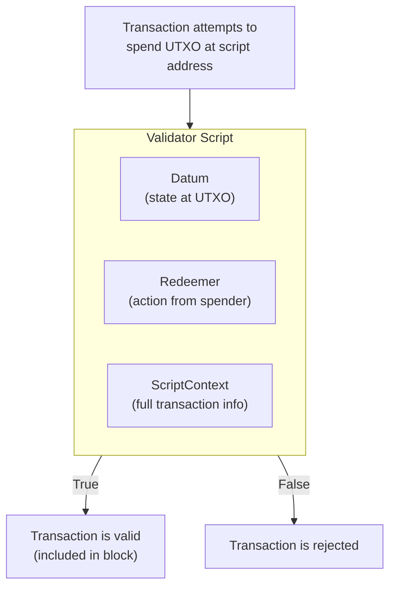
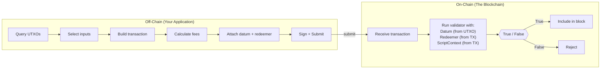
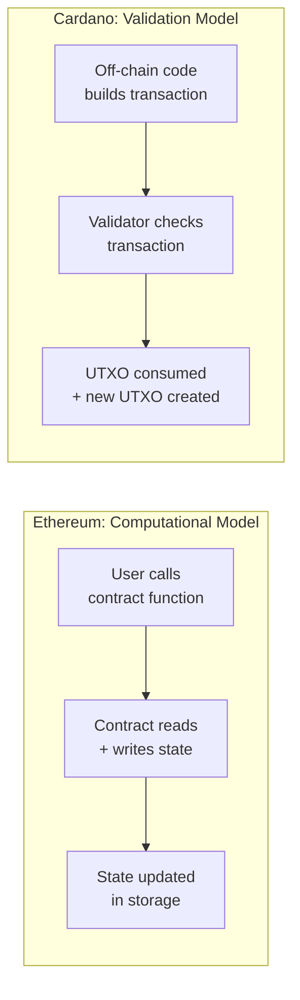

# Pelajaran #07: Smart Contract Secara Konseptual

Smart contract Cardano adalah sebuah validator: fungsi murni yang memeriksa transaksi yang diusulkan dan mengembalikan "ya, ini diizinkan" atau "tidak, ini tidak diizinkan." Validator tidak memelihara state, tidak mengekspos fungsi yang dapat dipanggil, atau memodifikasi penyimpanan. Mereka hanya memvalidasi. Ini membuat pendekatan Cardano secara fundamental berbeda dari chain berbasis akun seperti Ethereum.

Dalam pelajaran ini, kita membangun model mental tentang apa itu smart contract di Cardano. Anda akan mempelajari apa yang dilakukan validator, mengapa Cardano memisahkan logika on-chain dan off-chain, apa arti determinisme dalam praktik, dan bagaimana model Cardano dibandingkan dengan Ethereum. Di akhir pelajaran, Anda seharusnya dapat menalar tentang desain smart contract tanpa perlu memahami bahasa pemrograman tertentu.

## Apa Itu Smart Contract di Cardano?

Smart contract di Cardano adalah script validator yang menerima informasi tentang transaksi yang diusulkan dan mengembalikan keputusan boolean: izinkan atau tolak. Tidak seperti kontrak Ethereum yang menyimpan state dan mengekspos fungsi yang dapat dipanggil, validator Cardano adalah fungsi murni tanpa state yang hanya memvalidasi apakah transaksi memenuhi aturan yang telah ditentukan.

Pada tingkat paling umum, smart contract adalah **kode yang berjalan di blockchain dan memberlakukan aturan tentang bagaimana nilai dapat berpindah**. Tetapi definisi itu sangat kabur, karena *bagaimana* caranya sangat penting.

Di Ethereum, smart contract adalah program persisten yang berada di sebuah alamat, memelihara state-nya sendiri (variabel penyimpanan), dan mengekspos fungsi yang dapat dipanggil siapa saja. Ketika Anda berinteraksi dengan smart contract Ethereum, Anda pada dasarnya memanggil fungsi yang membaca dan menulis ke state mutable global.

Di Cardano, smart contract adalah sebuah **validator** yang memeriksa transaksi yang diusulkan dan mengembalikan `True` atau `False`. Ia tidak memelihara state. Ia tidak mengekspos fungsi yang dapat dipanggil. Ia tidak memodifikasi penyimpanan.

Perbedaan ini bersifat fundamental, dan segala sesuatu dalam pelajaran ini mengalir darinya.

## Bagaimana Validator Cardano Bekerja?

Validator Cardano adalah script yang terkait dengan alamat blockchain yang dieksekusi ketika seseorang mencoba membelanjakan UTXO di alamat script tersebut. Validator menerima tiga argumen (datum, redeemer, dan script context), memeriksa transaksi, dan mengembalikan `True` untuk menyetujui atau `False` untuk menolak seluruh transaksi.



### Apa yang Dapat Dilihat Validator?

Validator memiliki akses ke tiga informasi (yang kita eksplorasi secara mendalam di Pelajaran 9):

1. **Datum**: Data yang dilampirkan pada UTXO yang dibelanjakan; anggap saja sebagai "state" yang disimpan di alamat script ini.
2. **Redeemer**: Data yang disediakan oleh orang yang mencoba membelanjakan UTXO; anggap saja sebagai "aksi" atau "argumen" yang mereka kirimkan.
3. **Script Context**: Informasi tentang transaksi itu sendiri: semua input, semua output, biaya, interval validitas, siapa yang menandatanganinya, apa yang sedang dicetak, dan lainnya.

Validator menggunakan ketiga input ini untuk membuat keputusannya. Ia dapat memeriksa hal-hal seperti:

- "Apakah transaksi ini ditandatangani oleh public key yang benar?"
- "Apakah output mengirim setidaknya 10 ADA kembali ke alamat script?"
- "Apakah waktu saat ini setelah tenggat waktu?"
- "Apakah transaksi mencetak tepat satu token dengan kebijakan yang benar?"

### Apa Keterbatasan Validator?

Ini sama pentingnya. Validator Cardano **tidak dapat**:

- Membuat permintaan jaringan atau mengakses data eksternal secara langsung.
- Menghasilkan angka acak.
- Memodifikasi state (ia tidak memiliki penyimpanan yang dapat ditulis).
- Memanggil kontrak lain secara imperatif (ia hanya dapat memeriksa bahwa kondisi tertentu tentang transaksi terpenuhi).
- Melakukan loop tanpa batas (anggaran eksekusi memberlakukan terminasi).

Keterbatasan ini adalah fitur, bukan bug. Mereka membuat validator **deterministik**: input yang sama selalu menghasilkan output yang sama. Ini adalah fondasi jaminan prediktabilitas Cardano.

## Bagaimana Kode On-Chain Berbeda dari Kode Off-Chain?

Kode on-chain adalah script validator yang berjalan di setiap node yang memvalidasi dan menjawab "apakah transaksi ini valid?" Kode off-chain berjalan di mesin pengguna, membangun transaksi yang terbentuk dengan baik, dan menjawab "bagaimana cara membangun transaksi yang akan diterima validator?" Pemisahan ini memungkinkan efisiensi, fleksibilitas, dan kemampuan pengujian yang independen.



### Kode On-Chain: Validator

Kode on-chain adalah script validator itu sendiri. Ia berjalan di setiap node yang memvalidasi transaksi. Karena ia berjalan di ratusan atau ribuan mesin, ia harus:

- **Kecil**: Setiap byte script memerlukan biaya dan mengonsumsi sumber daya.
- **Efisien**: Eksekusi dibatasi oleh limit CPU dan memori (ExUnits).
- **Murni**: Tidak ada efek samping, tidak ada I/O, tidak ada mutasi state.
- **Deterministik**: Input yang sama harus selalu menghasilkan hasil yang sama.

Kode on-chain menjawab satu pertanyaan: "Apakah transaksi ini valid menurut aturan saya?"

### Kode Off-Chain: Pembangun Transaksi

Kode off-chain berjalan di mesin pengguna (atau server backend). Ia bertanggung jawab untuk:

- Melakukan query ke blockchain untuk UTXO yang tersedia.
- Memilih UTXO mana yang akan digunakan sebagai input.
- Membangun body transaksi dengan output, biaya, dan metadata yang tepat.
- Menyediakan nilai datum dan redeemer yang benar.
- Menyeimbangkan transaksi (memastikan input = output + biaya).
- Menandatangani dan mengirimkan transaksi.

Kode off-chain menjawab pertanyaan yang berbeda: "Bagaimana cara membangun transaksi yang akan diterima validator?"

### Bagaimana Hubungan Keduanya?

Pikirkan seperti ini: kode off-chain adalah **pengacara yang menyusun kontrak**, dan kode on-chain adalah **hakim yang meninjau kontrak tersebut**. Pengacara melakukan pekerjaan kreatif dan kompleks untuk menentukan seperti apa perjanjian itu seharusnya. Hakim hanya memeriksa apakah perjanjian tersebut sesuai dengan aturan.

Pemisahan ini memiliki implikasi yang mendalam:

- **Efisiensi**: Blockchain hanya menjalankan logika validasi, bukan logika konstruksi. Ini membuat eksekusi on-chain secara dramatis lebih murah.
- **Fleksibilitas**: Kode off-chain dapat ditulis dalam bahasa apa pun dan menggunakan library apa pun. Hanya validator yang perlu dikompilasi menjadi kode on-chain.
- **Kemampuan pengujian**: Anda dapat menguji logika off-chain dan on-chain secara independen.
- **Kemampuan upgrade**: Anda dapat memperbarui kode off-chain (cara transaksi dibangun) tanpa mengubah validator on-chain.

## Mengapa Determinisme Penting untuk Smart Contract Cardano?

Determinisme berarti hasil transaksi sepenuhnya dapat diketahui sebelum pengiriman. Ketika Anda membangun transaksi Cardano secara lokal dan ia lolos validasi, Anda dapat yakin ia juga akan lolos validasi di blockchain. Hasilnya tidak berubah antara pengujian lokal Anda dan eksekusi aktual, menghilangkan biaya yang terbuang, front-running, dan serangan MEV.

### Bagaimana Cardano Mencapai Determinisme?

Beberapa pilihan desain berkontribusi pada properti ini:

1. **Model UTXO**: Input transaksi adalah UTXO spesifik, bukan saldo akun. State yang dibaca transaksi sudah tetap pada waktu konstruksi, bukan pada waktu eksekusi.

2. **Tidak ada state mutable global**: Validator tidak membaca dari atau menulis ke penyimpanan bersama. Mereka hanya melihat transaksi yang sedang mereka validasi.

3. **Penanganan waktu eksplisit**: Waktu diekspresikan sebagai rentang slot dalam interval validitas, bukan sebagai "waktu saat ini ketika ini kebetulan dieksekusi." Validator mengetahui transaksi hanya dapat dimasukkan dalam jendela waktu tertentu.

4. **Fungsi murni**: Validator adalah fungsi matematika; input yang sama, output yang sama, setiap saat. Tidak ada keacakan, tidak ada sumber data eksternal, tidak ada state ambient.

### Mengapa Ethereum Tidak Deterministik?

Di Ethereum, hasil transaksi dapat berubah antara saat Anda mengirimkannya dan saat ia dieksekusi karena:

- Transaksi lain dapat memodifikasi variabel state yang sama sebelum transaksi Anda berjalan.
- Harga gas dapat berubah, menyebabkan jalur eksekusi yang berbeda.
- Timestamp blok dan nilai lingkungan lainnya tidak diketahui pada saat pengiriman.
- Urutan transaksi dalam blok dikendalikan oleh miner/validator, yang mengarah pada serangan MEV (Maximal Extractable Value).

Non-determinisme ini adalah alasan mengapa transaksi Ethereum dapat "gagal" setelah pengiriman (dibatalkan dan mengonsumsi gas) dan mengapa MEV adalah masalah yang sangat signifikan. Desain deterministik Cardano menghilangkan masalah-masalah ini secara desain.

### Apa Manfaat Praktis Determinisme?

Determinisme berarti:
- **Tidak ada biaya yang terbuang**: Jika transaksi Anda akan gagal, Anda mengetahuinya sebelum mengirimkan. Anda tidak pernah membayar biaya untuk transaksi yang gagal (satu pengecualian adalah kegagalan script fase-2, di mana collateral dikonsumsi; tetapi ini adalah bug dalam kode off-chain Anda, bukan ketidakpastian fundamental).
- **Tidak ada front-running**: Karena hasilnya sudah tetap pada waktu konstruksi dan tidak bergantung pada urutan transaksi, serangan MEV secara struktural tidak mungkin untuk sebagian besar jenis transaksi.
- **Biaya yang dapat diprediksi**: Anda tahu persis berapa biaya transaksi sebelum mengirimkannya.

## Bagaimana Alamat Script Bekerja di Cardano?

Alamat script adalah alamat on-chain yang diturunkan dari hash script validator yang telah dikompilasi. Siapa pun dapat mengirim ADA atau token ke alamat ini, membuat UTXO yang "terkunci" oleh validator. Untuk membelanjakan UTXO tersebut, transaksi harus memenuhi kondisi validator dengan menyediakan redeemer yang valid dan lolos evaluasi.

### Apa Proses Penurunan Alamat Script?

1. Anda menulis validator (dalam Plutus, Aiken, atau bahasa lain).
2. Validator dikompilasi menjadi UPLC (Untyped Plutus Lambda Calculus), bytecode on-chain tingkat rendah.
3. Hash dari script yang dikompilasi menentukan alamat script.
4. UTXO yang dikirim ke alamat ini hanya dapat dibelanjakan oleh transaksi yang lolos validator.

```
Validator Source Code (Aiken, Plutus, etc.)
        |
        v  [Compilation]
UPLC Bytecode
        |
        v  [Blake2b-224 Hash]
Script Hash
        |
        v  [Address Construction]
Script Address (addr1w8...)
        |
        v
UTXOs locked at this address
require the validator to approve spending
```

### Bagaimana Alamat Script Berbeda dari Alamat Pembayaran?

Alamat pembayaran biasa (seperti alamat wallet Alice) diturunkan dari public key. Untuk membelanjakan darinya, Anda memerlukan tanda tangan dari private key yang sesuai. Sederhana.

Alamat script diturunkan dari hash script. Untuk membelanjakan darinya, Anda perlu menyediakan redeemer dan (tergantung era) script itu sendiri, dan script harus mengevaluasi menjadi `True`. Tidak ada private key; script ADALAH mekanisme otorisasi.

Ini sangat powerful. Artinya logika otorisasi dapat menjadi sangat kompleks:

- Persyaratan multi-signature ("3 dari 5 anggota dewan harus menandatangani").
- Kondisi berbasis waktu ("dana hanya dapat ditarik setelah 1 Januari 2027").
- Kondisi berbasis nilai ("setidaknya 50% dari nilai harus dikirim ke alamat tertentu").
- Akses berbasis token ("transaksi harus menyertakan NFT tertentu sebagai input").

## Bagaimana Model Smart Contract Cardano Berbeda dari Ethereum?

Cardano menggunakan model validasi di mana validator memeriksa apakah transaksi yang sudah dikonstruksi diizinkan, sementara Ethereum menggunakan model komputasi di mana kontrak mengeksekusi perubahan state secara imperatif. Validator Cardano tidak memiliki state persisten dan tidak memiliki fungsi yang dapat dipanggil; kontrak Ethereum menyimpan state dan mengekspos endpoint fungsi.



### Ethereum: Komputasi Tujuan Umum

Di Ethereum, smart contract adalah objek persisten dengan:
- **State**: Variabel penyimpanan yang bertahan antar panggilan.
- **Fungsi**: Titik masuk yang dapat dipanggil yang memodifikasi state.
- **Message call**: Kontrak dapat memanggil kontrak lain, menciptakan rantai panggilan yang kompleks.
- **Model gas**: Anda membayar untuk setiap langkah komputasi, dan jika Anda kehabisan gas di tengah eksekusi, transaksi dibatalkan (tetapi gas tetap dikonsumsi).

Kontrak Ethereum mungkin mengatakan: "Ketika seseorang memanggil `transfer(to, amount)`, periksa saldo mereka, kurangi dari slot penyimpanan mereka, tambahkan ke slot penyimpanan penerima."

### Cardano: Validasi, Bukan Komputasi

Di Cardano, validator tidak menghitung hasil; mereka memvalidasi transaksi yang dikonstruksi di off-chain:

- **Tidak ada state persisten**: State dikodekan dalam UTXO (melalui datum), bukan dalam penyimpanan kontrak.
- **Tidak ada fungsi yang dapat dipanggil**: Tidak ada "panggil kontrak ini." Sebaliknya, Anda "membelanjakan UTXO di alamat script ini."
- **Tidak ada panggilan kontrak-ke-kontrak**: Sebuah transaksi dapat melibatkan beberapa validator (membelanjakan UTXO dari alamat script yang berbeda), dan setiap validator berjalan secara independen. Mereka dapat mengamati konteks transaksi yang sama, tetapi mereka tidak saling memanggil.
- **Tidak ada konsumsi gas saat gagal**: Jika transaksi gagal validasi lokal, ia tidak pernah dikirimkan dan tidak memerlukan biaya.

### Bagaimana Contoh Konkret Dibandingkan?

Pertimbangkan escrow sederhana: Alice mengunci dana untuk Bob, dan Bob dapat mengklaimnya dengan memberikan sebuah rahasia.

**Pendekatan Ethereum:**
```
contract Escrow {
    address payable beneficiary;
    bytes32 secretHash;

    function claim(bytes secret) {
        require(hash(secret) == secretHash);   // check secret
        beneficiary.transfer(address(this).balance);  // move funds
    }
}
```
Kontrak menyimpan state (beneficiary, secretHash), mengekspos fungsi (claim), dan secara imperatif mentransfer dana.

**Pendekatan Cardano:**
Validator hanya memeriksa: "Apakah transaksi menyediakan redeemer yang hash-nya cocok dengan datum? Jika ya, setujui. Jika tidak, tolak."
```
validator escrow(datum: SecretHash, redeemer: Secret, ctx: ScriptContext) -> Bool {
    hash(redeemer) == datum
}
```
Kode off-chain bertanggung jawab untuk membangun transaksi yang mengirim dana ke Bob. Validator hanya memeriksa bahwa kondisi terpenuhi. "Transfer dana" yang sebenarnya dikodekan dalam output transaksi, bukan dieksekusi oleh script.

### Apa Perbedaan Filosofis?

Ethereum mengatakan: "Beritahu saya apa yang harus dilakukan, dan saya akan melakukannya."
Cardano mengatakan: "Tunjukkan apa yang ingin Anda lakukan, dan saya akan memberitahu apakah itu diizinkan."

Inilah mengapa model Cardano kadang-kadang disebut **model "deklaratif" atau "validasi"** versus **model "imperatif" atau "komputasi"** Ethereum. Keduanya tidak secara inheren lebih baik, tetapi mereka mengarah pada arsitektur, pola, dan trade-off yang sangat berbeda.

## Jenis Script Apa yang Didukung Cardano?

Cardano mendukung beberapa kategori script: simple (native) script untuk persyaratan dasar tanda tangan dan time-lock, dan Plutus script (V1, V2, V3) untuk logika validasi Turing-complete. Selain itu, script khusus berfungsi sebagai minting policy dan staking validator.

### Simple Script (Native Script)

Ini adalah script dasar, non-Turing-complete yang tersedia sebelum Plutus. Mereka mendukung:
- **Persyaratan tanda tangan**: "Harus ditandatangani oleh key X."
- **Time lock**: "Valid hanya setelah slot N" atau "Valid hanya sebelum slot M."
- **Multi-sig**: "Memerlukan tanda tangan dari setidaknya K dari N key ini."
- **Kombinasi logis**: Kombinasi AND, OR, dan threshold dari hal di atas.

Simple script ringan dan tidak memerlukan biaya eksekusi di luar biaya transaksi standar. Mereka umumnya digunakan untuk wallet multi-signature dan minting policy yang terkunci waktu.

### Plutus Script (V1, V2, V3)

Plutus script adalah validator Turing-complete yang ditulis dalam bahasa tingkat tinggi dan dikompilasi menjadi UPLC. Mereka dapat mengekspresikan logika validasi arbitrer dan telah berevolusi di beberapa versi:

- **Plutus V1** (era Alonzo): Kemampuan smart contract yang asli. Script context terbatas.
- **Plutus V2** (era Vasil): Menambahkan reference input, inline datum, reference script, dan script context yang diperkaya.
- **Plutus V3** (hard fork Chang, era Conway): Menambahkan fitur terkait governance, primitif kriptografi baru, dan optimisasi lebih lanjut.

Setiap versi memperluas apa yang dapat dilihat dan dilakukan validator, tanpa merusak kompatibilitas mundur.

### Minting Policy

Minting policy adalah jenis script khusus yang mengontrol apakah native token dapat dicetak atau dibakar. Ketika sebuah transaksi menyertakan field mint, script minting policy yang sesuai dieksekusi. Kita mengeksplorasi minting policy secara menyeluruh di Pelajaran 10.

### Staking Validator

Script ini mengontrol delegasi stake dan penarikan reward untuk kredensial staking berbasis script. Mereka kurang umum tetapi penting untuk aplikasi tingkat protokol.

## Bagaimana Model EUTXO Memungkinkan Smart Contract?

Model Extended UTXO (EUTXO) meningkatkan model UTXO dasar dengan menambahkan datum (data arbitrer yang dilampirkan pada UTXO), redeemer (data aksi dari pembelanja), script context yang kaya (visibilitas transaksi penuh), dan script validator (alamat yang dapat diprogram). Ekstensi ini mentransformasi transfer nilai sederhana menjadi platform smart contract yang lengkap sambil mempertahankan determinisme dan paralelisme.

```
Basic UTXO:                    Extended UTXO (EUTXO):
+------------------+           +---------------------------+
| Address          |           | Script Address            |
| Value (ADA)      |           | Value (ADA + tokens)      |
+------------------+           | Datum (arbitrary data)    |
                               | Reference Script (optional)|
                               +---------------------------+

Spent by:                      Spent by:
  Signature from               Transaction that passes
  private key                  the validator with a
                               redeemer and valid context
```

Ekstensi ini mentransformasi model UTXO dari mekanisme transfer nilai sederhana menjadi platform smart contract yang lengkap, sambil mempertahankan manfaat model UTXO berupa determinisme, paralelisme, dan validasi lokal.

## Analogi Web2

Mari kita petakan konsep-konsep ini ke pola yang sudah Anda ketahui dari pengembangan web.

**Validator sebagai Middleware Validasi**: Dalam Express.js atau framework web apa pun, Anda menulis middleware yang memeriksa permintaan masuk sebelum mencapai route handler. Validator Cardano adalah middleware untuk blockchain; ia memeriksa "permintaan" (transaksi) dan mengizinkannya lewat atau menolaknya. Perbedaan kritisnya adalah middleware blockchain bersifat immutable setelah di-deploy dan berjalan di setiap node, bukan hanya di server Anda.

**Validator sebagai Constraint Database**: Bayangkan constraint `CHECK`, constraint `FOREIGN KEY`, atau fungsi trigger di PostgreSQL. Ini tidak melakukan insert atau update sendiri; mereka memvalidasi bahwa perubahan yang diusulkan memenuhi aturan tertentu. Validator Cardano persis seperti ini: sebuah constraint pada perubahan apa yang diizinkan terhadap UTXO di alamatnya.

**Kode Off-Chain sebagai Logika Client API**: Dalam arsitektur web tipikal, frontend (React, Vue) membangun permintaan API: memilih parameter, memformat payload, menangani token autentikasi. Server (validator) kemudian memvalidasi dan memproses permintaan tersebut. Kode off-chain Cardano memainkan peran yang sama dengan frontend: membangun "permintaan" (transaksi) yang terbentuk dengan baik yang akan diterima "server" (validator) on-chain.

**Fungsi Serverless dengan Input/Output**: Fungsi AWS Lambda menerima event input, memprosesnya, dan mengembalikan hasil. Mereka tidak memelihara koneksi persisten atau state yang berumur panjang. Validator Cardano serupa; mereka dipanggil dengan input tertentu (datum, redeemer, context), menjalankan komputasi murni, dan mengembalikan hasil boolean. Setiap pemanggilan bersifat independen.

**Alamat Script sebagai Endpoint API yang Dilindungi**: Alamat script seperti endpoint API yang memerlukan autentikasi dan otorisasi tertentu untuk diakses. Siapa pun dapat mengirim data ke sana (membuat UTXO), tetapi hanya permintaan yang terotorisasi dan terformat dengan benar (transaksi dengan redeemer yang tepat) yang dapat mengambil data darinya (membelanjakan UTXO).

**Determinisme sebagai API Idempoten**: Dalam REST, operasi idempoten (GET, PUT, DELETE) mengembalikan hasil yang sama terlepas dari berapa kali Anda memanggilnya dengan input yang sama. Transaksi Cardano bahkan lebih kuat; mereka bukan hanya idempoten tetapi sepenuhnya deterministik. Hasilnya diketahui sebelum eksekusi, seperti memanggil fungsi murni dengan argumen yang diketahui.

## Poin-Poin Penting

- **Smart contract Cardano adalah validator**, bukan program tujuan umum. Mereka memeriksa apakah transaksi diizinkan; mereka tidak melakukan logika transaksi itu sendiri.
- **Kode on-chain dan off-chain melayani peran yang berbeda**: Kode on-chain memvalidasi; kode off-chain membangun. Pemisahan ini memungkinkan efisiensi, fleksibilitas, dan determinisme.
- **Determinisme adalah kekuatan super Cardano**: Anda mengetahui hasil pasti dari transaksi sebelum mengirimkannya, menghilangkan biaya yang terbuang, front-running, dan serangan MEV.
- **Alamat script mengunci UTXO di bawah aturan yang dapat diprogram**, menggantikan otorisasi private key dengan logika validasi arbitrer.
- **Model EUTXO memperluas model UTXO** dengan datum, redeemer, dan script context, memungkinkan fungsionalitas smart contract yang lengkap sambil mempertahankan manfaat model UTXO.

## Apa Selanjutnya

Anda sekarang memiliki pemahaman konseptual tentang apa itu validator dan mengapa pendekatan Cardano berbeda. Di Pelajaran 8, kita mengeksplorasi bahasa dan alat yang digunakan untuk menulis validator ini: Plutus, Aiken, dan pipeline kompilasi dari kode tingkat tinggi hingga bytecode UPLC, beserta bagaimana biaya eksekusi diukur dan dikelola.
