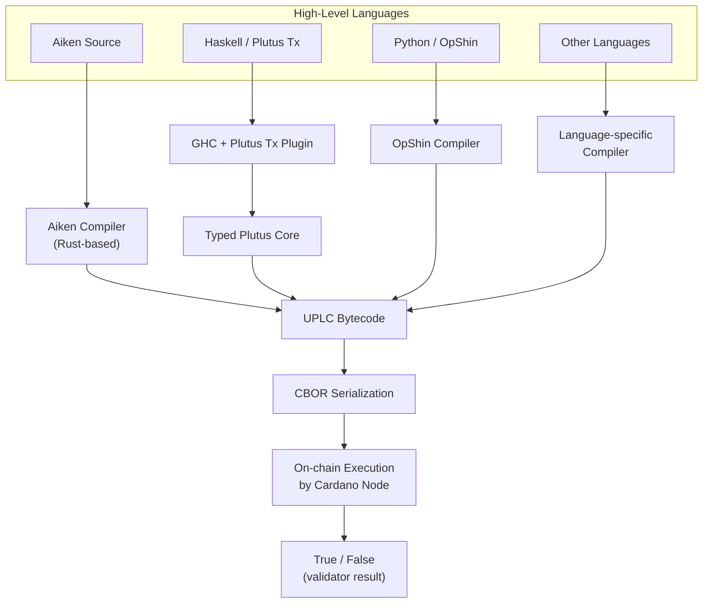
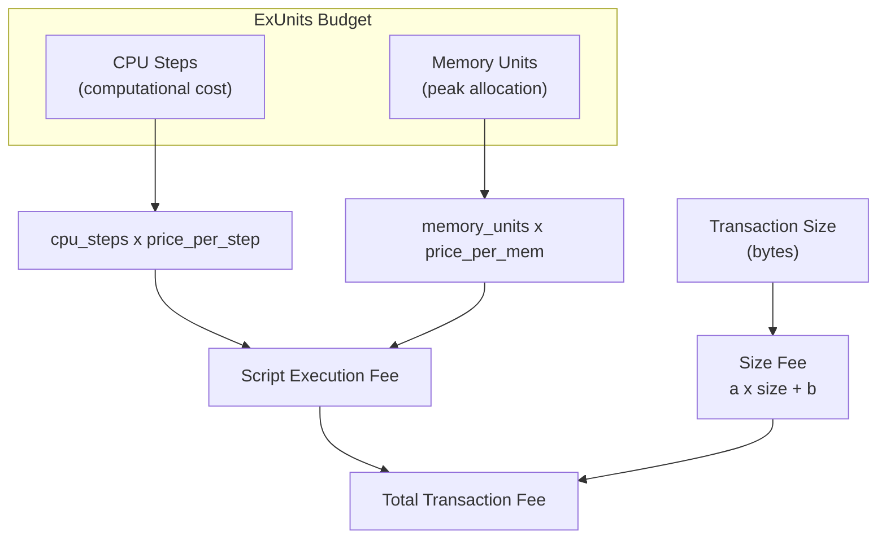

# Pelajaran #08: Plutus, Aiken, dan Bahasa Pemrograman

Setiap smart contract Cardano, terlepas dari bahasa sumbernya, dikompilasi menjadi UPLC (Untyped Plutus Lambda Calculus), bytecode minimalis yang diinterpretasikan dan dieksekusi oleh node Cardano. Target kompilasi universal ini memungkinkan ekosistem bahasa yang kaya (Aiken, Plutus Tx, OpShin, Helios, plu-ts) yang masing-masing menawarkan trade-off berbeda dalam ergonomi, performa, dan kematangan.

Dalam pelajaran ini, kita menelusuri jalur dari kode sumber tingkat tinggi hingga eksekusi on-chain. Anda akan mempelajari apa itu UPLC dan mengapa ia ada, bagaimana Plutus Tx dan Aiken mendekati masalah kompilasi secara berbeda, bagaimana biaya eksekusi diukur dan dianggarkan, apa yang disediakan oleh blueprint CIP-57, dan mengapa verifikasi formal penting di dunia di mana kode yang di-deploy bersifat immutable.

## Apa Itu UPLC dan Mengapa Ia Menjadi Bytecode On-Chain Cardano?

UPLC (Untyped Plutus Lambda Calculus) adalah bytecode tingkat rendah berbasis lambda calculus yang diinterpretasikan dan dieksekusi oleh setiap node Cardano saat memvalidasi transaksi smart contract. Ia menyediakan lapisan eksekusi yang minimal, deterministik, dan ketat secara matematis yang dapat ditargetkan oleh bahasa tingkat tinggi mana pun sebagai output kompilasi.

### Bagaimana UPLC Bekerja?

UPLC adalah bahasa pemrograman fungsional minimalis yang berbasis lambda calculus. Ia "untyped" dalam arti bahwa sistem tipe dihapus pada tingkat ini. Ia "Plutus" karena dirancang sebagai bagian dari platform smart contract Plutus. Dan ia "Lambda Calculus" karena dibangun di atas fondasi matematika yang mendasari semua pemrograman fungsional.

UPLC mendukung serangkaian operasi yang kecil:

- **Variable**: Referensi ke nilai yang terikat.
- **Lambda abstraction**: Fungsi anonim (definisi fungsi).
- **Application**: Menerapkan fungsi ke argumen (pemanggilan fungsi).
- **Constant**: Nilai literal (integer, byte string, boolean, dll.).
- **Built-in function**: Serangkaian tetap operasi primitif (aritmetika, perbandingan, hashing kriptografi, manipulasi data, dll.).
- **Force dan Delay**: Mekanisme untuk mengontrol evaluasi (terkait dengan penghapusan polimorfisme).
- **Error**: Term yang langsung menghentikan eksekusi dengan kegagalan.

Itu saja. Tidak ada loop, tidak ada variabel mutable, tidak ada objek, tidak ada class. Semuanya diekspresikan melalui aplikasi fungsi dan rekursi. Kesederhanaan yang ekstrem ini disengaja; ia membuat bahasa mudah dianalisis, dinalar, dan diimplementasikan dengan benar di setiap node.

### Mengapa Cardano Memilih Lambda Calculus?

Pemilihan lambda calculus sebagai fondasi bersifat disengaja dan strategis:

1. **Keketatan matematis**: Lambda calculus telah dipelajari sejak tahun 1930-an. Propertinya dipahami secara menyeluruh, memungkinkan penalaran formal tentang perilaku program.

2. **Determinisme**: Lambda calculus murni secara inheren deterministik; tidak ada efek samping, tidak ada mutasi state, tidak ada I/O. Ini selaras sempurna dengan persyaratan determinisme Cardano.

3. **Kesederhanaan implementasi**: Evaluator UPLC di setiap node Cardano adalah potongan kode yang kecil dan dapat diaudit. Runtime yang lebih sederhana berarti lebih sedikit bug dan kerentanan keamanan.

4. **Target kompilasi universal**: Bahasa tingkat tinggi mana pun dapat dikompilasi ke lambda calculus. Ia berfungsi sebagai "lingua franca" untuk bahasa smart contract, sama seperti WebAssembly berfungsi sebagai target universal untuk bahasa web.

## Bagaimana Pipeline Kompilasi Smart Contract Cardano Bekerja?

Pipeline kompilasi mentransformasi kode sumber tingkat tinggi (Aiken, Plutus Tx, OpShin, dll.) melalui kompiler spesifik bahasa menjadi bytecode UPLC, yang kemudian diserialisasi CBOR untuk penyimpanan dan eksekusi on-chain oleh node Cardano. Langkah-langkah perantara yang tepat bervariasi menurut bahasa, tetapi titik akhirnya selalu UPLC yang diserialisasi sebagai CBOR.



## Bagaimana Plutus Tx Bekerja untuk Smart Contract Berbasis Haskell?

Plutus Tx adalah framework smart contract Cardano yang asli yang menggunakan plugin GHC (Glasgow Haskell Compiler) dan metaprogramming Template Haskell untuk menangkap ekspresi Haskell pada waktu kompilasi dan menerjemahkannya menjadi Plutus Core, yang kemudian diturunkan menjadi UPLC. Anda menulis apa yang terlihat seperti kode Haskell biasa, menganotasinya dengan splice khusus, dan plugin kompiler mentransformasinya menjadi bytecode on-chain.

```
-- Conceptual Plutus Tx validator structure
mkValidator :: Datum -> Redeemer -> ScriptContext -> Bool
mkValidator datum redeemer ctx =
    -- Validation logic here
    traceIfFalse "wrong redeemer" (redeemer == expectedValue)
```

### Apa Kekuatan Plutus Tx?

- **Ekosistem Haskell**: Akses ke sistem tipe Haskell yang kuat, termasuk algebraic data type, type class, dan polimorfisme parametrik.
- **Kode bersama**: Kode on-chain dan off-chain dapat berbagi definisi tipe, mengurangi kemungkinan ketidakcocokan.
- **Potensi verifikasi formal**: Sistem tipe dan kemurnian Haskell membuatnya cocok untuk metode formal.
- **Tooling yang matang**: Haskell memiliki puluhan tahun tooling untuk pengujian, profiling, dan analisis.

### Apa Tantangan Plutus Tx?

- **Kurva belajar yang curam**: Haskell sangat sulit bagi pengembang yang datang dari bahasa imperatif. Kombinasi Haskell + blockchain + Template Haskell menciptakan dinding pembelajaran yang tangguh.
- **Kompleksitas kompilasi**: Pendekatan plugin GHC berarti waktu build bisa lama, pesan error bisa sulit dipahami, dan tidak semua fitur Haskell tersedia (beberapa fungsi standard library tidak dapat dikompilasi ke Plutus Core).
- **Ukuran script**: Validator Plutus Tx bisa relatif besar dalam ukuran byte, yang berarti biaya lebih tinggi.
- **Subset terbatas**: Anda tidak dapat menggunakan Haskell sembarangan; hanya subset yang dapat diterjemahkan oleh plugin kompiler Plutus Tx. Ini berarti tidak ada lazy I/O, tidak ada unsafePerformIO, tidak ada FFI, dan penggunaan standard library yang dibatasi.

## Apa Itu Aiken dan Mengapa Ia Menjadi Bahasa Smart Contract Cardano Paling Populer?

Aiken adalah bahasa pemrograman yang dirancang khusus dari awal untuk menulis smart contract Cardano. Ia memprioritaskan pengalaman pengembang, kompilasi cepat (sub-detik), dan output UPLC yang efisien, meminjam sintaks dan konsep dari bahasa modern seperti Rust, Elm, dan Gleam untuk menciptakan sesuatu yang familiar namun dirancang khusus untuk validasi on-chain.

```
// Conceptual Aiken validator structure
validator my_validator {
  spend(datum: MyDatum, redeemer: MyRedeemer, ctx: ScriptContext) {
    // Validation logic returns Bool
    redeemer.secret == datum.expected_hash
  }
}
```

### Apa Fitur Utama Aiken?

- **Kompilasi cepat**: Aiken dikompilasi dalam hitungan detik, bukan menit. Kompilernya ditulis dalam Rust dan sangat cepat.
- **Pesan error yang jelas**: Mengikuti tradisi Elm/Rust, Aiken menyediakan pesan error yang membantu dan mudah dibaca yang menunjuk langsung ke masalah.
- **Pengujian bawaan**: Aiken menyertakan test runner, sehingga Anda dapat menulis dan menjalankan unit test untuk validator Anda tanpa tooling eksternal.
- **Output yang efisien**: Kompiler Aiken menghasilkan UPLC yang kecil dan teroptimasi, sering menghasilkan biaya eksekusi yang lebih rendah dibandingkan validator Plutus Tx yang setara.
- **Standard library yang dibangun khusus**: Standard library berisi tepat apa yang Anda butuhkan untuk pengembangan smart contract; tidak lebih, tidak kurang.
- **Tipe statis yang kuat**: Algebraic data type penuh, pattern matching, generics, dan type inference; semua keamanan dari bahasa bertipe modern.
- **Tidak ada runtime**: Aiken tidak memiliki garbage collector atau sistem runtime. Semuanya dikompilasi langsung menjadi UPLC.

### Mengapa Aiken Mendapat Adopsi yang Begitu Kuat?

Aiken telah menjadi pilihan paling populer untuk pengembangan smart contract Cardano baru karena beberapa alasan:

1. **Hambatan masuk yang lebih rendah**: Pengembang yang familiar dengan Rust, TypeScript, atau bahasa keluarga ML mana pun dapat produktif di Aiken dengan cepat.
2. **Iterasi lebih cepat**: Waktu kompilasi sub-detik berarti umpan balik yang cepat selama pengembangan.
3. **Script lebih kecil**: Output UPLC yang teroptimasi berarti biaya transaksi yang lebih rendah untuk pengguna akhir.
4. **Komunitas aktif**: Aiken memiliki ekosistem library, alat, dan sumber daya edukasi yang berkembang.
5. **Pemisahan yang bersih**: Aiken hanya untuk kode on-chain. Kode off-chain ditulis dalam bahasa apa pun yang digunakan aplikasi Anda (TypeScript, Python, Rust, dll.), yang mendorong pemisahan on-chain/off-chain yang bersih yang dituntut arsitektur Cardano.

## Bahasa Smart Contract Apa Lagi yang Didukung Cardano?

Cardano mendukung beberapa bahasa tambahan di luar Aiken dan Plutus Tx, masing-masing menargetkan komunitas pengembang yang berbeda. OpShin mengompilasi subset Python ke UPLC, Helios menawarkan DSL fungsional murni, plu-ts memungkinkan Anda menulis validator dalam TypeScript, dan Scalus membawa dukungan Scala/JVM.

### OpShin

OpShin memungkinkan Anda menulis smart contract Cardano dalam Python. Ia mengompilasi subset Python ke UPLC. Untuk tim dengan keahlian Python yang menganggap Haskell dan bahkan Aiken terlalu asing, OpShin menyediakan titik masuk yang dapat diakses.

### Helios

Helios adalah domain-specific language fungsional murni untuk smart contract Cardano. Ia dikompilasi langsung ke UPLC dan dapat berjalan sepenuhnya di browser, membuatnya menarik untuk pengembangan dApp di mana seluruh pipeline (menulis, mengompilasi, dan mengirimkan) terjadi di sisi klien.

### plu-ts

plu-ts memungkinkan Anda menulis smart contract Cardano dalam TypeScript. Logika validator diekspresikan menggunakan fungsi TypeScript yang dikompilasi ke UPLC pada saat runtime (dalam JavaScript). Ini sangat menarik bagi pengembang full-stack TypeScript.

### Scalus

Scalus membawa pengembangan smart contract Cardano ke ekosistem Scala/JVM, mengompilasi ekspresi Scala ke UPLC.

### Mengapa Keragaman Bahasa Adalah Kekuatan?

Keragaman bahasa adalah kekuatan arsitektur Cardano. Karena UPLC adalah target kompilasi yang bersih dan terspesifikasi dengan baik, bahasa apa pun dapat menargetkannya. Ini mirip dengan bagaimana beberapa bahasa (Rust, Go, C++) dapat dikompilasi ke WebAssembly, atau bagaimana beberapa bahasa JVM (Java, Kotlin, Scala, Clojure) menargetkan bytecode yang sama.

## Bagaimana Biaya Eksekusi Smart Contract Dihitung di Cardano?

Cardano mengukur biaya eksekusi smart contract menggunakan ExUnits (Execution Units) dalam dua dimensi: CPU step (jumlah langkah komputasi yang dilakukan) dan memory unit (memori puncak yang dikonsumsi selama evaluasi). Setiap script harus mendeklarasikan anggaran sumber dayanya di muka, dan biaya dihitung dengan mengalikan sumber daya yang dikonsumsi dengan harga per unit protokol mereka.



### Bagaimana CPU Step dan Memory Bekerja?

**CPU (Step)**: CPU mengukur jumlah langkah komputasi yang dilakukan script. Setiap built-in function UPLC memiliki biaya CPU yang ditentukan berdasarkan argumennya. Penjumlahan integer kecil murah; hashing kriptografi mahal. Biaya-biaya ini ditentukan oleh **cost model** yang memetakan setiap operasi primitif ke biaya CPU-nya.

**Memory**: Memory mengukur jumlah maksimum memori yang digunakan script selama eksekusi. Setiap nilai yang dibuat selama evaluasi mengonsumsi memori, dan total penggunaan memori puncak menentukan biaya memori. Tidak seperti CPU, memori adalah tentang penggunaan puncak, bukan alokasi kumulatif.

### Apa Batas Anggaran ExUnits?

Setiap eksekusi Plutus script harus mendeklarasikan anggaran sumber dayanya di muka (sebagai bagian dari transaksi). Anggaran menentukan persis berapa banyak CPU step dan berapa banyak memory unit yang diizinkan untuk dikonsumsi script. Jika script melebihi salah satu batas, ia gagal.

Ada juga batas per transaksi dan per blok:

```
Resource Hierarchy:
  Per-Block Budget (shared by all transactions in the block)
    |
    +-- Per-Transaction Budget (shared by all scripts in the transaction)
          |
          +-- Per-Script Budget (declared in the transaction)
```

Batas perkiraan saat ini (ini adalah parameter protokol yang dapat berubah melalui governance):

- **Per transaksi**: ~10 miliar CPU step, ~14 juta memory unit.
- **Per blok**: ~20 miliar CPU step, ~62 juta memory unit.

### Mengapa ExUnits Penting untuk Pengembangan?

Memahami ExUnits sangat penting karena berdampak langsung pada:

- **Kelayakan**: Jika validator Anda melebihi batas per transaksi, ia tidak dapat digunakan. Anda harus mengoptimasi atau merestrukturisasi.
- **Biaya**: ExUnits yang lebih tinggi berarti biaya yang lebih tinggi untuk pengguna Anda.
- **Ruang blok**: Transaksi yang mengonsumsi lebih banyak ExUnits mengambil lebih banyak anggaran per blok, berarti lebih sedikit transaksi lain yang muat dalam blok yang sama.

Inilah mengapa output UPLC Aiken yang efisien penting; script yang lebih kecil dan lebih cepat langsung diterjemahkan menjadi biaya yang lebih rendah dan pengalaman pengguna yang lebih baik.

## Apa Itu CIP-57 Plutus Blueprint dan Mengapa Mereka Penting?

CIP-57 Plutus Blueprint adalah dokumen JSON standar yang dapat dibaca mesin yang mendeskripsikan antarmuka smart contract yang telah dikompilasi, termasuk nama validator, skema datum/redeemer, definisi tipe data, dan bytecode UPLC yang dikompilasi. Mereka berfungsi sebagai padanan ABI (Application Binary Interface) Cardano, memungkinkan pembuatan kode otomatis dan interoperabilitas tooling.

### Apa yang Terkandung dalam Blueprint?

Plutus Blueprint mencakup:

- **Informasi validator**: Nama, tujuan (spending, minting, dll.), dan hash script yang dikompilasi.
- **Skema parameter**: Tipe dan struktur datum, redeemer, dan parameterisasi apa pun.
- **Definisi data**: Definisi tipe lengkap untuk semua tipe data kustom yang digunakan dalam kontrak.
- **Kode yang dikompilasi**: Bytecode UPLC aktual (atau referensi ke sana).

```
// Simplified blueprint structure (conceptual)
{
  "preamble": {
    "title": "My Escrow Contract",
    "version": "1.0.0"
  },
  "validators": [
    {
      "title": "escrow.spend",
      "datum": {
        "schema": { "$ref": "#/definitions/EscrowDatum" }
      },
      "redeemer": {
        "schema": { "$ref": "#/definitions/EscrowAction" }
      },
      "compiledCode": "5901a2010000...",
      "hash": "a1b2c3d4e5..."
    }
  ],
  "definitions": {
    "EscrowDatum": {
      "dataType": "constructor",
      "fields": [
        { "title": "beneficiary", "dataType": "bytes" },
        { "title": "deadline", "dataType": "integer" }
      ]
    }
  }
}
```

### Bagaimana Blueprint Meningkatkan Pengembangan?

Sebelum CIP-57, mengintegrasikan dengan smart contract Cardano memerlukan salah satu dari:
- Membaca kode sumber untuk memahami format datum dan redeemer yang diharapkan.
- Mengandalkan dokumentasi yang mungkin usang atau tidak lengkap.
- Merekayasa balik UPLC yang dikompilasi (sangat sulit).

Blueprint memecahkan ini dengan menyediakan artefak tunggal, terstandarisasi, dan dapat dibaca mesin yang berisi semua yang dibutuhkan aplikasi off-chain untuk berinteraksi dengan kontrak. Ini memungkinkan:

- **Pembuatan kode**: Alat dapat secara otomatis menghasilkan tipe TypeScript, Python, atau Rust dari blueprint, memastikan interaksi yang type-safe dengan kontrak.
- **Validasi**: Kode off-chain dapat memvalidasi nilai datum dan redeemer terhadap skema blueprint sebelum membangun transaksi.
- **Kemudahan penemuan**: Pengembang dapat memahami antarmuka kontrak dengan memeriksa blueprint-nya, tanpa memerlukan kode sumber.
- **Interoperabilitas tooling**: Framework off-chain yang berbeda (Lucid, MeshJS, PyCardano, dll.) semuanya dapat mengonsumsi format blueprint yang sama.

Aiken menghasilkan blueprint secara otomatis sebagai bagian dari proses build-nya. Untuk Plutus Tx, blueprint dapat dihasilkan dengan tooling tambahan.

## Mengapa Verifikasi Formal Penting untuk Smart Contract?

Verifikasi formal menggunakan teknik matematika untuk membuktikan bahwa sebuah program memenuhi spesifikasinya untuk semua input yang mungkin, bukan hanya contoh yang diuji. Untuk smart contract, di mana bug dapat menyebabkan kehilangan dana yang tidak dapat dibalik dan kode yang di-deploy bersifat immutable, verifikasi formal memberikan jaminan terkuat bahwa logika validasi berperilaku benar dalam setiap skenario.

### Mengapa Taruhannya Sangat Tinggi?

Smart contract di Cardano bersifat immutable setelah di-deploy (pada hash script tertentu). Anda tidak dapat menambal kontrak yang sudah live. Jika validator memiliki bug yang memungkinkan pembelanjaan tanpa izin, dana di alamat tersebut berisiko, dan tidak ada cara untuk memperbaikinya kecuali men-deploy kontrak baru dan melakukan migrasi (yang mungkin tidak mungkin jika kontrak asli tidak menyertakan logika migrasi).

Taruhannya sangat tinggi:
- **Immutabilitas**: Tidak ada hotfix, tidak ada rollback.
- **Eksposur finansial**: Kontrak sering menyimpan nilai yang signifikan.
- **Lingkungan adversarial**: Tidak seperti API pribadi, siapa pun di dunia dapat mencoba mengeksploitasi smart contract.

### Pendekatan Verifikasi Apa yang Didukung Cardano?

1. **Property-based testing**: Alat seperti QuickCheck (di Haskell) atau pengujian bawaan Aiken menghasilkan ribuan kasus uji acak dan memeriksa bahwa properti berlaku. Ini bukan verifikasi formal, tetapi menangkap banyak bug yang terlewatkan oleh pengujian berbasis contoh.

2. **Kebenaran berbasis tipe**: Sistem tipe yang kuat (seperti di Haskell dan Aiken) mencegah seluruh kategori bug pada waktu kompilasi. Jika sebuah nilai harus berupa integer positif, sistem tipe dapat memberlakukan ini secara statis.

3. **Metode formal pada UPLC**: Karena UPLC berbasis lambda calculus dengan semantik yang dipahami dengan baik, secara teoritis dimungkinkan untuk menerapkan teknik verifikasi formal langsung pada bytecode yang dikompilasi.

4. **Audit**: Firma audit profesional meninjau kode sumber smart contract untuk mencari kerentanan. Meskipun bukan bukti matematis, tinjauan ahli menangkap bug yang terlewatkan oleh alat otomatis.

5. **Agda dan bukti formal**: Library inti Cardano sendiri telah diverifikasi secara formal menggunakan Agda, bahasa bertipe dependen yang dapat mengekspresikan dan memeriksa bukti matematika. Beberapa upaya penelitian memperluas ini ke verifikasi smart contract.

### Apa Jalur Praktis Menuju Keamanan Kontrak?

Untuk sebagian besar pengembang, jalur realistis menuju keamanan kontrak adalah:

- Menulis dalam bahasa bertipe kuat (Aiken atau Plutus Tx).
- Menggunakan property-based testing secara ekstensif.
- Menulis unit test dan integration test yang menyeluruh.
- Mendapatkan audit profesional untuk kontrak apa pun yang menangani nilai signifikan.
- Menjaga validator tetap kecil dan terfokus; semakin sedikit kode, semakin sedikit permukaan untuk bug.
- Menggunakan pola yang sudah mapan (dibahas di pelajaran berikutnya) daripada menciptakan yang baru.

## Bagaimana Cost Model Menentukan Harga Primitif UPLC?

Cost model adalah serangkaian parameter protokol (yang dapat disesuaikan melalui governance Cardano) yang memetakan setiap built-in function UPLC ke formula biaya deterministik berdasarkan argumennya. Operasi sederhana murah, operasi yang berskala dengan ukuran input dihargai sesuai, dan operasi kriptografi lebih mahal karena intensitas komputasinya.

```
Examples of cost model entries (conceptual):
  addInteger:       cpu = 205665 + 812 * max(arg1_size, arg2_size)
  sha2_256:         cpu = 1927926 + 82523 * arg_size
  equalsByteString: cpu = 245000 + 216773 * min(arg1_size, arg2_size)
  ifThenElse:       cpu = 80556 (constant)
```

Cost model memastikan bahwa:
- Operasi sederhana murah.
- Operasi yang berskala dengan ukuran input dihargai sesuai.
- Operasi kriptografi, yang secara komputasi mahal, biayanya lebih besar.
- Biayanya deterministik; operasi yang sama dengan argumen yang sama selalu memiliki biaya yang sama.

Memahami cost model membantu Anda menulis validator yang efisien. Misalnya, jika Anda perlu membandingkan dua byte string, melakukannya sekali jauh lebih murah daripada meng-hash keduanya dan membandingkan hash-nya (karena hashing mahal).

## Analogi Web2

**UPLC sebagai JavaScript (target kompilasi)**: Sama seperti TypeScript, CoffeeScript, Elm, dan PureScript semuanya dikompilasi ke JavaScript untuk dieksekusi di browser, Aiken, Plutus Tx, OpShin, dan bahasa Cardano lainnya semuanya dikompilasi ke UPLC untuk dieksekusi di on-chain. Anda memilih bahasa yang sesuai dengan keahlian dan preferensi tim Anda, tetapi runtime-nya sama.

**UPLC sebagai WebAssembly**: Analogi yang lebih dekat adalah WASM (WebAssembly). WASM adalah format biner tingkat rendah yang berfungsi sebagai target kompilasi untuk Rust, C++, Go, dan lainnya. Ia berjalan di lingkungan sandbox dengan batas sumber daya yang terkontrol. UPLC memiliki peran yang sama untuk Cardano: target eksekusi tingkat rendah, sandbox, dengan batas sumber daya.

**ExUnits sebagai Penagihan Cloud Function**: AWS Lambda menagih Anda berdasarkan jumlah permintaan, waktu eksekusi (dalam milidetik), dan memori yang dialokasikan. ExUnits Cardano bekerja dengan cara yang sama; Anda membayar untuk CPU step (waktu eksekusi) dan memory (alokasi). Sama seperti Anda mengoptimasi fungsi Lambda untuk mengurangi biaya, Anda mengoptimasi validator untuk mengurangi ExUnits.

**CIP-57 Blueprint sebagai Skema API (OpenAPI/Swagger)**: Spesifikasi OpenAPI mendeskripsikan endpoint REST API, body permintaan, skema respons, dan persyaratan autentikasi. Plutus Blueprint mendeskripsikan skema datum validator, skema redeemer, dan kode yang dikompilasi. Keduanya memiliki tujuan yang sama: memungkinkan alat dan pengembang berinteraksi dengan layanan secara benar tanpa membaca implementasinya.

**Cost Model sebagai Tier Harga Cloud**: Penyedia cloud menerbitkan halaman harga detail yang menunjukkan biaya per panggilan API, per GB penyimpanan, per juta permintaan, dll. Cost model Cardano adalah konsep yang sama: struktur harga yang dipublikasikan dan transparan untuk setiap operasi komputasi. Perbedaan utamanya adalah harga Cardano diberlakukan oleh konsensus protokol, bukan oleh departemen penagihan perusahaan.

**Verifikasi Formal sebagai API Type-Safe**: Jika Anda pernah menggunakan TypeScript dengan mode strict, Anda tahu nilai menangkap error pada waktu kompilasi daripada runtime. Verifikasi formal memperluas ide ini; alih-alih menangkap error tipe, Anda menangkap error logis. Ini seperti memiliki sistem tipe TypeScript, tetapi untuk logika bisnis Anda, dengan bukti matematika bahwa aturan tidak dapat dilanggar.

## Poin-Poin Penting

- **UPLC adalah lapisan eksekusi universal**: setiap bahasa smart contract Cardano dikompilasi ke bytecode berbasis lambda calculus ini, terlepas dari bahasa sumber.
- **Aiken adalah pilihan paling populer** untuk pengembangan smart contract Cardano baru, menawarkan kompilasi cepat, pesan error yang jelas, output yang efisien, dan kurva belajar yang lembut.
- **Plutus Tx menyediakan kekuatan penuh Haskell** tetapi dengan kurva belajar yang lebih curam dan proses build yang lebih kompleks; ia tetap penting untuk proyek yang tertanam dalam ekosistem Haskell.
- **Biaya eksekusi (ExUnits) berdimensi dua**: CPU step dan memory; dan secara langsung menentukan biaya transaksi untuk transaksi yang mengandung script.
- **CIP-57 Blueprint menstandarisasi antarmuka kontrak**, memungkinkan pembuatan kode, interoperabilitas tooling, dan integrasi off-chain yang andal.

## Apa Selanjutnya

Sekarang Anda mengetahui bagaimana validator ditulis dan dikompilasi, saatnya memahami tiga argumen yang diterima setiap validator. Di Pelajaran 9, kita mendalami datum, redeemer, dan ScriptContext: model data yang menggerakkan semua logika smart contract Cardano, dan mengeksplorasi pola-pola umum yang muncul dari arsitektur ini.
