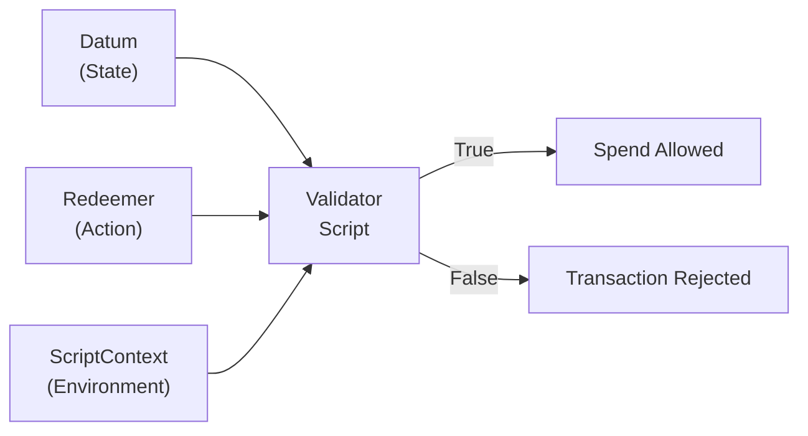
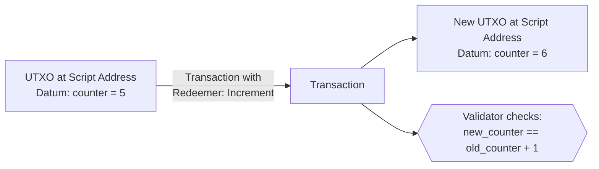

# Pelajaran #09: Datum, Redeemer, dan ScriptContext

Setiap validator Cardano menerima tepat tiga argumen: datum (state yang terkunci di alamat script), redeemer (aksi yang dikirimkan oleh pembelanja), dan ScriptContext (snapshot komprehensif dari seluruh transaksi). Bersama-sama, ketiga argumen ini memberikan validator semua yang diperlukan untuk membuat keputusan otorisasi tentang apakah sebuah UTXO dapat dibelanjakan.

Dalam pelajaran ini, kita membedah setiap argumen secara mendalam, mengeksplorasi bagaimana mereka bekerja sama, memeriksa evolusi bagaimana datum disimpan di on-chain, memahami reference script, dan menyurvei pola-pola desain umum yang muncul dari arsitektur tiga argumen ini.

## Apa Tiga Argumen yang Diterima Setiap Validator Cardano?

Setiap validator Cardano menerima datum (state yang terkunci di UTXO), redeemer (aksi yang ingin dilakukan pembelanja), dan ScriptContext (snapshot lengkap transaksi termasuk semua input, output, tanda tangan, dan operasi pencetakan). Validator memeriksa ketiganya dan mengembalikan `True` (izinkan) atau `False` (tolak).



Ketika sebuah transaksi mencoba membelanjakan UTXO yang berada di alamat script, node Cardano memanggil script validator dengan ketiga argumen ini:

```
validator(datum, redeemer, scriptContext) -> Bool
```

1. **Datum**: Data yang terkait dengan UTXO yang dibelanjakan. Ia merepresentasikan "state" yang terkunci di alamat script.
2. **Redeemer**: Data yang disediakan oleh transaksi yang mencoba membelanjakan UTXO. Ia merepresentasikan "aksi" yang ingin dilakukan pembelanja.
3. **ScriptContext**: Snapshot komprehensif dari seluruh transaksi, termasuk semua input, output, tanda tangan, pencetakan, dan lainnya. Ia merepresentasikan "lingkungan" di mana validasi terjadi.

Mari kita eksplorasi masing-masing secara detail.

## Bagaimana Datum Merepresentasikan State di Cardano?

Datum adalah data terstruktur yang dilampirkan pada UTXO saat dibuat, mengkodekan informasi apa pun yang dibutuhkan validator untuk membuat keputusan tentang UTXO spesifik tersebut. Karena Cardano tidak memiliki penyimpanan kontrak persisten, state direpresentasikan melalui datum yang dilampirkan pada UTXO; "memperbarui" state berarti mengonsumsi UTXO lama dan membuat yang baru dengan datum yang diperbarui.

### Apa yang Dapat Dikandung Datum?

Datum dapat berupa data terstruktur apa pun yang dapat diserialisasi ke format data on-chain Cardano (PlutusData). Contoh umum meliputi:

- **Informasi kepemilikan**: Hash public key yang mengidentifikasi siapa yang diizinkan mengklaim UTXO.
- **Tenggat waktu**: Timestamp POSIX atau nomor slot setelah mana tindakan tertentu diizinkan atau dilarang.
- **Nilai state**: Counter, saldo, parameter konfigurasi, atau state spesifik aplikasi apa pun.
- **Hash atau pengidentifikasi**: Referensi ke data off-chain, UTXO lain, atau policy ID.

```
-- Example: Escrow datum
EscrowDatum {
  beneficiary: PubKeyHash,       -- who can claim
  deadline: POSIXTime,           -- when the deadline expires
  refund_address: PubKeyHash     -- who gets a refund after deadline
}

-- Example: Auction datum
AuctionDatum {
  seller: PubKeyHash,
  highest_bid: Integer,
  highest_bidder: PubKeyHash,
  lot_asset: AssetClass,
  min_bid_increment: Integer,
  auction_end: POSIXTime
}
```

### Bagaimana Manajemen State Berbasis Datum Bekerja?

Dalam sistem berbasis akun seperti Ethereum, state smart contract berada di variabel penyimpanan persisten. Di Cardano, tidak ada penyimpanan persisten. Sebaliknya, **state dikodekan dalam datum yang dilampirkan pada UTXO**.

Ketika validator ingin "memperbarui" state-nya, transaksi mengonsumsi UTXO lama (dengan datum lama) dan membuat UTXO baru di alamat script yang sama (dengan datum yang diperbarui). Validator memeriksa bahwa transisi state valid.



Pola ini (mengonsumsi UTXO dan membuatnya kembali dengan state yang diperbarui) adalah mekanisme fundamental untuk manajemen state di Cardano. Kadang disebut **pola "continuing output"** karena alamat script terus menyimpan UTXO, hanya dengan data baru.

### Apa Perbedaan Antara Datum Hash dan Inline Datum?

Secara historis, Cardano menyimpan datum dalam dua cara, dan memahami evolusinya penting:

**Datum Hash (pra-Vasil)**: UTXO itu sendiri hanya berisi *hash* dari datum. Data datum aktual harus disediakan dalam transaksi yang membuat UTXO (disimpan dalam data auxiliary transaksi) atau dalam transaksi yang membelanjakannya. Ini berarti:
- Untuk membelanjakan UTXO, Anda perlu mengetahui datum lengkap (bukan hanya hash-nya).
- Datum harus disertakan dalam transaksi pembelanjaan, meningkatkan ukurannya.
- Jika datum besar, ini meningkatkan biaya secara signifikan.
- Jika Anda kehilangan jejak datum, UTXO menjadi tidak dapat dibelanjakan secara efektif (dana terkunci selamanya).

**Inline Datum (pasca-Vasil, CIP-32)**: Sejak hard fork Vasil, datum dapat disimpan langsung ("inline") di UTXO itu sendiri. Ini berarti:
- Siapa pun dapat membaca datum dengan memeriksa UTXO di on-chain.
- Transaksi pembelanjaan tidak perlu menyertakan datum lengkap secara terpisah.
- Tidak ada risiko kehilangan jejak data datum.
- Transaksi lain dapat mereferensikan datum ini melalui reference input (CIP-31).

```
Pre-Vasil UTXO:                    Post-Vasil UTXO:
+---------------------+            +---------------------+
| Address             |            | Address             |
| Value               |            | Value               |
| Datum Hash: 0xabc.. |            | Inline Datum:       |
+---------------------+            |   { counter: 5,     |
                                   |     owner: 0x123 }  |
Full datum must be                 +---------------------+
stored and provided
separately                         Datum is right there,
                                   readable by anyone
```

**Praktik Terbaik**: Gunakan inline datum untuk hampir semua pengembangan baru. Datum hash masih berfungsi untuk kompatibilitas mundur, tetapi inline datum lebih unggul di hampir setiap skenario.

## Bagaimana Redeemer Merepresentasikan Aksi dalam Smart Contract Cardano?

Redeemer adalah data yang disediakan oleh transaksi yang mencoba membelanjakan UTXO, memberitahu validator tindakan apa yang ingin dilakukan pembelanja. Strukturnya sepenuhnya ditentukan oleh validator (protokol tidak memberlakukan persyaratan apa pun), dan umumnya mengambil bentuk konstruktor aksi bertag yang memungkinkan satu validator mendukung beberapa operasi yang berbeda.

### Apa yang Dapat Dikandung Redeemer?

Redeemer dapat berupa nilai PlutusData apa pun. Pola umum meliputi:

**Nilai sederhana**: Password, rahasia, angka.
```
-- Simple: just provide the secret
Redeemer = ByteString   -- the secret that hashes to the datum
```

**Tag aksi**: Enumerasi yang menentukan aksi mana yang ingin dilakukan pembelanja.
```
-- Tagged actions for a multi-action contract
Redeemer =
  | Bid { amount: Integer }
  | Close
  | Cancel
  | Update { new_price: Integer }
```

**Data bukti**: Bukti bahwa pembelanja berwenang.
```
-- Merkle proof for airdrop claiming
Redeemer = MerkleProof {
  leaf_index: Integer,
  proof_hashes: List<ByteString>
}
```

### Bagaimana Validator Multi-Aksi Menggunakan Redeemer?

Redeemer memberitahu validator *jenis operasi apa* yang dicoba pembelanja. Ini memungkinkan satu validator mendukung beberapa operasi yang berbeda. Validator melakukan pattern match pada redeemer untuk menentukan aturan validasi mana yang akan diterapkan:

```
validator multi_action(datum: State, redeemer: Action, ctx: ScriptContext) -> Bool {
  when redeemer is {
    Bid { amount } ->
      -- Check bid is higher than current, signed by bidder, etc.
      validate_bid(datum, amount, ctx)

    Close ->
      -- Check auction has ended, winner gets the lot, seller gets payment
      validate_close(datum, ctx)

    Cancel ->
      -- Check only the seller can cancel, and only before any bids
      validate_cancel(datum, ctx)
  }
}
```

Pola ini ada di mana-mana dalam pengembangan smart contract Cardano. Hampir setiap validator non-trivial menggunakan redeemer dengan beberapa konstruktor untuk merepresentasikan operasi yang berbeda.

### Bagaimana Ukuran Redeemer Memengaruhi Biaya Transaksi?

Redeemer disertakan dalam body transaksi, sehingga ukurannya memengaruhi biaya transaksi. Jaga redeemer sekecil mungkin secara praktis. Jika redeemer Anda menyertakan Merkle proof besar atau data besar lainnya, ini akan meningkatkan biaya.

## Informasi Apa yang Disediakan ScriptContext untuk Validator?

ScriptContext adalah yang terkaya dari ketiga argumen: struktur data komprehensif yang disediakan oleh node Cardano yang mendeskripsikan seluruh transaksi yang sedang divalidasi. Ia berisi TxInfo (semua input, output, tanda tangan, pencetakan, biaya, rentang validitas, dan lainnya) ditambah ScriptPurpose yang menunjukkan mengapa validator dipanggil (spending, minting, certifying, atau rewarding).

### Apa yang Terkandung dalam TxInfo?

```
TxInfo {
  inputs:             List<TxInInfo>,       -- all inputs being consumed
  reference_inputs:   List<TxInInfo>,       -- all reference inputs (read-only)
  outputs:            List<TxOut>,          -- all outputs being created
  fee:                Value,                -- transaction fee
  mint:               Value,                -- tokens being minted/burned
  certificates:       List<DCert>,          -- stake certificates
  withdrawals:        Map<StakingCred, Int>,-- reward withdrawals
  valid_range:        POSIXTimeRange,       -- validity interval
  signatories:        List<PubKeyHash>,     -- who signed the transaction
  redeemers:          Map<ScriptPurpose, Redeemer>,
  datums:             Map<DatumHash, Datum>,
  id:                 TxId                  -- the transaction hash
}
```

### Apa Itu ScriptPurpose?

ScriptPurpose memberitahu validator *mengapa* ia dipanggil:

```
ScriptPurpose =
  | Spending TxOutRef      -- spending a UTXO at a script address
  | Minting PolicyId       -- minting/burning tokens under this policy
  | Certifying DCert       -- issuing a stake certificate
  | Rewarding StakeCred    -- withdrawing staking rewards
  | Voting Voter           -- governance voting (Plutus V3)
  | Proposing              -- governance proposals (Plutus V3)
```

### Apa yang Biasanya Diperiksa Validator di ScriptContext?

ScriptContext adalah tempat sebagian besar logika validasi yang menarik terjadi. Berikut adalah pemeriksaan yang paling umum:

**Verifikasi tanda tangan**: "Apakah transaksi ditandatangani oleh key yang diharapkan?"
```
-- Check that the datum's owner signed the transaction
list.has(ctx.transaction.signatories, datum.owner)
```

**Inspeksi output**: "Apakah transaksi membuat output yang benar?"
```
-- Check that value is sent to the correct address
expect Some(output) = find_output_to(ctx.transaction.outputs, beneficiary_address)
output.value >= expected_amount
```

**Pemeriksaan rentang waktu**: "Apakah transaksi dalam jendela waktu yang diizinkan?"
```
-- Check that the deadline has passed
valid_range_start(ctx.transaction.valid_range) > datum.deadline
```

**Inspeksi pencetakan**: "Apakah token yang benar sedang dicetak?"
```
-- Check that exactly one token is minted under our policy
let minted = ctx.transaction.mint
quantity_of(minted, own_policy_id, token_name) == 1
```

**Penghitungan input**: "Apakah UTXO yang tepat sedang dikonsumsi?"
```
-- Check that the oracle UTXO is included as a reference input
list.any(ctx.transaction.reference_inputs, fn(input) {
  input.output.address == oracle_address
})
```

### Mengapa ScriptContext Begitu Powerful?

ScriptContext adalah apa yang membuat validator Cardano begitu ekspresif meskipun "hanya" fungsi boolean. Validator dapat memberlakukan kondisi kompleks tentang *seluruh transaksi*, bukan hanya UTXO tunggal yang dijaganya. Ini memungkinkan pola yang tidak mungkin jika validator hanya bisa melihat input mereka sendiri:

- **Koordinasi multi-validator**: Dua validator yang berjalan dalam transaksi yang sama masing-masing dapat memeriksa kondisi yang diberlakukan oleh yang lain, menciptakan logika validasi kooperatif tanpa komunikasi langsung.
- **Atomic swap**: Validator dapat memverifikasi bahwa output tertentu ada dalam transaksi, memungkinkan pertukaran trustless dalam satu transaksi.
- **Pola forwarder**: Validator dapat mendelegasikan keputusannya ke validator lain dengan memeriksa bahwa input script lain ada dalam transaksi.

## Apa Pola Desain Smart Contract Umum di Cardano?

Beberapa pola desain telah muncul dari arsitektur datum-redeemer-context, termasuk state machine, koordinasi multi-validator, jaminan keunikan one-shot, trik withdraw-zero untuk efisiensi, dan token beacon/pointer untuk kemudahan penemuan UTXO. Memahami pola-pola ini sangat penting untuk desain smart contract di Cardano.

### Pola 1: State Machine

State machine mengkodekan serangkaian state terbatas dalam datum dan serangkaian transisi dalam redeemer. Validator memeriksa bahwa setiap transisi valid mengingat state saat ini.

```
Datum (State):          Redeemer (Transition):
  | Collecting          | Contribute { amount }
  | Funded              | Dispute
  | Disputed            | Resolve { ruling }
  | Completed           | Complete

Validator checks:
  Collecting + Contribute -> is amount sufficient? -> Collecting or Funded
  Funded + Dispute -> is disputer authorized? -> Disputed
  Disputed + Resolve -> is resolver the arbiter? -> Completed
  Funded + Complete -> has timeout passed? -> Completed
```

Transaksi mengonsumsi UTXO dengan state lama dan membuat UTXO baru dengan state baru. Validator memverifikasi transisi tersebut legal.

### Pola 2: Multi-Validator (Validator Linking)

Aplikasi yang kompleks sering menggunakan beberapa validator yang bekerja sama dalam satu transaksi. Misalnya, DEX (decentralized exchange) mungkin memiliki:

- **Validator liquidity pool** yang menjaga cadangan pool.
- **Minting policy** yang mengontrol token LP.
- **Validator order** yang menyimpan order swap yang tertunda.

Ketiga validator berjalan dalam satu transaksi. Validator liquidity pool memeriksa bahwa minting policy membuat token LP yang benar. Minting policy memeriksa bahwa UTXO pool sedang dikonsumsi. Mereka tidak saling memanggil; mereka secara independen memverifikasi kondisi tentang transaksi yang sama melalui ScriptContext.

```
Single Transaction:
  Inputs:
    - Pool UTXO (guarded by pool validator)
    - Order UTXO (guarded by order validator)

  Mint:
    - LP tokens (guarded by minting policy)

  Outputs:
    - Updated Pool UTXO (new reserves)
    - LP tokens to liquidity provider
    - Swapped tokens to trader

Each validator independently checks its rules against ScriptContext:
  Pool validator:  "Are reserves correctly updated? Are LP tokens minted?"
  Order validator: "Is the swap executed at the correct price?"
  Minting policy:  "Is the pool UTXO consumed? Is the amount correct?"
```

### Pola 3: Pola One-Shot

Pola one-shot menggunakan UTXO spesifik sebagai input untuk menjamin keunikan. Karena setiap UTXO hanya dapat dibelanjakan sekali, validator atau minting policy yang memerlukan UTXO spesifik sebagai input hanya dapat berhasil sekali. Ini umumnya digunakan untuk:

- **Pencetakan token unik**: Mencetak NFT dengan memerlukan UTXO spesifik sebagai input. Karena UTXO itu tidak pernah bisa ada lagi, pencetakan tidak pernah bisa diulang.
- **Inisialisasi kontrak**: Memastikan state awal kontrak hanya dapat dibuat sekali.

### Pola 4: Trik Withdraw Zero

Pola cerdas di mana spending validator mendelegasikan logikanya ke staking validator dengan memerlukan penarikan nol-ADA dari alamat staking script. Staking validator berjalan sekali untuk seluruh transaksi (terlepas dari berapa banyak input yang memicunya), sementara spending validator berjalan sekali per input. Ini lebih efisien ketika transaksi membelanjakan banyak UTXO dari alamat script yang sama.

```
Spending validator (runs per input):
  "Check that the transaction includes a withdrawal from staking_script_address"

Staking validator (runs once for the whole transaction):
  "Perform the actual validation logic for all inputs"
```

### Pola 5: Token Beacon/Pointer

Token beacon adalah native token yang terkunci di alamat script bersamaan dengan datum. Ia berfungsi sebagai "pointer" yang membuat UTXO mudah ditemukan. Tanpa beacon, menemukan UTXO spesifik di alamat script memerlukan pemindaian semua UTXO di alamat tersebut dan memeriksa datum mereka. Dengan token beacon (token unik yang disimpan di alamat script), Anda dapat melakukan query chain untuk lokasi token dan segera menemukan UTXO yang tepat.

```
UTXO at script address:
  Value: 5 ADA + 1 BEACON_TOKEN
  Datum: { state data... }

Querying for BEACON_TOKEN immediately locates this specific UTXO
among potentially thousands at the same script address.
```

## Bagaimana Reference Script (CIP-33) Mengurangi Biaya Transaksi?

Reference script memungkinkan validator yang dikompilasi disimpan sekali dalam UTXO dan direferensikan oleh semua transaksi masa depan yang membutuhkannya, alih-alih menyertakan byte script lengkap di setiap transaksi. Ini mengurangi ukuran transaksi (menurunkan biaya), menghilangkan batas praktis pada kompleksitas validator, dan memungkinkan biaya deployment satu kali yang dibagi di antara semua pengguna.

```
Step 1: Store the script in a UTXO
  Transaction creates:
    UTXO_Script at some_address
      Value: min ADA
      Reference Script: [compiled validator bytecode]

Step 2: Use the script via reference
  Transaction spends from script_address:
    Reference Input: UTXO_Script (not consumed, just referenced)
    Input: UTXO at script_address (being spent)
    Redeemer: { action data }

    The node reads the script from UTXO_Script
    and uses it to validate the spend.
```

### Apa Manfaat Reference Script?

- **Biaya lebih rendah**: Transaksi tidak menyertakan byte script, yang dapat menghemat ribuan byte.
- **Biaya deployment satu kali**: Script disimpan sekali dan digunakan kembali oleh semua transaksi.
- **Validator lebih besar**: Karena script tidak ada dalam transaksi, batas ukuran per transaksi kurang membatasi.
- **Pengalaman pengguna lebih baik**: Wallet tidak perlu memiliki script secara lokal; mereka hanya mereferensikan salinan on-chain.

### Bagaimana Anda Men-deploy Reference Script?

Men-deploy reference script biasanya bekerja seperti ini:

1. Kompilasi validator Anda ke UPLC.
2. Buat transaksi yang menghasilkan UTXO yang berisi script yang dikompilasi di field reference script-nya.
3. Kirim UTXO ini ke alamat yang Anda kontrol (agar Anda dapat mengelolanya, meskipun tidak perlu dibelanjakan; hanya perlu ada).
4. Distribusikan referensi UTXO (transaction hash + index) ke pengguna dan aplikasi off-chain.
5. Semua transaksi berikutnya yang berinteraksi dengan validator Anda mereferensikan UTXO ini alih-alih menyertakan script.

UTXO reference script harus tetap tidak dibelanjakan selama Anda ingin ia tersedia. Jika dikonsumsi, transaksi yang mereferensikannya akan gagal. Inilah mengapa reference script biasanya dikirim ke alamat di mana mereka tidak akan secara tidak sengaja dibelanjakan.

## Bagaimana Datum, Redeemer, dan ScriptContext Bekerja Bersama?

Mari kita telusuri contoh lengkap untuk melihat bagaimana datum, redeemer, dan ScriptContext bekerja bersama. Pertimbangkan kontrak vesting sederhana: Alice mengunci 1000 ADA untuk Bob, yang dapat mengklaimnya setelah tanggal tertentu.

**Langkah 1: Kunci dana**

Alice membuat transaksi dengan output di alamat script vesting:
```
Output:
  Address: vesting_script_address
  Value: 1000 ADA
  Inline Datum: {
    beneficiary: Bob's PubKeyHash,
    deadline: 1735689600  (January 1, 2025, as POSIX time)
  }
```

**Langkah 2: Bob mengklaim (setelah tenggat waktu)**

Bob membangun transaksi pembelanjaan:
```
Input: The UTXO Alice created (at vesting_script_address)
Redeemer: Claim   (a simple tag indicating the action)
Output: 999.8 ADA to Bob's wallet address
Fee: 0.2 ADA
Validity Interval: invalid_before = slot corresponding to Jan 2, 2025
Signatures: Bob's signature
```

**Langkah 3: Validator dieksekusi**

Node memanggil validator vesting dengan:

- **Datum**: `{ beneficiary: Bob's PubKeyHash, deadline: 1735689600 }`
- **Redeemer**: `Claim`
- **ScriptContext**: Informasi transaksi lengkap, termasuk:
  - `signatories`: [Bob's PubKeyHash]
  - `valid_range`: dimulai setelah 1 Januari 2025
  - `outputs`: [999.8 ADA ke alamat Bob]

Validator memeriksa:
1. Apakah transaksi ditandatangani oleh `datum.beneficiary` (Bob)? Periksa `ctx.transaction.signatories`.
2. Apakah tenggat waktu telah berlalu? Periksa bahwa `datum.deadline` sebelum awal `ctx.transaction.valid_range`.

Kedua kondisi benar, sehingga validator mengembalikan `True`, dan transaksi dimasukkan ke dalam blok berikutnya.

**Langkah 3b: Bagaimana jika seseorang mencoba mengklaim lebih awal?**

Jika Eve mencoba mengklaim sebelum tenggat waktu dengan interval validitas yang dimulai sebelum 1 Januari 2025, validator memeriksa kondisi waktu dan mengembalikan `False`. Transaksi ditolak. Eve tidak membayar apa-apa karena transaksi tidak pernah masuk ke on-chain.

## Analogi Web2

**Datum sebagai Baris Database**: Datum seperti baris dalam tabel database. Ia menyimpan data terstruktur ("state") yang terkait dengan rekaman tertentu (UTXO). Ketika Anda memperbarui state, Anda pada dasarnya melakukan DELETE baris lama dan INSERT yang baru (mengonsumsi UTXO lama, membuat yang baru). Validator bertindak seperti constraint database atau trigger yang memeriksa pembaruan valid.

**Redeemer sebagai Body Request API**: Redeemer seperti body JSON dari request POST atau PUT ke REST API. Ia memberitahu server (validator) tindakan apa yang ingin dilakukan klien dan menyediakan data yang diperlukan untuk melakukannya. Body request `{ "action": "bid", "amount": 500 }` persis analog dengan redeemer `Bid { amount: 500 }`.

**ScriptContext sebagai Request Context / Middleware**: ScriptContext seperti konteks HTTP request lengkap yang tersedia untuk middleware di Express atau Django; ia mencakup header request (tanda tangan), body request (redeemer, input), respons yang sedang dikonstruksi (output), informasi autentikasi (signatories), dan informasi waktu (interval validitas). Sama seperti middleware dapat memeriksa aspek apa pun dari request untuk membuat keputusan otorisasi, validator dapat memeriksa aspek apa pun dari transaksi.

**Inline Datum sebagai Embedded Document (MongoDB)**: Pergeseran dari datum hash ke inline datum analog dengan perbedaan antara menyimpan foreign key (referensi ke data di tempat lain) versus menyematkan dokumen lengkap secara langsung (seperti di MongoDB). Inline datum adalah pendekatan "embedded document"; datanya ada di situ, mandiri dan langsung dapat diakses.

**Reference Script sebagai Shared Library / CDN**: Reference script seperti library JavaScript yang di-host di CDN. Alih-alih setiap halaman membundel jQuery secara lokal, mereka semua mereferensikan salinan CDN yang sama. Demikian pula, alih-alih setiap transaksi menyertakan script validator lengkap, mereka semua mereferensikan salinan on-chain yang sama. Manfaatnya sama: payload lebih kecil, pemuatan lebih cepat, dan pembaruan sumber tunggal.

**State Machine sebagai Workflow Engine**: Pola state machine dipetakan langsung ke workflow engine yang mungkin pernah Anda gunakan: alat seperti AWS Step Functions, Temporal, atau bahkan state machine sederhana di Redux. Setiap state (datum) memiliki serangkaian transisi yang valid (redeemer), dan engine (validator) memastikan transisi mengikuti aturan yang ditentukan.

**Multi-Validator sebagai Transaksi Microservices**: Pola multi-validator seperti transaksi terdistribusi di seluruh microservices. Dalam pola saga, beberapa layanan masing-masing memvalidasi bagian mereka dari sebuah operasi. Di Cardano, beberapa validator masing-masing memeriksa bagian mereka dari transaksi. Perbedaan utamanya adalah pendekatan Cardano bersifat atomik; semua validator harus setuju, atau seluruh transaksi gagal. Tidak ada kegagalan parsial yang perlu ditangani.

## Poin-Poin Penting

- **Datum adalah state**: ia merepresentasikan data yang terkunci di alamat script, mengkodekan informasi apa pun yang dibutuhkan validator. Gunakan inline datum untuk semua pengembangan baru.
- **Redeemer adalah aksi**: ia merepresentasikan apa yang ingin dilakukan pembelanja, biasanya menggunakan konstruktor bertag untuk mendukung beberapa operasi dalam satu validator.
- **ScriptContext adalah lingkungan**: ia menyediakan tampilan lengkap transaksi, memungkinkan validator memberlakukan aturan tentang input, output, tanda tangan, waktu, pencetakan, dan lainnya.
- **State dikelola melalui konsumsi dan pembuatan UTXO**: pola "continuing output" menggantikan penyimpanan mutable dengan transisi state atomik.
- **Reference script dan inline datum secara dramatis meningkatkan efisiensi**: mereka mengurangi ukuran transaksi, menurunkan biaya, dan menyederhanakan pengembangan off-chain.

## Apa Selanjutnya

Dengan pemahaman yang solid tentang bagaimana validator bekerja dan data apa yang mereka terima, kita siap mengeksplorasi salah satu fitur paling khas Cardano: native token. Di Pelajaran 10, kita mempelajari bagaimana minting policy menggunakan arsitektur datum-redeemer-context yang sama untuk mengontrol pembuatan token dan bagaimana ledger multi-aset Cardano berbeda secara fundamental dari model token di chain lain.
