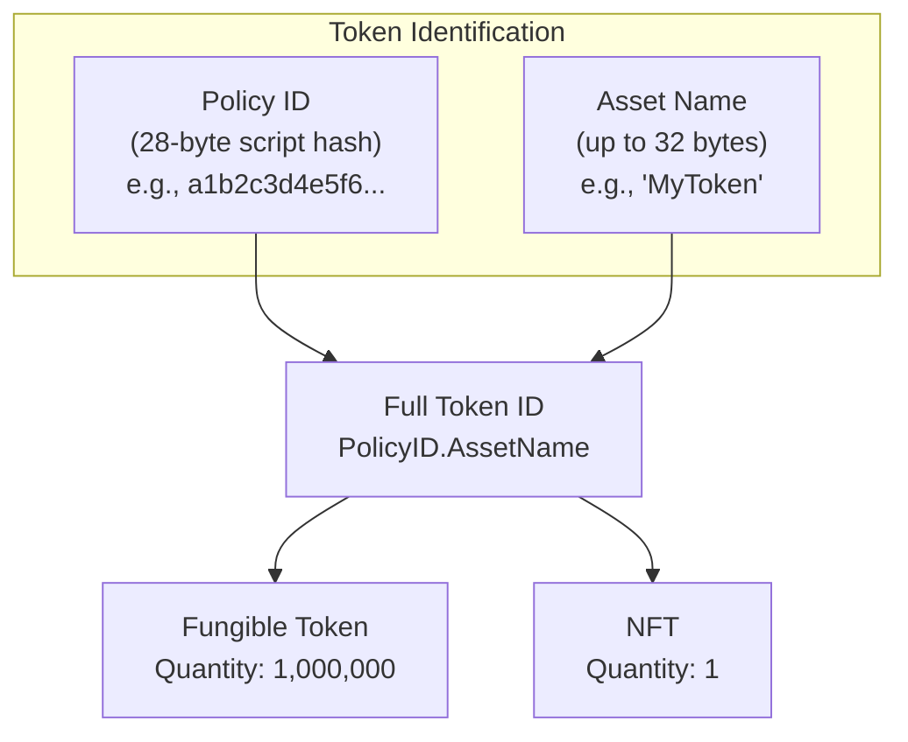
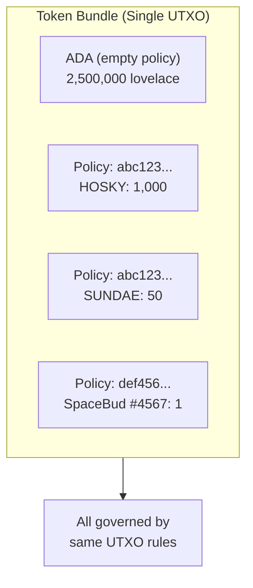
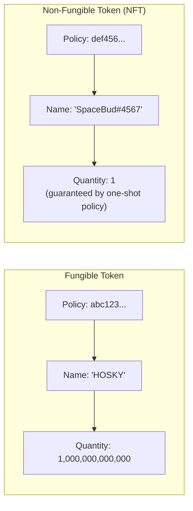
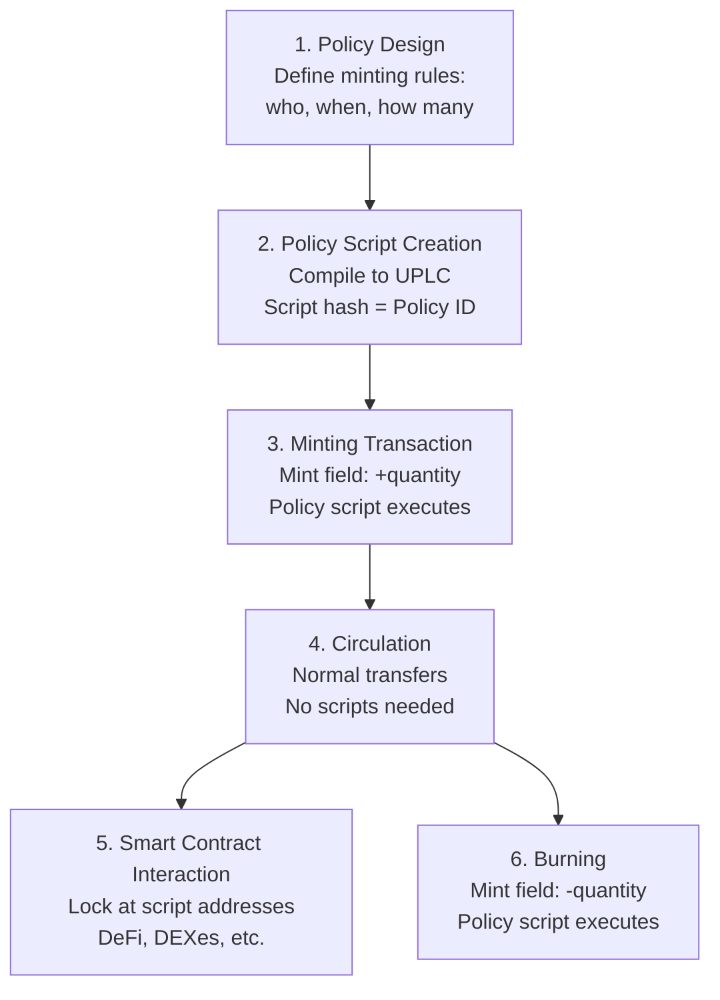

# Pelajaran #10: Native Token dan Minting Policy

Native token Cardano adalah aset kustom yang dilacak langsung oleh infrastruktur ledger protokol, bersamaan dengan ADA, tanpa memerlukan smart contract untuk transfer dasar. Tidak seperti token ERC-20 dan ERC-721 Ethereum (yang merupakan smart contract yang memelihara ledger mereka sendiri), token Cardano hidup secara native dalam sistem UTXO yang sama dengan ADA, membuat transfer lebih murah, lebih aman, dan composable secara atomik.

Dalam pelajaran ini, kita mengeksplorasi bagaimana native token bekerja di Cardano, dari dasar-dasar policy ID dan asset name hingga minting policy yang mengontrol pembuatan token. Anda akan mempelajari perbedaan antara token fungible dan NFT, memahami persyaratan min ADA untuk UTXO yang mengandung token, dan melihat bagaimana minting policy terhubung dengan semua yang Anda pelajari di pelajaran sebelumnya tentang validator, datum, dan redeemer.

## Apa yang Membuat Token Cardano "Native" Dibandingkan Blockchain Lain?

Token Cardano bersifat "native" karena ledger protokol melacaknya menggunakan mekanisme UTXO yang sama yang melacak ADA, tanpa memerlukan eksekusi smart contract untuk transfer dasar. Ini berarti biaya lebih rendah, tidak ada risiko eksekusi kontrak untuk transfer, transaksi multi-aset atomik dalam satu output, dan aturan konservasi tingkat protokol yang mencegah token dibuat atau dibelanjakan secara tidak sah.

Di Ethereum, membuat token berarti men-deploy smart contract yang mengimplementasikan antarmuka (ERC-20 untuk token fungible, ERC-721 untuk NFT). Ledger token (siapa memiliki berapa banyak) disimpan dalam state kontrak. Mentransfer token berarti memanggil fungsi `transfer` kontrak, yang memperbarui variabel penyimpanan.

Di Cardano, token bersifat **native**; mereka dilacak oleh mekanisme ledger yang sama yang melacak ADA. Ketika Anda mengirim native token dalam transaksi, protokol menanganinya sama seperti menangani ADA: melalui input dan output. Tidak diperlukan eksekusi smart contract untuk transfer dasar.

## Bagaimana Token Diidentifikasi di Cardano?

Setiap native token di Cardano diidentifikasi secara unik oleh dua komponen: Policy ID (hash 28-byte dari script minting policy yang mengotorisasi pembuatan token) dan Asset Name opsional (hingga 32 byte yang membedakan token individual dalam policy yang sama). Bersama-sama, keduanya membentuk pengidentifikasi unik global yang immutable.



### Apa Itu Policy ID?

**Policy ID** adalah hash dari script minting policy yang mengotorisasi pembuatan token. Ia adalah pengidentifikasi 28-byte (56 karakter heksadesimal) yang mengelompokkan token terkait bersama. Semua token yang dicetak di bawah policy yang sama berbagi policy ID yang sama.

```
Policy ID: a1b2c3d4e5f6...  (56 hex characters)
```

Policy ID bersifat immutable; ia diturunkan dari hash script, jadi mengubah minting policy akan mengubah policy ID, menciptakan token yang sepenuhnya berbeda. Ini berarti aturan untuk mencetak dan membakar token dikodekan secara permanen dalam identitasnya.

### Apa Itu Asset Name?

**Asset name** adalah label opsional (hingga 32 byte) yang membedakan token individual dalam policy yang sama. Untuk token fungible, biasanya ada satu asset name. Untuk koleksi NFT, setiap NFT memiliki asset name unik di bawah policy yang sama.

```
Policy ID: a1b2c3d4e5f6...
Asset Name: "MyToken"        (for a fungible token)

Policy ID: a1b2c3d4e5f6...
Asset Name: "Ape#0001"       (for NFT #1 in a collection)
Asset Name: "Ape#0002"       (for NFT #2 in the same collection)
```

Asset name dapat kosong (nol byte), yang valid dan kadang digunakan untuk policy token tunggal.

### Mengapa ADA Istimewa?

ADA adalah satu-satunya token di Cardano yang tidak memiliki policy ID. Ia adalah **mata uang dasar** protokol: unit di mana biaya dibayar, reward didistribusikan, dan nilai UTXO minimum dihitung. Dalam struktur nilai multi-aset, ADA direpresentasikan dengan policy ID kosong dan asset name kosong:

```
Value structure:
{
  "": {                          -- ADA (empty policy ID)
    "": 5000000                  -- 5 ADA in lovelace (empty asset name)
  },
  "a1b2c3...": {                 -- Custom token policy
    "MyToken": 100               -- 100 units of MyToken
  },
  "d4e5f6...": {                 -- NFT policy
    "UniqueArt": 1               -- 1 NFT
  }
}
```

Struktur nilai ini (peta bersarang dari policy ID ke asset name ke kuantitas) disebut **token bundle** atau **multi-asset value**.

## Bagaimana Token Bundle dan Multi-Asset Value Bekerja?

Token bundle adalah struktur peta bersarang (`Map<PolicyID, Map<AssetName, Quantity>>`) yang memungkinkan satu UTXO membawa ADA ditambah sejumlah native token berbeda secara bersamaan. Semua aset dalam bundle berjalan bersama, ditransfer dalam satu output transaksi, dan diatur oleh aturan UTXO yang sama, memungkinkan transaksi multi-aset atomik.



### Bagaimana Tipe Value Bekerja?

Di Cardano, field "value" dari setiap UTXO bukan hanya angka (jumlah ADA). Ia adalah peta terstruktur:

```
Value = Map<PolicyID, Map<AssetName, Quantity>>
```

Ini berarti satu output dapat berisi:

```
Output value:
  2.5 ADA
  + 1000 HOSKY tokens
  + 50 SUNDAE tokens
  + 1 SpaceBudz #4567 NFT
  + 3 WingRiders LP tokens
```

Semuanya berjalan bersama dalam satu UTXO, ditransfer dalam satu output transaksi, dan diatur oleh aturan UTXO yang sama.

### Apa Implikasi Token Bundle?

**Efisiensi**: Membundel beberapa aset dalam satu UTXO lebih efisien dalam penyimpanan daripada memiliki UTXO terpisah untuk setiap jenis token.

**Transfer atomik**: Anda dapat mengirim beberapa jenis token berbeda ke seseorang dalam satu output. Ini memungkinkan atomic swap dan transaksi multi-aset yang kompleks.

**Kompleksitas dalam coin selection**: Saat membangun transaksi, algoritma coin selection harus mempertimbangkan tidak hanya saldo ADA tetapi komposisi multi-aset lengkap dari setiap UTXO. Ini secara signifikan lebih kompleks daripada coin selection aset tunggal.

**Dampak min ADA**: Lebih banyak token dalam satu output berarti lebih banyak byte, yang berarti persyaratan ADA minimum lebih tinggi (dibahas di bawah).

## Bagaimana Minting Policy Mengontrol Pembuatan dan Penghancuran Token?

Minting policy adalah script yang menerima dua argumen (redeemer dan ScriptContext) dan mengembalikan keputusan boolean tentang apakah token dapat dicetak (dibuat dengan kuantitas positif) atau dibakar (dihancurkan dengan kuantitas negatif) di bawah policy ID-nya. Policy dieksekusi setiap kali field `mint` transaksi menyertakan token di bawah policy tersebut, dan policy ID itu sendiri adalah hash dari script.

Minting policy menerima dua argumen (bukan tiga seperti spending validator):

```
minting_policy(redeemer, scriptContext) -> Bool
```

Tidak ada datum untuk minting policy; mereka tidak terkait dengan UTXO spesifik yang dibelanjakan. Sebaliknya, mereka mengevaluasi berdasarkan redeemer yang disediakan oleh transaksi dan ScriptContext lengkap.

Field `purpose` ScriptContext akan menjadi `Minting(policy_id)`, memberitahu script bahwa ia dipanggil sebagai minting policy. Script kemudian dapat memeriksa transaksi untuk menentukan apakah pencetakan atau pembakaran harus diizinkan.

### Bagaimana Minting dan Burning Berbeda?

- **Minting**: Membuat token baru. Field `mint` berisi kuantitas positif.
- **Burning**: Menghancurkan token yang ada. Field `mint` berisi kuantitas negatif.

Minting policy dipanggil untuk kedua operasi. Ia dapat memilih untuk mengizinkan pencetakan tetapi bukan pembakaran, atau sebaliknya, atau menerapkan aturan berbeda untuk masing-masing.

```
Transaction with minting:
  Mint: { policy_abc: { "Token": +100 } }    -- mint 100 tokens

Transaction with burning:
  Mint: { policy_abc: { "Token": -50 } }     -- burn 50 tokens

Transaction with both:
  Mint: {
    policy_abc: { "Token": +100 },           -- mint 100 Token
    policy_xyz: { "OtherToken": -25 }         -- burn 25 OtherToken
  }
```

## Jenis Minting Policy Apa yang Dapat Anda Buat di Cardano?

Cardano mendukung beberapa jenis minting policy: policy native script sederhana (berbasis tanda tangan dan time-lock, tanpa Plutus), policy one-shot (menjamin pencetakan sekali pakai melalui konsumsi UTXO), policy berparameter (dengan konfigurasi waktu kompilasi), dan policy Plutus multi-aksi (mendukung beberapa operasi melalui pattern matching redeemer).

### Policy Script Sederhana (Tanpa Plutus)

Minting policy paling sederhana menggunakan bahasa native script Cardano (bukan Plutus) dan hanya memerlukan tanda tangan dan/atau batasan waktu:

**Berbasis tanda tangan**: "Hanya pemegang key X yang dapat mencetak token di bawah policy ini."
```
Policy: RequireSignature(pub_key_hash_of_issuer)
```

**Terkunci waktu**: "Token hanya dapat dicetak sebelum slot N."
```
Policy: RequireAllOf [
  RequireSignature(pub_key_hash_of_issuer),
  RequireTimeBefore(slot_1000000)
]
```

Policy terkunci waktu sangat penting karena setelah jendela waktu ditutup, tidak ada seorang pun (bahkan penerbit asli) yang dapat mencetak lebih banyak token. Ini menciptakan **pasokan yang terbukti tetap**, yang merupakan jaminan kuat bagi pemegang token.

### Minting Policy One-Shot

Pola one-shot (disebutkan di Pelajaran 9) menggunakan Plutus untuk menjamin bahwa pencetakan hanya dapat terjadi sekali, selamanya. Policy memerlukan UTXO spesifik sebagai input transaksi:

```
one_shot_policy(redeemer, ctx: ScriptContext) -> Bool {
  // Check that a specific UTXO is consumed as input
  let must_consume = TxOutRef { tx_hash: specific_tx_hash, output_index: 0 }

  list.any(ctx.transaction.inputs, fn(input) {
    input.output_reference == must_consume
  })
}
```

Karena UTXO hanya dapat dibelanjakan sekali, dan policy ID diturunkan dari script (yang menyertakan referensi UTXO spesifik), minting policy ini hanya dapat berhasil sekali dalam seluruh sejarah blockchain. Ini adalah cara standar untuk membuat NFT di Cardano.

### Minting Policy Berparameter

Minting policy berparameter mengambil parameter pada waktu kompilasi yang dimasukkan ke dalam script. Ini menciptakan policy ID yang berbeda untuk nilai parameter yang berbeda:

```
parameterized_policy(oracle_address: Address) -> MintingPolicy {
  fn(redeemer, ctx) -> Bool {
    // Check oracle UTXO for current price
    let oracle_input = find_reference_input(ctx, oracle_address)
    let price = extract_price(oracle_input)

    // Apply minting rules based on oracle price
    price > minimum_threshold
  }
}
```

Parameterisasi sangat powerful karena memungkinkan Anda membuat keluarga policy terkait dengan konfigurasi berbeda, masing-masing dengan policy ID uniknya sendiri.

### Minting Policy Multi-Aksi

Sama seperti spending validator, minting policy dapat menggunakan redeemer untuk mendukung beberapa aksi:

```
nft_collection_policy(redeemer: Action, ctx: ScriptContext) -> Bool {
  when redeemer is {
    MintNFT { token_name } ->
      // Check: minting exactly 1 token, metadata is valid, signed by artist
      validate_mint(token_name, ctx)

    BurnNFT { token_name } ->
      // Check: burning exactly 1 token, signed by current holder
      validate_burn(token_name, ctx)

    MintCollectionToken ->
      // Check: one-shot condition met, creating collection reference NFT
      validate_collection_init(ctx)
  }
}
```

## Apa Perbedaan Antara Token Fungible dan NFT di Cardano?

Perbedaan antara token fungible dan NFT di Cardano hanyalah masalah kuantitas: token fungible memiliki kuantitas lebih dari satu (semua unit identik dan dapat dipertukarkan), sementara NFT memiliki kuantitas tepat satu (dijamin oleh minting policy one-shot). Keduanya menggunakan struktur identifikasi PolicyID/AssetName yang sama.



### Token Fungible

Token fungible memiliki kuantitas lebih dari 1 (biasanya jauh lebih banyak). Semua unit identik dan dapat dipertukarkan; 100 token HOSKY adalah sama terlepas dari unit spesifik mana yang Anda pegang.

Token fungible di Cardano dapat memiliki pasokan apa pun. Minting policy menentukan:
- Berapa banyak yang dapat dicetak (pasokan tetap, inflasi, terbatas, dll.).
- Siapa yang dapat mencetak (siapa saja, key tertentu, voting governance, dll.).
- Kapan mereka dapat dicetak (sebelum tenggat waktu, terus-menerus, per epoch, dll.).

### Non-Fungible Token (NFT)

NFT hanyalah token dengan kuantitas tepat 1. Minting policy menjamin bahwa hanya satu unit yang dapat ada. Pola one-shot yang dijelaskan di atas adalah pendekatan standar.

**Metadata NFT** (nama, gambar, deskripsi, atribut) biasanya dilampirkan pada transaksi pencetakan menggunakan standar metadata CIP-25 atau CIP-68:

- **CIP-25**: Metadata disimpan di field metadata transaksi (key 721) selama pencetakan. Ia tidak ada di UTXO itu sendiri tetapi dicatat secara permanen dalam transaksi di on-chain.
- **CIP-68**: Standar yang lebih canggih yang menyimpan metadata dalam inline datum pada reference NFT. Ini memungkinkan metadata diperbarui dengan mengonsumsi dan membuat ulang UTXO referensi.

```
CIP-68 pattern:
  Reference NFT (quantity: 1, asset name prefix: 000643b0):
    Locked at script address
    Inline datum: { name, image, attributes, ... }
    Can be updated by authorized transactions

  User NFT (quantity: 1, asset name prefix: 000de140):
    Held in user's wallet
    Proves ownership
    Metadata is read from the reference NFT
```

### Token Semi-Fungible

Beberapa token berada di antara fungible dan non-fungible. Kuantitas, misalnya, 100 dari nama token tertentu mungkin mewakili 100 tiket ke sebuah acara; masing-masing identik (fungible dalam set tersebut) tetapi mewakili kategori yang berbeda dari token lain.

## Bagaimana Min ADA Memengaruhi UTXO yang Mengandung Token?

Setiap UTXO yang mengandung token di Cardano harus berisi jumlah minimum ADA yang berskala dengan ukuran byte output. Setiap token tambahan menambahkan byte policy ID (28), byte asset name (hingga 32), dan byte kuantitas ke output yang diserialisasi, meningkatkan persyaratan ADA minimum dari sekitar 1,0 ADA untuk output sederhana menjadi 3-5+ ADA untuk output yang membawa banyak token berbeda.

### Mengapa Token Meningkatkan Min ADA?

Setiap token dalam UTXO menambahkan data ke output:
- Policy ID (28 byte).
- Asset name (hingga 32 byte).
- Kuantitas (integer ukuran variabel).

Lebih banyak token berarti output yang diserialisasi lebih besar, yang berarti lebih banyak byte, yang berarti persyaratan ADA minimum lebih tinggi.

### Berapa Perkiraan Min ADA Praktis?

```
ADA-only output:                          ~1.0 ADA
1 token (1 policy, 1 name):              ~1.2 ADA
1 NFT with CIP-68 inline datum:          ~1.5-2.0 ADA
5 different tokens (5 policies):          ~2.0 ADA
20 different tokens (various policies):   ~3.5-5.0 ADA
Output with many tokens near size limit:  ~7-10+ ADA
```

### Apa Implikasi Desainnya?

**Biaya distribusi token**: Jika Anda ingin melakukan airdrop token ke 10.000 wallet, setiap output memerlukan setidaknya ~1,2 ADA. Itu 12.000 ADA hanya untuk persyaratan min UTXO (wallet penerima akan menyimpan ADA ini bersamaan dengan token).

**Konsolidasi token**: Jika pengguna menerima banyak jumlah token kecil dalam UTXO terpisah, masing-masing membawa min ADA sendiri. Mengkonsolidasikan mereka (menggabungkan beberapa UTXO menjadi satu) membebaskan ADA berlebih.

**Biaya pencetakan NFT**: Setiap NFT yang Anda cetak harus dikirim dalam UTXO dengan min ADA. Untuk koleksi 10.000 NFT, ini mewakili persyaratan ADA yang signifikan selama proses pencetakan.

**Optimasi token bundle**: Mengirim beberapa jenis token dalam satu output lebih efisien ADA daripada mengirim masing-masing dalam output terpisah, karena overhead min ADA dibagi.

## Apa Siklus Hidup Lengkap Native Token di Cardano?

Siklus hidup native token mencakup enam tahap: desain policy (memutuskan aturan pencetakan), pembuatan script policy (mengompilasi untuk mendapatkan policy ID), transaksi pencetakan (membuat token di on-chain), sirkulasi (mentransfer melalui transaksi standar tanpa script), interaksi dengan smart contract (mengunci di alamat script untuk DeFi), dan pembakaran (menghapus token dari sirkulasi secara permanen).



### 1. Desain Policy

Pembuat memutuskan aturan pencetakan:
- Siapa yang dapat mencetak? (Key tertentu, siapa saja yang memenuhi kondisi, voting DAO?)
- Kapan mereka dapat mencetak? (Terbuka, terbatas waktu, sekali saja?)
- Berapa banyak? (Pasokan tetap, terbatas, tidak terbatas?)
- Dapatkah token dibakar? (Selalu, hanya oleh pemegang, tidak pernah?)

### 2. Pembuatan Script Policy

Minting policy ditulis sebagai native script atau validator Plutus/Aiken, kemudian dikompilasi. Hash script menjadi policy ID.

```
Source code (Aiken/Plutus)
  -> Compiled UPLC
  -> Script hash
  -> Policy ID: abc123def456...
```

### 3. Transaksi Pencetakan

Sebuah transaksi dibuat yang menyertakan:
- Field `mint`: `{ policy_id: { "TokenName": +quantity } }`
- Script minting policy (atau referensi ke sana).
- Redeemer untuk minting policy.
- Output yang menerima token yang baru dicetak (dengan min ADA).

Script minting policy dieksekusi dan harus mengembalikan `True` agar transaksi valid.

```
Minting Transaction:
  Inputs:
    - UTXO_funding (ADA to cover fees and min UTXO)

  Mint:
    - abc123...: { "MYTOKEN": +1000000 }

  Outputs:
    - 1000000 MYTOKEN + 1.5 ADA -> Creator's address
    - Change ADA -> Creator's address

  Fee: ~0.2 ADA

  Witnesses:
    - Minting policy script (or reference)
    - Redeemer: MintAction
    - Creator's signature
```

### 4. Sirkulasi

Setelah dicetak, token beredar melalui transaksi normal; tidak perlu script. Pengguna dapat mengirim, menerima, membagi, dan menggabungkan UTXO token menggunakan transaksi standar dengan biaya standar.

```
Transfer Transaction (no scripts):
  Inputs:
    - UTXO with 500 MYTOKEN + 2 ADA

  Outputs:
    - 200 MYTOKEN + 1.2 ADA -> Recipient
    - 300 MYTOKEN + 0.6 ADA -> Sender (change)

  Fee: ~0.18 ADA
```

### 5. Interaksi dengan Smart Contract

Token dapat dikunci di alamat script, digunakan dalam protokol DeFi, diperdagangkan di DEX, atau terlibat dalam logika smart contract apa pun. Validator di alamat script dapat memeriksa nilai token di ScriptContext sama seperti memeriksa nilai ADA.

### 6. Pembakaran

Jika minting policy mengizinkannya, token dapat dibakar dengan menyertakan kuantitas negatif di field `mint`. Script minting policy dieksekusi lagi untuk mengotorisasi pembakaran. Token yang dibakar dihapus secara permanen dari sirkulasi.

```
Burn Transaction:
  Inputs:
    - UTXO with 100 MYTOKEN + 1.5 ADA

  Mint:
    - abc123...: { "MYTOKEN": -100 }  (burning all 100)

  Outputs:
    - 1.3 ADA -> Sender (recovered min ADA minus fee)

  Fee: ~0.2 ADA
```

## Apa Standar Token Cardano?

Komunitas Cardano telah mengembangkan beberapa standar CIP (Cardano Improvement Proposal) untuk token: CIP-25 mendefinisikan metadata NFT yang dilampirkan saat pencetakan (di bawah key metadata transaksi 721), CIP-68 menyimpan metadata yang dapat diperbarui dalam inline datum pada reference NFT, dan CIP-26 menyediakan registri off-chain untuk informasi token yang mudah dibaca seperti nama, ticker, desimal, dan logo.

### CIP-25: Standar Metadata Media Token

CIP-25 mendefinisikan cara melampirkan metadata ke NFT selama pencetakan. Metadata ditempatkan di field metadata transaksi di bawah key 721.

```
Metadata key 721:
{
  "policy_id_hex": {
    "asset_name": {
      "name": "My NFT",
      "image": "ipfs://Qm...",
      "mediaType": "image/png",
      "description": "A unique digital artwork",
      "attributes": {
        "background": "blue",
        "rarity": "legendary"
      }
    }
  }
}
```

### CIP-68: Standar Metadata Datum

Standar yang lebih canggih yang menyimpan metadata dalam inline datum pada reference NFT. Ini memungkinkan:
- **Metadata yang dapat diperbarui**: UTXO referensi dapat dikonsumsi dan dibuat ulang dengan metadata baru.
- **Kemampuan query on-chain**: Metadata dalam inline datum dapat dibaca oleh smart contract melalui reference input.
- **Pemisahan kepemilikan dan metadata**: Token pengguna (di wallet pemegang) dan token referensi (di alamat script dengan metadata) berbeda.

### CIP-26: Metadata Off-Chain Cardano

Registri off-chain di mana proyek token dapat mendaftarkan informasi yang mudah dibaca (nama, ticker, desimal, logo) untuk token mereka. Ini yang digunakan wallet dan explorer untuk menampilkan informasi token dengan cara yang ramah pengguna.

### Bagaimana Desimal Token Fungible Bekerja?

Catatan penting: native token Cardano tidak memiliki konsep desimal bawaan. Semua kuantitas adalah integer. Jika Anda menginginkan token dengan 6 tempat desimal (seperti USDC), Anda mencetak token dalam unit mikro dan menggunakan konvensi off-chain (terdaftar melalui CIP-26) untuk menampilkannya dengan desimal.

```
On-chain: 1000000 (integer quantity)
Display:  1.000000 (with 6 decimals, per CIP-26 registration)
```

Ini mirip dengan cara ADA dan lovelace bekerja; 1 ADA = 1.000.000 lovelace, dan protokol hanya mengetahui tentang lovelace.

## Bagaimana Ledger Multi-Aset Cardano Dibandingkan dengan Token Smart Contract Ethereum?

Native token Cardano hidup sebagai entri ledger dalam set UTXO dan ditransfer melalui output transaksi normal dengan biaya standar, sementara token Ethereum adalah smart contract dengan penyimpanan mereka sendiri yang memerlukan panggilan fungsi (dan gas) untuk setiap transfer. Pendekatan Cardano lebih sederhana dan lebih aman untuk transfer dasar tetapi tidak dapat memberlakukan logika transfer kustom (seperti blacklist) pada tingkat protokol.

```
Ethereum (ERC-20):                    Cardano (Native Tokens):
============================          ============================
Token = Smart contract                Token = Ledger entry
State in contract storage             State in UTXOs
Transfer = Contract function call     Transfer = Normal TX output
Approval pattern (approve + spend)    No approval needed
Each token has its own "ledger"       All tokens share one ledger
Transfer requires gas for execution   Transfer has standard TX fee
Transfer can fail (contract logic)    Transfer cannot fail (ledger rule)
Composability via contract calls      Composability via TX structure
```

### Apa Keunggulan Native Token?

- **Lebih sederhana dan lebih aman**: Tidak ada bug smart contract dalam transfer token dasar.
- **Lebih murah**: Tidak ada biaya eksekusi untuk transfer standar.
- **Multi-aset atomik**: Satu output, banyak token.
- **Perlakuan seragam**: Protokol memperlakukan semua token secara setara (kecuali peran khusus ADA dalam biaya).

### Apa Trade-off-nya?

- **Tidak ada logika transfer bawaan**: Anda tidak dapat mengimplementasikan aturan transfer kustom (seperti blacklist atau biaya transfer) pada tingkat protokol. Di Ethereum, kontrak ERC-20 dapat menolak transfer. Di Cardano, transfer tidak dibatasi setelah token ada; aturan kustom memerlukan penguncian token di alamat script.
- **Overhead min ADA**: Setiap UTXO yang mengandung token harus membawa ADA, yang merupakan biaya tambahan yang tidak ada dalam model Ethereum.
- **Tidak ada desimal bawaan**: Seperti yang disebutkan, tampilan desimal adalah konvensi off-chain, bukan fitur protokol.

## Analogi Web2

**Policy ID dan Asset Name sebagai Composite Database Key**: Dalam database relasional, Anda mungkin mengidentifikasi varian produk dengan composite key `(product_id, variant_sku)`. Policy ID seperti `product_id` (mengelompokkan item terkait), dan asset name seperti `variant_sku` (membedakan item spesifik dalam grup). Bersama-sama, mereka membentuk pengidentifikasi unik global.

**Minting Policy sebagai Izin API / OAuth Scope**: Minting policy mendefinisikan siapa yang dapat membuat token dan dalam kondisi apa; ini persis apa yang dilakukan izin API dan OAuth scope. Scope `admin:write` mengizinkan pembuatan sumber daya; minting policy dengan persyaratan tanda tangan mengizinkan pembuatan token. Policy terkunci waktu seperti API key dengan tanggal kedaluwarsa. Policy one-shot seperti tautan undangan sekali pakai.

**Native Token sebagai Aset CMS**: Dalam content management system (CMS), Anda membuat aset (gambar, dokumen, video) yang hidup di penyimpanan native sistem. Anda dapat memberi tag, mengorganisirnya ke dalam koleksi, dan mengelola izin. Native token Cardano bekerja serupa; mereka adalah aset yang dikelola secara native oleh "content management system" ledger, dengan policy bertindak sebagai aturan izin dan asset name bertindak sebagai pengidentifikasi.

**Token Bundle sebagai Item Keranjang Belanja**: Token bundle (UTXO yang berisi beberapa jenis token) seperti keranjang belanja yang berisi item dari beberapa vendor. Semuanya berjalan bersama, dan checkout (transaksi) menangani semua item secara atomik. Anda tidak memerlukan transaksi terpisah untuk item setiap vendor.

**Metadata CIP-25/CIP-68 sebagai Entri Katalog Produk**: Standar metadata token seperti format data produk yang terstandarisasi (seperti Google Shopping feed atau listing produk Amazon). Mereka mendefinisikan skema untuk mendeskripsikan token (nama, gambar, atribut), memastikan wallet dan marketplace dapat menampilkan token secara konsisten, sama seperti platform e-commerce menampilkan produk secara konsisten menggunakan data produk yang terstandarisasi.

**Min ADA sebagai Kuota Penyimpanan**: Persyaratan min ADA analog dengan kuota penyimpanan di layanan cloud. Menyimpan data (token dalam UTXO) memerlukan alokasi sumber daya minimum (ADA). Lebih banyak data (lebih banyak token) memerlukan lebih banyak sumber daya. Ketika Anda menghapus data (membakar token atau mengkonsolidasikan UTXO), Anda mendapatkan kembali sumber daya (mendapatkan ADA kembali).

## Poin-Poin Penting

- **Token Cardano bersifat native**: mereka hidup dalam ledger yang sama dengan ADA, tanpa memerlukan smart contract untuk transfer dasar. Ini membuat mereka lebih sederhana, lebih murah, dan lebih aman daripada token berbasis smart contract.
- **Setiap token diidentifikasi oleh Policy ID (hash script) dan Asset Name**: bersama-sama membentuk pengidentifikasi unik global yang immutable yang aturan pencetakannya terikat secara kriptografis pada identitas token.
- **Minting policy mengontrol pembuatan dan penghancuran token**: mulai dari script tanda tangan/time-lock sederhana hingga validator Plutus yang kompleks yang mengimplementasikan logika one-shot, berparameter, atau multi-aksi.
- **Model nilai multi-aset** memungkinkan satu UTXO membawa ADA ditambah sejumlah token berbeda, memungkinkan transaksi multi-aset atomik dan bundling token yang efisien.
- **Persyaratan min ADA memastikan keberlanjutan ledger**: setiap UTXO yang mengandung token harus membawa cukup ADA untuk membenarkan biaya penyimpanannya, dengan jumlah yang berskala berdasarkan ukuran byte output.

## Apa Selanjutnya

Selamat: Anda sekarang memiliki fondasi teoretis yang komprehensif dalam teknologi blockchain Cardano. Dari model UTXO dan konsensus hingga transaksi, smart contract, dan native token, Anda memahami arsitektur konseptual yang menggerakkan salah satu platform blockchain paling berprinsip yang ada. Langkah selanjutnya adalah beralih dari teori ke praktik, menerapkan konsep-konsep ini dengan alat nyata, kode nyata, dan transaksi nyata di testnet Cardano.
