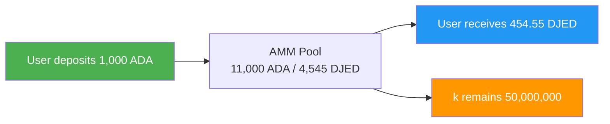
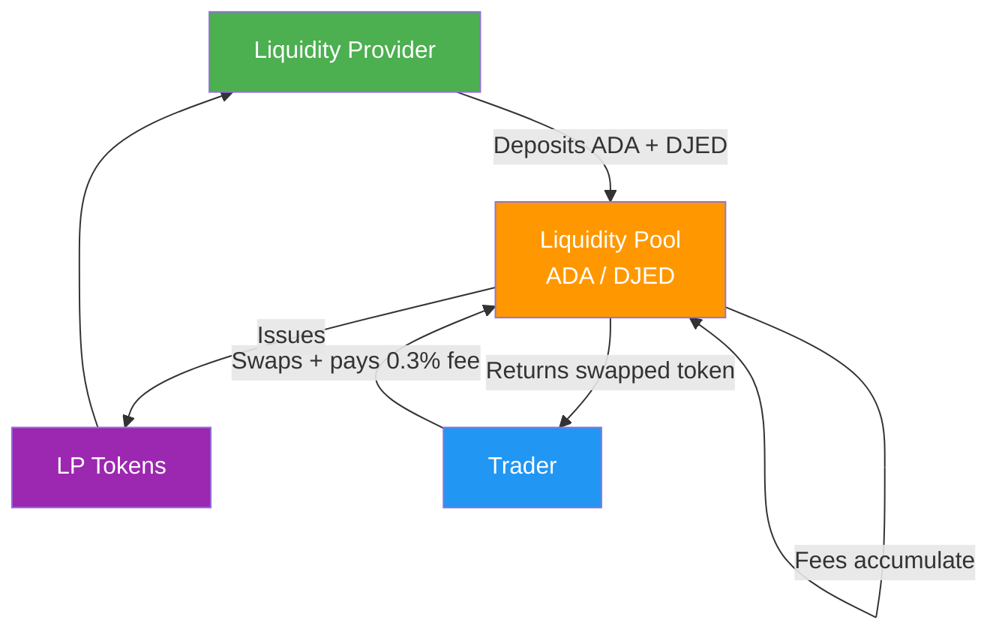
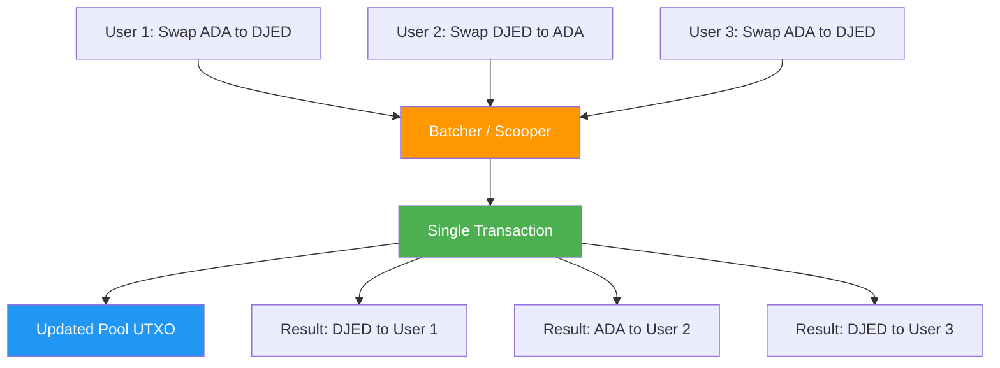

# Pelajaran #11: Konsep DeFi untuk Developer

Keuangan terdesentralisasi (DeFi) menggantikan perantara keuangan tradisional dengan protokol smart contract, memungkinkan perdagangan, peminjaman, dan penghasilan yield secara permissionless langsung di blockchain. Bagi developer web2, DeFi memperkenalkan paradigma di mana logika keuangan berada on-chain, dapat dikomposisi seperti microservices namun trustless dan permissionless. Pelajaran ini mengeksplorasi primitif inti DeFi, cara kerjanya secara mendalam, serta tantangan dan solusi desain spesifik yang muncul saat membangun protokol DeFi pada model eUTXO Cardano.

## Apa Itu Lanskap DeFi?

Lanskap DeFi mencakup semua protokol keuangan yang menggantikan perantara tradisional (bank, pialang, lembaga kliring) dengan smart contract deterministik yang dieksekusi di blockchain. Setiap perantara yang dihilangkan oleh DeFi menghapus biaya, mengurangi latensi, dan menghilangkan kebutuhan kepercayaan.

Ekosistem DeFi mencakup beberapa kategori protokol:

- **Decentralized Exchanges (DEXes)**: Menukar token tanpa order book terpusat
- **Lending dan Borrowing**: Menyediakan aset untuk mendapatkan yield; meminjam dengan jaminan
- **Stablecoins**: Token yang dipatok ke mata uang fiat melalui mekanisme algoritmik atau yang didukung jaminan
- **Yield Aggregators**: Secara otomatis mengoptimalkan pengembalian di berbagai protokol
- **Synthetic Assets**: Representasi on-chain dari aset dunia nyata
- **Insurance**: Perlindungan terdesentralisasi terhadap kegagalan smart contract

Di Cardano, ekosistem DeFi mencakup protokol seperti Minswap, SundaeSwap, dan WingRiders (DEXes), Liqwid Finance dan Lenfi (lending), Djed dan iUSD (stablecoins), serta Optim Finance (yield optimization). Masing-masing protokol ini bekerja dalam batasan dan keunggulan model eUTXO Cardano, yang menghasilkan pola arsitektur yang khas.

## Apa Itu Decentralized Exchanges (DEXes)?

Decentralized exchange (DEX) memungkinkan pengguna menukar satu token dengan token lain melalui smart contract, tanpa perantara terpusat yang menyimpan dana. Berbeda dengan Coinbase atau Binance, di mana bursa mengontrol aset Anda selama perdagangan, DEX mengeksekusi pertukaran di mana Anda tidak pernah kehilangan hak kustodi.

### Bagaimana Perbandingan Order Books dengan AMMs?

Bursa saham tradisional dan bursa kripto terpusat menggunakan **order books**: struktur data yang mencocokkan order beli dengan order jual pada harga tertentu. Market maker menempatkan limit order di kedua sisi buku, dan perdagangan dieksekusi ketika harga pembeli bertemu dengan harga penjual.

```
Traditional Order Book:
+------------------------------------------+
|  SELL ORDERS (Asks)                      |
|  Sell 100 ADA @ $0.52                    |
|  Sell 250 ADA @ $0.51                    |
|  Sell 500 ADA @ $0.505                   |
|-------------- SPREAD -------------------|
|  Buy 300 ADA @ $0.50                     |
|  Buy 150 ADA @ $0.49                     |
|  Buy 400 ADA @ $0.485                    |
|  BUY ORDERS (Bids)                       |
+------------------------------------------+
```

Order book on-chain itu mahal karena setiap penempatan, pembatalan, dan modifikasi order memerlukan transaksi. Pada blockchain dengan throughput terbatas, model ini menjadi tidak praktis. Beberapa DEX Cardano seperti Genius Yield memang mengimplementasikan model order book on-chain, menggunakan kemampuan model eUTXO untuk merepresentasikan setiap order sebagai UTXO yang berbeda. Namun model yang dominan dalam DeFi adalah **Automated Market Maker (AMM)**.

### Bagaimana Cara Kerja Automated Market Makers (AMMs)?

AMM menggantikan order book dengan formula matematis yang menentukan harga aset berdasarkan rasio cadangan dalam sebuah **liquidity pool**. Alih-alih mencocokkan pembeli dan penjual individual, siapa pun dapat berdagang melawan pool, dan formula secara otomatis menyesuaikan harga berdasarkan penawaran dan permintaan.

Formula yang paling umum adalah **constant product formula**, yang dipopulerkan oleh Uniswap di Ethereum dan diadopsi oleh banyak DEX Cardano:

```
x * y = k

Where:
  x = quantity of Token A in the pool
  y = quantity of Token B in the pool
  k = a constant (the product must remain the same after every trade)
```

Berikut adalah contoh konkret. Misalkan sebuah liquidity pool berisi:

- 10.000 ADA (Token A)
- 5.000 DJED (Token B)
- k = 10.000 * 5.000 = 50.000.000

Seorang trader ingin membeli DJED dengan 1.000 ADA. Setelah perdagangan:

```
New ADA in pool:   10,000 + 1,000 = 11,000
New DJED in pool:  k / new_x = 50,000,000 / 11,000 = 4,545.45
DJED received:     5,000 - 4,545.45 = 454.55 DJED
Effective price:   1,000 ADA / 454.55 DJED = 2.20 ADA per DJED
```

Perhatikan bahwa trader menerima sekitar 454,55 DJED alih-alih 500 DJED yang diharapkan (pada kurs awal 2 ADA per DJED). Perbedaan ini disebut **slippage**, dan meningkat dengan perdagangan yang lebih besar relatif terhadap ukuran pool. Constant product formula menciptakan kurva di mana harga bergerak lebih dramatis saat Anda menguras satu sisi pool.



### Formula AMM Lain Apa yang Ada?

Constant product formula bukan satu-satunya pilihan. Formula yang berbeda mengoptimalkan untuk kasus penggunaan yang berbeda:

- **Constant Sum (x + y = k)**: Menawarkan slippage nol tetapi dapat dikuras sepenuhnya dari satu aset. Jarang digunakan dalam praktik.
- **StableSwap (Curve)**: Formula hibrida yang dioptimalkan untuk aset yang seharusnya diperdagangkan mendekati 1:1 (seperti pasangan stablecoin). Berperilaku seperti constant sum di dekat pusat dan constant product di ekstrem, menawarkan slippage rendah untuk perdagangan yang seimbang.
- **Concentrated Liquidity**: Memungkinkan penyedia likuiditas menentukan rentang harga, memusatkan modal di tempat yang paling berguna. Ini meningkatkan efisiensi modal secara dramatis tetapi menambah kompleksitas.

Di Cardano, Minswap menggunakan AMM constant product dengan varian stableswap untuk pasangan stabil. SundaeSwap juga mengimplementasikan model constant product. Pilihan formula memengaruhi pengalaman pengguna, efisiensi modal, dan kompleksitas implementasi.

## Bagaimana Cara Kerja Liquidity Pools dan Providers?

Liquidity pools menyimpan cadangan token berpasangan yang digunakan trader untuk bertukar. **Liquidity Providers (LPs)** menyetor nilai yang sama dari kedua token ke dalam pool dan menerima **LP tokens** sebagai gantinya, yang merepresentasikan bagian mereka dari pool. Biaya perdagangan terakumulasi di pool, meningkatkan nilai setiap LP token dari waktu ke waktu.



Ketika LP ingin menarik, mereka membakar LP tokens mereka dan menerima bagian proporsional dari pool, yang sekarang termasuk biaya yang terakumulasi. Inilah cara LP mendapatkan yield: biaya perdagangan yang dibayar oleh swappers bertambah ke pool, meningkatkan nilai setiap LP token dari waktu ke waktu.

### Apa Itu Impermanent Loss?

Impermanent loss (IL) adalah perbedaan nilai antara menyimpan token di pool AMM versus hanya menyimpannya di wallet. Ketika rasio harga aset yang di-pool menyimpang dari rasio deposit, rebalancing konstan AMM menyebabkan LP memegang lebih sedikit aset yang naik nilainya dibandingkan jika mereka hanya memegang secara langsung.

Pertimbangkan seorang LP yang menyetor 1.000 ADA dan 500 DJED (pada harga 2 ADA per DJED). Jika harga ADA berlipat dua relatif terhadap DJED:

```
Initial deposit:  1,000 ADA + 500 DJED
If held (no LP):  1,000 ADA (now worth 2x) + 500 DJED = $3,000 equivalent
As LP after price change: ~707 ADA + ~707 DJED = ~$2,828 equivalent

Impermanent loss: ~5.7%
```

Kerugian ini disebut "impermanent" karena jika harga kembali ke rasio semula, kerugian menghilang. Kerugian hanya menjadi permanen ketika LP menarik pada rasio harga yang berbeda. Biaya perdagangan dapat mengimbangi impermanent loss, tetapi selama periode volatilitas tinggi, IL dapat melebihi pendapatan biaya.

Bagi developer web2, anggap impermanent loss sebagai "biaya rebalancing." AMM terus-menerus menjual aset yang naik nilainya dan membeli yang turun. LP pada dasarnya membayar untuk price discovery.

## Bagaimana Oracles Membawa Data Off-Chain ke On-Chain?

Oracles menyuplai data eksternal ke blockchain, menjembatani kesenjangan antara smart contract on-chain dan sumber informasi off-chain seperti feed harga, data cuaca, atau hasil olahraga. Smart contract tidak dapat secara native melakukan query API, sehingga oracles memposting data terverifikasi sebagai datums on-chain yang dapat direferensikan oleh contract.

Di Cardano, oracles biasanya memposting data sebagai **datums** yang dilampirkan ke UTXOs di alamat script yang diketahui. Smart contract kemudian mereferensikan UTXOs ini sebagai input untuk membaca data terbaru. Penyedia oracle utama di ekosistem Cardano meliputi:

- **Charli3**: Oracle native Cardano yang menyediakan feed harga dan data lainnya
- **Orcfax**: Solusi oracle terdesentralisasi yang menekankan keaslian dan provenance data
- **Iagon**: Penyedia oracle penyimpanan dan komputasi terdesentralisasi di ekosistem Cardano

**Oracle problem** bersifat fundamental: bagaimana Anda mempercayai bahwa data yang diposting on-chain akurat? Solusinya meliputi penggunaan beberapa sumber data independen, insentif ekonomi (staking jaminan yang dapat di-slash untuk data buruk), dan bukti kriptografis. Oracles tetap menjadi salah satu komponen paling kritis dan rentan dari infrastruktur DeFi. Oracle yang disusupi dapat menyebabkan protokol lending melikuidasi posisi secara tidak benar, DEXes menawarkan perdagangan dengan harga salah, atau stablecoins kehilangan peg-nya.

## Apa Tantangan Desain eUTXO untuk DeFi?

Model eUTXO Cardano mengharuskan protokol DeFi menyelesaikan concurrency secara berbeda dari model account Ethereum, karena satu UTXO hanya dapat dikonsumsi oleh satu transaksi per blok. Developer telah menciptakan pola order batching dan pool sharding untuk menangani batasan ini sambil mempertahankan determinisme dan resistensi front-running dari model tersebut.

### Apa Itu Masalah Concurrency?

Dalam model berbasis account (Ethereum), smart contract menyimpan satu state yang mutable. Beberapa pengguna dapat berinteraksi dengannya dalam blok yang sama, dan blockchain menyelesaikan urutannya. Dalam model eUTXO Cardano, sebuah UTXO hanya dapat dihabiskan sekali. Jika liquidity pool direpresentasikan sebagai satu UTXO, hanya satu pengguna yang dapat berinteraksi dengannya per blok.

```
The Concurrency Challenge:

Block N:
  User A wants to swap ADA to DJED  --+
  User B wants to swap ADA to DJED  --+--> Only ONE can spend the pool UTXO
  User C wants to swap DJED to ADA  --+

  Result: Two transactions fail with "UTXO already spent"
```

Ini bukan bug di eUTXO; ini adalah perbedaan fundamental dalam model tersebut. Developer Cardano telah menciptakan beberapa pola untuk mengatasi tantangan ini.

### Bagaimana Order Batching Menyelesaikan Concurrency?

Pola yang paling umum di DEXes Cardano adalah **order batching**. Alih-alih pengguna berinteraksi langsung dengan liquidity pool, mereka mengirimkan **order UTXOs** yang mengekspresikan niat mereka (misalnya, "tukar 100 ADA ke DJED dengan slippage maksimum 2%"). Seorang **batcher** (kadang disebut scooper) mengumpulkan beberapa order dan mengeksekusinya terhadap pool dalam satu transaksi.



Pola ini memiliki beberapa keunggulan. Beberapa order diproses secara atomik dalam satu transaksi, mengurangi kontestasi. Batcher dapat mengoptimalkan urutan eksekusi. Pengguna tidak perlu bersaing untuk pool UTXO secara langsung.

Namun, batching memperkenalkan latensi (pengguna harus menunggu batcher menyertakan order mereka) dan memerlukan kepercayaan pada batcher (meskipun smart contract menegakkan kebenaran). Sebagian besar DEX Cardano mendesentralisasikan peran batcher dengan memungkinkan siapa pun menjalankan batcher dan mendapatkan biaya.

### Bagaimana Cara Kerja Pool Sharding?

Pendekatan lain membagi liquidity pool menjadi beberapa UTXOs. Alih-alih satu UTXO yang menyimpan semua likuiditas, pool dapat direpresentasikan sebagai beberapa UTXO yang lebih kecil, masing-masing menyimpan sebagian. Ini memungkinkan beberapa transaksi dieksekusi secara bersamaan terhadap UTXO yang berbeda.

```
Multiple Pool UTXOs:

Instead of one pool UTXO with 100,000 ADA / 50,000 DJED:

+----------------+  +----------------+  +----------------+
| Pool Shard 1   |  | Pool Shard 2   |  | Pool Shard 3   |
| 33,333 ADA     |  | 33,333 ADA     |  | 33,334 ADA     |
| 16,667 DJED    |  | 16,667 DJED    |  | 16,666 DJED    |
+----------------+  +----------------+  +----------------+

Three users can now swap concurrently against different shards.
```

Trade-off-nya adalah peningkatan kompleksitas dalam menjaga konsistensi harga di seluruh shard dan potensi slippage yang lebih tinggi pada shard individual (karena masing-masing berisi likuiditas yang lebih sedikit).

### Bagaimana Determinisme Memberikan Keunggulan DeFi pada eUTXO?

Meskipun concurrency adalah tantangan, model eUTXO menawarkan keunggulan yang kuat untuk DeFi: **determinisme**. Di Ethereum, sebuah transaksi mungkin berhasil di simulasi lokal Anda tetapi gagal di on-chain karena transaksi lain mengubah state contract antara pengiriman dan eksekusi Anda (dikenal sebagai MEV, atau Miner/Maximal Extractable Value). Di Cardano, hasil transaksi sepenuhnya deterministik. Jika transaksi tervalidasi secara lokal, ia akan menghasilkan hasil yang persis sama di on-chain, dengan asumsi UTXO inputnya belum dihabiskan.

Determinisme ini juga berarti bahwa Cardano secara inheren tahan terhadap **front-running**, praktik di mana miner atau validator mengurutkan ulang transaksi untuk mendapatkan keuntungan atas biaya pengguna. Karena transaksi Cardano menentukan input dan output yang tepat, validator tidak dapat menyisipkan transaksi mereka sendiri di depan Anda untuk memanipulasi harga.

## Apa yang Membuat Composability Menjadi Kekuatan Super DeFi?

Composability memungkinkan developer menggabungkan beberapa protokol DeFi dalam satu transaksi atomik, menciptakan operasi keuangan kompleks dari blok bangunan sederhana. Dalam istilah web2, bayangkan jika setiap API di dunia berbagi sistem autentikasi yang sama, format data yang sama, dan dapat dipanggil dalam satu request atomik yang sepenuhnya berhasil atau sepenuhnya di-rollback.

Di Cardano, composability terwujud melalui kemampuan untuk mereferensikan beberapa input dan output script dalam satu transaksi. Satu transaksi dapat:

1. Menarik jaminan dari protokol lending
2. Menukar jaminan tersebut di DEX
3. Menyediakan likuiditas ke pool yang berbeda
4. Minting NFT sebagai tanda terima

Semuanya secara atomik. Jika ada langkah yang gagal, seluruh transaksi tidak valid dan tidak ada perubahan state yang terjadi.

Composability inilah yang membuat protokol DeFi berperilaku seperti "money Legos": blok bangunan yang dapat ditumpuk, dipertukarkan, menciptakan instrumen keuangan yang semakin kompleks dari primitif sederhana.

## Mengapa Flash Loans Tidak Ada di Cardano?

Flash loans di Ethereum memungkinkan pengguna meminjam token tanpa batas tanpa jaminan, asalkan mereka melunasi pinjaman dalam transaksi yang sama. Model eUTXO Cardano mencegah hal ini karena setiap transaksi harus menyeimbangkan input dan outputnya pada saat konstruksi; Anda tidak dapat "meminjam" aset di tengah transaksi.

Di Ethereum, flash loans berfungsi karena EVM memproses transaksi secara sekuensial dalam sebuah blok dan dapat memeriksa di akhir transaksi apakah pinjaman telah dilunasi. Di Cardano, transaksi harus sepenuhnya didefinisikan sebelum pengiriman.

Beberapa protokol telah mengeksplorasi alternatif, seperti pola "mirip flash-loan" menggunakan beberapa transaksi berantai, tetapi model eUTXO secara fundamental mencegah peminjaman tanpa jaminan dalam satu transaksi yang menjadi ciri khas flash loans Ethereum.

Ini sebenarnya merupakan keunggulan keamanan. Flash loans di Ethereum telah digunakan untuk mengeksekusi serangan kompleks terhadap protokol DeFi, memanipulasi harga dan menguras dana dalam satu transaksi. Model Cardano membuat vektor serangan ini jauh lebih sulit untuk dieksploitasi.

## Bagaimana Cara Kerja Yield Farming dan Liquidity Mining?

Yield farming adalah praktik menyebarkan modal secara strategis di seluruh protokol DeFi untuk memaksimalkan pengembalian, sementara liquidity mining secara khusus mendistribusikan governance tokens kepada penyedia likuiditas sebagai insentif tambahan di luar biaya perdagangan.

Di Cardano, peluang yield farming meliputi:

- Menyediakan likuiditas di DEXes dan mendapatkan biaya perdagangan plus token protokol (misalnya, token MIN dari Minswap)
- Meminjamkan aset di platform seperti Liqwid dan mendapatkan bunga plus token protokol
- Staking LP tokens di "farms" untuk reward tambahan
- Berpartisipasi dalam event liquidity bootstrapping untuk token baru

Yield di DeFi tidaklah ajaib. Mereka berasal dari biaya perdagangan (aktivitas ekonomi nyata), emisi token (reward inflasioner yang mungkin atau mungkin tidak mempertahankan nilainya), dan pembagian pendapatan protokol. Memahami sumber yield sangat penting untuk mengevaluasi risiko.

## Analogi Web2

Jika Anda berasal dari web2, banyak konsep DeFi memiliki analogi yang familiar:

**DEXes seperti mesin pencocok bursa saham**, kecuali logika pencocokannya publik, siapa pun bisa menjadi market maker, dan tidak ada broker antara Anda dan pasar. Di mana bursa saham memiliki algoritma pencocokan proprietary, AMM mempublikasikan formulanya untuk dilihat dan diinteraksikan oleh siapa saja.

**Liquidity pools AMM seperti connection pools di web server.** Connection pool memelihara sekumpulan koneksi database yang sudah terbentuk yang dapat digunakan oleh beberapa request. Demikian pula, liquidity pool memelihara cadangan aset yang dapat ditukar oleh beberapa trader. Pool harus berukuran sesuai dengan permintaan; terlalu kecil dan Anda mendapat kemacetan (slippage tinggi), terlalu besar dan sumber daya kurang terpakai (pengembalian rendah untuk LPs).

**Oracles seperti aggregator API atau penyedia webhook.** Di web2, Anda mungkin menggunakan layanan seperti Plaid untuk mengagregasi data perbankan atau API feed harga seperti Alpha Vantage. Oracles melayani tujuan yang sama tetapi harus menyelesaikan masalah trustlessness. Bayangkan membangun sistem di mana Anda tidak dapat mempercayai satu penyedia API pun, jadi Anda melakukan query ke lima penyedia, membuang outlier, dan mengambil median. Pada dasarnya begitulah cara oracle terdesentralisasi bekerja.

**Order batching seperti batch processing di message queues.** Alih-alih memproses setiap pesan (order) secara individual, consumer (batcher) mengumpulkan pesan dari queue, memprosesnya secara massal, dan menulis hasilnya kembali. Anggap seperti Amazon SQS di mana Lambda function melakukan polling pesan dan memprosesnya dalam batch untuk efisiensi.

**Impermanent loss seperti biaya pemeliharaan cache di bawah beban tulis yang berat.** Anda mengalokasikan sumber daya (likuiditas) untuk melayani request (perdagangan) lebih efisien, tetapi jika data yang mendasari (harga) berubah dengan cepat, cache Anda (rasio pool) menjadi basi dan biaya rebalancing melebihi manfaat caching.

**Composability seperti Unix pipes** di mana output dari satu program menjadi input program lain, kecuali setiap perintah dalam pipeline sepenuhnya berhasil atau sepenuhnya di-rollback. Ini seperti `grep | sort | uniq` tetapi dengan jaminan atomisitas yang hanya bisa diimpikan oleh developer web2.

## Poin-Poin Penting

- **AMMs menggantikan order books** dengan formula matematis (seperti constant product formula) yang secara otomatis menentukan harga aset berdasarkan cadangan pool, memungkinkan perdagangan permissionless tanpa perantara terpusat.
- **Liquidity providers mendapatkan biaya tetapi menghadapi impermanent loss**: biaya tersembunyi yang muncul ketika rasio harga aset yang di-pool menyimpang dari rasio saat deposit.
- **Oracles menjembatani kesenjangan on-chain/off-chain** dengan memposting data eksternal sebagai datums, tetapi mereka memperkenalkan asumsi kepercayaan yang harus dikelola dengan hati-hati.
- **Model eUTXO Cardano memerlukan pola khusus DeFi** seperti order batching dan pool sharding untuk menangani concurrency, tetapi memberikan determinisme dan resistensi front-running sebagai keunggulan kompensasi yang kuat.
- **Composability membuat protokol DeFi menjadi blok bangunan yang interoperable**, memungkinkan operasi keuangan kompleks dalam transaksi atomik tunggal.

## Selanjutnya

Sekarang setelah Anda memahami primitif keuangan yang menggerakkan DeFi, pelajaran berikutnya mengeksplorasi infrastruktur yang membuat jaringan Cardano berjalan: stake pools, delegation, dan mekanisme konsensus yang mengamankan setiap transaksi yang telah dibahas sejauh ini.
