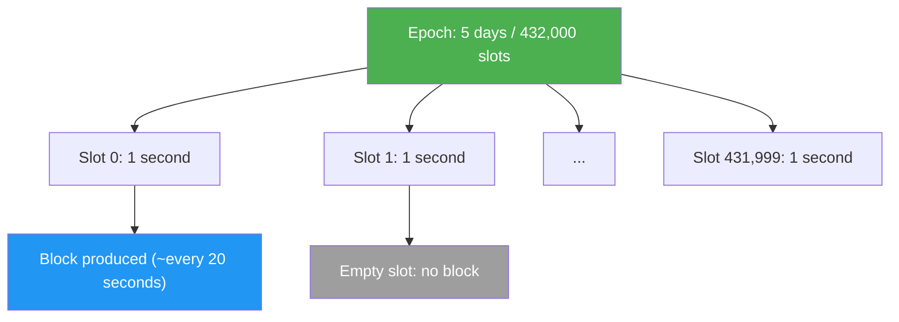
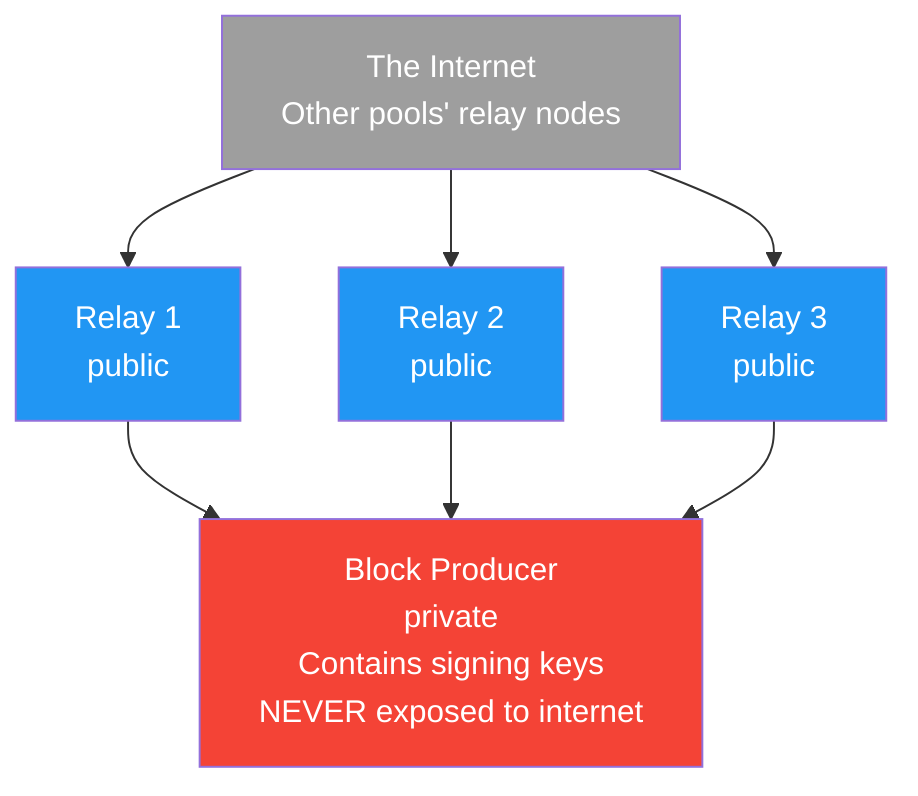
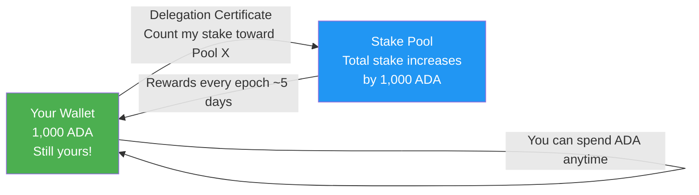
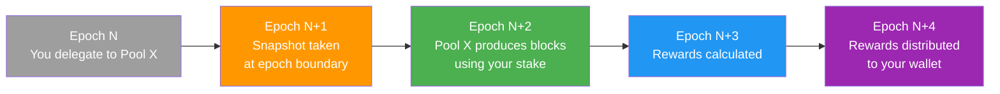

# Pelajaran #12: Stake Pools, Delegation, dan Jaringan

Konsensus proof-of-stake Cardano mengamankan jaringan melalui pemegang ADA yang secara kolektif mendelegasikan stake mereka ke stake pools, yang memproduksi blok dan mendapatkan reward proporsional terhadap total stake yang didelegasikan. Bagi developer web2, memahami cara kerja stake pools, delegation, dan topologi jaringan sangat penting karena mekanisme ini secara langsung memengaruhi finalitas transaksi, throughput jaringan, dan insentif ekonomi yang menjaga kejujuran sistem. Pelajaran ini mendalami mesin yang menggerakkan lapisan konsensus Cardano.

## Apa Itu Proof of Stake dan Mengapa Penting?

Proof of stake menggantikan penambangan yang menggunakan energi intensif dengan stake ekonomi, bertanya "siapa yang paling banyak kehilangan?" alih-alih "siapa yang memiliki daya komputasi paling banyak?" Validator menyerahkan aset mereka sendiri sebagai jaminan: perilaku jujur mendapatkan reward, sementara perilaku buruk berisiko kehilangan stake. Asumsi keamanannya adalah bahwa aktor rasional dengan eksposur ekonomi yang signifikan akan bertindak demi kepentingan terbaik jaringan.

Dalam sistem proof-of-work seperti Bitcoin, penambang bersaing untuk memecahkan teka-teki yang mahal secara komputasi. Pemenang mengusulkan blok berikutnya dan mendapatkan reward. Keamanan berasal dari fakta bahwa menyerang jaringan memerlukan penguasaan mayoritas daya penambangan dunia, sebuah proposisi yang sangat mahal secara astronomi.

Protokol proof-of-stake Cardano disebut **Ouroboros**, dan merupakan protokol proof-of-stake pertama dengan bukti keamanan matematis yang ketat yang diterbitkan di venue akademis peer-reviewed. Ouroboros telah berkembang melalui beberapa iterasi:

- **Ouroboros Classic** (2017): Protokol dasar yang membuktikan PoS dapat mencapai jaminan keamanan yang sama seperti PoW
- **Ouroboros Praos** (2018): Menambahkan asumsi jaringan semi-sinkron dan pemilihan leader privat untuk mencegah serangan tertarget pada produsen blok yang akan datang
- **Ouroboros Genesis** (paper 2018, implementasi sedang berlangsung): Memungkinkan node baru melakukan bootstrap dari blok genesis tanpa memerlukan checkpoint tepercaya
- **Ouroboros Leios** (dalam pengembangan): Bertujuan untuk meningkatkan throughput secara dramatis melalui input endorsers dan produksi blok gaya pipeline

## Bagaimana Ouroboros Memilih Produsen Blok?

Ouroboros membagi waktu menjadi epochs (masing-masing 5 hari) dan slots (masing-masing 1 detik), kemudian secara pseudo-random memilih stake pool sebagai slot leader untuk setiap slot, dengan probabilitas pemilihan proporsional terhadap total stake yang didelegasikan ke pool. Hanya pool yang terpilih yang tahu bahwa mereka telah dipilih, mencegah serangan denial-of-service terhadap produsen blok yang akan datang.



Pada awal setiap epoch, protokol menjalankan proses **leader selection**. Untuk setiap slot di epoch yang akan datang, protokol secara pseudo-random memilih stake pool untuk menjadi **slot leader** (entitas yang diberi wewenang untuk memproduksi blok untuk slot tersebut). Probabilitas pemilihan proporsional terhadap total stake pool (pledge-nya sendiri ditambah semua ADA yang didelegasikan).

```
Leader Selection Probability:

Pool A:  50 million ADA staked  -->  ~0.14% chance per slot
Pool B: 200 million ADA staked  -->  ~0.56% chance per slot
Pool C:   5 million ADA staked  -->  ~0.014% chance per slot

Circulating ADA supply: ~37.6 billion (as of 2025)
```

Pemilihannya bersifat **privat**, artinya hanya pool yang terpilih yang tahu bahwa mereka telah dipilih untuk slot tertentu. Ini mencegah pihak lawan menargetkan produsen blok yang akan datang dengan serangan denial-of-service. Pool membuktikan bahwa mereka terpilih dengan mengungkapkan output verifiable random function (VRF) ketika mereka memproduksi blok.

## Bagaimana Arsitektur Stake Pool?

Sebuah stake pool Cardano terdiri dari node block producer privat (yang menyimpan kunci penandatanganan kriptografis) yang dilindungi di balik beberapa node relay publik yang terhubung ke jaringan yang lebih luas. Pemisahan ini memastikan bahwa meskipun penyerang mengkompromikan relay, kunci penandatanganan tetap terisolasi dan aman.

### Jenis Node Apa yang Membentuk Stake Pool?



**Block Producer Node**: Ini adalah inti dari stake pool. Node ini menyimpan kunci kriptografis pool (cold key, KES key, VRF key) dan bertanggung jawab untuk mencetak blok ketika pool terpilih sebagai slot leader. Block producer tidak boleh dapat diakses langsung dari internet. Node ini hanya berkomunikasi dengan node relay milik pool sendiri.

**Relay Nodes**: Ini adalah node yang dapat diakses publik yang terhubung ke jaringan Cardano yang lebih luas. Mereka menerima transaksi dan blok dari node lain, meneruskannya ke block producer, dan menyebarkan blok yang baru dicetak oleh pool ke jaringan. Menjalankan beberapa relay di wilayah geografis yang berbeda meningkatkan redundansi dan konektivitas jaringan.

### Kunci dan Sertifikat Apa yang Digunakan Stake Pool?

Mengoperasikan stake pool melibatkan beberapa kunci kriptografis, masing-masing melayani tujuan yang berbeda:

- **Cold Key**: Kunci identitas pool. Digunakan untuk menandatangani sertifikat registrasi pool. Disimpan secara offline untuk keamanan maksimum. Anggap seperti root CA certificate untuk pool Anda.
- **KES Key (Key Evolving Signature)**: Digunakan untuk menandatangani blok. Berevolusi maju secara berkala (setiap 129.600 slots, kira-kira 36 jam) dan kunci lama dihapus, memberikan **forward security**. Bahkan jika penyerang mendapatkan KES key saat ini, mereka tidak dapat memalsukan blok untuk periode sebelumnya.
- **VRF Key (Verifiable Random Function)**: Digunakan untuk membuktikan eligibilitas pool untuk memproduksi blok di slot tertentu. Output VRF disertakan dalam header blok sebagai bukti.
- **Operational Certificate**: Menghubungkan cold key ke KES key, memungkinkan block producer menandatangani blok atas nama pool tanpa mengekspos cold key.

```
Key Hierarchy:

Cold Key (offline, pool identity)
    |
    +--> Signs: Pool Registration Certificate
    |              (registers/updates pool on-chain)
    |
    +--> Signs: Operational Certificate
                    |
                    +--> Authorizes: KES Key (online, signs blocks)
                                         |
                                         +--> Proves: VRF Key output
                                                      (slot leadership)
```

## Bagaimana Cara Kerja Non-Custodial Delegation?

Delegation di Cardano bersifat non-custodial: ADA Anda tidak pernah meninggalkan wallet Anda. Sebaliknya, Anda mengeluarkan sertifikat on-chain yang menetapkan hak staking Anda ke pool yang dipilih, sambil mempertahankan kontrol pengeluaran penuh tanpa periode lock-up, tanpa jumlah minimum, dan tanpa risiko slashing.



Ini secara fundamental berbeda dari staking di banyak blockchain lain di mana Anda harus mengunci token, mengirimnya ke validator, atau menunggu melalui "unbonding period" untuk mendapatkannya kembali. Di Cardano:

- **Tanpa lock-up**: ADA Anda selalu likuid. Anda dapat membelanjakannya kapan saja.
- **Tanpa minimum**: Anda dapat mendelegasikan jumlah ADA berapa pun.
- **Tanpa slashing**: ADA yang Anda delegasikan tidak pernah berisiko. Jika operator pool berperilaku buruk, Anda hanya kehilangan reward untuk epoch tersebut; Anda tidak pernah kehilangan pokok.
- **Re-delegation otomatis**: Jika Anda menambahkan lebih banyak ADA ke wallet, itu secara otomatis termasuk dalam delegation Anda mulai dari snapshot berikutnya.

Properti tanpa slashing ini sangat menonjol. Di Ethereum, validator dapat kehilangan sebagian ETH yang di-stake melalui slashing jika mereka menandatangani blok yang kontradiktif atau offline untuk waktu yang lama. Cardano memilih pendekatan yang berbeda: alih-alih menghukum perilaku buruk dengan penalti finansial, protokol hanya tidak memberikan reward. Pool yang melewatkan blok yang ditugaskan tidak mendapatkan reward untuk slot tersebut, yang secara alami mendorong delegator ke pool yang lebih andal.

### Apa Itu Siklus Delegation?

Delegation mengikuti siklus waktu tertentu yang terkait dengan epochs:



Penundaan ini ada karena cara Ouroboros menghitung slot leadership. Snapshot stake dari Epoch N menentukan slot leaders untuk Epoch N+2, dan reward untuk Epoch N+2 dihitung dan didistribusikan di Epochs N+3 dan N+4. Setelah penundaan awal (~15 hingga 20 hari), reward tiba setiap epoch (setiap 5 hari) selama pool memproduksi blok.

## Bagaimana Staking Rewards Didistribusikan?

Staking rewards berasal dari dua sumber: ekspansi moneter (ADA baru yang dicetak dari cadangan) dan biaya transaksi yang dibayar oleh pengguna. Protokol membagi total reward pot antara treasury (20%) dan reward stake pool (80%), dengan reward pool selanjutnya dibagi berdasarkan kinerja, pledge, dan margin operator.

### Faktor Apa yang Menentukan Reward Pool?

Formula reward memperhitungkan beberapa faktor:

```
Pool Reward Factors:

1. Performance: Ratio of blocks actually produced to blocks expected
   (A pool assigned 100 slots that produces 98 blocks has performance = 0.98)

2. Pledge (s): The pool operator's own ADA committed to the pool
   (Higher pledge leads to slightly higher rewards via the a0 parameter)

3. Total Stake (z): Pool's share of total staked ADA
   (More stake leads to more slots, more blocks, more rewards)

4. Saturation (k): Maximum effective pool size
   (Currently k = 500, meaning optimal pool size is roughly 71 million ADA)
   (Pools above saturation earn LESS per ADA staked)

5. Fixed Cost (min 170 ADA per epoch): Covers operational expenses
   (Deducted before rewards are shared with delegators)

6. Margin (0-100%): Pool operator's cut of remaining rewards
   (Typical margins range from 1% to 5%)
```

## Bagaimana Saturasi Mendorong Desentralisasi?

Mekanisme saturasi mencegah konsentrasi stake dengan mengurangi reward per-ADA untuk pool yang melebihi titik saturasi (total suplai ADA dibagi parameter k, saat ini sekitar 71 juta ADA). Ini menciptakan insentif alami bagi delegator untuk memindahkan stake mereka ke pool yang lebih kecil dan belum jenuh.

**Titik saturasi** dihitung sebagai:

```
Saturation Point = Total Active Stake / k
                 ≈ 37.6 billion / 500
                 ≈ 75 million ADA
```

Ketika total stake pool melebihi titik saturasi, reward per ADA yang di-stake mulai berkurang. Ini menciptakan insentif alami bagi delegator untuk memindahkan stake mereka ke pool yang lebih kecil dan belum jenuh.

Jika komunitas Cardano memutuskan menginginkan lebih banyak desentralisasi, parameter k dapat ditingkatkan (misalnya, ke 1.000), yang akan menurunkan titik saturasi dan memberi insentif agar stake tersebar di lebih banyak pool. Ini adalah keputusan governance yang dibuat melalui proses governance on-chain.

## Peran Apa yang Dimainkan Pledge dalam Ekonomi Stake Pool?

Pledge adalah jumlah ADA yang secara personal dijaminkan oleh operator pool ke pool mereka sendiri, berfungsi sebagai ketahanan Sybil, penyelarasan insentif, dan sinyal kepercayaan bagi delegator. Parameter a0 dalam formula reward memberikan bonus ke pool dengan pledge yang lebih tinggi, membuatnya lebih menguntungkan untuk menjalankan satu pool yang di-pledge dengan baik daripada banyak pool tanpa pledge.

1. **Ketahanan Sybil**: Tanpa insentif pledge, penyerang dapat membuat ribuan pool tanpa investasi pribadi.

2. **Penyelarasan insentif**: Operator pool dengan pledge yang signifikan memiliki motivasi kuat untuk menjaga pool tetap berjalan dengan andal, karena mereka secara personal mendapatkan reward proporsional terhadap stake mereka.

3. **Sinyal kepercayaan**: Pledge yang lebih tinggi menunjukkan keyakinan operator terhadap pool mereka sendiri dan memberikan jaminan kepada delegator bahwa operator memiliki skin in the game.

```
Pledge Impact Example:

Pool A: 100,000 ADA pledge, 50M total stake
Pool B: 1,000,000 ADA pledge, 50M total stake

Both pools produce the same number of blocks, but Pool B
earns slightly higher total rewards due to the a0 parameter,
which rewards higher pledge.

The difference is currently modest (a0 = 0.3), but it provides
a meaningful signal and incentive at scale.
```

## Bagaimana Struktur Jaringan Cardano?

Jaringan Cardano adalah sistem peer-to-peer di mana node secara dinamis menemukan dan terhubung ke peer melalui protokol gossip, mengklasifikasikan koneksi sebagai hot (aktif), warm (idle), atau cold (dikenal tetapi terputus) untuk mengoptimalkan kinerja dan ketahanan.

### Bagaimana Cardano Bertransisi dari Topologi Statis ke Dinamis?

Awalnya, Cardano menggunakan **topologi statis** di mana node relay dikonfigurasi secara manual dengan daftar peer. Dengan diluncurkannya **jaringan Peer-to-Peer (P2P)** (diaktifkan dalam stack jaringan Ouroboros), node sekarang dapat secara dinamis menemukan dan terhubung ke peer tanpa koordinasi terpusat:

Sistem P2P mencakup beberapa komponen:

- **Peer Discovery**: Node membagikan peer yang dikenal ke node lain melalui protokol gossip
- **Peer Selection**: Node mengklasifikasikan peer sebagai "hot" (aktif bertukar data), "warm" (terhubung tetapi idle), atau "cold" (dikenal tetapi tidak terhubung), dan secara dinamis menyesuaikan koneksi berdasarkan kinerja
- **Connection Manager**: Menangani batas koneksi, prioritisasi, dan serah terima yang mulus antar peer

### Bagaimana Cara Kerja Propagasi Blok?

Ketika stake pool memproduksi blok, blok harus merambat melalui jaringan dengan cukup cepat agar semua node lain menerimanya sebelum blok berikutnya jatuh tempo. Targetnya adalah agar blok mencapai 95% jaringan dalam 5 detik.

Ukuran blok, latensi jaringan, dan jumlah hop antar node semuanya memengaruhi waktu propagasi. Inilah mengapa distribusi geografis node relay penting: pool dengan relay di Amerika Utara, Eropa, dan Asia akan mempropagasikan blok lebih cepat daripada yang semua relay-nya di satu pusat data.

## Apa Persyaratan Operasional untuk Menjalankan Stake Pool?

Meskipun ini adalah kursus teori, memahami persyaratan operasional membantu developer menghargai apa yang dilakukan SPOs:

- **Perangkat Keras**: Minimum 16 GB RAM, 4 core CPU, 200 GB penyimpanan SSD (bertambah seiring waktu seiring pertumbuhan blockchain), dan konektivitas internet yang andal
- **Uptime**: Pool harus online ketika ditugaskan slot leadership. Melewatkan blok berarti kehilangan reward dan kepercayaan delegator
- **Manajemen Kunci**: Cold keys harus disimpan dengan aman secara offline. KES keys harus dirotasi setiap 62 periode KES (~90 hari). Operational certificates harus diterbitkan ulang dengan setiap rotasi KES
- **Pemantauan**: SPOs memantau produksi blok, konektivitas jaringan, penggunaan sumber daya, dan koneksi peer. Melewatkan satu blok pun dapat dideteksi dan didiagnosis melalui tools seperti CNCLI, Prometheus, dan Grafana
- **Pembaruan**: SPOs harus memperbarui perangkat lunak node mereka ketika versi baru dirilis, terutama untuk event hard fork di mana aturan protokol berubah

## Analogi Web2

Ekosistem staking Cardano berkorelasi dengan pola infrastruktur web2 secara mengejutkan:

**Stake pools seperti node edge CDN.** Content Delivery Network (seperti Cloudflare atau AWS CloudFront) mendistribusikan salinan konten Anda di banyak server di seluruh dunia. Setiap node edge melayani sebagian request. Demikian pula, stake pools mendistribusikan pekerjaan produksi blok di banyak operator. Seperti penyedia CDN bersaing pada kinerja, uptime, dan harga, stake pools bersaing pada keandalan, biaya, dan keterlibatan komunitas.

**Relay nodes seperti load balancers.** Dalam deployment web2 tipikal, load balancer (seperti Nginx, HAProxy, atau AWS ALB) berada di depan server aplikasi Anda, mendistribusikan lalu lintas masuk dan menyediakan titik masuk yang stabil. Relay nodes melayani tujuan yang sama: mereka menerima koneksi dari jaringan yang lebih luas dan mengarahkan lalu lintas ke block producer, yang (seperti server aplikasi) tidak pernah diekspos langsung.

**Delegation seperti routing lalu lintas berbasis DNS.** Ketika Anda mengonfigurasi DNS Anda untuk menunjuk ke CDN atau penyedia hosting tertentu, Anda "mendelegasikan" lalu lintas Anda ke infrastruktur mereka. Anda masih memiliki domain Anda (ADA Anda), Anda dapat mengganti penyedia kapan saja (re-delegate), dan tidak ada lock-in period. Penyedia menangani beban operasional melayani lalu lintas Anda (memproduksi blok).

**Mekanisme saturasi seperti kebijakan auto-scaling.** Di lingkungan cloud, Anda menetapkan jumlah instance maksimum dan kebijakan scaling untuk mencegah satu server menjadi kelebihan beban. Saturasi melayani tujuan yang sama di tingkat jaringan: mencegah satu pool menjadi terlalu besar dan memberi insentif distribusi beban di banyak operator. Ini adalah ekuivalen blockchain dari pengaturan "max connections per server".

**Rotasi KES key seperti pembaruan sertifikat TLS.** Seperti Anda harus memperbarui sertifikat SSL/TLS Anda secara berkala (dan layanan seperti Let's Encrypt mengotomatiskan rotasi 90 hari), SPOs harus merotasi KES keys mereka setiap ~129 hari. Properti forward-security dari KES keys serupa dengan TLS forward secrecy: mengkompromikan kunci saat ini tidak mengkompromikan sesi atau blok di masa lalu.

**Distribusi reward berbasis epoch seperti tagihan cloud bulanan.** Anda tidak ditagih secara real-time untuk setiap API call; sebaliknya, penggunaan diagregasi dan ditagih pada akhir periode tagihan. Demikian pula, staking rewards dihitung per epoch dan didistribusikan secara batch, bukan dibayar per blok.

## Poin-Poin Penting

- **Ouroboros adalah protokol proof-of-stake Cardano**, membagi waktu menjadi epochs dan slots, dengan stake pools dipilih secara acak untuk memproduksi blok secara proporsional terhadap total stake yang didelegasikan.
- **Delegation bersifat non-custodial**: ADA Anda tidak pernah meninggalkan wallet, tidak ada periode lock-up, dan tidak ada risiko slashing, menjadikan staking Cardano sangat ramah pengguna.
- **Saturasi (parameter k) mendorong desentralisasi** dengan mengurangi reward per-ADA untuk pool yang terlalu besar, secara alami memberi insentif distribusi stake di banyak operator.
- **Infrastruktur stake pool memisahkan block producers dari relays** untuk keamanan, dengan hierarki kunci yang canggih (cold, KES, VRF) yang memberikan forward security dan fleksibilitas operasional.
- **Jaringan P2P** telah menggantikan topology updater terpusat, memungkinkan peer discovery dan manajemen koneksi yang benar-benar terdesentralisasi di seluruh jaringan Cardano.

## Selanjutnya

Dengan pemahaman yang solid tentang bagaimana jaringan beroperasi di lapisan konsensus, pelajaran berikutnya mengeksplorasi tools dan infrastruktur developer yang akan Anda gunakan untuk benar-benar membangun di Cardano: dari menjalankan node Anda sendiri hingga menggunakan managed APIs dan chain indexers.
