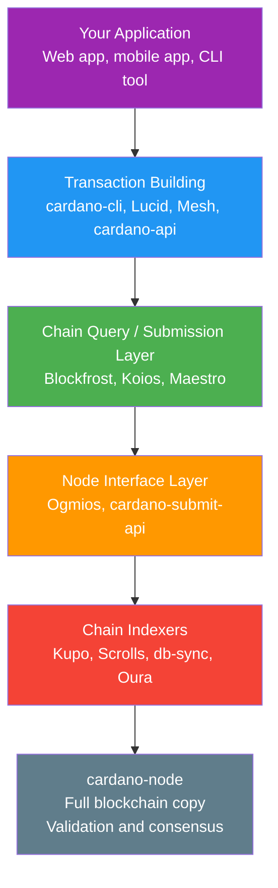
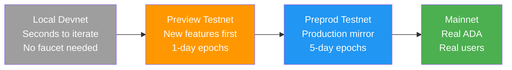
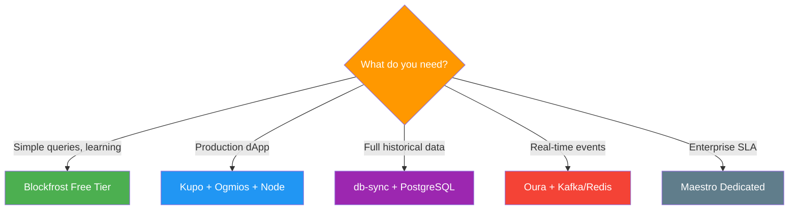

# Pelajaran #13: Infrastruktur Developer

Infrastruktur developer Cardano menyediakan stack tools berlapis (dari full nodes hingga managed APIs hingga chain indexers) yang mengubah data blockchain mentah menjadi format yang dapat di-query dan siap untuk aplikasi untuk membangun dApps. Setiap developer web2 tahu bahwa membangun aplikasi memerlukan lebih dari sekadar menulis logika bisnis: Anda membutuhkan database, APIs, hosting, monitoring, staging environments, dan deployment pipelines. Pelajaran ini memetakan lanskap infrastruktur developer Cardano, dari menjalankan full node Anda sendiri hingga menggunakan layanan managed API, dan dari chain indexers hingga testnets di mana Anda dapat bereksperimen tanpa mempertaruhkan ADA sungguhan.

## Seperti Apa Stack Infrastruktur Developer Cardano?

Stack developer Cardano memiliki lima lapisan: aplikasi Anda di atas, library transaction building di tengah, layanan chain query dan submission di bawahnya, chain indexers untuk transformasi data, dan cardano-node sebagai fondasi. Setiap lapisan melayani tujuan yang berbeda, dan developer memilih stack mereka berdasarkan kebutuhan desentralisasi, kinerja, biaya, dan kenyamanan.



## Apa Itu cardano-node dan Kapan Harus Menjalankannya?

cardano-node adalah implementasi full node resmi Cardano (ditulis dalam Haskell) yang secara independen memvalidasi setiap blok dan transaksi, memelihara UTXO set saat ini, dan menyediakan cara paling trustless untuk berinteraksi dengan blockchain. Menjalankan node Anda sendiri berarti Anda memverifikasi seluruh chain sendiri tanpa bergantung pada pihak ketiga mana pun.

Node ini:

- Terhubung ke peer dan mengunduh setiap blok sejak genesis
- Memvalidasi setiap transaksi dan blok sesuai aturan ledger
- Memelihara UTXO set saat ini ("state" dari blockchain)
- Meneruskan transaksi valid ke mempool jaringan
- Dapat mengirim transaksi langsung ke jaringan

### Kapan Harus Menjalankan Node Sendiri?

Menjalankan cardano-node sendiri adalah opsi paling trustless. Anda tidak bergantung pada pihak ketiga mana pun untuk memberi tahu Anda state blockchain; Anda telah memverifikasinya sendiri. Ini penting untuk:

- **Stake pool operators**: Diperlukan secara definisi untuk memproduksi blok
- **Aplikasi keamanan tinggi**: Ketika Anda tidak mampu mempercayai API pihak ketiga
- **Operator chain indexer**: Sebagian besar indexers terhubung langsung ke node lokal
- **Developer protokol**: Saat membangun dan menguji perubahan lapisan konsensus

Namun, menjalankan node memiliki overhead operasional yang signifikan:

```
cardano-node Resource Requirements (Mainnet, 2025):

Storage:    ~180 GB (and growing ~15 GB/year)
RAM:        16+ GB (24 GB recommended)
CPU:        4+ cores
Sync time:  12-48 hours for initial sync from genesis
Bandwidth:  Continuous data exchange with peers
Uptime:     Must be running to serve queries
```

Bagi banyak developer aplikasi, menjalankan full node itu berlebihan. Di sinilah layanan managed berperan.

## Layanan Managed API Apa yang Tersedia untuk Cardano?

Layanan managed API (Blockfrost, Koios, dan Maestro) menyediakan akses RESTful dan WebSocket ke data blockchain Cardano tanpa mengharuskan Anda menjalankan node sendiri, menangani kompleksitas operasional node, indexers, dan database di balik endpoint API yang bersih.

### Apa Itu Blockfrost?

**Blockfrost** adalah layanan API Cardano yang paling banyak digunakan. Menyediakan REST API komprehensif yang mencakup blocks, transactions, addresses, assets, scripts, epochs, dan banyak lagi.

```
Blockfrost API Example (Conceptual):

GET /addresses/{address}/utxos
Response:
[
  {
    "tx_hash": "abc123...",
    "output_index": 0,
    "amount": [
      { "unit": "lovelace", "quantity": "5000000" },
      { "unit": "policy_id.asset_name", "quantity": "1" }
    ],
    "data_hash": "datum_hash_if_present"
  }
]
```

Blockfrost menawarkan tier gratis dan berbayar, dengan rate limiting pada tier gratis. Mendukung mainnet, testnet (Preview dan Preprod), dan IPFS pinning untuk penyimpanan metadata off-chain.

**Kekuatan**: Cakupan komprehensif, dokumentasi yang sangat baik, dukungan bahasa yang luas melalui SDKs, integrasi IPFS, uptime yang andal.

**Trade-offs**: Layanan terpusat (Anda mempercayai Blockfrost untuk mengembalikan data yang akurat), rate limits pada tier gratis, tidak cocok untuk streaming real-time event chain.

### Apa Itu Koios?

**Koios** adalah lapisan API Cardano yang digerakkan komunitas dan terdesentralisasi. Berbeda dengan Blockfrost (dioperasikan oleh satu perusahaan), Koios berjalan di beberapa operator independen, mengurangi titik kegagalan tunggal. Menyediakan API berbasis PostgREST dengan kemampuan query yang kuat, termasuk filtering, pagination, dan query kompleks yang memerlukan beberapa panggilan di layanan lain. Gratis untuk digunakan (didanai oleh proposal Catalyst dan dukungan komunitas).

**Kekuatan**: Operasi terdesentralisasi, sintaks query yang kuat (memanfaatkan PostgREST), tidak memerlukan API keys untuk penggunaan dasar, dikelola komunitas.

**Trade-offs**: Sintaks query bisa kompleks bagi pemula, waktu respons mungkin bervariasi antar instance, lebih sedikit SDK wrapper daripada Blockfrost.

### Apa Itu Maestro?

**Maestro** adalah platform indexing dan API blockchain yang memposisikan diri sebagai lapisan infrastruktur untuk membangun aplikasi Cardano production-grade. Menawarkan beberapa produk:

- **Blockchain API**: REST API untuk melakukan query data chain (mirip dengan Blockfrost)
- **Transaction Manager**: Menangani pengiriman transaksi, pemantauan, dan pengiriman ulang otomatis
- **DEX Market API**: Data DEX teragregasi untuk membangun aplikasi perdagangan
- **Managed infrastructure**: Cluster node dan indexer khusus untuk pelanggan enterprise

**Kekuatan**: Fitur manajemen transaksi (retry otomatis, pemantauan), agregasi data DEX, dukungan enterprise, tools debugging Plutus script.

**Trade-offs**: Terutama komersial (tier berbayar), tier gratis lebih kecil dari Blockfrost.

## Apa Itu Lapisan Node Interface?

Lapisan node interface (Ogmios dan cardano-submit-api) berada di antara cardano-node mentah dan API tingkat tinggi, menerjemahkan protokol biner kustom node menjadi antarmuka WebSocket/JSON dan HTTP yang ramah developer dan dapat diakses dari bahasa pemrograman apa pun.

### Apa Itu Ogmios?

**Ogmios** adalah bridge ringan yang mengekspos protokol internal cardano-node melalui antarmuka WebSocket JSON. Cardano node menggunakan protokol biner kustom yang disebut protokol mini **Node-to-Client** untuk komunikasi lokal. Ogmios menerjemahkan ini menjadi JSON melalui WebSocket, membuatnya dapat diakses dari bahasa pemrograman apa pun.

Ogmios mengekspos beberapa kemampuan yang kuat:

- **Chain Sync**: Stream blockchain dari titik mana pun, menerima setiap blok sebagai objek JSON. Esensial untuk membangun custom indexers.
- **Transaction Submission**: Mengirim transaksi yang sudah diserialisasi langsung ke mempool node.
- **State Query**: Melakukan query state ledger saat ini (parameter protokol, distribusi stake, UTXO set).
- **Mempool Monitoring**: Mengamati transaksi di mempool lokal sebelum dimasukkan ke dalam blok.

Ogmios sangat berharga bagi developer yang membangun aplikasi chain-following kustom atau yang memerlukan akses real-time ke event chain tanpa overhead database indexer penuh.

### Apa Itu cardano-submit-api?

**cardano-submit-api** adalah layanan HTTP sederhana yang menerima transaksi yang diserialisasi dan mengirimkannya ke cardano-node lokal. Ini adalah cara paling minimal untuk mengirim transaksi tanpa menggunakan cardano-cli secara langsung.

```
Transaction Submission Options:

Option 1: cardano-cli (local, CLI-based)
  $ cardano-cli transaction submit --tx-file signed.tx

Option 2: cardano-submit-api (local, HTTP-based)
  POST /api/submit/tx
  Content-Type: application/cbor
  Body: <raw transaction bytes>

Option 3: Ogmios (local, WebSocket-based)
  { "jsonrpc": "2.0", "method": "submitTransaction",
    "params": { "transaction": { "cbor": "84a4..." } } }

Option 4: Blockfrost/Koios/Maestro (remote, HTTP-based)
  POST /api/v0/tx/submit
  Content-Type: application/cbor
  Body: <raw transaction bytes>
```

## Apa Itu Chain Indexers dan Mengapa Anda Membutuhkannya?

Chain indexers mengikuti blockchain secara real-time, membaca blok saat diproduksi dan menyimpan data dalam format yang dioptimalkan untuk query aplikasi (database SQL, key-value stores, atau event streams) yang tidak didukung secara native oleh cardano-node mentah.

### Apa Itu db-sync?

**cardano-db-sync** adalah chain indexer resmi yang dikelola oleh IOG (Input Output Global). Mengikuti cardano-node dan mengisi database PostgreSQL dengan skema relasional komprehensif yang mencakup setiap aspek blockchain (lebih dari 40 tabel untuk blocks, transactions, assets, stakes, rewards, dan lainnya).

db-sync komprehensif tetapi membutuhkan sumber daya yang intensif:

- Memerlukan instance PostgreSQL terpisah dengan penyimpanan ~150+ GB
- Sync awal membutuhkan 2-3 hari
- Penggunaan RAM tinggi selama sync (32+ GB direkomendasikan)
- Database "segalanya" berarti Anda mengindeks data yang mungkin tidak pernah Anda query

**Kapan menggunakan db-sync**: Ketika Anda memerlukan query SQL kompleks di seluruh riwayat blockchain, atau saat membangun platform analitik, block explorers, atau layanan data komprehensif.

### Apa Itu Kupo?

**Kupo** adalah chain indexer ringan yang difokuskan secara khusus pada pelacakan **matches**: UTXOs yang cocok dengan pola yang dapat dikonfigurasi (berdasarkan address, payment credential, policy ID, dll.). Alih-alih mengindeks segalanya seperti db-sync, Kupo memungkinkan Anda mengindeks hanya apa yang dibutuhkan aplikasi Anda.

Kupo cepat, ringan (dapat berjalan pada perangkat keras minimal), dan sync dalam hitungan jam bukan hari. Ideal untuk backend dApp yang perlu melacak UTXOs di alamat script tertentu.

**Kekuatan**: Sync cepat, penggunaan sumber daya rendah, pola yang dapat dikonfigurasi, termasuk resolusi datum.

**Trade-offs**: Tidak mengindeks segalanya (by design), tidak ada query grafik transaksi historis, terbatas pada data berorientasi UTXO.

### Apa Itu Scrolls dan Oura?

**Scrolls** memproses data blockchain melalui **reducers** yang dapat dikonfigurasi (transformasi yang mengekstrak data spesifik dan menyimpannya di backend pilihan Anda: Redis, Elasticsearch, file, atau sink kustom). Ini adalah bagian dari ekosistem **TxPipe** dan dirancang untuk membangun arsitektur event-driven.

**Oura** (juga dari TxPipe) membaca event blockchain dari cardano-node dan meneruskannya ke berbagai sink: Kafka, Elasticsearch, webhooks, file, atau destinasi kustom. Anggap seperti tool data pipeline khusus Cardano yang sangat baik untuk membangun sistem reaktif yang merespons event on-chain secara hampir real-time.

## Bagaimana Testnets Berfungsi Sebagai Staging Environments?

Cardano menyediakan beberapa jaringan uji (Preview, Preprod, dan local devnets) yang mencerminkan progresi staging environment yang sudah digunakan developer web2, memungkinkan Anda beritirasi dari pengembangan lokal yang cepat melalui validasi mirip produksi sebelum melakukan deploy ke mainnet dengan ADA sungguhan.



### Apa Itu Preview Testnet?

**Preview** adalah testnet "bleeding edge" Cardano. Ini adalah jaringan pertama yang menerima upgrade protokol dan fitur baru, biasanya berminggu-minggu sebelum mencapai mainnet. Preview menggunakan panjang epoch yang lebih cepat (1 hari alih-alih 5 hari) untuk mempercepat siklus pengembangan. Terbaik untuk developer yang menguji fitur protokol baru dan iterasi smart contract yang cepat.

### Apa Itu Preprod Testnet?

**Preprod** (Pre-Production) mencerminkan mainnet sedekat mungkin. Menggunakan panjang epoch yang sama (5 hari), parameter protokol yang sama, dan mengikuti jadwal hard fork yang sama dengan mainnet (hanya sedikit lebih dulu). Preprod adalah tahap pengujian akhir sebelum deployment mainnet. Terbaik untuk pengujian integrasi akhir, pengujian yang sensitif terhadap waktu, dan rehearsal deployment realistis.

### Bagaimana Mendapatkan Test ADA?

Kedua testnet menggunakan "test ADA" (tADA) yang tidak memiliki nilai moneter. Anda dapat memperoleh tADA dari **Cardano Faucet** (faucet.cardano.org), yang mendistribusikan token uji ke alamat testnet valid mana pun. Beberapa faucet komunitas dan bot Discord juga mendistribusikan test ADA.

### Apa Itu Devnets dan Opsi Pengujian Lokal?

Untuk iterasi yang lebih cepat, developer dapat menjalankan jaringan pengembangan lokal:

- **Cardano-testnet**: Jalankan jaringan Cardano privat di mesin lokal Anda untuk prototyping cepat
- **Yaci DevKit**: Toolkit developer yang menyediakan devnet Cardano lokal terkelola dengan APIs dan tools bawaan, secara dramatis menyederhanakan pengalaman pengembangan lokal
- **Demeter.run**: Platform pengembangan berbasis cloud yang menyediakan lingkungan pengembangan Cardano yang sudah dikonfigurasi, termasuk nodes, indexers, dan APIs, yang dapat diakses melalui browser web

## Bagaimana Memilih Stack Infrastruktur yang Tepat?

Stack infrastruktur yang tepat tergantung pada kasus penggunaan Anda. Berikut pola-pola umum:

### Proyek Hobi / Pembelajaran
```
Stack: Blockfrost (free tier) + Preview testnet
Why:   Zero infrastructure to manage, generous free limits,
       fast iteration with Preview's 1-day epochs
```

### Backend dApp Produksi
```
Stack: Kupo + Ogmios + cardano-node (self-hosted)
       OR Maestro (managed) + Preprod for staging
Why:   Kupo for fast UTXO queries at your script addresses,
       Ogmios for transaction submission and chain following,
       full control over your infrastructure
```

### Block Explorer / Platform Analitik
```
Stack: db-sync + PostgreSQL + cardano-node
Why:   Need comprehensive historical data with complex
       SQL queries across the full blockchain
```

### Aplikasi Event-Driven
```
Stack: Oura + Kafka/Redis + Blockfrost (for queries)
Why:   React to on-chain events in near-real-time,
       feed data into your existing event pipeline
```

### Enterprise / High-Throughput
```
Stack: Maestro (dedicated) + multiple node instances
       + Scrolls for custom indexing
Why:   SLA guarantees, dedicated infrastructure,
       custom data transformations
```



## Analogi Web2

Infrastruktur developer Cardano dipetakan secara bersih ke pola yang sudah dikenal developer web2:

**cardano-node seperti menjalankan server database Anda sendiri.** Sama seperti Anda dapat menjalankan PostgreSQL pada perangkat keras Anda sendiri untuk kontrol penuh dan tanpa ketergantungan pihak ketiga, menjalankan cardano-node memberi Anda akses berdaulat ke blockchain. Tetapi sama seperti mengelola server database Anda sendiri (backup, pembaruan, pemantauan, scaling), ini memerlukan komitmen operasional.

**Blockfrost, Koios, dan Maestro seperti layanan database terkelola.** Mereka adalah ekuivalen Cardano dari AWS RDS, PlanetScale, atau Supabase. Anda menukar sebagian kontrol dan kepercayaan untuk kesederhanaan operasional. Sama seperti Anda tidak akan menjalankan cluster PostgreSQL sendiri untuk proyek sampingan ketika PlanetScale memiliki tier gratis, Anda mungkin tidak perlu menjalankan node sendiri untuk proyek hackathon ketika Blockfrost ada.

**Ogmios seperti database driver atau ORM.** Menerjemahkan antara protokol internal node dan antarmuka yang ramah developer, mirip dengan bagaimana `pg` (driver Node.js untuk PostgreSQL) menerjemahkan antara kode aplikasi Anda dan wire protocol PostgreSQL, atau bagaimana Prisma menyediakan API tingkat tinggi di atas raw SQL.

**Chain indexers seperti materialized views atau read replicas.** Dalam database web2, Anda mungkin membuat materialized views yang mempra-komputasi query kompleks, atau menggunakan read replicas yang dioptimalkan untuk pola query tertentu. db-sync adalah materialized view komprehensif dari seluruh blockchain. Kupo adalah materialized view yang ditargetkan hanya untuk UTXOs yang Anda pedulikan. Scrolls memungkinkan Anda membangun materialized views kustom untuk kebutuhan data spesifik Anda.

**Testnets seperti staging environments.** Preview adalah server dev/staging Anda di mana Anda melakukan deploy pertama kali dan merusak sesuatu. Preprod adalah lingkungan pre-production Anda yang mencerminkan prod sedekat mungkin. Mainnet adalah production. Sama seperti Anda tidak akan pernah men-deploy fitur kritis langsung ke production tanpa menguji di staging, Anda tidak akan pernah men-deploy smart contract ke mainnet tanpa menguji di Preprod.

**Oura seperti tool change data capture (CDC).** Di web2, tools seperti Debezium menangkap perubahan database dan menyalurkannya ke topik Kafka. Oura melakukan hal yang sama untuk data blockchain: menangkap event on-chain dan menyalurkannya ke infrastruktur messaging Anda.

**Cardano Faucet seperti test mode Stripe.** Saat membangun dengan Stripe, Anda menggunakan API keys uji dan nomor kartu uji. Anda mendapatkan uang palsu untuk menguji alur pembayaran Anda. Cardano Faucet menyediakan ADA palsu untuk tujuan yang sama: menguji interaksi aplikasi Anda dengan blockchain menggunakan token tanpa nilai.

## Poin-Poin Penting

- **cardano-node adalah fondasi berdaulat**: menjalankan node sendiri memberi Anda akses trustless ke blockchain tetapi memiliki overhead operasional yang signifikan yang tidak diperlukan bagi kebanyakan developer aplikasi.
- **Managed APIs (Blockfrost, Koios, Maestro) menyediakan kenyamanan**: mereka menangani kompleksitas infrastruktur dan mengekspos REST APIs yang bersih, sama seperti layanan database terkelola di web2.
- **Chain indexers mengubah data blockchain mentah menjadi format yang dapat di-query**: db-sync untuk akses SQL komprehensif, Kupo untuk pelacakan UTXO ringan, Scrolls dan Oura untuk data pipelines kustom dan arsitektur event-driven.
- **Testnets (Preview dan Preprod) adalah staging environments Anda**: gunakan Preview untuk iterasi cepat dengan fitur baru, Preprod untuk validasi mirip produksi, dan local devnets untuk feedback loop tercepat.
- **Pilih stack Anda berdasarkan kebutuhan**: hobbyist bisa mulai dengan tier gratis Blockfrost, sementara aplikasi produksi mungkin memerlukan infrastruktur self-hosted untuk keandalan dan minimalisasi kepercayaan.

## Selanjutnya

Dengan lanskap infrastruktur developer yang telah dipetakan, pelajaran berikutnya membahas salah satu topik paling kritis bagi developer blockchain mana pun: keamanan. Kita akan mengeksplorasi ancaman yang dihadapi sistem blockchain, kerentanan yang unik pada smart contracts, dan keunggulan keamanan spesifik yang disediakan oleh model eUTXO Cardano.
