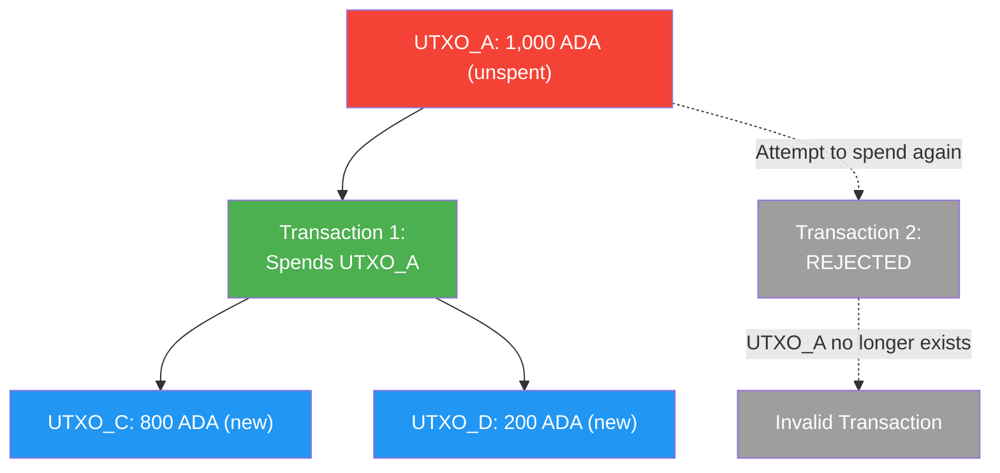
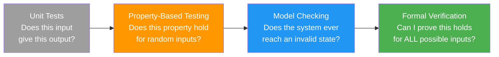
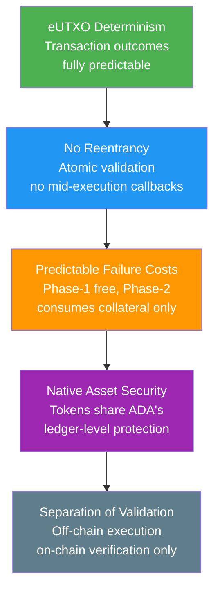

# Pelajaran #14: Keamanan Blockchain

Keamanan blockchain mencakup spektrum penuh pertahanan (dari perlindungan konsensus tingkat jaringan hingga pencegahan kerentanan smart contract) yang memastikan resistensi sensor, immutabilitas, dan eksekusi transaksi trustless pada on-chain. Bagi developer web2 yang memasuki ruang blockchain, model keamanannya secara fundamental berbeda: bug dalam smart contract bukan hanya memalukan; mereka adalah kerugian finansial yang tidak dapat dibalik. Pelajaran ini mencakup lanskap keamanan penuh, dari serangan tingkat jaringan hingga kerentanan smart contract, dan menjelaskan mengapa desain Cardano memberikan perlindungan yang berarti terhadap banyak vektor serangan yang paling merusak.

## Apa Ancaman Keamanan Utama di Tingkat Jaringan?

Ancaman tingkat jaringan menargetkan mekanisme konsensus itu sendiri, dengan serangan 51% (memerlukan kontrol stake mayoritas), serangan jarak jauh (mengeksploitasi posisi stake historis), dan serangan eclipse (mengisolasi node dari jaringan jujur) mewakili kategori utama yang dilindungi oleh protokol Ouroboros Cardano.

### Apa Itu Serangan 51%?

**Serangan 51%** (atau serangan mayoritas) memungkinkan penyerang yang mengendalikan lebih dari separuh daya konsensus untuk melakukan double spend, menyensor transaksi, dan mereorganisasi chain. Dalam sistem proof-of-work, ini berarti mengendalikan mayoritas daya penambangan; dalam model proof-of-stake Cardano, ini memerlukan pengendalian lebih dari 50% dari semua ADA yang di-stake.

```
51% Attack (Double Spend):

Honest Chain:    [Block 1] -> [Block 2] -> [Block 3: Pay Alice 100 ADA]
                                            Alice sees payment,
                                            ships goods to attacker

Attacker's Chain: [Block 1] -> [Block 2] -> [Block 3': No payment to Alice]
(created secretly                           -> [Block 4': Attacker spends
 with >50% stake)                               coins elsewhere]

When attacker publishes longer chain, network adopts it.
Alice's payment disappears. Attacker has both the goods AND the coins.
```

Dengan sekitar 22-24 miliar ADA yang di-stake di ribuan stake pools, serangan 51% memerlukan pembelian dan staking ADA senilai miliaran dolar, yang dengan sendirinya akan menaikkan harga secara dramatis, membuat serangan semakin mahal. Model delegasi non-custodial juga berarti penyerang tidak bisa sekadar "menyewa" stake; mereka harus benar-benar memperoleh dan men-stake token tersebut.

Lebih lanjut, Ouroboros menyediakan **keamanan yang dapat dibuktikan** di bawah asumsi tertentu. Bukti keamanan menjamin bahwa selama stake jujur melebihi 50%, probabilitas serangan yang berhasil menurun secara eksponensial dengan jumlah konfirmasi.

### Apa Itu Serangan Jarak Jauh?

Serangan jarak jauh adalah kekhawatiran khusus untuk sistem proof-of-stake di mana penyerang yang pernah memegang stake signifikan (tetapi sejak itu menjualnya) mencoba membuat chain alternatif mulai dari titik ketika mereka memiliki cukup stake untuk mendominasi. Protokol Ouroboros Genesis Cardano mengatasi ini dengan memungkinkan node baru membedakan antara chain jujur dan chain serangan jarak jauh dengan menganalisis kepadatan chain dan pola produksi blok.

### Apa Itu Serangan Eclipse dan Sybil?

**Serangan eclipse** mengisolasi node dari jaringan jujur dengan mengepungnya dengan peer yang dikendalikan penyerang. Node korban hanya melihat pandangan blockchain penyerang, yang mungkin mencakup transaksi double-spend atau blok yang disensor.

**Serangan Sybil** membuat banyak identitas palsu (node, stake pools) untuk mendapatkan pengaruh yang tidak proporsional atas jaringan. Dalam konteks Cardano, mekanisme saturasi dan persyaratan pledge (dibahas di Pelajaran 12) berfungsi sebagai ketahanan Sybil: membuat banyak pool memerlukan modal proporsional, dan pool tanpa pledge mendapatkan reward yang berkurang.

Lapisan jaringan P2P Cardano mencakup pertahanan terhadap serangan eclipse melalui pemilihan peer yang beragam, yang memastikan node mempertahankan koneksi ke peer di berbagai segmen jaringan dan wilayah geografis.

## Bagaimana eUTXO Mencegah Double Spending?

Model eUTXO mencegah double spending di tingkat protokol dengan melacak setiap unspent transaction output dan menghapusnya dari UTXO set saat dikonsumsi, membuat setiap upaya berikutnya untuk membelanjakan output yang sama secara struktural tidak valid.



Ini lebih sederhana dan lebih kuat daripada model account, di mana double spending harus dicegah melalui pelacakan nonce dan manajemen state yang cermat. Model UTXO membuat pencegahan double-spend bersifat struktural bukan prosedural.

## Kerentanan Smart Contract Apa yang Harus Diketahui Developer?

Bug smart contract sangat berbahaya karena contract yang sudah di-deploy bersifat immutable (atau sangat sulit dimodifikasi), dan mereka sering mengendalikan nilai finansial yang signifikan. Satu kerentanan dapat menyebabkan hilangnya dana yang tidak dapat dikembalikan. Kategori kerentanan utama meliputi reentrancy (tidak mungkin di Cardano), datum hijacking, double satisfaction, dan token forgery.

### Mengapa Cardano Kebal terhadap Serangan Reentrancy?

**Serangan reentrancy** adalah kerentanan smart contract paling terkenal, bertanggung jawab atas peretasan DAO 2016 yang kehilangan $60 juta dalam ETH. Dalam model account Ethereum, sebuah contract dapat memanggil contract lain, yang dapat memanggil kembali ke contract asli sebelum panggilan pertama selesai. Jika contract asli belum memperbarui state-nya, panggilan reentrant mengeksploitasi data yang basi.

**Cardano secara inheren kebal terhadap serangan reentrancy.** Dalam model eUTXO, transaksi adalah unit atomik yang lengkap. Script validator berjalan sekali per input, mengevaluasi apakah UTXO dapat dihabiskan di bawah kondisi yang diberikan. Tidak ada konsep contract "memanggil" contract lain di tengah eksekusi. Seluruh transaksi (dengan semua input, output, dan eksekusi script-nya) divalidasi sebagai satu unit. Semua berhasil atau semua gagal. Tidak ada state mid-execution di mana panggilan reentrant bisa mengeksploitasi data basi.

### Apa Itu Datum Hijacking?

**Datum hijacking** terjadi ketika output script tidak memvalidasi datum yang dilampirkan padanya dengan benar, memungkinkan penyerang mensubstitusi datum berbahaya yang mengubah kepemilikan atau field kritis lainnya di UTXO yang berkelanjutan.

```
Datum Hijacking:

Normal Flow:
  Input UTXO:  [Script Address, Datum: {owner: "Alice", amount: 100}]
  Output UTXO: [Script Address, Datum: {owner: "Alice", amount: 80}]
  (Alice withdrew 20 ADA)

Attack:
  Input UTXO:  [Script Address, Datum: {owner: "Alice", amount: 100}]
  Output UTXO: [Script Address, Datum: {owner: "Attacker", amount: 100}]
  (Attacker changes the owner in the continuing datum!)
```

**Pencegahan**: Validators harus secara eksplisit memeriksa bahwa output datum memenuhi semua constraint yang diharapkan. Ini termasuk memverifikasi bahwa field yang immutable (seperti kepemilikan) tidak berubah, bahwa field yang mutable (seperti saldo) berubah sesuai aturan yang diizinkan, dan bahwa struktur datum cocok dengan skema yang diharapkan.

### Apa Itu Kerentanan Double Satisfaction?

**Double satisfaction** terjadi ketika satu UTXO memenuhi kondisi beberapa validator dalam transaksi yang sama, memungkinkan penyerang memenuhi persyaratan dua script dengan satu output alih-alih dua.

```
Double Satisfaction Attack:

Script A (DEX Pool): "This swap is valid if output contains 100 DJED"
Script B (Lending):  "This withdrawal is valid if output contains 100 DJED"

Attacker's Transaction:
  Inputs:
    - DEX Pool UTXO (Script A)
    - Lending Pool UTXO (Script B)
  Outputs:
    - ONE output with 100 DJED

  Both Script A and Script B see the 100 DJED output and consider
  their conditions satisfied, but only ONE output exists.
  The attacker effectively got 100 DJED for the price of 0.
```

**Pencegahan**: Scripts harus menyertakan identifier unik dalam output mereka (seperti NFT token spesifik, sering disebut "state token" atau "beacon token") dan memvalidasi bahwa output spesifik mereka ada, bukan hanya memeriksa bahwa "beberapa output" memenuhi kondisi mereka.

### Bagaimana Cara Kerja Serangan Resource Exhaustion?

Validator Cardano memiliki budget eksekusi (batas CPU dan memori per transaksi). Serangan yang lebih halus melibatkan pembuatan transaksi yang mengonsumsi sumber daya maksimum yang diizinkan, secara efektif menciptakan kondisi denial-of-service untuk sebuah protokol.

**Pencegahan**: Penulis script harus menyadari biaya eksekusi worst-case. Menggunakan parameterized scripts, membatasi iterasi loop, dan mempra-komputasi operasi mahal secara off-chain semuanya membantu menjaga validasi on-chain tetap ringan.

### Apa Itu Token Forgery dan Kerentanan Policy?

Jika minting policy tidak ditulis dengan hati-hati, penyerang mungkin mencetak token yang tidak sah. Kerentanan umum meliputi:

- **Pemeriksaan otorisasi yang hilang**: Policy yang tidak memverifikasi keberadaan UTXO input atau signature tertentu
- **Minting policies yang dapat digunakan ulang**: Policy minting satu kali (untuk NFTs) yang sebenarnya dapat dipanggil berkali-kali
- **Manipulasi parameter policy**: Policies yang menerima parameter tetapi tidak memvalidasinya dengan benar

```
One-Time Minting (Correct Pattern):

Policy: "Minting is allowed ONLY if this specific UTXO is consumed as input"

  Transaction 1 (Minting):
    Inputs: [UTXO_Unique_123]    <-- This UTXO is consumed (destroyed)
    Mints:  [1 MyNFT]

  Transaction 2 (Attempted Re-Mint):
    Inputs: [???]                <-- UTXO_Unique_123 no longer exists!
    Mints:  [1 MyNFT]           <-- FAILS: Cannot satisfy minting policy
```

## Bagaimana Verifikasi Formal Meningkatkan Keamanan Smart Contract?

Verifikasi formal menggunakan bukti matematis untuk mendemonstrasikan bahwa sebuah program berperilaku benar untuk semua input yang mungkin (bukan hanya input yang kebetulan Anda uji), menjadikannya standar emas verifikasi perangkat lunak yang digunakan dalam sistem safety-critical seperti kedirgantaraan, perangkat medis, dan protokol kriptografis.

Bahasa smart contract Cardano Plutus dibangun di atas Haskell, bahasa pemrograman fungsional yang secara alami cocok untuk penalaran formal. Paradigma fungsional murni (tanpa side effects, tanpa mutable state) membuatnya jauh lebih mudah untuk membuktikan properti tentang perilaku kode.



**Agda** adalah bahasa pemrograman bertipe dependen dan proof assistant yang digunakan dalam spesifikasi formal Cardano. Spesifikasi ledger Cardano sendiri telah diformalisasi dalam Agda, yang berarti aturan yang mengatur blockchain telah diverifikasi secara matematis. Meskipun sebagian besar developer aplikasi tidak akan menulis Agda, fakta bahwa protokol yang mendasarinya telah diverifikasi secara formal memberikan fondasi yang kuat.

### Bagaimana Property-Based Testing Memperkuat Smart Contracts?

**Property-based testing** (PBT) adalah jalan tengah antara unit testing dan verifikasi formal. Alih-alih menentukan kasus uji individual, Anda mendefinisikan properti yang harus selalu berlaku, dan framework pengujian menghasilkan ribuan input acak untuk mencoba menemukan pelanggaran.

Untuk validator Cardano, properti mungkin meliputi:

- "Tidak ada transaksi yang dapat mengekstrak lebih banyak nilai daripada yang disetorkan ditambah reward yang diizinkan"
- "Hanya pemilik yang ditunjuk yang dapat mengotorisasi penarikan"
- "Total nilai yang terkunci di script tidak pernah berkurang kecuali melalui operasi yang diotorisasi"
- "Setiap transaksi yang lolos validasi menghasilkan output yang total nilainya sama dengan input dikurangi biaya"

Property-based testing sangat efektif untuk smart contracts karena ruang input (kemungkinan transaksi, datums, redeemers) itu kompleks dan sulit dicakup dengan kasus uji manual. Tools seperti QuickCheck (Haskell) dan Hedgehog dapat secara sistematis mengeksplorasi edge cases yang tidak pernah terpikirkan oleh developer untuk diuji secara manual.

### Mengapa Audit dan Peer Review Sangat Penting?

Di luar pengujian otomatis, audit smart contract oleh firma keamanan spesialis adalah praktik standar di industri blockchain. Audit biasanya meliputi:

1. **Code review**: Pemeriksaan baris per baris dari kode smart contract
2. **Architecture review**: Analisis desain protokol keseluruhan dan asumsi kepercayaan
3. **Analisis attack surface**: Identifikasi semua vektor serangan yang mungkin
4. **Analisis formal**: Verifikasi matematis properti kritis (jika berlaku)
5. **Penetration testing**: Mencoba mengeksploitasi contract di testnet

Di Cardano, beberapa firma berspesialisasi dalam audit smart contract Plutus, termasuk Tweag, MLabs, Anastasia Labs, dan lainnya. Protokol seperti Minswap, Liqwid, dan SundaeSwap telah menjalani beberapa putaran audit sebelum deployment mainnet.

## Keunggulan Keamanan Apa yang Disediakan Arsitektur Cardano?

Arsitektur Cardano menyediakan empat keunggulan keamanan struktural: evaluasi transaksi deterministik (mengeliminasi MEV), kekebalan reentrancy yang inheren, biaya kegagalan yang dapat diprediksi (kegagalan validasi Phase-1 tidak berbiaya; kegagalan script Phase-2 hanya mengonsumsi collateral), dan keamanan native asset yang berbagi perlindungan tingkat ledger ADA.



### Bagaimana Evaluasi Deterministik Mengeliminasi MEV?

Di Ethereum, hasil transaksi bergantung pada global state pada saat eksekusi, yang mungkin berbeda dari state ketika transaksi dibuat. Ini menciptakan kelas serangan yang secara kolektif dikenal sebagai **MEV (Maximal Extractable Value)**, di mana miner atau validator mendapatkan keuntungan dengan mengurutkan ulang, menyisipkan, atau menyensor transaksi.

Di Cardano, hasil transaksi **sepenuhnya deterministik**. Sebuah transaksi menentukan input yang tepat (UTXOs yang akan dikonsumsi) dan output yang tepat (UTXOs yang akan dibuat). Jika input yang ditentukan masih ada ketika transaksi mencapai chain, transaksi dieksekusi persis seperti yang dibuat. Jika ada input yang telah dihabiskan, transaksi hanya gagal tanpa eksekusi parsial atau efek samping yang tidak diharapkan.

Determinisme ini mengeliminasi seluruh kategori serangan dan membuatnya jauh lebih mudah untuk bernalar tentang keamanan smart contracts.

### Bagaimana Native Assets Memperkuat Keamanan?

Di Ethereum, token diimplementasikan sebagai smart contracts (ERC-20), dan setiap token contract adalah attack surface-nya sendiri. Kerentanan dalam token contracts telah menyebabkan kerugian yang signifikan. Di Cardano, native assets (tokens) ditangani oleh ledger itu sendiri, berbagi jaminan keamanan yang sama dengan ADA. Tidak ada token contract untuk dieksploitasi. Minting policy mengontrol pembuatan, tetapi begitu token ada, aturan ledger yang sama yang mengatur ADA mentransfer, menyimpan, dan memperhitungkannya.

### Bagaimana Pemisahan Validasi dan Eksekusi Membantu?

Di Cardano, "eksekusi" smart contract terjadi sepenuhnya off-chain (membangun transaksi dengan input dan output yang benar). Validator on-chain hanya memverifikasi bahwa transaksi benar. Pemisahan ini berarti:

- Lebih sedikit kode yang berjalan on-chain, mengurangi attack surface
- Kode off-chain dapat diperbarui tanpa memodifikasi validator on-chain
- Logika bisnis yang kompleks dapat diuji secara menyeluruh secara off-chain sebelum transaksi dikirim

## Apa Pola Keamanan Umum di Cardano?

Developer Cardano berpengalaman mengikuti pola yang sudah mapan untuk menulis validator yang aman:

### Pola State Token
Gunakan NFT unik (yang dicetak dengan policy satu kali) sebagai "state token" yang harus ada di setiap UTXO pada alamat script. Ini mencegah UTXO yang tidak sah dibuat di alamat tersebut dan menyelesaikan masalah double-satisfaction.

### Pemeriksaan Preservasi Nilai
Selalu verifikasi bahwa total nilai dalam output script sama dengan nilai yang diharapkan (nilai input dikurangi penarikan yang diotorisasi, ditambah deposit yang diotorisasi). Jangan mengandalkan preservasi nilai implisit.

### Validasi Kontinuitas Datum
Ketika UTXO script harus "berlanjut" (dikonsumsi dan dibuat ulang dengan state yang diperbarui), validasi secara eksplisit setiap field dari output datum terhadap aturan transisi yang diharapkan. Jangan pernah berasumsi datum benar hanya karena ada.

### Penegakan Deadline
Gunakan rentang validitas transaksi (slot valid-from dan valid-to) untuk menegakkan kondisi berbasis waktu. Interval validitas transaksi Cardano diperiksa di tingkat protokol, menyediakan batasan waktu yang andal untuk logika script.

### Logika On-Chain Minimal
Jaga validator sesederhana mungkin. Setiap baris kode on-chain adalah kerentanan potensial. Pindahkan logika kompleks ke off-chain dan gunakan validator hanya untuk memeriksa invariant kritis.

## Analogi Web2

Keamanan blockchain memiliki banyak paralel dengan keamanan web2, dan pengetahuan Anda yang ada dapat ditransfer dengan baik:

**Reentrancy seperti serangan CSRF (Cross-Site Request Forgery).** Dalam CSRF, situs web berbahaya memicu tindakan di sesi terautentikasi Anda di situs lain karena server tidak memverifikasi asal request. Dalam reentrancy, contract berbahaya memicu callback ke contract Anda pada titik yang tidak diharapkan dalam eksekusi. Keduanya mengeksploitasi kurangnya manajemen state yang tepat selama operasi. Cardano mengeliminasi ini secara struktural, sama seperti cookie SameSite dan token CSRF mengatasinya di web2.

**Datum hijacking seperti SQL injection.** Dalam SQL injection, penyerang memanipulasi data input untuk mengubah makna query. Dalam datum hijacking, penyerang memanipulasi datum untuk mengubah makna state script. Keduanya dicegah dengan memvalidasi semua data input; jangan pernah percaya bahwa data di batas sudah terformat dengan baik atau terotorisasi.

**Double satisfaction seperti parameter tampering atau insecure direct object references (IDOR).** Penyerang mereferensikan sumber daya orang lain (output) untuk memenuhi pemeriksaan otorisasi mereka sendiri. Pencegahan di kedua domain memerlukan memastikan bahwa sumber daya yang divalidasi benar-benar milik entitas yang seharusnya.

**Audit smart contract seperti penetration testing dan code audits.** Sama seperti Anda akan menyewa firma keamanan untuk melakukan pen-test pada aplikasi web Anda sebelum peluncuran (mengikuti pedoman OWASP), Anda menyewa auditor untuk meninjau smart contracts Anda sebelum deployment mainnet. Taruhannya serupa (kebocoran data vs. kehilangan dana), tetapi irreversibilitas eksploitasi smart contract membuat audit menjadi lebih kritis.

**Verifikasi formal seperti type systems yang lebih canggih.** TypeScript menangkap banyak bug pada compile time dengan memverifikasi bahwa kode Anda menangani tipe dengan benar. Verifikasi formal memperluas konsep ini ke properti arbitrer: bukan hanya "apakah ini angka?" tetapi "bisakah saldo menjadi negatif?" dan "apakah tidak mungkin bagi pengguna yang tidak terotorisasi untuk menarik dana?"

**Serangan 51% seperti hostile takeover infrastruktur.** Bayangkan jika penyerang menguasai mayoritas node edge CDN. Mereka bisa menyajikan konten berbahaya kepada pengguna yang percaya mereka mendapatkan data yang sah. Serangan 51% adalah ekuivalen blockchain: mengendalikan mayoritas daya konsensus untuk menyajikan riwayat palsu.

## Poin-Poin Penting

- **Serangan tingkat jaringan (51%, jarak jauh, eclipse) dimitigasi oleh protokol Ouroboros Cardano**, yang menyediakan keamanan yang dapat dibuktikan di bawah asumsi mayoritas jujur dan pertahanan praktis melalui distribusi stake dan jaringan P2P.
- **Kerentanan smart contract di Cardano berbeda dari Ethereum**: reentrancy tidak mungkin secara desain, tetapi developer harus berjaga terhadap datum hijacking, double satisfaction, dan token forgery melalui desain validator yang cermat.
- **Verifikasi formal dan property-based testing** memberikan jaminan yang jauh lebih kuat daripada unit testing saja, dan ekosistem berbasis Haskell Cardano sangat cocok untuk teknik verifikasi yang ketat ini.
- **Model transaksi deterministik Cardano mengeliminasi MEV dan front-running**, memberi pengguna keyakinan bahwa transaksi mereka akan dieksekusi persis seperti yang dibuat atau tidak sama sekali.
- **Keamanan adalah prinsip desain, bukan fitur**: model eUTXO, native assets, dan pemisahan validasi dari eksekusi semuanya berkontribusi pada platform yang secara struktural lebih aman untuk membangun aplikasi keuangan.

## Selanjutnya

Keamanan melindungi sistem, tetapi siapa yang memutuskan bagaimana sistem berkembang? Pelajaran terakhir dalam kursus ini membahas model governance Cardano: bagaimana perubahan protokol diusulkan, didiskusikan, divoting, dan diberlakukan melalui sistem governance on-chain paling ambisius di blockchain.
