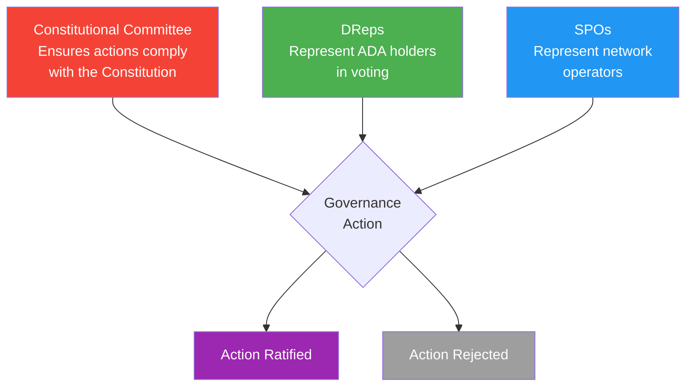
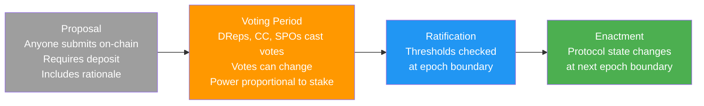
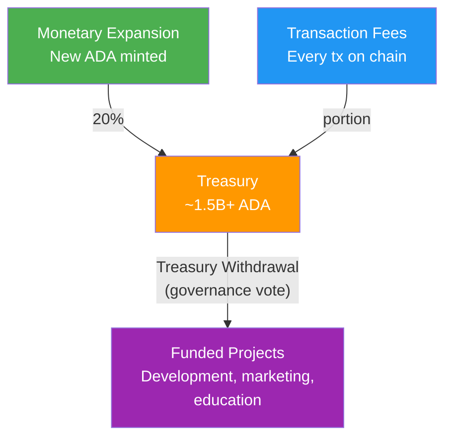

# Pelajaran #15: Governance Cardano

Sistem governance on-chain Cardano (didefinisikan oleh CIP-1694) memungkinkan pemegang ADA untuk mengusulkan, memvoting, dan memberlakukan perubahan protokol melalui tiga badan: Constitutional Committee, Delegated Representatives (DReps), dan Stake Pool Operators (SPOs). Pelajaran ini mengeksplorasi bagaimana era Voltaire bekerja, mengapa penting, dan apa artinya bagi developer yang membangun di platform ini.

## Mengapa Governance Penting bagi Developer?

Governance secara langsung membentuk parameter, versi bahasa, dan mekanisme pendanaan yang diandalkan developer Cardano, menjadikan literasi governance esensial bagi siapa pun yang membangun atau memelihara smart contracts di platform ini.

- **Parameter protokol memengaruhi kode Anda**: Batas ukuran transaksi, budget execution unit, nilai minimum UTXO, dan kalkulasi biaya semuanya adalah parameter yang dikendalikan governance. Sebuah voting governance dapat mengubah parameter ini, secara langsung memengaruhi smart contracts Anda.
- **Hard forks memerlukan koordinasi**: Ketika protokol di-upgrade (seperti hard fork Alonzo yang memperkenalkan smart contracts, atau hard fork Chang yang mengaktifkan governance on-chain), setiap stake pool dan operator node harus melakukan upgrade. Memahami proses governance membantu Anda mengantisipasi dan mempersiapkan perubahan ini.
- **Pendanaan treasury**: Treasury Cardano menyimpan ratusan juta ADA, dan governance menentukan bagaimana itu dibelanjakan. Sebagai developer, Anda dapat mengusulkan proyek untuk pendanaan treasury.
- **Pengguna Anda berpartisipasi**: Pemegang ADA adalah peserta governance. Jika Anda membangun wallet, protokol DeFi, atau aplikasi Cardano apa pun, pengguna Anda mungkin berinteraksi dengan fitur governance melalui antarmuka Anda.

## Bagaimana Cardano Mencapai Era Voltaire?

Pengembangan Cardano mengikuti roadmap bertahap (Byron, Shelley, Goguen, Basho, Voltaire), dengan setiap fase menambahkan kemampuan fondasi yang berpuncak pada governance on-chain penuh era Voltaire, mentransisikan kontrol dari entitas pendiri ke komunitas pemegang ADA.

```
Cardano Development Phases:

Byron (2017)       : Foundation; basic transactions, ADA transfers
Shelley (2020)     : Decentralization; staking, delegation, stake pools
Goguen (2021)      : Smart Contracts; Plutus, native assets, DeFi
Basho (ongoing)    : Scaling; Hydra, sidechains, performance optimization
Voltaire (2024+)   : Governance; on-chain voting, treasury, self-sustainability
```

Era Voltaire merepresentasikan transisi Cardano dari sistem yang dikelola oleh entitas pendirinya (Input Output Global, Cardano Foundation, dan EMURGO) ke sistem yang dikelola oleh komunitas pemegang ADA. Ini bukan perubahan kosmetik. Ini berarti tidak ada satu perusahaan atau organisasi pun yang memiliki kontrol unilateral atas masa depan protokol.

**Hard fork Chang** (September 2024) mengaktifkan fase pertama governance on-chain, dan **hard fork Plomin** (29 Januari 2025, awalnya disebut Chang #2) mengaktifkan fitur governance yang tersisa, sepenuhnya mengimplementasikan CIP-1694.

## Apa Tiga Badan Governance dalam CIP-1694?

CIP-1694 menetapkan tiga badan governance (Constitutional Committee, Delegated Representatives, dan Stake Pool Operators) yang membentuk sistem checks-and-balances di mana setiap badan mewakili konstituen yang berbeda dan memvoting jenis governance action yang berbeda.



**Constitutional Committee (CC)**: Sekelompok anggota terpilih yang berfungsi sebagai penjaga konstitusi. Peran mereka adalah memverifikasi bahwa governance actions yang diusulkan mematuhi Konstitusi Cardano, dokumen dasar yang mendefinisikan nilai, prinsip, dan aturan yang mengatur blockchain. CC tidak memutuskan apakah suatu tindakan adalah ide yang baik; mereka memutuskan apakah tindakan tersebut diizinkan secara konstitusional. Anggap mereka sebagai mahkamah konstitusi.

CC memiliki masa jabatan terbatas (anggota menjabat untuk periode yang ditentukan dan harus dipilih kembali), ambang batas ukuran (jumlah minimum anggota harus memvoting), dan dapat diganti melalui voting "no confidence" jika komunitas percaya mereka tidak menjalankan peran mereka.

**Delegated Representatives (DReps)**: DReps adalah suara utama pemegang ADA dalam governance. Pemegang ADA mana pun dapat mendaftar sebagai DRep atau mendelegasikan hak voting mereka ke DRep yang mereka percaya. Ini analog dengan demokrasi perwakilan: Anda mungkin tidak punya waktu untuk mengevaluasi setiap proposal governance, jadi Anda mendelegasikan voting Anda ke seseorang yang akan mewakili kepentingan Anda.

**Stake Pool Operators (SPOs)**: SPOs berpartisipasi dalam voting governance pada jenis tindakan tertentu, khususnya inisiasi hard fork dan perubahan parameter protokol tertentu. Voting mereka mencerminkan perspektif operator infrastruktur jaringan yang harus mengimplementasikan perubahan protokol.

### Bagaimana Cara Kerja Delegasi Governance?

Sama seperti pemegang ADA mendelegasikan stake mereka ke stake pool untuk produksi blok (Pelajaran 12), mereka mendelegasikan hak voting mereka ke DRep untuk governance. Yang penting, delegasi stake dan delegasi governance bersifat independen. Anda dapat mendelegasikan stake Anda ke Pool A untuk reward sambil mendelegasikan voting Anda ke DRep B untuk governance.

```
Delegation: Stake vs. Governance

+------------------+
|   ADA Holder     |
|   (10,000 ADA)   |
+--------+---------+
         |
    +----+----+
    |         |
    v         v
+--------+ +--------+
| Stake  | | Vote   |
| Deleg. | | Deleg. |
|        | |        |
| Pool A | | DRep B |
|(rewards| |(govrnce|
| & block| | voting)|
| prod.) | |        |
+--------+ +--------+

These are SEPARATE delegations.
You can change one without affecting the other.
```

Ada juga dua opsi delegasi khusus untuk pemegang ADA yang tidak ingin memilih DRep tertentu:

- **Abstain**: Hak voting Anda tidak dihitung dalam voting apa pun. Anda secara eksplisit memilih untuk tidak berpartisipasi.
- **No Confidence**: Hak voting Anda secara otomatis memvoting menolak governance action apa pun, mengekspresikan ketidakpercayaan pada sistem governance saat ini. Ini adalah bentuk delegasi protes.

Setiap pemegang ADA harus memilih delegasi governance (DRep tertentu, Abstain, atau No Confidence) agar memenuhi syarat untuk staking rewards. Ini memastikan partisipasi yang luas dalam governance.

## Apa Tujuh Jenis Governance Actions?

CIP-1694 mendefinisikan tujuh jenis governance action (no confidence, komite baru, pembaruan konstitusi, inisiasi hard fork, perubahan parameter, penarikan treasury, dan info action), masing-masing memerlukan persetujuan dari kombinasi spesifik badan governance pada ambang batas voting tertentu.

```
Governance Action Types:

+-------------------------+----------+-------+------+
| Action Type             |    CC    | DReps | SPOs |
+-------------------------+----------+-------+------+
| 1. No Confidence        |    --    |  Yes  | Yes  |
| 2. New Committee/       |    --    |  Yes  | Yes  |
|    Threshold            |          |       |      |
| 3. Constitution Update  |   Yes    |  Yes  |  --  |
| 4. Hard Fork Initiation |   Yes    |  Yes  | Yes  |
| 5. Protocol Parameter   |   Yes    |  Yes  |  *   |
|    Changes              |          |       |      |
| 6. Treasury Withdrawal  |   Yes    |  Yes  |  --  |
| 7. Info Action          |    --    |  Yes  | Yes  |
+-------------------------+----------+-------+------+

CC  = Constitutional Committee must approve
Yes = This body votes on this action
--  = This body does not vote on this action
*   = SPOs vote on specific parameter groups only
```

**1. Mosi No Confidence**: Voting untuk membubarkan Constitutional Committee saat ini. Jika disetujui, CC dibubarkan, dan komite baru harus dipilih sebelum sebagian besar governance actions lainnya dapat dilanjutkan. Ini adalah mekanisme darurat komunitas untuk menghapus CC yang telah kehilangan legitimasinya.

**2. Constitutional Committee / Perubahan Threshold Baru**: Mengusulkan anggota CC baru, menghapus anggota yang ada, atau mengubah persyaratan ukuran/threshold CC. Inilah cara komunitas memilih atau mengganti penjaga konstitusinya.

**3. Pembaruan Konstitusi**: Mengubah Konstitusi Cardano itu sendiri. Ini adalah perubahan governance tingkat tertinggi, mengubah dokumen fondasi yang harus dipatuhi oleh semua tindakan lain. Memerlukan persetujuan CC dan DRep tetapi bukan voting SPO.

**4. Inisiasi Hard Fork**: Memicu upgrade protokol yang mengubah aturan konsensus. Ini memerlukan ketiga badan governance karena hard fork memengaruhi semua orang: konstitusi (harus diizinkan), komunitas (mereka harus menerima perubahannya), dan operator (mereka harus memperbarui perangkat lunak mereka).

**5. Perubahan Parameter Protokol**: Memodifikasi parameter protokol yang dapat dikonfigurasi, dikelompokkan ke dalam kategori network (throughput), economic (biaya dan insentif), technical (batas script), dan governance.

**6. Penarikan Treasury**: Menarik ADA dari treasury on-chain untuk mendanai proyek, pengembangan, atau inisiatif ekosistem. Ini adalah mekanisme di mana komunitas mengalokasikan sumber daya.

**7. Info Action**: Voting "sense of the community" yang tidak mengikat. Info actions tidak mengubah protokol tetapi berfungsi sebagai mekanisme formal bagi komunitas untuk mengekspresikan pendapat, menetapkan arah, atau mendukung posisi.

## Apa Siklus Hidup Governance Action?

Sebuah governance action bergerak melalui empat tahap: proposal (siapa pun mengirim on-chain dengan deposit), periode voting (DReps, CC, dan SPOs memberikan voting), ratifikasi (protokol memeriksa threshold pada batas epoch), dan pemberlakuan (state protokol berubah pada batas epoch berikutnya).



### Apa Threshold Voting-nya?

Setiap jenis governance action memiliki persyaratan threshold spesifik untuk setiap badan governance. Threshold ini sendiri adalah parameter yang dikendalikan governance, artinya komunitas dapat menyesuaikannya melalui proses governance.

Misalnya, inisiasi hard fork mungkin memerlukan:

- CC: Mayoritas anggota aktif harus menyetujui
- DReps: 67% dari hak voting aktif harus memvoting Ya
- SPOs: 51% dari stake aktif harus memvoting Ya

Info action mungkin memerlukan:

- DReps: 51% dari hak voting aktif
- SPOs: 51% dari stake aktif

Threshold yang tepat ditetapkan sebagai parameter protokol dan dapat dilihat on-chain.

## Apa Itu Konstitusi Cardano?

Konstitusi Cardano adalah dokumen fondasi (diratifikasi melalui voting governance on-chain) yang menetapkan prinsip, nilai, hak, dan guardrails yang mengatur blockchain, berfungsi sebagai "hukum tertinggi" di mana Constitutional Committee mengevaluasi setiap governance action.

Konstitusi mencakup:

- **Tujuan dan Prinsip**: Mengapa Cardano ada dan nilai apa yang memandu governance-nya
- **Hak Pemegang ADA**: Perlindungan untuk peserta dalam ekosistem
- **Kerangka Governance**: Struktur dan aturan yang didefinisikan oleh CIP-1694
- **Parameter Protokol**: Guardrails yang membatasi seberapa jauh parameter dapat diubah dalam satu tindakan (mencegah perubahan yang ekstrem atau berbahaya)
- **Proses Amandemen**: Bagaimana Konstitusi itu sendiri dapat dimodifikasi

Constitutional Committee mengevaluasi setiap governance action terhadap dokumen ini. Jika sebuah tindakan melanggar Konstitusi (misalnya, mengusulkan perubahan parameter di luar rentang guardrail), CC harus memvoting menolaknya, mencegah ratifikasi terlepas dari dukungan DRep atau SPO.

```
Constitutional Guardrails Example:

Parameter: Maximum Block Size
Current value: 90,112 bytes
Guardrail: Cannot be changed by more than 2x in a single action

Proposed Action: Set max block size to 200,000 bytes
CC Assessment: 200,000 > 90,112 * 2 = 180,224
              This exceeds the guardrail. CC votes NO.

Proposed Action: Set max block size to 131,072 bytes
CC Assessment: 131,072 < 180,224
              Within guardrails. CC evaluates on merit.
```

## Bagaimana Cara Kerja Treasury Cardano?

Treasury Cardano mengakumulasi ADA dari ekspansi moneter (20% dari reward setiap epoch) dan biaya transaksi, saat ini menyimpan lebih dari 1,5 miliar ADA yang hanya dapat dibelanjakan melalui voting governance on-chain, menjadikannya salah satu treasury terdesentralisasi terbesar di blockchain.



Sebelum CIP-1694, penarikan treasury dikelola melalui **Project Catalyst**, mekanisme pendanaan yang sebagian on-chain, sebagian off-chain. Dengan era Voltaire, penarikan treasury sekarang menjadi jenis governance action formal, memberikan pemegang ADA kontrol langsung atas bagaimana sumber daya bersama dialokasikan.

## Peran Apa yang Dimainkan Intersect dalam Governance?

**Intersect** adalah organisasi berbasis keanggotaan yang berfungsi sebagai tulang punggung administratif governance Cardano, mengoordinasikan pemeliharaan codebase, tooling governance, dan program komunitas tanpa menjalankan otoritas governing itu sendiri.

Peran Intersect meliputi:

- **Memelihara codebase Cardano**: Mengoordinasikan pengembangan perangkat lunak inti (cardano-node, Plutus, dll.)
- **Memfasilitasi proses governance**: Menyediakan tools, dokumentasi, dan infrastruktur untuk partisipasi governance
- **Mengelola ekosistem governance**: Mendukung DReps, mengoordinasikan pemilihan Constitutional Committee, dan memelihara tooling governance
- **Koordinasi komunitas**: Mengorganisir workshop, town hall, dan program edukasi seputar governance

Keanggotaan Intersect terbuka untuk organisasi dan individu. Anggota dapat berpartisipasi dalam working groups, berkontribusi pada keputusan teknis, dan membantu membentuk proses governance. Strukturnya dirancang untuk mencegah entitas tunggal mendominasi, dengan board yang beragam dan operasi yang transparan.

## Tools Governance Apa yang Tersedia?

Agar governance berfungsi, peserta memerlukan tools untuk menemukan, mengevaluasi, dan memvoting proposal. Ekosistem Cardano mencakup beberapa tools governance:

- **GovTool**: Antarmuka berbasis web untuk menelusuri governance actions, mendelegasikan ke DReps, dan memberikan voting. Terhubung ke wallet Cardano Anda (seperti Eternl, Lace, atau Yoroi) untuk penandatanganan transaksi.
- **SanchoNet**: Testnet governance khusus di mana fitur governance diuji sebelum deployment mainnet. Dinamai dari Sancho Panza, pendamping praktis Don Quixote (Voltaire menjadi namesake era ini).
- **DRep Explorer**: Tools untuk menemukan DReps, melihat riwayat voting mereka, dan mengevaluasi posisi mereka.
- **Cardanoscan / CExplorer**: Block explorers yang menampilkan governance actions, voting, dan informasi komite bersama data transaksi.

Untuk developer wallet, integrasi governance berarti mendukung:
- Transaksi registrasi DRep
- Transaksi delegasi voting (terpisah dari delegasi stake)
- Menampilkan proposal governance dan status voting
- Mengaktifkan voting langsung untuk DReps yang terdaftar

## Bagaimana Governance Memengaruhi Pengembangan Smart Contract?

Keputusan governance secara langsung memengaruhi developer smart contract dengan cara konkret, dari perubahan budget eksekusi hingga upgrade bahasa Plutus hingga peluang pengembangan yang didanai treasury.

**Perubahan parameter memengaruhi budget eksekusi script.** Jika governance mengurangi execution units maksimum per transaksi, script yang ada yang menggunakan mendekati batas saat ini mungkin berhenti berfungsi. Developer smart contract harus mendesain dengan margin dan memantau proposal governance yang memengaruhi parameter teknis.

**Hard forks dapat mengubah bahasa Plutus.** Upgrade protokol dapat memperkenalkan versi Plutus baru (Plutus V1, V2, V3) dengan kemampuan baru. Meskipun backward compatibility dipertahankan (script V1 terus berfungsi), fitur baru mungkin memerlukan script V3. Hard fork Chang, misalnya, memperkenalkan Plutus V3 dengan fungsi built-in baru untuk interaksi governance.

**Penarikan treasury mendanai pengembangan ekosistem.** Sebagai developer, Anda dapat mengirimkan proposal penarikan treasury untuk mendanai proyek Anda. Ini adalah alternatif langsung, on-chain untuk venture capital atau grant dari entitas terpusat.

**Governance actions adalah transaksi on-chain.** Registrasi DRep, delegasi voting, dan voting governance semuanya adalah transaksi Cardano standar. Mereka menggunakan infrastruktur yang sama (wallets, APIs, nodes) yang sudah Anda gunakan sebagai developer. Anda dapat membangun tooling governance, dashboard analitik, atau platform DRep menggunakan keterampilan dan tools yang sama dari Pelajaran 13.

## Apa yang Terjadi Selama Fase Bootstrapping?

Ketika hard fork Chang pertama kali mengaktifkan governance, Cardano memasuki **fase bootstrapping** dengan Constitutional Committee sementara, governance actions yang terbatas, dan Konstitusi interim yang berlaku sementara komunitas membiasakan diri dengan sistem baru dan proses ratifikasi penuh berlangsung secara paralel.

- Constitutional Committee sementara ("interim") dibentuk
- Governance actions dibatasi untuk mencegah perubahan prematur sementara komunitas membiasakan diri dengan sistem baru
- Registrasi dan delegasi DRep aktif, memungkinkan ekosistem governance berkembang secara organik
- Konstitusi interim berlaku, dengan proses ratifikasi penuh untuk Konstitusi final berlangsung secara paralel

Fase bootstrapping berakhir dengan hard fork Plomin (29 Januari 2025), yang mengaktifkan kemampuan governance penuh dan bertransisi ke Konstitusi yang diratifikasi dan Constitutional Committee terpilih.

## Tantangan Apa yang Dihadapi Governance On-Chain?

Governance on-chain adalah eksperimen, dan implementasi Cardano menghadapi beberapa tantangan yang umum pada semua sistem demokratis: partisipasi pemilih, asimetri informasi, dinamika plutokratis, dan ketahanan adversarial.

**Partisipasi pemilih**: Seperti semua sistem demokratis, governance memerlukan partisipasi aktif. Jika sebagian besar pemegang ADA mendelegasikan ke "Abstain" atau hanya tidak terlibat, minoritas kecil dapat mengendalikan keputusan governance. Persyaratan untuk memilih opsi delegasi agar mendapatkan staking rewards adalah salah satu mekanisme untuk mendorong partisipasi.

**Asimetri informasi**: Mengevaluasi proposal teknis yang kompleks (seperti perubahan parameter protokol) memerlukan keahlian yang mungkin tidak dimiliki sebagian besar pemegang ADA. DReps mengatasi ini dengan berspesialisasi dalam evaluasi governance, tetapi ekosistem DRep masih berkembang.

**Kekhawatiran plutokratis**: Hak voting proporsional terhadap stake. Whale yang memegang 100 juta ADA memiliki 10.000 kali hak voting dibanding seseorang yang memegang 10.000 ADA. Ini inheren dalam governance berbasis stake dan merupakan pilihan desain yang disengaja (mereka yang memiliki lebih banyak taruhan lebih banyak kehilangan dari keputusan yang buruk), tetapi ini menimbulkan pertanyaan tentang keadilan dan aksesibilitas.

**Vektor serangan governance**: Pihak lawan yang memiliki dana cukup berpotensi memperoleh cukup ADA untuk memengaruhi voting governance. Sistem checks-and-balances (tiga badan governance, guardrails konstitusional, threshold bertingkat) membuatnya sulit, tetapi tidak ada sistem yang kebal terhadap serangan.

Tantangan ini tidak unik untuk Cardano. Setiap sistem governance (dari pemerintah nasional hingga proyek open-source) bergulat dengan partisipasi, keahlian, distribusi kekuatan, dan ketahanan. Governance on-chain Cardano membuat dinamika ini transparan dan programmable, yang merupakan keunggulan tersendiri.

## Analogi Web2

Governance Cardano dipetakan ke beberapa pola yang familiar di dunia web2 dan open-source:

**DReps seperti perwakilan terpilih di yayasan open-source.** Linux Foundation memiliki board of directors yang dipilih oleh anggotanya. Apache Software Foundation memiliki board yang dipilih oleh anggotanya. DReps melayani peran serupa: dipilih (melalui delegasi) oleh pemegang ADA untuk mewakili kepentingan mereka dalam keputusan governance. Perbedaan utamanya adalah delegasi DRep bersifat fluid (Anda dapat mengganti DRep kapan saja) dan proporsional (bobot voting Anda sama dengan kepemilikan ADA Anda).

**Constitutional Committee seperti standards body.** IETF (Internet Engineering Task Force) meninjau RFCs untuk memastikan mereka memenuhi standar teknis. CC meninjau governance actions untuk memastikan mereka memenuhi standar konstitusional. Kedua badan tidak memutuskan apa yang harus dibangun; mereka memverifikasi bahwa proposal mematuhi aturan dan prinsip yang ditetapkan.

**Proses governance action seperti RFC (Request for Comments).** Di IETF, siapa pun dapat mengirimkan RFC yang mengusulkan standar baru. RFC melewati review, diskusi, dan akhirnya diterima, ditolak, atau ditarik. Governance actions Cardano mengikuti siklus hidup serupa: proposal, evaluasi komunitas, voting, dan pemberlakuan atau kedaluwarsa.

**Treasury seperti corporate venture fund atau program grant open-source.** OSPO (Open Source Programs Office) Google, Sovereign Tech Fund, atau grant Apache Software Foundation semuanya mengalokasikan sumber daya bersama ke proyek yang menguntungkan komunitas. Treasury Cardano melayani tujuan yang sama tetapi dengan pengambilan keputusan yang sepenuhnya transparan dan on-chain.

**Intersect seperti Linux Foundation atau Apache Foundation.** Menyediakan koordinasi administratif, memelihara infrastruktur bersama, dan memfasilitasi governance komunitas tanpa mengendalikannya. Sama seperti Linux Foundation tidak mendikte kode apa yang masuk ke kernel Linux (itu adalah Linus Torvalds dan para maintainer), Intersect tidak mendikte keputusan governance Cardano (itu adalah DReps, CC, dan SPOs).

**Guardrails seperti rate limiters dan circuit breakers.** Dalam sistem web2, Anda menetapkan rate limits untuk mencegah pengguna tunggal membanjiri API Anda, dan circuit breakers untuk mencegah kegagalan berjenjang. Guardrails konstitusional melayani tujuan yang sama: mencegah satu governance action membuat perubahan ekstrem yang dapat mendestabilisasi jaringan.

## Poin-Poin Penting

- **CIP-1694 menetapkan tiga badan governance** (Constitutional Committee, DReps, dan SPOs) dengan checks and balances, memastikan tidak ada satu kelompok pun yang dapat secara unilateral mengendalikan arah Cardano.
- **Tujuh jenis governance action** mencakup setiap aspek manajemen protokol, dari hard forks dan perubahan parameter hingga penarikan treasury dan amandemen konstitusional, masing-masing dengan threshold voting yang sesuai.
- **Delegasi governance terpisah dari delegasi stake**: pemegang ADA dapat memilih DRep untuk voting governance secara independen dari pemilihan stake pool mereka, dengan setiap pemegang wajib berpartisipasi (atau secara eksplisit abstain) untuk mendapatkan staking rewards.
- **Treasury Cardano**, menyimpan lebih dari 1,5 miliar ADA, sepenuhnya dikendalikan melalui governance on-chain, menyediakan mekanisme pendanaan yang berkelanjutan untuk pengembangan ekosistem tanpa bergantung pada entitas terpusat mana pun.
- **Governance on-chain secara langsung memengaruhi developer**: parameter protokol, versi bahasa Plutus, dan peluang pendanaan semuanya dikendalikan governance, menjadikan literasi governance esensial bagi siapa pun yang membangun di Cardano.

## Selanjutnya

Selamat! Anda telah menyelesaikan kursus Teori Blockchain. Selama lima belas pelajaran ini, Anda telah menempuh perjalanan dari dasar-dasar hashing kriptografis dan konsensus terdistribusi melalui smart contracts, native assets, DeFi, dan governance. Anda sekarang memiliki fondasi teoretis yang solid untuk memahami bagaimana Cardano bekerja dan mengapa ia dirancang seperti demikian.

Langkah selanjutnya yang natural adalah mempraktikkan pengetahuan ini. Kunjungi kursus coding [Hello Cardano](/id/course-cardano), di mana Anda akan mulai membangun di Cardano: menyiapkan lingkungan pengembangan, membangun transaksi, berinteraksi dengan smart contracts, dan men-deploy aplikasi on-chain pertama Anda. Teori yang telah Anda pelajari di sini akan menjadi kompas Anda saat Anda menavigasi tantangan praktis pengembangan blockchain.
