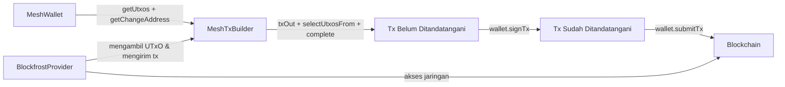

# Pelajaran #01: Hello World

Pelajaran ini membahas dasar-dasar pengembangan aplikasi Cardano: menginstal [Mesh SDK](https://meshjs.dev/), membuat wallet dengan `MeshWallet`, dan mengirim lovelace menggunakan `MeshTxBuilder`.

> Source code: [GitHub](https://github.com/cardanobuilders/cardanobuilders.github.io/tree/main/codes/course-cardano/01-wallet-send-lovelace)

## Persiapan sistem

Kursus ini membutuhkan Node.js v24+. Kami merekomendasikan penggunaan [nvm](https://github.com/nvm-sh/nvm) untuk mengelola versi Node Anda.

### Buat file package.json

Pertama, buat file `package.json` baru di root proyek Anda dengan konten berikut:

```json
{
  "type": "module",
  "dependencies": {},
  "scripts": {}
}
```

### Instal paket yang diperlukan

Buka terminal Anda dan jalankan perintah berikut untuk menginstal MeshSDK:

```bash
npm install
npm install @meshsdk/core
```

Berikut tampilan file `package.json` Anda setelah menginstal paket:

```json
{
  "type": "module",
  "dependencies": {
    "@meshsdk/core": "^1.9.0",
  },
  "scripts": {}
}
```

- `@meshsdk/core`: Fungsionalitas inti untuk interaksi jaringan, wallet, dan transaksi.

## Membuat wallet


[`MeshWallet`](https://meshjs.dev/apis/wallets/meshwallet) menyediakan metode untuk membuat wallet, menghasilkan mnemonic phrase, dan mengambil alamat wallet.

### Menghasilkan mnemonic phrase

Mnemonic phrase adalah sekumpulan kata yang digunakan untuk memulihkan wallet Anda. Simpan mnemonic phrase Anda dengan aman; siapa pun yang memiliki akses ke mnemonic phrase dapat mengendalikan dana Anda.

Hasilkan mnemonic baru:

```ts
import { MeshWallet } from "@meshsdk/core";

// Generate new mnemonic phrases for your wallet
const mnemonic = MeshWallet.brew();
console.log("Your mnemonic phrases are:", mnemonic);
```

- Gunakan metode `brew` untuk menghasilkan mnemonic phrase baru.

### Inisialisasi wallet dan dapatkan alamat wallet

Setelah mnemonic phrase dihasilkan, inisialisasi wallet:

```ts
// Initialize the wallet with a mnemonic key
const wallet = new MeshWallet({
  networkId: 0, // preprod testnet
  key: {
    type: "mnemonic",
    words: mnemonic as string[],
  },
});

// Get the wallet address
const address = await wallet.getChangeAddress();
console.log("Your wallet address is:", address);
```

- `networkId`: Tentukan jaringan, 0 untuk preprod testnet.
- `key`: Tentukan tipe kunci dan mnemonic phrase.
- `getChangeAddress`: Metode untuk mendapatkan alamat wallet.

### Jalankan kode

Buat file baru `mnemonic.ts` dengan kode berikut:

```ts
import { MeshWallet } from "@meshsdk/core";

// Generate new mnemonic phrases for your wallet
const mnemonic = MeshWallet.brew();
console.log("Your mnemonic phrases are:", mnemonic);

// Initialize the wallet with a mnemonic key
const wallet = new MeshWallet({
  networkId: 0, // preprod testnet
  key: {
    type: "mnemonic",
    words: mnemonic as string[],
  },
});

// Get the wallet address
const address = await wallet.getChangeAddress();
console.log("Your wallet address is:", address);
```

Perbarui file `package.json` untuk menambahkan script menjalankan kode:

```json
{
  "type": "module",
  "dependencies": {
    "@meshsdk/core": "^1.9.0",
  },
  "scripts": {
    "mnemonic": "node mnemonic.ts"
  }
}
```

Jalankan script:

```bash
npm run mnemonic
```
Ini akan menghasilkan mnemonic phrase dan alamat wallet baru. Outputnya akan terlihat seperti:

```bash
> mnemonic
> node mnemonic.ts

Your mnemonic phrases are: [
  'access',  'spawn',   'taxi',
  'prefer',  'fortune', 'sword',
  'nerve',   'price',   'valid',
  'panther', 'sure',    'hello',
  'layer',   'try',     'grace',
  'seven',   'fossil',  'voice',
  'tobacco', 'circle',  'measure',
  'solar',   'pride',   'together'
]
Your wallet address is: addr_test1qptwuv6dl863u3k93mjrg0hgs0ahl08lfhsudxrwshcsx59cjxatme29s6cl7drjceknunry049shu9eudnsjvwqq9qsuem66d
```

## Mengirim lovelace

Dengan wallet yang sudah memiliki saldo, Anda dapat mengirim lovelace menggunakan kelas `MeshTxBuilder` untuk membangun dan mengirim transaksi ke jaringan.

### Dapatkan lovelace dari faucet

Gunakan [Cardano Preprod Testnet Faucet](https://docs.cardano.org/cardano-testnets/tools/faucet) untuk mendapatkan lovelace uji coba. Tempel alamat wallet Anda, klik "Request funds," dan Anda akan menerima lovelace segera.

### Dapatkan API key Blockfrost

Pembuatan transaksi memerlukan pengambilan UTXOs dari jaringan. Daftar akun [Blockfrost](https://blockfrost.io/) gratis dan dapatkan API key preprod (dimulai dengan `preprod`). Anda dapat menemukan key tersebut di bagian "Projects" pada dashboard Blockfrost Anda.

### Dapatkan informasi wallet

Ambil UTXOs dan change address wallet:

```ts
// Get wallet data needed for the transaction
const utxos = await wallet.getUtxos();
const changeAddress = await wallet.getChangeAddress();
```

- `getUtxos`: Metode untuk mendapatkan UTXOs dari wallet.
- `getChangeAddress`: Metode untuk mendapatkan change address.

### Buat transaksi untuk mengirim lovelace

Bangun transaksi menggunakan [`MeshTxBuilder`](https://meshjs.dev/apis/txbuilder):

```ts
// Create the transaction
const txBuilder = new MeshTxBuilder({
  fetcher: provider,
  verbose: true, // optional, prints the transaction body
});

const unsignedTx = await txBuilder
  .txOut(
    "addr_test1qpvx0sacufuypa2k4sngk7q40zc5c4npl337uusdh64kv0uafhxhu32dys6pvn6wlw8dav6cmp4pmtv7cc3yel9uu0nq93swx9",
    [{ unit: "lovelace", quantity: "1500000" }]
  )
  .changeAddress(changeAddress)
  .selectUtxosFrom(utxos)
  .complete();
```

- `txOut`: Tambahkan alamat penerima dan jumlah.
- `changeAddress`: Tetapkan change address.
- `selectUtxosFrom`: Masukkan UTXOs wallet ke dalam transaksi sebagai input.
- `complete`: Buat transaksi.

### Tanda tangani dan kirim transaksi

Tanda tangani dan kirim transaksi ke jaringan:

```ts
const signedTx = await wallet.signTx(unsignedTx);
const txHash = await wallet.submitTx(signedTx);
console.log("Transaction hash:", txHash);
```

- `signTx`: Metode untuk menandatangani transaksi, yang akan mengembalikan transaksi yang sudah ditandatangani.
- `submitTx`: Metode untuk mengirim transaksi ke jaringan.

### Jalankan kode

Buat file baru `send-lovelace.ts` dengan kode lengkap:

```ts
import { BlockfrostProvider, MeshTxBuilder, MeshWallet } from "@meshsdk/core";

// Set up the blockchain provider with your key
const provider = new BlockfrostProvider("YOUR_KEY_HERE");

// Initialize the wallet with a mnemonic key
const wallet = new MeshWallet({
  networkId: 0,
  fetcher: provider,
  submitter: provider,
  key: {
    type: "mnemonic",
    words: ["your", "mnemonic", "...", "here"],
  },
});

// Get wallet data needed for the transaction
const utxos = await wallet.getUtxos();
const changeAddress = await wallet.getChangeAddress();

// Create the transaction
const txBuilder = new MeshTxBuilder({
  fetcher: provider,
  verbose: true, // optional, prints the transaction body
});

const unsignedTx = await txBuilder
  .txOut(
    "addr_test1qpvx0sacufuypa2k4sngk7q40zc5c4npl337uusdh64kv0uafhxhu32dys6pvn6wlw8dav6cmp4pmtv7cc3yel9uu0nq93swx9",
    [{ unit: "lovelace", quantity: "1500000" }]
  )
  .changeAddress(changeAddress)
  .selectUtxosFrom(utxos)
  .complete();

const signedTx = await wallet.signTx(unsignedTx);
const txHash = await wallet.submitTx(signedTx);
console.log("Transaction hash:", txHash);
```

Perbarui file `package.json` untuk menambahkan script menjalankan kode:

```json
{
  "type": "module",
  "dependencies": {
    "@meshsdk/core": "^1.9.0",
  },
  "scripts": {
    "mnemonic": "node mnemonic.ts",
    "send-lovelace": "node send-lovelace.ts"
  }
}
```

Jalankan script:

```bash
npm run send-lovelace
```

Ini akan membangun, menandatangani, dan mengirim transaksi lovelace. Outputnya akan terlihat seperti:

```bash
> send-lovelace
> node send-lovelace.ts

txBodyJson - before coin selection {"inputs":[],"outputs":[{"address":"addr_test1qpvx0sacufuypa2k4sngk7q40zc5c4npl337uusdh64kv0uafhxhu32dys6pvn6wlw8dav6cmp4pmtv7cc3yel9uu0nq93swx9","amount":[{"unit":"lovelace","quantity":"1500000"}]}],"fee":"0","collaterals":[],"requiredSignatures":[],"referenceInputs":[],"mints":[],"changeAddress":"addr_test1qp2k7wnshzngpqw0xmy33hvexw4aeg60yr79x3yeeqt3s2uvldqg2n2p8y4kyjm8sqfyg0tpq9042atz0fr8c3grjmysdp6yv3","metadata":{},"validityRange":{},"certificates":[],"withdrawals":[],"votes":[],"signingKey":[],"chainedTxs":[],"inputsForEvaluation":{},"network":"mainnet","expectedNumberKeyWitnesses":0,"expectedByronAddressWitnesses":[]}
txBodyJson - after coin selection {"inputs":[{"type":"PubKey","txIn":{"txHash":"99d859b305ab8021e497fad0dc55373e50fffd3e7026142fa3cf5accfe0d3aab","txIndex":1,"amount":[{"unit":"lovelace","quantity":"9823719"}],"address":"addr_test1qp2k7wnshzngpqw0xmy33hvexw4aeg60yr79x3yeeqt3s2uvldqg2n2p8y4kyjm8sqfyg0tpq9042atz0fr8c3grjmysdp6yv3"}}],"outputs":[{"address":"addr_test1qpvx0sacufuypa2k4sngk7q40zc5c4npl337uusdh64kv0uafhxhu32dys6pvn6wlw8dav6cmp4pmtv7cc3yel9uu0nq93swx9","amount":[{"unit":"lovelace","quantity":"1500000"}]},{"address":"addr_test1qp2k7wnshzngpqw0xmy33hvexw4aeg60yr79x3yeeqt3s2uvldqg2n2p8y4kyjm8sqfyg0tpq9042atz0fr8c3grjmysdp6yv3","amount":[{"unit":"lovelace","quantity":"8153730"}]}],"fee":"169989","collaterals":[],"requiredSignatures":[],"referenceInputs":[],"mints":[],"changeAddress":"addr_test1qp2k7wnshzngpqw0xmy33hvexw4aeg60yr79x3yeeqt3s2uvldqg2n2p8y4kyjm8sqfyg0tpq9042atz0fr8c3grjmysdp6yv3","metadata":{},"validityRange":{},"certificates":[],"withdrawals":[],"votes":[],"signingKey":[],"chainedTxs":[],"inputsForEvaluation":{"99d859b305ab8021e497fad0dc55373e50fffd3e7026142fa3cf5accfe0d3aab1":{"input":{"outputIndex":1,"txHash":"99d859b305ab8021e497fad0dc55373e50fffd3e7026142fa3cf5accfe0d3aab"},"output":{"address":"addr_test1qp2k7wnshzngpqw0xmy33hvexw4aeg60yr79x3yeeqt3s2uvldqg2n2p8y4kyjm8sqfyg0tpq9042atz0fr8c3grjmysdp6yv3","amount":[{"unit":"lovelace","quantity":"9823719"}]}}},"network":"mainnet","expectedNumberKeyWitnesses":0,"expectedByronAddressWitnesses":[]}
Transaction hash: 62a825c607e4ca5766325c2fccd7ee98313ff81b7e8a4af67eac421b0f0866ff
```

Hash transaksi mengonfirmasi bahwa transaksi Anda telah dikirim. Mengatur `verbose: true` di `MeshTxBuilder` akan mencetak body transaksi sebelum dan sesudah pemilihan koin, yang berguna untuk debugging.

## Panduan Kode Sumber

Bagian ini menghubungkan gambaran lengkap dari apa yang telah Anda bangun, bagaimana file-file saling terkait, dan bagaimana konsep-konsep tersebut dipetakan ke pola yang sudah Anda kenal dari pengembangan web.

### Struktur Proyek

```
01-wallet-send-lovelace/
├── package.json          # Konfigurasi proyek dengan dependensi @meshsdk/core
├── mnemonic.ts           # Menghasilkan kredensial wallet (mnemonic + alamat)
└── send-lovelace.ts      # Membangun, menandatangani, dan mengirim transfer lovelace
```

Ini adalah proyek Node.js minimal tanpa framework -- hanya dua script TypeScript mandiri dan satu dependensi. Anggap saja seperti alat CLI yang berkomunikasi dengan API remote, kecuali "API"-nya adalah blockchain Cardano.

- **package.json** mendeklarasikan proyek sebagai ES module dan menggunakan `@meshsdk/core`, yang menangani semua komunikasi blockchain, manajemen wallet, dan konstruksi transaksi.
- **mnemonic.ts** adalah script setup satu kali. Script ini menghasilkan kredensial wallet Anda (mnemonic phrase + alamat turunan). Anda menjalankannya sekali, menyimpan outputnya, dan menggunakannya di script berikutnya.
- **send-lovelace.ts** adalah script utama. Script ini menginisialisasi wallet dari mnemonic yang telah disimpan, terhubung ke blockchain melalui Blockfrost, membangun transaksi, menandatanganinya, dan mengirimkannya.

### Alur Transaksi




Alur ini mengikuti pola **bangun-tandatangani-kirim**:
1. **Ambil state** -- Wallet melakukan query ke blockchain (melalui Blockfrost) untuk UTxO Anda yang tersedia.
2. **Bangun transaksi** -- `MeshTxBuilder` menyusun transaksi: siapa yang menerima dana, UTxO mana yang dibelanjakan, dan ke mana kembalian dikirim.
3. **Tandatangani** -- Private key wallet Anda menandatangani transaksi, membuktikan bahwa Anda mengotorisasi pengeluaran tersebut.
4. **Kirim** -- Transaksi yang sudah ditandatangani dikirim ke jaringan blockchain melalui Blockfrost.

### Padanan Web2

Jika Anda berasal dari pengembangan web tradisional, tabel ini memetakan konsep blockchain dalam pelajaran ini ke pola yang sudah Anda kenal.

| Konsep Cardano | Padanan Web2 | Penjelasan |
|---|---|---|
| Mnemonic phrase | Master password / recovery key | Sekumpulan kata yang menurunkan semua private key Anda. Kehilangannya berarti kehilangan akses selamanya -- tidak ada alur "lupa password". |
| MeshWallet | Kredensial autentikasi + sesi | Menyimpan key Anda dan menandatangani request atas nama Anda, mirip dengan bagaimana sesi terautentikasi mengotorisasi panggilan API. |
| UTxO (Unspent Transaction Output) | Baris database dengan saldo | Setiap UTxO adalah potongan nilai yang diskret. Membelanjakan berarti mengonsumsi baris yang ada dan membuat yang baru, bukan memperbarui field saldo secara langsung. |
| BlockfrostProvider | REST API client / SDK | Menangani semua komunikasi HTTP dengan jaringan Cardano. Anda mengonfigurasinya dengan API key, sama seperti SDK layanan pihak ketiga mana pun. |
| MeshTxBuilder | Request builder (seperti ORM query builder) | Merangkai method untuk membangun transaksi, mirip dengan bagaimana query builder merangkai `.where()`, `.select()`, `.limit()`. |
| Penandatanganan transaksi | Penandatanganan request (HMAC / JWT) | Membuktikan secara kriptografis bahwa Anda mengotorisasi transaksi spesifik ini. Mirip dengan menandatangani request API dengan secret key. |
| Hash transaksi | Response ID / tanda terima | Pengidentifikasi unik untuk transaksi yang telah dikirim. Gunakan untuk mencari transaksi di block explorer, seperti melacak pembayaran berdasarkan ID konfirmasi. |
| Testnet faucet | Lingkungan sandbox dengan data uji | Memberi Anda token uji gratis untuk bereksperimen, sama seperti mode uji Stripe atau sandbox API. |

## Source code

Source code untuk pelajaran ini tersedia di [GitHub](https://github.com/cardanobuilders/cardanobuilders.github.io/tree/main/codes/course-cardano/01-wallet-send-lovelace).

## Tantangan

Buat transaksi yang mengirim beberapa aset ke beberapa alamat sekaligus. Jelajahi dokumentasi Mesh SDK untuk info lebih lanjut!
