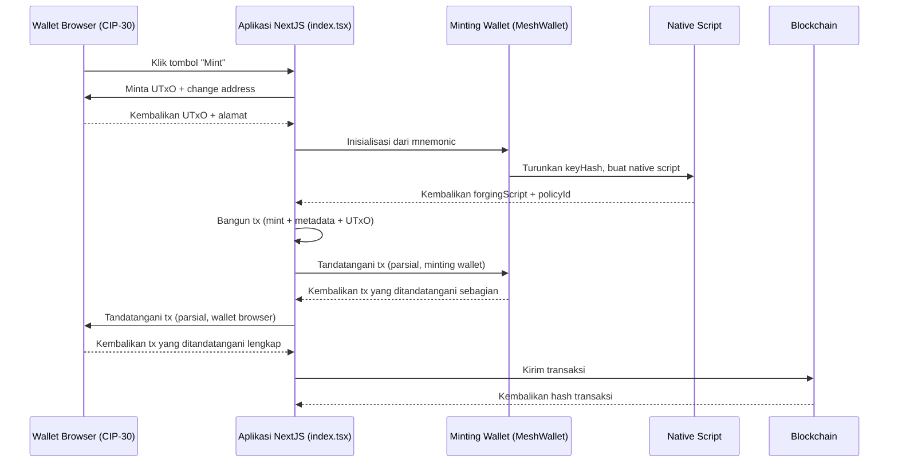

# Pelajaran #02: Transaksi Multi-signature

Transaksi multi-signature (multi-sig) memerlukan beberapa pihak untuk menandatangani sebelum dapat dikirim ke blockchain. Multi-sig bekerja seperti rekening bersama di mana semua pihak yang diperlukan harus menyetujui pengeluaran. Transaksi dapat memerlukan dua atau lebih penandatangan, yang bisa berupa wallet atau script.


Dalam pelajaran ini, Anda akan:
- Membangun transaksi multi-signature untuk mencetak token
- Menyiapkan aplikasi NextJS dengan antarmuka web untuk berinteraksi dengan blockchain Cardano

> Source code: [GitHub](https://github.com/cardanobuilders/cardanobuilders.github.io/tree/main/codes/course-cardano/02-multisig)

## Persiapan sistem

### Unduh Ekstensi Wallet CIP30

Anda memerlukan ekstensi wallet browser yang mendukung standar CIP30. Pilih dan instal salah satu dari [Cardano developer showcase](https://developers.cardano.org/showcase/?tags=wallet).

Setelah menginstal, pulihkan wallet menggunakan seed phrase yang Anda buat di pelajaran sebelumnya.

### Siapkan NextJS dan Mesh

Buat aplikasi NextJS baru:

```bash
npx create-next-app@latest --typescript mesh-multisig
```

Ikuti petunjuknya:

```bash
Need to install the following packages:
Ok to proceed? (y)

✔ Would you like to use ESLint? … Yes
✔ Would you like to use Tailwind CSS? … Yes
✔ Would you like your code inside a `src/` directory? … Yes
✔ Would you like to use App Router? … No
✔ Would you like to use Turbopack for next dev? … No
✔ Would you like to customize the import alias (@/* by default)? … No
```

Masuk ke folder yang baru dibuat:

```bash
cd mesh-multisig
```

Instal versi terbaru Mesh:

```bash
npm install @meshsdk/core @meshsdk/react
```

### Tambahkan MeshProvider

Bungkus aplikasi Anda dengan `MeshProvider` untuk mengaktifkan komponen React Mesh. Buka `src/app/layout.tsx` dan tambahkan:

```ts
import "@/styles/globals.css";
import type { AppProps } from "next/app";
import "@meshsdk/react/styles.css";
import { MeshProvider } from "@meshsdk/react";

export default function App({ Component, pageProps }: AppProps) {
  return (
    <MeshProvider>
      <Component {...pageProps} />
    </MeshProvider>
  );
}
```

### Tambahkan Komponen CardanoWallet

Tambahkan komponen wallet untuk interaksi blockchain. Ganti konten `src/pages/index.tsx` dengan:

```ts
import { CardanoWallet, useWallet } from "@meshsdk/react";

export default function Home() {
  const { wallet, connected } = useWallet();
  return (
    <div>
      <CardanoWallet isDark={true} />
    </div>
  );
}
```

Jalankan server pengembangan:

```bash
npm run dev
```

Kunjungi [http://localhost:3000](http://localhost:3000/) untuk melihat aplikasi Anda. Tekan **CTRL+C** untuk menghentikan server.

Anda akan melihat komponen "Connect Wallet". Coba hubungkan ke wallet Anda.

## Minting Script

Bagian ini membahas pembuatan minting script untuk pencetakan token multi-signature.

### Definisikan Minting Script

Siapkan konstanta untuk minting script:

```ts
const provider = new BlockfrostProvider("YOUR_KEY_HERE");

const demoAssetMetadata = {
  name: "Mesh Token",
  image: "ipfs://QmRzicpReutwCkM6aotuKjErFCUD213DpwPq6ByuzMJaua",
  mediaType: "image/jpg",
  description: "This NFT was minted by Mesh (https://meshjs.dev/).",
};

const mintingWallet = ["your", "mnemonic", "...", "here"];
```

- Ganti `YOUR_KEY_HERE` dengan API key Blockfrost Anda.
- Definisikan metadata aset di `demoAssetMetadata`.
- Gunakan mnemonic untuk minting wallet.

### Buat Wallet Aplikasi Minting

Buat fungsi untuk membangun transaksi minting:

```ts
async function buildMintTx(inputs: UTxO[], changeAddress: string) {
  const wallet = new MeshWallet({
    networkId: 0,
    key: {
      type: "mnemonic",
      words: mintingWallet,
    },
  });

  const { pubKeyHash: keyHash } = deserializeAddress(
    await wallet.getChangeAddress()
  );
}
```

- `inputs`: UTxOs dari wallet Anda untuk membayar biaya minting.
- Inisialisasi wallet dengan mnemonic.
- Dapatkan `pubKeyHash` untuk minting script.

### Buat Native Script


Definisikan native script:

```ts
const nativeScript: NativeScript = {
  type: "all",
  scripts: [
    {
      type: "before",
      slot: "99999999",
    },
    {
      type: "sig",
      keyHash: keyHash,
    },
  ],
};
const forgingScript = ForgeScript.fromNativeScript(nativeScript);
```

- `nativeScript`: Parameter untuk script.
- `ForgeScript.fromNativeScript`: Buat forging script.

### Definisikan Metadata Aset

Siapkan metadata aset:

```ts
const policyId = resolveScriptHash(forgingScript);
const tokenName = "MeshToken";
const tokenNameHex = stringToHex(tokenName);
const metadata = { [policyId]: { [tokenName]: { ...demoAssetMetadata } } };
```

- `policyId`: Diturunkan dari forging script.
- `tokenName`: Nama token.
- `metadata`: Metadata aset.

### Buat Transaksi

Bangun transaksi minting:

```ts
const txBuilder = new MeshTxBuilder({
  fetcher: provider,
  verbose: true,
});

const unsignedTx = await txBuilder
  .mint("1", policyId, tokenNameHex)
  .mintingScript(forgingScript)
  .metadataValue(721, metadata)
  .changeAddress(changeAddress)
  .invalidHereafter(99999999)
  .requiredSignerHash(keyHash)
  .selectUtxosFrom(inputs)
  .complete();
```

- `mint`: Tambahkan detail token.
- `mintingScript`: Lampirkan minting script.
- `metadataValue`: Tambahkan metadata aset.
- `changeAddress`: Tentukan change address.
- `invalidHereafter`: Atur batas waktu transaksi.
- `selectUtxosFrom`: Gunakan UTxOs untuk biaya.
- `requiredSignerHash` untuk mendeklarasikan bahwa pub key hash wallet minter diperlukan.
- `complete`: Finalisasi transaksi.

### Tanda Tangani Transaksi

Tanda tangani transaksi dengan minting wallet:

```ts
const signedTx = await wallet.signTx(unsignedTx, true);
```

### Source code

Berikut kode lengkap untuk membangun transaksi minting:

```ts
async function buildMintTx(inputs: UTxO[], changeAddress: string) {
  // minting wallet
  const wallet = new MeshWallet({
    networkId: 0,
    key: {
      type: "mnemonic",
      words: mintingWallet,
    },
  });

  const { pubKeyHash: keyHash } = deserializeAddress(
    await wallet.getChangeAddress()
  );

  // create minting script
  const nativeScript: NativeScript = {
    type: "all",
    scripts: [
      {
        type: "before",
        slot: "99999999",
      },
      {
        type: "sig",
        keyHash: keyHash,
      },
    ],
  };
  const forgingScript = ForgeScript.fromNativeScript(nativeScript);

  // create metadata
  const policyId = resolveScriptHash(forgingScript);
  const tokenName = "MeshToken";
  const tokenNameHex = stringToHex(tokenName);
  const metadata = { [policyId]: { [tokenName]: { ...demoAssetMetadata } } };

  // create transaction
  const txBuilder = new MeshTxBuilder({
    fetcher: provider,
    verbose: true,
  });

  const unsignedTx = await txBuilder
    .mint("1", policyId, tokenNameHex)
    .mintingScript(forgingScript)
    .metadataValue(721, metadata)
    .changeAddress(changeAddress)
    .invalidHereafter(99999999)
    .requiredSignerHash(keyHash)
    .selectUtxosFrom(inputs)
    .complete();

  const signedTx = await wallet.signTx(unsignedTx, true);
  return signedTx;
}
```

## Eksekusi transaksi

Setelah transaksi minting dibangun, eksekusi dari frontend:

```ts
async function mint() {
  if (connected) {
    const inputs = await wallet.getUtxos();
    const changeAddress = await wallet.getChangeAddress();

    const tx = await buildMintTx(inputs, changeAddress);
    const signedTx = await wallet.signTx(tx, true);

    const txHash = await wallet.submitTx(signedTx);
    console.log("Transaction hash:", txHash);
  }
}
```

- Periksa koneksi wallet.
- Dapatkan UTxOs dan change address.
- Bangun, tanda tangani, dan kirim transaksi.

## Panduan Kode Sumber

Bagian ini menjelaskan arsitektur keseluruhan aplikasi minting multi-sig, bagaimana file-file saling terhubung, dan bagaimana konsep blockchain ini dipetakan ke pola pengembangan web yang sudah Anda kenal.

### Struktur Proyek

```
02-multisig/
├── package.json              # Aplikasi NextJS dengan @meshsdk/core dan @meshsdk/react
├── src/
│   └── pages/
│       ├── _app.tsx          # Wrapper MeshProvider (mengaktifkan konteks wallet)
│       └── index.tsx         # Halaman utama: UI wallet, buildMintTx, dan logika mint
└── ...                       # File NextJS standar (konfigurasi, style, dll.)
```

Ini adalah aplikasi NextJS Pages Router dengan dua file kunci yang Anda tulis:

- **_app.tsx** membungkus seluruh aplikasi dalam `MeshProvider`, yang merupakan context provider React. Ini adalah pola yang sama seperti membungkus aplikasi Anda dalam auth provider atau theme provider -- membuat state wallet (status koneksi, method wallet) tersedia untuk setiap komponen melalui hook `useWallet`.
- **index.tsx** berisi semua logika bisnis dalam satu halaman. File ini merender tombol koneksi `CardanoWallet`, mendefinisikan `buildMintTx` (yang membangun dan menandatangani sebagian transaksi minting di sisi server), dan mendefinisikan `mint` (yang mengorkestrasikan alur lengkap dari browser).

Pemisahan ini penting: `_app.tsx` adalah infrastruktur murni (Anda mengaturnya sekali dan melupakannya), sementara `index.tsx` adalah tempat logika domain berada.

### Alur Minting Multi-Sig



Wawasan kunci di sini adalah **penandatanganan dua langkah**. Berbeda dengan Pelajaran 1 di mana satu wallet menandatangani semuanya, multi-sig memerlukan kedua wallet untuk menandatangani transaksi yang sama sebelum valid:

1. **Bangun** -- Aplikasi membangun transaksi menggunakan UTxO dari wallet browser (yang membayar biaya) dan native script yang diturunkan dari key hash minting wallet.
2. **Tanda tangan pertama** -- Minting wallet (sisi server, dari mnemonic) menandatangani transaksi secara parsial. Parameter `true` pada `wallet.signTx(unsignedTx, true)` berarti "tanda tangan parsial" -- transaksi belum selesai.
3. **Tanda tangan kedua** -- Wallet browser (CIP-30, sisi pengguna) juga menandatangani secara parsial. Sekarang kedua tanda tangan yang diperlukan sudah ada.
4. **Kirim** -- Transaksi yang telah ditandatangani sepenuhnya dikirim ke blockchain.

Native script memaksa bahwa **kedua** tanda tangan harus ada. Jika salah satu hilang, blockchain menolak transaksi tersebut.

### Padanan Web2

| Konsep Cardano | Padanan Web2 | Penjelasan |
|---|---|---|
| Transaksi multi-sig | Persetujuan multi-faktor (misalnya, transfer bank dua orang) | Memerlukan beberapa pihak independen untuk mengotorisasi tindakan sebelum dieksekusi. Seperti memerlukan manajer dan keuangan untuk menyetujui pesanan pembelian besar. |
| Native script | Aturan bisnis / mesin kebijakan | Aturan deklaratif yang mendefinisikan kondisi apa yang harus dipenuhi. Tipe `"all"` berarti setiap kondisi harus lolos -- seperti klausa AND dalam mesin kebijakan. |
| Kondisi `type: "sig"` | Penyetuju yang diperlukan | Menentukan key tertentu yang harus menandatangani. Seperti menambahkan reviewer wajib pada pull request. |
| Kondisi `type: "before"` | Kedaluwarsa / TTL | Transaksi hanya valid sebelum slot (waktu) tertentu. Seperti mengatur kedaluwarsa pada tautan undangan atau token JWT. |
| Wallet browser CIP-30 | OAuth / SSO login | Antarmuka terstandarisasi untuk aplikasi web berinteraksi dengan wallet pengguna, mirip dengan bagaimana OAuth menstandardisasi alur login di seluruh identity provider. |
| MeshProvider | Context provider autentikasi (React) | Context React yang membuat state wallet tersedia di seluruh component tree. Identik polanya dengan `<AuthProvider>` atau `<SessionProvider>`. |
| Metadata NFT (CIP-25) | Record database / resource API | Data terstruktur yang dilampirkan ke token secara on-chain. Skema metadata (label 721) adalah standar Cardano, mirip dengan bagaimana REST API mendefinisikan skema response-nya. |
| Policy ID | Namespace / tenant ID | Pengidentifikasi unik yang diturunkan dari minting script. Semua token yang dicetak di bawah script yang sama berbagi policy ID, seperti bagaimana resource dalam aplikasi multi-tenant berbagi tenant ID. |
| Penandatanganan parsial (`signTx(tx, true)`) | Alur kerja persetujuan bertahap | Setiap pihak menambahkan tanda tangannya tanpa memfinalisasi. Seperti dokumen yang mengumpulkan tanda tangan dari beberapa pemangku kepentingan sebelum diserahkan. |

## Source code

Source code untuk pelajaran ini tersedia di [GitHub](https://github.com/cardanobuilders/cardanobuilders.github.io/tree/main/codes/course-cardano/02-multisig).

## Tantangan

Buat wallet multi-signature yang memerlukan 2 dari 3 penandatangan untuk menyetujui transaksi. Bangun dan tanda tangani transaksi dengan dua penandatangan, kirim, dan verifikasi keberhasilannya.
