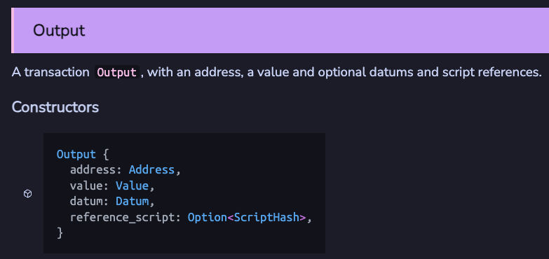

# Pelajaran #03: Aiken Contracts

Pelajaran 3 hingga 6 membahas konsep inti dalam membangun smart contract Aiken. Beberapa materi diadaptasi dari [AikenPBL Andamio](https://app.andamio.io/course/db22e013578fcead6c2fed5446d61891ad31f3cb4955e88d980107e7).

### Ringkasan

- **Kursus Hello Cardano**: Membahas konsep-konsep kunci terpilih dari pengembangan smart contract Aiken.
- **AikenPBL**: Kursus pembelajaran berbasis proyek yang lengkap dari awal hingga akhir, mencakup konsep esensial dan dasar.

Pengembangan smart contract Aiken adalah bidang yang terspesialisasi. Untuk memperdalam dan mengejar karier sebagai developer on-chain Cardano, kami merekomendasikan untuk menyelesaikan kedua kursus.

> Source code: [GitHub](https://github.com/cardanobuilders/cardanobuilders.github.io/tree/main/codes/course-cardano/03-aiken-contracts)

## Persiapan Sistem

Instal Aiken menggunakan salah satu panduan berikut:

1. [Panduan Instalasi Resmi Aiken](https://aiken-lang.org/installation-instructions)
2. [Panduan Persiapan AikenPBL Andamio](https://app.andamio.io/course/db22e013578fcead6c2fed5446d61891ad31f3cb4955e88d980107e7/101/lesson/1)

### Siapkan Proyek Aiken Kosong

Jalankan perintah berikut untuk membuat proyek Aiken baru menggunakan template Mesh:

```bash
npx meshjs 03-aiken-contracts
```

Pilih template `Aiken` saat diminta.


Setelah instalasi, folder baru `03-aiken-contracts` akan dibuat dengan struktur berikut:

```
03-aiken-contracts
├── aiken-workspace  // Main Aiken project folder used in lessons
└── mesh             // Folder for equivalent Mesh off-chain code (not used in lessons)
```

### Opsional: Instal Cardano-Bar

Jika Anda menggunakan VSCode sebagai IDE, instal ekstensi [Cardano-Bar](https://marketplace.visualstudio.com/items/?itemName=sidan-lab.cardano-bar-vscode) untuk snippet kode agar lebih mudah mengikuti kursus.


## Memahami Konteks Transaksi


Contract Cardano berfungsi berbeda dari smart contract di blockchain lain. Contract bertindak sebagai aturan validasi yang menentukan apakah suatu transaksi valid. **Validator** adalah istilah yang lebih tepat untuk contract Cardano.

Membangun validator memerlukan pemahaman tentang cara kerja transaksi. Lihat [dokumentasi Aiken](https://aiken-lang.github.io/stdlib/cardano/transaction.html#Transaction) untuk struktur `Transaction` lengkap.


### Input & Output

Semua transaksi Cardano harus memiliki input dan output:
- **Input**: UTXO yang dibelanjakan dalam transaksi.
- **Output**: UTXO yang dibuat dalam transaksi.

Lihat [dokumentasi Aiken](https://aiken-lang.github.io/stdlib/cardano/transaction.html#Input) untuk definisi tipe:




Konsep kunci:
- Sebuah input mereferensikan output dari transaksi sebelumnya, diidentifikasi dengan `output_reference`.
- Validator dapat memeriksa:
  - Apakah input membelanjakan dari alamat tertentu.
  - Apakah input membelanjakan aset tertentu.
  - Apakah output mengirim ke alamat tertentu.
  - Apakah output mengirim aset tertentu.
  - Apakah datum input/output berisi informasi tertentu.

### Reference Input

`reference_inputs` dalam `Transaction` adalah input yang tidak dibelanjakan tetapi direferensikan dalam validator. Berguna untuk membaca datum dari UTXO tanpa membelanjakannya.

### Mint

`mint` dalam `Transaction` mencantumkan aset yang sedang dicetak atau dibakar. Berguna untuk membuat atau membakar token.

### Signatures

`extra_signatories` dalam `Transaction` mencantumkan hash public key yang diperlukan untuk menandatangani transaksi. Berguna untuk mewajibkan pengguna tertentu menandatangani.

### Time

`validity_range` dalam `Transaction` menentukan rentang slot di mana transaksi berlaku. Berguna untuk menerapkan penguncian waktu.

## Jenis-jenis Script

Lihat [dokumentasi Aiken](https://aiken-lang.github.io/stdlib/cardano/script_context.html#ScriptContext) untuk jenis-jenis script. Yang paling umum:
- **Minting**
- **Spending**
- **Withdrawing**


### Minting Script

Validasi minting script terpicu ketika aset dicetak atau dibakar di bawah policy script tersebut.

Contoh: `/aiken-workspace/validators/mint.ak`:

```rs
use cardano/assets.{PolicyId}
use cardano/transaction.{Transaction, placeholder}

validator always_succeed {
  mint(_redeemer: Data, _policy_id: PolicyId, _tx: Transaction) {
    True
  }

  else(_) {
    fail @"unsupported purpose"
  }
}

test test_always_succeed_minting_policy() {
  let data = Void
  always_succeed.mint(data, #"", placeholder)
}
```

Script ini dikompilasi menjadi script dengan hash `def68337867cb4f1f95b6b811fedbfcdd7780d10a95cc072077088ea`, yang juga disebut `policy Id`. Script ini memvalidasi transaksi yang mencetak atau membakar aset di bawah policy ini.

#### Parameter

Tingkatkan script agar hanya mengizinkan minting/burning ketika ditandatangani oleh kunci tertentu:

```rs
validator minting_policy(owner_vkey: VerificationKeyHash) {
  mint(_redeemer: Data, _policy_id: PolicyId, tx: Transaction) {
    key_signed(tx.extra_signatories, owner_vkey)
  }

  else(_) {
    fail @"unsupported purpose"
  }
}
```

- `owner_vkey`: Hash public key pemilik yang diizinkan mencetak/membakar aset.
- Gunakan `key_signed` dari [vodka](https://github.com/sidan-lab/vodka) untuk validasi.

#### Redeemer

Perluas policy untuk menyertakan redeemer yang menentukan aksi transaksi (minting atau burning):

```rs
pub type MyRedeemer {
  MintToken
  BurnToken
}

validator minting_policy(
  owner_vkey: VerificationKeyHash,
  minting_deadline: Int,
) {
  mint(redeemer: MyRedeemer, policy_id: PolicyId, tx: Transaction) {
    when redeemer is {
      MintToken -> {
        let before_deadline = valid_before(tx.validity_range, minting_deadline)
        let is_owner_signed = key_signed(tx.extra_signatories, owner_vkey)
        before_deadline? && is_owner_signed?
      }
      BurnToken -> check_policy_only_burn(tx.mint, policy_id)
    }
  }

  else(_) {
    fail @"unsupported purpose"
  }
}
```

### Spending Script

Validasi spending script terpicu ketika UTXO di alamat script dibelanjakan dalam transaksi.

Contoh: `/aiken-workspace/validators/spend.ak`:

```rs
pub type Datum {
  oracle_nft: PolicyId,
}

validator hello_world {
  spend(
    datum_opt: Option<Datum>,
    _redeemer: Data,
    _input: OutputReference,
    tx: Transaction,
  ) {
    when datum_opt is {
      Some(datum) ->
        when inputs_with_policy(tx.reference_inputs, datum.oracle_nft) is {
          [_ref_input] -> True
          _ -> False
        }
      None -> False
    }
  }

  else(_) {
    fail @"unsupported purpose"
  }
}
```

#### Datum

- `Datum`: Data yang dilampirkan ke UTXO di alamat script.
- Pola desain umum: Gunakan oracle NFT (state thread token) untuk memastikan keunikan UTXO.

### Withdrawing Script

Validasi withdrawal script terpicu ketika melakukan penarikan dari akun reward.

Contoh: `/aiken-workspace/validators/withdraw.ak`:

```rs
use aiken/crypto.{VerificationKeyHash}
use cardano/address.{Credential, Script}
use cardano/certificate.{Certificate}
use cardano/transaction.{Transaction, placeholder}

validator always_succeed(_key_hash: VerificationKeyHash) {
  withdraw(_redeemer: Data, _credential: Credential, _tx: Transaction) {
    True
  }

  publish(_redeemer: Data, _certificate: Certificate, _tx: Transaction) {
    True
  }

  else(_) {
    fail @"unsupported purpose"
  }
}

test test_always_succeed_withdrawal_policy() {
  let data = Void
  always_succeed.withdraw("", data, Script(#""), placeholder)
}
```

#### Menangani Publishing

Semua withdrawal script harus didaftarkan on-chain sebelum dapat digunakan. Ini dilakukan dengan menerbitkan sertifikat registrasi dengan hash script sebagai stake credential. Penerbitan script juga divalidasi oleh fungsi `publish` dalam withdrawal script, yang terpicu setiap kali withdrawal script saat ini sedang didaftarkan atau dicabut pendaftarannya.

#### Kapan withdrawal script digunakan?

Sebagian besar pengguna Cardano melakukan staking dan menarik reward menggunakan payment key standar. Namun, DApps Cardano umumnya menggunakan withdrawal script untuk meningkatkan efisiensi validasi. Teknik ini dibahas di [Pelajaran 5](./05-avoid-redundant-validation.mdx).

## Panduan Kode Sumber

Bagian ini memberikan tur panduan dari repositori kode sumber pelajaran, menghubungkan konsep Aiken di atas ke struktur proyek yang dapat Anda clone dan bangun secara lokal.

### Struktur Proyek

```
03-aiken-contracts/
├── aiken-workspace/          # Folder proyek Aiken utama (digunakan dalam pelajaran ini)
│   └── validators/
│       ├── mint.ak           # Validator minting (selalu berhasil + berparameter)
│       ├── spend.ak          # Validator spending (pola oracle NFT)
│       └── withdraw.ak       # Validator withdrawal (selalu berhasil)
├── mesh/                     # Folder kode off-chain (tidak digunakan dalam pelajaran ini)
└── package.json
```

**`aiken-workspace/`** berisi validator on-chain -- kode yang berjalan di blockchain Cardano itu sendiri. Anggap ini sebagai folder "logika backend" Anda. Setiap file `.ak` dikompilasi menjadi script Plutus yang dieksekusi jaringan selama validasi transaksi.

**`mesh/`** menyimpan kode TypeScript off-chain yang membangun dan mengirim transaksi. Ini setara dengan frontend atau klien API yang berkomunikasi dengan validator. Folder ini tidak digunakan dalam pelajaran saat ini tetapi menjadi relevan di pelajaran selanjutnya ketika Anda menghubungkan aplikasi web ke kontrak Anda.

Jika Anda berasal dari latar belakang web2, pemisahan ini mirip dengan memiliki folder `contracts/` untuk constraint database Anda dan folder `client/` untuk server API Anda.

### Tipe Validator dan Pemicu Transaksi

Tiga file `.ak` tersebut sesuai dengan tiga tipe validator paling umum di Cardano. Setiap tipe dipicu pada kondisi transaksi yang berbeda:


- **`mint.ak`** berjalan ketika transaksi mencetak atau membakar token di bawah policy ID validator. Dimulai sebagai policy "selalu berhasil", kemudian berkembang untuk memerlukan tanda tangan pemilik dan tenggat waktu.
- **`spend.ak`** berjalan ketika transaksi mencoba membelanjakan UTXO yang berada di alamat script validator. Contoh ini menggunakan pola oracle NFT -- memeriksa bahwa reference input tertentu ada sebelum mengizinkan pembelanjaan.
- **`withdraw.ak`** berjalan ketika transaksi menarik reward staking dari akun reward validator. Versi "selalu berhasil" di sini adalah kerangka dasar; Pelajaran 5 menunjukkan bagaimana validator withdrawal digunakan untuk validasi multi-UTXO yang efisien.

### Padanan Web2

Jika Anda terbiasa membangun REST API atau aplikasi sisi server, pemetaan ini akan membantu menjembatani model mental:

| Konsep Cardano | Padanan Web2 | Penjelasan |
|---|---|---|
| **Validator** | Route middleware / auth guard | Fungsi murni yang mengembalikan izinkan atau tolak. Tidak memodifikasi state secara langsung -- hanya memutuskan apakah transaksi diizinkan. |
| **Datum** | Record database / baris | Data yang dilampirkan ke UTXO di alamat script. Ketika Anda "mengunci" dana, Anda melampirkan datum sama seperti menulis baris ke tabel. |
| **Redeemer** | Body request API | Data yang diberikan pengguna saat berinteraksi dengan validator. Validator membaca redeemer untuk memutuskan jalur kode mana yang dieksekusi (misalnya, `MintToken` vs `BurnToken`). |
| **Policy ID** | Cakupan API key / set izin | Hash unik yang mengidentifikasi minting policy. Token yang dicetak di bawah policy berbeda bersifat berbeda, mirip dengan bagaimana API key berbeda memberikan akses ke resource berbeda. |
| **Transaction** | HTTP request | Bundel lengkap input, output, tanda tangan, dan metadata yang diperiksa validator -- analog dengan objek request lengkap yang diterima middleware Anda. |

### Poin Penting

Setiap validator Aiken adalah fungsi murni: menerima konteks transaksi dan mengembalikan `True` atau `False`. Tidak ada efek samping, tidak ada penulisan database, tidak ada panggilan jaringan di dalam validator. Runtime blockchain menangani perubahan state hanya jika validator menyetujui. Ini secara fundamental berbeda dari backend web2 di mana route handler Anda melakukan validasi sekaligus mengubah state.

## Source code

Source code untuk pelajaran ini tersedia di [GitHub](https://github.com/cardanobuilders/cardanobuilders.github.io/tree/main/codes/course-cardano/03-aiken-contracts).
