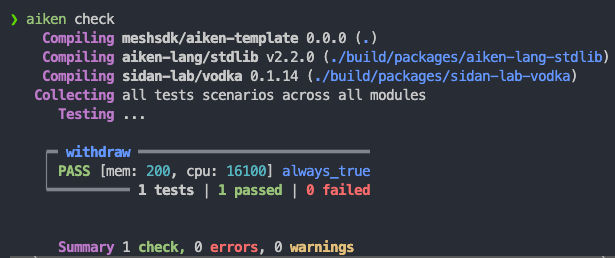
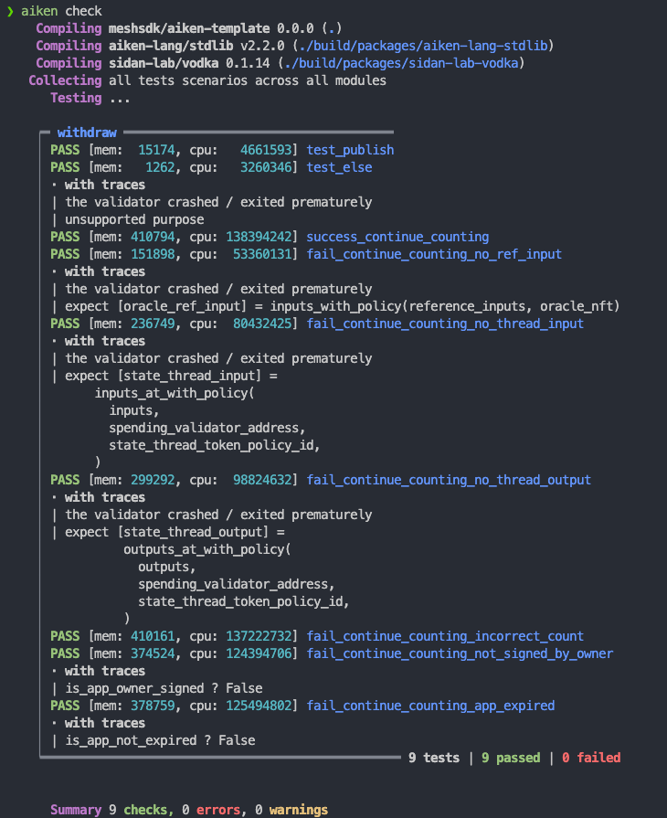

# Pelajaran #04: Contract Testing

Menguji contract Aiken memastikan bahwa contract berperilaku sesuai harapan sebelum di-deploy. Pelajaran ini membahas:

- Menyiapkan contract yang kompleks untuk pengujian
- Membangun transaksi mock di Aiken dan menjalankan tes dengan `aiken check`

> Source code: [GitHub](https://github.com/cardanobuilders/cardanobuilders.github.io/tree/main/codes/course-cardano/04-contract-testing)

## Menyiapkan Contract yang Kompleks

Mulai dengan meningkatkan withdrawal contract dari pelajaran sebelumnya dengan dua aksi pengguna: `ContinueCounting` dan `StopCounting`.

1. **ContinueCounting**:
   - Verifikasi bahwa transaksi ditandatangani oleh pemilik aplikasi.
   - Pastikan aplikasi belum kedaluwarsa (menggunakan timestamp POSIX).
   - Teruskan state thread token ke output.
   - Tambahkan jumlah hitungan di datum state thread token sebesar 1.

2. **StopCounting**:
   - Verifikasi bahwa transaksi ditandatangani oleh pemilik aplikasi.
   - Pastikan state thread token dibakar (tidak diteruskan ke output mana pun).

### Kode Contract

```rs
use aiken/crypto.{VerificationKeyHash}
use cardano/address.{Address, Credential}
use cardano/assets.{PolicyId}
use cardano/certificate.{Certificate}
use cardano/transaction.{Transaction}
use cocktail.{input_inline_datum, inputs_with_policy, key_signed, valid_before}

pub type OracleDatum {
  app_owner: VerificationKeyHash,
  app_expiry: Int,
  spending_validator_address: Address,
  state_thread_token_policy_id: PolicyId,
}

pub type MyRedeemer {
  ContinueCounting
  StopCounting
}

validator complex_withdrawal_contract(oracle_nft: PolicyId) {
  withdraw(redeemer: MyRedeemer, _credential: Credential, tx: Transaction) {
    let Transaction {
      reference_inputs,
      mint,
      extra_signatories,
      validity_range,
      ..
    } = tx

    expect [oracle_ref_input] = inputs_with_policy(reference_inputs, oracle_nft)
    expect OracleDatum {
      app_owner,
      app_expiry,
      ..
    } = input_inline_datum(oracle_ref_input)

    let is_app_owner_signed = key_signed(extra_signatories, app_owner)

    when redeemer is {
      ContinueCounting -> {
        let is_app_not_expired = valid_before(validity_range, app_expiry)
        let is_nothing_minted = mint == assets.zero

        is_app_owner_signed? && is_app_not_expired? && is_nothing_minted?
      }
      StopCounting -> todo
    }
  }

  publish(_redeemer: Data, _credential: Certificate, _tx: Transaction) {
    True
  }

  else(_) {
    fail @"unsupported purpose"
  }
}
```

Pengaturan ini mendefinisikan dua aksi pengguna dengan `MyRedeemer`: `ContinueCounting` dan `StopCounting`. Logika parsial untuk `ContinueCounting` menerapkan pola validasi yang dibahas di Pelajaran 3.

### `expect`

Kata kunci `expect` memaksakan pencocokan pola yang tepat pada suatu variabel. Dalam contoh ini, `inputs_with_policy(reference_inputs, oracle_nft)` mengembalikan `List<Input>`. Karena `oracle_nft` bersifat unik, list selalu berisi tepat satu item, menjadikan `expect [oracle_ref_input]` sebagai destrukturisasi yang aman.

### Operator `?`

Operator `?` di cabang `ContinueCounting` adalah operator tracing. Ketika validator gagal, operator ini melaporkan kondisi mana yang bernilai false. Misalnya, jika `is_app_owner_signed` bernilai false, validator gagal dengan pesan `is_app_owner_signed?`, sehingga mudah untuk mengidentifikasi penyebab utamanya.

## Memvalidasi Input & Output

Kita melengkapi contract dengan memvalidasi input dan output:

```rs
use aiken/crypto.{VerificationKeyHash}
use cardano/address.{Address, Credential}
use cardano/assets.{PolicyId, without_lovelace}
use cardano/certificate.{Certificate}
use cardano/transaction.{Transaction}
use cocktail.{
  input_inline_datum, inputs_at_with_policy, inputs_with_policy, key_signed,
  output_inline_datum, outputs_at_with_policy, valid_before,
}

pub type OracleDatum {
  app_owner: VerificationKeyHash,
  app_expiry: Int,
  spending_validator_address: Address,
  state_thread_token_policy_id: PolicyId,
}

pub type SpendingValidatorDatum {
  count: Int,
}

pub type MyRedeemer {
  ContinueCounting
  StopCounting
}

validator complex_withdrawal_contract(oracle_nft: PolicyId) {
  withdraw(redeemer: MyRedeemer, _credential: Credential, tx: Transaction) {
    let Transaction {
      reference_inputs,
      inputs,
      outputs,
      mint,
      extra_signatories,
      validity_range,
      ..
    } = tx

    expect [oracle_ref_input] = inputs_with_policy(reference_inputs, oracle_nft)
    expect OracleDatum {
      app_owner,
      app_expiry,
      spending_validator_address,
      state_thread_token_policy_id,
    } = input_inline_datum(oracle_ref_input)

    expect [state_thread_input] =
      inputs_at_with_policy(
        inputs,
        spending_validator_address,
        state_thread_token_policy_id,
      )

    let is_app_owner_signed = key_signed(extra_signatories, app_owner)

    when redeemer is {
      ContinueCounting -> {
        expect [state_thread_output] =
          outputs_at_with_policy(
            outputs,
            spending_validator_address,
            state_thread_token_policy_id,
          )
        expect input_datum: SpendingValidatorDatum =
          input_inline_datum(state_thread_input)
        expect output_datum: SpendingValidatorDatum =
          output_inline_datum(state_thread_output)

        let is_app_not_expired = valid_before(validity_range, app_expiry)
        let is_count_added = input_datum.count + 1 == output_datum.count
        let is_nothing_minted = mint == assets.zero

        is_app_owner_signed? && is_app_not_expired? && is_count_added && is_nothing_minted?
      }
      StopCounting -> {
        let state_thread_value =
          state_thread_input.output.value |> without_lovelace()
        let is_thread_token_burned = mint == assets.negate(state_thread_value)
        is_app_owner_signed? && is_thread_token_burned?
      }
    }
  }

  publish(_redeemer: Data, _credential: Certificate, _tx: Transaction) {
    True
  }

  else(_) {
    fail @"unsupported purpose"
  }
}
```

Versi ini memperkenalkan beberapa teknik baru:

- `input_inline_datum` dan `output_inline_datum` mengekstrak inline datum dari input dan output state thread token
- `inputs_at_with_policy` dan `outputs_at_with_policy` memfilter input dan output berdasarkan alamat dan policy ID
- Perbandingan datum memastikan hitungan bertambah tepat 1

Untuk `StopCounting`, validator memastikan state thread token dibakar dengan memeriksa field `mint`. Fungsi `without_lovelace` menghapus bagian lovelace dari value untuk perbandingan yang bersih.

## Membangun transaksi mock di Aiken

Semua contract Aiken adalah fungsi yang menerima parameter dan mengembalikan boolean. Ini membuat pengujian menjadi mudah: berikan data mock dan periksa hasilnya.

Definisikan fungsi tes dengan kata kunci `test`, lalu jalankan `aiken check` dari root proyek untuk mengeksekusinya.

Contoh minimal:

```rs
test always_true() {
  True
}
```

Dengan `aiken check`, kita akan melihat:



### Menguji kasus selalu berhasil dan selalu gagal

Contract withdrawal yang kompleks memiliki fungsi `publish` yang selalu mengembalikan `True`. Uji seperti ini:

```rs
use mocktail.{complete, mock_utxo_ref, mocktail_tx}

test test_publish() {
  let data = Void
  complex_withdrawal_contract.publish(
    "",
    data,
    RegisterCredential(Script(#""), Never),
    mocktail_tx() |> complete(),
  )
}
```

Tes ini memanggil `publish` dengan parameter mock. `mocktail_tx()` membuat transaksi mock dan `complete()` menyelesaikannya sebagai `Transaction` kosong.

Semua tujuan script lainnya masuk ke cabang `else`, yang selalu gagal. Uji kegagalan yang diharapkan ini:

```rs
test test_else() fail {
  complex_withdrawal_contract.else(
    "",
    ScriptContext(
      mocktail_tx() |> complete(),
      Void,
      Spending(mock_utxo_ref(0, 0), None),
    ),
  )
}
```

Tes ini tidak mengembalikan `False`; program berhenti dengan `fail`. Menambahkan `fail` setelah nama tes menandai tes tersebut sebagai yang diharapkan gagal.

Menjalankan `aiken check` akan menampilkan:


### Menguji fungsi `withdraw`

Fungsi `withdraw` memvalidasi struktur `Transaction`, sehingga menyusun data mock yang akurat sangat penting. Membangun semua tipe Aiken yang diperlukan secara manual cukup melelahkan, di sinilah library `vodka` membantu.

Modul `mocktail` di `vodka` menyediakan fungsi untuk membuat data mock. Mulai dengan `mocktail_tx()` untuk membuat `Transaction` dasar, lalu rangkai fungsi modifier agar sesuai dengan kasus uji Anda:

```rs
const mock_oracle_nft = mock_policy_id(0)

const mock_oracle_address = mock_script_address(0, None)

const mock_oracle_value =
  assets.from_asset(mock_oracle_nft, "", 1) |> assets.add("", "", 2_000_000)

const mock_app_owner = mock_pub_key_hash(0)

const mock_spending_validator_address = mock_script_address(1, None)

const mock_state_thread_token_policy_id = mock_policy_id(1)

const mock_state_thread_value =
  assets.from_asset(mock_state_thread_token_policy_id, "", 1)
    |> assets.add("", "", 2_000_000)

const mock_oracle_datum =
  OracleDatum {
    app_owner: mock_app_owner,
    app_expiry: 1000,
    spending_validator_address: mock_spending_validator_address,
    state_thread_token_policy_id: mock_state_thread_token_policy_id,
  }

fn mock_datum(count: Int) -> SpendingValidatorDatum {
  SpendingValidatorDatum { count }
}

fn mock_continue_counting_tx() -> Transaction {
  mocktail_tx()
    |> ref_tx_in(
        True,
        mock_tx_hash(0),
        0,
        mock_oracle_value,
        mock_oracle_address,
      )
    |> ref_tx_in_inline_datum(True, mock_oracle_datum)
    |> tx_in(
        True,
        mock_tx_hash(1),
        0,
        mock_state_thread_value,
        mock_spending_validator_address,
      )
    |> tx_in_inline_datum(True, mock_datum(0))
    |> tx_out(True, mock_spending_validator_address, mock_state_thread_value)
    |> tx_out_inline_datum(True, mock_datum(1))
    |> required_signer_hash(True, mock_app_owner)
    |> invalid_hereafter(True, 999)
    |> complete()
}
```

Fungsi-fungsi `mock_...` dari modul `mocktail` membangun tipe-tipe yang diperlukan. Transaksi mock untuk `ContinueCounting` ini menyertakan reference input oracle NFT dengan inline datum, input dan output state thread token dengan inline datum, required signer, dan validity range.

Uji aksi `ContinueCounting`:

```rs
test success_continue_counting() {
  complex_withdrawal_contract.withdraw(
    mock_oracle_nft,
    ContinueCounting,
    Credential.Script(#""),
    mock_continue_counting_tx(),
  )
}
```

### Menguji Kasus Kegagalan Secara Dinamis


Metode builder mocktail menerima parameter boolean untuk menyertakan atau mengecualikan field. Ini memungkinkan pembuatan kasus kegagalan secara dinamis dengan mengubah kondisi individual:

```rs
type ContinueCountingTest {
  is_ref_input_presented: Bool,
  is_thread_input_presented: Bool,
  is_thread_output_presented: Bool,
  is_count_added: Bool,
  is_app_owner_signed: Bool,
  is_tx_not_expired: Bool,
}

fn mock_continue_counting_tx(test_case: ContinueCountingTest) -> Transaction {
  let ContinueCountingTest {
    is_ref_input_presented,
    is_thread_input_presented,
    is_thread_output_presented,
    is_count_added,
    is_app_owner_signed,
    is_tx_not_expired,
  } = test_case

  let output_datum =
    if is_count_added {
      mock_datum(1)
    } else {
      mock_datum(0)
    }
  mocktail_tx()
    |> ref_tx_in(
        is_ref_input_presented,
        mock_tx_hash(0),
        0,
        mock_oracle_value,
        mock_oracle_address,
      )
    |> ref_tx_in_inline_datum(is_ref_input_presented, mock_oracle_datum)
    |> tx_in(
        is_thread_input_presented,
        mock_tx_hash(1),
        0,
        mock_state_thread_value,
        mock_spending_validator_address,
      )
    |> tx_in_inline_datum(is_thread_input_presented, mock_datum(0))
    |> tx_out(
        is_thread_output_presented,
        mock_spending_validator_address,
        mock_state_thread_value,
      )
    |> tx_out_inline_datum(is_thread_output_presented, output_datum)
    |> required_signer_hash(is_app_owner_signed, mock_app_owner)
    |> invalid_hereafter(is_tx_not_expired, 999)
    |> complete()
}
```

Perbarui tes sukses untuk menggunakan struktur berparameter:

```rs
test success_continue_counting() {
  let test_case =
    ContinueCountingTest {
      is_ref_input_presented: True,
      is_thread_input_presented: True,
      is_thread_output_presented: True,
      is_count_added: True,
      is_app_owner_signed: True,
      is_tx_not_expired: True,
    }

  complex_withdrawal_contract.withdraw(
    mock_oracle_nft,
    ContinueCounting,
    Credential.Script(#""),
    mock_continue_counting_tx(test_case),
  )
}
```

Kasus kegagalan sekarang mudah dibuat dengan mengubah satu boolean saja:

```rs
test fail_continue_counting_no_ref_input() fail {
  let test_case =
    ContinueCountingTest {
      is_ref_input_presented: False,
      is_thread_input_presented: True,
      is_thread_output_presented: True,
      is_count_added: True,
      is_app_owner_signed: True,
      is_tx_not_expired: True,
    }

  complex_withdrawal_contract.withdraw(
    mock_oracle_nft,
    ContinueCounting,
    Credential.Script(#""),
    mock_continue_counting_tx(test_case),
  )
}

test fail_continue_counting_no_thread_input() fail {
  let test_case =
    ContinueCountingTest {
      is_ref_input_presented: True,
      is_thread_input_presented: False,
      is_thread_output_presented: True,
      is_count_added: True,
      is_app_owner_signed: True,
      is_tx_not_expired: True,
    }

  complex_withdrawal_contract.withdraw(
    mock_oracle_nft,
    ContinueCounting,
    Credential.Script(#""),
    mock_continue_counting_tx(test_case),
  )
}

test fail_continue_counting_no_thread_output() fail {
  let test_case =
    ContinueCountingTest {
      is_ref_input_presented: True,
      is_thread_input_presented: True,
      is_thread_output_presented: False,
      is_count_added: True,
      is_app_owner_signed: True,
      is_tx_not_expired: True,
    }

  complex_withdrawal_contract.withdraw(
    mock_oracle_nft,
    ContinueCounting,
    Credential.Script(#""),
    mock_continue_counting_tx(test_case),
  )
}

test fail_continue_counting_incorrect_count() {
  let test_case =
    ContinueCountingTest {
      is_ref_input_presented: True,
      is_thread_input_presented: True,
      is_thread_output_presented: True,
      is_count_added: False,
      is_app_owner_signed: True,
      is_tx_not_expired: True,
    }

  !complex_withdrawal_contract.withdraw(
    mock_oracle_nft,
    ContinueCounting,
    Credential.Script(#""),
    mock_continue_counting_tx(test_case),
  )
}

test fail_continue_counting_not_signed_by_owner() {
  let test_case =
    ContinueCountingTest {
      is_ref_input_presented: True,
      is_thread_input_presented: True,
      is_thread_output_presented: True,
      is_count_added: True,
      is_app_owner_signed: False,
      is_tx_not_expired: True,
    }

  !complex_withdrawal_contract.withdraw(
    mock_oracle_nft,
    ContinueCounting,
    Credential.Script(#""),
    mock_continue_counting_tx(test_case),
  )
}

test fail_continue_counting_app_expired() {
  let test_case =
    ContinueCountingTest {
      is_ref_input_presented: True,
      is_thread_input_presented: True,
      is_thread_output_presented: True,
      is_count_added: True,
      is_app_owner_signed: True,
      is_tx_not_expired: False,
    }

  !complex_withdrawal_contract.withdraw(
    mock_oracle_nft,
    ContinueCounting,
    Credential.Script(#""),
    mock_continue_counting_tx(test_case),
  )
}
```

Menjalankan `aiken check` akan menampilkan:


### Latihan

Tulis tes untuk aksi `StopCounting` menggunakan pola yang sama. Ikuti tes `ContinueCounting` sebagai referensi. Jawaban yang disarankan tersedia di contoh kode.

## Panduan Kode Sumber

Bagian ini membahas struktur proyek dan pola pengujian yang digunakan dalam kode sumber, menghubungkannya dengan praktik pengujian yang sudah Anda kenal dari pengembangan web2.

### Struktur Proyek

```
04-contract-testing/
├── validators/
│   └── withdraw.ak       # Contract withdrawal kompleks dengan semua tes
├── aiken.toml             # Konfigurasi proyek (seperti package.json untuk Aiken)
├── aiken.lock             # File lock dependensi (seperti package-lock.json)
└── plutus.json            # Output blueprint terkompilasi (artefak build)
```

Dibandingkan dengan proyek scaffolded Pelajaran 3, ini adalah proyek Aiken mandiri tanpa folder `mesh/` atau wrapper `aiken-workspace/`. Semuanya berada di root.

| File Aiken | Padanan Web2 | Tujuan |
|---|---|---|
| `aiken.toml` | `package.json` | Mendeklarasikan nama proyek, versi, dan dependensi (misalnya, `vodka` untuk utilitas tes). |
| `aiken.lock` | `package-lock.json` / `bun.lockb` | Mengunci versi dependensi yang tepat untuk build yang dapat direproduksi. |
| `plutus.json` | Output build terkompilasi (misalnya, `dist/`) | Blueprint Plutus yang telah dikompilasi. Dihasilkan oleh `aiken build` dan digunakan oleh kode off-chain untuk berinteraksi dengan contract. |
| `validators/withdraw.ak` | `src/` + `__tests__/` digabungkan | Berisi logika contract dan fungsi tesnya dalam satu file. Aiken tidak memisahkan direktori source dan test. |

### Arsitektur Tes: Pola Mock Transaction Builder

Pola pengujian inti dalam pelajaran ini adalah membangun transaksi mock dengan toggle boolean yang dapat dikonfigurasi. Ini adalah padanan Aiken dari tes berparameter dengan factory fixture.


Alurnya bekerja seperti ini:

1. **Definisikan struct kasus tes** dengan field boolean -- satu per kondisi validasi dalam contract.
2. **Teruskan struct ke fungsi builder** yang merangkai helper `mocktail`. Setiap boolean mengontrol apakah bagian tertentu dari data transaksi disertakan atau dikecualikan.
3. **Panggil validator** dengan transaksi mock yang telah dirakit dan periksa hasilnya.

Pola ini dipetakan langsung ke konsep pengujian web2:

| Konsep Pengujian Aiken | Padanan Web2 | Penjelasan |
|---|---|---|
| `aiken check` | `npm test` / `bun test` | Perintah CLI yang menemukan dan menjalankan semua fungsi `test` dalam proyek. |
| `mocktail_tx()` + rangkaian builder | Factory fixture tes / request builder | Membangun transaksi palsu sama seperti Anda membangun mock HTTP request dengan header, body, dan token auth. |
| Struct `ContinueCountingTest` | Konfigurasi tes berparameter | Struct boolean yang mengubah kondisi individual, mirip dengan `test.each()` di Jest atau tes table-driven di Go. |
| Toggle boolean (`True`/`False`) | Feature flag di fixture tes | Setiap boolean menyertakan atau mengecualikan satu bagian dari transaksi mock, mengisolasi satu kondisi kegagalan per tes. |
| Kata kunci `test ... fail` | `expect(...).toThrow()` | Menandai tes sebagai yang diharapkan gagal. Tes hanya lolos jika validator crash atau mengembalikan `False`. |
| Kata kunci `expect` | `assert` / pengecekan tipe runtime | Mencocokkan pola nilai dan crash jika bentuknya tidak sesuai -- seperti validasi skema runtime. |
| Operator trace `?` | Debug logging pada kegagalan assertion | Menambahkan nama variabel ke trace error ketika kondisi bernilai `False`, sehingga Anda langsung melihat pemeriksaan mana yang gagal. |

### Mengapa Pola Ini Bekerja Dengan Baik

Dalam pengujian web2, Anda biasanya menulis satu tes per mode kegagalan: header auth hilang, token kedaluwarsa, body tidak valid, dan seterusnya. Pola toggle boolean mencapai hal yang sama untuk validator Cardano. Tes sukses memiliki semua boolean diatur ke `True`. Setiap tes kegagalan membalik tepat satu boolean ke `False`, mengisolasi aturan validasi spesifik yang sedang diuji.

Pendekatan ini dapat diskalakan dengan bersih: ketika Anda menambahkan kondisi validasi baru ke contract, Anda menambahkan satu boolean ke struct, mengaturnya ke `True` dalam tes sukses, dan menulis satu tes kegagalan baru dengan boolean tersebut diatur ke `False`.

## Source code

Source code untuk pelajaran ini tersedia di [GitHub](https://github.com/cardanobuilders/cardanobuilders.github.io/tree/main/codes/course-cardano/04-contract-testing).
