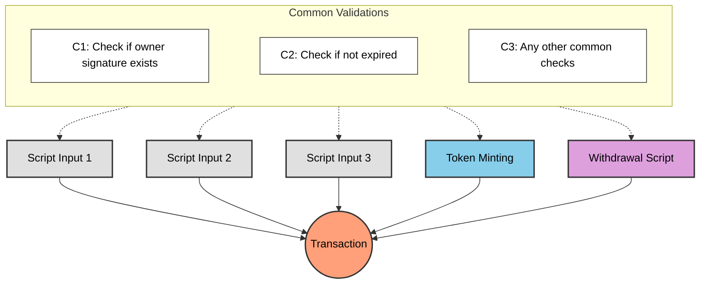
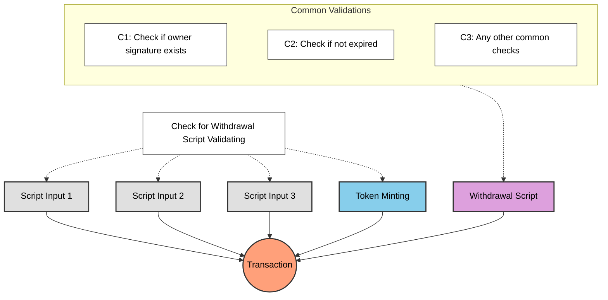
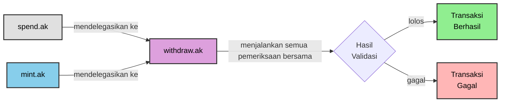

# Pelajaran #05: Menghindari Validasi Berlebihan

Pertanyaan umum dari pelajaran sebelumnya: mengapa menggunakan withdrawal script untuk minting dan pembaruan state alih-alih memvalidasi langsung di spending validator? Setiap UTXO yang dibelanjakan dari spending validator memicu validasi, jadi mengapa tidak menempatkan logikanya di sana?

> Source code: [GitHub](https://github.com/cardanobuilders/cardanobuilders.github.io/tree/main/codes/course-cardano/05-avoid-redundant-validation)

## Transaksi dengan Validasi Script Ganda

Bayangkan transaksi kompleks yang melibatkan beberapa validasi script: mencetak token, membelanjakan beberapa script UTXO, dan menarik dana. Setiap aksi mungkin memerlukan pemeriksaannya sendiri.



Menerapkan pemeriksaan yang sama di setiap script menyebabkan validasi berlebihan: logika yang sama dieksekusi berkali-kali, meningkatkan biaya transaksi dan ukuran script.

## Bagaimana Cara yang Lebih Baik?


Pusatkan pemeriksaan umum di satu script yang dieksekusi sekali. Semua script lainnya mendelegasikan ke script tersebut, menghilangkan logika duplikat sambil mempertahankan semua validasi yang diperlukan.



Script `WithdrawalCheck` melakukan validasi umum sekali, memeriksa kondisi untuk semua script lain dalam transaksi.

## Contoh: Lanjutan dari Pelajaran 4

Asumsikan withdrawal script Pelajaran 4 berisi semua logika validasi umum. Alih-alih menduplikasi pemeriksaan tersebut di spending dan minting validator, delegasikan ke withdrawal script:

### Spending

```rs
use aiken/crypto.{ScriptHash}
use cardano/transaction.{OutputReference, Transaction}
use cocktail.{withdrawal_script_validated}

validator spending_logics_delegated(
  delegated_withdrawal_script_hash: ScriptHash,
) {
  spend(
    _datum_opt: Option<Data>,
    _redeemer: Data,
    _input: OutputReference,
    tx: Transaction,
  ) {
    withdrawal_script_validated(
      tx.withdrawals,
      delegated_withdrawal_script_hash,
    )
  }

  else(_) {
    fail @"unsupported purpose"
  }
}
```

### Minting

```rs
use aiken/crypto.{ScriptHash}
use cardano/assets.{PolicyId}
use cardano/transaction.{Transaction}
use cocktail.{withdrawal_script_validated}

validator minting_logics_delegated(
  delegated_withdrawal_script_hash: ScriptHash,
) {
  mint(_redeemer: Data, _policy_id: PolicyId, tx: Transaction) {
    withdrawal_script_validated(
      tx.withdrawals,
      delegated_withdrawal_script_hash,
    )
  }

  else(_) {
    fail @"unsupported purpose"
  }
}
```

## Mengapa mendelegasikan ke withdrawal script?

Mendelegasikan validasi ke withdrawal script adalah pola smart contract Cardano yang umum. Meskipun Anda bisa mendelegasikan ke spending atau minting validator, withdrawal script memiliki keunggulan tersendiri.

### Pemicu yang bersih

Validasi spending terpicu ketika UTXO dibelanjakan, dan validasi minting terpicu ketika token dicetak. Keduanya memerlukan aksi on-chain yang nyata. Sebaliknya, withdrawal script dapat dipicu dengan menarik 0 lovelace ([`trik withdraw 0`](https://aiken-lang.org/fundamentals/common-design-patterns#forwarding-validation--other-withdrawal-tricks)). Ini memicu validasi secara bersih tanpa mempengaruhi logika atau state transaksi.

## Penjelasan Sederhana

### Mengapa Menghindari Validasi Berlebihan?
Ketika beberapa script berpartisipasi dalam transaksi, mengulang pemeriksaan yang sama di setiap script membuang anggaran eksekusi dan meningkatkan biaya. Memusatkan pemeriksaan umum di satu script menjalankannya hanya sekali.

### Cara Kerja Delegasi
Withdrawal script bertindak sebagai validator pusat:

- **Spending Validator**: Memeriksa bahwa withdrawal script ada dalam transaksi
- **Minting Validator**: Juga memeriksa keberadaan withdrawal script
- **Withdrawal Script**: Menjalankan semua logika validasi bersama sekali

### Trik Withdraw-Zero
Withdrawal script dipicu melalui `trik withdraw 0`: menarik 0 lovelace mengaktifkan validasi tanpa mempengaruhi state transaksi. Pendekatan ini banyak diadopsi karena kesederhanaannya.

### Manfaat Utama
- **Efisiensi**: Pemeriksaan umum dieksekusi sekali alih-alih per-script
- **Biaya Lebih Rendah**: Anggaran eksekusi yang berkurang berarti biaya transaksi lebih rendah
- **Kemudahan Pemeliharaan**: Logika validasi berada di satu tempat

## Panduan Kode Sumber

Bagian ini membahas file-file proyek sehingga Anda dapat melihat bagaimana pola delegasi diorganisir dalam praktiknya. Jika Anda berasal dari latar belakang Web2, anggap ini sebagai memeriksa arsitektur middleware dari layanan backend.

### Struktur Proyek

```
05-avoid-redundant-validation/
├── validators/
│   ├── withdraw.ak    # Middleware bersama - semua validasi umum berada di sini
│   ├── spend.ak       # Validator spending - mendelegasikan ke withdraw.ak
│   └── mint.ak        # Validator minting - mendelegasikan ke withdraw.ak
├── aiken.toml         # Manifes proyek (seperti package.json)
├── aiken.lock         # File lock dependensi (seperti bun.lockb)
└── plutus.json        # Output terkompilasi (seperti artefak build dist/)
```

### Model Mental Web2

Jika Anda pernah membangun rantai middleware Express.js atau Hono, pola ini akan terasa familiar:

| Konsep Cardano | Padanan Web2 |
|---|---|
| `withdraw.ak` (withdrawal script) | Fungsi middleware bersama (misalnya, `authMiddleware`) |
| `spend.ak` / `mint.ak` mendelegasikan ke withdrawal | Route handler yang memanggil `next()` melalui rantai middleware |
| Trik withdraw-zero | Pemicu no-op -- seperti memanggil endpoint health-check hanya untuk mengaktifkan efek samping middleware |
| Memusatkan validasi di satu script | Prinsip DRY -- tulis pemeriksaan auth sekali, terapkan di mana saja |

Dalam istilah Express, alih-alih menyalin-tempel pemeriksaan autentikasi ke setiap route handler, Anda mengekstraknya ke fungsi middleware dan melampirkannya ke router Anda. Itulah persis yang dilakukan `withdraw.ak` untuk validasi on-chain.

### Cara File-File Bekerja Bersama



Seperti yang diilustrasikan diagram sebelumnya dalam pelajaran ini, tanpa delegasi setiap validator akan secara independen mengulangi pemeriksaan yang sama. Dengan delegasi, `spend.ak` dan `mint.ak` masing-masing berisi satu penjaga: "apakah withdrawal script ada dalam transaksi ini?" Jika ya, mereka lolos. Semua logika validasi yang sebenarnya dieksekusi sekali di dalam `withdraw.ak`.

### `withdraw.ak` -- Middleware Bersama

Ini adalah validator pusat tempat semua pemeriksaan umum berada. Validator ini menerima konteks transaksi dan memvalidasi kondisi seperti tanda tangan pemilik, kedaluwarsa, dan aturan bisnis bersama lainnya. Dalam diagram di atas, ini sesuai dengan node "Withdrawal Script" berwarna ungu yang menerima semua panah validasi umum.

### `spend.ak` -- Delegasi Spending

Satu-satunya tugas validator spending adalah mengonfirmasi bahwa `withdraw.ak` berpartisipasi dalam transaksi. Validator ini memanggil `withdrawal_script_validated(tx.withdrawals, delegated_withdrawal_script_hash)` dan mengembalikan hasilnya. Anggap saja sebagai route handler yang seluruh isinya adalah `return authMiddleware(req)`.

### `mint.ak` -- Delegasi Minting

Pola delegasi yang identik dengan `spend.ak`, tetapi untuk operasi minting. Validator ini memeriksa bahwa withdrawal script ada dan membiarkan validator pusat menangani logika yang sebenarnya. Ini berarti menambahkan aturan minting baru hanya memerlukan perubahan di `withdraw.ak`, bukan di setiap validator minting.

### `aiken.toml` dan `aiken.lock`

Keduanya memiliki peran yang sama seperti `package.json` dan file lock di proyek Node.js. `aiken.toml` mendeklarasikan nama proyek, versi, dan dependensi (seperti library `cocktail` yang menyediakan `withdrawal_script_validated`). `aiken.lock` mengunci versi dependensi yang tepat untuk build yang dapat direproduksi.

### `plutus.json`

Output terkompilasi yang dihasilkan oleh `aiken build`. File JSON ini berisi bytecode terkompilasi untuk ketiga validator dan informasi tipenya. Kode TypeScript off-chain membaca file ini untuk membangun transaksi. Pelajaran berikutnya membahas file ini secara detail.

## Source code

Source code untuk pelajaran ini tersedia di [GitHub](https://github.com/cardanobuilders/cardanobuilders.github.io/tree/main/codes/course-cardano/05-avoid-redundant-validation).
