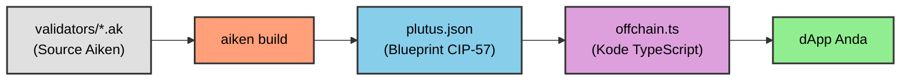

# Pelajaran #06: Memahami Blueprint

Plutus blueprint adalah jembatan antara kode on-chain dan off-chain. Pelajaran ini membahas cara memahami blueprint yang dihasilkan oleh Aiken dan menerjemahkannya menjadi kode offchain TypeScript untuk berinteraksi dengan smart contract Anda.

> Source code: [GitHub](https://github.com/cardanobuilders/cardanobuilders.github.io/tree/main/codes/course-cardano/06-interpreting-blueprint)

## Apa itu Blueprint?


Blueprint adalah file JSON terstandarisasi yang didefinisikan oleh [CIP-57](https://cips.cardano.org/cip/CIP-57). File ini merupakan output utama dari kompilasi smart contract Cardano dan berisi semua yang dibutuhkan untuk berinteraksi dengan kontrak tersebut. Setiap blueprint mencakup:

- **`preamble`**: Informasi meta tentang kontrak.
- **`validators`**: Validator yang diberi nama beserta definisi tipe dan kode yang telah dikompilasi.
- **`definitions`**: Registri definisi yang dapat digunakan kembali di seluruh spesifikasi.

### Membuat Blueprint

Buat blueprint dengan Aiken:

1. Build kontrak Anda:

```sh
aiken build
```

2. Temukan blueprint di file `plutus.json` pada root proyek Anda.

## Memahami Isi Blueprint

### `preamble`

`preamble` berisi metadata kontrak: nama, deskripsi, versi, dan versi Plutus. Versi Plutus sangat penting untuk persiapan kode offchain.

Contoh:

```json
{
  "preamble": {
    "title": "meshsdk/aiken-template",
    "description": "Aiken contracts for project 'meshsdk/aiken-template'",
    "version": "0.0.0",
    "plutusVersion": "v3", // Key information for offchain code
    "compiler": {
      "name": "Aiken",
      "version": "v1.1.16+23061c0"
    },
    "license": "Apache-2.0"
  }
}
```

### `validators`

Bagian `validators` berisi informasi tipe untuk `datum`, `redeemer`, dan `parameters`, beserta kode validator yang telah dikompilasi. Tipe-tipe tersebut mungkin mereferensikan definisi yang dapat digunakan kembali dari bagian `definitions`.

Contoh:

```json
{
  "title": "spend.spending_logics_delegated.spend",
  "datum": {
    "title": "_datum_opt",
    "schema": {
      "$ref": "#/definitions/Data"
    }
  },
  "redeemer": {
    "title": "_redeemer",
    "schema": {
      "$ref": "#/definitions/Data"
    }
  },
  "parameters": [
    {
      "title": "delegated_withdrawal_script_hash",
      "schema": {
        "$ref": "#/definitions/aiken~1crypto~1ScriptHash"
      }
    }
  ],
  "compiledCode": "58ac010100229800aba2aba1aba0aab9faab9eaab9dab9a9bae0024888888896600264646644b30013370e900118039baa001899914c004c03400a601a601c0052259800800c528456600266ebc00cc02cc03c00629462660040046020002805100d2444660020026eacc040c044c044c044c044c044c044c034dd518080048c020dd500099ba548008cc028dd4802a5eb822c8030c024004c024c028004c024004c010dd5004c52689b2b200401",
  "hash": "9c9666ddc12fc42f0151cd029c150c7d410ede9fe3885c248c8c26a0"
}
```

Perhatikan bahwa `spend.spending_logics_delegated.else` dikompilasi menjadi hash yang sama dengan `spend.spending_logics_delegated.spend`. Kedua purpose menggunakan script terkompilasi yang sama. Validator multi-purpose dikompilasi menjadi satu hash, yang dapat dimanfaatkan oleh arsitektur tertentu.

```json
{
  "title": "spend.spending_logics_delegated.else",
  "redeemer": {
    "schema": {}
  },
  "parameters": [
    {
      "title": "delegated_withdrawal_script_hash",
      "schema": {
        "$ref": "#/definitions/aiken~1crypto~1ScriptHash"
      }
    }
  ],
  "compiledCode": "58ac010100229800aba2aba1aba0aab9faab9eaab9dab9a9bae0024888888896600264646644b30013370e900118039baa001899914c004c03400a601a601c0052259800800c528456600266ebc00cc02cc03c00629462660040046020002805100d2444660020026eacc040c044c044c044c044c044c044c034dd518080048c020dd500099ba548008cc028dd4802a5eb822c8030c024004c024c028004c024004c010dd5004c52689b2b200401",
  "hash": "9c9666ddc12fc42f0151cd029c150c7d410ede9fe3885c248c8c26a0"
}
```

### `definitions`

Bagian `definitions` berisi skema tipe yang dapat digunakan kembali, yang direferensikan oleh bagian `validators`.

Contoh:

```json
{
  "definitions": {
    "Data": {
      "title": "Data",
      "description": "Any Plutus data."
    },
    "aiken/crypto/ScriptHash": {
      "title": "ScriptHash",
      "dataType": "bytes"
    },
    "cardano/assets/PolicyId": {
      "title": "PolicyId",
      "dataType": "bytes"
    },
    "withdraw/MyRedeemer": {
      "title": "MyRedeemer",
      "anyOf": [
        {
          "title": "ContinueCounting",
          "dataType": "constructor",
          "index": 0,
          "fields": []
        },
        {
          "title": "StopCounting",
          "dataType": "constructor",
          "index": 1,
          "fields": []
        }
      ]
    }
  }
}
```

## Mengotomatisasi Pembuatan Kode Offchain

Menerjemahkan blueprint menjadi kode offchain secara manual memakan waktu. Ekstensi [`Cardano Bar VSCode Extension`](https://marketplace.visualstudio.com/items/?itemName=sidan-lab.cardano-bar-vscode) dapat mengotomatisasi proses ini. Buat kode offchain dari blueprint Anda dalam tiga langkah:

1. Buat file TypeScript baru, misalnya `offchain.ts`.
2. Buka command palette di VSCode (Ctrl+Shift+P atau Cmd+Shift+P).
3. Ketik `Parse blueprint to Typescript - Mesh` dan pilih.


4. Pilih file `plutus.json` yang berisi blueprint.


File `offchain.ts` yang dihasilkan mencakup semua fungsi yang dibutuhkan untuk berinteraksi dengan kode on-chain: spending, minting, dan querying kontrak. Lihat [dokumentasi Mesh SDK](https://meshjs.dev/apis/utilities/blueprints) untuk detailnya.

## Kesimpulan

Memahami Plutus blueprint sangat penting untuk menghubungkan validator on-chain dengan aplikasi off-chain. Alat seperti kelas `Blueprint` dari Mesh dan ekstensi Cardano Bar mengotomatisasi sebagian besar pekerjaan penerjemahan, sehingga Anda dapat fokus pada pengembangan aplikasi.

## Panduan Kode Sumber

Bagian ini membahas file-file proyek dengan fokus pada bagaimana blueprint Plutus (`plutus.json`) menjembatani kesenjangan antara kode on-chain Aiken dan aplikasi TypeScript off-chain.

### Struktur Proyek

```
06-interpreting-blueprint/
├── validators/
│   ├── withdraw.ak    # Validator withdrawal (tipe OracleDatum, MyRedeemer)
│   ├── spend.ak       # Validator spending yang mendelegasikan ke withdrawal
│   └── mint.ak        # Validator minting yang mendelegasikan ke withdrawal
├── aiken.toml         # Manifes proyek (seperti package.json)
├── aiken.lock         # File lock dependensi (seperti bun.lockb)
└── plutus.json        # Blueprint CIP-57 -- FILE KUNCI untuk pelajaran ini
```

Tiga validator `.ak` mengikuti pola delegasi yang sama dari Pelajaran 5. Yang baru di sini adalah memahami `plutus.json` -- artefak terkompilasi yang memungkinkan integrasi off-chain.

### Pipeline Kompilasi



Ini adalah jalur lengkap dari kode sumber smart contract hingga aplikasi yang berjalan. Blueprint berada di tengah -- ini adalah artefak yang dipahami baik oleh blockchain maupun kode TypeScript Anda.

### Model Mental Web2

Jika Anda pernah bekerja dengan REST API, blueprint dipetakan dengan bersih ke konsep yang sudah Anda kenal:

| Bagian Blueprint | Padanan Web2 | Fungsinya |
|---|---|---|
| `preamble` | Metadata `package.json` | Nama proyek, versi, info compiler, versi Plutus |
| `validators` | Definisi endpoint API | Tujuan, parameter, dan bytecode terkompilasi setiap validator |
| `validators[].compiledCode` | Binary terkompilasi atau modul WASM | Eksekutabel aktual yang di-deploy on-chain |
| `validators[].parameters` | Argumen fungsi / route param | Nilai yang harus disuplai sebelum validator dapat berjalan |
| `definitions` | JSON Schema / definisi tipe TypeScript | Skema tipe yang dapat digunakan kembali yang direferensikan oleh validator |
| `plutus.json` keseluruhan | Spesifikasi OpenAPI (Swagger) | Sumber kebenaran tunggal yang mendeskripsikan antarmuka kontrak Anda |

Sama seperti spesifikasi OpenAPI memungkinkan Anda menghasilkan klien API secara otomatis, blueprint Plutus memungkinkan alat seperti Mesh SDK menghasilkan kode TypeScript secara otomatis untuk berinteraksi dengan kontrak Anda.

### `plutus.json` -- Blueprint Secara Detail

Ini adalah file terpenting dalam proyek untuk pengembangan off-chain. Ketika Anda menjalankan `aiken build`, compiler membaca semua file `.ak` dan menghasilkan satu file JSON yang berisi:

**Preamble** -- Metadata tentang proyek Anda. Field `plutusVersion` (misalnya, `"v3"`) sangat penting karena memberi tahu library off-chain versi bahasa Plutus mana yang ditargetkan saat membangun transaksi.

**Validators** -- Setiap entri validator menyertakan `title` yang mengkodekan nama file, nama modul, dan tujuan (misalnya, `"spend.spending_logics_delegated.spend"`). Juga menyertakan `compiledCode` (CBOR script Plutus yang di-encode hex) dan `hash` (pengidentifikasi alamat on-chain script). Perhatikan bahwa validator multi-purpose seperti `spend.spending_logics_delegated.spend` dan `spend.spending_logics_delegated.else` berbagi kode terkompilasi dan hash yang sama.

**Definitions** -- Registri tipe yang dapat digunakan kembali. Ketika datum atau redeemer validator mereferensikan `"$ref": "#/definitions/withdraw/MyRedeemer"`, skema tipe aktual berada di sini. Ini identik dengan bagaimana JSON Schema menggunakan `$ref` untuk menghindari duplikasi definisi tipe.

### File Validator

Tiga file `.ak` mendefinisikan logika on-chain yang dikompilasi ke dalam blueprint:

**`withdraw.ak`** mendefinisikan tipe inti (`OracleDatum`, `MyRedeemer` dengan varian `ContinueCounting` dan `StopCounting`) dan logika validasi bersama. Tipe-tipe ini muncul di bagian `definitions` blueprint.

**`spend.ak`** dan **`mint.ak`** mendelegasikan ke withdrawal script, seperti yang dibahas di Pelajaran 5. Kode terkompilasi mereka muncul sebagai entri validator terpisah dalam blueprint, masing-masing dengan hash sendiri untuk pengalamatan on-chain.

### Dari Blueprint ke TypeScript

Ekstensi VSCode Cardano Bar (yang dijelaskan di bagian atas) membaca `plutus.json` dan menghasilkan fungsi TypeScript yang cocok dengan setiap validator. Kode yang dihasilkan menggunakan kelas `Blueprint` dari Mesh SDK untuk men-deserialize kode terkompilasi, menerapkan parameter, dan membangun transaksi. Ini adalah alur kerja yang sama seperti menghasilkan klien API dari spesifikasi OpenAPI -- blueprint adalah kontraknya, dan kode yang dihasilkan adalah kliennya.

## Source code

Source code untuk pelajaran ini tersedia di [GitHub](https://github.com/cardanobuilders/cardanobuilders.github.io/tree/main/codes/course-cardano/06-interpreting-blueprint).
