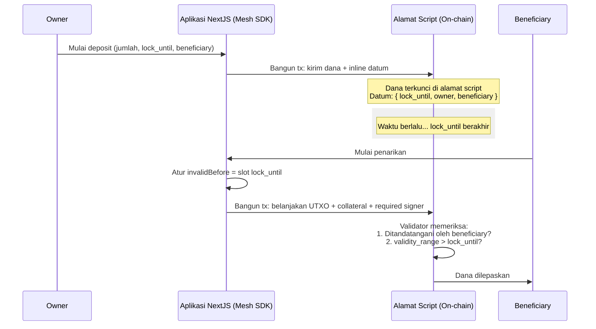

# Pelajaran #07: Vesting Contract

Vesting contract mengunci dana selama periode tertentu dan hanya mengizinkan beneficiary yang ditunjuk untuk menariknya setelah masa penguncian berakhir. Pelajaran ini membahas implementasi dan interaksi dengan vesting contract di Cardano menggunakan Aiken dan Mesh SDK.

> Source code: [GitHub](https://github.com/cardanobuilders/cardanobuilders.github.io/tree/main/codes/course-cardano/07-vesting)

## Ringkasan

### Apa Itu Vesting Contract?
Vesting contract mengunci dana dan melepaskannya kepada beneficiary hanya setelah periode waktu tertentu. Kontrak ini memberikan keamanan dan kontrol atas distribusi dana.


### Fitur Utama:
- **Periode Penguncian**: Dana dikunci hingga timestamp tertentu.
- **Owner dan Beneficiary**: Owner menyetorkan dana, dan beneficiary menariknya setelah periode penguncian berakhir.

## Detail Smart Contract

### Definisi Datum
Datum mengkonfigurasi vesting contract dengan tiga parameter:

- **`lock_until`**: Timestamp POSIX sampai kapan dana dikunci
- **`owner`**: Kredensial pemilik dana
- **`beneficiary`**: Kredensial beneficiary

```
pub type VestingDatum {
  /// POSIX time in milliseconds, e.g. 1672843961000
  lock_until: Int,
  /// Owner's credentials
  owner: ByteArray,
  /// Beneficiary's credentials
  beneficiary: ByteArray,
}
```

Datum ini dapat ditemukan di `aiken-vesting/aiken-workspace/lib/vesting/types.ak`.

Selanjutnya, kita mendefinisikan spend validator.

```
validator vesting {
  spend(
    datum_opt: Option<VestingDatum>,
    _redeemer: Data,
    _input: OutputReference,
    tx: Transaction,
  ) {
    // In principle, scripts can be used for different purpose (e.g. minting
    // assets). Here we make sure it's only used when 'spending' from a eUTxO
    expect Some(datum) = datum_opt
    or {
      key_signed(tx.extra_signatories, datum.owner),
      and {
        key_signed(tx.extra_signatories, datum.beneficiary),
        valid_after(tx.validity_range, datum.lock_until),
      },
    }
  }

  else(_) {
    fail
  }
}
```

Validator `vesting` mengizinkan penarikan dalam dua kondisi:

1. Transaksi ditandatangani oleh **owner** (dapat menarik kapan saja), ATAU
2. Transaksi ditandatangani oleh **beneficiary** DAN waktu saat ini sudah melewati periode penguncian


### Cara Kerjanya

Owner menyetorkan dana ke vesting contract, menguncinya sampai periode penguncian berakhir.

Transaksi Cardano menyertakan interval validitas yang menentukan kapan transaksi tersebut valid. Ledger memverifikasi batasan ini sebelum mengeksekusi script apa pun. Hal ini memberikan script pemahaman tentang waktu sekaligus menjaga determinisme: jika sebuah transaksi memiliki batas bawah `A`, maka waktu saat ini setidaknya `A`.

Karena batas atas tidak dikontrol, transaksi bisa saja dieksekusi jauh setelah waktu vesting berakhir. Dari perspektif script, hal ini dapat diterima; kontrak hanya mewajibkan waktu tunggu minimum.

### Pengujian

Script pengujian komprehensif telah disediakan. Jalankan pengujian dengan `aiken check`.

Script pengujian mencakup skenario berikut:

- berhasil membuka kunci
- berhasil membuka kunci hanya dengan tanda tangan owner
- berhasil membuka kunci dengan tanda tangan beneficiary dan waktu telah berlalu
- gagal membuka kunci hanya dengan tanda tangan beneficiary
- gagal membuka kunci hanya dengan waktu yang telah berlalu

Lihat source pengujian lengkap di [`vesting.ak`](https://github.com/cardanobuilders/cardanobuilders.github.io/blob/main/codes/course-cardano/07-vesting/src/aiken-workspace/validators/vesting.ak).

### Kompilasi dan build script

Untuk mengkompilasi script, jalankan perintah berikut:

```sh
aiken build
```

Perintah ini akan menghasilkan Plutus blueprint CIP-0057, yang dapat Anda temukan di [`plutus.json`](https://github.com/cardanobuilders/cardanobuilders.github.io/blob/main/codes/course-cardano/07-vesting/src/aiken-workspace/plutus.json).

## Menyetorkan Dana

Owner menyetorkan dana ke vesting contract dan menentukan periode penguncian.

```ts
const assets: Asset[] = [
  {
    unit: "lovelace",
    quantity: "10000000",
  },
];

const lockUntilTimeStamp = new Date();
lockUntilTimeStamp.setMinutes(lockUntilTimeStamp.getMinutes() + 1);
```

Kode ini menyetorkan 10 ADA ke vesting contract dengan periode penguncian 1 menit.

```ts
// app wallet
const wallet = new MeshWallet({
  networkId: 0,
  key: {
    type: "mnemonic",
    words: appWallet,
  },
  fetcher: provider,
  submitter: provider,
});

const utxos = await wallet.getUtxos();
const changeAddress = await wallet.getChangeAddress();

const { pubKeyHash: ownerPubKeyHash } = deserializeAddress(changeAddress);
const { pubKeyHash: beneficiaryPubKeyHash } =
  deserializeAddress(beneficiaryAddress);
```

Tutorial ini menggunakan app wallet terpisah untuk membiayai deposit. Public key hash dari owner dan beneficiary diekstrak menggunakan `deserializeAddress`.

```ts
const txBuilder = new MeshTxBuilder({
  fetcher: provider,
  verbose: true,
});

const unsignedTx = await txBuilder
  .txOut(script.address, amount)
  .txOutInlineDatumValue(
    mConStr0([lockUntilTimeStampMs, ownerPubKeyHash, beneficiaryPubKeyHash])
  )
  .changeAddress(changeAddress)
  .selectUtxosFrom(utxos)
  .complete();
```

Transaksi mengirim dana ke alamat script vesting contract dengan inline datum yang berisi periode penguncian, owner, dan beneficiary.

Tanda tangani dan kirimkan:

```ts
const signedTx = await wallet.signTx(unsignedTx);
const txHash = await wallet.submitTx(signedTx);
```

Simpan hash transaksi yang dikembalikan; Anda akan membutuhkannya untuk menarik dana.

Contoh [transaksi deposit yang berhasil](https://preprod.cardanoscan.io/transaction/556f2bfcd447e146509996343178c046b1b9ad4ac091a7a32f85ae206345e925).

## Menarik Dana

Setelah periode penguncian berakhir, beneficiary (atau owner) dapat menarik dana.

Pertama, ambil UTXOs yang berisi dana yang terkunci:

```ts
const txHashFromDesposit =
  "556f2bfcd447e146509996343178c046b1b9ad4ac091a7a32f85ae206345e925";
const utxos = await provider.fetchUTxOs(txHash);
const vestingUtxo = utxos[0];
```

Kode ini mengambil UTXOs dari transaksi deposit. Selanjutnya, siapkan datum dan hitung nomor slot untuk interval validitas transaksi:

```ts
const datum = deserializeDatum<VestingDatum>(vestingUtxo.output.plutusData!);

const invalidBefore =
  unixTimeToEnclosingSlot(
    Math.min(datum.fields[0].int as number, Date.now() - 15000),
    SLOT_CONFIG_NETWORK.preprod
  ) + 1;
```

Periode penguncian dari datum menentukan slot `invalidBefore`, memastikan transaksi hanya valid setelah masa penguncian berakhir.

Buat transaksi penarikan:

```ts
const txBuilder = new MeshTxBuilder({
  fetcher: provider,
  verbose: true,
});

const unsignedTx = await txBuilder
  .spendingPlutusScript("V3")
  .txIn(
    vestingUtxo.input.txHash,
    vestingUtxo.input.outputIndex,
    vestingUtxo.output.amount,
    script.address
  )
  .spendingReferenceTxInInlineDatumPresent()
  .spendingReferenceTxInRedeemerValue("")
  .txInScript(script.cbor)
  .txOut(walletAddress, [])
  .txInCollateral(
    collateralInput.txHash,
    collateralInput.outputIndex,
    collateralOutput.amount,
    collateralOutput.address
  )
  .invalidBefore(invalidBefore)
  .requiredSignerHash(pubKeyHash)
  .changeAddress(walletAddress)
  .selectUtxosFrom(inputUtxos)
  .complete();
```

Transaksi ini membelanjakan UTXO yang terkunci dari vesting contract, dengan menentukan script, datum, redeemer, collateral, interval validitas, dan required signer.

Tanda tangani dan kirimkan:

Contoh [transaksi penarikan yang berhasil](https://preprod.cardanoscan.io/transaction/13d6b2258680bbdf08f50a3bbc03e7ed674f5614844ce773fc191c9582282b04).

## Panduan Kode Sumber

Bagian ini menguraikan struktur proyek dan memetakan konsep blockchain ke pola web2 yang familiar untuk membantu Anda memahami bagaimana vesting contract bekerja secara end-to-end.

### Struktur Proyek

```
07-vesting/
├── src/                    # Aplikasi NextJS
│   ├── app/                # Halaman app router dan API route
│   ├── components/         # Komponen React untuk UI deposit/withdraw
│   └── lib/                # Utilitas bersama dan helper kontrak
├── aiken-workspace/        # Kode smart contract on-chain
│   ├── lib/
│   │   └── vesting/
│   │       └── types.ak    # Definisi tipe VestingDatum
│   ├── validators/
│   │   └── vesting.ak      # Validator spend + tes
│   └── plutus.json         # Blueprint Plutus terkompilasi (CIP-0057)
├── eslint.config.mjs
├── next.config.ts
├── package.json            # Dependensi: NextJS + @meshsdk/core
├── postcss.config.mjs
└── tsconfig.json
```

Proyek ini memiliki dua bagian yang berbeda. Direktori `aiken-workspace/` berisi validator on-chain yang ditulis dalam Aiken -- ini adalah smart contract yang dieksekusi ledger Cardano ketika seseorang mencoba membelanjakan dana yang terkunci. Direktori `src/` adalah aplikasi NextJS standar yang membangun dan mengirim transaksi deposit dan withdraw menggunakan Mesh SDK. Anggap kode Aiken sebagai logika bisnis backend Anda yang berjalan di blockchain, dan aplikasi NextJS sebagai klien frontend Anda yang memanggilnya.

### Siklus Hidup Vesting



### Padanan Web2

Jika Anda pernah membangun fitur escrow atau pelepasan terjadwal dalam aplikasi web, Anda sudah memahami ide intinya. Berikut bagaimana setiap konsep Cardano dipetakan:

| Konsep Cardano | Padanan Web2 | Fungsinya |
|---|---|---|
| **Vesting contract** | Layanan escrow (misalnya, pembayaran tertunda Stripe Connect) | Menahan dana dan melepaskannya ketika kondisi terpenuhi |
| **Datum** (`VestingDatum`) | Ketentuan escrow yang disimpan dalam baris database | Mencatat waktu kunci, pemilik, dan beneficiary secara on-chain |
| **`lock_until`** | Tanggal pelepasan terjadwal / waktu pemicu cron job | Timestamp POSIX ketika dana dapat ditarik |
| **`validity_range`** | Validasi timestamp request (misalnya, klaim `nbf` JWT) | Ledger memaksa bahwa transaksi hanya valid dalam jendela waktu ini, memberikan script pemahaman waktu yang dapat diandalkan tentang "sekarang" |
| **Collateral** | Deposit jaminan untuk panggilan API yang gagal (seperti charge yang ditahan) | UTXO kecil yang dijaminkan untuk menutupi biaya jika eksekusi script gagal -- Anda mendapatkannya kembali jika berhasil |
| **Alamat script** | Akun escrow / akun penahanan kustodial | Alamat blockchain yang dikontrol oleh kode, bukan private key |

Perbedaan kunci dari web2: tidak ada server yang memutuskan apakah akan melepaskan dana. Logika validator berjalan secara deterministik di setiap node Cardano, dan mekanisme `validity_range` memungkinkan ledger itu sendiri memaksa batasan waktu tanpa bergantung pada jam di dalam script.

## Source code

Source code untuk pelajaran ini tersedia di [GitHub](https://github.com/cardanobuilders/cardanobuilders.github.io/tree/main/codes/course-cardano/07-vesting).

## Tantangan

Modifikasi vesting contract untuk mengimplementasikan jadwal vesting bertahap di mana dana dilepaskan secara bertahap seiring waktu, bukan sekaligus. Atau, tambahkan periode cliff di mana beneficiary harus menunggu sebelum token mana pun tersedia.
