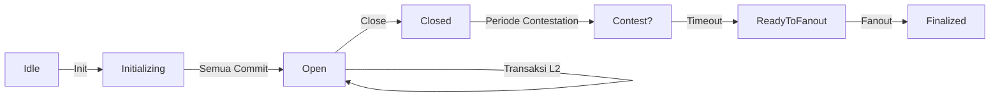

# Pelajaran #09: Hydra End-to-End Happy Flow

Hydra adalah solusi scaling Layer 2 untuk Cardano yang memungkinkan transaksi hampir instan dengan biaya rendah antar peserta. Hydra beroperasi sebagai state channel: ledger off-chain sementara di mana beberapa pihak dapat bertransaksi ribuan kali per detik sambil tetap menjaga jaminan keamanan dari Cardano main chain (Layer 1).

Dalam pelajaran ini, Anda akan:
- Menyiapkan dan menghubungkan ke Hydra node
- Membuka Hydra Head antara dua peserta
- Melakukan commit dana dari Layer 1 ke dalam Head
- Membangun dan mengirim transaksi Layer 2 instan menggunakan MeshJS
- Menutup Head dan menyelesaikan state akhir kembali ke Layer 1

> Source code: [GitHub](https://github.com/cardanobuilders/cardanobuilders.github.io/tree/main/codes/course-cardano/09-hydra)

## Ringkasan

### Cara Kerja Hydra

Hydra Head adalah state channel dengan siklus hidup yang terdefinisi:

1. **Initialize**: Peserta sepakat untuk membuka Head di Layer 1
2. **Commit**: Setiap peserta mengunci dana dari Layer 1 ke dalam Head
3. **Transact**: Memproses transaksi tanpa batas secara instan secara off-chain
4. **Close**: Mengirimkan state akhir yang telah disepakati kembali ke Layer 1
5. **Fanout**: Mendistribusikan dana di Layer 1 sesuai state akhir

Di dalam Head, transaksi menggunakan format yang sama dengan Cardano Layer 1. Biaya nol, konfirmasi instan (hanya dibatasi oleh latensi jaringan antar peserta), dan semua pihak harus menyetujui setiap transisi state.


### Kapan Menggunakan Hydra

Hydra ideal untuk:
- **Transaksi frekuensi tinggi**: Gaming, pembayaran mikro, aplikasi real-time
- **Aplikasi yang sensitif biaya**: Kumpulkan banyak transaksi secara off-chain, hanya bayar biaya L1 untuk membuka dan menutup
- **Transaksi privat**: Simpan detail transaksi secara off-chain hingga penyelesaian
- **Aplikasi interaktif**: Protokol multi-pihak yang membutuhkan pembaruan state cepat


## Persiapan Sistem

### Prasyarat

Sebelum memulai, Anda memerlukan:
- Node Cardano dengan akses `cardano-cli` (tersinkronisasi ke preprod testnet)
- Binary `hydra-node` ([panduan instalasi](https://hydra.family/head-protocol/docs/getting-started/installation))
- Test ADA di preprod (minimal 30 tADA per peserta untuk biaya node, ditambah dana untuk commit)
- Akses jaringan antar mesin peserta

### Instalasi Paket

Buat direktori proyek baru dan instal paket MeshJS yang diperlukan:

```bash
mkdir mesh-hydra && cd mesh-hydra
npm init -y
npm install @meshsdk/hydra @meshsdk/core @meshsdk/wallet
npm install -D typescript tsx
```

### Generate Key

Setiap peserta memerlukan dua pasang key: key Cardano (untuk operasi Layer 1) dan key Hydra (untuk menandatangani snapshot di dalam Head).

Generate key untuk Alice:

```bash
mkdir -p credentials

# Cardano keys (for L1 fees and identity)
cardano-cli address key-gen \
  --verification-key-file credentials/alice-node.vk \
  --signing-key-file credentials/alice-node.sk

cardano-cli address build \
  --payment-verification-key-file credentials/alice-node.vk \
  --out-file credentials/alice-node.addr \
  --testnet-magic 1

# Funds keys (for committing to the Head)
cardano-cli address key-gen \
  --verification-key-file credentials/alice-funds.vk \
  --signing-key-file credentials/alice-funds.sk

cardano-cli address build \
  --payment-verification-key-file credentials/alice-funds.vk \
  --out-file credentials/alice-funds.addr \
  --testnet-magic 1

# Hydra keys (for Head protocol signing)
hydra-node gen-hydra-key --output-file credentials/alice-hydra
```

Ulangi langkah yang sama untuk Bob (ganti `alice` dengan `bob` di semua nama file).

Isi alamat node dengan minimal 30 tADA masing-masing dari [Cardano testnet faucet](https://docs.cardano.org/cardano-testnets/tools/faucet/). Alamat funds dapat berisi jumlah berapa pun yang ingin Anda commit ke dalam Head.

### Konfigurasi Protocol Parameters

Buat file `protocol-parameters.json`. Di dalam Hydra Head, biaya diatur menjadi nol:

```json
{
  "txFeeFixed": 0,
  "txFeePerByte": 0,
  "executionUnitPrices": {
    "priceMemory": 0,
    "priceSteps": 0
  }
}
```

Salin protocol parameters preprod Anda dan timpa field terkait biaya di atas menjadi nol. Semua parameter lainnya tetap sama seperti Layer 1.

### Menjalankan Hydra Node

Jalankan Hydra node milik Alice:

```bash
hydra-node \
  --node-id alice-node \
  --api-host 0.0.0.0 \
  --api-port 4001 \
  --listen 0.0.0.0:5001 \
  --peer <BOB_IP>:5001 \
  --hydra-scripts-tx-id <HYDRA_SCRIPTS_TX_ID> \
  --cardano-signing-key credentials/alice-node.sk \
  --cardano-verification-key credentials/bob-node.vk \
  --hydra-signing-key credentials/alice-hydra.sk \
  --hydra-verification-key credentials/bob-hydra.vk \
  --ledger-protocol-parameters protocol-parameters.json \
  --testnet-magic 1 \
  --node-socket "${CARDANO_NODE_SOCKET_PATH}" \
  --contestation-period 300s
```

Jalankan node Bob dengan cara yang sama menggunakan kredensialnya, API port `4002`, dan Alice sebagai peer.

Parameter penting:
- `--api-port`: Port API HTTP/WebSocket untuk koneksi MeshJS
- `--peer`: Alamat listen peserta lain
- `--hydra-scripts-tx-id`: Script Hydra yang telah dipublikasi di preprod ([referensi](https://hydra.family/head-protocol/docs/getting-started/quickstart))
- `--contestation-period`: Jendela waktu untuk mengontestasi state akhir (300 detik di sini)

## Menghubungkan ke Hydra

Setelah node berjalan, hubungkan ke Hydra node menggunakan `HydraProvider`:

```ts
import { HydraProvider, HydraInstance } from "@meshsdk/hydra";
import { BlockfrostProvider } from "@meshsdk/core";

const blockfrost = new BlockfrostProvider("YOUR_BLOCKFROST_KEY");

const hydraProvider = new HydraProvider({
  httpUrl: "http://localhost:4001",
});

const instance = new HydraInstance({
  provider: hydraProvider,
  fetcher: blockfrost,
  submitter: blockfrost,
});

await hydraProvider.connect();
const connected = await hydraProvider.isConnected();
console.log("Connected to Hydra node:", connected);
```

- `HydraProvider` mengelola koneksi WebSocket ke API Hydra node.
- `HydraInstance` menyediakan method tingkat lebih tinggi untuk melakukan commit dana.
- `BlockfrostProvider` digunakan untuk operasi Layer 1 (mengambil UTxO, mengirimkan transaksi commit).

## Inisialisasi Head

Setelah terhubung, peserta mana pun dapat menginisialisasi Head:

```ts
await hydraProvider.init();
```

Ini mengirimkan perintah `Init` ke Hydra node. Semua node yang terhubung akan menerima event `HeadIsInitializing`. Head berpindah dari status `Idle` ke `Initializing`.

## Commit Dana

Selama fase `Initializing`, setiap peserta harus melakukan commit dana (atau commit kosong) ke Head. Dana yang di-commit akan tersedia di Layer 2 setelah Head terbuka.

Buat wallet dari key CLI dan commit sebuah UTxO:

```ts
import { MeshCardanoHeadlessWallet, AddressType } from "@meshsdk/wallet";

const wallet = await MeshCardanoHeadlessWallet.fromCliKeys({
  networkId: 0,
  walletAddressType: AddressType.Base,
  fetcher: blockfrost,
  submitter: blockfrost,
  paymentSkey: "credentials/alice-funds.sk",
});

const utxos = await wallet.getUtxosMesh();
const utxo = utxos[0];

const commitTx = await instance.commitFunds(
  utxo.input.txHash,
  utxo.input.outputIndex
);
const signedTx = await wallet.signTx(commitTx, true, false);
const txHash = await wallet.submitTx(signedTx);
console.log("Committed funds:", txHash);
```

- `commitFunds` menyusun transaksi Layer 1 yang mengunci UTxO yang ditentukan ke dalam Head.
- Transaksi memerlukan partial signing (`true` sebagai argumen kedua pada `signTx`).
- Kedua peserta harus melakukan commit sebelum Head dapat terbuka. Gunakan `commitEmpty()` jika peserta tidak ingin melakukan commit dana.

Pantau pembukaan Head:

```ts
hydraProvider.onMessage((message) => {
  if (message.tag === "HeadIsOpen") {
    console.log("Head is open! Ready for L2 transactions.");
  }
});
```

## Bertransaksi di Layer 2

Dengan Head yang terbuka, Anda dapat membangun dan mengirim transaksi yang diselesaikan secara instan. Transaksi Layer 2 menggunakan `MeshTxBuilder` yang sama dengan flag `isHydra` diatur ke `true`:

```ts
import { MeshTxBuilder } from "@meshsdk/core";

const protocolParams = await hydraProvider.fetchProtocolParameters();
const aliceAddress = await wallet.getChangeAddressBech32();
const l2Utxos = await hydraProvider.fetchAddressUTxOs(aliceAddress);

const txBuilder = new MeshTxBuilder({
  fetcher: hydraProvider,
  submitter: hydraProvider,
  isHydra: true,
  params: protocolParams,
});

const unsignedTx = await txBuilder
  .txOut(bobAddress, [{ unit: "lovelace", quantity: "5000000" }])
  .changeAddress(aliceAddress)
  .selectUtxosFrom(l2Utxos)
  .setNetwork("preprod")
  .complete();

const signedTx = await wallet.signTx(unsignedTx, false);
const txHash = await hydraProvider.submitTx(signedTx);
console.log("L2 transaction submitted:", txHash);
```

- `fetchProtocolParameters()` mengembalikan protocol parameters Head (dengan biaya nol).
- `fetchAddressUTxOs()` mengambil UTxOs di dalam Head untuk alamat tertentu.
- `isHydra: true` memberitahu `MeshTxBuilder` untuk membangun transaksi untuk lingkungan Hydra.
- `submitTx()` mengirimkan transaksi ke Head (bukan ke Layer 1).

Pantau konfirmasi transaksi:

```ts
hydraProvider.onMessage((message) => {
  if (message.tag === "TxValid") {
    console.log("Transaction confirmed:", message.transactionId);
  }
  if (message.tag === "TxInvalid") {
    console.log("Transaction rejected:", message.validationError);
  }
  if (message.tag === "SnapshotConfirmed") {
    console.log("New snapshot confirmed by all participants");
  }
});
```

Anda dapat mengirim sebanyak mungkin transaksi yang diperlukan di dalam Head. Setiap transaksi yang dikonfirmasi memperbarui state bersama melalui snapshot baru yang ditandatangani oleh semua peserta.

## Menutup Head

Peserta mana pun dapat menutup Head setelah selesai bertransaksi:

```ts
await hydraProvider.close();
```

Ini mem-posting snapshot terkonfirmasi terakhir ke Layer 1. Periode contestation dimulai (300 detik dalam konfigurasi kita). Selama jendela waktu ini, peserta mana pun dapat mengontestasi jika mereka memiliki snapshot yang lebih baru.

Setelah periode contestation berakhir, lakukan fanout state akhir ke Layer 1:

```ts
hydraProvider.onMessage(async (message) => {
  if (message.tag === "ReadyToFanout") {
    await hydraProvider.fanout();
    console.log("Fanout initiated");
  }
  if (message.tag === "HeadIsFinalized") {
    console.log("Head finalized! Funds are back on Layer 1.");
    await hydraProvider.disconnect();
  }
});
```

- `close()` memulai proses penutupan dan mem-posting state akhir ke on-chain.
- `fanout()` mendistribusikan dana di Layer 1 sesuai state akhir Head.
- Setelah `HeadIsFinalized`, semua dana kembali ke Layer 1 di alamat akhir mereka.

## Contoh Lengkap

Script berikut menjalankan happy flow yang lengkap: menginisialisasi Head, commit dana, mengirim transaksi, dan menutup.

```ts
import { HydraProvider, HydraInstance } from "@meshsdk/hydra";
import { BlockfrostProvider, MeshTxBuilder } from "@meshsdk/core";
import { MeshCardanoHeadlessWallet, AddressType } from "@meshsdk/wallet";

async function main() {
  const blockfrost = new BlockfrostProvider("YOUR_BLOCKFROST_KEY");

  const hydraProvider = new HydraProvider({
    httpUrl: "http://localhost:4001",
  });

  const instance = new HydraInstance({
    provider: hydraProvider,
    fetcher: blockfrost,
    submitter: blockfrost,
  });

  const wallet = await MeshCardanoHeadlessWallet.fromCliKeys({
    networkId: 0,
    walletAddressType: AddressType.Base,
    fetcher: blockfrost,
    submitter: blockfrost,
    paymentSkey: "credentials/alice-funds.sk",
  });

  const aliceAddress = await wallet.getChangeAddressBech32();
  const bobAddress = "addr_test1..."; // Bob's address

  await hydraProvider.connect();

  hydraProvider.onMessage(async (message) => {
    switch (message.tag) {
      case "HeadIsInitializing": {
        console.log("Head initializing, committing funds...");
        const utxos = await wallet.getUtxosMesh();
        const commitTx = await instance.commitFunds(
          utxos[0].input.txHash,
          utxos[0].input.outputIndex
        );
        const signedCommit = await wallet.signTx(commitTx, true, false);
        await wallet.submitTx(signedCommit);
        break;
      }

      case "HeadIsOpen": {
        console.log("Head is open, sending transaction...");
        const pp = await hydraProvider.fetchProtocolParameters();
        const l2Utxos = await hydraProvider.fetchAddressUTxOs(aliceAddress);

        const txBuilder = new MeshTxBuilder({
          fetcher: hydraProvider,
          submitter: hydraProvider,
          isHydra: true,
          params: pp,
        });

        const unsignedTx = await txBuilder
          .txOut(bobAddress, [{ unit: "lovelace", quantity: "5000000" }])
          .changeAddress(aliceAddress)
          .selectUtxosFrom(l2Utxos)
          .setNetwork("preprod")
          .complete();

        const signedTx = await wallet.signTx(unsignedTx, false);
        await hydraProvider.submitTx(signedTx);
        break;
      }

      case "SnapshotConfirmed": {
        console.log("Transaction confirmed, closing Head...");
        await hydraProvider.close();
        break;
      }

      case "ReadyToFanout": {
        console.log("Contestation period ended, fanning out...");
        await hydraProvider.fanout();
        break;
      }

      case "HeadIsFinalized": {
        console.log("Head finalized! Funds are back on L1.");
        await hydraProvider.disconnect();
        break;
      }
    }
  });

  await hydraProvider.init();
}

main().catch(console.error);
```

## Panduan Kode Sumber

Proyek ini memisahkan setup infrastruktur (shell script) dari logika aplikasi (TypeScript), pola yang mirip dengan bagaimana proyek web2 mungkin memisahkan konfigurasi Docker/Terraform dari kode Node.js-nya.

### Struktur Proyek

```
09-hydra/
├── src/                        # Logika aplikasi TypeScript
│   └── (Script alur Hydra)     #   Koneksi, commit, transaksi, tutup
├── generate-keys.sh            # Infrastruktur: generate pasangan key Cardano + Hydra
├── start-node-alice.sh         # Infrastruktur: jalankan Hydra node Alice
├── start-node-bob.sh           # Infrastruktur: jalankan Hydra node Bob
├── protocol-parameters.json    # Konfigurasi L2: biaya nol di dalam Head
├── package.json                # @meshsdk/hydra, @meshsdk/core, @meshsdk/wallet
└── tsconfig.json
```

**Shell script** menangani lapisan infrastruktur: menghasilkan key kriptografis dan menjalankan Hydra node dengan konfigurasi peer yang benar. Anggap ini seperti `docker-compose.yml` atau script deployment di proyek web2 tipikal. Anda menjalankannya sekali untuk menyiapkan lingkungan.

**File TypeScript di `src/`** berisi logika aplikasi yang menghubungkan ke Hydra node yang berjalan, melakukan commit dana, membangun transaksi, dan mengelola siklus hidup Head. Di sinilah MeshJS menyediakan API yang dihadapi developer.

**`protocol-parameters.json`** mendefinisikan aturan di dalam Hydra Head. Perbedaan kunci dari Layer 1 adalah bahwa semua field biaya diatur ke nol, yang berarti transaksi di dalam Head gratis. Ini seperti mengonfigurasi lapisan cache lokal tanpa biaya per-query.

### Siklus Hidup Hydra Head

Hydra Head mengikuti state machine yang ketat. Setiap peserta harus menyetujui setiap transisi, mirip dengan protokol konsensus dalam kelompok kecil.



- **Idle ke Initializing**: Peserta mana pun memanggil `hydraProvider.init()`. Transaksi Layer 1 mengumumkan Head secara on-chain.
- **Initializing ke Open**: Setiap peserta melakukan commit dana (atau commit kosong). Setelah semua commit terkumpul, Head terbuka secara otomatis.
- **Open (loop L2)**: Peserta membangun dan mengirim transaksi dengan bebas. Setiap transaksi yang dikonfirmasi membuat snapshot baru yang ditandatangani semua pihak. Biaya nol dan konfirmasi hampir instan.
- **Close**: Peserta mana pun memanggil `hydraProvider.close()`, mem-posting snapshot terbaru ke Layer 1.
- **Periode Contestation**: Jendela waktu (300 detik dalam pelajaran ini) di mana peserta mana pun dapat membantah state yang diposting jika mereka memiliki snapshot yang lebih baru.
- **Fanout**: Setelah periode contestation berlalu tanpa bantahan, `hydraProvider.fanout()` mendistribusikan saldo akhir kembali ke alamat Layer 1.

### Padanan Web2

Jika Anda berasal dari latar belakang web2, pemetaan ini akan membantu Anda memahami Hydra:

| Konsep Hydra | Padanan Web2 | Mengapa |
|---|---|---|
| Hydra Head | Database privat atau lapisan cache | Lingkungan sementara dan cepat yang dibagikan oleh sekumpulan peserta yang dikenal |
| Layer 1 (Cardano) | Database utama (PostgreSQL) | Penyimpanan resmi dan tahan lama |
| Layer 2 (di dalam Head) | Cache in-memory (Redis) | Baca dan tulis cepat tanpa biaya per operasi |
| Commit dana | Memuat data ke cache | Memindahkan state dari penyimpanan tahan lama yang lambat ke lapisan cepat |
| Fanout | Flush cache ke DB utama | Menyimpan state akhir kembali ke penyimpanan resmi |
| Periode contestation | Jendela resolusi konflik | Periode tenggang untuk mendeteksi dan menyelesaikan inkonsistensi sebelum finalisasi |
| API WebSocket | Stream event real-time (Socket.io) | Hydra node mendorong event seperti `HeadIsOpen`, `TxValid`, dan `SnapshotConfirmed` melalui WebSocket |
| Biaya nol di L2 | Tanpa biaya per-query di cache | Setelah Anda membayar biaya untuk membuka Head, transaksi di dalamnya gratis |
| Snapshot | Checkpoint cache | State yang disepakati secara berkala yang ditandatangani semua peserta |

Model mental kunci: Anda membayar biaya Layer 1 untuk membuka dan menutup Head (seperti menyediakan dan menonaktifkan cluster cache), tetapi semuanya di dalam berjalan cepat dan gratis.

## Source code

Source code untuk pelajaran ini tersedia di [GitHub](https://github.com/cardanobuilders/cardanobuilders.github.io/tree/main/codes/course-cardano/09-hydra).

## Tantangan

Buka Hydra Head antara dua peserta, commit dana dari kedua sisi, dan jalankan beberapa transaksi bolak-balik. Kemudian tutup Head, lakukan fanout, dan verifikasi di [preprod.cardanoscan.io](https://preprod.cardanoscan.io) bahwa saldo Layer 1 akhir mencerminkan semua transaksi Layer 2.
