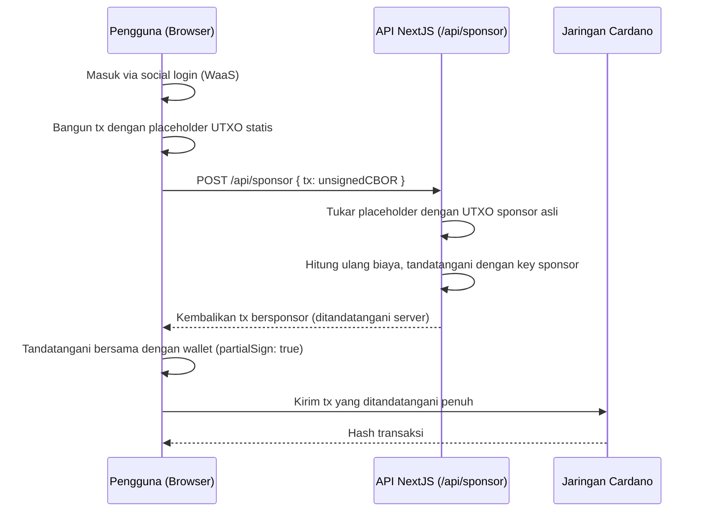

# Pelajaran #10: Web3 Services untuk Onboarding yang Mulus

Web3 Services menghilangkan dua hambatan terbesar dalam adopsi blockchain: pengaturan wallet dan biaya transaksi. Alih-alih meminta pengguna untuk menginstal ekstensi browser dan membeli ADA, aplikasi Anda menyediakan wallet dengan social login dan menanggung biaya jaringan atas nama mereka.

Dalam pelajaran ini, Anda akan:
- Mengintegrasikan Wallet-as-a-Service (WaaS) agar pengguna dapat membuat wallet dengan social login
- Menyiapkan proxy Blockfrost untuk menjaga API key di sisi server
- Membangun transaksi bersponsor di mana developer menanggung biaya jaringan
- Mengirimkan transaksi pengiriman ADA yang sepenuhnya bersponsor di Cardano preprod

## Cara Kerjanya

### Wallet as a Service

Wallet-as-a-Service (WaaS) memungkinkan pengguna bertransaksi on-chain tanpa mengelola private key. Pengguna masuk dengan Google, Discord, Twitter, atau Apple dan langsung menerima wallet non-custodial.


Sistem manajemen key menggunakan Shamir's Secret Sharing untuk membagi private key menjadi tiga bagian yang disimpan di lokasi terpisah. Baik UTXOS maupun aplikasi developer tidak memiliki akses ke key lengkap. Saat penandatanganan transaksi, key direkonstruksi hanya di perangkat pengguna di dalam iframe terisolasi, disimpan di memori, dan dihapus setelah penandatanganan selesai.

### Sponsorship Transaksi

Biaya jaringan di Cardano dibayar dengan ADA. Hal ini menciptakan titik hambatan: pengguna akhir harus memiliki ADA sebelum mereka dapat berinteraksi dengan aplikasi apa pun.


Sponsorship transaksi menghilangkan hambatan ini. Wallet yang dikontrol developer menanggung input transaksi dan biaya jaringan atas nama pengguna. SDK membangun transaksi dengan placeholder statis, menukarnya dengan UTXO asli dari wallet sponsor, menandatanganinya di sisi server, dan mengembalikan transaksi untuk ditandatangani bersama oleh pengguna.

## Persiapan Sistem

### Prasyarat

Anda memerlukan hal berikut sebelum memulai:

- Akun dan proyek UTXOS dari [utxos.dev/dashboard](https://utxos.dev/dashboard)
- API key [Blockfrost](https://blockfrost.io/) (jaringan preprod)
- Sponsorship yang telah dibuat di dashboard UTXOS dengan wallet yang telah didanai
- Node.js 18+ terinstal

### Membuat Aplikasi NextJS

Buat aplikasi NextJS baru:

```bash
npx create-next-app@latest --typescript web3-services-demo
```

Ikuti petunjuknya:

```bash
Need to install the following packages:
Ok to proceed? (y)

✔ Would you like to use ESLint? … Yes
✔ Would you like to use Tailwind CSS? … Yes
✔ Would you like your code inside a `src/` directory? … Yes
✔ Would you like to use App Router? … Yes
✔ Would you like to use Turbopack for next dev? … No
✔ Would you like to customize the import alias (@/* by default)? … No
```

Masuk ke direktori proyek:

```bash
cd web3-services-demo
```

### Instalasi Dependensi

Instal SDK UTXOS dan paket Mesh:

```bash
npm install @utxos/sdk @meshsdk/core
```

### Konfigurasi Environment Variables

Buat file `.env` di root proyek:

```bash
# Client-side (safe to expose)
NEXT_PUBLIC_UTXOS_PROJECT_ID=your_project_id
NEXT_PUBLIC_NETWORK_ID=0

# Server-side only (never expose to client)
BLOCKFROST_API_KEY_PREPROD=your_blockfrost_preprod_key
UTXOS_API_KEY=your_utxos_api_key
UTXOS_PRIVATE_KEY=your_entity_secret_private_key
SPONSORSHIP_ID=your_sponsorship_id
```

- `NEXT_PUBLIC_UTXOS_PROJECT_ID`: ID proyek Anda dari dashboard UTXOS.
- `NEXT_PUBLIC_NETWORK_ID`: `0` untuk preprod, `1` untuk mainnet.
- `BLOCKFROST_API_KEY_PREPROD`: API key Blockfrost Anda untuk jaringan preprod.
- `UTXOS_API_KEY`: API key Anda dari dashboard UTXOS.
- `UTXOS_PRIVATE_KEY`: Entity secret private key Anda untuk menandatangani transaksi bersponsor.
- `SPONSORSHIP_ID`: ID sponsorship dari dashboard UTXOS.

## Proxy Blockfrost

API key Blockfrost harus tetap di sisi server. Buat route proxy yang meneruskan request ke Blockfrost sambil menyembunyikan key dari browser.

Buat file `src/app/api/blockfrost/[...slug]/route.ts`:

```ts
import { NextRequest } from "next/server";

export async function GET(
  request: NextRequest,
  { params }: { params: { slug: string[] } }
) {
  return handleBlockfrostRequest(request, params.slug, "GET");
}

export async function POST(
  request: NextRequest,
  { params }: { params: { slug: string[] } }
) {
  return handleBlockfrostRequest(request, params.slug, "POST");
}

async function handleBlockfrostRequest(
  request: NextRequest,
  slug: string[],
  method: string
) {
  const network = slug[0]; // "preprod" | "mainnet"
  const key =
    network === "mainnet"
      ? process.env.BLOCKFROST_API_KEY_MAINNET
      : process.env.BLOCKFROST_API_KEY_PREPROD;

  const baseUrl =
    network === "mainnet"
      ? "https://cardano-mainnet.blockfrost.io/api/v0"
      : "https://cardano-preprod.blockfrost.io/api/v0";

  if (!key) {
    return Response.json(
      { error: `Missing Blockfrost API key for ${network}` },
      { status: 500 }
    );
  }

  const endpointPath = slug.slice(1).join("/") || "";
  const queryString = request.url.includes("?")
    ? request.url.substring(request.url.indexOf("?"))
    : "";
  const url = `${baseUrl}/${endpointPath}${queryString}`;

  const isCborEndpoint =
    endpointPath === "tx/submit" || endpointPath === "utils/txs/evaluate";

  const response = await fetch(url, {
    method,
    headers: {
      project_id: key,
      "Content-Type": isCborEndpoint
        ? "application/cbor"
        : "application/json",
    },
    body: method !== "GET" ? request.body : undefined,
    // @ts-ignore
    duplex: method !== "GET" ? "half" : undefined,
  });

  if (response.status === 404 && endpointPath.includes("/utxos")) {
    return Response.json([]);
  }

  if (!response.ok) {
    const errorBody = await response.text();
    return Response.json(
      { error: `Blockfrost error: ${response.status}`, details: errorBody },
      { status: response.status }
    );
  }

  if (isCborEndpoint) {
    const data = await response.text();
    return Response.json(data);
  }

  const data = await response.json();
  return Response.json(data);
}
```

Proxy ini meneruskan request seperti `/api/blockfrost/preprod/addresses/addr_test1...` ke API Blockfrost dengan key yang diinjeksi di sisi server.

## Integrasi Wallet-as-a-Service

### Inisialisasi Wallet

Method `Web3Wallet.enable()` membuka jendela popup tempat pengguna mengautentikasi dengan provider sosial. Setelah autentikasi, SDK mengembalikan instance wallet dengan wallet Cardano yang mendukung query alamat, pencarian UTxO, penandatanganan transaksi, dan penandatanganan data.

Buat file `src/lib/wallet.ts`:

```ts
import { Web3Wallet, EnableWeb3WalletOptions } from "@utxos/sdk";
import { BlockfrostProvider } from "@meshsdk/core";

const provider = new BlockfrostProvider("/api/blockfrost/preprod/");

export async function connectWallet() {
  const options: EnableWeb3WalletOptions = {
    projectId: process.env.NEXT_PUBLIC_UTXOS_PROJECT_ID!,
    networkId: 0,
    fetcher: provider,
    submitter: provider,
  };

  const wallet = await Web3Wallet.enable(options);
  return wallet;
}

export { provider };
```

- `Web3Wallet.enable()`: Membuka popup autentikasi dan mengembalikan instance wallet.
- `projectId`: Mengidentifikasi proyek Anda untuk whitelisting dan analitik.
- `networkId`: `0` untuk preprod testnet, `1` untuk mainnet.
- `fetcher` dan `submitter`: Provider Blockfrost yang diarahkan melalui proxy Anda.

### Membangun Halaman Wallet

Ganti isi `src/app/page.tsx`:

```tsx
"use client";

import { useState } from "react";
import { Web3Wallet } from "@utxos/sdk";
import { connectWallet, provider } from "@/lib/wallet";

export default function Home() {
  const [wallet, setWallet] = useState<Web3Wallet | null>(null);
  const [address, setAddress] = useState("");
  const [status, setStatus] = useState("");

  async function handleConnect() {
    try {
      setStatus("Connecting...");
      const w = await connectWallet();
      setWallet(w);
      const addr = await w.cardano.getChangeAddress();
      setAddress(addr);
      setStatus("Connected");
    } catch (error) {
      setStatus("Connection failed");
      console.error(error);
    }
  }

  return (
    <main className="flex min-h-screen flex-col items-center justify-center gap-4 p-8">
      <h1 className="text-2xl font-bold">Web3 Services Demo</h1>

      {!wallet ? (
        <button
          onClick={handleConnect}
          className="rounded bg-blue-600 px-6 py-2 text-white hover:bg-blue-700"
        >
          Connect Wallet
        </button>
      ) : (
        <div className="flex flex-col items-center gap-4">
          <p className="text-sm text-gray-500">
            {address.slice(0, 20)}...{address.slice(-10)}
          </p>
          <p className="text-green-600">{status}</p>
        </div>
      )}
    </main>
  );
}
```

Jalankan development server:

```bash
npm run dev
```

Kunjungi [http://localhost:3000](http://localhost:3000/) dan klik "Connect Wallet." Sebuah popup terbuka untuk social login. Setelah autentikasi, alamat wallet Anda ditampilkan di halaman.

## Sponsorship Transaksi

### Endpoint Sponsor Sisi Server

Logika sponsorship berjalan di sisi server karena memerlukan entity secret private key. Buat file `src/app/api/sponsor/route.ts`:

```ts
import { NextRequest } from "next/server";
import { Web3Sdk } from "@utxos/sdk";
import { BlockfrostProvider } from "@meshsdk/core";

const provider = new BlockfrostProvider(
  process.env.BLOCKFROST_API_KEY_PREPROD!
);

const sdk = new Web3Sdk({
  projectId: process.env.NEXT_PUBLIC_UTXOS_PROJECT_ID!,
  apiKey: process.env.UTXOS_API_KEY!,
  network: "testnet",
  privateKey: process.env.UTXOS_PRIVATE_KEY!,
  fetcher: provider,
  submitter: provider,
});

export async function POST(request: NextRequest) {
  try {
    const { tx } = await request.json();

    const result = await sdk.sponsorship.sponsorTx({
      sponsorshipId: process.env.SPONSORSHIP_ID!,
      tx,
    });

    if (!result.success) {
      return Response.json(
        { error: result.error },
        { status: 400 }
      );
    }

    return Response.json({ tx: result.data });
  } catch (error: any) {
    return Response.json(
      { error: error.message },
      { status: 500 }
    );
  }
}
```

- `Web3Sdk`: SDK sisi server yang mengelola wallet yang dikontrol developer dan sponsorship.
- `sponsorTx`: Menerima transaksi CBOR yang belum ditandatangani, menukar placeholder UTXO statis dengan yang asli dari wallet sponsor, menandatanganinya, dan mengembalikan transaksi yang telah disponsori.

### Membangun Transaksi Bersponsor

Alur sponsorship bekerja dalam tiga langkah:

1. **Build** transaksi di sisi klien menggunakan input placeholder statis dari SDK
2. **Sponsor** transaksi di sisi server dengan memanggil endpoint `/api/sponsor` Anda
3. **Tanda tangani dan kirim** transaksi yang telah disponsori dengan wallet pengguna

Tambahkan fungsi pengiriman ke `src/app/page.tsx`:

```tsx
"use client";

import { useState } from "react";
import { Web3Wallet, Web3Sdk } from "@utxos/sdk";
import { MeshTxBuilder } from "@meshsdk/core";
import { connectWallet, provider } from "@/lib/wallet";

// Static sponsorship info for building the transaction
const staticInfo = {
  changeAddress:
    "addr_test1qrsj3xj6q99m4g9tu9mm2lzzdafy04035eya7hjhpus55r204nlu6dmhgpruq7df228h9gpujt0mtnfcnkcaj3wj457q5zv6kz",
  utxo: {
    input: {
      outputIndex: 0,
      txHash:
        "5a1edf7da58eff2059030abd456947a96cb2d16b9d8c3822ffff58d167ed8bfc",
    },
    output: {
      address:
        "addr_test1qrsj3xj6q99m4g9tu9mm2lzzdafy04035eya7hjhpus55r204nlu6dmhgpruq7df228h9gpujt0mtnfcnkcaj3wj457q5zv6kz",
      amount: [{ unit: "lovelace", quantity: "5000000" }],
    },
  },
};

export default function Home() {
  const [wallet, setWallet] = useState<Web3Wallet | null>(null);
  const [address, setAddress] = useState("");
  const [status, setStatus] = useState("");
  const [recipient, setRecipient] = useState("");
  const [txHash, setTxHash] = useState("");

  async function handleConnect() {
    try {
      setStatus("Connecting...");
      const w = await connectWallet();
      setWallet(w);
      const addr = await w.cardano.getChangeAddress();
      setAddress(addr);
      setStatus("Connected");
    } catch (error) {
      setStatus("Connection failed");
      console.error(error);
    }
  }

  async function handleSend() {
    if (!wallet || !recipient) return;

    try {
      setStatus("Building transaction...");

      // Step 1: Build the transaction with static sponsorship placeholders
      const txBuilder = new MeshTxBuilder({ fetcher: provider });

      txBuilder
        .txOut(recipient, [{ unit: "lovelace", quantity: "2000000" }])
        .changeAddress(staticInfo.changeAddress)
        .txIn(
          staticInfo.utxo.input.txHash,
          staticInfo.utxo.input.outputIndex,
          staticInfo.utxo.output.amount,
          staticInfo.utxo.output.address,
          0
        );

      const unsignedTx = await txBuilder.complete();

      // Step 2: Send to server for sponsorship
      setStatus("Requesting sponsorship...");
      const res = await fetch("/api/sponsor", {
        method: "POST",
        headers: { "Content-Type": "application/json" },
        body: JSON.stringify({ tx: unsignedTx }),
      });

      const data = await res.json();
      if (!res.ok) throw new Error(data.error);

      // Step 3: User signs the sponsored transaction
      setStatus("Awaiting signature...");
      const signedTx = await wallet.cardano.signTx(data.tx, true);

      // Step 4: Submit to the network
      setStatus("Submitting...");
      const hash = await provider.submitTx(signedTx);
      setTxHash(hash);
      setStatus("Transaction submitted!");
    } catch (error: any) {
      setStatus(`Error: ${error.message}`);
      console.error(error);
    }
  }

  return (
    <main className="flex min-h-screen flex-col items-center justify-center gap-4 p-8">
      <h1 className="text-2xl font-bold">Web3 Services Demo</h1>

      {!wallet ? (
        <button
          onClick={handleConnect}
          className="rounded bg-blue-600 px-6 py-2 text-white hover:bg-blue-700"
        >
          Connect Wallet
        </button>
      ) : (
        <div className="flex flex-col items-center gap-4 w-full max-w-md">
          <p className="text-sm text-gray-500">
            {address.slice(0, 20)}...{address.slice(-10)}
          </p>

          <input
            type="text"
            placeholder="Recipient address (addr_test1...)"
            value={recipient}
            onChange={(e) => setRecipient(e.target.value)}
            className="w-full rounded border px-4 py-2"
          />

          <button
            onClick={handleSend}
            className="rounded bg-green-600 px-6 py-2 text-white hover:bg-green-700"
          >
            Send 2 ADA (Sponsored)
          </button>

          {status && <p className="text-sm">{status}</p>}

          {txHash && (
            <a
              href={`https://preprod.cardanoscan.io/transaction/${txHash}`}
              target="_blank"
              rel="noopener noreferrer"
              className="text-blue-600 underline text-sm"
            >
              View on Cardanoscan
            </a>
          )}
        </div>
      )}
    </main>
  );
}
```

Transaksi ini mengirim 2 ADA ke alamat penerima. Wallet pengguna tidak perlu memiliki ADA untuk biaya karena wallet sponsorship developer menanggung semuanya.

### Cara Kerja Alur Sponsorship

1. **Placeholder statis**: `getStaticInfo()` mengembalikan UTXO dan change address tetap yang digunakan sebagai placeholder saat membangun transaksi. Ini bukan UTXO asli; mereka hanya ada untuk menghasilkan CBOR yang valid agar SDK dapat menulis ulang.

2. **Penulisan ulang sisi server**: `sponsorTx()` mem-parsing transaksi CBOR, menghapus input placeholder statis, menyuntikkan UTXO asli dari wallet sponsor, menghitung ulang biaya, dan menandatangani transaksi dengan wallet yang dikontrol developer.

3. **Pengguna menandatangani bersama**: Pengguna menandatangani dengan `partialSign: true` karena wallet developer sudah menandatangani. Kedua tanda tangan digabungkan menjadi transaksi akhir.

4. **Pengiriman**: Transaksi yang telah ditandatangani sepenuhnya dikirimkan ke jaringan Cardano. Pengguna membayar biaya nol.

## Panduan Kode Sumber

Proyek ini adalah aplikasi NextJS App Router standar. Jika Anda pernah membangun aplikasi NextJS sebelumnya, strukturnya akan terasa familiar. Bagian-bagian yang spesifik blockchain berada di API route dan helper wallet yang kecil.

### Struktur Proyek

```
10-web3-services/
├── src/
│   ├── app/
│   │   ├── api/
│   │   │   ├── blockfrost/[...slug]/route.ts  # API gateway: proxy Blockfrost, sembunyikan key
│   │   │   └── sponsor/route.ts               # Endpoint server: mensponsori transaksi pengguna
│   │   └── page.tsx                            # UI klien: hubungkan wallet + kirim ADA
│   └── lib/
│       └── wallet.ts                           # Helper koneksi wallet (inisialisasi WaaS)
├── eslint.config.mjs
├── next.config.ts
├── package.json      # NextJS + @utxos/sdk + @meshsdk/core
├── postcss.config.mjs
└── tsconfig.json
```

**`api/blockfrost/[...slug]/route.ts`** adalah API gateway. Cara kerjanya persis seperti proxy backend-for-frontend di web2: browser memanggil route NextJS Anda, dan route tersebut meneruskan request ke Blockfrost dengan API key yang diinjeksi di sisi server. Ini adalah pola yang sama yang akan Anda gunakan untuk menyembunyikan secret key Stripe atau kredensial API pihak ketiga lainnya di balik endpoint Anda sendiri.

**`api/sponsor/route.ts`** adalah endpoint sponsorship. Menerima transaksi yang belum ditandatangani dari klien, menukar UTXO asli dari wallet developer, menandatanganinya, dan mengembalikan transaksi yang telah disponsori. Anggap ini seperti endpoint pemrosesan pembayaran di mana merchant (developer) menanggung biaya alih-alih pelanggan (pengguna).

**`lib/wallet.ts`** menginisialisasi koneksi Wallet-as-a-Service. Mengonfigurasi `Web3Wallet.enable()` dengan project ID dan jaringan, mengarahkan fetcher dan submitter melalui proxy Blockfrost. Ini setara dengan menginisialisasi klien OAuth di web2.

**`page.tsx`** adalah komponen klien React standar dengan hook `useState` untuk state wallet, tampilan alamat, dan status transaksi. Interaksi blockchain diabstraksikan di balik `connectWallet()` dan `MeshTxBuilder`, sehingga komponen terbaca seperti halaman React berbasis formulir biasa.

### Alur Sponsorship

Alur transaksi bersponsor melibatkan koordinasi antara klien (browser), server Anda (route API NextJS), dan jaringan blockchain. Ini mirip dengan cara kerja payment gateway: klien memulai, server mengotorisasi dan mendanai, dan klien mengonfirmasi.



**Langkah 1 - Social Login**: Pengguna mengklik "Connect Wallet" dan mengautentikasi melalui popup provider sosial (Google, Discord, dll.). Di balik layar, `Web3Wallet.enable()` membuat wallet non-custodial menggunakan Shamir's Secret Sharing. Tidak ada seed phrase, tidak ada ekstensi browser.

**Langkah 2 - Bangun dengan Placeholder**: Klien membangun transaksi menggunakan `MeshTxBuilder` dengan UTXO placeholder statis dan change address. Ini bukan nilai on-chain yang asli. Mereka hanya ada untuk menghasilkan CBOR yang valid yang dapat ditulis ulang server. Anggap ini seperti membangun formulir dengan data mock yang diganti di sisi server sebelum diproses.

**Langkah 3 - Server Mensponsori**: Endpoint `/api/sponsor` memanggil `sdk.sponsorship.sponsorTx()`, yang mem-parsing CBOR, menghapus input placeholder, menyuntikkan UTXO asli dari wallet developer yang telah didanai, menghitung ulang biaya, dan menandatangani. Ini analog dengan pemroses pembayaran yang menukar kartu yang ditokenisasi dengan charge yang sesungguhnya.

**Langkah 4 - Pengguna Menandatangani Bersama**: Transaksi bersponsor kembali dengan tanda tangan server sudah terlampir. Pengguna menandatangani dengan `partialSign: true`, menambahkan otorisasi mereka. Kedua tanda tangan sekarang ada. Ini adalah otorisasi multi-pihak, seperti memerlukan badge karyawan dan persetujuan manajer untuk memproses pengembalian dana.

**Langkah 5 - Kirim**: Transaksi yang ditandatangani penuh dikirim ke jaringan Cardano. Pengguna membayar biaya nol. Wallet sponsorship developer menanggung semuanya.

### Padanan Web2

| Konsep Web3 | Padanan Web2 | Mengapa |
|---|---|---|
| Wallet-as-a-Service (WaaS) | OAuth / social login (Auth0, Firebase Auth) | Pengguna mengautentikasi dengan provider yang familiar, tanpa setup khusus crypto |
| Route proxy Blockfrost | API gateway (nginx proxy, pola BFF) | Menyembunyikan API key pihak ketiga di sisi server, mengekspos endpoint internal yang bersih |
| Sponsorship transaksi | Stripe/pemrosesan pembayaran di mana merchant membayar | Developer menanggung biaya jaringan sehingga pengguna tidak membayar apa pun |
| Placeholder UTXO statis | Mock/stub untuk pengujian | Input palsu yang digunakan untuk membangun struktur valid yang kemudian diganti dengan data asli |
| Penandatanganan parsial (`partialSign: true`) | Otorisasi multi-pihak (2FA, co-signing) | Beberapa pihak harus menyetujui sebelum tindakan difinalisasi |
| Shamir's Secret Sharing | Manajemen key terdistribusi (HSM, vault sharding) | Private key dibagi di beberapa lokasi sehingga tidak ada satu pihak pun yang memegang key lengkap |
| `Web3Sdk` (sisi server) | Admin SDK (Firebase Admin, Stripe server SDK) | SDK sisi server dengan privilege tinggi untuk operasi yang memerlukan secret key |
| Format transaksi CBOR | Protocol Buffers / serialisasi biner | Encoding biner yang ringkas untuk data blockchain terstruktur |

Pola keseluruhan familiar bagi setiap developer web2 yang pernah membangun alur pembayaran: klien memulai, server mengotorisasi dan mendanai, klien mengonfirmasi, dan hasilnya dikirim ke jaringan.

## Source Code

Source code lengkap untuk pelajaran ini tersedia di [GitHub](https://github.com/cardanobuilders/cardanobuilders.github.io/tree/main/codes/course-cardano/10-web3-services).

## Tantangan

Bangun aplikasi minting NFT bersponsor. Pengguna terhubung melalui social login, memberikan metadata untuk NFT mereka, dan wallet developer mensponsori transaksi minting. Pengguna menandatangani untuk mengotorisasi minting, tetapi tidak membayar biaya.

Petunjuk:
- Gunakan `ForgeScript.withOneSignature(userAddress)` untuk membuat minting policy yang terikat ke alamat pengguna
- Tambahkan `.mint("1", policyId, tokenNameHex)` dan `.mintingScript(forgingScript)` ke transaction builder
- Sertakan `.metadataValue(721, metadata)` untuk metadata NFT CIP-25
- Informasi sponsorship statis menyertakan UTXO collateral untuk transaksi script
