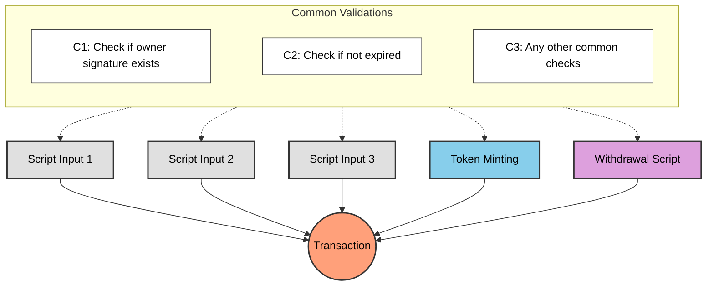
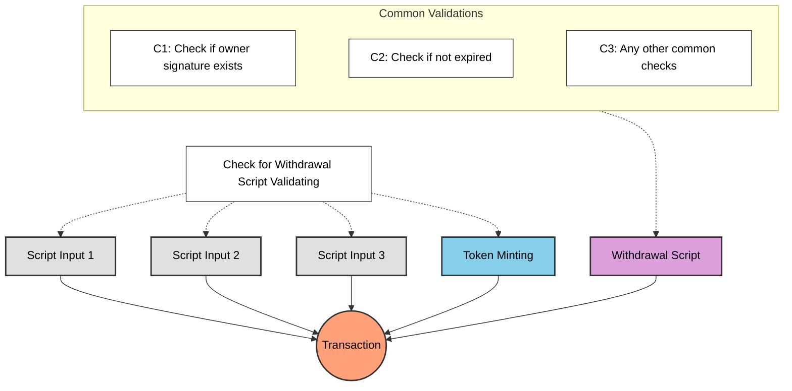

# Pelajaran #05: Menghindari Validasi Berlebihan

Pertanyaan umum dari pelajaran sebelumnya: mengapa menggunakan withdrawal script untuk minting dan pembaruan state alih-alih memvalidasi langsung di spending validator? Setiap UTXO yang dibelanjakan dari spending validator memicu validasi, jadi mengapa tidak menempatkan logikanya di sana?

> Source code: [GitHub](https://github.com/cardanobuilders/cardanobuilders.github.io/tree/main/codes/course-hello-cardano/05-avoid-redundant-validation)

## Transaksi dengan Validasi Script Ganda

Bayangkan transaksi kompleks yang melibatkan beberapa validasi script: mencetak token, membelanjakan beberapa script UTXO, dan menarik dana. Setiap aksi mungkin memerlukan pemeriksaannya sendiri.



Menerapkan pemeriksaan yang sama di setiap script menyebabkan validasi berlebihan: logika yang sama dieksekusi berkali-kali, meningkatkan biaya transaksi dan ukuran script.

## Bagaimana Cara yang Lebih Baik?

Pusatkan pemeriksaan umum di satu script yang dieksekusi sekali. Semua script lainnya mendelegasikan ke script tersebut, menghilangkan logika duplikat sambil mempertahankan semua validasi yang diperlukan.



Script `WithdrawalCheck` melakukan validasi umum sekali, memeriksa kondisi untuk semua script lain dalam transaksi.

## Contoh: Lanjutan dari Pelajaran 4

Asumsikan withdrawal script Pelajaran 4 berisi semua logika validasi umum. Alih-alih menduplikasi pemeriksaan tersebut di spending dan minting validator, delegasikan ke withdrawal script:

### Spending

```rs
use aiken/crypto.{ScriptHash}
use cardano/transaction.{OutputReference, Transaction}
use cocktail.{withdrawal_script_validated}

validator spending_logics_delegated(
  delegated_withdrawal_script_hash: ScriptHash,
) {
  spend(
    _datum_opt: Option<Data>,
    _redeemer: Data,
    _input: OutputReference,
    tx: Transaction,
  ) {
    withdrawal_script_validated(
      tx.withdrawals,
      delegated_withdrawal_script_hash,
    )
  }

  else(_) {
    fail @"unsupported purpose"
  }
}
```

### Minting

```rs
use aiken/crypto.{ScriptHash}
use cardano/assets.{PolicyId}
use cardano/transaction.{Transaction}
use cocktail.{withdrawal_script_validated}

validator minting_logics_delegated(
  delegated_withdrawal_script_hash: ScriptHash,
) {
  mint(_redeemer: Data, _policy_id: PolicyId, tx: Transaction) {
    withdrawal_script_validated(
      tx.withdrawals,
      delegated_withdrawal_script_hash,
    )
  }

  else(_) {
    fail @"unsupported purpose"
  }
}
```

## Mengapa mendelegasikan ke withdrawal script?

Mendelegasikan validasi ke withdrawal script adalah pola smart contract Cardano yang umum. Meskipun Anda bisa mendelegasikan ke spending atau minting validator, withdrawal script memiliki keunggulan tersendiri.

### Pemicu yang bersih

Validasi spending terpicu ketika UTXO dibelanjakan, dan validasi minting terpicu ketika token dicetak. Keduanya memerlukan aksi on-chain yang nyata. Sebaliknya, withdrawal script dapat dipicu dengan menarik 0 lovelace ([`trik withdraw 0`](https://aiken-lang.org/fundamentals/common-design-patterns#forwarding-validation--other-withdrawal-tricks)). Ini memicu validasi secara bersih tanpa mempengaruhi logika atau state transaksi.

## Penjelasan Sederhana

### Mengapa Menghindari Validasi Berlebihan?
Ketika beberapa script berpartisipasi dalam transaksi, mengulang pemeriksaan yang sama di setiap script membuang anggaran eksekusi dan meningkatkan biaya. Memusatkan pemeriksaan umum di satu script menjalankannya hanya sekali.

### Cara Kerja Delegasi
Withdrawal script bertindak sebagai validator pusat:

- **Spending Validator**: Memeriksa bahwa withdrawal script ada dalam transaksi
- **Minting Validator**: Juga memeriksa keberadaan withdrawal script
- **Withdrawal Script**: Menjalankan semua logika validasi bersama sekali

### Trik Withdraw-Zero
Withdrawal script dipicu melalui `trik withdraw 0`: menarik 0 lovelace mengaktifkan validasi tanpa mempengaruhi state transaksi. Pendekatan ini banyak diadopsi karena kesederhanaannya.

### Manfaat Utama
- **Efisiensi**: Pemeriksaan umum dieksekusi sekali alih-alih per-script
- **Biaya Lebih Rendah**: Anggaran eksekusi yang berkurang berarti biaya transaksi lebih rendah
- **Kemudahan Pemeliharaan**: Logika validasi berada di satu tempat

## Source code

Source code untuk pelajaran ini tersedia di [GitHub](https://github.com/cardanobuilders/cardanobuilders.github.io/tree/main/codes/course-hello-cardano/05-avoid-redundant-validation).
