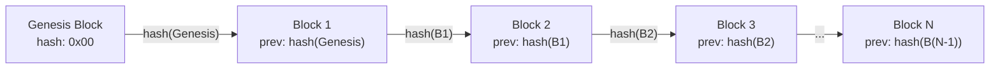
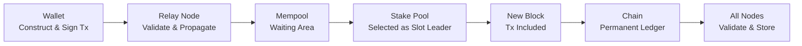

# レッスン #01: ブロックチェーンとは何か？

ブロックチェーンとは、中央管理者なしに複数の参加者が共有状態について合意できるようにする、分散型の追記専用データ構造です。暗号学的にリンクされたトランザクションのブロックをチェーン状に連結し、単一の当事者が制御できない不変の台帳を生成します。このレッスンでは、誇大宣伝を排除し、ブロックチェーンが実際に何であるのか、なぜ発明されたのか、そしてCardanoが開発者にとって重要な設計上の選択をどのように実装しているかについて、正確なメンタルモデルを構築します。

このレッスンを終える頃には、ブロックチェーンがなぜ存在するのか、従来のデータベースでは解決できないどのような問題を解決するのか、そして以降のすべてのレッスンの基礎となるアーキテクチャを理解できるようになります。

## ブロックチェーンはどのような問題を解決するのか？

ブロックチェーンは信頼問題を解決します。互いに信頼していない参加者が、単一の当事者が制御することなく、共有された真実の台帳について合意することを可能にします。従来のシステムは信頼を一つのエンティティ（銀行、プラットフォーム、サーバー運用者）に集中させており、その集中化が脆弱性を生み出します。

従来のWeb開発では、信頼は集中化されています。ユーザーがバンキングアプリを通じて送金する場合、送信者と受信者の両方が銀行が正直に残高を更新することを信頼しています。PostgreSQLデータベースにデータを保存する場合、アプリケーションはデータベースサーバーが改ざんされていないことを信頼しています。2つのサービスがREST APIを介して通信する場合、認証レイヤー（OAuth、JWT）がIDを検証することを信頼しています。

これはうまく機能しませんが、うまくいかなくなるまでの話です。集中型の信頼はいくつかの脆弱性をもたらします：

- **単一障害点**：銀行のサーバーがダウンすれば、トランザクションは発生しません。データベースが破損すれば、データは失われます。
- **単一の制御点**：システムを管理するエンティティは一方的にルールを変更できます。銀行はあなたの口座を凍結できます。プラットフォームはあなたのデータを削除できます。
- **単一の信頼点**：ユーザーは中央管理者が正直で、有能で、今後もそうあり続けることを信じなければなりません。

ブロックチェーンが答える根本的な問題は以下です：**互いに信頼していない参加者のグループが、単一の当事者が制御することなく、共有された真実の台帳について合意することは可能か？**

これは新しい問題ではありません。分散システムの研究者たちは「ビザンチン将軍問題」のような名前で何十年もこの問題を研究してきました。Bitcoin（そして後にCardano）が達成したのは、最初の実用的で大規模なソリューションでした。

## 台帳とは何か？

台帳とは、イベントやトランザクションを順番に記録し、すべての当事者が同じ一貫性のある永続的な情報を参照できるようにする、順序付けられたレコードのリストです。銀行の明細書は台帳です。在庫を追跡するスプレッドシートは台帳です。

有用な台帳の主要な特性は以下の通りです：

1. **順序付け**：イベントは順番に記録されます。トランザクションAはトランザクションBの前に発生しました。
2. **一貫性**：台帳を参照するすべての当事者が同じ情報を見ます。
3. **永続性**：一度記録されたエントリは失われません。

Web2システムでは、台帳は通常、タイムスタンプと自動インクリメントIDを持つデータベーステーブルです。単一のサーバー（またはプライマリ・レプリカクラスター）がそれを維持します。そのサーバーを運用する組織が真実の情報源です。

**分散型台帳**とは、一方的な制御権を持たない複数の独立した参加者によって維持される台帳です。すべての参加者が完全なコピーを保持し、何が追加されるかについて合意するプロトコルに従います。

## ブロックはどのようにトランザクションをバッチ処理するのか？

ブロックは、トランザクションを離散的な暗号学的に封印されたユニットにバッチ処理し、すべての参加者間の常時通信を必要とせずにネットワークが効率的に処理できるようにします。各ブロックには、ヘッダー（メタデータと前のブロックへのhashリンクを含む）とボディ（トランザクションを含む）があります。

ブロックは以下を含むデータ構造です：

```
Block {
  header: {
    block_number: 9821453
    timestamp: 2026-02-25T14:32:00Z
    previous_block_hash: "a4f2c8..."
    merkle_root: "7b3d1e..."      // すべてのトランザクションのフィンガープリント
    block_producer: "pool1abc..."  // このブロックを作成したステークプール
  }
  body: {
    transactions: [tx1, tx2, tx3, ... tx_n]
  }
}
```

各ブロックはヘッダー内で**前のブロックのhash**を参照します。これが「ブロックチェーン」の「チェーン」です。誰かがブロック100のトランザクションを改ざんすると、ブロック100のhashが変わり、ブロック101の参照が一致しなくなり、ブロック101が無効になり、以降同様に続きます。過去のブロックを改ざんすると、その時点からチェーン全体が壊れます。

これが**不変性**の源泉です。データの改変が物理的に不可能なのではなく、データの改変が即座に検出可能であり、後続のすべてのブロックを再作成する必要があるということです。コンセンサスのレッスンで見るように、これは計算的または経済的に実行不可能です。

## チェーンはどのようにブロックをリンクするのか？

チェーンは暗号学的なhash参照を通じてブロックをリンクします：各ブロックヘッダーには前のブロックのhashが含まれ、ジェネシスブロックから最新のブロックまで途切れることのないシーケンスを形成します。この構造により、台帳は追記専用で改ざんが明らかになります。



**ジェネシスブロック**は最初のブロックです。前のブロックを持ちません。Cardanoでは、ジェネシスブロックは2017年9月23日（Byronエラ）に作成されました。それ以降のすべてのブロックは、途切れることのないhash参照のチェーンを通じてジェネシスブロックにリンクしています。

この構造の主要な特性：

- **追記専用**：新しいブロックは末尾に追加されます。途中にブロックを挿入したり、ブロックを削除したりすることはありません。
- **改ざん検出可能**：任意のブロックへの変更は、hashを再計算することで即座に検出できます。
- **順序付け**：チェーンはすべての時間にわたるすべてのトランザクションの完全な順序を提供します。ブロック1000のトランザクションAは、ブロック1001のトランザクションBの前に確実に発生しました。

Cardanoのメインネットでは、約20秒ごとに新しいブロックが生成されます。各ブロックには数百のトランザクションが含まれます。2026年初頭の時点で、チェーンには数百万のブロックが含まれています。

## ブロックチェーンネットワークは誰が運営するのか？

ブロックチェーンは独立したノードオペレーターの分散型ネットワークによって運営されます。Cardanoでは、`cardano-node`ソフトウェアをインストールすることで誰でもノードを実行できます。登録不要、許可不要、そして誰が参加するかを決定する中央管理者もいません。

ノードには2つの役割があります：

1. **リレーノード**：ブロックとトランザクションをネットワーク全体に伝播します。新しいブロックが作成されると、すべての参加者がそれを受信できるようにします。
2. **ブロック生成ノード（ステークプール）**：コンセンサスプロトコル（Ouroboros、レッスン3で取り上げます）に従って新しいブロックを作成します。

2026年時点で、Cardanoには世界中の独立したエンティティによって運営される約3,000のアクティブなステークプールがあります。Cardanoを構築した企業であるInput Output Global（IOG）を含め、単一のエンティティがネットワークを制御することはありません。

**分散化はバイナリではなくスペクトラムです。** 3つのバリデーターを持つネットワークは1つのものよりも分散化されていますが、3,000を持つものよりは分散化されていません。Cardanoの設計は、報酬共有スキームを通じて分散化を具体的にインセンティブ化しています：単一のプールが大きくなりすぎると、デリゲーターが得る報酬が減り、自然とより多くのプールにステークを分散させることが促進されます。

### 開発者にとってなぜ分散化が重要なのか？

Web2開発者として、こう思うかもしれません：「分散化がすべてを遅く、複雑にするなら、なぜわざわざ？」

答えは、何を得られるかにあります：

- **検閲耐性**：有効なトランザクションの処理を単一のエンティティが妨げることはできません。
- **許可不要のデプロイ**：どのプラットフォームの承認もなしにスマートコントラクトをデプロイできます。
- **保証された実行**：デプロイされたスマートコントラクトは、書かれた通りに正確に実行されます。誰もそれを変更できません。
- **透明な状態**：すべての参加者が全履歴を検証できます。隠されたデータベースはありません。

これらの特性により、集中型インフラストラクチャでは単純に不可能なアプリケーションが可能になります：分散型金融（DeFi）、検証可能な資格情報、透明なガバナンスなどです。

## ブロックチェーンデータを不変にするものは何か？

3つのメカニズムが連携して不変性を実現します：暗号学的ハッシング（各ブロックが前のブロックのhashを含む）、分散レプリケーション（すべてのノードが完全なコピーを保持）、そしてコンセンサスプロトコル（履歴の書き換えを経済的に非合理にする）です。

不変性には深い意味があります：

- **間違いは永続的**：間違ったアドレスにADAを送信した場合、「取り消し」ボタンはありません。管理者がトランザクションを取り消すこともできません。
- **履歴は監査可能**：Cardanoで行われたすべてのトランザクションは公開検証可能です。トークンの作成からその動きを追跡できます。
- **データの保存は永遠**：チェーンに書き込まれたものは、ネットワークが存在する限り永続します。

開発者にとって、これは根本的な思考の転換を意味します。Web2では、定期的にレコードをUPDATEおよびDELETEします。ブロックチェーン開発では、INSERTのみです。修正は、履歴を変更するのではなく、古いものに取って代わる新しいトランザクションを追加することで行われます。

## ビザンチン障害耐性とは何か？

ビザンチン障害耐性（BFT）とは、一部の参加者が単にオフラインではなく、積極的に悪意を持っている場合でも、分散システムが正しく機能する能力です。この概念は、1982年にLeslie Lamport、Robert Shostak、Marshall Peaseが定式化したビザンチン将軍問題に由来します。

ブロックチェーンの用語では：

- **将軍** = ネットワーク内のノード
- **作戦計画** = チェーンに追加する次のブロック
- **裏切り者** = 不正なブロックを作成したりコンセンサスを妨害しようとする悪意のあるノード

CardanoのOuroborosプロトコルは、ステークの過半数（ADAで測定）が正直な参加者によって管理されている限り、BFTを提供します。具体的には、ステークされたADAの少なくとも51%が正直なアクターによって保持されている限り、プロトコルは安全です。ADAが価値を持ち、ステークプールオペレーターが正直であることへの経済的インセンティブを持っていることを考えると、この仮定はネットワークの開始以来維持されています。

これは、ほとんどのWeb2システムが提供するものよりも強力な保証です。従来の分散データベース（RaftやPaxosを使用）はクラッシュ障害には耐えますが、ビザンチン障害には耐えません。すべてのノードが正直だがオフラインになる可能性があると仮定しています。ブロックチェーンは、一部のノードが積極的に敵対的であると仮定しています。

## Cardanoのアーキテクチャの独自性とは？

Cardanoは機能を異なるレイヤーに分離し、独自の会計モデル、ネイティブトークンサポート、オンチェーンガバナンスを使用しています。これらの設計上の選択がCardanoを他のブロックチェーンと差別化し、アプリケーションの構築方法に直接影響します。

### レイヤードアーキテクチャ

Cardanoはその機能を2つのレイヤーに分離しています：

- **Cardano決済レイヤー（CSL）**：ADAトランザクションと会計を処理します。ここで価値の移転が行われます。
- **Cardano計算レイヤー（CCL）**：スマートコントラクトの実行（Plutusスクリプト）を処理します。ここにプログラマブルなロジックが存在します。

この分離により、各レイヤーが独立して進化でき、よりクリーンなセキュリティ特性が提供されます。

### 拡張UTXOモデル

Ethereumのアカウントベースモデルとは異なり、Cardanoは価値の追跡に**拡張UTXO（eUTXO）**モデルを使用しています。レッスン4のすべてをこれに充てますが、重要なポイントは：Cardanoはアカウント残高ではなく、個別の「コイン」（未使用トランザクション出力）を追跡するということです。これはアプリケーションの設計方法に大きな影響を与えます。

### ネイティブトークン

Cardanoでは、カスタムトークン（代替可能および非代替可能）は**ネイティブ**です。スマートコントラクト内部ではなく、ADAとともに決済レイヤー上に存在します。これにより、トークンは基本的な転送にスマートコントラクトの実行を必要とせずに、ADA自体のすべてのセキュリティ特性を継承します。

### ガバナンス

Cardanoは、ADA保有者がプロトコルの変更に投票するオンチェーンガバナンスに向けて移行しています。これはVoltaireエラの一部であり、Web2システムには存在しないレベルの分散型意思決定を表しています。

## Cardanoネットワークを通じてデータはどのように流れるのか？

Cardanoでトランザクションを送信すると、ウォレットからリレーノードを通過し、メンプールに入り、ステークプールによってブロックへの組み込みのために選択され、すべてのノードに伝播して検証と永続的な保存が行われます。プロセス全体は通常20〜60秒かかります。



ステップバイステップのプロセスは以下の通りです：

```
1. トランザクションを構築する（100 ADAをaddr_test1...に送信）
2. 秘密鍵で署名する
3. ウォレットがリレーノードに送信する
4. リレーノードがトランザクションを検証する：
   - 署名は有効か？
   - 入力（UTXO）は存在し、未使用か？
   - 手数料は十分か？
5. 有効であれば、リレーが他のリレーノードに伝播する
6. トランザクションは「メンプール」（待機エリア）に入る
7. ステークプールが次のブロックの生成に選出される
8. ステークプールがトランザクションを新しいブロックに含める
9. ブロックがすべてのノードに伝播される
10. 各ノードがブロックを検証し、チェーンに追加する
11. トランザクションは永続的な台帳の一部となる
```

送信からブロックへの組み込みまで、Cardanoでは通常20〜60秒かかります。さらにいくつかのブロックが追加された後、トランザクションは非常に高い信頼度でファイナルとみなされます。

## ブロックチェーンに関する一般的な誤解とは？

多くの初心者がブロックチェーンについて誤解を持っており、それが不適切な設計判断につながる可能性があります。以下は最も一般的な誤解と、その直接的な説明です。

**「ブロックチェーンはただのデータベースだ。」**
ブロックチェーンは、従来のデータベースがオーバーヘッドが増えるために意図的に避ける特性（分散化、不変性、許可不要のアクセス）を持つ、非常に特殊なタイプのデータ構造です。オペレーターを信頼する場合はデータベースを使用してください。信頼不要の調整が必要な場合はブロックチェーンを使用してください。

**「すべてをブロックチェーンに載せるべきだ。」**
ブロックチェーンのストレージは従来のストレージに比べて高価で低速です。検証可能で不変である必要があるものだけをオンチェーンに保存してください。それ以外はすべてオフチェーンストレージ（IPFS、従来のデータベース）を使用し、オンチェーンのhashをアンカーとして使用してください。

**「ブロックチェーンは匿名だ。」**
Cardano（Bitcoinと同様に）は匿名ではなく**仮名**です。トランザクションは公開されています。アドレスは可視です。アドレスは実際のIDに直接リンクされていませんが、使用パターンを分析できることが多いです。ブロックチェーンのトランザクションがプライベートだとは決して仮定しないでください。

## Web2との対比

ブロックチェーンの主要な概念を、Web2開発で既に知っているものにマッピングしましょう：

| ブロックチェーンの概念 | Web2の同等物 | 主な違い |
|---|---|---|
| **分散型台帳** | レプリケーションデータベース（PostgreSQLの読み取りレプリカ） | 単一のプライマリノードがない；すべてのノードが平等なピア |
| **ブロック** | データベースのトランザクションバッチ / WALセグメント | ブロックは暗号学的にリンクされ不変 |
| **hashのチェーン** | Gitのコミット履歴 | Gitはリベースやフォースプッシュを許可するが、ブロックチェーンは許可しない |
| **ノード** | アプリケーションサーバー | ノードは許可不要；誰でも実行可能 |
| **メンプール** | メッセージキュー（RabbitMQ、SQS） | メンプールは各ノードにローカル；順序通りの処理は保証されない |
| **コンセンサス** | リーダー選出（Raft/Paxos） | ブロックチェーンのコンセンサスは悪意のあるアクターを許容し、クラッシュだけでなく |
| **不変性** | 追記専用イベントログ（Kafka、イベントソーシング） | ブロックチェーンの不変性はすべての参加者にわたって暗号学的に強制される |
| **スマートコントラクト** | サーバーレス関数（AWS Lambda） | デプロイ後は誰も変更または削除できない |
| **ジェネシスブロック** | データベースマイグレーション #001 | 正確に1つだけ存在し、初期状態を定義する |

**Gitの対比は特に強力です。** ブロックチェーンを以下のようなGitリポジトリとして考えてください：
- すべてのコミットが親を参照する（ブロックが前のブロックを参照するように）
- 履歴は追記専用（フォースプッシュなし、リベースなし、スカッシュなし）
- すべての開発者が完全なクローンを持つ（分散レプリケーション）
- マージ（コンセンサス）は人間の判断ではなく、プロトコルによって自動的に行われる
- リポジトリは公開であり、誰でもクローンできる

## 主要なポイント

- **ブロックチェーンは分散型の追記専用台帳**であり、共有プロトコルに従って状態に合意する独立したノードのネットワークによって維持されます。
- **「チェーン」は暗号学的なhashリンクから来ています**：各ブロックが前のブロックのhashを含み、改ざんを検出可能かつ実行不可能にします。
- **分散化は単一障害点と制御点を排除**し、単一の当事者がシステムを検閲、改ざん、またはシャットダウンできないアプリケーションを可能にします。
- **不変性は制限ではなく機能です**：信頼できる仲介者を必要とせずに、監査可能性、予測可能性、信頼を提供します。
- **Cardano特有の特徴として**、レイヤードアーキテクチャ、拡張UTXOモデル、ネイティブトークンを使用しています。これらは他のブロックチェーンとの差別化要因であり、アプリケーションの構築方法に影響を与える設計上の選択です。

## 次のステップ

ブロックチェーンとは何か、なぜ存在するのかを理解したところで、次のレッスンではすべてを機能させる暗号学的ビルディングブロックを探求します。hash関数、Merkle木、デジタル署名は、私たちが議論した理論的な特性（不変性、改ざん検出、ID検証）を具体的で強制可能な保証に変える数学的基盤です。
