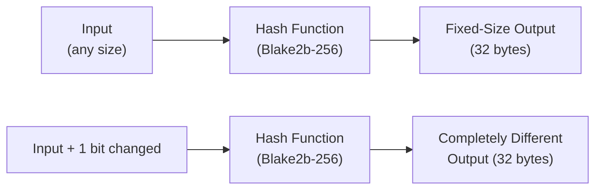
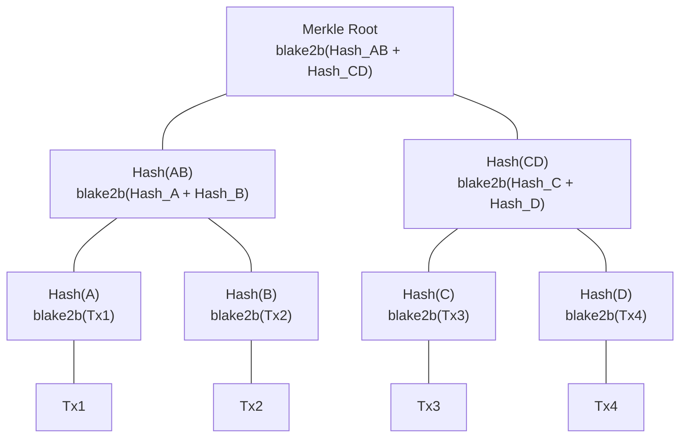
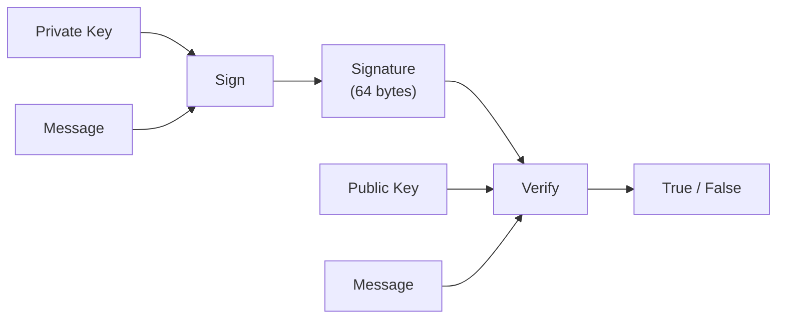

# レッスン #02: 暗号学的プリミティブ

暗号学的プリミティブとは、不正行為を計算的に実行不可能にする特別な特性を持つ数学関数であり、すべてのブロックチェーントランザクションのセキュリティ基盤を形成します。前のレッスンでは、不変性や改ざん検出といったブロックチェーンの特性について説明しました。このレッスンでは、それらの特性を強制する具体的なツール、すなわちhash関数、Merkle木、デジタル署名を明らかにします。

これらのプリミティブが何をするかだけでなく、なぜCardanoが特定のアルゴリズム（Blake2b、Ed25519）を選択したのか、そしてこれらの選択がパフォーマンス、セキュリティ、開発者体験にどのように影響するかを理解できるようになります。

## 暗号学的hash関数とは何か？

暗号学的hash関数は、任意のサイズの入力を受け取り、固定サイズの出力（「hash」または「ダイジェスト」）を生成します。同じ入力は常に同じ出力を生成しますが、入力のわずかな変更でも完全に異なるhashが生成されます。hash関数はブロックチェーンセキュリティの最も基本的なビルディングブロックです。



### 暗号学的hash関数が持つべき特性とは？

すべてのhash関数が暗号学的というわけではありません。暗号学的hash関数は以下の特性を満たす必要があります：

**1. 決定性**：同じ入力は常に同じ出力を生成します。
```
hash("Hello, Cardano") = "8a3b2c..." (常に、毎回、すべてのコンピュータで)
```

**2. 固定出力サイズ**：入力サイズに関係なく、出力長は一定です。
```
hash("a")                    = "4a3b2c..." (32バイト)
hash("entire works of Shakespeare") = "7f2d1e..." (32バイト)
```

**3. 原像耐性**：hash出力から元の入力を見つけることは計算的に実行不可能です。hashを「逆算」することはできません。
```
与えられた: "8a3b2c..."
見つける:  ??? ただし hash(???) = "8a3b2c..."
これには約2^256回の推測が必要です（宇宙の原子数より多い）。
```

**4. 第二原像耐性**：入力とそのhashが与えられた場合、同じhashを生成する別の入力を見つけることは実行不可能です。
```
与えられた: "Hello, Cardano" -> "8a3b2c..."
見つける:  some_other_input ただし hash(some_other_input) = "8a3b2c..."
これは計算的に実行不可能であるべきです。
```

**5. 衝突耐性**：同じhashを生成する2つの異なる入力を見つけることは実行不可能です。
```
見つける: input_A と input_B ただし input_A != input_B
         かつ hash(input_A) = hash(input_B)
これには約2^128回の操作が必要です（誕生日バウンド）。
```

**6. アバランシェ効果**：入力のわずかな変更が、大幅に異なる出力を生成します。
```
hash("Hello, Cardano")  = "8a3b2c4d..."
hash("Hello, cardano")  = "f17e9a2b..."  (完全に異なる！)
```

### なぜCardanoはSHA-256ではなくBlake2bを使用するのか？

**SHA-256**（Secure Hash Algorithm、256ビット）はBitcoinが使用するhash関数です。NSAが設計し、NISTが標準化しました。256ビット（32バイト）のダイジェストを生成し、非常によく研究されています。

**Blake2b**は、Cardanoが広く使用するより新しいhash関数です。Jean-Philippe Aumassonらが、SHA-3コンペティションのファイナリストであるBLAKE hash関数に基づいて設計しました。Cardanoは、ほとんどのハッシングニーズにBlake2b-256（256ビット出力）を、アドレス生成にBlake2b-224（224ビット出力）を使用しています。

| 特性 | SHA-256 | Blake2b-256 |
|---|---|---|
| **速度** | ソフトウェアでは低速 | ソフトウェアで2〜3倍高速 |
| **セキュリティマージン** | 十分に確立されている | 同等のセキュリティ、ChaChaストリーム暗号に基づく |
| **並列性** | 逐次的な内部構造 | 並列処理向けに設計 |
| **柔軟性** | 固定構成 | 可変出力長、キー付きハッシング、パーソナライゼーション |
| **ハードウェア最適化** | 専用ASICで効率的 | 汎用CPUで効率的 |

Blake2bの速度の利点は重要です。ハッシングはブロックチェーンの操作（ブロックの検証、トランザクションの検証、アドレスの計算）で常に発生するためです。より高速なハッシングはより高速な検証を意味し、それはより高いスループットを意味します。

### Cardanoはどこでハッシングを使用するのか？

hash関数はCardanoのアーキテクチャのあらゆる場所に登場します：

1. **ブロックヘッダーのハッシング**：各ブロックヘッダーがハッシュされ、結果のダイジェストが次のブロックのヘッダーに含まれます。これがチェーンを作ります。

2. **トランザクションID**：Cardano上のすべてのトランザクションは、シリアライズされたコンテンツのhashによって識別されます。トランザクションID（TxId）はBlake2b-256 hashです。

3. **アドレス生成**：Cardanoのアドレスは、公開鍵をBlake2b-224でハッシュし、その結果をエンコードして導出されます。

4. **スクリプトのハッシング**：スマートコントラクトスクリプト（Plutusバリデーター）は、コンパイルされたコードのhashで識別されます。このhashがスクリプトアドレスになります。

5. **Datumのハッシング**：UTXOに添付されたデータは、オンチェーンスペースを節約するためにhash（Datum hash）として保存できます。

6. **ポリシーID**：ネイティブトークンのミンティングポリシーは、ポリシースクリプトのhashによって識別されます。

```
Transaction                    Block Header
+-----------+                  +--------------------+
| inputs    |                  | block_number       |
| outputs   |  hash(tx) ->     | previous_hash      |
| fee       |  TxId            | merkle_root        |
| metadata  |                  | slot_leader        |
+-----------+                  +--------------------+
                                        |
                               hash(header) -> 次のブロックに含まれる
```

## Merkle木はどのように効率的な検証を可能にするのか？

Merkle木は、トランザクションのhashを二分木構造に整理します。各リーフにはトランザクションのhashが含まれ、各内部ノードには2つの子のhashが含まれ、ルート（ブロックヘッダーに格納）はすべてのトランザクションを単一の32バイトのフィンガープリントで表します。この構造により、対数時間でのメンバーシップ証明が可能になります。



### Merkle木はどのように構築されるのか？

ブロックに4つのトランザクション（Tx1、Tx2、Tx3、Tx4）が含まれているとします。

構築プロセス：

```
ステップ1: 各トランザクションを個別にハッシュする
  Hash(A) = blake2b(Tx1)
  Hash(B) = blake2b(Tx2)
  Hash(C) = blake2b(Tx3)
  Hash(D) = blake2b(Tx4)

ステップ2: hashのペアを結合してハッシュする
  Hash(AB) = blake2b(Hash(A) + Hash(B))
  Hash(CD) = blake2b(Hash(C) + Hash(D))

ステップ3: ペアのペアをハッシュする
  Merkle Root = blake2b(Hash(AB) + Hash(CD))
```

**Merkle Root**は、ブロック内のすべてのトランザクションを表す単一のhashです。ブロックヘッダーに格納されます。

### なぜMerkle木が重要なのか？

**効率的な検証**：Tx3がブロックに含まれていることを証明するために、すべてのトランザクションをダウンロードする必要はありません。必要なのは以下だけです：

```
Tx3がブロックに含まれていることの証明：
  - Hash(D)   (Tx3のhashの兄弟)
  - Hash(AB)  (Hash(CD)の兄弟)

検証：
  1. Hash(C) = blake2b(Tx3) を計算
  2. Hash(CD) = blake2b(Hash(C) + Hash(D)) を計算
  3. Root = blake2b(Hash(AB) + Hash(CD)) を計算
  4. 計算されたRootをブロックヘッダーのMerkle Rootと比較
```

これは**Merkle証明**（またはMerkle包含証明）と呼ばれます。N個のトランザクションを持つブロックでは、メンバーシップを検証するのにlog2(N)個のhashだけが必要です。1,000トランザクションを持つブロックでは、1,000個すべてではなく約10個のhashだけが必要です。

**改ざん検出**：単一のトランザクションが変更されると、そのhashが変わり、親のhashが変わり、Merkle Rootまで伝播します。ブロックヘッダーのルートが一致しなくなり、即座に改ざんが明らかになります。

**ライトクライアントのサポート**：Merkle証明により、完全なブロックチェーンを保存しない軽量ウォレットが可能になります。ライトウォレットは、すべてのブロックのすべてのトランザクションをダウンロードすることなく、特定のトランザクションの存在を検証できます。ブロックヘッダーとMerkle証明パスだけが必要です。

### CardanoはMerkle木をどのように使用するのか？

CardanoはいくつかのコンテキストでMerkle木を使用しています：

- **トランザクション検証**：各ブロックヘッダーのトランザクションMerkle Rootにより、トランザクションの包含を効率的に検証できます。
- **ステーク分布のスナップショット**：Merkle木は、エポック境界でのすべてのアドレスにわたるステークの分布を効率的に表現します。
- **スクリプトデータ**：Merkle木は、ルートのみをオンチェーンに保存し、個々の要素のオフチェーン証明を提供しながら、大規模なデータセットにコミットできます。

## デジタル署名はどのようにIDを証明するのか？

デジタル署名スキームにより、秘密鍵でメッセージに署名し、対応する公開鍵を使って誰でもその署名を検証できます。デジタル署名は3つの保証を提供します：認証（署名はメッセージ作成者が秘密鍵を保持していたことを証明）、完全性（いかなる変更も署名を無効にする）、否認不可能性（署名者は署名したことを否定できない）です。



### デジタル署名は概念的にどのように機能するのか？

デジタル署名スキームには3つの操作があります：

```
鍵生成:
  (private_key, public_key) = generate_keypair()
  // private_key: 秘密に保持、署名に使用
  // public_key: 公開で共有、検証に使用

署名:
  signature = sign(message, private_key)
  // private_keyを持つ者だけがこれを生成できる

検証:
  is_valid = verify(message, signature, public_key)
  // public_keyを持つ者は誰でも検証可能
  // 署名が本物であればtrueを返す
```

鍵間の数学的関係により以下が保証されます：
- 秘密鍵を持つ者だけが有効な署名を生成できる
- 公開鍵は秘密鍵を明かすことなく署名を検証できる
- 署名は特定のメッセージに紐づいている；別のメッセージに転用することはできない

### なぜCardanoはEd25519を使用するのか？

Cardanoは**Ed25519**を使用しています。これはCurve25519を使用したEdwards曲線デジタル署名アルゴリズム（EdDSA）の実装です。Daniel J. Bernsteinらが明確なパフォーマンスとセキュリティの目標を持ってEd25519を設計しました。

| 特性 | Ed25519 | ECDSA（Bitcoin/Ethereumで使用） |
|---|---|---|
| **鍵サイズ** | 32バイト（秘密鍵）、32バイト（公開鍵） | 32バイト（秘密鍵）、33バイト（圧縮公開鍵） |
| **署名サイズ** | 64バイト | 約72バイト（DERエンコード） |
| **速度** | 署名と検証が非常に高速 | より低速 |
| **決定性** | はい（同じメッセージ + 鍵 = 同じ署名） | ランダムなnonceが必要（多くのバグの原因） |
| **サイドチャネル耐性** | タイミング攻撃に対する耐性を考慮して設計 | 不注意な実装では脆弱 |
| **バッチ検証** | 効率的なバッチ検証が可能 | ネイティブでは非対応 |

Ed25519の決定的な署名は重要なセキュリティ上の利点です。ECDSA（BitcoinとEthereumで使用）では、署名に乱数（nonce）が必要です。乱数生成器に欠陥がある場合、署名から秘密鍵を抽出できてしまいます。これは実際の鍵漏洩を引き起こしてきました。Ed25519は、nonceをメッセージと秘密鍵から決定的に導出することで、この種の脆弱性全体を排除します。

### Cardanoのトランザクションで署名はどのように機能するのか？

すべてのCardanoトランザクションは、使用される入力を制御する秘密鍵によって署名される必要があります。概念的なフローは以下の通りです：

```
1. トランザクションボディを構築する：
   TransactionBody {
     inputs:  [utxo_1, utxo_2]
     outputs: [output_to_recipient, change_output]
     fee:     200000 lovelace
   }

2. トランザクションボディをシリアライズしてハッシュする：
   tx_body_hash = blake2b_256(serialize(transaction_body))

3. 各必要な秘密鍵でhashに署名する：
   signature_1 = ed25519_sign(tx_body_hash, private_key_1)
   signature_2 = ed25519_sign(tx_body_hash, private_key_2)

4. 完全なトランザクションを組み立てる：
   Transaction {
     body:       transaction_body
     witnesses:  [
       (public_key_1, signature_1),
       (public_key_2, signature_2)
     ]
   }

5. ネットワークに送信する。各ノードが検証する：
   - ed25519_verify(tx_body_hash, signature_1, public_key_1) == true
   - ed25519_verify(tx_body_hash, signature_2, public_key_2) == true
   - public_key_1がutxo_1を制御するアドレスに対応する
   - public_key_2がutxo_2を制御するアドレスに対応する
```

署名されるのは、生のトランザクションではなく**トランザクションボディのhash**であることに注意してください。これはより効率的（32バイトのhashへの署名は、潜在的に大きなトランザクションボディへの署名より高速）であり、hashの衝突耐性を通じてすべてのトランザクションデータがカバーされることを保証します。

### マルチシグネチャトランザクションはどのように機能するのか？

Cardanoは複数の署名を必要とするトランザクションをネイティブにサポートしています。これは以下にとって不可欠です：

- **共有ウォレット**：複数の当事者の承認を必要とする資金
- **マルチアセットトランザクション**：異なるアドレスが制御するUTXOを使用するトランザクション
- **スクリプト検証**：鍵署名とスクリプト実行の両方が必要な場合

一部のブロックチェーンではマルチシグネチャにスマートコントラクトが必要ですが、Cardanoはプロトコルレベルでこれを処理します。トランザクションには単純に複数のウィットネスエントリが含まれ、ノードがそれらすべてを検証します。

## これらのプリミティブはどのように組み合わされてセキュリティを実現するのか？

hash関数、Merkle木、デジタル署名が連携することで真の力が発揮されます。各プリミティブは特定の保証を提供し、それらの組み合わせが層状に強化されたセキュリティを生み出し、実用的な攻撃を実行不可能にします。

```
ステップ1: ユーザーが50 ADAを使用するトランザクションを作成
  - トランザクションボディが入力、出力、手数料を指定
  - ボディがハッシュされる: tx_hash = blake2b_256(tx_body)
  - hashが署名される: sig = ed25519_sign(tx_hash, private_key)
  -> 保証: トランザクションの真正性と完全性

ステップ2: トランザクションがブロックに入る
  - ブロック生成者が有効なトランザクションを収集
  - トランザクションのhashがMerkle木のリーフを形成
  - Merkle Rootがブロックヘッダーに入る
  -> 保証: 効率的な検証、任意のトランザクションの改ざん検出

ステップ3: ブロックがチェーンに追加される
  - ブロックヘッダーがハッシュされる: block_hash = blake2b_256(header)
  - 次のブロックがヘッダーでこのhashを参照
  -> 保証: チェーン全体にわたる不変性と改ざん検出

ステップ4: チェーンが成長する
  - 新しいブロックが追加されるたびに、以前のすべてのブロックの保証が強化される
  - 過去のトランザクションを改ざんするには、攻撃者は以下が必要：
    a) トランザクションに再署名（秘密鍵が必要）
    b) そのブロックのMerkle Rootを再計算
    c) ブロックのhashを再計算
    d) 後続のすべてのブロックのhashを再計算
    e) これらすべてをネットワークの残りが新しいブロックを追加するより速く行う
  -> 組み合わせの効果: 実用的な不変性
```

この層状の防御が、ブロックチェーンが安全であるとみなされる理由です。単一のプリミティブだけでは不十分です。hash関数は完全性とバインディングを提供します。Merkle木は効率性と構造を提供します。デジタル署名は認証と認可を提供します。これらが合わさることで、不正のコストが得られる利益を超えるシステムが生まれます。

## 検証可能乱数関数（VRF）とは何か？

検証可能乱数関数（VRF）は、デジタル署名と乱数生成器を組み合わせたものです：秘密鍵と入力が与えられると、秘密鍵なしでは予測不可能なランダム出力と、公開鍵を持つ者が検証可能な証明を生成します。CardanoのOuroborosプロトコルは、どのステークプールが各ブロックを生成するかを決定するためにVRFを使用しています。

VRFは以下を生成します：
1. 秘密鍵なしでは予測不可能な**ランダム出力**
2. 出力が正しく生成されたことの**証明**

Ouroborosでは、VRFがどのステークプールが各ブロックを生成する権利を得るかを決定します。スロット番号が入力、プールのVRF鍵が秘密鍵、出力がそのプールがブロック生成権を「獲得」するかどうかを決定します。これにより、ブロック生成者の選択がランダム（予測不可能）かつ検証可能（証明可能）になり、誰が次のブロックを追加するかを操作することが防止されます。

レッスン3でコンセンサスメカニズムを取り上げる際に、これをより詳しく探求します。

## ハッシングはどのようにオフチェーンデータを保護するのか？

Cardano開発における一般的なパターンは、大きなデータのhashをオンチェーンに保存し、完全なデータはオフチェーンに保持するものです。これにより、ブロックチェーンを肥大化させることなく検証可能性が提供されます：誰でもオフチェーンデータをダウンロードし、オンチェーンのhashと一致することを確認できます。

```
オフチェーン:                      オンチェーン:
+-------------------+            +---------------------------+
| 大きなドキュメント    |            | トランザクションメタデータ:     |
| (PDF, JSON等)     |  hash ->   |   document_hash: "7f2d..."  |
| IPFSに保存         |            |   ipfs_cid: "Qm..."      |
+-------------------+            +---------------------------+

誰でも検証可能:
  blake2b_256(downloaded_document) == on_chain_hash
  一致すれば、ドキュメントは本物で未変更です。
```

このパターンは以下に使用されます：
- **NFTメタデータ**：実際の画像やメディアファイルはオフチェーン（多くの場合IPFS上）に保存されますが、そのhashはオンチェーンにコミットされます。
- **ガバナンス提案**：完全な提案テキストはオフチェーンに存在し、hashがチェーンにアンカーされます。
- **監査証跡**：hashのシーケンスにより、オフチェーンイベントの順序と完全性を証明できます。
- **CIP-25 / CIP-68トークン標準**：メタデータのhashがトークンアセットとどのように関連するかを定義します。

## Web2との対比

このレッスンのすべての暗号学的プリミティブにはWeb2の対応物があります。違いはスコープと保証にあります。

| ブロックチェーンプリミティブ | Web2の同等物 | 主な違い |
|---|---|---|
| **Blake2bハッシング** | パスワード保存のbcrypt/argon2 | ブロックチェーンのハッシングは秘密性ではなく完全性のため。パスワードは遅いhashが必要；ブロックチェーンは速いhashが必要 |
| **トランザクションID（hash）** | コンテンツアドレス可能ストレージ（GitコミットSHA） | 同じ概念：コンテンツがIDを決定する |
| **Merkle木** | BitTorrentのhash木 / Gitツリーオブジェクト | ブロックチェーンのMerkle木はコンセンサスにとって重要で公開検証可能 |
| **Merkle証明** | 証明書透明性ログ（CTログ） | どちらもデータセット全体を明かさずに包含を証明 |
| **Ed25519署名** | JWT RS256/ES256署名 | JWTはサーバーが検証するクレームに署名；ブロックチェーンはネットワーク全体が検証するトランザクションに署名 |
| **VRF** | サーバーサイドの乱数生成 | VRFは誰でも検証可能；`Math.random()`は不可能 |
| **オフチェーンデータのhash** | ETag / Content-MD5 HTTPヘッダー | 同じ完全性の概念だが、ブロックチェーンのhashは永続的でグローバルに検証可能 |

**JWTの対比は特に教育的です。** JWTを作成するとき：
1. ペイロード（ユーザーに関するクレーム）を取得する
2. 秘密鍵で署名する（RS256、ES256など）
3. 公開鍵を持つ者は誰でも署名を検証できる
4. ペイロードの変更で署名が無効になる

Cardanoのトランザクションもまったく同じパターンに従います：
1. ペイロード（トランザクションボディ）を取得する
2. 秘密鍵で署名する（Ed25519）
3. 公開鍵を持つ者（任意のノード）は誰でも署名を検証できる
4. トランザクションボディの変更で署名が無効になる

違いは、JWTの検証はあなたが制御する単一のサーバーで行われるのに対し、Cardanoの署名検証は世界中の数千の独立したノードで行われることです。

**コンテンツチェックサム**もまた馴染みのある概念です。ファイルをダウンロードしてそのSHA-256チェックサムを検証するとき、Cardanoのノードがトランザクションのhashを検証するときとまったく同じことをしています。原理は同じで、スケールと信頼モデルが異なります。

## 主要なポイント

- **hash関数**（CardanoではBlake2b）はデータの一意の固定サイズのフィンガープリントを生成します。完全性検証、トランザクションID、アドレス、チェーン構造そのものの基盤です。
- **Merkle木**はhashを階層構造に整理し、ブロック内の個別トランザクションの効率的な対数時間検証を可能にし、ライトクライアントにとって不可欠です。
- **デジタル署名**（CardanoではEd25519）は、トランザクションが対応する秘密鍵の保持者によって承認されたことを証明し、認証、完全性、否認不可能性を提供します。
- **これらのプリミティブが組み合わさって**層状のセキュリティを生み出します：署名がトランザクションを承認し、Merkle木がそれらをブロックに整理し、hashチェーンがブロックを不変の履歴にリンクします。
- **CardanoがBlake2bとEd25519を選択したのは**、パフォーマンス、セキュリティ、決定性のためであり、トランザクションスループットと開発者体験に影響する選択です。

## 次のステップ

hash関数、Merkle木、デジタル署名をツールキットに加えた今、個別のブロックとトランザクションの数学的セキュリティ保証を理解しました。しかし、次にどのブロックを追加するかは誰が決めるのでしょうか？数千の独立したノードがどのように同じチェーンに合意するのでしょうか？レッスン3では、コンセンサスメカニズム、つまりネットワーク全体を調整するプロトコルレベルのルールに取り組み、CardanoのOuroborosプロトコルを詳しく見ていきます。
