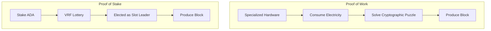
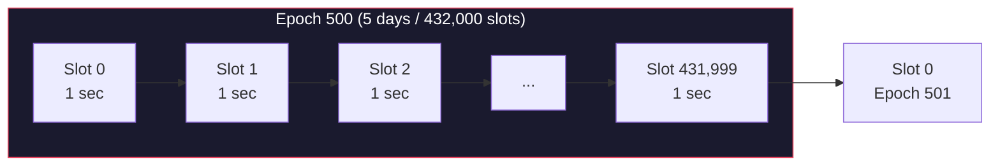
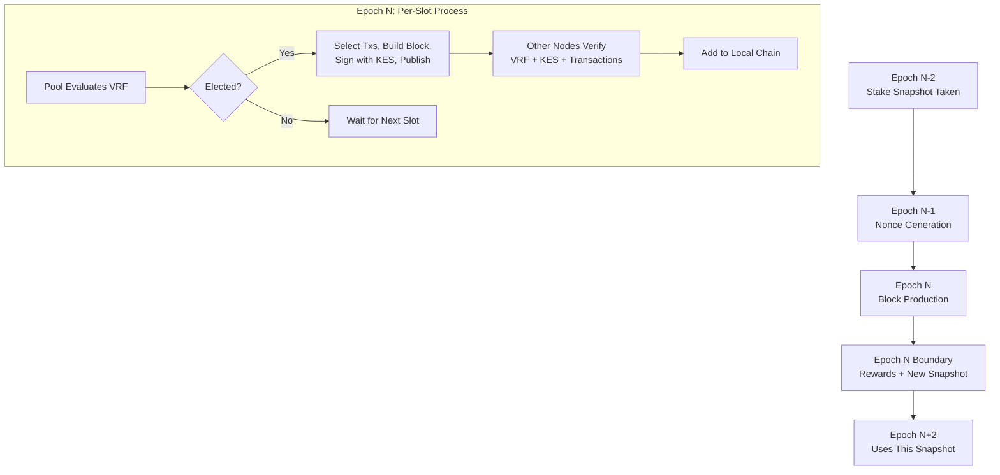

# レッスン #03: コンセンサスメカニズム

コンセンサスメカニズムとは、中央コーディネーターなしに数千の独立したノードが単一の正規チェーンに合意できるようにする、プロトコルレベルのルールセットです。ブロックチェーンが分散型台帳であること、暗号学的プリミティブが個別のトランザクションとブロックを保護することを確立しました。このレッスンでは、残された重要な問題に答えます：複数のノードが同時にそれぞれ異なるブロックを提案した場合、ネットワークはどのブロックをチェーンの一部にするかをどのように決定するのでしょうか？

コンセンサスの仕組みを調べ、2つの主要なアプローチ（Proof of WorkとProof of Stake）を比較し、初めて証明可能な安全性を持つProof of StakeシステムであるCardanoのOuroborosプロトコルを詳しく見ていきます。

## なぜ分散システムでのコンセンサスは難しいのか？

コンセンサスが難しいのは、分散ノードが保留中のトランザクションについて異なるビューを持ち、ネットワーク遅延に直面し、オフラインになる可能性があり、一部は悪意を持って行動する可能性がありながらも、中央コーディネーターなしに全員が単一の真実に合意しなければならないためです。集中型システムでは、1つのサーバーが決定し、全員がそれを受け入れます。その権限がなければ、問題は本質的になります。

以下のシナリオを考えてみてください：

```
時刻: スロット 7,241,000

ノードA（東京）がトランザクション [T1, T2, T3] を受信
ノードB（ニューヨーク）がトランザクション [T2, T4, T5] を受信
ノードC（ベルリン）がトランザクション [T1, T4, T6] を受信

各ノードは保留中のトランザクションについて異なるビューを持っています。
どのトランザクションが次のブロックに入るのか？
誰が決めるのか？
ノードBが悪意を持ってT5を偽造していたらどうなるか？
```

ネットワークは以下について合意する必要があります：
1. 次のブロックを**誰が**生成するか
2. そのブロックに**何の**トランザクションが入るか
3. ブロックが**いつ**最終的（取り消し不可能）とみなされるか

そして、以下にもかかわらずこれを行わなければなりません：
- ネットワーク遅延（メッセージのグローバルな伝播に時間がかかる）
- ノード障害（一部のノードがオフラインの可能性がある）
- 悪意のあるアクター（一部のノードが意図的にネットワークを妨害しようとする可能性がある）
- 中央コーディネーターの不在

## Proof of Work（PoW）はどのようにコンセンサスを達成するのか？

Proof of Workは、ブロック生成者がブロックを追加する前に計算的に高価な暗号学的パズルを解くことを要求することでコンセンサスを達成します。有効な解を最初に見つけたマイナーが次のブロックの生成権を「獲得」し、計算コストが攻撃を経済的に非合理にします。

### PoWの仕組み

PoWでは、ブロックを作成するには、ブロックヘッダーのhashが目標しきい値を下回るような値（**nonce**と呼ばれる）を見つける必要があります。

```
以下を満たすnonceを見つける：
  hash(block_header + nonce) < target

例（簡略化）：
  target = 0000000000FFFFFFFFFFFFFFFFFFFF...

  nonce = 0 を試す: hash = "7a4f2c..." -- 高すぎる
  nonce = 1 を試す: hash = "b31e8a..." -- 高すぎる
  nonce = 2 を試す: hash = "1d7f3b..." -- 高すぎる
  ...
  nonce = 8,294,712 を試す: hash = "0000000000a3f..." -- 目標以下！
```

このプロセスは**マイニング**と呼ばれます。膨大な計算努力（何兆回ものhash試行）が必要ですが、検証は瞬時です（1回のhash計算で目標以下かどうかを確認）。難易度はネットワーク全体で約10分ごと（Bitcoinの場合）に解が見つかるように調整されます。

### PoWの長所と短所は？

**セキュリティモデル**：PoWを攻撃するには、ネットワークの残りを合わせたものを超える計算能力（「51%攻撃」）が必要です。確立されたチェーンに対してそれだけのハードウェアと電力を集めるコストは、攻撃を経済的に非合理にします。

**エネルギー消費**：PoWは意図的に浪費的です。セキュリティ予算は消費される電力そのものです。Bitcoinの年間エネルギー消費量は中規模の国に匹敵します。これはバグではなく、信頼不要のセキュリティのコストです。しかし、重大な欠点です。

**ハードウェアの集中化**：PoWは特殊なハードウェア（ASIC）に報酬を与えます。これにより、安価な電力がある地域やマイニングハードウェアの製造元付近にマイニングが集中し、分散化の目標を損なう可能性があります。

**ファイナリティ**：PoWは**確率的ファイナリティ**を提供します。トランザクションは数学的に「最終」にはなりません。上にブロックが追加されるにつれて、取り消される可能性が指数関数的に小さくなるだけです。Bitcoinの慣例では6ブロック確認（約60分）を「十分に安全」とみなします。

## Proof of Stake（PoS）はProof of Workとどう違うのか？

Proof of Stakeは計算作業を経済的コミットメントに置き換えます：電力を消費したことを証明する代わりに、ネットワークのネイティブ通貨を保有（しステークした）ことを証明します。ブロック生成権はステークした暗号通貨の量に比例し、セキュリティモデルを「攻撃には電力がかかる」から「攻撃にはお金がかかる」に変えます。



すべてのステークされたトークンの1%を保有している場合、ブロックの約1%を生成します。

セキュリティモデルが「攻撃には電力がかかる」から「攻撃にはお金がかかる」に移行します。ネットワークを制御するには、攻撃者はステークされたトークンの過半数を取得する必要があります。それだけのトークンを購入すると価格が大幅に上昇し、ネットワークを攻撃すると保有するトークンの価値が暴落します。PoSシステムへの攻撃は経済的に自滅的です。

### PoW vs PoSの比較

| 特性 | Proof of Work (Bitcoin) | Proof of Stake (Cardano) |
|---|---|---|
| **消費されるリソース** | 電力 + ハードウェア | ステークされた暗号通貨 |
| **ブロック生成者の選出** | パズルを最初に解いた者 | プロトコルがステークに基づいて選出 |
| **エネルギー効率** | 非常に低い（意図的に） | 非常に高い（99.9%以上の削減） |
| **ハードウェア要件** | 専用ASIC | 標準的なサーバーハードウェア |
| **参入障壁** | 高い（高価なハードウェア） | 低い（ADAをステーク、委任） |
| **攻撃コスト** | hash能力の51% | ステークされたADAの51% |
| **ファイナリティ** | 確率的（約60分） | 確率的（Cardanoでは約5〜10分） |
| **分散化の圧力** | 安い電力に向かって集中化 | Cardanoの設計は分散化をインセンティブ化 |

## CardanoのOuroborosプロトコルとは何か？

OuroborosはCardanoのコンセンサスプロトコルであり、厳密な査読済みのセキュリティ証明を持つ最初のProof of Stakeプロトコルです。CRYPTO 2017でAggelos Kiayias、Alexander Russell、Bernardo David、Roman Oliynykovにより発表され、時間をエポックとスロットに分割し、プライベートなスロットリーダー選出にVRFを使用し、正直な参加者がステークされたADAの過半数を制御しているという仮定の下で証明可能なセキュリティ保証を提供します。

「Ouroboros」という名前は、自らの尾を食べる蛇の古代のシンボルに由来し、プロトコルの周期的な性質を表しています。

### Ouroborosはどのように進化してきたか？

Ouroborosは単一のプロトコルではなく、ファミリーです：

| バージョン | エラ | 主な革新 |
|---|---|---|
| **Ouroboros Classic** | 研究段階 | 最初の証明可能な安全性を持つPoS；同期クロックを仮定 |
| **Ouroboros BFT** | Byronリスタート | Byron-Shelley移行のための簡略化されたBFTバリアント |
| **Ouroboros Praos** | Shelley（現在） | プライベートリーダー選出のためのVRFを追加；半同期ネットワークモデル |
| **Ouroboros Genesis** | 開発中 | ジェネシスからの安全なブートストラップを実現；信頼できるチェックポイント不要 |
| **Ouroboros Leios** | 研究段階 | 大幅にスループットを向上させるインプットエンドーサー |

現在のCardanoメインネットは**Ouroboros Praos**を実行しています。このレッスンの残りはPraosに焦点を当てます。

### Ouroborosでエポックとスロットはどのように時間を構造化するのか？

Ouroborosは時間を階層構造に分割します：**スロット**（各1秒）が**エポック**（432,000スロット、正確に5日間）にグループ化されます。エポックはステークスナップショット、報酬分配、プロトコルパラメータの変更、プール登録の管理境界として機能します。



**スロット**：最小の時間単位です。Cardanoでは、各スロットは**1秒**です。スロットにブロックが含まれる場合も含まれない場合もあります。すべてのスロットでブロックが生成されるわけではなく、目標は約20秒ごとに1ブロックです。

**エポック**：432,000スロットの集合で、正確に**5日間**続きます。エポックは多くのプロトコル操作の管理境界です：
- エポック境界でステークスナップショットが取得される
- 報酬はエポックごとに計算・分配される
- プロトコルパラメータの変更はエポック境界で有効になる
- ステークプールの登録と廃止はエポック境界で有効になる

### スロットリーダー選出はどのように機能するのか？

各スロットについて、プロトコルは検証可能乱数関数（レッスン2のVRF）を使用して**スロットリーダー**が存在するかどうか、そしてそれが誰かを決定します。各ステークプールがローカルでVRFを評価します。結果は、プールがVRF証明付きのブロックを公開するまでプライベートです。

各ステークプールオペレーターはVRF鍵を持っています。各スロットについて、プールはVRF関数を実行します：

```
エポックEのスロットSについて：
  (vrf_output, vrf_proof) = VRF_eval(pool_vrf_key, epoch_nonce + slot_number)

  threshold = calculate_threshold(pool_stake / total_stake)

  if vrf_output < threshold:
    このプールはスロットSのスロットリーダーです
    // プールはブロックを生成できる（そしてすべき）
  else:
    このプールはスロットSのスロットリーダーではありません
    // このスロットでは何もしない
```

この選出の重要な特性：

**プライベート**：プールはスロットに当選したことを知っていますが、プールがVRF証明付きのブロックを公開するまで他の誰も知りません。これにより、次のリーダーに対する標的型攻撃が防止されます。

**比例的**：しきい値はプールの相対的なステークに基づいて調整されます。ステークの1%を持つプールは、スロットの約1%で選出されます。

**検証可能**：ブロックが公開されると、VRF証明により、プールがそのスロットに正当に選出されたことを誰でも検証できます。

**複数リーダーの可能性**：一部のスロットではゼロのプールが選出される（ブロック未生成）こともあります。他のスロットでは複数のプールが同時に選出される場合もあります。プロトコルはチェーン選択ルールを通じて両方のケースを適切に処理します。

### ステークスナップショットメカニズムはどのように機能するのか？

リーダー選出に使用されるステークは現在のステークではなく、**2エポック前のスナップショット**です。この2エポックの遅延により、攻撃者が急速にステークを取得し、即座にブロック生成に影響を与えることが防止されます。

```
エポック500（現在）：
  ブロック生成にはエポック498のステークスナップショットを使用

なぜ遅延があるのか？
  - エポック498のスナップショット：497/498の境界で決定
  - エポック499：このスナップショットを使用してnonceが計算される
  - エポック500：498のステークと499のnonceを使用してブロックが生成される
```

攻撃者はコンセンサス目的で「アクティブ」になるまで、少なくとも2つの完全なエポック（10日間）ステークを保持する必要があります。

デリゲーターにとっては、ADAをステークプールに委任すると、スナップショットの2エポック後に委任が有効になります。委任の時点から、ステークがブロック生成に貢献し、報酬を得始めるまで、通常15〜20日の待ち時間があります。

### フォークが発生した場合、チェーン選択はどのように機能するのか？

複数の有効なチェーンが存在する場合（複数のプールが同じスロットに選出された場合やネットワーク遅延による場合）、ノードは**最長チェーンルール**に従います：最も多くのブロックを持つチェーンを採用します。より正確には、Ouroboros Praosは最新のスロットにおけるチェーン密度をタイブレーカーとして使用します。

```
チェーンA: [B100] -- [B101] -- [B102] -- [B103]
チェーンB: [B100] -- [B101'] -- [B102']

ノードは両方のチェーンを見ます。チェーンAは4ブロック、チェーンBは3ブロック。
ノードはチェーンAを採用します。
```

最近のウィンドウでより多くのブロックを生成したチェーンが優先されます。これは正直なステークによるより強力な裏付けを示すためです。

放棄されたフォーク上のブロックは破棄され、そのトランザクションはメンプールに戻ります。これが、Cardanoのトランザクションが確定とみなされるまでいくつかのブロック確認が必要な理由です。ブロックが放棄されるフォークの一部となる可能性がある小さなウィンドウがあります。

### ブロックの拡散と伝播はどのように機能するのか？

スロットリーダーがブロックを生成すると、すべての他のノードに迅速に到達する必要があります。Cardanoはこのために**構造化されたピアツーピア（P2P）**ネットワークを使用します：

```
ブロック生成者       リレーレイヤー         他のノード
     |                   |                     |
     | --- 新ブロック --> |                     |
     |                   | --- 転送 ---------> |
     |                   | --- 転送 ---------> |
     |                   | --- 転送 ---------> |
     |                   |                     |
```

ブロック拡散時間は重要です。ブロックが数秒以内に他のノードに到達しない場合、孤立する（近くのスロットの別のリーダーがより速く伝播する競合ブロックを生成する）リスクがあります。Cardanoはグローバルネットワーク全体で**5秒以内**のブロック拡散を目標としています。

### セキュリティパラメータkとは何か？

プロトコルパラメータ**k**（メインネットでは現在2160に設定）はセキュリティしきい値を定義します：ブロックの後にk個のブロックが生成されると、そのブロックは**確定**（ロールバックされる可能性が極めて低い）とみなされます。Cardanoは約20秒ごとに1ブロックを生成するため、k = 2160は約12時間に相当します。

実際には、ほとんどのアプリケーションはより少ない確認でトランザクションを「安全」とみなします。数分（10〜20ブロック）で一般的なトランザクションに対する非常に高い信頼度が得られます。kパラメータは絶対的な数学的境界を定義します。

### 報酬とインセンティブはどのように分散化を推進するのか？

Ouroborosは、特定のゲーム理論的特性を持って設計された報酬システムを通じて正直な行動をインセンティブ化します。各エポックで、プロトコルはトランザクション手数料と金融拡張（リザーブから新たに作成されたADA）からステークプールオペレーターとデリゲーターに報酬を分配します。

報酬の分配先：
- **ステークプールオペレーター**：固定コストとマージンパーセンテージを受け取る
- **デリゲーター**：残りをステークに比例して受け取る

報酬計算式は自然な均衡を生み出します：

```
望ましいプールサイズ = 1 / k0  （k0は目標プール数、現在500）

プールが望ましいサイズを超えて成長した場合：
  - そのプールの報酬は上限に達する
  - 過剰なステークは追加報酬ゼロ
  - デリゲーターはより小さいプールに移動するインセンティブがある

結果: 約500の均等なサイズのプールに向かう自然な均衡
```

これにより、合理的なデリゲーターがステークを多くのプールに分散させるナッシュ均衡が生まれ、自然に分散化が維持されます。これはCardanoの最もエレガントな設計機能の一つです。分散化はルールによって強制されるのではなく、経済的インセンティブから自然に生まれます。

### プレッジメカニズムはどのようにシビル攻撃に対抗するのか？

プールオペレーターは自身のADAをプールに**プレッジ**でき、より高いプレッジはわずかに高い報酬をもたらします。多くの小さなプールを作成する（シビル攻撃）ことは、1つのプレッジの多いプールを運営するよりも利益が少ないため、これはシビル耐性メカニズムとして機能します。

- プレッジは長期的なコミットメントを示す；オペレーターは実際の価値をステークしている
- プール増殖を通じたシステムへの攻撃コストを増加させる

## Cardanoでファイナリティはどのように機能するのか？

Cardanoは**確率的ファイナリティ**を提供します。つまり、トランザクションが取り消される確率は、その後に追加される新しいブロックごとに指数関数的に減少します。実用的なファイナリティ（非常に高い信頼度）は5〜10分で達成され、数学的なセキュリティ境界はk = 2160ブロック（約12時間）で達成されます。

```
確認数     |  取り消し確率（概算）
      1    |  無視できない（スロット競合で可能）
      5    |  非常に低い
     20    |  ほとんどの目的で無視できる程度
    100    |  事実上不可能
   2160(k) |  セキュリティ証明による数学的境界
```

参考として、ネットワーク間のファイナリティの比較：

| ネットワーク | 一般的なファイナリティ | メカニズム |
|---|---|---|
| Bitcoin (PoW) | 約60分（6ブロック） | 確率的、hash能力に基づく |
| Ethereum (PoS) | 約15分（2エポック） | ファイナリゼーション後は決定的 |
| Cardano (Ouroboros Praos) | 実用的に約5〜10分、数学的境界は約12時間 | 確率的、ステークに基づく |
| Solana | 約13秒 | ロールバックの可能性ありの楽観的 |

Cardanoは、既存の確率的保証に加えて決定的なファイナリティを提供する、明示的なファイナリゼーションガジェットを含むOuroborosプロトコルの研究を通じて、**より高速なファイナリティ**を模索しています。

## 完全なエポック中に何が起こるのか？

エポックは構造化されたライフサイクルに従います：2エポック前のステークスナップショットがブロック生成を決定し、VRFベースのリーダー選出が各スロットで行われ、ブロックが生成・伝播され、エポック境界でプロトコルが報酬を計算し、新しいスナップショットを取得し、キューに入れられた変更を処理します。



詳細なウォークスルーは以下の通りです：

```
エポックN-2: ステークスナップショットを取得
  - すべてのステークアドレスにどれだけのADAがあるかを記録
  - すべてのプール委任を記録
  - このスナップショットは保存され、エポックNの「アクティブステーク」になる

エポックN-1: nonce生成
  - ブロック生成者のVRF出力がエポックのnonceに貢献
  - このnonceはエポックNのリーダー選出に使用される

エポックN: ブロック生成
  - 432,000スロットの各スロットについて：
    a) 各プールがVRFを評価してスロットリーダーかどうかを確認
    b) 選出された場合、プールは：
       - メンプールからトランザクションを選択
       - ブロックを構築（サイズ制限を遵守）
       - KES鍵でブロックに署名
       - VRF証明付きでブロックを公開
    c) 他のノードは：
       - ブロックを受信
       - VRF証明を検証（このプールは正当に選出されたか？）
       - KES署名を検証
       - ブロック内のすべてのトランザクションを検証
       - ブロックをローカルチェーンに追加

エポックN境界：
  - すべてのプールとデリゲーターの報酬を計算
  - 報酬を分配（報酬アカウントに表示される）
  - 新しいステークスナップショットを取得（エポックN+2で使用）
  - キューに入れられたプロトコルパラメータ変更を適用
  - プールの登録と廃止を処理
```

### KES鍵とは何で、なぜ重要なのか？

**鍵進化署名（KES）**鍵は、Ouroborosに固有のフォワードセキュリティメカニズムです。KES鍵は一定の間隔で進化し（Cardanoでは36時間ごと）、進化後に古い鍵素材は削除されます。

これは以下を意味します：

- 攻撃者がプールのKES鍵を侵害しても、その時点以降のブロックのみ偽造可能で、過去にさかのぼることはできない
- プールオペレーターはコールド鍵から新しいKES鍵を生成し、侵害された鍵を無効化できる
- 過去のブロックは、その時点で存在していた鍵バージョンで署名されたため、有効なまま

これは自動ローテーションする短命のTLS証明書に類似していますが、ブロック生成に適用されています。

## コンセンサスへの一般的な攻撃とその防御は？

コンセンサスを理解することは、それがどのように攻撃されるかを理解することを意味します：

**51%攻撃**：ブロック生成を制御するために過半数のステークを取得する。
- 防御：コストは莫大（ADAの過半数の購入）であり、成功すると攻撃者の保有物の価値が破壊される。

**Nothing-at-Stake**：素朴なPoSでは、複数のフォーク上で同時にブロックを生成するコストがゼロであり、コンセンサスを妨げる可能性がある。
- 防御：OuroborosのVRFベースの選出により、この戦略は不採算になる。プロトコルの正式なセキュリティ証明がこれに直接対処している。

**ロングレンジ攻撃**：はるか過去から始まる代替チェーンを作成する。
- 防御：ステークスナップショットメカニズム（2エポックの遅延）が攻撃者がさかのぼれる範囲を制限する。Ouroboros Genesis（開発中）がこれを完全に解決する。

**グラインディング攻撃**：リーダー選出に使用されるランダム性を操作する。
- 防御：エポックのnonceは複数のブロックのVRF出力から導出され、単一のアクターが制御することは実行不可能。

## Web2との対比

コンセンサスメカニズムには、すでに知っているかもしれない分散システムとの直接的な対応があります：

| ブロックチェーンコンセンサス | Web2の同等物 | 主な違い |
|---|---|---|
| **スロットリーダー選出** | Raftリーダー選出 | Raftノードは信頼される；スロットリーダーは信頼されず検証される |
| **エポック構造** | Cronジョブ間隔 / メンテナンスウィンドウ | エポックはプロトコルで強制され、管理上のスケジュールではない |
| **ステーク加重投票** | 加重ラウンドロビンロードバランシング | ステークは容量だけでなく経済的コミットメントを表す |
| **チェーン選択（最長チェーン）** | DNS伝播（結果整合性） | チェーン選択は決定的；DNSはスプリットブレインの可能性がある |
| **ブロック伝播** | CDNキャッシュ無効化 | どちらもすべてのノードに迅速に到達する必要がある；ブロックチェーンは暗号学的検証を追加 |
| **ファイナリティ（約20ブロック）** | データベースレプリケーションラグ | ブロックチェーンのファイナリティはデータの新鮮さだけでなくセキュリティ保証に関するもの |
| **報酬/インセンティブ** | 収益共有 / アフィリエイトプログラム | プロトコルで強制され、契約に基づかない |

**Raft/Paxosの対比は深堀りする価値があります。** 分散データベース（CockroachDB、etcd、Consul）では、Raftコンセンサスプロトコルがすべての書き込みを順序付けるリーダーを選出します。リーダーが失敗すると、新しい選出が行われます。これはOuroborosと驚くほど似ています：

- **Raftリーダー選出**は**スロットリーダー選出**に対応
- **Raftログエントリ**は**ブロック**に対応
- **Raftターム**は**エポック**に対応
- **Raftハートビート**は**ブロック伝播**に対応

決定的な違い：Raftはすべてのノードが正直であると仮定します（クラッシュ障害耐性）。Ouroborosは一部のノードが悪意を持っていると仮定します（ビザンチン障害耐性）。このため、OuroborosにはVRF、ステーク加重選出、正式なセキュリティ証明が必要です。厳密により難しい問題を解決しているのです。

**データベースレプリケーション**も有用な対比です。PostgreSQLストリーミングレプリケーション設定では、プライマリがWAL（Write-Ahead Log）エントリを書き込み、レプリカがそれらを適用します。レプリケーションラグがあり、レプリカはプライマリよりわずかに遅れています。これはブロックがネットワークを通じて伝播するのに類似しています。違いは、ブロックチェーンには「プライマリ」がなく、リーダーがスロットごとに変わることです。

## 主要なポイント

- **コンセンサスは、中央管理者なしに分散ノードが単一のチェーンに合意する方法です**。ネットワーク遅延、ノード障害、悪意のあるアクターに対して耐性を持つ必要があります。
- **Proof of Work**（Bitcoin）は計算コストを通じてネットワークを保護します。機能しますが、エネルギー集約的でハードウェアの集中化傾向があります。
- **Proof of Stake**（Cardano）は経済的なステークを通じてネットワークを保護します。Ouroboros Praosは正式なセキュリティ証明を持つ最初のPoSプロトコルであり、VRFを通じてステークに比例してスロットリーダーを選出します。
- **Cardanoの時間はエポック（5日間）とスロット（1秒）に分割されており**、エポック境界でステークスナップショット、nonce生成、報酬分配が行われます。
- **Cardanoのインセンティブ設計**は、報酬の上限、プレッジメカニズム、ステーク分配を通じて自然に分散化を推進します。分散化を強制されたルールとしてではなく、自然に生まれる経済的均衡として実現しています。

## 次のステップ

ブロックがどのように生成され、ネットワークがどのように合意に達するかを理解したところで、次のレッスンでは実際にブロックの中に何があるかを探求します。Cardanoは拡張UTXO（eUTXO）モデルと呼ばれる独自の会計モデルを使用しており、従来のデータベースともEthereumのアカウントモデルとも根本的に異なります。eUTXOの理解は、Cardano上でアプリケーションを構築するために不可欠です。
