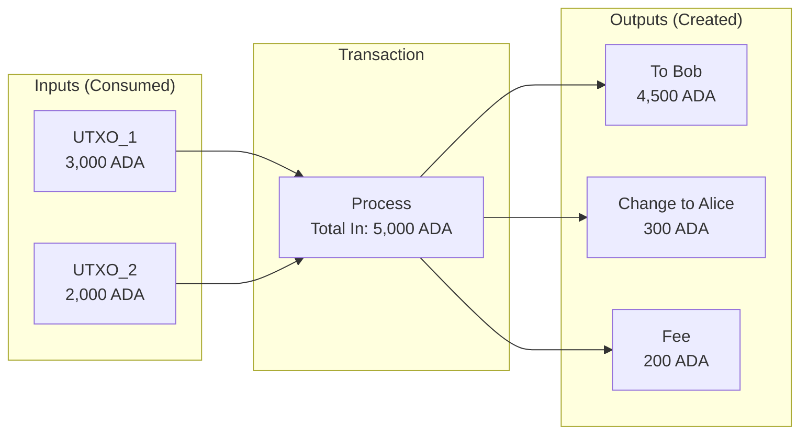
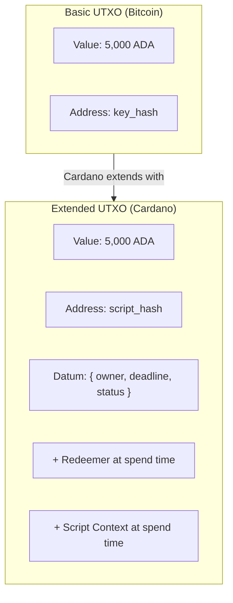

# レッスン #04: UTXOモデル

UTXO（未使用トランザクション出力）モデルは、変更可能なアカウント残高ではなく、離散的で不変の「コイン」を記録することでブロックチェーン上の所有権を追跡する方法です。CardanoはこのモデルをDatum、リディーマー、スクリプトコンテキストで拡張し、決定性と並列性を維持しながらスマートコントラクトを実現しています。このレッスンでは、UTXOの仕組み、なぜCardanoがこのモデルを選択したのか、開発者としてeUTXOでどのように考えるべきかを説明します。

すべてのブロックチェーンには、誰が何を所有しているかを追跡する方法が必要です。根本的に異なる2つのアプローチがあります：**アカウントモデル**（Ethereumで使用）と**UTXOモデル**（Bitcoinで使用され、拡張形式でCardanoで使用）です。これは些細な実装の詳細ではありません。トランザクションについてどのように考えるか、スマートコントラクトをどのように設計するか、そしてプロトコルがどのような保証を提供できるかに影響します。

## アカウントモデルはどのように機能するのか？

アカウントモデルは銀行口座のように機能します：各アドレスには変更可能な残高があり、トランザクションは送信者からの引き落としと受信者への入金によって残高をその場で更新します。データベースやEthereumを使ったことがあれば、このモデルは直感的に理解できます。

```
アカウント状態（データベースの行のように）：

| Address            | Balance    |
|--------------------|------------|
| addr_alice         | 5,000 ADA  |
| addr_bob           | 3,000 ADA  |
| addr_charlie       | 1,500 ADA  |

トランザクション: AliceがBobに1,000 ADAを送信

UPDATE accounts SET balance = balance - 1000 WHERE address = 'addr_alice';
UPDATE accounts SET balance = balance + 1000 WHERE address = 'addr_bob';

結果:
| Address            | Balance    |
|--------------------|------------|
| addr_alice         | 4,000 ADA  |
| addr_bob           | 4,000 ADA  |
| addr_charlie       | 1,500 ADA  |
```

これは馴染みのあるものです。本質的に、残高がその場で更新される変更可能な台帳です。しかし、この単純さは分散コンテキストでは課題を伴います：

- **状態の競合**：同じアカウントを変更する2つのトランザクションはシリアライズされなければなりません。安全に並列実行できません。
- **非決定性**：トランザクションの結果は、先に実行される他のトランザクションに依存する可能性があります。実行時まで結果がわかりません。
- **グローバル状態への依存**：スマートコントラクトはしばしば共有グローバル状態の読み書きを行い、複雑な依存関係を生み出します。

## UTXOモデルはどのように所有権を追跡するのか？

UTXOモデルは、変更可能な残高ではなく、離散的で不変の「コイン」（前のトランザクションからの未使用トランザクション出力）を通じて所有権を追跡します。支出する際は、UTXOを入力として完全に消費し、新しいUTXOを出力として作成し、物理的な現金での支払いと同様に自分自身に「おつり」を受け取ります。

### 物理的な現金の対比

最良の対比は物理的な現金です。50ドルを持っている場合、「50の残高」という抽象的なものではなく、具体的な紙幣（20ドル、20ドル、10ドルなど）を持っています。25ドルのものを買う場合、20ドルと10ドル（合計30ドル）を渡し、5ドルのおつりを受け取ります。

UTXOも同じように機能します：



```
Aliceの UTXO（彼女の「ウォレット」）：
  UTXO_1: 3,000 ADA  （以前のトランザクション tx_abc、出力 #0から受信）
  UTXO_2: 2,000 ADA  （以前のトランザクション tx_def、出力 #1から受信）

合計: 5,000 ADA（ただし2つの別々のUTXOとして保存）

AliceがBobに4,500 ADAを送信したい場合：

トランザクション：
  入力:                          出力:
  +-----------+               +-----------+
  | UTXO_1    | 3,000 ADA    | To Bob    | 4,500 ADA   （Bobの新しいUTXO）
  | UTXO_2    | 2,000 ADA    | To Alice  |   300 ADA   （Aliceへのおつり）
  +-----------+               +-----------+
  入力合計: 5,000 ADA         | Fee       |   200 ADA   （トランザクション手数料）
                              出力合計: 5,000 ADA

トランザクション後：
  UTXO_1: 使用済み（破棄、もう存在しない）
  UTXO_2: 使用済み（破棄、もう存在しない）
  UTXO_3: 4,500 ADA、Bobに属する（新しく作成）
  UTXO_4:   300 ADA、Aliceに属する（新しく作成、これが「おつり」）
```

主要な観察点：

1. **UTXOは完全に消費されます**。UTXOを部分的に使用することはできません。3,000 ADAのUTXOを持っていて1,000 ADAを送りたい場合、3,000 ADA UTXOを完全に消費し、2つの新しい出力を作成します：受取人に1,000 ADA、自分自身におつりとして2,000 ADA。

2. **入力は常に出力と手数料の合計に等しい**。すべてのトランザクションはバランスが取れていなければなりません。すべての入力UTXOの合計は、すべての出力UTXOの合計とトランザクション手数料の合計に等しくなければなりません。プロトコルがこれを強制します。

3. **UTXOは不変です**。一度作成されると、UTXOは決して変わりません。存在する（未使用）か存在しない（使用済み）かのどちらかです。UPDATE操作はなく、CREATE（トランザクション出力として）とCONSUME（トランザクション入力として）のみがあります。

4. **各UTXOは一度だけ使用できます**。これが二重支払いを防止する方法です。UTXOが確認済みトランザクションの入力として現れると、使用済みとしてマークされ、再び使用することはできません。

### UTXOセットとは何か？

**UTXOセット**は、任意の時点でのすべての未使用トランザクション出力の完全なコレクションです。ブロックチェーンの現在の状態を表します。

```
UTXOセット（簡略化）：

| TxId:Index | Address     | Value     |
|------------|-------------|-----------|
| tx_01:#0   | addr_alice  | 300 ADA   |
| tx_02:#0   | addr_bob    | 4,500 ADA |
| tx_03:#0   | addr_charlie| 1,500 ADA |
| tx_03:#1   | addr_dave   | 750 ADA   |
| ...        | ...         | ...       |
```

各UTXOは、それを作成した**トランザクションID**とそのトランザクション内の**出力インデックス**によって一意に識別されます。このペア（TxId, Index）は**トランザクション出力参照**（TxOutRef）と呼ばれます。

Cardanoメインネットでは、UTXOセットには数百万のエントリが含まれています。フルノードはこのセットを高速な検証のためにメモリ内に維持します。

## 拡張UTXO（eUTXO）モデルとは何か？

拡張UTXOモデルは、Bitcoinの元のUTXOコンセプトに3つのコンポーネントを追加します：**Datum**（UTXOに添付される任意のデータ）、**リディーマー**（使用時に提供される引数）、**スクリプトコンテキスト**（トランザクション全体の包括的なビュー）。これらの拡張により、UTXOの決定性と並列性を維持しながらスマートコントラクトが実現されます。



### 1. Datum: UTXOへのデータの添付

eUTXOでは、各出力に**Datum**と呼ばれる任意のデータを添付できます。特定のUTXOに添付された状態と考えてください。

```
拡張UTXO：
+---------------------------+
| Value:  5,000 ADA         |
| Address: script_addr_xyz  |  <- 鍵ではなくスクリプトによってロック
| Datum: {                  |  <- このUTXOに添付された任意のデータ
|   owner: "alice",         |
|   deadline: 1740000000,   |
|   status: "active"        |
| }                         |
+---------------------------+
```

Datumは「スマートコントラクトはどこに状態を保存するのか？」に対するCardanoの回答です。アカウントモデル（Ethereum）では、状態はコントラクトストレージ（変更可能なキーバリューストア）に保存されます。eUTXOでは、状態はUTXO自体の中に存在します。状態を更新するには、UTXOを消費し、更新されたデータを持つ新しいものを作成します。

Cardanoは2つのDatumストレージモードをサポートしています：
- **Datum hash**：Datumのhashのみがオンチェーンに保存されます。実際のDatumはUTXOが使用される際に提供されます。これによりオンチェーンスペースが節約されます。
- **インラインDatum**：完全なDatumがUTXO内にオンチェーンで直接保存されます。これにより、オフチェーン調整なしに他のトランザクションがDatumを読み取ることが容易になります。

### 2. リディーマー: スクリプトへの入力の提供

スクリプトによってロックされたUTXOを使用する場合、**リディーマー**を提供します：使用が許可されるかどうかをスクリプトが判断するために使用する引数です。

```
スクリプトロックされたUTXOの使用：

入力：
  使用するUTXO: tx_01:#0 (script_addr_xyzによってロック)
  リディーマー: { action: "claim", proof: "abc123" }

バリデータースクリプトが受け取るもの：
  - Datum:    { owner: "alice", deadline: 1740000000, status: "active" }
  - リディーマー: { action: "claim", proof: "abc123" }
  - コンテキスト:  （トランザクション全体に関する情報）

スクリプトが評価して返すもの：
  True  -> トランザクションは有効、UTXOは使用可能
  False -> トランザクションは無効、ネットワークによって拒否
```

### 3. スクリプトコンテキスト: トランザクションの認識

バリデータースクリプトは**スクリプトコンテキスト**も受け取ります：すべての入力、すべての出力、手数料、有効性範囲、署名者などを含む、トランザクション全体の包括的なビューです。

これは非常に強力です。スクリプトは以下のような複雑な条件を強制できます：

- 「このUTXOは、トランザクションがアドレスXにも100 ADAを送信する場合にのみ使用できる」
- 「このUTXOは、スロット50,000,000以降にのみ使用できる」
- 「このUTXOは、トランザクションが同じスクリプトアドレスに更新されたDatumを持つ新しい出力を作成する場合にのみ使用できる」

最後のパターンは、eUTXOにおける**ステートフルスマートコントラクト**の基盤です。スクリプトは自身の状態が正しく伝播されることを強制します。

## 完全なeUTXOトランザクションはどのように機能するのか？

完全なeUTXOスマートコントラクトのインタラクションは、リディーマーを使用してスクリプトロックされたUTXOを消費し、オンチェーンバリデーターが条件（Datum、リディーマー、スクリプトコンテキスト）をチェックし、検証に合格するとトランザクションが更新された状態を持つ新しいUTXOを生成します。具体的な例を示します。

```
シナリオ: Aliceがベスティングコントラクトに1,000 ADAをロックしました。
          コントラクトは特定のスロット以降に資金を解放します。

トランザクション前：
  スクリプトUTXO（vesting_script_addrにて）：
    Value: 1,000 ADA
    Datum: { beneficiary: addr_alice, release_slot: 50000000 }

  AliceのUTXO（addr_aliceにて）：
    Value: 10 ADA  （手数料用）

トランザクション：
  入力：
    [1] スクリプトUTXO (vesting_script_addr, tx_old:#0)
        リディーマー: { action: "withdraw" }
    [2] Aliceの手数料UTXO (addr_alice, tx_fee:#0)

  出力：
    [1] addr_aliceへ: 1,000 ADA  （ベスト済み資金）
    [2] addr_aliceへ: 8 ADA      （手数料UTXOのおつり）

  手数料: 2 ADA
  有効性区間: [50000000, infinity)  <- 解放スロット以降のみ有効

スクリプト検証：
  ベスティングスクリプトが確認する内容：
    1. 現在のスロットは >= datum.release_slot か？ はい（有効性区間で強制）
    2. トランザクションは datum.beneficiary に支払っているか？ はい（出力#1がaddr_aliceへ）
    3. トランザクションは datum.beneficiary によって署名されているか？ はい（Aliceが署名）
  結果: TRUE -> トランザクションは有効

トランザクション後：
  スクリプトUTXO: 使用済み（破棄）
  addr_aliceの新しいUTXO: 1,000 ADA（ベスト済み資金）
  addr_aliceの新しいUTXO: 8 ADA（おつり）
```

## なぜ決定的なトランザクション検証が重要なのか？

決定的な検証とは、eUTXOトランザクションが変更可能なグローバル状態を読み取るのではなく、IDで特定のUTXOを参照するため、送信前にトランザクションが正確に何をするかを予測できることを意味します。期待通りの正確な結果が得られるか、またはトランザクションが何の影響もなく失敗するかのいずれかです。

アカウントモデルでは、トランザクションの結果は構築と実行の間に変化する可能性のあるグローバル状態に依存します：

```
アカウントモデル（Ethereum）：
  1. AliceがDEXコントラクトを呼び出すトランザクションを構築
  2. 構築時の価格は1 ETHあたり100 TOKEN
  3. 構築と実行の間にBobのトランザクションが価格を200に変更
  4. Aliceのトランザクションはより悪い価格で実行される（または失敗する）

  -> 構築時に結果は予測不可能だった
```

eUTXOでは、トランザクションは正確な入力（参照による特定のUTXO）を指定します：

```
eUTXOモデル（Cardano）：
  1. AliceがUTXO_AとUTXO_Bを消費するトランザクションを構築
  2. トランザクションがバリデーターに到達した時点で
     UTXO_AまたはUTXO_Bがすでに使用されていた場合、トランザクションは単に失敗する
  3. まだ使用されていない場合、トランザクションはAliceが構築時に見た
     正確な状態で実行される

  -> 結果は完全に予測可能。期待通りの正確な結果が得られるか、
     トランザクションが何の影響もなく失敗するかのいずれか。
```

この決定性は以下を意味します：

- **手数料のサプライズなし**：送信前に正確な手数料がわかります。
- **フロントランニングなし**：他のトランザクションがあなたのトランザクションが見る状態を操作することはできません（トランザクションを失敗させることはできますが、異なる結果で実行させることはできません）。
- **オフチェーン検証**：ブロックチェーンが実行するのとまったく同じ検証ロジックをローカルで実行し、手数料を支払う前に成功を確認できます。
- **失敗時の手数料返金**：トランザクションがフェーズ1検証（構造チェック）で失敗した場合、手数料は請求されません。フェーズ2の失敗（スクリプト実行の失敗）のみが手数料を消費します。

## eUTXOモデルでの並行性はどのように機能するのか？

eUTXOでの並行性は、2つのトランザクションが同じUTXOを同時に消費できない（1つだけが成功し、もう1つは失敗する）ため、明示的な設計が必要です。Cardanoコミュニティは、このトレードオフを効果的に処理するためのいくつかのパターン（UTXOファンアウト、バッチ処理、参照入力）を開発してきました。

```
問題のあるシナリオ：
  DEXのスクリプトUTXO: { price: 100, liquidity: 10000 }

  Aliceのtx: DEX UTXOを消費、100トークンを購入
  Bobのtx:   DEX UTXOを消費、50トークンを購入

  これらの1つだけが成功できます。もう1つは使用済みUTXOを参照しています。
```

これはアカウントモデルとは異なり、両方のトランザクションがシリアライズされ、両方とも成功する可能性があります（ただし、間に状態変更の可能性がある）。

### どのような並行性ソリューションが存在するか？

**1. 複数のUTXO（UTXOファンアウト）**

1つのUTXOにすべての流動性を保持する代わりに、多くのUTXOに状態を分散させます：

```
これの代わりに：
  [単一のUTXO: 10,000 ADA流動性]

以下を使用：
  [UTXO_1: 1,000 ADA]  [UTXO_2: 1,000 ADA]  [UTXO_3: 1,000 ADA]
  [UTXO_4: 1,000 ADA]  [UTXO_5: 1,000 ADA]  ... (10個のUTXO)

これで10人のユーザーが同時に取引でき、それぞれ異なるUTXOを消費します。
```

**2. バッチ処理（オーダーブックパターン）**

ユーザーは個別のUTXOとして注文を送信します。バッチャーが複数の注文を収集し、1つのトランザクションで実行します：

```
ステップ1: ユーザーがUTXOとして注文を送信
  [注文: Aliceが100 TOKENを購入]  [注文: Bobが50 TOKENを購入]  [注文: Carolが200 TOKENを売却]

ステップ2: バッチャーが以下を行う1つのトランザクションを構築：
  - すべての注文UTXOを消費
  - DEX流動性UTXOを消費
  - 各ユーザーの決済出力を生成
  - 更新された状態を持つ新しいDEX UTXOを生成

競合なし：各ユーザーは自分のUTXOのみを作成します。
```

これは、ほとんどのCardano DEX（SundaeSwap、Minswap、WingRiders）で使用されるパターンです。

**3. 参照入力（CIP-31）**

Cardanoでは、トランザクションがUTXOを消費せずに**参照**することができます。トランザクションがUTXOからデータを読み取るだけで（変更しない）場合、参照入力を使用できます。複数のトランザクションが同じUTXOを同時に参照できます。

```
オラクルUTXO: { price_feed: 1.50, timestamp: 1740000000 }

Aliceのtx: オラクルUTXOを参照（価格を読み取り、消費しない）
Bobのtx:   オラクルUTXOを参照（価格を読み取り、消費しない）
Carolのtx: オラクルUTXOを参照（価格を読み取り、消費しない）

3つのトランザクションすべてが同じブロックで処理可能。
オラクルUTXOは未使用のまま。
```

**4. 参照スクリプト（CIP-33）**

スクリプトコード自体をUTXOに保存し、各トランザクションに完全なスクリプトを含める代わりにトランザクションから参照できます。これにより、スクリプトの共有を可能にしながらトランザクションサイズとコストが削減されます。

## ネイティブトークンはeUTXOモデルでどのように機能するのか？

Cardanoでは、カスタムトークン（代替可能および非代替可能）は**ネイティブ**です：スマートコントラクト内部ではなく、プロトコルレベルでADAとともにUTXO内に存在します。これにより、トークンは基本的な転送にスマートコントラクトの実行を必要とせずに、ADA自体のすべてのセキュリティ特性を継承します。

```
CardanoのUTXOは複数のアセットを保持できます：

UTXO：
+----------------------------------------------+
| Address: addr_alice                           |
| Value:                                        |
|   ADA: 5,000,000 lovelace (5 ADA)           |
|   PolicyID_abc.TokenA: 1,000 units           |
|   PolicyID_abc.TokenB: 500 units             |
|   PolicyID_def.MyNFT: 1 unit                |
+----------------------------------------------+
```

これは**マルチアセットバリュー**または**バリューバンドル**と呼ばれます。単一のUTXOがADAと任意の数の異なるネイティブトークンを保持できます。

重要：Cardano上のすべてのUTXOは最小量のADA（**min-UTXO**要件、UTXOサイズに応じて現在約1〜2 ADA）を含む必要があります。これにより、多くの小さなUTXOの作成にコストがかかるためスパムが防止され、UTXOセットが制御不能に成長しないようにします。

### ADAとlovelaceとは何か？

ADAはCardanoのネイティブ通貨です。最小単位は**lovelace**で、Ada Lovelaceにちなんで名付けられています：

```
1 ADA = 1,000,000 lovelace

すべてのオンチェーン値はlovelace建てです。
トランザクションが手数料として200,000 lovelaceを指定する場合、それは0.2 ADAです。
```

これは、Ethereumがwei（1 ETH = 10^18 wei）を使用するのと同様であり、従来の金融がセント（1 USD = 100セント）を使用するのと同様ですが、小数点以下の桁数がより多くなります。

## UTXOモデルとアカウントモデルはどのように比較されるか？

2つのモデルは根本的に異なるトレードオフを行います。アカウントモデルはステートフルなアプリケーションについて推論するのがよりシンプルです。eUTXOモデルはトランザクション結果についてより強力な保証を提供し、より多くの並列性を可能にします。どちらも客観的に「優れている」わけではありません。

| 側面 | アカウントモデル (Ethereum) | eUTXOモデル (Cardano) |
|---|---|---|
| **状態の表現** | 変更可能なアカウント残高 | 不変のUTXO、消費と作成 |
| **スマートコントラクトの状態** | 変更可能なストレージスロット | UTXOに添付されたDatum |
| **並列性** | 共有状態により制限 | 自然な並列性（異なるUTXO） |
| **決定性** | 非決定的（状態が変化する可能性） | 決定的（入力は特定のUTXO） |
| **トランザクション検証** | 実行して結果を確認 | オフチェーンで確実に検証 |
| **並行性** | 暗黙的（EVMでシリアライズ） | 明示的（UTXO選択） |
| **ウォレットの複雑さ** | シンプル（残高を読む） | より複雑（UTXOセットを管理） |
| **手数料の予測可能性** | 概算（ガス見積もり） | 正確（決定的な実行） |
| **ネイティブトークン** | ERC-20コントラクト（コード） | プロトコルレベル（コントラクト不要） |

## 開発者はeUTXOでどのように考えるべきか？

Cardanoに移行するWeb2開発者のために、「eUTXOで考える」ためのフレームワークを紹介します：

1. **状態は変数ではなくUTXOに存在します**。変更可能な`balance`変数の代わりに、離散的な値のコンテナのセットがあります。

2. **状態遷移はUTXOを消費し作成します**。`balance -= 100`の代わりに、UTXOを消費し新しいものを作成します。すべての状態変更は作成-破棄のサイクルです。

3. **トランザクションはアトミックな関数です**。トランザクションはUTXOのセットを入力として受け取り、UTXOのセットを出力として生成します。副作用のない純粋関数です。いずれかの部分が失敗すると、全体が実行されません。

4. **並行性はロックではなくUTXO選択に関するものです**。データベースの行をロックする代わりに、特定のUTXOを選択します。他の誰かがすでにそのUTXOを使用した場合、異なる入力でリトライします。

5. **スクリプトはエグゼキューターではなくバリデーターです**。Plutusスクリプトは「何かをする」のではなく、トランザクションが条件を満たすことを検証します。トランザクションビルダーが状態遷移を構築し、スクリプトはそれが合法であることを確認するだけです。

## Web2との対比

| eUTXOの概念 | Web2の同等物 | 主な違い |
|---|---|---|
| **UTXO** | ギフトカード / プリペイドバウチャー | 残高をデクリメントするのではなく、全額を使っておつりを受け取る |
| **UTXOセット** | 不変イベントログ（イベントソーシング） | 現在の状態は変更可能なストアからではなく、未使用出力のセットから導出 |
| **トランザクション（消費 + 作成）** | イベントソーシングにおける不変INSERT | UPDATEなし；古いものを置き換える新しいイベントを作成 |
| **Datum** | イベントに添付された状態スナップショット | 状態は明示的で、記述する値と共に配置される |
| **リディーマー** | 関数引数 / APIリクエストボディ | バリデーターにユーザーが意図するアクションを伝える |
| **スクリプト検証** | ミドルウェア / 認可チェック | リクエストがポリシーを満たすことを検証；ビジネスロジック自体は実行しない |
| **おつり出力** | 払い戻し / 過払い返金 | 50ドル札で30ドルを支払うと、20ドルが戻ってくる |
| **トランザクションの決定性** | 純粋関数（副作用なし） | 同じ入力であれば、常に同じ出力（関数型プログラミングの純粋関数のように） |
| **UTXO競合** | 楽観的並行制御 | データベースの楽観的ロックのように：試行し、他の人が行を変更した場合はリトライ |
| **参照入力** | データベース読み取りレプリカ / キャッシュ | ロックや変更なしに状態を読み取る |
| **Min-UTXO（ADAデポジット）** | 最低口座残高 / ストレージデポジット | すべての状態エントリの背後に実際の価値を要求することでスパムを防止 |

**イベントソーシングの対比は特に強力です。** イベントソーシングでは：
- 状態は不変のイベントログから導出される
- 過去のイベントを変更しない
- 現在の状態はすべてのイベントのプロジェクション
- 新しい状態は新しいイベントを追加して作成される

eUTXOでは：
- 状態はすべての未使用出力のセット
- 既存のUTXOは変更しない
- 現在の状態はUTXOセット（すべての未使用出力）
- 新しい状態はUTXOを消費し新しいものを生成して作成される

イベントソーシングやCQRSパターンを使用したことがあれば、eUTXOは自然に感じるでしょう。

**関数型プログラミングの対比**も有用です。トランザクションは純粋関数のようなものです：明示的な入力を受け取り、明示的な出力を生成し、隠れた副作用がありません。eUTXOモデルは本質的に台帳会計への関数型アプローチであり、これは偶然ではありません。Cardanoのスマートコントラクト言語（Plutus、Aiken）は関数型プログラミングに根ざしています。

## 主要なポイント

- **UTXOモデルは離散的な「コイン」を追跡します**（未使用トランザクション出力）。アカウント残高ではありません。UTXOは完全に消費され新しいものが作成されます。物理的な現金での支払いとおつりに似ています。
- **CardanoのeUTXOは基本的なUTXOを拡張します**：Datum（状態）、リディーマー（アクション引数）、スクリプトコンテキスト（トランザクション認識）により、UTXOの利点を維持しながらスマートコントラクトを実現します。
- **決定性はeUTXOの最大の強みです**：トランザクション結果は送信前に完全に予測可能であり、フロントランニングを排除し、正確な手数料計算を可能にします。
- **並行性はeUTXOでは明示的な設計が必要です**。UTXOファンアウト、バッチ処理、参照入力などのパターンが競合を解決し、成熟したCardanoプロトコルのほとんどがこれらのパターンを効果的に使用しています。
- **ネイティブトークンはUTXO内でADAとともに存在し**、基本的な操作にスマートコントラクトを必要とせずにすべてのプロトコルレベルのセキュリティ特性を継承します。

## 次のステップ

Cardanoがどのように価値と状態を追跡するかを理解しました。しかし、「アドレス」や「秘密鍵」について完全に説明せずに言及してきました。レッスン5では、ウォレット、鍵、アドレスを探求してこの全体像を完成させます：ユーザーをブロックチェーンに接続するIDとアクセスのレイヤーです。ニーモニックフレーズが鍵の階層をどのように生成するか、Cardanoのアドレスがどのように構造化されているか、そしてこれらすべてが前のレッスンの暗号学的プリミティブとUTXOモデルにどのように結びつくかを学びます。
