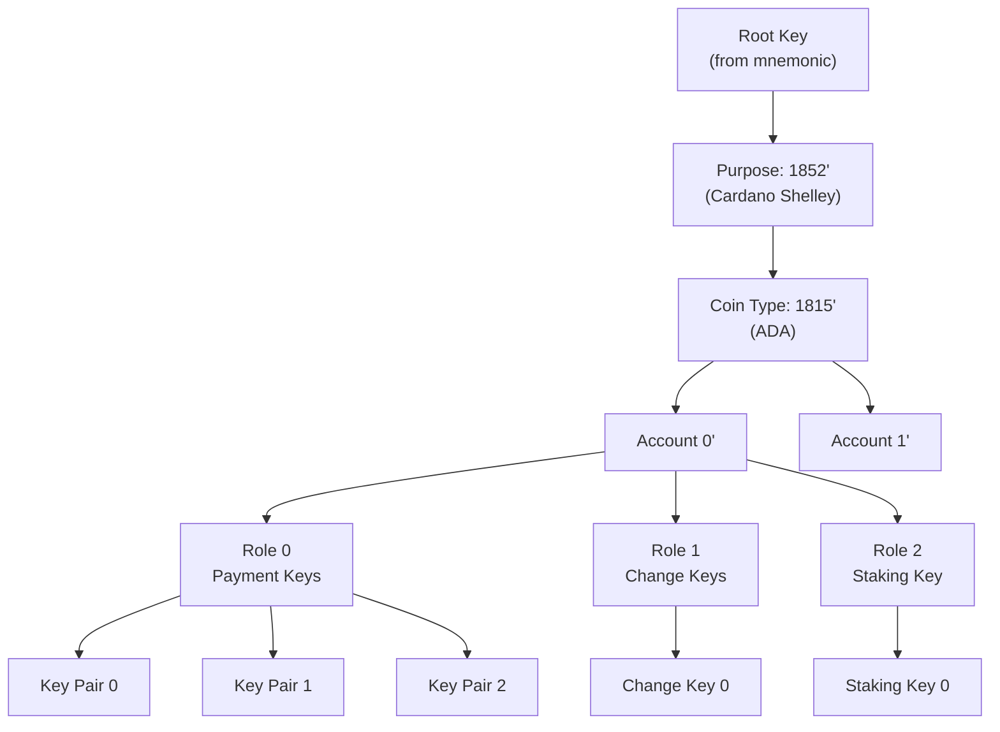
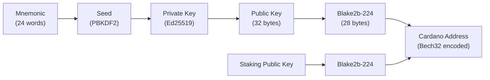

# レッスン #05: ウォレット、鍵、アドレス

ウォレット、鍵、アドレスはCardanoのIDおよびアクセスレイヤーを形成します：ニーモニックシードフレーズが鍵ペアの階層ツリーを生成し、公開鍵がハッシュされてUTXOをロックするアドレスになり、ウォレットソフトウェアがこの複雑さを管理してユーザーがADAを送受信・ステークできるようにします。このレッスンでは、レッスン2の暗号学的プリミティブとレッスン4のUTXOモデルを完全な全体像に接続します。

このレイヤーの理解は、Cardano開発者にとって不可欠です。dAppの構築、ウォレット接続の統合、トランザクションフローの設計など、鍵、アドレス、ウォレットがどのように連携するか、そしてなぜCardanoのアプローチが他のブロックチェーンと異なるかを知る必要があります。

## 鍵ペアとは何か、なぜIDの基盤なのか？

鍵ペアは、秘密鍵（32バイトのランダムエントロピー）とそれに対応する公開鍵（Ed25519で導出）から構成されます。秘密鍵を保持する者がトランザクションに署名し対応するアドレスの資金を使用できるため、Cardano上のIDの基盤を形成します。「パスワードを忘れた」フロー、カスタマーサポート、鍵自体以外の回復メカニズムはありません。

```
鍵生成：
  private_key = random_256_bits()          // 32バイトのエントロピー
  public_key  = ed25519_derive(private_key) // 32バイト、数学的にリンク

特性：
  - private_key -> public_key:  容易（1回の計算）
  - public_key -> private_key:  実行不可能（Ed25519を破る必要がある）
  - sign(message, private_key): 64バイトの署名を生成
  - verify(message, signature, public_key): true/false
```

**秘密鍵はあなたのIDです。** 秘密鍵を保持する者は、対応するアドレスの資金を使用できます。

**公開鍵は検証可能なIDです。** 自由に共有できます。他の人はそれを使って署名を検証し、（そこから導出されたアドレスを通じて）資金を送ることができます。

## なぜ生の鍵ペアは実用的でないのか？

生の鍵ペアは深刻な実用上の問題を引き起こします：アドレスごとに1つの鍵ではすべてのトランザクションが自明にリンク可能になり、数百の無関係な秘密鍵の管理はエラーが起きやすく、数百の鍵のバックアップは非現実的で、侵害された鍵にはローテーションメカニズムがありません。これらすべての問題の解決策が**階層的決定性（HD）ウォレット**です。

1. **アドレスごとに1つの鍵**：公開鍵をアドレスとして直接使用すると、すべてのトランザクションが自明にリンク可能になります。誰でも財務履歴全体を見ることができます。

2. **鍵管理の悪夢**：パワーユーザーは異なる目的で数百のアドレスを持つ可能性があります。数百の無関係な秘密鍵の管理はエラーが起きやすく危険です。

3. **バックアップの複雑さ**：単一の秘密鍵を紛失すると、そのアドレスのすべての資金を失います。数百の鍵のバックアップは非現実的です。

4. **鍵のローテーション不可**：鍵が侵害された場合、アドレスを更新できません。新しいアドレスを作成し、すべての資金を移動する必要があります。

## ニーモニックシードフレーズはどのように機能するのか？

ニーモニックシードフレーズ（BIP-39で定義）は、標準化された2048語のリストから24語としてエンコードされた256ビットのランダムエントロピーの人間が読める表現です。この単一のフレーズが鍵ペアのツリー全体を決定的に生成するため、完全なCardano IDに必要な唯一のバックアップとなります。

```
24語のニーモニックの例（使用しないでください。説明目的のみ）：

  1. abandon   7. carbon   13. glance   19. pottery
  2. ability   8. detect   14. harvest  20. rabbit
  3. abstract  9. emerge   15. isolate  21. serial
  4. across   10. filter   16. jungle   22. timber
  5. blanket  11. flight   17. kitchen  23. urban
  6. burst    12. gauge    18. obvious  24. vendor
```

仕組み：

```
ステップ1: エントロピーを生成（ランダムビット）
  entropy = 256ランダムビット（24語フレーズの場合）

ステップ2: チェックサムを計算
  checksum = SHA-256(entropy)の最初の8ビット

ステップ3: 結合
  combined = entropy + checksum = 264ビット

ステップ4: 11ビットグループに分割
  264ビット / 11ビット = 24グループ

ステップ5: 各グループをBIP-39ワードリストの単語にマッピング
  グループ1 (00000000000) -> "abandon" (単語#0)
  グループ2 (00000000001) -> "ability" (単語#1)
  ... 24グループすべてについて同様

ワードリストは正確に2048語を含みます（2^11 = 2048）。
```

**なぜ24語なのか？** 24語は256ビットのエントロピーをエンコードします。可能な24語フレーズの数は2^256で、約1.16 x 10^77です。観測可能な宇宙にはおよそ10^80個の原子があります。シードフレーズをブルートフォースで推測することは単に非現実的なだけではなく、想像し得るいかなる技術でも物理的に不可能です。

**Cardanoウォレットは通常、15語または24語のニーモニックを使用します。** Shelleyエラのウォレット（Daedalus、Eternl、Lace）は24語（256ビットエントロピー）を使用します。一部の軽量ウォレットは15語（160ビットエントロピー）を使用しますが、これでも天文学的に安全です。

### ニーモニックはどのようにルート鍵になるのか？

ニーモニックフレーズはPBKDF2（Password-Based Key Derivation Function 2）を使用して暗号学的シードに変換されます：

```
seed = PBKDF2(
  password: mnemonic_words_as_string,
  salt: "mnemonic" + optional_passphrase,
  iterations: 2048,
  key_length: 512 bits,
  hash: HMAC-SHA512
)
```

この512ビットのシードが、他のすべての鍵が導出される**ルート鍵**になります。オプションのパスフレーズは追加のセキュリティレイヤーを提供します。同じ24語でも異なるパスフレーズでは完全に異なるウォレットが生成されます。一部のユーザーはこれを「25番目の単語」として、もっともらしい否認や追加のセキュリティのために使用しています。

## HDウォレットはどのように1つのシードから無限の鍵を導出するのか？

階層的決定性（HD）ウォレット（BIP-32）は、ツリー構造を使用して単一のルート鍵から無制限の数の鍵ペアを導出します。各鍵は一方向の導出関数を使用して親から決定的に導出されるため、ニーモニックだけでウォレットがこれまでに生成したすべての鍵ペアを再作成するのに十分です。



```
ルート鍵（ニーモニックから）
+-- 目的（1852'：Cardano Shelleyウォレット用）
|   +-- コインタイプ（1815'：ADA用）
|       +-- アカウント 0'
|       |   +-- ロール 0（外部/支払い）
|       |   |   +-- アドレスインデックス 0 -> 鍵ペア 0
|       |   |   +-- アドレスインデックス 1 -> 鍵ペア 1
|       |   |   +-- アドレスインデックス 2 -> 鍵ペア 2
|       |   |   +-- ...
|       |   +-- ロール 1（内部/おつり）
|       |   |   +-- アドレスインデックス 0 -> 鍵ペア 0
|       |   |   +-- ...
|       |   +-- ロール 2（ステーキング）
|       |       +-- アドレスインデックス 0 -> ステーキング鍵ペア
|       +-- アカウント 1'
|           +-- ロール 0（外部/支払い）
|           |   +-- ...
|           +-- ...
```

### 導出パスの構造は？

導出パスは以下のように記述されます：

```
m / purpose' / coin_type' / account' / role / address_index

Cardanoの場合：
m / 1852' / 1815' / 0' / 0 / 0

各要素の意味：
  m          = ルート鍵
  1852'      = 目的（Shelleyエラ Cardano、CIP-1852）
  1815'      = ADAのコインタイプ（SLIP-44に登録）
  0'         = アカウントインデックス（最初のアカウント）
  0          = ロール: 0=外部、1=内部(おつり)、2=ステーキング
  0          = アドレスインデックス（このロールの最初のアドレス）

アポストロフィ(')は「強化」導出を意味します：子鍵から公開鍵を使っても
親鍵を計算することはできません。
```

なぜ1815か？ Ada Lovelaceは1815年に生まれました。なぜ1852か？ Ada Lovelaceは1852年に亡くなり、CIP-1852が導出標準を定義しています。

### HD導出の主要な特性は？

**決定的**：同じルート鍵とパスが与えられると、常に同じ子鍵が得られます。これは、ニーモニックだけでウォレットがこれまでに生成したすべての鍵ペアを再作成するのに十分であることを意味します。

**階層的**：鍵はツリーを形成します。アカウントレベルの鍵は独立しており、1つのアカウントが侵害されても他に影響しません（アカウントレベルでの強化導出による）。

**インクリメンタル**：シードに戻ることなく、必要に応じて新しいアドレスを生成できます。ウォレットは単にアドレスインデックスをインクリメントします。

**公開鍵導出**：非強化レベルでは、秘密鍵なしに親の公開鍵から子の公開鍵を導出できます。これにより、アドレスの生成と残高の追跡はできるがトランザクションに署名する能力を持たない「ウォッチオンリー」ウォレットが可能になります。

## Cardanoはどのアドレスタイプをサポートしているか？

Cardanoは複数のアドレスタイプ（ベース、エンタープライズ、報酬、ポインター、スクリプト）をサポートしており、それぞれ異なるユースケースに対応しています。Cardanoのアドレスは単にハッシュされた公開鍵ではなく、ヘッダーバイト、支払い資格情報、およびオプションの委任資格情報を含む構造化されたデータ型です。



### Cardanoアドレスの構造は？

```
Cardanoアドレス（Shelleyエラ）：

+--------+-------------------+-------------------+
| Header | Payment Part      | Delegation Part   |
| 1 byte | 28 bytes          | 28 bytes          |
+--------+-------------------+-------------------+

ヘッダーバイトのエンコード：
  - ネットワーク（メインネット vs テストネット）
  - アドレスタイプ（後に続くものを決定）

Payment Part：
  - 支払い検証鍵のhash（鍵hash）、または
  - Plutusスクリプトのhash（スクリプトhash）

Delegation Part（アドレスタイプに依存）：
  - ステーキング検証鍵のhash、または
  - ステーキングスクリプトのhash、または
  - ステーク登録証明書へのポインター、または
  - なし（エンタープライズアドレス）
```

### ベースアドレスとは何か？

最も一般的なアドレスタイプです。支払い資格情報とステーキング資格情報の両方を含みます。

```
ベースアドレス：
  Payment: key_hash(payment_vk) または script_hash(payment_script)
  Staking: key_hash(staking_vk) または script_hash(staking_script)

例（Bech32エンコード）：
  addr1qx2fxv2umyhttkxyxp8x0dlpdt3k6cwng5pxj3jhsydzer3jcu5d8ps7zex2k2xt3uqxgjqnnj83ws8lhrn648jjxtwq2ytjc7

特性：
  - ADAとネイティブトークンを受け取れる
  - ステーキング（ステークプールへの委任）に参加可能
  - ステーキング報酬を獲得
  - エンドユーザーにとって最も一般的に使用されるアドレスタイプ
```

プレフィックス`addr1`はメインネットのベースアドレスを示します。テストネットアドレスは`addr_test1`を使用します。

### エンタープライズアドレスとは何か？

エンタープライズアドレスは支払い資格情報のみを含み、ステーキングコンポーネントはありません。

```
エンタープライズアドレス：
  Payment: key_hash または script_hash
  Staking: なし

例：
  addr1vx2fxv2umyhttkxyxp8x0dlpdt3k6cwng5pxj3jhsydzer3jcu5d8ps7zex2k2xt3uqxgjqnnj83ws8lhrn648jjxtwqr8jhvs

特性：
  - ADAとネイティブトークンを受け取れる
  - ステーキングに参加できない
  - 報酬を獲得しない
  - 用途：取引所、スマートコントラクト、一時的な保管
```

エンタープライズアドレスは短く（委任部分がない）、ステーキングが不要な場合に有用です。スマートコントラクトアドレスはしばしばエンタープライズアドレスです。

### 報酬アドレスとは何か？

報酬アドレス（ステークアドレスとも呼ばれる）はステーキング報酬の受け取り専用であり、通常のADA送金を受け取ることはできません。

```
報酬アドレス：
  Staking: key_hash または script_hash

例：
  stake1uyehkck0lajq8gr28t9uxnuvgcqrc6070x3k9r8048z8y5gh6ffgw

特性：
  - ステーキング報酬を受け取る
  - 通常のADA送金を受け取れない
  - ステーキング鍵ごとに1つ（通常、アカウントごとに1つ）
  - 報酬は特別なトランザクションタイプで引き出される
```

### ポインターアドレスとは何か？

ポインターアドレスは、完全なステーク鍵のhashを含む代わりに、チェーン内の位置（スロット、トランザクションインデックス、証明書インデックス）でステーク登録証明書を参照します。

```
ポインターアドレス：
  Payment: key_hash または script_hash
  Staking: pointer(slot, tx_index, cert_index)

特性：
  - ベースアドレスより空間効率が良い
  - ベースアドレスと機能的に同等
  - 複雑さのため実際にはほとんど使用されない
```

### スクリプトアドレスはどのように機能するのか？

支払い資格情報が（鍵hashではなく）スクリプトhashの場合、そのアドレスは**スクリプトアドレス**です。スクリプトアドレスのUTXOは、スクリプト（Plutusバリデーター）を満たす有効なリディーマーを提供することでのみ使用できます。

```
スクリプトアドレス（Plutusバリデーター用）：
  Payment: script_hash(compiled_plutus_script)
  Staking: オプション

スクリプトhashの計算：
  script_hash = blake2b_224(serialized_script)
```

これがCardanoでスマートコントラクトが「デプロイ」される方法です。特定の場所にコードをアップロードするわけではありません。代わりに、スクリプトのhashがそのアドレスを決定します。同じスクリプトをコンパイルした人は誰でも同じアドレスを取得します。スクリプト自体は、アドレスから使用するトランザクションに含めることができます（またはCIP-33参照スクリプトを介して参照できます）。

### Bech32エンコーディングとは何か？

すべてのCardanoアドレスは**Bech32**エンコーディングを使用しており、以下を提供します：

- **人間が読めるプレフィックス**：メインネット支払いアドレスは`addr`、テストネットは`addr_test`、報酬アドレスは`stake`
- **エラー検出**：タイプミスを検出する組み込みチェックサム
- **大文字小文字の区別なし**：`addr1QX...`と`addr1qx...`は同じアドレス
- **曖昧な文字なし**：0/Oや1/l/Iのような紛らわしい文字を回避

```
Bech32形式: prefix + "1" + data + checksum

addr1qx2fxv2umyhttkxyxp8x0dlpdt3k6cwng5pxj3jhsydzer3jcu5d8ps7zex...
|    | |                                                                |
prefix separator  data（アドレスバイトをbase32でエンコード）          checksum
```

## 鍵、アドレス、UTXOはどのように接続するのか？

ニーモニックから使用可能なUTXOまでの完全なフローは、鍵導出、アドレス生成、UTXO作成、トランザクション署名を通じて進みます。各ステップはレッスン2の暗号学的プリミティブを使用し、最終結果はネットワークが検証できる署名済みトランザクションです。

```
1. ニーモニック生成
   24のランダムな単語 -> マスターシード

2. 鍵導出（HDウォレット、BIP-32/CIP-1852）
   マスターシード -> ルート鍵
   ルート鍵 -> m/1852'/1815'/0'/0/0 -> payment_key_pair_0
   ルート鍵 -> m/1852'/1815'/0'/2/0 -> staking_key_pair_0

3. アドレス生成
   payment_vk_hash = blake2b_224(payment_public_key_0)
   staking_vk_hash = blake2b_224(staking_public_key_0)
   address = base_address(network=mainnet, payment_vk_hash, staking_vk_hash)
   encoded = bech32_encode("addr", address)
   結果: addr1qx2fxv2umyhttkx...

4. 資金の受領
   誰かが addr1qx2fxv2umyhttkx... に100 ADAを送信
   新しいUTXOが作成される：
     UTXO { tx_id: "abc123", index: 0, address: addr1qx..., value: 100 ADA }

5. 資金の使用
   このUTXOを使用するには、支払い鍵の所有権を証明する必要がある：
   a. トランザクションボディを構築（UTXOを消費し、新しい出力を作成）
   b. トランザクションボディをハッシュ: tx_hash = blake2b_256(tx_body)
   c. 署名: signature = ed25519_sign(tx_hash, payment_private_key_0)
   d. ウィットネスを含める: (payment_public_key_0, signature)
   e. ネットワークが検証: ed25519_verify(tx_hash, signature, payment_public_key_0)
      かつ blake2b_224(payment_public_key_0) == UTXOのアドレスの支払い資格情報

6. ステーキング
   ステークプールに委任するには：
   a. ステーキング鍵をオンチェーンに登録（一回限り、2 ADAのデポジットが必要）
   b. staking_private_key_0で署名された委任証明書を送信
   c. このステーキング資格情報を共有するアドレスのすべてのUTXOが
      委任先プールのステークに貢献する
```

## 「ウォレット」とは実際に何か？

ウォレットとは、秘密鍵を保存し、ブロックチェーン上であなたのアドレスのUTXOをスキャンし、合計残高を計算し、トランザクションを構築・署名し、必要に応じて新しいアドレスを生成するソフトウェアです。あなたの資金はUTXOとしてブロックチェーン上に存在しており、アプリケーションの「中」にあるわけではありません。

```
ウォレットが「見る」もの：

ブロックチェーンUTXOセット：
  [UTXO_1: addr1_mine, 50 ADA]    <- 自分のもの
  [UTXO_2: addr2_other, 100 ADA]  <- 自分のものではない
  [UTXO_3: addr3_mine, 30 ADA]    <- 自分のもの
  [UTXO_4: addr4_other, 75 ADA]   <- 自分のものではない
  [UTXO_5: addr5_mine, 20 ADA]    <- 自分のもの

ウォレット表示：
  残高: 100 ADA (50 + 30 + 20)
  使用済みアドレス: 3
  UTXO数: 3
```

### Cardanoウォレットにはどのようなタイプがあるか？

**フルノードウォレット（Daedalus）**：完全な`cardano-node`を実行し、ブロックチェーン全体をダウンロードして検証します。最大限のセキュリティとトラストレス性。大きなディスク容量と同期時間が必要です。

**ライトウォレット（Eternl、Lace、Yoroi、Typhon、Flint）**：ブロックチェーンをインデックス化するバックエンドサービスに接続します。完全なチェーンをダウンロードしません。セットアップが速く、リソース消費が少ないですが、ブロックチェーンデータはバックエンドサービスに依存します（ただし、トランザクション署名はあなたの鍵でローカルで行われます）。

**ハードウェアウォレット（Ledger、Trezor）**：専用のセキュアデバイスに秘密鍵を保存します。鍵はデバイスから離れません。トランザクション署名はハードウェアウォレット上で行われます。鍵の盗難に対する最も強力な保護を提供します。

**ブラウザ拡張ウォレット**：CIP-30（Cardano dAppコネクター）を実装し、Webアプリケーションがユーザーのウォレットと対話するための標準化されたAPIを提供します。これはCardano上のdAppがユーザーに接続する主要な方法です。

```
CIP-30ウォレットAPI（概念的）：

// dAppがウォレット接続を要求
wallet = await cardano.eternl.enable()

// dAppがUTXOを照会
utxos = await wallet.getUtxos()

// dAppがトランザクションを構築しウォレットに署名を依頼
signed_tx = await wallet.signTx(unsigned_tx)

// dAppが署名済みトランザクションを送信
tx_hash = await wallet.submitTx(signed_tx)
```

ウォレットはdAppに秘密鍵を公開しません。ユーザーが明示的に承認したものだけに署名します。

## 支払い鍵とステーキング鍵はどう違うのか？

Cardanoは、支払い鍵（資金の使用を制御）とステーキング鍵（委任と報酬引き出しを制御）を意図的に分離しています。この分離により、プールにステークを委任しても、プールがあなたの資金を使用する能力を持つことはありません。

```
支払い鍵（m/1852'/1815'/account'/0/index）：
  - 資金の使用を制御
  - アドレスごとに異なる（アカウントごとに多数の支払い鍵）
  - 1つの支払い鍵が侵害されても、そのアドレスのUTXOのみが影響

ステーキング鍵（m/1852'/1815'/account'/2/0）：
  - 委任と報酬引き出しを制御
  - アカウントごとに1つ（すべてのアドレスで共有）
  - 資金の使用を制御しない
  - ステーキング鍵が侵害されても資金は盗まれない（委任のリダイレクトのみ）
```

この分離は、同じアカウント内の異なる支払いアドレスにあるすべてのUTXOが単一のステーク委任に貢献することも意味します。各アドレスを個別に委任する必要はありません。

## マルチシグネチャとスクリプトベースの所有権はどのように機能するのか？

Cardanoはネイティブスクリプトとプルートスクリプトを通じて複雑な所有権をサポートしており、基本的なマルチシグパターンにスマートコントラクトをデプロイすることなく、複数の署名、時間ベースの条件、または任意の検証ロジックを必要とするアドレスを可能にします。

**ネイティブスクリプト**（シンプル、Plutusなしで評価）：

```
全員必要：
  - key_hash_Aの署名
  - key_hash_Bの署名
  - key_hash_Cの署名

いずれか必要：
  - key_hash_Aの署名
  - key_hash_Bの署名

N中M必要：
  - [key_A, key_B, key_C]から少なくとも2つの署名

タイムロック：
  - スロット50,000,000以降に有効
  - スロット60,000,000以前に有効
```

これらは任意に組み合わせることができます：

```
全員必要：
  - 3人中2人必要: [Alice, Bob, Carol]
  - スロット50,000,000以降に有効

// これは特定の時間以降に有効になる2-of-3マルチシグを作成します。
// 用途: エスクロー、企業のトレジャリー、DAO
```

**Plutusスクリプト**は、レッスン4で取り上げたように、UTXO使用条件の任意のロジックを提供します。

## 鍵管理のセキュリティベストプラクティスとは？

鍵のアーキテクチャを理解することは、セキュリティの脅威を理解することにつながります。セキュリティは根本的に鍵管理に帰着します：シードフレーズの保護、ハードウェアでの秘密鍵の分離、適切なアドレスハイジーンの実践、そして信頼できるデバイスでのトランザクション検証です。

**シードフレーズのセキュリティ**：
- デジタルに保存しない（写真なし、クラウドストレージなし、テキストファイルなし）
- 耐久性のある素材に記録（金属プレートは火と水に耐える）
- 複数の安全な物理的場所に保管
- オプションのパスフレーズ（「25番目の単語」）を追加要素として使用を検討

**鍵の分離**：
- ハードウェアウォレットは秘密鍵をそれらを公開しないセキュアエレメントに保持
- ブラウザ拡張ウォレットは支出パスワードで鍵を暗号化
- フルノードウォレットは鍵ストアファイルを暗号化

**アドレスハイジーン**：
- HDウォレットは自動的に新しいアドレスを生成し、プライバシーを改善
- アドレスの再利用はトランザクション履歴をリンク可能にする
- Cardanoウォレットは通常、各トランザクションで新しいおつりアドレスを生成

**トランザクション検証**：
- ハードウェアウォレットの画面でトランザクションの詳細を常に確認
- ウォレットソフトウェアが侵害されている可能性がありますが、ハードウェアウォレットは実際に署名されるものを表示
- CIP-30ウォレットは署名承認を要求する前にトランザクションの概要を表示

## Web2との対比

| Cardanoの概念 | Web2の同等物 | 主な違い |
|---|---|---|
| **秘密鍵** | SSH秘密鍵またはJWT署名鍵 | ブロックチェーンの秘密鍵はサーバーアクセスだけでなく、直接お金を制御する |
| **公開鍵** | `authorized_keys`内のSSH公開鍵 | ブロックチェーンの公開鍵は単一のサーバーではなくネットワーク全体で使用される |
| **ニーモニックシードフレーズ** | パスワードマネージャーのマスターパスワード | シードフレーズはすべての鍵を決定的に生成；マスターパスワードはボルトを復号するだけ |
| **HD導出パス** | サイトごとに一意のパスワードを生成するパスワードマネージャー | どちらも1つの秘密から多くの資格情報を導出；HDウォレットは数学的なツリーを使用 |
| **アドレス** | メールアドレス | どちらも受け取り（資金/メッセージ）のための公開識別子；ただしメールアドレスはサービスプロバイダーに紐づくが、Cardanoアドレスは自己主権的 |
| **ウォレットソフトウェア** | Webブラウザ（クッキーの保存、セッション管理） | ウォレットは鍵を管理しトランザクションを構築する。ブラウザがセッションを管理しHTTPリクエストを構築するのと同様 |
| **CIP-30 dAppコネクター** | OAuth 2.0 / OpenID Connect | どちらもアプリケーションがユーザーのIDプロバイダー（ウォレット/OAuthサーバー）に生の資格情報を見ずに権限を要求する |
| **ハードウェアウォレット** | ハードウェアセキュリティモジュール（HSM）/ YubiKey | どちらも改ざん耐性のあるハードウェアに暗号学的鍵を保存；署名はデバイス上で行われる |
| **マルチシグネイティブスクリプト** | 複数の承認を必要とすること（例：2人のマネージャーがデプロイを承認する必要がある） | ポリシーで強制されるのではなくプロトコルで強制される；ブロックチェーン自体が無効な署名を拒否 |
| **ベースアドレス（支払い + ステーキング）** | 別のプロファイル設定を持つメールアドレス | 受け取りのための1つの識別子；アカウントレベルの設定（委任）のための別のメカニズム |
| **Bech32エンコーディング** | Base64 URLセーフエンコーディング | どちらもエラー検出付きで人間に優しい表現のためにバイナリデータをエンコード |

**SSH鍵の対比は特に適切です。** 開発者として、あなたはすでにSSH鍵ペアを管理しています：

- 鍵ペアを生成する：`ssh-keygen -t ed25519`（Cardanoと同じアルゴリズム）
- 秘密鍵はあなたのマシンに残る（`~/.ssh/id_ed25519`）
- 公開鍵はサーバーに配置される（`~/.ssh/authorized_keys`）
- 認証するには、秘密鍵を保持していることを証明する（デジタル署名）
- 誰かが秘密鍵を盗むと、サーバーにアクセスできる
- 異なる目的で複数の鍵ペアを持てる

Cardanoの鍵ペアもまったく同じように機能しますが、サーバーに認証する代わりにネットワーク全体に認証します。そしてサーバーアクセスを得る代わりに、価値を移動する能力を得ます。

**OAuth/CIP-30の対比**もdApp開発者にとって有用です。Webサイトが「Googleでサインイン」を使用する場合：
1. WebサイトがあなたをGoogle（IDプロバイダー）にリダイレクト
2. 要求された権限を承認する
3. Googleがトークン（資格情報）を返す
4. Webサイトはトークンを使用；あなたのGoogleパスワードを見ることはない

dAppがCIP-30を使用する場合：
1. dAppが`cardano.walletName.enable()`を呼び出す
2. ウォレットのポップアップが接続の承認を求める
3. ウォレットがAPIハンドルを提供する
4. dAppは署名を要求できる；あなたの秘密鍵を見ることはない

## 主要なポイント

- **ニーモニックシードフレーズはCardano ID全体のルートです。** 24語から、HDウォレット標準（BIP-32、BIP-39、CIP-1852）を通じて無制限の数の鍵ペアとアドレスが決定的に導出されます。
- **Cardanoは支払い鍵とステーキング鍵を分離しており**、支出資格情報を公開することなくステークを委任できます。これはCardanoの設計に固有の基本的なセキュリティ機能です。
- **Cardanoには複数のアドレスタイプ**（ベース、エンタープライズ、報酬、ポインター）があり、それぞれ異なるユースケースに対応しています。支払いとステーキングの両方の資格情報を持つベースアドレスがエンドユーザーにとって最も一般的です。
- **ウォレットはコンテナではなくソフトウェアです。** あなたの資金はブロックチェーン上のUTXOとして存在します。ウォレットは鍵を保存し、あなたのUTXOをスキャンし、残高を計算し、トランザクションに署名します。
- **セキュリティは鍵管理に帰着します。** シードフレーズのバックアップ、ハードウェアウォレット、適切なアドレスハイジーンが、ネットワーク上の実際の価値を保護する実用的な手段です。

## 次のステップ

おめでとうございます：Cardanoのブロックチェーンアーキテクチャを理解するための堅固な理論的基盤を手に入れました。ブロックの構造とリンク方法（レッスン1）、それらを保護する暗号学的プリミティブ（レッスン2）、ネットワークがどのブロックを追加するかについてコンセンサスに達する方法（レッスン3）、eUTXOモデルでの価値と状態の追跡方法（レッスン4）、そして鍵、アドレス、ウォレットを通じたIDとアクセスの仕組み（このレッスン）を理解しました。これら5つのレッスンは、PlutusやAikenスマートコントラクトの記述からチェーンと対話するフルスタックdAppの構築まで、Cardano開発の旅の概念的な基盤を形成しています。
